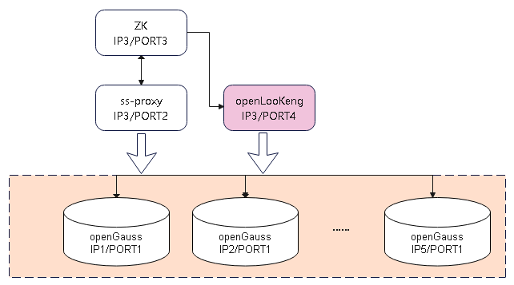
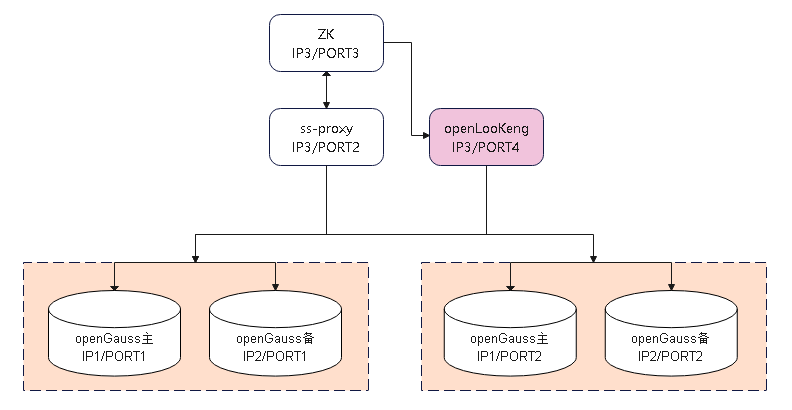

版权所有 © 2022  openGauss社区
 您对“本文档”的复制、使用、修改及分发受知识共享(Creative Commons)署名—相同方式共享4.0国际公共许可协议(以下简称“CC BY-SA 4.0”)的约束。为了方便用户理解，您可以通过访问https://creativecommons.org/licenses/by-sa/4.0/ 了解CC BY-SA 4.0的概要 (但不是替代)。CC BY-SA 4.0的完整协议内容您可以访问如下网址获取：https://creativecommons.org/licenses/by-sa/4.0/legalcode。

修订记录

| 日期       | 修订   版本 | 修改描述             | 作者       |
| ---------- | ----------- | -------------------- | ---------- |
| 2022-09-15 | 1.0         | 特性测试报告初稿完成 | peilinqian |

关键词： 

openGauss 分布式、ShardingSphere-Proxy、openLooKeng、OLAP、TPC-H

摘要：

本文档主要验证openLooKeng协同ShardingSphere，对分表分库的openGauss数据库的数据进行分析的功能，验证openGauss的OLAP能力。

缩略语清单：

| 缩略语   | 英文全名                     | 中文解释                                                     |
| -------- | ---------------------------- | ------------------------------------------------------------ |
| og       | openGauss                    | 开源数据库引擎                                               |
| olk      | openLooKeng                  | 大数据分析引擎                                               |
| ss-proxy | shardingsphere-Proxy         | 定位为透明化的数据库代理端，提供封装了数据库二进制协议的服务端版本，用于完成对异构语言的支持。 目前提供 MySQL 和 PostgreSQL（兼容 openGauss 等基于 PostgreSQL 的数据库）版本，它可以使用任何兼容 MySQL/PostgreSQL 协议的访问客户端（如：MySQL Command Client, MySQL Workbench, Navicat 等）操作数据，对 DBA 更加友好。 |
| ZK       | zookeeper                    | ZooKeeper 是 Apache 软件基金会的一个软件项目，它为大型分布式计算提供开源的分布式配置服务、同步服务和命名注册。 |
| OLAP     | Online Analytical Processing | 联机分析处理，大数据分析的应用技术，提供复杂的分析操作、侧重决策支持。 |
| TPC-H    | TPC-H                        | TPC-H是事务处理性能委员会（ Transaction ProcessingPerformance Council ）制定的基准程序之一，TPC- H 主要目的是评价特定查询的决策支持能力。 |

# 1     特性概述

openLookeng从shardingSphere注册中心访问元数据，订阅元数据修改通知，支持openLookeng根据元数据实现跨分片SQL改写和查询优化。

# 2     特性测试信息

| 版本名称                                     | 测试起始时间 | 测试结束时间 |
| -------------------------------------------- | ------------ | ------------ |
| openLooKeng CLI 1.6.0-RC5-70-g5abdf10-dirty  | 2022-6-24    | 2022-7-6     |
| openLooKeng CLI 1.6.0-RC5-213-gdf92160-dirty | 2022-9-9     | 2022-9-13    |
| openLooKeng CLI 1.6.0-RC5-216-g4b3da00-dirty | 2022-9-14    | 2022-9-26    |

**基础功能测试&读写分离性能比对测试环境硬件信息：**

| 硬件型号   | 硬件配置信息                                                 | 备注                                                         |
| ---------- | ------------------------------------------------------------ | ------------------------------------------------------------ |
| x86+centOS | CPU：Kunpeng 920-4826 2p 96核 内存：256GB 硬盘：300G OS：openEuler release 20.03 (LTS) 文件系统：EXT4 网卡：1GE | 3台主机组合配置部署 至少2分片openGauss、1ss-proxy、1zookeeper、1openLookeng |

**分片性能提升测试环境硬件信息：：**

| 硬件型号                                       | 硬件配置信息                                                 | 备注                  |
| ---------------------------------------------- | ------------------------------------------------------------ | --------------------- |
| ARM+openEuler 2P TaiShan 200 (Model 2280) | CPU：Kunpeng 920 7260 2p 128核 内存：24*32GB 硬盘：NVME 3T  OS：openEuler release 20.03 (LTS) 文件系统：XFS 网卡：10GE | openGauss数据库节点*5 |
| ARM+openEuler 2P TaiShan 200 (Model 2280) | CPU：Kunpeng 920 7260 2p 128核 内存：24*32GB OS：openEuler release 20.03 (LTS) 文件系统：XFS 网卡：10GE | ss-proxy、olk、zk节点 |

| 软件名称                                             | 软件版本                                                     | 备注                                                         |
| ---------------------------------------------------- | ------------------------------------------------------------ | ------------------------------------------------------------ |
| openLooKeng shardingsphere-Proxy openGauss | openLooKeng CLI 1.6.0-RC5-70-g5abdf10-dirty ShardingSphere-5.1.1官网发布二进制包 openGauss 3.0.0 8198a77b | ShardingSphere-5.1.1官网发布二进制包地址： https://archive.apache.org/dist/shardingsphere/5.1.1/apache-shardingsphere-5.1.1-shardingsphere-proxy-bin.tar.gz  |
| openLooKeng shardingsphere-Proxy openGauss | openLooKeng CLI 1.6.0-RC5-213-gdf92160-dirty ShardingSphere-5.2.0官网发布二进制包 openGuass 3.0.0 cad66d01 | ShardingSphere-5.2.0官网发布二进制包地址： https://archive.apache.org/dist/shardingsphere/5.2.0/apache-shardingsphere-5.2.0-shardingsphere-proxy-bin.tar.gz |
| openLooKeng shardingsphere-Proxy openGauss | openLooKeng CLI 1.6.0-RC5-216-g4b3da00-dirty ShardingSphere-5.2.0官网发布二进制包 openGuass 3.0.0 cad66d01 | ShardingSphere-5.2.0官网发布二进制包地址： https://archive.apache.org/dist/shardingsphere/5.2.0/apache-shardingsphere-5.2.0-shardingsphere-proxy-bin.tar.gz |
| zookeeper                                            | 3.8.0                                                        |                                                              |

# 3     测试结论概述

## 3.1   测试整体结论

共计执行46个用例，主要覆盖了功能测试、可靠性测试，性能测试。发现问题14个，关闭7个，遗留7个，整体质量一般；

| 测试活动   | 活动评价                                                     |
| ---------- | ------------------------------------------------------------ |
| 功能测试   | （1）验证openLooKeng从shardingSphere注册中心访问元数据信息正确，元数据信息修改变化后访问信息正确；包括表和视图的分片信息、读写分离信息； （2）验证openLooKeng与支持语法，测试覆盖：数据类型、select语法（filter/聚合函数/基础运算及函数）目前支持数据类型有限，以openlookeng官网资料说明为准；客户端查询存在优化类bug； （3）验证tpch 10G数据量级别下21条SQL查询语句功能验证（说明tpch SQL语句共22条，其中一条涉及create view操作，openLooKeng暂不支持该语法），测试结果与直连openGauss进行比对测试，结果一致； （4）验证指定分片单表、随机分片单表、分库不分表、分库分表、广播表、视图等对象查询功能正常，测试结果正确。 整体结论：存在部分问题，遗留处理，后续优化解决。验收通过。 |
| 可靠性测试 | 针对注册中心及opengauss分片进行故障注入，验证openLooKeng故障场景下正常提示报错，恢复故障后，功能正常、可正常查询。验收通过。 |
| 性能测试   | （1）验证相同数据量下，openGauss1分片、openLooKeng+openGauss1分片、openLooKeng+openGauss2分片、openLooKeng+openGauss3分片、openLooKeng+openGauss5分片，验证tpch查询SQL随着分片增加查询性能提升； （2）openLooKeng+openGauss2分片、openLooKeng+openGauss2分片读写分离场景，验证tpch查询SQL在读写分离场景下性能提升。 验收通过。 |

## 3.2   约束说明

（1）目前openLooKeng仅支持对openGauss的select语法，其他DDL、DML语法不支持；

（2）依赖shardingSphere+ZK注册中心+opengauss集群部署方式；

（3）Java 8 Update 161或更高版本(8u161+) (64位)。同时支持Oracle JDK和Open JDK；AArch64 (Bisheng JDK 1.8.262 或者更高版本)；

（4）openLooKeng存在支持数据类型限制，见"5.1 openLooKeng官网资料链接"章节；

（5）openLooKeng存在select语法使用限制，见"5.1 openLooKeng官网资料链接"章节；

（6）openLooKeng使用条件查询，部分数据类型作为查询条件字段需要进行显式转换，或者通过设置隐式转换开关`SET SESSION implicit_conversion=true`进行隐式转换，"5.1 openLooKeng官网资料链接"章节；

（7）其他测试过程发现约束见5.2、5.3章节。

## 3.3   遗留问题分析

### 3.3.1 遗留问题影响以及规避措施

| 问题单号                                                     | 问题描述                                                     | 问题级别 | 问题影响和规避措施                                           | 当前状态 |
| ------------------------------------------------------------ | ------------------------------------------------------------ | -------- | ------------------------------------------------------------ | -------- |
| [I5EDWV](https://gitee.com/openlookeng/hetu-core/issues/I5EDWV?from=project-issue) | OLK客户端执行表别名关联查询SQL，order by 不识别 (别名.列名)a.id。 | 主要     | 进行多表关联查询，不支持使用order by 别名.列名               | 打开     |
| [I5FNFZ](https://gitee.com/openlookeng/hetu-core/issues/I5FNFZ?from=project-issue) | OLK客户端执行查询，列数量较多情况下，无法查询所有列数据，未换行展示。 | 主要     | 会影响直连olk客户端查询结果展示，可通过-f执行sql文件，结果输出到文件中进行规避 | 打开     |
| [I5QXRJ](https://gitee.com/openlookeng/hetu-core/issues/I5QXRJ?from=project-issue) | time without time zone字段类型，opengauss与openlookeng查询结果不一致。 | 主要     | 会影响time without time zone字段类型查询使用                 | 打开     |
| [I5FTFL](https://gitee.com/openlookeng/hetu-core/issues/I5FTFL?from=project-issue) | OLK内核问题，目前部分字段支持，部分字段不支持，前端无相应提示信息。仅展示支持的字段查询结果。 | 主要     | 如果存在openlookeng不支持的字段时，前端无感知，会影响用户判断和查询结果 | 打开     |
| [I5FTJR](https://gitee.com/openlookeng/hetu-core/issues/I5FTJR?from=project-issue) | 设置隐式转换开关打开，进行隐式转换，uuid，json字段无法正常条件查询，隐式转换失败 | 次要     | 涉及uuid，json字段时，需要显式转换数据类型                   | 打开     |
| [I5T8KC](https://gitee.com/openlookeng/hetu-core/issues/I5T8KC?from=project-issue) | money字段类型不支持条件查询，提示 failed: line 1:43: '=' cannot be applied to double, varchar(5)。 | 主要     | 无法进行money字段类型作为filter条件查询                      | 打开     |
| [I5T8SW](https://gitee.com/openlookeng/hetu-core/issues/I5T8SW?from=project-issue) | olk不支持不区分大小写排序语法                                | 次要     | 不支持不区分大小写排序                                       | 打开     |

### 3.3.2 问题统计

|        | 问题总数 | 严重   | 主要   | 次要   | 不重要 |
| ------ | -------- | ------ | ------ | ------ | ------ |
| 数目   | 13       | 2      | 6      | 4      | 1      |
| 百分比 |          | 15.38% | 46.15% | 30.77% | 7.69%  |

### 3.3.3 问题单汇总

| 序号 | issue号                                                      | 问题级别 | 问题简述                                                     | 问题状态 |
| ---- | ------------------------------------------------------------ | -------- | ------------------------------------------------------------ | -------- |
| 1    | [I5DXD8](https://gitee.com/openlookeng/hetu-core/issues/I5DXD8?from=project-issue) | 严重     | openlookeng对接SS注册中心访问元数据，配置好相应信息后，启动OLK后，报错；原因：新版本SS元数据结构变化 | 关闭     |
| 2    | [I5E4CU](https://gitee.com/openlookeng/hetu-core/issues/I5E4CU?from=project-issue) | 次要     | 正常stop start 后，相关的日志信息配置路径下无生成的文件。--目前日志默认生成到**/data/var/log路径，与配置的路径无关；社区资料说明进行规避。 | 关闭     |
| 3    | [I5E4BQ](https://gitee.com/openlookeng/hetu-core/issues/I5E4BQ?from=project-issue) | 不重要   | OLK对接ss ZK注册中心后，run启动OLK日志报错java.sql.SQLFeatureNotSupportedExceptio，--定位结果，warning提示信息，不影响功能，非问题关闭。 | 关闭     |
| 4    | [I5E4BF](https://gitee.com/openlookeng/hetu-core/issues/I5E4BF?from=project-issue) | 主要     | OLK对接sharding ZK注册中心场景，使用类型为nvarchar/name/text类型的列进行条件查询，异常无返回。 | 关闭     |
| 5    | [I5EDWV](https://gitee.com/openlookeng/hetu-core/issues/I5EDWV?from=project-issue) | 主要     | OLK客户端执行表别名关联查询SQL，order by 不识别 (别名.列名)a.id；--olk内核不支持该查询场景。 | 打开     |
| 6    | [I5FNFZ](https://gitee.com/openlookeng/hetu-core/issues/I5FNFZ?from=project-issue) | 主要     | OLK客户端执行查询，列数量较多情况下，无法查询所有列数据，未换行展示；--olk内核问题，只能通过-f输出到文件中。 | 打开     |
| 7    | [I5FQ40](https://gitee.com/openlookeng/hetu-core/issues/I5FQ40) | 次要     | OLK对接sharding ZK注册中心场景，sharding创建的单表，在olk客户端show tables存在，但是实际select查询概率性提示表不存在，存在缓存影响；--适配5.2.0版本目前随机单表支持OLK查询。 | 关闭     |
| 8    | [I5FTFL](https://gitee.com/openlookeng/hetu-core/issues/I5FTFL?from=project-issue) | 主要     | OLK对接sharding ZK注册中心场景，目前OLK部分表字段类型不支持，查询表时，提示表不存在；--OLK内核问题，目前部分字段支持，部分字段不支持，无相应提示信息。 | 打开     |
| 9    | [I5FTJR](https://gitee.com/openlookeng/hetu-core/issues/I5FTJR?from=project-issue) | 次要     | 设置隐式转换开关打开，进行隐式转换，uuid，json字段无法正常条件查询，隐式转换失败 | 打开     |
| 10   | [I5QXRJ](https://gitee.com/openlookeng/hetu-core/issues/I5QXRJ?from=project-issue) | 主要     | time without time zone字段类型，opengauss与openlookeng查询结果不一致。 | 打开     |
| 11   | [I5PFRI](https://gitee.com/openlookeng/hetu-core/issues/I5PFRI?from=project-issue) | 次要     | 精度decimal(38,12)字段进行数学运算，存在溢出Decimal overflow。--官网通过资料说明。支持最高精度为38，当精度查过38时无法支持。 | 关闭     |
| 12   | [I5QY0J](https://gitee.com/openlookeng/hetu-core/issues/I5QY0J?from=project-issue) | 严重     | sharding 5.2.0版本对接olk，配置xa事务情况下，olk执行查询sql语句报错。 | 关闭     |
| 13   | [I5T8KC](https://gitee.com/openlookeng/hetu-core/issues/I5T8KC?from=project-issue) | 主要     | money字段类型不支持条件查询，提示 failed: line 1:43: '=' cannot be applied to double, varchar(5)。 | 打开     |
| 14   | [I5T8SW](https://gitee.com/openlookeng/hetu-core/issues/I5T8SW?from=project-issue) | 次要     | olk不支持不区分大小写排序语法                                | 打开     |

# 4     测试执行

## 4.1   测试组网图

**功能测试组网：**

**性能读写分离测试组网：**

## 4.2   测试执行统计数据

| 版本名称                                     | 测试用例数           | 用例执行结果                                  | 发现问题单数 |
| -------------------------------------------- | -------------------- | --------------------------------------------- | ------------ |
| openLooKeng CLI 1.6.0-RC5-70-g5abdf10-dirty  | 46                   | Passed：41 Failed：5                      | 9            |
| openLooKeng CLI 1.6.0-RC5-213-gdf92160-dirty | 46 回归issue：5 | Passed：44 Failed：2 issue passed：5 | 5            |
| openLooKeng CLI 1.6.0-RC5-216-g4b3da00-dirty | 回归issue：2         | issue passed：2                               | 0            |

*数据项说明：*

- 全量功能覆盖两轮测试：

  第一轮测试openLooKeng适配shardingSphere5.1.1官网包，执行用例46个，通过41个，不通过5个；发现问题9个；

  第二轮测试openLooKeng适配shardingSphere5.2.0官网包，执行用例46个，通过44个，不通过2个；回归问题单5个，均通过；新增问题单5个；

  第三轮进行问题单回归2个；

- 累计发现缺陷14个，其中7个已修复或者通过资料规避，遗留缺陷单7个；

- 最终测试用例执行通过44个，不通过2个；

- 缺陷密度为14(缺陷个数)/4k(代码行数)=3.5(个/kloc)。

## 4.3   性能测试数据统计

### 4.3.1  分片扩展比性能测试场景：

| 场景场景       | og 1分片 耗时/s | olk 1分片 耗时/s | olk 2分片 耗时/s | olk 3分片 耗时/s | olk 5分片 耗时/s | olk 1分片性能损耗 | olk2分片性能提升 | olk3分片性能提升 | olk5分片性能提升 |
| -------------- | --------------- | ---------------- | ---------------- | ---------------- | ---------------- | ----------------- | ---------------- | ---------------- | ---------------- |
| tpch sql语句1  | 278             | 855              | 451              | 327              | 212              | 207.55%           | 47.25%           | 61.75%           | 75.20%           |
| tpch sql语句2  | 7               | 35               | 20               | 14               | 10               | 400.00%           | 42.86%           | 60.00%           | 71.43%           |
| tpch sql语句3  | 37              | 157              | 87               | 57               | 39               | 324.32%           | 44.59%           | 63.69%           | 75.16%           |
| tpch sql语句4  | 36              | 86               | 53               | 40               | 26               | 138.89%           | 38.37%           | 53.49%           | 69.77%           |
| tpch sql语句5  | 38              | 288              | 160              | 115              | 70               | 657.89%           | 44.44%           | 60.07%           | 75.69%           |
| tpch sql语句6  | 29              | 45               | 22               | 15               | 11               | 55.17%            | 51.11%           | 66.67%           | 75.56%           |
| tpch sql语句7  | 38              | 195              | 111              | 80               | 50               | 413.16%           | 43.08%           | 58.97%           | 74.36%           |
| tpch sql语句8  | 30              | 314              | 180              | 134              | 83               | 946.67%           | 42.68%           | 57.32%           | 73.57%           |
| tpch sql语句9  | 253             | 407              | 228              | 164              | 100              | 60.87%            | 43.98%           | 59.71%           | 75.43%           |
| tpch sql语句10 | 51              | 92               | 52               | 37               | 25               | 80.39%            | 43.48%           | 59.78%           | 72.83%           |
| tpch sql语句11 | 7               | 32               | 23               | 16               | 11               | 357.14%           | 28.13%           | 50.00%           | 65.63%           |
| tpch sql语句12 | 48              | 68               | 37               | 26               | 18               | 41.67%            | 45.59%           | 61.76%           | 73.53%           |
| tpch sql语句13 | 28              | 43               | 30               | 20               | 14               | 53.57%            | 30.23%           | 53.49%           | 67.44%           |
| tpch sql语句14 | 33              | 37               | 17               | 12               | 8                | 12.12%            | 54.05%           | 67.57%           | 78.38%           |
| tpch sql语句16 | 9               | 20               | 13               | 10               | 7                | 122.22%           | 35.00%           | 50.00%           | 65.00%           |
| tpch sql语句17 | 42              | 389              | 234              | 161              | 101              | 826.19%           | 39.85%           | 58.61%           | 74.04%           |
| tpch sql语句18 | 97              | 201              | 111              | 90               | 65               | 107.22%           | 44.78%           | 55.22%           | 67.66%           |
| tpch sql语句19 | 42              | 45               | 24               | 17               | 12               | 7.14%             | 46.67%           | 62.22%           | 73.33%           |
| tpch sql语句20 | 44              | 89               | 48               | 32               | 21               | 102.27%           | 46.07%           | 64.04%           | 76.40%           |
| tpch sql语句21 | 94              | 370              | 206              | 147              | 103              | 293.62%           | 44.32%           | 60.27%           | 72.16%           |
| tpch sql语句22 | 9               | 32               | 20               | 13               | 9                | 255.56%           | 37.50%           | 59.38%           | 71.88%           |

### 4.3.2 读写分离性能提升测试场景：

| 场景场景       | olk 2分片 耗时/s | olk 2分片读写分离 耗时/s | olk 2分片读写分离 性能提升 |
| -------------- | --------------------- | ----------------------------- | :------------------------------ |
| tpch sql语句1  | 415                   | 236                           | 43.13%                          |
| tpch sql语句2  | 25                    | 21                            | 16.00%                          |
| tpch sql语句3  | 90.5                  | 57                            | 37.02%                          |
| tpch sql语句4  | 47.5                  | 25                            | 47.37%                          |
| tpch sql语句5  | 178.5                 | 108                           | 39.50%                          |
| tpch sql语句6  | 23                    | 13                            | 43.48%                          |
| tpch sql语句7  | 103.5                 | 62                            | 40.10%                          |
| tpch sql语句8  | 209                   | 124                           | 40.67%                          |
| tpch sql语句9  | 251.5                 | 161                           | 35.98%                          |
| tpch sql语句10 | 57                    | 28                            | 50.88%                          |
| tpch sql语句11 | 28                    | 21                            | 25.00%                          |
| tpch sql语句12 | 37                    | 20                            | 45.95%                          |
| tpch sql语句13 | 32                    | 18                            | 43.75%                          |
| tpch sql语句14 | 17                    | 10                            | 41.18%                          |
| tpch sql语句16 | 16.5                  | 12                            | 27.27%                          |
| tpch sql语句17 | 230.5                 | 139                           | 39.70%                          |
| tpch sql语句18 | 138.5                 | 104                           | 24.91%                          |
| tpch sql语句19 | 24                    | 15                            | 37.50%                          |
| tpch sql语句20 | 50.5                  | 32                            | 36.63%                          |
| tpch sql语句21 | 215.5                 | 140                           | 35.03%                          |
| tpch sql语句22 | 14.5                  | 8                             | 44.83%                          |

备注：

- 所有场景均按照TPCH 10G基础数据进行测试；
- 读写分离场景为每分片下一主一备，主备均进行读路由。

## 4.4   后续测试建议

- 本轮覆盖测试数据类型、查询SQL语法等比较有限，后续可以从实际业务角度进行测试覆盖。
- 本轮覆盖未涉及openLooKeng相关JVM参数配置(jvm.config)、属性配置（config.properties服务器的配置）不同数据量查询场景下，依赖jvm配置内存如何计算；以及coordinator、worker机器配置不同节点，各节点内存相关参数如何配置。如果内存参数配置不合理，对整个openLooKeng性能及功能会有何影响等。

# 5     附件

## 5.1  openLooKeng官网资料链接

- openLookeng部署文档：

  https://docs.openlookeng.io/zh/docs/docs/installation/deployment.html

- openLooKeng支持数据类型文档：

  https://docs.openlookeng.io/zh/docs/docs/language/types.html

- openLooKeng支持SELECT语法文档：

  https://docs.openlookeng.io/zh/docs/docs/sql/select.html

- openLookeng数据类型转换文档：

  https://docs.openlookeng.io/zh/docs/docs/functions/vonversion.html

## 5.2   目前数据类型使用限制

- openLooKeng支持数字类型精度最大值为38；
- avg(DECIMAL[(p[,s])])结果精度按字段本身精度计算，例如decimal字段a精度为0，avg(a)结果精度也为0；

## 5.3   目前select语句使用限制

| 语法                            | 支持场景                                                     | 不支持场景                                                   |
| ------------------------------- | ------------------------------------------------------------ | ------------------------------------------------------------ |
| limit …offset offset…limit | select * from t_broadcast offset 3 limit 10；                | select * from t_broadcast limit 10 offset 3；                |
| window                          | select count(*) over (partition by a) typecount from t_broadcast where a =11; | 不支持over条件定义到后面 select count(*) over window1 typecount from t_broadcast where a =11 window window1 as (partition by a); |
| NLSSORT 不区分大小写排序        | 无                                                           | select * from t_broadcast order by NLSSORT(b,'NLS_SORT=generic_m_ci'); |

 

 

 
