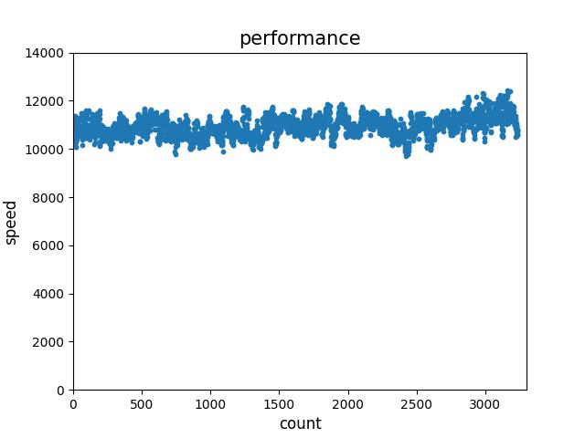
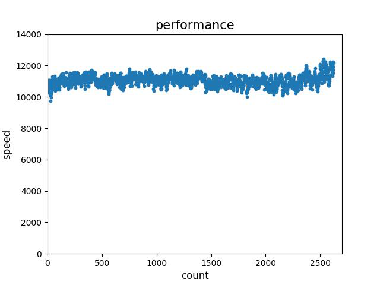
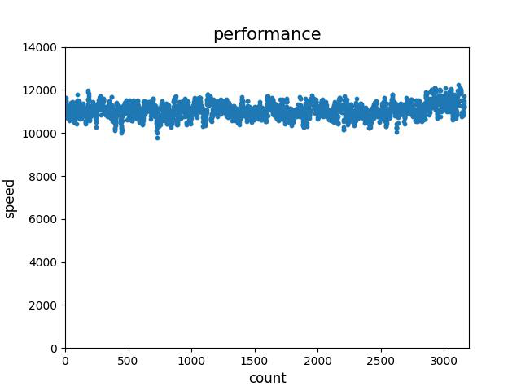
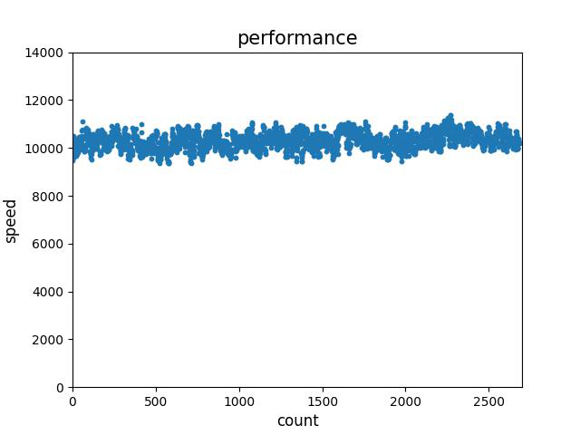

版权所有 © 2022  openGauss社区
 您对“本文档”的复制、使用、修改及分发受知识共享(Creative Commons)署名—相同方式共享4.0国际公共许可协议(以下简称“CC BY-SA 4.0”)的约束。为了方便用户理解，您可以通过访问https://creativecommons.org/licenses/by-sa/4.0/ 了解CC BY-SA 4.0的概要 (但不是替代)。CC BY-SA 4.0的完整协议内容您可以访问如下网址获取：https://creativecommons.org/licenses/by-sa/4.0/legalcode。

修订记录

| 日期       | 修订版本 | 修改描述         | 作者  |
| ---------- | -------- | ---------------- | ----- |
| 2022/09/21 | 1.0      | 特性报告初稿完成 | lixin |
| 2022/09/27 | 1.1      | 根据评审意见修改 | lixin |
| 2022/09/29 | 1.2      | 根据评审意见修改 | lixin |

关键词： `Chameleon`、在线迁移、性能

摘要：本文档主要是对测试需求“Mysql 增量迁移性能提升，支持1w tps”的相关介绍，测试通过使用`Chameleon`工具，从`Mysql`在线迁移数据至`openGauss`数据库，包含原有功能的验证、性能测试及迁移后数据校验，并给出最终测试结论。

缩略语清单：

| 缩略语      | 英文全名                 | 中文解释                                         |
| ----------- | ------------------------ | ------------------------------------------------ |
| `tps`       | `Transaction Per Second` | 每秒事务数                                       |

# 1     特性概述

`MySQL` 增量迁移性能提升，支持1w `tps`，该特性基于`Chameleon`工具，实现从`MySQL`在线迁移至`openGauss`数据库，对于`DML`操作，迁移速率可达1w `tps`。该特性可提升在线迁移的效率，并保证源端数据库（`MySQL`）和目的端数据库（`openGauss`）的事务提交顺序，保证事务的一致性。

# 2     特性测试信息

| 版本名称                        | 测试起始时间 | 测试结束时间 |
| ------------------------------- | ------------ | ------------ |
| `Chameleon 3.0.0 build e18a0f7` | 2022-06-14   | 2022-06-30   |
| `Chameleon 3.0.0 build 2cec5d3` | 2022-07-28   | 2022-07-29   |
| `Chameleon 3.0.0 build 991b60c` | 2022-09-22   | 2022-09-22   |
| `Chameleon 3.1.0 build d55415d` | 2022-09-27   | 2022-09-27   |

| 环境信息                                       | 配置信息                                                     | 备注      |
| ---------------------------------------------- | ------------------------------------------------------------ | --------- |
| ARM+openEuler 2P<br />TaiShan 200 (Model 2280) | CPU：Kunpeng 920 7260 2p 128核<br />内存：765G<br />硬盘：2*3T<br />OS：openEuler release 20.03 (LTS-SP1) | openGauss |
| ARM+openEuler 2P<br />TaiShan 200 (Model 2280) | CPU：Kunpeng 920 7260 2p 128核<br />内存：765GB<br />硬盘：3T<br />OS：openEuler release 20.03 (LTS) | Chameleon |
| ARM+openEuler 2P<br />TaiShan 200 (Model 2280) | CPU：Kunpeng 920 7260 2p 128核<br />内存：765GB<br />硬盘：3*3T<br />OS：openEuler release 20.03 (LTS) | MySQL     |
| ARM+openEuler 2P<br />TaiShan 200 (Model 2280) | CPU：Kunpeng 920 7260 2p 128核<br />内存：765GB<br />硬盘：1.1T<br />OS：openEuler release 20.03 (LTS) | Sysbench  |

| 软件名称                  | 软件版本 | 备注 |
| ------------------------- | -------- | ---- |
| `openGauss build 6f790c7` | 3.0.0    |      |
| `openGauss build b2c6e04` | 3.1.0    |      |
| `sysbench`                | 1.0.20   |      |
| `MySQL`                   | 5.7.27   |      |

# 3     测试结论概述

## 3.1   测试整体结论

共设计26个用例，主要包含DML操作在线迁移性能测试场景、在线迁移后数据一致性校验及原有基本功能覆盖。共计发现14个问题，其中11个已修复且回归验证通过，1个转需求，2个非问题取消，整体质量一般。

| 测试活动 | 活动评价                                           |
| -------- | -------------------------------------------------- |
| 性能测试 | 测试DML操作在线迁移性能                            |
| 功能测试 | 测试在线迁移后数据的有序性、一致性及准确不丢失     |
| 功能测试 | 测试为保证性能提升的代码改动不影响该工具的原有功能 |

## 3.2   约束说明

- `MySQL5.7`及以上版本

- `MySQL`参数设置：

  `log_bin`=`ON`, `binlog_format`=`ROW`, `binlog_row_image`=`FULL`, `gtid_mode` = `ON`

- 先进行离线复制，再进行在线复制

## 3.3   遗留问题分析

### 3.3.1 遗留问题影响以及规避措施

| 问题单号                                                     | 问题描述                                                   | 问题级别 | 问题影响和规避措施                                           | 当前状态 |
| ------------------------------------------------------------ | ---------------------------------------------------------- | -------- | ------------------------------------------------------------ | -------- |
|NA |            |      | |    |


### 3.3.2 问题统计

|        | 问题总数 | 严重 | 主要 | 次要 | 不重要 |
| ------ | -------- | ---- | ---- | ---- | ------ |
| 数目   | 14       | 0    | 2    | 12    | 0      |
| 百分比 |    100%      | 0%   | 14%   | 86%  | 0%    |

### 3.3.3 问题单汇总

|序号| issue号                                                      | 级别 | 问题简述                                     | 状态   |
| ---- | ------------------------------------------------------------ | ---- | -------------------------------------------- | ------ |
| 1    | [I5G9FZ](https://gitee.com/opengauss/openGauss-tools-chameleon/issues/I5G9FZ?from=project-issue) | 主要 | 在线迁移过程中，数据未迁移完时停止，再开启，反复，发现opengauss侧数据量大于源数据库 | 转需求 |
| 2 | [I5DKB8](https://gitee.com/opengauss/openGauss-tools-chameleon/issues/I5DKB8?from=project-issue) | 主要 | chameleon drop_replic_schema无法停掉迁移进程 | 已验收 |
| 3 | [I5CTJM](https://gitee.com/opengauss/openGauss-tools-chameleon/issues/I5CTJM?from=project-issue) | 次要 | 更改配置文件中pg_conn信息未生效 | 已验收 |
| 4 | [I5GPPD](https://gitee.com/opengauss/openGauss-tools-chameleon/issues/I5GPPD?from=project-issue) | 次要 | 修改chameloen使用指南关于type_override的描述                 | 已验收 |
| 5 | [I5GFIV](https://gitee.com/opengauss/openGauss-tools-chameleon/issues/I5GFIV?from=project-issuee) | 次要 | 在线迁移过程中，mysql重命名表，未迁移至openGauss | 已验收 |
| 6 | [I5G9GS](https://gitee.com/opengauss/openGauss-tools-chameleon/issues/I5G9GS?from=project-issue) | 次要 | 在线迁移过程中，另开一个窗口停止在线迁移，两个窗口均无法再开启在线迁移 | 已验收 |
| 7 | [I5G79C](https://gitee.com/opengauss/openGauss-tools-chameleon/issues/I5G79C) | 次要 | 设置skip_event:insert/update/delete后,实际在线迁移发现未生效 | 已验收 |
| 8 | [I5F2TI](https://gitee.com/opengauss/openGauss-tools-chameleon/issues/I5F2TI?from=project-issue) | 次要 | chamelon init后,期待查询迁移状态时报错，实际没报错，且表迁移至opengauss了，但是表数据未迁移成功 | 已验收 |
| 9 | [I5F2PZ](https://gitee.com/opengauss/openGauss-tools-chameleon/issues/I5F2PZ?from=project-issue) | 次要   | chameleon init后，tinyint类型变为bigint,与资料显示不一致 | 已验收 |
| 10 | [I5F2IT](https://gitee.com/opengauss/openGauss-tools-chameleon/issues/I5F2IT) | 次要 | pg_chameleon迁移mysql中普通表，表字段类型覆盖数值类型(有符号)，开启在线迁移后，mysql插入数据，在线迁移报错 | 已验收 |
| 11 | [I5CTQ2](https://gitee.com/opengauss/openGauss-tools-chameleon/issues/I5CTQ2?from=project-issue) | 次要 | 开启在线迁移报错struct.error:unpack requires a buffer of 20 bytes | 已验收 |
| 12 | [I5F2B9](https://gitee.com/opengauss/openGauss-tools-chameleon/issues/I5F2B9?from=project-issue) | 次要 | 开启在线迁移后，表字段含几何类型的表，插入数据并未迁移成功 | 已验收 |
| 13 | [I5G7RY](https://gitee.com/opengauss/openGauss-tools-chameleon/issues/I5G7RY?from=project-issue) | 次要 | 重复执行stop在线迁移命令，导致执行drop在线迁移命令时，回显there is already a database connection active | 已取消 |
| 14 | [I5JG1T](https://gitee.com/opengauss/openGauss-tools-chameleon/issues/I5JG1T?from=project-issue) | 次要 |  chameleon在线迁移，update、delete性能不足1w tps | 已取消 |


# 4     测试执行

## 4.1 测试执行步骤

###  4.1.1 测试DML操作在线迁移性能

| 测试步骤                                                     | 测试结果                        |
| ------------------------------------------------------------ | ------------------------------- |
| 1. Sysbench执行prepare命令，准备数据：numactl -C 121-127 sysbench --db-driver=mysql --debug=off --test=/xx/xx/sysbench/sysbench-1.0/tests/include/oltp_legacy/insert1.lua --oltp-test-mode=complex --mysql-host=xx.xx.xx.xx --mysql-port=3306 --mysql-db=xxx --mysql-password=xxx --time=400  --max-requests=0  --mysql-user=xx --mysql-table-engine=innodb --oltp-table-size=1000  --oltp-tables-count=100 --threads=50 --oltp-read-write --report-interval=10 prepare<br />mysql查看表及数据是否准备就绪<br />2. Chameleon离线迁移数据至openGauss<br />chameleon create_replica_schema --config default<br />chameleon add_source --config default --source mysql<br />chameleon init_replica --config default --source mysql<br />openGauss设置当前为配置参数中的schema，查看数据是否迁移成功<br />3. Chameleon开启在线迁移<br />chameleon start_replica --config default --source mysql<br />4. Sysbench执行run命令，向mysql压测数据<br />numactl -C 121-127 sysbench --db-driver=mysql --debug=off --test=/xx/xx/sysbench/sysbench-1.0/tests/include/oltp_legacy/insert1.lua --oltp-test-mode=complex --mysql-host=xx.xx.xx.xx --mysql-port=3306 --mysql-db=xxx --mysql-password=xxx --time=400  --max-requests=0  --mysql-user=xx --mysql-table-engine=innodb --oltp-table-size=1000  --oltp-tables-count=100 --threads=50 --oltp-read-write --report-interval=10 run<br />5.统计Chameleon日志，计算迁移效率10000/(相邻像个时间之差)<br />6. 结束复制过程及清理资源<br />Chameleon：<br />chameleon stop_replica --config default --source mysql<br />chameleon detach_replica --config default --source mysql<br />chameleon drop_replica_schema --config default<br /><br />Sysbench:<br />numactl -C 121-127 sysbench --db-driver=mysql --debug=off --test=/xx/xx/sysbench/sysbench-1.0/tests/include/oltp_legacy/insert1.lua --oltp-test-mode=complex --mysql-host=xx.xx.xx.xx --mysql-port=3306 --mysql-db=xxx --mysql-password=xxx --time=400  --max-requests=0  --mysql-user=xx --mysql-table-engine=innodb --oltp-table-size=1000  --oltp-tables-count=100 --threads=50 --oltp-read-write --report-interval=10 cleanup<br /> | 执行7条用例，发现1个bug，待解决 |

### 4.1.2测试在线迁移后数据的有序性、一致性及准确不丢失

| 测试步骤                                                     | 测试结果                          |
| ------------------------------------------------------------ | --------------------------------- |
| 1. 设计不同场景，如有序数据迁移后查看其顺序、批量迁移、多窗口并发插入等，来校验在线迁移后数据的有序性、一致性及准确不丢失<br />2. 清理环境 | 执行9条用例，发现1个bug，已转需求 |

### 4.1.3测试为保证性能提升的代码改动不影响该工具的原有功能

| 测试步骤                                                     | 测试结果                                                     |
| ------------------------------------------------------------ | ------------------------------------------------------------ |
| 1. 测试断点续传、在线迁移过程中DDL操作、schema_mappings配置、常见数据类型及类型转换等原有功能无异常<br />2. 清理环境 | 执行10条用例，发现13个bug，其中11个已验证修复通过，1个非问题已取消，1个待解决 |

## 4.2  测试执行统计数据

| 版本名称                       | 测试用例数 | 用例执行结果            | 发现问题单数 |
| ------------------------------ | ---------- | ----------------------- | ------------ |
| Chameleon 3.0.0 build e18a0f7 | 26         | Passed：21<br>Failed：5 | 14           |
| Chameleon 3.1.0 build d55415d | 回归issue：11         |issue Passed：11 | 0           |

*数据项说明：*

* 累计发现缺陷14个，其中11个已修复且回归验证通过，1个转需求，2个非问题取消
* 缺陷密度为 11(缺陷个数)/0.939k(代码行数)=11.71(个/kloc)

## 4.3   后续测试建议

迁移数据后，一定要确保数据的准确性、一致性及有序性，请后续测试中一定要校验该项。

# **5     附件**

## 5.1 测试数据统计方式
- 以insert场景为例，执行4.1.1中测试步骤，Sysbench创建不含主键的表，其它执行参数选择如下:

| threads                      |  oltp-table-count | oltp-table-size            |  time |
| ------------------------------ | ---------- | ----------------------- | ------------ |
|150 | 100         | 1000| 300           |

- Chameleon开启在线迁移后，Sysbench向MySQL压测数据，Chameleon打印日志如下：
```
print result replay process have finished 10000 transaction, time is 2022-07-14 07:51:11.722
print result replay process have finished 20000 transaction, time is 2022-07-14 07:51:12.650
print result replay process have finished 30000 transaction, time is 2022-07-14 07:51:13.577
print result replay process have finished 40000 transaction, time is 2022-07-14 07:51:14.507
print result replay process have finished 50000 transaction, time is 2022-07-14 07:51:15.414
print result replay process have finished 60000 transaction, time is 2022-07-14 07:51:16.387
print result replay process have finished 70000 transaction, time is 2022-07-14 07:51:17.350
...
```                   
- tps计算方式为：10000/（相邻两条日志时间差），如：<br>

|日志打印时间               | 日志打印时间| 时间差           | 计算方式| tps|
| ------------------------------ | ---------- | ----------------------- | ------------ | ------------ |
|2022-07-14 07:51:11.722 |2022-07-14 07:51:12.650| 0.928| 10000/0.928=10776    | 10776 |
|2022-07-14 07:51:12.650 |2022-07-14 07:51:13.577| 0.927| 10000/0.928=10787    | 10787 |
|2022-07-14 07:51:13.577 |2022-07-14 07:51:14.507| 0.930| 10000/0.928=10753    | 10753 |
|2022-07-14 07:51:14.507 | 2022-07-14 07:51:15.414| 0.907| 10000/0.928=11025    | 11025 |

- 统计上表所有tps数据，绘制散点图如下：
  

- 同以上方法，测试insert场景过程中其它统计散点图，展示如下： 
  
  
  
                        

****
