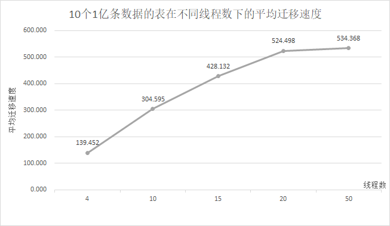
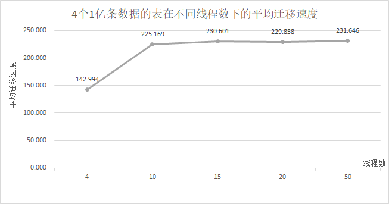
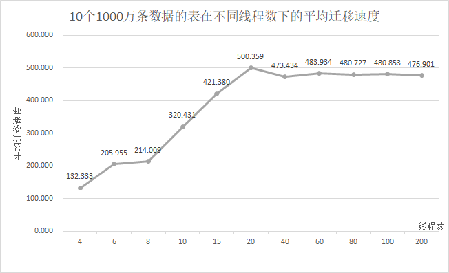

版权所有 © 2022  openGauss社区
 您对“本文档”的复制、使用、修改及分发受知识共享(Creative Commons)署名—相同方式共享4.0国际公共许可协议(以下简称“CC BY-SA 4.0”)的约束。为了方便用户理解，您可以通过访问https://creativecommons.org/licenses/by-sa/4.0/ 了解CC BY-SA 4.0的概要 (但不是替代)。CC BY-SA 4.0的完整协议内容您可以访问如下网址获取：https://creativecommons.org/licenses/by-sa/4.0/legalcode。

修订记录

| 日期       | 修订   版本 | 修改描述                 | 作者      |
| ---------- | ----------- | ------------------------ | --------- |
| 2022.06.08 | V1.0        | 初稿                     | zhanghang |
| 2022.07.28 | V1.1        | 根据评审意见修改测试报告 | zhanghang |
|            |             |                          |           |

 关键词： 

chameleon、全量迁移、性能、100MB/s

 摘要：

本文档内容为验证在特定场景下借助chameleon工具从MySQL数据库向openGauss数据库进行全量迁移，迁移性能满足100MB/s。

缩略语清单：

| 缩略语 | 英文全名 | 中文解释 |
| ------ | -------- | -------- |
| NA     |          |          |

# 1     特性概述

在特定场景下借助chameleon工具从MySQL数据库向openGauss数据库进行全量数据迁移，迁移性能满足100MB/s。

特定场景如下：当olt-table-size > 10万、olt-tables-count > 2、总Size > 100MB且读/写线程数 = olt-tables-count时，MySQL数据全量迁移性能满足100MB/s。

# 2     特性测试信息

被测对象的版本信息：

| 版本名称                       | 测试起始时间 | 测试结束时间 |
| ------------------------------ | :----------- | ------------ |
| openGauss 3.0.0 build 475170ca | 2022-05-19   | 2022-06-07   |
| MySQL 5.7.27                   | 2022-05-19   | 2022-06-07   |
| chameleon 3.0.0                | 2022-05-19   | 2022-06-07   |
| sysbench 1.0.20                | 2022-05-19   | 2022-06-07   |

硬件环境信息：

| 硬件型号                 | 硬件配置信息                                                 | 备注                           |
| ------------------------ | ------------------------------------------------------------ | ------------------------------ |
| TaiShan 200 (Model 2280) | Architecture：aarch64<br />CPU：kunpeng-920 7260<br />内存：768GB<br />硬盘：3.0TB<br />OS：openEuler release 20.03 (LTS-SP1) | openGauss 3.0.0 build 475170ca |
| TaiShan 200 (Model 2280) | Architecture：aarch64<br />CPU：kunpeng-920 7260<br />内存：768GB<br />硬盘：3.0TB<br />OS：openEuler release 20.03 (LTS-SP1) | MySQL 5.7.27                   |
| TaiShan 200 (Model 2280) | Architecture：aarch64<br />CPU：kunpeng-920 7260<br />内存：768GB<br />硬盘：3.0TB<br />OS：openEuler release 20.03 (LTS-SP1) | chameleon 3.0.0                |
| TaiShan 200 (Model 2280) | Architecture：aarch64<br />CPU：kunpeng-920 7260<br />内存：768GB<br />硬盘：1.1TB<br />OS：openEuler release 20.03 (LTS-SP1) | sysbench 1.0.20                |

# 3     测试结论概述

## 3.1   测试整体结论

MySQL数据全量迁移性能满足100MB/s特性，共执行用例7个，无问题单，无遗留风险，整体质量良好。

根据测试数据，得出结论：当olt-table-size > 10万、olt-tables-count > 2、总Size > 100MB且读/写线程数 = olt-tables-count时，MySQL数据全量迁移性能满足100MB/s。

## 3.2   约束说明

1、MySQL 5.7.27数据库除初始用户外的数据库用户均有复制权；配置文件添加以下参数：

```shell
[mysqld]
max_connections=1000
max_connect_errors=1500
tmp_table_size=256M
max_heap_table_size=256M
innodb_data_file_path=ibdata1:10M:autoextend
```

2、openGauss所在环境数据盘，需要采用的文件系统类型为xfs，数据块大小为8KB，openGauss使用高性能配置部署，绑核启动，openGauss侧的目标库为兼容B库，除初始用户外的数据库用户均有复制权。

3、chameleon工具已安装并完成配置（本次测试不考虑readers、writers（本报告中的读/写线程数）不相等的情况）。

4、sysbench已安装。

5、只有一张表时，迁移性能无法满足100MB/s。

6、部分场景下，迁移性能无法满足100MB/s。

（1）任意场景下，只有一个表时，迁移速度不满足100MB/s

（2）总Size较小时（约100MB），迁移速度不满足100MB/s

（3）olt-table-size较小且读/写线程数较少时，会出现迁移速度不满足100MB/s的场景

（4）olt-table-size较小且olt-tables-count较小时，会出现迁移速度不满足100MB/s的场景

# 4     测试执行

## 4.1   测试实现步骤

1、借助sysbench工具在MySQL的目标库中生成数据（lua脚本中create_insert功能模块中条件为db_driver == "mysql"时，将char修改为varchar，然后使用sysbench生成数据。sysbench生成的数据总量 = data_pieces * table_num）

``` shell
numactl -C cpu_num1-cpu_num2 sysbench --test=[path_to_lua] --mysql-host=[ip] --mysql-port=[port] --mysql-db=[db_name] --mysql-user=[user] --mysql-password=[password] --olt-tables-count=[table_num] --olt-table-size=[data_pieces] --mysql-table-engine=innodb --db-driver=mysql --debug=off --report-interval=[num] --threads=[num] --time=[num] prepare
```

2、配置chameleon（详见[chameleon使用指南.md](https://gitee.com/opengauss/openGauss-tools-chameleon/blob/master/chameleon%E4%BD%BF%E7%94%A8%E6%8C%87%E5%8D%97.md)）

3、使用chameleon工具进行全量数据迁移，执行命令后，获取real的时间（real的时间为全量迁移过程的用时）

```shell
time chameleon init_replica --config default --source mysql --debug
```

4、查看openGauss侧迁移后的表的数据量

5、计算迁移速度，查看迁移速度是否满足100MB/s

迁移速度 = 总Size / 迁移耗时，其中总Size是openGauss侧查询迁移后所有表的Size之和，迁移耗时是全量数据迁移命令执行完成后real的时间

## 4.2   测试数据统计

根据用例进行测试验证，结果如下（表中红色字体的数据行是迁移性能不满足100MB/s的场景，蓝色字体的数据行是迁移性能满足100MB/s的场景）：

### 4.2.1   chameleon的读/写线程数设置为10，sysbench的olt-tables-count等于10，改变olt-table-size

<center> 表1  读/写线程数和olt-tables-count等于10，olt-table-size改变时所测得的平均迁移速度</center>

<figure><table>
<thead>
<tr><th style='text-align:left;' >olt-table-size</th><th>总Size（MB）</th><th>平均迁移速度（MB/s）</th></tr>
</thead>
<tbody>
    <tr><td style='text-align:left;' ><font color='blue'>5亿</font></td><td><font color='blue'>1029120</font></td><td><font color='blue'>288.422</font></td></tr>
    <tr><td style='text-align:left;' ><font color='blue'>1亿</font></td><td><font color='blue'>204800</font></td><td><font color='blue'>306.013</font></td></tr>
    <tr><td style='text-align:left;' ><font color='blue'>5000万</font></td><td><font color='blue'>102400</font></td><td><font color='blue'>315.940</font></td></tr>
    <tr><td style='text-align:left;' ><font color='blue'>2500万</font></td><td><font color='blue'>51410</font></td><td><font color='blue'>303.520</font></td></tr>
    <tr><td style='text-align:left;' ><font color='blue'>1000万</font></td><td><font color='blue'>20560</font></td><td><font color='blue'>320.431</font></td></tr>
    <tr><td style='text-align:left;' ><font color='blue'>500万</font></td><td><font color='blue'>10280</font></td><td><font color='blue'>307.676</font></td></tr>
    <tr><td style='text-align:left;' ><font color='blue'>250万</font></td><td><font color='blue'>5140</font></td><td><font color='blue'>302.694</font></td></tr>
    <tr><td style='text-align:left;' ><font color='blue'>50万</font></td><td><font color='blue'>1030</font></td><td><font color='blue'>241.244</font></td></tr>
    <tr><td style='text-align:left;' ><font color='blue'>20万</font></td><td><font color='blue'>410</font></td><td><font color='blue'>132.524</font></td></tr>
    <tr><td style='text-align:left;' ><font color='blue'>10万</font></td><td><font color='blue'>210</font></td><td><font color='blue'>128.631</font></td></tr>
</tbody>
</table></figure>

### 4.2.2   sysbench的olt-table-size和openGauss侧的总Size不变，改变chameleon的读/写线程数

<center>表2  olt-table-size为1亿，数据总量为204800MB，读/写线程数改变时所测得的平均迁移速度</center>

<figure><table>
<thead>
<tr><th>读/写线程数（个）</th><th>平均迁移速度（MB/s）</th></tr></thead>
<tbody>
    <tr><td><font color='blue'>4</font></td><td><font color='blue'>139.128</font></td></tr>
    <tr><td><font color='blue'>10</font></td><td><font color='blue'>306.013</font></td></tr>
    <tr><td><font color='blue'>15</font></td><td><font color='blue'>428.132</font></td></tr>
    <tr><td><font color='blue'>20</font></td><td><font color='blue'>524.498</font></td></tr>
    <tr><td><font color='blue'>50</font></td><td><font color='blue'>534.386</font></td></tr>
</tbody>
</table></figure>

<center>表3  olt-table-size为1亿，数据总量为81920MB，读/写线程数改变时所测得的平均迁移速度</center>

<figure><table>
<thead>
<tr><th>读/写线程数（个）</th><th>平均迁移速度（MB/s）</th></tr>
</thead>
<tbody>
    <tr><td><font color='blue'>4</font></td><td><font color='blue'>142.986</font></td></tr>
    <tr><td><font color='blue'>10</font></td><td><font color='blue'>224.391</font></td></tr>
    <tr><td><font color='blue'>15</font></td><td><font color='blue'>230.601</font></td></tr>
    <tr><td><font color='blue'>20</font></td><td><font color='blue'>229.858</font></td></tr>
    <tr><td><font color='blue'>50</font></td><td><font color='blue'>231.306</font></td></tr>
    <tr><td><font color='blue'>200</font></td><td><font color='blue'>233.645</font></td></tr>
</tbody>
</table></figure>

<center> 表4  olt-table-size为1000万，数据总量为20560MB，读/写线程数改变时所测得的平均迁移速度</center>

<figure><table>
<thead>
<tr><th>读/写线程数（个）</th><th>平均迁移速度（MB/s）</th></tr>
</thead>
<tbody>
    <tr><td><font color='blue'>4</font></td><td><font color='blue'>132.226</font></td></tr>
    <tr><td><font color='blue'>6</font></td><td><font color='blue'>205.955</font></td></tr>
    <tr><td><font color='blue'>8</font></td><td><font color='blue'>214.009</font></td></tr>
    <tr><td><font color='blue'>10</font></td><td><font color='blue'>320.431</font></td></tr>
    <tr><td><font color='blue'>15</font></td><td><font color='blue'>421.380</font></td></tr>
    <tr><td><font color='blue'>20</font></td><td><font color='blue'>500.359</font></td></tr>
    <tr><td><font color='blue'>40</font></td><td><font color='blue'>473.434</font></td></tr>
    <tr><td><font color='blue'>60</font></td><td><font color='blue'>483.934</font></td></tr>
    <tr><td><font color='blue'>80</font></td><td><font color='blue'>480.727</font></td></tr>
    <tr><td><font color='blue'>100</font></td><td><font color='blue'>480.853</font></td></tr>
    <tr><td><font color='blue'>200</font></td><td><font color='blue'>476.901</font></td></tr>
</tbody>
</table></figure>

### 4.2.3   sysbench生成的数据总量和chameleon的读/写线程数不变，改变sysbench的olt-tables-count

<center>表5  数据总量为1亿，读/写线程数为4时，olt-tables-count改变时所测得的平均迁移速度</center>

<figure><table>
<thead>
<tr><th>olt-table-size</th><th>olt-tables-count</th><th>总Size（MB）</th><th>平均迁移速度（MB/s）</th></tr>
</thead>
<tbody>
    <tr><td><font color='red'>1亿</font></td><td><font color='red'>1</font></td><td><font color='red'>20480</font></td><td><font color='red'>74.498</font></td></tr>
    <tr><td><font color='blue'>5000万</font></td><td><font color='blue'>2</font></td><td><font color='blue'>20480</font></td><td><font color='blue'>131.789</font></td></tr>
    <tr><td><font color='blue'>1000万</font></td><td><font color='blue'>10</font></td><td><font color='blue'>20560</font></td><td><font color='blue'>132.226</font></td></tr>
</tbody>
</table></figure>

<center>表6  数据总量为500万，读/写线程数为4时，olt-tables-count改变时所测得的平均迁移速度</center>

<figure><table>
<thead>
<tr><th>olt-table-size</th><th>olt-tables-count</th><th>总Size（MB）</th><th>平均迁移速度（MB/s）</th></tr>
</thead>
<tbody>
    <tr><td><font color='red'>500万</font></td><td><font color='red'>1</font></td><td><font color='red'>1028</font></td><td><font color='red'>72.482</font></td></tr>
    <tr><td><font color='blue'>250万</font></td><td><font color='blue'>2</font></td><td><font color='blue'>1028</font></td><td><font color='blue'>114.751</font></td></tr>
    <tr><td><font color='blue'>50万</font></td><td><font color='blue'>10</font></td><td><font color='blue'>1030</font></td><td><font color='blue'>129.072</font></td></tr>
    <tr><td><font color='blue'>12.5万</font></td><td><font color='blue'>40</font></td><td><font color='blue'>1040</font></td><td><font color='blue'>127.155</font></td></tr>
    <tr><td><font color='blue'>2.5万</font></td><td><font color='blue'>200</font></td><td><font color='blue'>1032</font></td><td><font color='blue'>100.607</font></td></tr>
    <tr><td><font color='red'>2万</font></td><td><font color='red'>250</font></td><td><font color='red'>1035</font></td><td><font color='red'>95.97</font></td></tr>
    <tr><td><font color='red'>1万</font></td><td><font color='red'>500</font></td><td><font color='red'>1050</font></td><td><font color='red'>73.166</font></td></tr>
</tbody>
</table></figure>

<center>表7  数据总量为500万，读/写线程数为10时，olt-tables-count改变时所测得的平均迁移速度</center>

<figure><table>
<thead>
<tr><th>olt-table-size</th><th>olt-tables-count</th><th>总Size（MB）</th><th>平均迁移速度（MB/s）</th></tr>
</thead>
<tbody>
    <tr><td><font color='red'>500万</font></td><td><font color='red'>1</font></td><td><font color='red'>1028</font></td><td><font color='red'>72.655</font></td></tr>
    <tr><td><font color='blue'>250万</font></td><td><font color='blue'>2</font></td><td><font color='blue'>1028</font></td><td><font color='blue'>116.944</font></td></tr>
    <tr><td><font color='blue'>50万</font></td><td><font color='blue'>10</font></td><td><font color='blue'>1030</font></td><td><font color='blue'>241.244</font></td></tr>
    <tr><td><font color='blue'>12.5万</font></td><td><font color='blue'>40</font></td><td><font color='blue'>1040</font></td><td><font color='blue'>207.987</font></td></tr>
    <tr><td><font color='blue'>2.5万</font></td><td><font color='blue'>200</font></td><td><font color='blue'>1032</font></td><td><font color='blue'>162.038</font></td></tr>
    <tr><td><font color='blue'>2万</font></td><td><font color='blue'>250</font></td><td><font color='blue'>1035</font></td><td><font color='blue'>138.327</font></td></tr>
    <tr><td><font color='blue'>1万</font></td><td><font color='blue'>500</font></td><td><font color='blue'>1050</font></td><td><font color='blue'>105.008</font></td></tr></tbody>
</table></figure>

### 4.2.4   sysbench生成的数据总量较小时，chameleon的读/写线程数等于sybench的olt-tables-count，改变sysbench的olt-table-size

<center>表8  数据总量为50万，读/写线程数和olt-tables-count相等，olt-table-size改变时所测得的平均迁移速度</center>

<figure><table>
<thead>
<tr><th>olt-table-size</th><th>读/写线程数|olt-tables-count</th><th>总Size（MB）</th><th>平均迁移速度（MB/s）</th></tr>
</thead>
<tbody>
    <tr><td><font color='red'>5万</font></td><td><font color='red'>10</font></td><td><font color='red'>100</font></td><td><font color='red'>78.030</font></td></tr>
    <tr><td><font color='red'>10万</font></td><td><font color='red'>5</font></td><td><font color='red'>105</font></td><td><font color='red'>61.574</font></td></tr>
    <tr><td><font color='red'>12.5万</font></td><td><font color='red'>4</font></td><td><font color='red'>104</font></td><td><font color='red'>63.891</font></td></tr>
    <tr><td><font color='red'>25万</font></td><td><font color='red'>2</font></td><td><font color='red'>102</font></td><td><font color='red'>45.981</font></td></tr>
</tbody>
</table></figure>

### 4.2.5   sysbench的olt-table-size较小时，chameleon的读/写线程数和sybench的olt-table-size不变，改变sybench的olt-tables-count

<center> 表9  olt-table-size为2万，读/写线程数为4，olt-tables-count改变时所测得的平均迁移速度</center>

<figure><table>
<thead>
<tr><th>olt-tables-count</th><th>总Size（MB）</th><th>平均迁移速度（MB/s）</th></tr>
</thead>
<tbody>
    <tr><td><font color='red'>200</font></td><td><font color='red'>828</font></td><td><font color='red'>93.897</font></td></tr>
    <tr><td><font color='red'>250</font></td><td><font color='red'>1035</font></td><td><font color='red'>95.967</font></td></tr>
    <tr><td><font color='red'>300</font></td><td><font color='red'>1242</font></td><td><font color='red'>98.401</font></td></tr>
    <tr><td><font color='blue'>350</font></td><td><font color='blue'>1449</font></td><td><font color='blue'>100.244</font></td></tr>
</tbody>
</table></figure>

<center> 表10  olt-table-size为2.5万，读/写线程数为4，olt-tables-count改变时所测得的平均迁移速度</center>

<figure><table>
<thead>
<tr><th>olt-tables-count</th><th>总Size（MB）</th><th>平均迁移速度（MB/s）</th></tr>
</thead>
<tbody>
    <tr><td><font color='red'>100</font></td><td><font color='red'>828</font></td><td><font color='red'>96.662</font></td></tr>
    <tr><td><font color='blue'>200</font></td><td><font color='blue'>1035</font></td><td><font color='blue'>100.607</font></td></tr>
</tbody>
</table></figure>

## 4.3    测试结果分析

本次测试中，部分场景下会出现全量迁移性能不满足100MB/s的情况（详见下表）：

| 约束条件                                                     | 性能不满足100MB/s的场景 |
| ------------------------------------------------------------ | ----------------------- |
| 任意场景                                                     | 只有一个表              |
| olt-table-size较小，sysbench的生成数据总量较小               | 总Size较小（约100MB）   |
| sysbench的olt-table-size较小，sysbench的olt-table-size和olt-tables-count不变，改变读/写线程数 | 读/写线程数较少         |
| sysbench的olt-table-size较小，读/写线程数和sybench的olt-table-size不变，改变olt-tables-count | olt-tables-count较小    |

1、任意场景下，只有一个表时，迁移速度不满足100MB/s（详见表5、6、7首行）

2、总Size较小时（约100MB），迁移速度不满足100MB/s（详见表8）

3、olt-table-size较小且读/写线程数较少时，会出现迁移速度不满足100MB/s的情况（详见表6末尾两行）

4、olt-table-size较小且olt-tables-count较小时，会出现迁移速度不满足100MB/s的情况（详见表9前三行、表10首行）

根据测试数据，分析可得：

除上述场景外，本次测试中的其他场景下，MySQL数据全量迁移性能满足100MB/s。

## 4.4   后续测试建议

1、基于不同硬件配置的物理机进行全量迁移性能测试

2、基于sysbench自定义lua脚本生成数据，如修改数据类型、数据长度等

3、chameleon设置不同的readers、writers（读/写线程数）进行测试

# 5     附件

测试数据如下：

## 5.1  sysbench的olt-table-size为5亿（单表Size为100.5GB）

### 5.1.1  10个Size为100.5GB的表在读/写线程数为10时所测得的迁移速度

| 读写线程（个） | 总Size（MB） | 迁移耗时（s） | 迁移速度（MB/s）      |
| -------------- | ------------ | ------------- | --------------------- |
| 10             | 1029120      | 3575.834      | 287.799               |
| 10             | 1029120      | 3510.406      | 293.163               |
| 10             | 1029120      | 3577.479      | 287.666               |
| 10             | 1029120      | 3481.12       | 295.629               |
| 10             | 1029120      | 3649.737      | 281.971               |
|                |              |               | 平均迁移速度：288.422 |

## 5.2  sysbench的olt-table-size为1亿（单表Size为20GB）

### 5.2.1  10个Size为20GB的表在不同读/写线程数时所测得的迁移速度

| 读写线程（个） | 总Size（MB） | 迁移耗时（s） | 迁移速度（MB/s）      |
| -------------- | ------------ | ------------- | --------------------- |
| 4              | 204800       | 1467.141      | 139.591               |
| 4              | 204800       | 1487.283      | 137.701               |
| 4              | 204800       | 1460.024      | 140.272               |
| 4              | 204800       | 1452.141      | 141.033               |
| 4              | 204800       | 1476.937      | 138.665               |
|                |              |               | 平均迁移速度：139.452 |
| 10             | 204800       | 658.123       | 311.188               |
| 10             | 204800       | 659.951       | 310.326               |
| 10             | 204800       | 690.667       | 296.525               |
| 10             | 204800       | 683.781       | 299.511               |
| 10             | 204800       | 670.537       | 305.427               |
|                |              |               | 平均迁移速度：304.595 |
| 15             | 204800       | 473.356       | 432.655               |
| 15             | 204800       | 487.25        | 420.318               |
| 15             | 204800       | 473.207       | 432.792               |
| 15             | 204800       | 479.184       | 427.393               |
| 15             | 204800       | 479.061       | 427.503               |
|                |              |               | 平均迁移速度：428.132 |
| 20             | 204800       | 396.359       | 516.703               |
| 20             | 204800       | 385.709       | 530.970               |
| 20             | 204800       | 393.66        | 520.246               |
| 20             | 204800       | 386.812       | 529.456               |
| 20             | 204800       | 390.012       | 525.112               |
|                |              |               | 平均迁移速度：524.498 |
| 50             | 204800       | 381.005       | 537.526               |
| 50             | 204800       | 381.854       | 536.331               |
| 50             | 204800       | 387.694       | 528.252               |
| 50             | 204800       | 377.793       | 542.096               |
| 50             | 204800       | 388.148       | 527.634               |
|                |              |               | 平均迁移速度：534.368 |

### 5.2.2  10个Size为20GB的表在不同读/写线程数下的平均迁移速度曲线图



### 5.2.3  4个Size为20GB的表在不同读/写线程数时所测得的迁移速度

| 读写线程（个） | 总Size（MB） | 迁移耗时（s） | 迁移速度（MB/s）      |
| -------------- | ------------ | ------------- | --------------------- |
| 4              | 81920        | 560.855       | 146.063               |
| 4              | 81920        | 567.315       | 144.399               |
| 4              | 81920        | 572.732       | 143.034               |
| 4              | 81920        | 578.682       | 141.563               |
| 4              | 81920        | 585.524       | 139.909               |
|                |              |               | 平均迁移速度：142.994 |
| 10             | 81920        | 360.143       | 227.465               |
| 10             | 81920        | 377.828       | 216.818               |
| 10             | 81920        | 361.358       | 226.700               |
| 10             | 81920        | 362.523       | 225.972               |
| 10             | 81920        | 357.9         | 228.891               |
|                |              |               | 平均迁移速度：225.169 |
| 15             | 81920        | 356.644       | 229.697               |
| 15             | 81920        | 354.918       | 230.814               |
| 15             | 81920        | 357.281       | 229.287               |
| 15             | 81920        | 354.881       | 230.838               |
| 15             | 81920        | 352.544       | 232.368               |
|                |              |               | 平均迁移速度：230.601 |
| 20             | 81920        | 353.61        | 231.668               |
| 20             | 81920        | 362.911       | 225.730               |
| 20             | 81920        | 353.522       | 231.725               |
| 20             | 81920        | 355.153       | 230.661               |
| 20             | 81920        | 356.939       | 229.507               |
|                |              |               | 平均迁移速度：229.858 |
| 50             | 81920        | 363.192       | 225.556               |
| 50             | 81920        | 346.224       | 236.610               |
| 50             | 81920        | 354.381       | 231.164               |
| 50             | 81920        | 351.071       | 233.343               |
| 50             | 81921        | 351.071       | 233.346               |
|                |              |               | 平均迁移速度：231.646 |

### 5.2.4  4个Size为20GB的表在不同读/写线程数下的平均迁移速度曲线图



### 5.2.5  1个Size为20GB的表在读/写线程数为4时所测得的迁移速度

| 读写线程（个） | 总Size（MB） | 迁移耗时（s） | 迁移速度（MB/s）     |
| -------------- | ------------ | ------------- | -------------------- |
| 4              | 20480        | 271.261       | 75.499               |
| 4              | 20480        | 267.885       | 76.451               |
| 4              | 20480        | 302.785       | 67.639               |
| 4              | 20480        | 267.885       | 76.451               |
| 4              | 20480        | 267.885       | 76.451               |
|                |              |               | 平均迁移速度：74.498 |

## 5.3  sysbench的olt-table-size为5千万（单表Size为10GB）

### 5.3.1  10个Size为10GB的表在不同读/写线程数时所测得的迁移速度

| 读写线程（个） | 总Size（MB） | 迁移耗时（s） | 迁移速度（MB/s）      |
| -------------- | ------------ | ------------- | --------------------- |
| 4              | 102400       | 712.221       | 143.776               |
| 4              | 102400       | 733.827       | 139.542               |
| 4              | 102400       | 743.04        | 137.812               |
| 4              | 102400       | 738.126       | 138.730               |
| 4              | 102400       | 720.576       | 142.109               |
|                |              |               | 平均迁移速度：140.394 |
| 10             | 102400       | 321.89        | 318.121               |
| 10             | 102400       | 323.756       | 316.288               |
| 10             | 102400       | 327.012       | 313.138               |
| 10             | 102400       | 328.628       | 311.599               |
| 10             | 102400       | 321.91        | 318.101               |
|                |              |               | 平均迁移速度：315.449 |

### 5.3.2  2个Size为10GB的表在不同读/写线程数时所测得的迁移速度

| 读写线程（个） | 总Size（MB） | 迁移耗时（s） | 迁移速度（MB/s）       |
| -------------- | ------------ | ------------- | ---------------------- |
| 4              | 20480        | 152.590       | 134.2159               |
| 4              | 20480        | 159.916       | 128.0672               |
| 4              | 20480        | 150.336       | 136.2282               |
| 4              | 20480        | 160.064       | 127.9488               |
| 4              | 20480        | 154.585       | 132.4837               |
|                |              |               | 平均迁移速度：131.7888 |

## 5.4  sysbench的olt-table-size为2500万（单表Size为5141MB）

### 5.4.1  10个Size为5141MB的表在不同读/写线程数时所测得的迁移速度

| 读写线程（个） | 总Size（MB） | 迁移耗时（s） | 迁移速度（MB/s）      |
| -------------- | ------------ | ------------- | --------------------- |
| 4              | 51410        | 352.023       | 146.042               |
| 4              | 51410        | 354.287       | 145.108               |
| 4              | 51410        | 353.923       | 145.258               |
| 4              | 51410        | 357.897       | 143.645               |
| 4              | 51410        | 357.736       | 143.709               |
|                |              |               | 平均迁移速度：144.752 |
| 10             | 51410        | 163.21        | 314.993               |
| 10             | 51410        | 165.878       | 309.927               |
| 10             | 51410        | 169.207       | 303.829               |
| 10             | 51410        | 177.184       | 290.150               |
| 10             | 51410        | 168.327       | 305.417               |
|                |              |               | 平均迁移速度：304.863 |

## 5.5  sysbench的olt-table-size为1000万（单表Size为2056MB）

### 5.5.1  10个Size为2056MB的表在不同读/写线程数时所测得的迁移速度

| 读写线程（个） | 总Size（MB） | 迁移耗时（s） | 迁移速度（MB/s）      |
| -------------- | ------------ | ------------- | --------------------- |
| 4              | 20560        | 146.605       | 140.241               |
| 4              | 20560        | 166.096       | 123.784               |
| 4              | 20560        | 154.861       | 132.764               |
| 4              | 20560        | 143.826       | 142.951               |
| 4              | 20560        | 168.624       | 121.928               |
|                |              |               | 平均迁移速度：132.333 |
| 6              | 20560        | 99.931        | 205.742               |
| 6              | 20560        | 98.422        | 208.896               |
| 6              | 20560        | 100.71        | 204.151               |
| 6              | 20560        | 98.904        | 207.878               |
| 6              | 20560        | 101.227       | 203.108               |
|                |              |               | 平均迁移速度：205.955 |
| 8              | 20560        | 91.404        | 224.935               |
| 8              | 20560        | 91.548        | 224.582               |
| 8              | 20560        | 102.39        | 200.801               |
| 8              | 20560        | 97.168        | 211.592               |
| 8              | 20560        | 98.783        | 208.133               |
|                |              |               | 平均迁移速度：214.009 |
| 10             | 20560        | 61.59         | 333.820               |
| 10             | 20560        | 63.726        | 322.631               |
| 10             | 20560        | 64.062        | 320.939               |
| 10             | 20560        | 66.629        | 308.574               |
| 10             | 20560        | 65.024        | 316.191               |
|                |              |               | 平均迁移速度：320.431 |
| 15             | 20560        | 51.995        | 395.423               |
| 15             | 20560        | 50.906        | 403.882               |
| 15             | 20560        | 49.664        | 413.982               |
| 15             | 20560        | 45.857        | 448.350               |
| 15             | 20560        | 46.175        | 445.263               |
|                |              |               | 平均迁移速度：421.380 |
| 20             | 20560        | 41.727        | 492.727               |
| 20             | 20560        | 40.402        | 508.886               |
| 20             | 20560        | 41.164        | 499.466               |
| 20             | 20560        | 42.859        | 479.713               |
| 20             | 20560        | 43.11         | 476.920               |
|                |              |               | 平均迁移速度：500.359 |
| 40             | 20560        | 43.703        | 470.448               |
| 40             | 20560        | 41.611        | 494.100               |
| 40             | 20560        | 44.814        | 458.785               |
| 40             | 20560        | 44.887        | 458.039               |
| 40             | 20560        | 42.322        | 485.799               |
|                |              |               | 平均迁移速度：473.434 |
| 60             | 20560        | 41.417        | 496.415               |
| 60             | 20560        | 42.05         | 488.942               |
| 60             | 20560        | 45.069        | 456.189               |
| 60             | 20560        | 41.566        | 494.635               |
| 60             | 20560        | 42.524        | 483.492               |
|                |              |               | 平均迁移速度：483.934 |
| 80             | 20560        | 43.38         | 473.951               |
| 80             | 20560        | 41.345        | 497.279               |
| 80             | 20560        | 44.527        | 461.742               |
| 80             | 20560        | 42.258        | 486.535               |
| 80             | 20560        | 42.468        | 484.129               |
|                |              |               | 平均迁移速度：480.727 |
| 100            | 20560        | 42.865        | 479.645               |
| 100            | 20560        | 43.123        | 476.776               |
| 100            | 20560        | 41.881        | 490.915               |
| 100            | 20560        | 43.795        | 469.460               |
| 100            | 20560        | 42.177        | 487.469               |
|                |              |               | 平均迁移速度：480.853 |
| 200            | 20560        | 41.869        | 491.055               |
| 200            | 20560        | 42.366        | 485.295               |
| 200            | 20560        | 44.272        | 464.402               |
| 200            | 20560        | 44.331        | 463.784               |
| 200            | 20560        | 42.836        | 479.970               |
|                |              |               | 平均迁移速度：476.901 |

### 5.5.2  10个Size为2056MB的表在不同读/写线程数时所测得的平均迁移速度曲线图



### 5.5.3  5个Size为2056MB的表在读/写线程数为5时所测得的迁移速度

| 读写线程（个） | 总Size（MB） | 迁移耗时（s） | 迁移速度（MB/s）      |
| -------------- | ------------ | ------------- | --------------------- |
| 5              | 10280        | 62.066        | 165.630               |
| 5              | 10280        | 57.933        | 177.446               |
| 5              | 10280        | 58.604        | 175.415               |
| 5              | 10280        | 59.356        | 173.192               |
| 5              | 10280        | 64.753        | 158.757               |
|                |              |               | 平均迁移速度：170.088 |

## 5.6  sysbench的olt-table-size为500万条（单表Size为1028MB）

### 5.6.1  10个Size为1028MB的表在不同读/写线程数时所测得的迁移速度

| 读写线程（个） | 总Size（MB） | 迁移耗时（s） | 迁移速度（MB/s）      |
| -------------- | ------------ | ------------- | --------------------- |
| 4              | 10280        | 81.134        | 126.704               |
| 4              | 10280        | 79.851        | 128.740               |
| 4              | 10280        | 79.563        | 129.206               |
| 4              | 10280        | 83.012        | 123.838               |
| 4              | 10280        | 80.879        | 127.103               |
|                |              |               | 平均迁移速度：127.118 |
| 10             | 10280        | 33.328        | 308.449               |
| 10             | 10280        | 32.842        | 313.014               |
| 10             | 10280        | 33.886        | 303.370               |
| 10             | 10280        | 34.08         | 301.643               |
| 10             | 10280        | 32.959        | 311.903               |
|                |              |               | 平均迁移速度：307.676 |

### 5.6.2  5个Size为1028MB的表在读/写线程数为4时所测得的迁移速度

| 读写线程（个） | 总Size（MB） | 迁移耗时（s） | 迁移速度（MB/s）     |
| -------------- | ------------ | ------------- | -------------------- |
| 4              | 5140         | 40.374        | 127.31               |
| 4              | 5140         | 39.392        | 130.48               |
| 4              | 5140         | 40.272        | 127.63               |
| 4              | 5140         | 40.370        | 127.32               |
| 4              | 5140         | 39.121        | 131.39               |
|                |              |               | 平均迁移速度：128.83 |

### 5.6.3  1个Size为1028MB的表在不同读/写线程数时所测得的迁移速度

| 读写线程（个） | 总Size（MB） | 迁移耗时（s） | 迁移速度（MB/s）     |
| -------------- | ------------ | ------------- | -------------------- |
| 4              | 1028         | 14.006        | 73.397               |
| 4              | 1028         | 14.364        | 71.568               |
| 4              | 1028         | 14.153        | 72.635               |
| 4              | 1028         | 14.145        | 72.676               |
| 4              | 1028         | 13.897        | 73.973               |
|                |              |               | 平均迁移速度：72.850 |
| 10             | 1028         | 14.257        | 72.105               |
| 10             | 1028         | 14.197        | 72.410               |
| 10             | 1028         | 13.382        | 76.820               |
| 10             | 1028         | 13.877        | 74.079               |
| 10             | 1028         | 13.976        | 73.555               |
|                |              |               | 平均迁移速度：73.794 |

## 5.7  sysbench的olt-table-size为250万（单表Size为514MB）

### 5.7.1  10个Size为514MB的表在不同读/写线程数时所测得的迁移速度

| 读写线程（个） | 总Size（MB） | 迁移耗时（s） | 迁移速度（MB/s）      |
| -------------- | ------------ | ------------- | --------------------- |
| 4              | 5140         | 36.706        | 140.032               |
| 4              | 5140         | 36.015        | 142.718               |
| 4              | 5140         | 34.334        | 149.706               |
| 4              | 5140         | 36.472        | 140.930               |
| 4              | 5140         | 34.721        | 148.037               |
|                |              |               | 平均迁移速度：144.285 |
| 10             | 5140         | 17.08         | 300.937               |
| 10             | 5140         | 16.926        | 303.675               |
| 10             | 5140         | 17.275        | 297.540               |
| 10             | 5140         | 16.893        | 304.268               |
| 10             | 5140         | 16.74         | 307.049               |
|                |              |               | 平均迁移速度：302.694 |

### 5.7.2  2个Size为514MB的表在不同读/写线程数时所测得的迁移速度

| 读写线程（个） | 总Size（MB） | 迁移耗时（s） | 迁移速度（MB/s）      |
| -------------- | ------------ | ------------- | --------------------- |
| 4              | 1028         | 9.186         | 111.909               |
| 4              | 1028         | 8.742         | 117.593               |
| 4              | 1028         | 8.976         | 114.528               |
| 4              | 1028         | 9.891         | 103.933               |
| 4              | 1028         | 10.073        | 102.055               |
|                |              |               | 平均迁移速度：110.004 |
| 10             | 1028         | 9.175         | 112.044               |
| 10             | 1028         | 8.437         | 121.844               |
| 10             | 1028         | 8.581         | 119.800               |
| 10             | 1028         | 7.622         | 134.873               |
| 10             | 1028         | 9.012         | 114.070               |
|                |              |               | 平均迁移速度：120.526 |

## 5.8  sysbench的olt-table-size为50万（单表Size为103MB）

### 5.8.1  10个Size为103MB的表在不同读/写线程数时所测得的迁移速度

| 读写线程（个） | 总Size（MB） | 迁移耗时（s） | 迁移速度（MB/s）      |
| -------------- | ------------ | ------------- | --------------------- |
| 4              | 1030         | 7.772         | 132.527               |
| 4              | 1030         | 8.185         | 125.840               |
| 4              | 1030         | 8.063         | 127.744               |
| 4              | 1030         | 7.752         | 132.869               |
| 4              | 1030         | 8.15          | 126.380               |
|                |              |               | 平均迁移速度：129.072 |
| 10             | 1030         | 4.2           | 245.238               |
| 10             | 1030         | 4.125         | 249.697               |
| 10             | 1030         | 4.131         | 249.334               |
| 10             | 1030         | 4.119         | 250.061               |
| 10             | 1030         | 4.861         | 211.891               |
|                |              |               | 平均迁移速度：241.244 |

### 5.8.2  3个Size为103MB的表）在读/写线程数为4时所测得的迁移速度

| 读写线程（个） | 总Size（MB） | 迁移耗时（s） | 迁移速度（MB/s）      |
| -------------- | ------------ | ------------- | --------------------- |
| 4              | 309          | 2.927         | 105.5688              |
| 4              | 309          | 3.012         | 102.5896              |
| 4              | 309          | 2.948         | 104.8168              |
| 4              | 309          | 2.973         | 103.9354              |
| 4              | 309          | 3.026         | 102.115               |
|                |              |               | 平均迁移速度：103.805 |

## 5.9  sysbench的olt-table-size为25万（单表Size为51MB）

### 5.9.1  10个Size为51MB的表在不同读/写线程数时所测得的迁移速度

| 读写线程（个） | 总Size（MB） | 迁移耗时（s） | 迁移速度（MB/s）      |
| -------------- | ------------ | ------------- | --------------------- |
| 4              | 510          | 4.201         | 121.400               |
| 4              | 510          | 4.466         | 114.196               |
| 4              | 510          | 4.521         | 112.807               |
| 4              | 510          | 4.553         | 112.014               |
| 4              | 510          | 4.879         | 104.530               |
|                |              |               | 平均迁移速度：112.99  |
| 10             | 510          | 4.143         | 123.099               |
| 10             | 510          | 4.167         | 122.390               |
| 10             | 510          | 4.135         | 123.337               |
| 10             | 510          | 4.201         | 121.400               |
| 10             | 510          | 4.12          | 123.786               |
|                |              |               | 平均迁移速度：122.803 |

### 5.9.2  2个Size为51MB的表在读/写线程数为2时所测得的迁移速度

| 读写线程（个） | 总Size（MB） | 迁移耗时（s） | 迁移速度（MB/s）     |
| -------------- | ------------ | ------------- | -------------------- |
| 2              | 102          | 2.207         | 46.217               |
| 2              | 102          | 2.193         | 46.512               |
| 2              | 102          | 2.179         | 46.810               |
| 2              | 102          | 2.25          | 45.333               |
| 2              | 102          | 2.265         | 45.033               |
|                |              |               | 平均迁移速度：45.981 |

## 5.10  sysbench的olt-table-size为20万（单表Size为41MB）

### 5.10.1  10个Size为41MB的表在不同读/写线程数时所测得的迁移速度

| 读写线程（个） | 总Size（MB） | 迁移耗时（s） | 迁移速度（MB/s）      |
| -------------- | ------------ | ------------- | --------------------- |
| 4              | 410          | 3.762         | 108.985               |
| 4              | 410          | 3.829         | 107.078               |
| 4              | 410          | 3.791         | 108.151               |
| 4              | 410          | 3.789         | 108.208               |
| 4              | 410          | 3.789         | 108.208               |
|                |              |               | 平均迁移速度：108.126 |
| 10             | 410          | 3.296         | 124.393               |
| 10             | 410          | 7.432         | 55.167                |
| 10             | 410          | 2.428         | 168.863               |
| 10             | 410          | 2.278         | 179.982               |
| 10             | 410          | 2.243         | 182.791               |
|                |              |               | 平均迁移速度：142.239 |

## 5.11  sysbench的olt-table-size为15万（单表Size为31MB）

### 5.11.1  10个Size为31MB的表在不同读/写线程数时所测得的迁移速度

| 读写线程（个） | 总Size（MB） | 迁移耗时（s） | 迁移速度（MB/s）      |
| -------------- | ------------ | ------------- | --------------------- |
| 4              | 310          | 3.071         | 100.944               |
| 4              | 310          | 3.067         | 101.076               |
| 4              | 310          | 3.076         | 100.780               |
| 4              | 310          | 3.096         | 100.129               |
| 4              | 310          | 3.136         | 98.852                |
|                |              |               | 平均迁移速度：100.356 |
| 10             | 310          | 1.939         | 159.876               |
| 10             | 310          | 1.919         | 161.542               |
| 10             | 310          | 1.921         | 161.374               |
| 10             | 310          | 1.938         | 159.959               |
| 10             | 310          | 1.948         | 159.138               |
|                |              |               | 平均迁移速度：160.378 |

## 5.12  单表数据为12.5万条数据（单表26MB）

### 5.12.1  10个Size为26MB的表在不同读/写线程数时所测得的迁移速度

| 读写线程（个） | 总Size（MB） | 迁移耗时（s） | 迁移速度（MB/s）      |
| -------------- | ------------ | ------------- | --------------------- |
| 4              | 260          | 2.834         | 91.743                |
| 4              | 260          | 2.742         | 94.821                |
| 4              | 260          | 2.658         | 97.818                |
| 4              | 260          | 2.724         | 95.448                |
| 4              | 260          | 2.756         | 94.340                |
|                |              |               | 平均迁移速度：94.834  |
| 10             | 260          | 2.024         | 128.458               |
| 10             | 260          | 1.767         | 147.142               |
| 10             | 260          | 1.775         | 146.479               |
| 10             | 260          | 1.766         | 147.225               |
| 10             | 260          | 1.763         | 147.476               |
|                |              |               | 平均迁移速度：143.356 |

### 5.12.2  40个Size为26MB的表在不同读/写线程数时所测得的迁移速度

| 读写线程（个） | 总Size（MB） | 迁移耗时（s） | 迁移速度（MB/s）       |
| -------------- | ------------ | ------------- | ---------------------- |
| 4              | 1040         | 8.179         | 127.1549               |
| 4              | 1040         | 9.761         | 106.5465               |
| 4              | 1040         | 8.518         | 122.0944               |
| 4              | 1040         | 8.619         | 120.6637               |
| 4              | 1040         | 8.412         | 123.6329               |
|                |              |               | 平均迁移速度：120.0185 |
| 10             | 1040         | 6.527         | 159.3381               |
| 10             | 1040         | 4.393         | 236.7403               |
| 10             | 1040         | 4.487         | 231.7807               |
| 10             | 1040         | 5.937         | 175.1726               |
| 10             | 1040         | 4.390         | 236.9021               |
|                |              |               | 平均迁移速度：207.9868 |

## 5.13  sysbench的olt-table-size为10万（单表Size为21MB）

### 5.13.1  10个Size为21MB的表在不同读/写线程数时所测得的迁移速度

| 读写线程（个） | 总Size（MB） | 迁移耗时（s） | 迁移速度（MB/s）      |
| -------------- | ------------ | ------------- | --------------------- |
| 4              | 210          | 2.346         | 89.514                |
| 4              | 210          | 2.396         | 87.646                |
| 4              | 210          | 2.353         | 89.248                |
| 4              | 210          | 2.385         | 88.050                |
| 4              | 210          | 2.459         | 85.401                |
|                |              |               | 平均迁移速度：87.972  |
| 10             | 210          | 1.794         | 117.057               |
| 10             | 210          | 1.601         | 131.168               |
| 10             | 210          | 1.594         | 131.744               |
| 10             | 210          | 1.58          | 132.911               |
| 10             | 210          | 1.612         | 130.273               |
|                |              |               | 平均迁移速度：128.631 |

### 5.13.2  5个Size为21MB的表在读/写线程数为5时所测得的迁移速度

| 读写线程（个） | 总Size（MB） | 迁移耗时（s） | 迁移速度（MB/s）     |
| -------------- | ------------ | ------------- | -------------------- |
| 5              | 105          | 1.822         | 57.629               |
| 5              | 105          | 1.671         | 62.837               |
| 5              | 105          | 1.664         | 63.101               |
| 5              | 105          | 1.699         | 61.801               |
| 5              | 105          | 1.68          | 62.500               |
|                |              |               | 平均迁移速度：61.574 |

## 5.14  sysbench的olt-table-size为5万（单表Size为10MB）

### 5.14.1  10个Size为10MB的表在不同读/写线程数时所测得的迁移速度

| 读写线程（个） | 总Size（MB） | 迁移耗时（s） | 迁移速度（MB/s）     |
| -------------- | ------------ | ------------- | -------------------- |
| 4              | 100          | 1.67          | 59.880               |
| 4              | 100          | 1.649         | 60.643               |
| 4              | 100          | 1.678         | 59.595               |
| 4              | 100          | 1.677         | 59.630               |
| 4              | 100          | 1.687         | 59.277               |
|                |              |               | 平均迁移速度：59.805 |
| 10             | 100          | 1.268         | 78.864               |
| 10             | 100          | 1.286         | 77.760               |
| 10             | 100          | 1.286         | 77.760               |
| 10             | 100          | 1.281         | 78.064               |
| 10             | 100          | 1.287         | 77.700               |
|                |              |               | 平均迁移速度：78.030 |

## 5.15  sysbench的olt-table-size为2.5万（单表Size为5.16MB）

### 5.15.1  200个Size为5.16MB的表在不同读/写线程数时所测得的迁移速度

| 读写线程（个） | 总Size（MB） | 迁移耗时（s） | 迁移速度（MB/s）       |
| -------------- | ------------ | ------------- | ---------------------- |
| 4              | 1032         | 9.621         | 107.2654               |
| 4              | 1032         | 9.507         | 108.5516               |
| 4              | 1032         | 9.986         | 103.3447               |
| 4              | 1032         | 13.597        | 75.8991                |
| 4              | 1032         | 9.558         | 107.9724               |
|                |              |               | 平均迁移速度：100.6066 |
| 10             | 1032         | 6.639         | 155.4451               |
| 10             | 1032         | 6.939         | 148.7246               |
| 10             | 1032         | 5.897         | 175.0042               |
| 10             | 1032         | 5.85          | 176.4103               |
| 10             | 1032         | 6.675         | 154.6067               |
|                |              |               | 平均迁移速度：162.0382 |

### 5.15.2  100个Size为5.16MB的表在不同读/写线程数时所测得的迁移速度

| 读写线程（个） | 总Size（MB） | 迁移耗时（s） | 迁移速度（MB/s）       |
| -------------- | ------------ | ------------- | ---------------------- |
| 4              | 516          | 5.133         | 100.526                |
| 4              | 516          | 5.179         | 99.63313               |
| 4              | 516          | 5.233         | 98.60501               |
| 4              | 516          | 6.092         | 84.70125               |
| 4              | 516          | 5.168         | 99.8452                |
|                |              |               | 平均迁移速度：96.66212 |

## 5.16  sysbench的olt-table-size为2万（单表Size为4.14MB）

### 5.16.1  200个Size为4.14MB的表在读/写线程数为4时所测得的迁移速度

| 读写线程（个） | 总Size（MB） | 迁移耗时（s） | 迁移速度（MB/s）       |
| -------------- | ------------ | ------------- | ---------------------- |
| 4              | 828          | 8.558         | 96.75158               |
| 4              | 828          | 8.925         | 92.77311               |
| 4              | 828          | 9.17          | 90.29444               |
| 4              | 828          | 8.767         | 94.44508               |
| 4              | 828          | 8.696         | 95.21619               |
|                |              |               | 平均迁移速度：93.89608 |

### 5.16.2  250个Size为4.14MB的表在不同读/写线程数时所测得的迁移速度

| 读写线程（个） | 总Size（MB） | 迁移耗时（s） | 迁移速度（MB/s）       |
| -------------- | ------------ | ------------- | ---------------------- |
| 4              | 1035         | 10.484        | 98.72186               |
| 4              | 1035         | 10.972        | 94.33102               |
| 4              | 1035         | 10.605        | 97.59547               |
| 4              | 1036         | 10.936        | 94.73299               |
| 4              | 1037         | 10.979        | 94.45305               |
|                |              |               | 平均迁移速度：95.96688 |
| 10             | 1035         | 6.542         | 158.2085               |
| 10             | 1035         | 6.552         | 157.967                |
| 10             | 1035         | 6.619         | 156.368                |
| 10             | 1035         | 6.783         | 152.5874               |
| 10             | 1035         | 7.828         | 132.2177               |
|                |              |               | 平均迁移速度：151.4697 |
| 200            | 1035         | 10.035        | 103.139                |
| 200            | 1035         | 9.012         | 114.8469               |
| 200            | 1035         | 9.583         | 108.0038               |
| 200            | 1035         | 10.123        | 102.2424               |
| 200            | 1035         | 8.926         | 115.9534               |
|                |              |               | 平均迁移速度：108.8371 |

### 5.16.3  300个Size为4.14MB的表在读/写线程数为4时所测得的迁移速度

| 读写线程（个） | 总Size（MB） | 迁移耗时（s） | 迁移速度（MB/s）       |
| -------------- | ------------ | ------------- | ---------------------- |
| 4              | 1242         | 12.632        | 98.32172               |
| 4              | 1242         | 12.56         | 98.88535               |
| 4              | 1242         | 12.733        | 97.54182               |
| 4              | 1242         | 12.564        | 98.85387               |
| 4              | 1242         | 12.891        | 96.34629               |
|                |              |               | 平均迁移速度：97.98981 |

### 5.16.4  350个Size为4.14MB的表在读/写线程数为4时所测得的迁移速度

| 读写线程（个） | 总Size（MB） | 迁移耗时（s） | 迁移速度（MB/s）      |
| -------------- | ------------ | ------------- | --------------------- |
| 4              | 1449         | 14.173        | 102.236               |
| 4              | 1449         | 15.719        | 92.181                |
| 4              | 1449         | 13.635        | 106.2706              |
| 4              | 1449         | 14.426        | 100.4436              |
| 4              | 1449         | 14.477        | 100.0898              |
|                |              |               | 平均迁移速度：100.244 |

## 5.17  sysbench的olt-table-size为1.5万（单表Size为3.1MB）

### 5.17.1  1000个Size为3.1MB的表在读/写线程数为4时所测得的迁移速度

| 读写线程（个） | 总Size（MB） | 迁移耗时（s） | 迁移速度（MB/s）      |
| -------------- | ------------ | ------------- | --------------------- |
| 4              | 3100         | 31.589        | 98.13543              |
| 4              | 3100         | 31.433        | 98.62247              |
| 4              | 3100         | 31.774        | 97.56405              |
| 4              | 3100         | 30.683        | 101.0331              |
| 4              | 3100         | 30.763        | 100.7704              |
|                |              |               | 平均迁移速度：99.2251 |

## 5.18  sysbench的olt-table-size为1万（单表Size为2.1MB）

### 5.18.1  1000个Size为2.1MB的表在读/写线程数为4时所测得的迁移速度

| 读写线程（个） | 总Size（MB） | 迁移耗时（s） | 迁移速度（MB/s）      |
| -------------- | ------------ | ------------- | --------------------- |
| 4              | 2100         | 25.53         | 82.25617              |
| 4              | 2100         | 27.042        | 77.65698              |
| 4              | 2100         | 25.422        | 82.60562              |
| 4              | 2100         | 27.822        | 75.47984              |
| 4              | 2100         | 25.568        | 82.13392              |
|                |              |               | 平均迁移速度：80.0265 |

### 5.18.2  500个Size为2.1MB的表在不同读/写线程数时所测得的迁移速度

| 读写线程（个） | 总Size（MB） | 迁移耗时（s） | 迁移速度（MB/s）      |
| -------------- | ------------ | ------------- | --------------------- |
| 4              | 1050         | 14.236        | 73.757                |
| 4              | 1050         | 14.321        | 73.319                |
| 4              | 1050         | 14.335        | 73.247                |
| 4              | 1050         | 14.287        | 73.493                |
| 4              | 1050         | 14.351        | 73.166                |
|                |              |               | 平均迁移速度：73.396  |
| 10             | 1050         | 9.48          | 110.759               |
| 10             | 1050         | 9.973         | 105.284               |
| 10             | 1050         | 10.347        | 101.479               |
| 10             | 1050         | 10.418        | 100.787               |
| 10             | 1050         | 9.838         | 106.729               |
|                |              |               | 平均迁移速度：105.008 |

