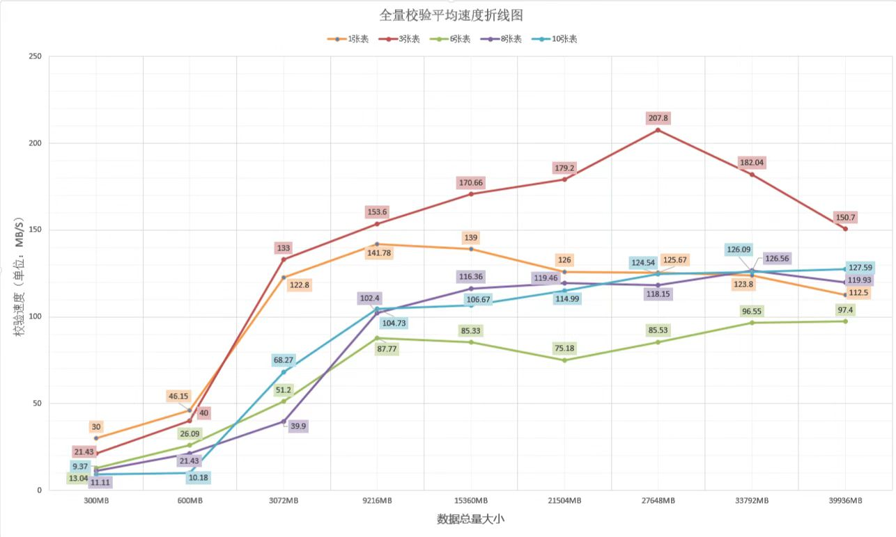
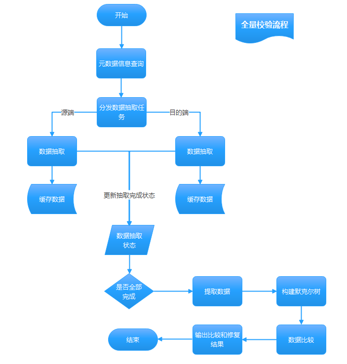

版权所有 © 2022  openGauss社区
 您对“本文档”的复制、使用、修改及分发受知识共享(Creative Commons)署名—相同方式共享4.0国际公共许可协议(以下简称“CC BY-SA 4.0”)的约束。为了方便用户理解，您可以通过访问https://creativecommons.org/licenses/by-sa/4.0/ 了解CC BY-SA 4.0的概要 (但不是替代)。CC BY-SA 4.0的完整协议内容您可以访问如下网址获取：https://creativecommons.org/licenses/by-sa/4.0/legalcode。

修订记录

| 日期       | 修订   版本 | 修改描述         | 作者     |
| ---------- | ----------- | ---------------- | -------- |
| 2022.09.21 | V1.0        | 初稿             | lihongji |
| 2022.09.29 | V1.1        | 根据评审意见修改 | lihongji |

 关键词： 

MySQL、chameleon、openGauss、datachecker、kafka、全量校验性能、30MB/s

 摘要：

本文档内容为验证在使用chameleon工具从MySQL数据库向openGauss数据库进行全量迁移后，使用datachecker校验工具进行全量数据校验，校验速率满足30MB/s。

缩略语清单：

| 缩略语 | 英文全名 | 中文解释 |
| ------ | -------- | -------- |
| NA     |          |          |

# 1     特性概述

使用chameleon工具从MySQL数据库向openGauss数据库进行全量数据迁移，迁移后使用datachecker校验工具进行数据校验，校验速率满足30MB/s。

# 2     特性测试信息

被测对象的版本信息：

| 版本名称                       | 测试起始时间 | 测试结束时间 |
| ------------------------------ | :----------- | ------------ |
| openGauss 3.1.0 build 475170ca | 2022-09-11   | 2022-09-21   |
| MySQL 5.7.27                   | 2022-09-11   | 2022-09-21   |
| chameleon 3.0.0                | 2022-09-11   | 2022-09-21   |
| jdk 11.0.16                    | 2022-09-11   | 2022-09-21   |
| kafka 2.13-2.8.11              | 2022-09-11   | 2022-09-21   |
| datachecker 0.0.1              | 2022-09-11   | 2022-09-21   |

环境配置信息：

| 环境信息                 | 配置信息                                                 | 备注                           |
| ------------------------ | ------------------------------------------------------------ | ------------------------------ |
| TaiShan 200 (Model 2280) | Architecture：aarch64<br />CPU：kunpeng-920  128核<br />内存：1021GB<br />硬盘：7.3TB<br />OS：openEuler release 20.03 (LTS) | openGauss 3.1.0 build b30defda |
| TaiShan 200 (Model 2280) | Architecture：aarch64<br />CPU：kunpeng-920  128核<br />内存：765GB<br />硬盘：3.0TB<br />OS：openEuler release 20.03 (LTS-SP1) | MySQL 5.7.27                   |
| TaiShan 200 (Model 2280) | Architecture：aarch64<br />CPU：kunpeng-920 128核<br />内存：765GB<br />硬盘：7.3TB<br />OS：openEuler release 20.03 (LTS-SP1) | kafka 2.13-2.8.11、datachecker |

# 3     测试结论概述

## 3.1   测试整体结论

datachecker全量校验MySQL与openGauss数据的一致性满足校验速度30MB/s特性，共执行用例10个，合计提2个问题单，无遗留风险，整体质量一般。

## 3.2   约束说明

1、MySQL 5.7.27数据存储分盘，my.cnf配置文件使用高性能配置

2、openGauss所在环境数据盘，openGauss使用高性能配置部署，pg_xlog分盘，openGauss侧的目标库为兼容B库，除初始用户外的数据库用户均有复制权。

3、表须含主键

4、仅对数据的差异性及表字段名称的差异性进行数据校验，不对表结构及字段类型的差异性做校验

## 3.3   遗留问题分析

### 3.3.1 遗留问题影响以及规避措施

| 问题单号 | 问题描述 | 问题级别 | 问题影响和规避措施 | 当前状态 |
| -------- | -------- | -------- | ------------------ | -------- |
| NA       |          |          |                    |          |

### 3.3.2 问题统计

|        | 问题总数 | 严重 | 主要 | 次要 | 不重要 | 转需求 |
| ------ | :------: | :--: | :--: | :--: | :----: | :----: |
| 数目   |    2     |  0   |  1   |  1   |   0    |   0    |
| 百分比 |   100%   |  0%  | 50%  | 50%  |   0%   |   0%   |

### 3.3.3 问题单汇总

| 序号 | issue号                                                      | 级别 | 问题简述                        | 状态   |
| ---- | ------------------------------------------------------------ | ---- | ------------------------------- | ------ |
| 1    | [I5RMJT](https://gitee.com/opengauss/openGauss-tools-datachecker-performance/issues/I5RMJT?from=project-issue) | 主要 | 15G数据源端抽取服务报错         | 已验收 |
| 2    | [I5TA3U](https://gitee.com/opengauss/openGauss-tools-datachecker-performance/issues/I5TA3U?from=project-issue) | 次要 | 错误率超出50%，校验日志报空指针 | 已验收 |

# 4     测试执行

## 4.1   测试执行步骤

1、使用函数生成数据

2、配置chameleon（详见[chameleon使用指南.md](https://gitee.com/opengauss/openGauss-tools-chameleon/blob/master/chameleon%E4%BD%BF%E7%94%A8%E6%8C%87%E5%8D%97.md)）

3、使用chameleon工具进行全量数据迁移

```shell
chameleon init_replica --config default --source mysql --debug
```

4、查看openGauss侧迁移后的表的数据量

5、启动MySQL、openGauss抽取服务及数据校验服务

6、发起数据校验服务请求

迁移速度 = 总Size / 校验耗时，其中总Size是openGauss侧查询迁移后所有表的Size之和，校验耗时是取值源端抽取服务日志起始时间与校验服务日志终止时间。

## 4.2   测试数据统计

<center> 表1  单表数据总量递增平均校验速度
</center>

| 数据表（个） | 数据总数(万条) | 总size(MB) | 平均校验速度（MB/s） |
| :----------: | :------------: | :--------: | :------------------: |
|      1       |      16.3      |    300     |          30          |
|      1       |       33       |    600     |        46.15         |
|      1       |      170       |    3072    |        122.8         |
|      1       |      500       |    9216    |        141.78        |
|      1       |      853       |   15360    |         139          |
|      1       |      1194      |   21504    |         126          |
|      1       |      1536      |   27648    |        125.67        |
|      1       |      1877      |   33792    |        123.8         |
|      1       |      2218      |   39936    |        112.5         |

<center>表2  三张表数据总量递增平均校验速度
</center>

| 数据表（个） | 数据总数(万条) | 总size(MB) | 平均校验速度（MB/s） |
| :----------: | :------------: | :--------: | :------------------: |
|      3       |     28.71      |    300     |        21.43         |
|      3       |     57.42      |    600     |          40          |
|      3       |      294       |    3072    |         133          |
|      3       |     881.97     |    9216    |        153.6         |
|      3       |    1469.95     |   15360    |        170.66        |
|      3       |    2057.94     |   21504    |        179.20        |
|      3       |    2645.91     |   27648    |        207.8         |
|      3       |    3233.89     |   33792    |        182.04        |
|      3       |    3821.87     |   39936    |        150.7         |

<center>表3  六张表数据总量递增平均校验速度
</center>

| 数据表（个） | 数据总数(万条) | 总size(MB) | 平均校验速度（MB/s） |
| :----------: | :------------: | :--------: | :------------------: |
|      6       |     51.13      |    300     |        13.04         |
|      6       |     102.26     |    300     |        26.09         |
|      6       |     523.6      |    3072    |         51.2         |
|      6       |      1571      |    9216    |        87.77         |
|      6       |      2618      |   15360    |        85.33         |
|      6       |      3665      |   21504    |        75.18         |
|      6       |     4712.1     |   27648    |        82.53         |
|      6       |     5759.3     |   33792    |        96.55         |
|      6       |     6806.4     |   39936    |        97.40         |

<center> 表4  八张表数据总量递增平均校验速度
</center>

| 数据表（个） | 数据总数(万条) | 总size(MB) | 平均校验速度（MB/s） |
| :----------: | :------------: | :--------: | :------------------: |
|      8       |     36.21      |    300     |        11.11         |
|      8       |     72.42      |    600     |        21.43         |
|      8       |     370.79     |    3072    |        39.90         |
|      8       |    1112.37     |    9216    |        102.4         |
|      8       |    1853.95     |   15360    |        116.36        |
|      8       |    2595.53     |   21504    |        119.46        |
|      8       |    3337.11     |   27648    |        118.15        |
|      8       |    4078.69     |   33792    |        126.56        |
|      8       |    4820.27     |   39936    |        119.93        |


<center> 表5  十张表数据总量递增平均校验速度
</center>

| 数据表（个） | 数据总数(万条) | 总size(MB) | 平均校验速度（MB/s） |
| :----------: | :------------: | :--------: | :------------------: |
|      10      |     43.82      |    300     |         9.38         |
|      10      |     87.64      |    600     |        18.18         |
|      10      |     448.72     |    3072    |        68.27         |
|      10      |    1346.15     |    9216    |        104.73        |
|      10      |    2243.58     |   15360    |        106.67        |
|      10      |    3141.02     |   21504    |        114.99        |
|      10      |    4038.45     |   27648    |        124.54        |
|      10      |    4935.89     |   33792    |        126.09        |
|      10      |    5833.318    |   39936    |        127.59        |

<center>
</center>

## 4.3   测试结果

### 4.3.1 测试结果分析

本次测试中，部分场景下会出现全量校验性能不满足30MB/s的情况（详见下表）：

| 约束条件        | 校验速度 |
| :-------------- | :------: |
| 数据总量小于1GB | <=30M/S  |

根据测试数据，分析可得：

除上述场景外，本次测试中的其他场景下，MySQL数据全量校验性能满足30MB/s。

### 4.3.2 测试数据统计

| 版本名称                       | 测试用例数 | 用例执行结果            | 发现问题单数 |
| ------------------------------ | :--------- | :---------------------- | ------------ |
| openGauss 3.1.0 build b30defda | 10         | Passed:10<br/>Failed: 0 | 2            |

数据说明：

1、datacheck全量校验满足30M/S测试共计10条用例，执行通过10条，共计发现2个bug

2、缺陷密度为2(缺陷个数)/6.51k(代码行数)=0.31(个/kloc)

## 4.4   后续测试建议

1、提高数据总量范围为800G~1T测试校验速度

# 5     附件

## 5.1 数据总量递增平均迁移速度折线图



## 5.2  全量数据校验流程图



