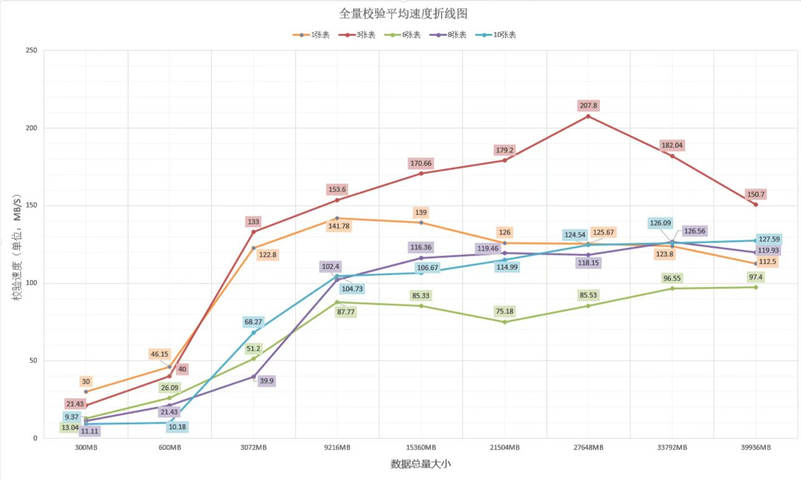

版权所有 © 2022  openGauss社区
 您对“本文档”的复制、使用、修改及分发受知识共享(Creative Commons)署名—相同方式共享4.0国际公共许可协议(以下简称“CC BY-SA 4.0”)的约束。为了方便用户理解，您可以通过访问https://creativecommons.org/licenses/by-sa/4.0/ 了解CC BY-SA 4.0的概要 (但不是替代)。CC BY-SA 4.0的完整协议内容您可以访问如下网址获取：https://creativecommons.org/licenses/by-sa/4.0/legalcode。

修订记录

| 日期       | 修订   版本 | 修改描述 | 作者     |
| ---------- | ----------- | -------- | -------- |
| 2022.09.21 | V1.0        | 初稿     | lihongji |
|            |             |          |          |

 关键词： 

MySQL、chameleon、openGauss、datacheck、kafka、全量校验性能、30MB/s

 摘要：

本文档内容为验证在使用chameleon工具从MySQL数据库向openGauss数据库进行全量迁移后，使用datacheck校验工具进行全量数据校验，校验速率满足30MB/s。

缩略语清单：

| 缩略语 | 英文全名 | 中文解释 |
| ------ | -------- | -------- |
| NA     |          |          |

# 1     特性概述

使用chameleon工具从MySQL数据库向openGauss数据库进行全量数据迁移，迁移后使用datacheck校验工具进行数据校验，校验速率满足30MB/s。

# 2     特性测试信息

被测对象的版本信息：

| 版本名称                       | 测试起始时间 | 测试结束时间 |
| ------------------------------ | :----------- | ------------ |
| openGauss 3.1.0 build 475170ca | 2022-09-11   | 2022-09-21   |
| MySQL 5.7.27                   | 2022-09-11   | 2022-09-21   |
| chameleon 3.0.0                | 2022-09-11   | 2022-09-21   |
| jdk 11.0.16                    | 2022-09-11   | 2022-09-21   |
| kafka 2.13-2.8.11              | 2022-09-11   | 2022-09-21   |
| datacheck                      | 2022-09-11   | 2022-09-21   |

硬件环境信息：

| 硬件型号                 | 硬件配置信息                                                 | 备注                           |
| ------------------------ | ------------------------------------------------------------ | ------------------------------ |
| TaiShan 200 (Model 2280) | Architecture：aarch64<br />CPU：kunpeng-920 <br />内存：1021GB<br />硬盘：7.3TB<br />OS：openEuler release 20.03 (LTS) | openGauss 3.1.0 build b30defda |
| TaiShan 200 (Model 2280) | Architecture：aarch64<br />CPU：kunpeng-920 <br />内存：765GB<br />硬盘：3.0TB<br />OS：openEuler release 20.03 (LTS-SP1) | MySQL 5.7.27                   |
| TaiShan 200 (Model 2280) | Architecture：aarch64<br />CPU：kunpeng-920 7260<br />内存：765GB<br />硬盘：7.3TB<br />OS：openEuler release 20.03 (LTS-SP1) | kafka 2.13-2.8.11              |
| TaiShan 200 (Model 2280) | Architecture：aarch64<br />CPU：kunpeng-920 7260<br />内存：765GB<br />硬盘：7.3TB<br />OS：openEuler release 20.03 (LTS-SP1) | datacheck                      |

# 3     测试结论概述

## 3.1   测试整体结论

datacheck全量校验MySQL与openGauss数据的一致性满足校验速度30MB/s特性，共执行用例10个，合计提2个问题单，无遗留风险，整体质量良好。

## 3.2   约束说明

1、MySQL 5.7.27数据存储分盘，my.cnf配置文件使用高性能配置

2、openGauss所在环境数据盘，openGauss使用高性能配置部署，pg_xlog分盘，openGauss侧的目标库为兼容B库，除初始用户外的数据库用户均有复制权。

3、表须含主键

4、仅对数据的差异性及表字段名称的差异性进行数据校验，不对表结构及字段类型的差异性做校验

# 4     测试执行

## 4.1   测试执行步骤

1、使用函数生成数据

2、配置chameleon（详见[chameleon使用指南.md](https://gitee.com/opengauss/openGauss-tools-chameleon/blob/master/chameleon%E4%BD%BF%E7%94%A8%E6%8C%87%E5%8D%97.md)）

3、使用chameleon工具进行全量数据迁移

```shell
chameleon init_replica --config default --source mysql --debug
```

4、查看openGauss侧迁移后的表的数据量

5、启动MySQL、openGauss抽取服务及数据校验服务

6、发起数据校验服务请求

迁移速度 = 总Size / 校验耗时，其中总Size是openGauss侧查询迁移后所有表的Size之和，校验耗时是取值抽取服务日志起始时间与校验服务日志终止时间。

## 4.2   测试数据统计

<center> 表1  单表数据总量递增平均校验速度
</center>
| 数据表（个） | 数据总数(万条) | 总size(MB) | 平均校验速度（MB/s） |
| :----------: | :------------: | :--------: | :------------------: |
|      1       |      16.3      |    300     |          30          |
|      1       |       33       |    600     |        46.15         |
|      1       |      170       |    3072    |        122.8         |
|      1       |      500       |    9216    |        141.78        |
|      1       |      853       |   15360    |         139          |
|      1       |      1194      |   21504    |         126          |
|      1       |      1536      |   27648    |        125.67        |
|      1       |      1877      |   33792    |        123.8         |
|      1       |      2218      |   39936    |        112.5         |

<center>表2  三张表数据总量递增平均校验速度
</center>
| 数据表（个） | 数据总数(万条) | 总size(MB) | 平均校验速度（MB/s） |
| :----------: | :------------: | :--------: | :------------------: |
|      3       |     28.71      |    300     |        21.43         |
|      3       |     57.42      |    600     |          40          |
|      3       |      294       |    3072    |         133          |
|      3       |     881.97     |    9216    |        153.6         |
|      3       |    1469.95     |   15360    |        170.66        |
|      3       |    2057.94     |   21504    |        179.20        |
|      3       |    2645.91     |   27648    |        207.8         |
|      3       |    3233.89     |   33792    |        182.04        |
|      3       |    3821.87     |   39936    |        150.7         |

<center>表3  六张表数据总量递增平均校验速度</center>
| 数据表（个） | 数据总数(万条) | 总size(MB) | 平均校验速度（MB/s） |
| :----------: | :------------: | :--------: | :------------------: |
|      6       |     51.13      |    300     |        13.04         |
|      6       |     102.26     |    300     |        26.09         |
|      6       |     523.6      |    3072    |         51.2         |
|      6       |      1571      |    9216    |        87.77         |
|      6       |      2618      |   15360    |        85.33         |
|      6       |      3665      |   21504    |        75.18         |
|      6       |     4712.1     |   27648    |        82.53         |
|      6       |     5759.3     |   33792    |        96.55         |
|      6       |     6806.4     |   39936    |        97.40         |

<center> 表4  八张表数据总量递增平均校验速度
</center>
| 数据表（个） | 数据总数(万条) | 总size(MB) | 平均校验速度（MB/s） |
| :----------: | :------------: | :--------: | :------------------: |
|      8       |     36.21      |    300     |        11.11         |
|      8       |     72.42      |    600     |        21.43         |
|      8       |     370.79     |    3072    |        39.90         |
|      8       |    1112.37     |    9216    |        102.4         |
|      8       |    1853.95     |   15360    |        116.36        |
|      8       |    2595.53     |   21504    |        119.46        |
|      8       |    3337.11     |   27648    |        118.15        |
|      8       |    4078.69     |   33792    |        126.56        |
|      8       |    4820.27     |   39936    |        119.93        |

<center> 表5  十张表数据总量递增平均校验速度
</center>
| 数据表（个） | 数据总数(万条) | 总size(MB) | 平均校验速度（MB/s） |
| :----------: | :------------: | :--------: | :------------------: |
|      10      |     43.82      |    300     |         9.38         |
|      10      |     87.64      |    600     |        18.18         |
|      10      |     448.72     |    3072    |        68.27         |
|      10      |    1346.15     |    9216    |        104.73        |
|      10      |    2243.58     |   15360    |        106.67        |
|      10      |    3141.02     |   21504    |        114.99        |
|      10      |    4038.45     |   27648    |        124.54        |
|      10      |    4935.89     |   33792    |        126.09        |
|      10      |    5833.318    |   39936    |        127.59        |


## 4.3   测试结果

### 4.3.1 测试结果分析

本次测试中，部分场景下会出现全量迁移性能不满足30MB/s的情况（详见下表）：

| 约束条件        | 校验速度 |
| :-------------- | :------: |
| 数据总量小于1GB | <=30M/S  |

根据测试数据，分析可得：

除上述场景外，本次测试中的其他场景下，MySQL数据全量迁移性能满足30MB/s。

### 4.3.2 测试数据统计

| 版本名称                       | 测试用例数 | 用例执行结果            | 发现问题单数 |
| ------------------------------ | :--------- | :---------------------- | ------------ |
| openGauss 3.1.0 build b30defda | 10         | Passed:10<br/>Failed: 0 | 2            |

数据说明：

1、datacheck全量校验满足30M/S测试共计10条用例，执行通过10条，共计发现2个bug

2、缺陷密度为2(缺陷个数)/6.51k(代码行数)=0.31(个/kloc)

## 4.4   后续测试建议

1、提高数据总量最大值为800G左右测试校验速度

# 5     附件

## 5.1 数据总量递增平均迁移速度折线图




