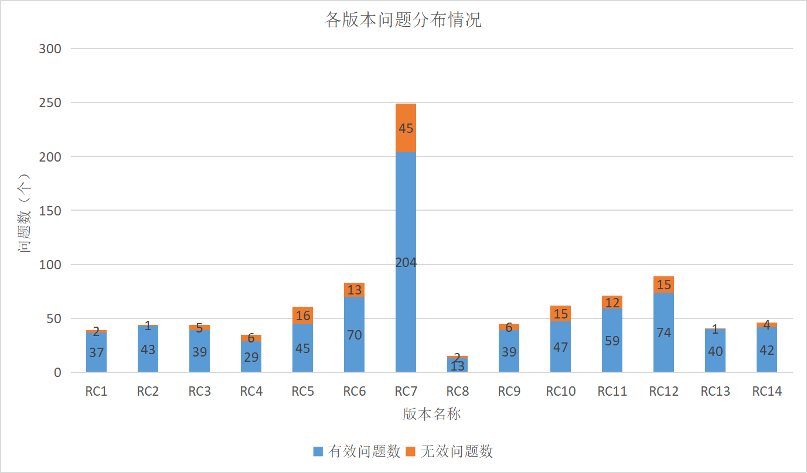

版权所有 © 2022  openGauss社区
 您对“本文档”的复制、使用、修改及分发受知识共享(Creative Commons)署名—相同方式共享4.0国际公共许可协议(以下简称“CC BY-SA 4.0”)的约束。为了方便用户理解，您可以通过访问[*https://creativecommons.org/licenses/by-sa/4.0/*](https://creativecommons.org/licenses/by-sa/4.0/) 了解CC BY-SA 4.0的概要 (但不是替代)。CC BY-SA 4.0的完整协议内容您可以访问如下网址获取：[*https://creativecommons.org/licenses/by-sa/4.0/legalcode*](https://creativecommons.org/licenses/by-sa/4.0/legalcode)。

修订记录

| 日期      | 修订版本 | 修改章节 | 修改描述 | 作者        |
| --------- | -------- | -------- | -------- | ----------- |
| 2022.9.21 | 1.0      | 初稿撰写 |          | yansong_lee |
|           |          |          |          |             |
|           |          |          |          |             |
|           |          |          |          |             |

目 录

1 概述

2 测试版本说明

3 版本概要测试结论

4 版本详细测试结论

> 4.1 特性测试结论

> 4.2 专项测试结论

5 问题单统计

6 附件

7 致谢

**Keywords 关键词**：openGauss 3.1.0 Preview

**Abstract 摘要**：主要是描述了openGauss 3.1.0 Preview版本的整体测试情况，给出本阶段的测试范围、结果、分析及质量评价，同时对测试活动进行回顾总结。

> 缩略语清单： 

| 缩略语 | 英文全名                             | 中文解释       |
| ------ | ------------------------------------ | -------------- |
| SQL    | Structured Query Language            | 结构化查询语言 |
| CVE    | Common Vulnerabilities and Exposures | 公共漏洞和暴露 |
| DML    | Data Manipulation Language           | 数据操纵语言   |
| DDL    | Data Definition Language             | 数据定义语言   |
| DCL    | Data Control Language                | 数据控制语言   |
| DS     | Data Studio                          | 数据库管理工具 |
| CM     | Cluster Management                   | 集群管理工具   |

 

***
\***

# 概述

openGauss是一款全面友好开放，携手伙伴共同打造的企业级开源关系型数据库。openGauss提供面向多核架构的极致性能、全链路的业务、数据安全、基于AI的调优和高效运维的能力。openGauss具有高性能、高可靠、高安全和易运维等特性，深度融合华为在数据库领域多年的研发经验，结合企业级场景需求，持续构建竞争力特性。

openGauss 3.1.0 Preview版本新增 等特性，并对若干关键缺陷进行了修改。本文主要描述了openGauss 3.1.0 Preview版本整体测试情况，结合[openGauss 3.1.0 Preview版本测试策略](https://gitee.com/opengauss/QA/blob/48d81ae343cdcaa22655281bc7d02ac3a91d3db6/Test_Strategy/openGauss_3.1.0_Preview/openGauss%203.1.0%20Preview%E7%89%88%E6%9C%AC%E6%B5%8B%E8%AF%95%E7%AD%96%E7%95%A5.md)，展开相应的测试活动。重点从特性质量、专项测试和问题单统计等维度展开叙述。综合来看，openGauss 3.1.0 Preview版本新特性交付质量较好，版本整体质量较好。

# 测试版本说明

本章节描述测试版本的基本信息，包括测试对象是什么，以及在什么环境下开展的测试，具体包括被测版本和测试硬件环境。

描述被测对象的版本信息和测试的时间及测试轮次。

| 版本名称                     | 测试起始时间 | 测试结束时间 |
| ---------------------------- | ------------ | ------------ |
| openGauss 3.1.0 Preview RC1  | 2022-5-25    | 2022-5-31    |
| openGauss 3.1.0 Preview RC2  | 2022-6-1     | 2022-6-8     |
| openGauss 3.1.0 Preview RC3  | 2022-6-9     | 2022-6-15    |
| openGauss 3.1.0 Preview RC4  | 2022-6-16    | 2022-6-20    |
| openGauss 3.1.0 Preview RC5  | 2022-6-21    | 2022-6-25    |
| openGauss 3.1.0 Preview RC6  | 2022-6-26    | 2022-6-30    |
| openGauss 3.1.0 Preview RC7  | 2022-8-12    | 2022-8-19    |
| openGauss 3.1.0 Preview RC8  | 2022-8-20    | 2022-8-24    |
| openGauss 3.1.0 Preview RC9  | 2022-8-25    | 2022-8-30    |
| openGauss 3.1.0 Preview RC10 | 2022-8-31    | 2022-9-6     |
| openGauss 3.1.0 Preview RC11 | 2022-9-7     | 2022-9-13    |
| openGauss 3.1.0 Preview RC12 | 2022-9-14    | 2022-9-20    |
| openGauss 3.1.0 Preview RC13 | 2022-9-21    | 2022-9-25    |
| openGauss 3.1.0 Preview RC14 | 2022-9-26    | 2022-9-28    |

描述本次测试的测试环境（包括环境软硬件版本信息，环境组网配置信息， 测试辅助工具等）。

| 硬件型号                 | 硬件配置信息                                                 | 备注 |
| ------------------------ | ------------------------------------------------------------ | ---- |
| TaiShan 200 (Model 2280) | CPU：Kunpeng-920 7260 2p 128核 内存：768G 硬盘：NVME 3T * 4 OS：openEuler release 20.03 (LTS) 文件系统：XFS 网卡：4*25GE Hi1822 |      |
| TaiShan 200 (Model 2480) | CPU：Kunpeng-920 7260 4p 256核 内存：1T 硬盘：NVME 3T * 4 OS：openEuler release 20.03 (LTS) 文件系统：XFS 网卡：4*10GE |      |
| RH2288H V3               | CPU：Intel(R) Xeon(R) Gold E5-2698 64核 内存：384GB 硬盘：SSD 2.9T  OS：CentOS Linux release 7.6.1810（Core） 文件系统：EXT4 网卡：4*10GE |      |

虚拟化平台

| 虚拟化平台 | 版本说明                                       |
| ---------- | ---------------------------------------------- |
| KVM虚拟化  | KVM+GuestOS（Centos7.6/OpenEuler20.03（LTS）） |

OS版本说明如下：

| 操作系统  | OS版本           | 版本说明                                                     |
| --------- | ---------------- | ------------------------------------------------------------ |
| OpenEuler | 20.03 (LTS)      | openEuler 20.03 (LTS)，aarch版本ISO SHA256:3e7cb72d746c5385b02b7a4bf18360925145d13f06bbd41c1a137e545b651d40 |
| OpenEuler | 20.03 (LTS)      | openEuler 20.03 (LTS)，x86-64版本ISO SHA256:419592be9cba55a2b800e761d865550f28133875920e7bb9c2d5cdaad90a9cbf |
| Kylin     | V10 SP1          | Kylin V10 SP1，aarch版本ISO SHA256:e6fffdb9dec030920a33ad4c57b68cce8cd7d0496b4bd04a7b85f8cc5494cf41 |
| CentOS    | 7.6.1810（Core） | CentOS Linux release 7.6.1810（Core），x86-64版本ISO SHA256:6d44331cc4f6c506c7bbe9feb8468fad6c51a88ca1393ca6b8b486ea04bec3c1 |

openGauss 3.1.0 Preview版本是openGauss第二个创新版本，维护周期为0.5年，本次发布的需求列表如下：

| no   | feature                                                      | status   | sig                | owner |
| ---- | ------------------------------------------------------------ | -------- | ------------------ | ----- |
| 1    | 【openGauss 3.1.0 Preview】集成openLookeng，提供集群AP能力   | Accepted | Plugin             |       |
| 2    | 【openGauss 3.1.0 Preview】CM管理ShardingSphere Proxy和注册中心，支持异常情况重新拉起 | Accepted | CM                 |       |
| 3    | 【openGauss 3.1.0 Preview】轻量化版本支持发布订阅功能        | Accepted | StorageEngine      |       |
| 4    | 【openGauss 3.1.0 Preview】行存表压缩能力增强（高效压缩算法） | Accepted | StorageEngine      |       |
| 5    | 【openGauss 3.1.0 Preview】发布订阅能力增强，支持基础数据同步和备份恢复 | Accepted | SQLEngine          |       |
| 6    | 【openGauss 3.1.0 Preview】支持基于主备双集群流式复制的异地容灾方案 | Accepted | StorageEngine      |       |
| 7    | 【openGauss 3.1.0 Preview】主机支持记录满足多数派日志的LSN，gs_ctl build支持拒绝目标LSN比此LSN要小的增量build | Accepted | StorageEngine      |       |
| 8    | 【openGauss 3.1.0 Preview】CM开放状态查询和推送能力，支持用户应用/中间件感知当前主备角色 | Accepted | CM                 |       |
| 9    | 【openGauss 3.1.0 Preview】CM支持用户自定义组件监控和管理    | Accepted | CM                 |       |
| 10   | 【openGauss 3.1.0 Preview】DCF策略化多数派                   | Accepted | DCF                |       |
| 11   | 【openGauss 3.1.0 Preview】基础算子性能提升                  | Accepted | SQLEngine          |       |
| 12   | 【openGauss 3.1.0 Preview】DBMind自治运维平台                | Accepted | AI                 |       |
| 13   | 【openGauss 3.1.0 Preview】智能优化器                        | Accepted | AI                 |       |
| 14   | 【openGauss 3.1.0 Preview】支持细粒度Any权限增强             | Accepted | SecurityTechnology |       |
| 15   | 【openGauss 3.1.0 Preview】MySQL全量迁移性能提升             | Accepted | Tools              |       |
| 16   | 【openGauss 3.1.0 Preview】支持MySQL增量迁移                 | Accepted | Tools              |       |
| 17   | 【openGauss 3.1.0 Preview】支持数据全量&增量校验             | Accepted | Tools              |       |
| 18   | 【openGauss 3.1.0 Preview】数据类型兼容                      | Accepted | SQLEngine          |       |
| 19   | 【openGauss 3.1.0 Preview】系统函数兼容                      | Accepted | SQLEngine          |       |
| 20   | 【openGauss 3.1.0 Preview】DDL兼容                           | Accepted | SQLEngine          |       |
| 21   | 【openGauss 3.1.0 Preview】DML兼容                           | Accepted | SQLEngine          |       |
| 22   | 【openGauss 3.1.0 Preview】PL/SQL兼容                        | Accepted | SQLEngine          |       |
| 23   | 【openGauss 3.1.0 Preview】SHOW语法兼容                      | Accepted | SQLEngine          |       |
| 24   | 【openGauss 3.1.0 Preview】其他语法兼容                      | Accepted | SQLEngine          |       |

openGauss 3.1.0 Preview版本测试活动分工如下：

| 序号 | 需求                                                         | 开发主体           | 测试主体 | 验证策略                                                     |
| ---- | ------------------------------------------------------------ | ------------------ | -------- | ------------------------------------------------------------ |
| 1    | 【openGauss 3.1.0 Preview】集成openLookeng，提供集群AP能力   | Plugin             | QA       | 1、验证openLookeng协同部署，获取元数据功能及可靠性测试 2、验证openLookeng基础SQL语法及复杂查询结果功能及性能测试 3、关注注册中心元数据修改，openLookeng正确获取变更信息，覆盖单表、广播表、分片表等不同类型；验证openLookeng基础SQL语法，包括支持的数据类型、查询语法覆盖、垮库数据关联查询结果准确性及性能 |
| 2    | 【openGauss 3.1.0 Preview】CM管理ShardingSphere Proxy和注册中心，支持异常情况重新拉起 | CM                 | QA       | 1、验证CM集群对ShardingSphere Proxy资源管理和监控的功能和可靠性 2、关注自定义资源异常后，CM重新拉起资源的状况 |
| 3    | 【openGauss 3.1.0 Preview】轻量化版本支持发布订阅功能        | StorageEngine      | QA       | 1、验证轻量化版本数据库发布订阅基础功能是否正常 2、关注数据库包大小以及空载内存的变化 |
| 4    | 【openGauss 3.1.0 Preview】行存表压缩能力增强（高效压缩算法） | StorageEngine      | QA       | 1、验证行存表压缩功能和压缩效率                              |
| 5    | 【openGauss 3.1.0 Preview】发布订阅能力增强，支持基础数据同步和备份恢复 | SQLEngine          | QA       | 1、验证发布订阅支持同步基础数据 2、验证发布订阅与数据库备份恢复等特性交互场景 |
| 6    | 【openGauss 3.1.0 Preview】支持基于主备双集群流式复制的异地容灾方案 | StorageEngine      | QA       | 1、验证支持基于主备的双集群流式复制的异地容灾方案 2、验证灾难及容灾演练场景下的一键式切换，满足RTO<10min |
| 7    | 【openGauss 3.1.0 Preview】主机支持记录满足多数派日志的LSN，gs_ctl build支持拒绝目标LSN比此LSN要小的增量build | StorageEngine      | QA       | 1、验证主机正常或异常停止时重新build进行恢复，关注是否造成数据丢失、是否拒绝目标LSN比此LSN小的增量build 2、验证单机模式、同步提交模式、无同步备和最大可用模式等反向场景 3、验证新增GUC参数enable_confirm_synced的功能 |
| 8    | 【openGauss 3.1.0 Preview】CM开放状态查询和推送能力，支持用户应用/中间件感知当前主备角色 | CM                 | QA       | 1、验证CM开放状态的查询和推送能力 2、验证用户应用/中间件感知当前主备角色的功能和可靠性 |
| 9    | 【openGauss 3.1.0 Preview】CM支持用户自定义组件监控和管理    | CM                 | QA       | 1、验证CM集群对自定义资源（ShardingSphere、Zookeeper和openLookeng）管理的功能和可靠性 2、关注存在多种自定义资源时，CM的监控状况 |
| 10   | 【openGauss 3.1.0 Preview】DCF策略化多数派                   | DCF                | QA       | 1、验证支持当某一AZ故障时，另外AZ有可用副本的能力            |
| 11   | 【openGauss 3.1.0 Preview】基础算子性能提升                  | SQLEngine          | QA       | 1、验证基础算子及代价模型优化后，执行效率提升                |
| 12   | 【openGauss 3.1.0 Preview】DBMind自治运维平台                | AI                 | QA       | 1、验证自制运维平台的端到端能力 2、验证异常检测能力 3、验证增强后的自监控、自诊断和自调优能力 |
| 13   | 【openGauss 3.1.0 Preview】智能优化器                        | AI                 | QA       | 1、验证智能基数估计算法                                      |
| 14   | 【openGauss 3.1.0 Preview】支持细粒度Any权限增强             | SecurityTechnology | QA       | 1、验证新增支持ANY权限的功能                                 |
| 15   | 【openGauss 3.1.0 Preview】MySQL全量迁移性能提升             | Tools              | QA       | 1、验证MySQL全量迁移支持100MB/S                              |
| 16   | 【openGauss 3.1.0 Preview】支持MySQL增量迁移                 | Tools              | QA       | 1、验证支持MySQL增量迁移 2、验证增量迁移性能支持3w tps 3、验证支持反向迁移，支持迁移后逃生 |
| 17   | 【openGauss 3.1.0 Preview】支持数据全量&增量校验             | Tools              | QA       | 1、验证源端与宿端表结构的一致性，如表结构包含主外键约束等 2、验证源端与宿端表数据类型及值的一致性，如时间、整型等数据类型 3、验证生成的校验结果文件中的准确性，易用性。如校验结果文件清晰直观，提示正确等 4、验证全量校验性能支持30MB/S |
| 18   | 【openGauss 3.1.0 Preview】数据类型兼容                      | SQLEngine          | QA       | 1、通过编译或om安装的方式安装数据库，验证数据类型的功能、性能和资料等 2、针对bit/tinyint/smallint/mediumint/int/bigint等类型，从取值范围、无效值、默认值和类型交互等方面进行测试。此外，对于tinyint/smallint/int/bigint四种类型，关注加上unsigned属性后对取值范围和无效值的处理 3、针对date/timestamp[(n)]/datetime[(n)]/year/year(2)/year(4)，从取值范围、无效值、默认值、精度、时区处理和类型交互等方面进行测试 4、针对enum类型，覆盖枚举值的数据类型和长度测试等 5、使用迁移工具，迁移上述数据类型，关注迁移是否成功，迁移后数据类型是否能正常使用 |
| 19   | 【openGauss 3.1.0 Preview】系统函数兼容                      | SQLEngine          | QA       | 1、验证系统函数功能和资料 2、函数有效入参、无效入参验证；返回值验证；函数嵌套使用验证 |
| 20   | 【openGauss 3.1.0 Preview】DDL兼容                           | SQLEngine          | QA       | 1、验证create/update view时设置definer执行成功 2、验证create database时带if not exists执行成功 3、验证drop/alter tablespace带engine执行成功 4、onlineMigration工具验证create/drop/alter column/constraint/index、drop/rename/truncate/alter table语句，是否支持在线迁移 5、chameleon工具验证create/drop/rename/truncate/alter分区表语句、create/drop index/foreign key/unique constraint语句，是否支持在线迁移 6、验证兼容DDL资料描述及示例是否正确 |
| 21   | 【openGauss 3.1.0 Preview】DML兼容                           | SQLEngine          | QA       | 1、验证DML语句兼容后的功能及可靠性 2、关注DML语句的在线、离线迁移功能 3、关注DML语句兼容后的性能指标达成情况 4、关注数据迁移的一致性 |
| 22   | 【openGauss 3.1.0 Preview】PL/SQL兼容                        | SQLEngine          | QA       | 1、兼容PL/SQL中支持使用#符号注释，验证该特性的功能及资料     |
| 23   | 【openGauss 3.1.0 Preview】SHOW语法兼容                      | SQLEngine          | QA       | 1、针对show processlist，验证有无full参数和不同用户权限下的查询表现 2、针对show columns/tables/plugins，验证功能是否正常 3、针对show index，验证索引信息显示是否正常，且与alter table的语法兼容 4、针对show databases/slave hosts/master status/set charset/optimize，验证功能是否正常 |
| 24   | 【openGauss 3.1.0 Preview】其他语法兼容                      | SQLEngine          | QA       | 1、通过编译或om安装的方式安装数据库，验证语法的功能、性能和资料等 2、关注语法是否已兼容；语法功能是否正确；新增语法和已有功能交互使用有无影响 |

# 版本概要测试结论

openGauss 3.1.0 Preview版本整体测试按照release-manager团队的计划，版本计划分为2个阶段进行测试，每个阶段规划6轮测试，采取3+3的测试方式，即3轮系统测试+3轮集成验证的策略，实际阶段二增加了2轮集成验证的时间，共完成了6轮系统测试+8轮集成验证测试：

阶段一，前三轮集中评审新特性测试设计，意在将测试点覆盖全面。此外，重点关注新特性的验收，并对继承特性进行了自动化看护验收。第四轮和第五轮测试除了对新特性进行迭代验收外，还启动了可靠性、安全、兼容性和资料等专项测试。第六轮测试关注所有阶段一交付新特性的验收进展，对每个特性的测试报告进行了评审。

阶段二，第七轮~第九轮也集中评审了新特性测试设计，同时关注内核场景化、工具链和兼容性三个方面的新特性验收，同时对关键性能数据进行了摸底，旨在发现阻塞性问题。此外，在第九轮启动了7\*24H长稳测试和CVE漏洞扫描等安全测试，目的是保证版本的稳定性。第十轮测试合入内核代码量巨大，行存表压缩能力增强、基础算子性能提升和支持细粒度Any权限增强等内核特性在这一阶段合入，因此关注所有交付新特性的验收进展和特性间的交互测试，同时开始进行系统集成验证，检查系统集成的完整性和正确性。第十一轮测试紧接着又覆盖了一轮7\*24H长稳测试，保证大量内核代码合入后社区版本的稳定性。此外，针对特性的测试报告测试人员也开始撰写。第十二轮测试利用工具进行端口扫描/主机漏洞扫描等安全测试，并对主备性能tpcc规格劣化问题进行攻关冲刺。第十三轮测试主要精力放在编译安装和版本构建上，保证社区安装包的可靠可用。同时对关键性能指标进行再次验收，旨在保证发布时对外的承诺达成。最后一轮测试通过自动化进行了版本发布前的验收测试，并且开始版本测试报告和特性测试报告的撰写合入。

openGauss 3.1.0 Preview版本按照测试策略完成了全量功能验证和专项测试（性能、可靠性、兼容性、安全），所有测试任务均按计划完成。本版本计划交付需求24个，实际交付24个，交付率100%，所有发布需求均验证通过。

openGauss 3.1.0 Preview版本共发现问题781个，有效问题638个，遗留问题6个（详见遗留问题章节），其他问题均已修复，回归测试结果正常，版本整体质量较好。

# 版本详细测试结论

openGauss 3.1.0 Preview版本详细测试内容包括：

1、通过自动化看护，从接入层、SQL层、存储层、管理、安全、可靠可用和工具等7个维度进行openGauss继承特性测试，继承功能无丢失；

2、在内核场景化的竞争力构建上，一是联合openLookeng，提供集群AP能力；二是丰富边缘场景，使得轻量化版本支持发布订阅功能；三是继续深耕内核技术，向社区贡献行存表压缩能力增强、基础算子性能提升和支持细粒度Any权限增强等诸多特性......测试覆盖上述需求，关注功能的实现和规格的达成；

3、在工具链方面，覆盖CM和OM新特性测试，同时迁移工具也在此次发布版本有了更高的规格表现：全量迁移100MB/S、增量迁移3w tps、反向迁移1w tps以及全量校验30MB/S。不过后续仍需对工具的易用性和稳定性提高要求；

4、在M*兼容性方面，测试验收DDL 66条、DML 21条、DCL 35条、数据类型 41个、函数 172个、操作符17个、PLSQL 41个、表达式1个以及自定义变量3个；

5、针对系统的稳定性，进行长稳测试，包括sqlsmith语法组合攻击测试、事务并发测试、benchmarksql+sysbench加压测试等，数据库满足7*24H正常运行，测试较为充分，产品稳定性好；

6、专项测试包括性能专项、安全专项、兼容性测试、可靠性测试和资料测试。

## 特性测试结论

### 继承特性评价

对产品所有继承特性进行评价，用表格形式评价，包括特性列表（与特性清单保持一致），验证质量评估

| Domain   | Feature                | 质量评估                   | 备注                                                       |
| -------- | ---------------------- | -------------------------- | ---------------------------------------------------------- |
| 接入层   | 应用开发接口           | ▮ | 支持JDBC、ODBC、PDBC和GDBC应用开发接口                     |
| SQL层    | 支持SQL语言版本SQL2003 | ▮ | 支持SQL2003语言                                            |
|          | 支持SQL基本语法        | ▮ | 支持SQL基础语法DML/DQL/DCL/DDL                             |
|          | 存储过程               | ▮ | 支持存储过程                                               |
|          | 系统表和系统视图       | ▮ | 支持系统表和系统视图                                       |
|          | DBE_PERF内视图         | ▮ | 支持DBE_PERF内视图                                         |
|          | SQL关键字              | ▮ | 包含保留关键字及非保留关键字                               |
| 存储层   | 索引                   | ▮ | 支持btree/ubtree/psort/hash/gin/gist索引                   |
|          | 数据分区               | ▮ | 支持一级分区、二级分区                                     |
|          | 行列混合存储           | ▮ | 支持行/列存储                                              |
|          | 内存表                 | ▮ | 支持MOT                                                    |
|          | 物化视图               | ▮ | 支持物化视图                                               |
|          | 全文索引               | ▮ | 支持常见单字及词查询，长句子检索，中英文混排检索           |
| 管理     | 命令行安装             | ▮ | 支持命令行安装                                             |
|          | 版本升级               | ▮ | 支持常见数据库软件版本升级                                 |
|          | 数据库对象管理         | ▮ | 支持使用Data Studio工具进行操作                            |
|          | 诊断分析报告           | ▮ | 支持WDR Snapshot生成性能诊断分析报告                       |
|          | 智能运维               | ▮ | 支持使用不同算子创建mode，为表创建虚拟索引、推荐查询索引列 |
| 安全     | 身份鉴别               | ▮ | 支持定义鉴别失败次数，用户具有唯一标识性                   |
|          | 访问控制               | ▮ | 支持高级别密码存储加密                                     |
|          | 安全接入               | ▮ | 具备基于SHA256/SM3机制的口令加密认证方法                   |
|          | 安全审计               | ▮ | 支持常见安全审计，支持检测安全侵害事件                     |
|          | 三权分立               | ▮ | 支持常见系统管理员、安全管理员和审计管理员角色             |
|          | 数据存储加密           | ▮ | 支持数据存储加密                                           |
|          | 全密态数据库           | ▮ | 支持全密态数据库功能                                       |
|          | 动态脱敏               | ▮ | 支持动态脱敏功能                                           |
|          | 防篡改功能             | ▮ | 支持防篡改功能                                             |
|          | 恶意攻击防范           | ▮ | 支持恶意攻击防范功能                                       |
| 可靠可用 | 物理备份恢复           | ▮ | 支持对数据库数据进行备份恢复操作                           |
|          | 全量PITR物理恢复       | ▮ | 支持恢复到备份归档数据之后的任意时间点                     |
|          | 逻辑导入导出           | ▮ | 支持对数据库进行逻辑备份还原                               |
|          | 延迟备份               | ▮ | 支持备机延迟回放                                           |
|          | 逻辑复制               | ▮ | 支持逻辑复制                                               |
|          | 极致RTO                | ▮ | 支持极致RTO，具备极致RTO场景下故障恢复能力                 |
| 工具     | 客户端工具             | ▮ | 支持gsql数据库连接工具                                     |
|          | 服务端工具             | ▮ | 支持数据库导入导出/系统检查等工具                          |
|          | 系统内部使用工具       | ▮ | 支持安装卸载/备份/缩扩容/升级等工具                        |

●： 表示特性不稳定，风险高

▲： 表示特性基本可用，遗留少量问题

▮： 表示特性质量良好

### 新需求评价

建议以表格的形式汇总新特性测试执行情况及遗留问题单情况的评估，给出特性质量评估结论。

| 序号 | 特性名称                                                     | 测试情况说明                                                 | 约束依赖说明                                                 | 遗留问题单                                                   | 特性质量评估                | 备注 |
| ---- | ------------------------------------------------------------ | ------------------------------------------------------------ | ------------------------------------------------------------ | ------------------------------------------------------------ | --------------------------- | ---- |
| 1    | 【openGauss 3.1.0 Preview】集成openLookeng，提供集群AP能力   | 共执行3轮测试，全量覆盖2轮测试，issue回归1轮测试，共执行46个用例。主要覆盖了功能测试、可靠性测试，性能测试。发现问题14个，关闭7个，遗留7个，基本功能可用。重点验证openLooKeng元数据的获取及更新正确、支持的数据类型、select语法、tpch查询结果正确性、相同数据量下分片增加及读写分离场景下性能提升等 | 1.目前openLooKeng仅支持对openGauss的select语法，其他DDL、DML语法不支持； 2.依赖shardingSphere+ZK注册中心+opengauss集群部署方式； 3.Java 8 Update 161或更高版本(8u161+) (64位)。同时支持Oracle JDK和Open JDK；AArch64 (Bisheng JDK 1.8.262 或者更高版本) | 无                                                           | ▮  |      |
| 2    | 【openGauss 3.1.0 Preview】CM管理ShardingSphere Proxy和注册中心，支持异常情况重新拉起 | 共执行3轮测试，共执行用例77条，测试覆盖基本功能（配置json文件、启停资源，多种资源监控）和可靠性方面。通过故障注入等手段保证CM自定义资源监控和异常拉起能力的稳定性 | 1.安装xml需要配置cm参数 2.需要部署ShardingSphere、Zookeeper和openLookeng等资源 3.需要配置资源的json和sh文件 | 无                                                           | ▮  |      |
| 3    | 【openGauss 3.1.0 Preview】轻量化版本支持发布订阅功能        | 共执行一轮测试，执行用例589条，主要包括覆盖已有发布订阅功能用例，如发布订阅的简单创建，发布订阅与主备切换结合，发布订阅与升级结合，发布订阅在不同场景下的数据同步状态以及针对不同的数据表类型创建发布订阅，创建发布订阅时的参数校验，事务/函数中创建发布订阅，发布订阅与备份恢复结合，创建发布订阅安全/权限校验，发布订阅与减/扩容结合，此次共执行用例282条。除此之外，新增发布端/订阅端小型化版本与企业版本交互相关用例25条，执行已有小型化用例282条以及资料测试 | 1.同一数据库内的多个订阅不应当订阅内容重复的发布（指发布相同的表），否则会产生数据重复或者主键冲突  2.如果被发布的表中包含不支持btree/hash索引的数据类型（如地理类型等），那么该表需要有主键，才能成功的复制UPDATE/DELETE操作到订阅端。否则复制会失败，同时订阅端会出现“FATAL: could not identify an equality operator for type xx”的日志  3.发布的属主和系统管理员才能执行ALTER PUBLICATION，同理订阅的所有者才能执行ALTER SUBSCRIPTION。 4.权限问题，要创建一个发布，调用者必须拥有当前数据库的CREATE权限，要将表添加到发布中，调用者必须拥有该表的所有权 5. 支持发布的表类型：只有持久基表才能成为发布的一部分，临时表、非日志表、外表、MOT表、物化视图、常规视图不能被发布 6.创建订阅时使用的发布端端口，不能为发布端主端口，而应该使用主端口+1端口，否则会与线程池冲突  7.一个订阅可以对应多个发布，每一个发布都可以有多个订阅者 8. 要创建订阅，用户必须是一个具有SYSADMIN权限用户  9.在发布者端，wal_level必须被设置为logical | 无                                                           | ▮  |      |
| 4    | 【openGauss 3.1.0 Preview】行存表压缩能力增强（高效压缩算法） | 主要涉及到压缩表对象，压缩索引测试，接口测试。压缩表和压缩索引，主要包括DDL/DML相关基本语法测试。压缩表的创建，修改，删除等，表的类型有普通表，分区表，toast表等，DML语法中，主要涉及到压缩表数据的增删改查，数据对比等语法操作。 压缩索引测试，包括DDL的相关基本语法测试。在压缩表上和非压缩表上创建/修改/删除索引等基本操作；接口测试：主要包含了内置接口函数的功能测试，涉及到的接口如下： compress_buffer_stat_info()， compress_ratio_info(file_path) ，compress_statistic_info(file_path，step) ，compress_address_header(oid, seg_id) ， compress_address_details(oid, seg_id) ；表和索引的碎片化整理。主要涉及到shrink table/shrink index这两个操作，覆盖了shrink不存在的表，非压缩表，索引不存在的索引和非压缩索引等。性能指标测试，在物理机（性能较差，tpmc很低）tpcc 1000仓，512并发的配置，分别运行了4个小时和8个小时，两个观察点，计算压缩比和tpcc性能劣化率，性能达标 | 1.需要支持punch hole的文件管理系统，对于不支持punch hole操作的系统，选择压缩无法减少磁盘空间占用 2.对数据进行压缩，在节省存储空间的同时，可能在压缩和解压缩过程中，对CPU有一定冲击，可能会CPU使用率冲高 3.只支持行存表、Btree索引压缩 4.压缩表建立后不支持修改压缩相关参数，非压缩表转化为压缩表操作暂不支持 | 无                                                           | ▮  |      |
| 5    | 【openGauss 3.1.0 Preview】发布订阅能力增强，支持基础数据同步和备份恢复 | 共执行一轮测试，执行用例13条，累计发现issue4个，3个已验收，1个已取消 | 无                                                           | 无                                                           | ▮  |      |
| 6    | 【openGauss 3.1.0 Preview】支持基于主备双集群流式复制的异地容灾方案 | 流失容灾共执行1轮测试，共执行99条用例，手工执行覆盖基础功能，如流式容灾搭建，流式容灾倒换，流式容灾灾备升主 ，流式容灾解除，流式容灾查询。覆盖可靠性测试，如容灾搭建过程可靠性，灾备升主可靠性，容灾解除可靠性。重点验证特定背景业务流量和环境配置下的rpo和rto时间等 | 1.日常监控RPO和RTO数值需要在目标范围内。 2.如果灾备升主前容灾指标不在目标范围内，则可能导致灾备升主或者容灾演练时达不到容灾指标。 3.灾备升主failover支持少数派故障场景(即degraded状态)下的升主，但在升主过程中如果出现故障叠加场景下，执行灾备集群升主RTO会超过10min。 4.容灾演练特性switchover要求主备集群都处于normal态才可执行，执行过程中如果出现节点或实例故障会导致倒换失败，主集群回滚等现象，用以保证有集群可对外提供服务。 4.要达到容灾性能指标，集群使用的磁盘至少是SAS SSD，比如服务器典型配置（104U/512G/SAS SSD）。 | 无                                                           | ▮  |      |
| 7    | 【openGauss 3.1.0 Preview】主机支持记录满足多数派日志的LSN，gs_ctl build支持拒绝目标LSN比此LSN要小的增量build | 共执行两轮测试，执行用例23个，测试覆盖功能测试、可靠性测试、性能测试，重点验证主机正常/异常停止，事务同步/未同步到备机时，原主机发起build等场景测试，检测源节点是否存在相同的confiremed LSN，如果不存在，拒绝此次增量build. | 1.支持一主多备，同步提交模式，关闭最大可用模式，且存在活跃的同步备机；  2.异步备或逻辑复制槽不记录confirmed LSN信息；  3.只影响增量build或不指定build模式的自动build，不影响强制指定全量build模式。 | 无                                                           | ▮  |      |
| 8    | 【openGauss 3.1.0 Preview】CM开放状态查询和推送能力，支持用户应用/中间件感知当前主备角色 | 共执行2轮测试，执行用例56个，覆盖启动组件、查询数据库集群和数据库节点信息、信息接收地址和注册功能和更新功能、推送功能、删除主备机信息接收地址功能，实现了用户自定义应用/中间建感知当前主备角色 | 1.用户使用的应用/中间件需要用户根据自身需求自定义开发 2.本程序需要依赖cm相关进程和指令，所以必须与cm同时运行，需配置自定义资源配置文件 | 无                                                           | ▮  |      |
| 9    | 【openGauss 3.1.0 Preview】CM支持用户自定义组件监控和管理    | 共执行2轮测试，执行用例56个，覆盖启动组件、查询数据库集群和数据库节点信息、信息接收地址和注册功能和更新功能、推送功能、删除主备机信息接收地址功能，实现了用户自定义应用/中间建感知当前主备角色 | 1.用户使用的应用/中间件需要用户根据自身需求自定义开发 2.本程序需要依赖cm相关进程和指令，所以必须与cm同时运行，需配置自定义资源配置文件 | 无                                                           | ▮  |      |
| 10   | 【openGauss 3.1.0 Preview】DCF策略化多数派                   | 覆盖正常值、异常值、边界值 功能测试；覆盖配置group、增加group、删除group、变更group等 可靠性测试；覆盖switchover、failover、重启、网络故障等场景 耦合测试；覆盖升级、增副本、节点替换、节点修复 | passive、级联备不支持配置                                    | 无                                                           | ▮  |      |
| 11   | 【openGauss 3.1.0 Preview】基础算子性能提升                  | 1.新型选择率模型 ：性能看护场景性能测试包括（tpcc，tpch，sysbench，基础算子）;应用场景构造落入mcv、直方图等;特性交互覆盖升级等场景;新增GUC参数的设置方式、参数值测试等 2.分区表页面估算：特性交互覆盖升级等场景;测试新增guc参数;分区表在分区剪枝情况下是否进行页面估算 3.PI算子消除：性能看护场景性能测试包括（tpcc，tpch，sysbench，基础算子）;应用场景构造落入mcv、直方图等 4.函数依赖：analyze对不同数据量不同数据类型开启函数依赖执行时间测试;函数依赖行数估算准确性测试 ;线下性能看护场景测试（tpcc，tpch，sysbench，基础算子等） 5.SeqScan底噪消除：seqscan单一计划和复杂计划性能测试;线下看护环境包括（tpcc、tpch、sysbench、基础算子）看护不劣化;关注对WDR的影响 | 新型选择率模型 1.GUC参数var_eq_const_selectivity=on 2.对选择率的优化模型只适用于Int型数据类型，且表达式是Var = Const，其中Var必须是直接的属性，不支持类型强转、表达式、操作符等 3.本特性只校准常量等值谓词选择率估算的准确率，其他不准确的地方（如distinct值估算，独立性假设模型，采样等）在后续版本中校准 分区表页面估算 1.支持一级分区表，二级分区表 2.GUC参数partition_page_estimation打开后，且语句存在剪枝情况下目标场景优化才能生效 3.本特性只校准分区表页面估算部分的准确率，其他不准确的地方（如distinct值估算，独立性假设模型，采样等）在后续版本中校准 PI算子消除 1.GUC参数partition_iterator_elimination打开后，且优化器剪枝结果只有一个分区时，目标场景优化才能生效 2.不支持二级分区表 3.支持cplan，支持部分gplan场景，如分区键a = $1（即优化器阶段可以剪枝到一个分区的场景） 4.支持SeqScan/Indexscan/Indexonlyscan/Bitmapscan/RowToVec/Tidscan算子 5.支持行存，列存，ustore，SQLBypass 6.Partition Iterator算子下层算子是支持的Scan算子时，才支持消除 函数依赖 1.新增GUC参数enable_functional_dependency=on 生效 2.GUC设置为ON，生成多列统计信息时候，如果涉及属性的个数不超过4个 SeqScan 底噪消除 1.C参数enable_seqscan_fusion=on 2.不涉及分区表 3.只针对seqScan算子 | 无                                                           | ▮  |      |
| 12   | 【openGauss 3.1.0 Preview】DBMind自治运维平台                | 覆盖一键式部署接口测试，包括正常和异常测试，online/offline的交互、非交互模式测试，包括正常场景测试、鉴权测试、prometheus和各exporter的参数测试等；sql_rewriter，所有接口正常和异常测试、用户鉴权测试。改写规则测试，改写文件中SQL语句类型测试；cmd_exporter，所有接口正常和异常测试；新增接口diagnosis测试；以及其他已有模块新增接口、参数的正常和异常测试 | 1.python版本大于3.6且提供依赖包 2.prometheus-server与各exporter间通信正常 | 无                                                           | ▮  |      |
| 13   | 【openGauss 3.1.0 Preview】智能优化器                        | 覆盖自适应计划选择和基于贝叶斯网络的智能基数估计测试         | 1.不支持GPC                                                  | 无                                                           | ▮  |      |
| 14   | 【openGauss 3.1.0 Preview】支持细粒度Any权限增强             | 执行权限可以赋予和回收操作正常，功能正常。any权限生效。未发现由于any权限引入的越权问题和功能问题 | ANY权限可以通过角色被继承，但不能赋予PUBLIC。初始用户和三权分立关闭时的系统管理员用户可以给任何角色/用户授予或撤销ANY权限 | 无                                                           | ▮  |      |
| 15   | 【openGauss 3.1.0 Preview】MySQL全量迁移性能提升             | 共执行1轮测试，执行用例7条，在特定场景下借助chameleon工具从MySQL数据库向openGauss数据库进行全量数据迁移，在特定场景下迁移性能满足100MB/s | 1.openGauss使用高性能配置部署，以绑核方式启动数据库      | 无                                                           | ▮  |      |
| 16   | 【openGauss 3.1.0 Preview】支持MySQL增量迁移                 | 共执行2轮测试，共执行用例33条，测试覆盖基本功能（Mysql在线迁移、反向迁移）和性能方面。保证数据迁移后的一致性，有序性和完整性。通过在Kunpeng-920高性能机器上配置高可用参数实现在线迁移性能达到3w tps | 1.支持鲲鹏920 2p服务器，硬件规格需满足： CPU：kunpeng-920 7260 2p 128核 内存：32 * 32GB 硬盘：3 * 2.9TB OS：openEuler release 20.03 (LTS-SP1) 2.MySQL 5.7以上版本，数据库除初始用户外的数据库用户均有复制权；配置文件添加以下参数： MySQL参数设置： log_bin=ON, binlog_format=ROW, binlog_row_image=FULL, gtid_mode = ON 3.openGauss使用高性能配置部署，绑核启动，openGauss侧的目标库为兼容B库，除初始用户外的数据库用户均有复制权 4.chameleon工具已安装并完成配置 5.sysbench已安装 6.online在线迁移和反向迁移工具已编译jar包 7.update和delete场景下，迁移性能无法满足3Wtps 8.仅支持DML迁移，不支持DDL迁移 9.反向迁移仅支持在线迁移，不支持离线全量迁移 10.反向迁移前需要开启数据库的逻辑复制相关配置：wal_level = logical，无主键的表需要执行：alter table tablename replica identity full | 无                                                           | ▮  |      |
| 17   | 【openGauss 3.1.0 Preview】支持数据全量&增量校验             | 支持数据全量&增量校验共执行两轮测试，共执行用例86个，用例涉及功能、可靠性、性能。通过不同的数据类型、构造源端MySQL与宿端openGauss数据差异，验证数据校验功能的正确性。通过注入磁盘、cpu、网络故障验证全量数据校验工具的稳定性。通过构造大量数据(300M~39GB)验证全量校验速率满足30M/S | 1.被校验的表需要包含主键                                     | 无                                                           | ▮  |      |
| 18   | 【openGauss 3.1.0 Preview】数据类型兼容                      | 共执行3轮测试，执行用例254条，基于插件dolphin，验证枚举类型，时间数据类型等基本功能，测试覆盖类型的基本功能，含取值范围，隐式转换及显式转换功能，默认值，精度测试，类型间交互使用等，保证兼容后的类型功能正确 | 1.兼容的类型功能需在兼容b库且含dolphin插件下使用 2. enum中的重复枚举值会导致报错 3. enum支持的最大字符串长度为63 4. 枚举值的下标索引号从1开始 5. 不支持enum列作为分区表的分区键 6.某些类型的取值和M*不完全兼容，如date、datetime、timestamp等 7.date、datetime、timestamp类型年份允许输入'0000'年，但不支持月份或天数为零值 | 无                                                           | ▮  |      |
| 19   | 【openGauss 3.1.0 Preview】系统函数兼容                      | 共执行5轮测试，执行用例800条，基于插件dolphin，验证网络函数，数学函数，条件类型函数，字符串处理函数等基本功能，测试覆盖函数参数取值，参数类型，参数个数及函数嵌套使用，结合数据库对象使用函数，保证兼容后的系统函数功能正确 | 1.兼容的类型功能需在兼容b库且含dolphin插件下使用 2.部分函数的返回结果和M*侧不完全一致，如coalesce函数参数为字符串时 3.部分函数的返回结果和sql_mode参数有关，参数打开和关闭时结果不同 | 无                                                           | ▮  |      |
| 20   | 【openGauss 3.1.0 Preview】DDL兼容                           | 共执行3轮测试，执行用例493条，测试覆盖基本功能（MySQL DDL增量迁移、O*在线迁移支持多个DDL语法、多个MySQL DDL语法兼容），保证语法兼容，迁移后数据一致性、有序性、完整性 | 插件状态正常、变色龙工具离线及在线迁移功能正常、源数据库状态正常 | [I5G8LB](https://gitee.com/opengauss/openGauss-tools-onlineMigration/issues/I5G8LB?from=project-issue) | ▲ |      |
| 21   | 【openGauss 3.1.0 Preview】DML兼容                           | 共执行3轮测试，执行用例126条，测试覆盖基本功能、可靠性测试和资料测试，保证openGauss在兼容B模式下支持insert value list为空，保证openGauss在兼容A模式下DML语句迁成功 | 1.兼容的语法功能需在兼容b库且含dolphin插件下使用 2.在线迁移DML语句时，需有以下约束 2.1kafka server、connector、onlineMigration迁移工具正确开启 2.2生产端和消费端数据库需有同名schema 2.3关闭迁移工具后需清空kafka_logs及zookeeper_logs | 无                                                           | ▮  |      |
| 22   | 【openGauss 3.1.0 Preview】PL/SQL兼容                        | 共执行3轮测试，执行用例20条，测试覆盖基本功能及资料测试，功能测试覆盖创建存储过程和自定义函数，支持指定definer，security参数，保证语法功能的正确性和资料可维护性 | 兼容B模式数据库正常，dolphin插件正常                         | 无                                                           | ▮  |      |
| 23   | 【openGauss 3.1.0 Preview】SHOW语法兼容                      | 共执行2轮测试，执行用例200条，覆盖基础功能测试和资料测试，重点测试show函数对数据库、表、函数、索引、用户权限等对象的相关信息进行查询，保证语法功能正确 | 安装包含dolphin插件的数据库，并且兼容B库下执行用例           | 无                                                           | ▮  |      |
| 24   | 【openGauss 3.1.0 Preview】其他语法兼容                      | 共执行2轮测试，执行用例57条，基于插件dolphin，实现checksum语法，实现optimize语法，实现charset语法，测试覆盖类型的基本功能，含校验单表，多表校验结果正确，不支持的对象返回合理提示，保证兼容后语法功能正确 | 兼容B模式数据库正常，dolphin插件正常                         | 无                                                           | ▮  |      |

●： 表示特性不稳定，风险高

▲： 表示特性基本可用，遗留少量问题

▮： 表示特性质量良好

## 专项测试结论

### 安全测试

openGauss 3.1.0 Preview版本安全测试覆盖：

1、 新特性安全测试：openGauss 3.1.0 Preview版本涉及行存表压缩能力增强、基础算子性能提升和支持细粒度Any权限增强等内核特性等内核新特性，均已执行相关安全测试。

2、通过工具进行端口扫描/主机漏洞扫描/开源软件漏洞扫描/安全编译/安全配置/密码和信息泄漏/网络安全红线/安全资料/病毒扫描/敏感信息扫描。

3、针对地址消毒，结合相关测试工具，对memcheck版本执行全量测试用例。

openGauss 3.1.0 Preview版本所有适用的安全扫描和安全测试均已执行，整体质量良好，风险可控。

### 可靠性测试

故障注入类测试

| Domain         | 测试内容                                                     | 测试结论 |
| -------------- | ------------------------------------------------------------ | -------- |
| 硬件故障       | 注入CPU、内存、网络故障时无可靠性问题。磁盘满异常时，有有效提示，并且消除故障后数据库可恢复正常。 | 测试通过 |
| 操作系统故障   | 修改系统时间（夏令时，闰年）无可靠性问题。端口、文件句柄、信号量故障时，有有效提示，且故障消除后数据库可恢复正常。 | 测试通过 |
| 数据库系统故障 | 双机故障、事务管理、数据库进程故障消除后，数据库可恢复正常，且有有效日志记录。大量执行SQL、TPCC高并发、数据库参数调整后对数据库无影响。 | 测试通过 |
| 人为因素故障   | 人为破坏系统表、业务执行过程中启停数据库，会有对应日志记录，并且消除故障后数据库可恢复正常。 | 测试通过 |
| RTO            | 注入磁盘满故障、数据库进程异常时，有有效提示，且消除故障后RTO模式下数据库运行正常。主备频繁切换，无可靠性问题。 | 测试通过 |
| 工具           | 对于时间跳转、频繁使用、主备切换后工具可正常使用，无可靠性问题。 | 测试通过 |

长时间负载测试

| Domain | 测试内容                                                     | 测试结论                                                     |
| ------ | ------------------------------------------------------------ | ------------------------------------------------------------ |
| 场景1  | TPCC+sysbench连跑insert/update/delete事务，1000仓+800并发，7*24H测试 | 业务正常运行，主备机无core，系统可以长时间正常处理tpcc业务、DML增删改查并发事务、DDL创建表删表事务；cpu、内存和io等系统资源使用均正常；一致性检查通过；7*24H满足 |

### 性能测试

性能测试对关键性能指标进行摸底和测试。利用benckmarksql等工具辅助完成性能测试。

| **指标大项** | **指标小项**                                                 | **指标值** | **说明**                              | 测试结论                                                     |
| ------------ | ------------------------------------------------------------ | ---------- | ------------------------------------- | ------------------------------------------------------------ |
| TPCC         | 2P（Taishan 200 2280 7260）单节点 1H                         | 150万      | 与Release基线数据差异小于5%以内可接受 | 单节点1H在极限场景配置下tpmC为***153.47***W+，验证通过       |
|              | 2P（Taishan 200 2280 7260）单节点 8H                         | 150万      | 与Release基线数据差异小于5%以内可接受 | 单节点8H在极限场景配置下tpmC为***143.64***W+。在5%浮动范围内，验证通过 |
|              | 2P（Taishan 200 2280 7260）一主一备 1H                       | 120万      | 与Release基线数据差异小于5%以内可接受 | 一主一备1H在极限场景配置下tpmC为***117.98***W+。在5%浮动范围内，验证通过 |
|              | 4P（Taishan 200 2280 7260）单节点 1H                         | 230万      | 与Release基线数据差异小于5%以内可接受 | 单节点在极限场景配置下tpmC为***233***W+。验证通过            |
|              | ss-jdbc直连性能损耗比<50%                                    | <50%       | 此即为Release基线数据                 | ss-jdbc 1节点1H，tpmC 142.7W（数据库直连1节点1H，tpmC 150W），性能损耗(150-142.7)/150=***4.9%***。单SS-JDBC直连数据库性能损耗小于50%，验证通过 |
|              | 分布式OLTP，TPCC线性度0.8，2P（Taishan 200 2280 7260）16节点（8pcs+7ss-jdbc+1ss-proxy） 1H | 1000万     | 此即为Release基线数据                 | 8分片完美sharding场景下tpmC性能可达***1064.6***W+，验证通过  |
| RTO          | 一主两同步备failover                                         | 10s        | 与Release基线数据差异小于5%以内可接受 | **3**s，验证通过                                             |

### 兼容性测试

#### 升级兼容

针对openGauss 3.1.0 Preview版本，规划的升级路径如下表所示。测试整体情况：

1. openGauss 2.0.0/2.0.1/3.0.0升级到openGauss 3.1.0成功，升级失败或者升级未提交，可以成功回滚
2. 故障场景下，环境恢复后升级可以重入并升级成功
3. 升级成功后，特性功能运行正常

| 升级路径                           | 测试结论 |
| ---------------------------------- | -------- |
| openGauss2.0.0升级到openGauss3.1.0 | 测试通过 |
| openGauss2.0.1升级到openGauss3.1.0 | 测试通过 |
| openGauss3.0.0升级到openGauss3.1.0 | 测试通过 |

#### 硬件兼容

| Domain       | 测试活动                                                     | 测试结论 |
| ------------ | ------------------------------------------------------------ | -------- |
| 服务器兼容   | 在X86（Intel(R) Xeon(R) Gold）/鲲鹏（Kunpeng 920）服务器上安装部署openGauss 3.1.0数据库 | 测试通过 |
| 存储设备兼容 | 在本地盘（SAS、SATA和SSD）及云盘上安装部署openGauss 3.1.0数据库 | 测试通过 |

#### 软件兼容

| Domain       | 测试活动                                                     | 测试结论 |
| ------------ | ------------------------------------------------------------ | -------- |
| 支持云化部署 | 在X86+Centos7.6/X86+openEuler 20.03 LTS/ARM+openEuler 20.03 LTS环境下，通过Docker（18.09.0 build 62eb848）安装部署openGauss 3.1.0数据库 | 测试通过 |
| 操作系统兼容 | 在X86+Centos7.6/X86+openEuler 20.03 LTS/ARM+openEuler 20.03 LTS/ARM+Kylin V10环境下，安装部署openGauss 3.1.0数据库 | 测试通过 |

### 资料测试

| 序号 | **手册名称**   | **测试结论** |
| ---- | -------------- | ------------ |
| 1    | 《发行说明》   | PASS         |
| 2    | 《产品描述》   | PASS         |
| 3    | 《技术白皮书》 | PASS         |
| 4    | 《特性描述》   | PASS         |
| 5    | 《编译指导书》 | PASS         |
| 6    | 《快速入门》   | PASS         |
| 7    | 《安装指南》   | PASS         |
| 8    | 《管理员指南》 | PASS         |
| 9    | 《开发者指南》 | PASS         |
| 10   | 《工具参考》   | PASS         |

# 问题单统计

openGauss 3.1.0 Preview版本共发现问题781个，有效问题638个，无效问题143个。详细分布见下表: 

| 版本名称                     | 测试起始时间 | 测试结束时间 | 有效问题数 | 无效问题数 |
| ---------------------------- | ------------ | ------------ | ---------- | ---------- |
| openGauss 3.1.0 Preview RC1  | 2022-5-25    | 2022-5-31    | 37         | 2          |
| openGauss 3.1.0 Preview RC2  | 2022-6-1     | 2022-6-8     | 43         | 1          |
| openGauss 3.1.0 Preview RC3  | 2022-6-9     | 2022-6-15    | 39         | 5          |
| openGauss 3.1.0 Preview RC4  | 2022-6-16    | 2022-6-20    | 29         | 6          |
| openGauss 3.1.0 Preview RC5  | 2022-6-21    | 2022-6-25    | 45         | 16         |
| openGauss 3.1.0 Preview RC6  | 2022-6-26    | 2022-6-30    | 70         | 13         |
| openGauss 3.1.0 Preview RC7  | 2022-8-12    | 2022-8-19    | 204        | 45         |
| openGauss 3.1.0 Preview RC8  | 2022-8-20    | 2022-8-24    | 13         | 2          |
| openGauss 3.1.0 Preview RC9  | 2022-8-25    | 2022-8-30    | 39         | 6          |
| openGauss 3.1.0 Preview RC10 | 2022-8-31    | 2022-9-6     | 47         | 15         |
| openGauss 3.1.0 Preview RC11 | 2022-9-7     | 2022-9-13    | 59         | 12         |
| openGauss 3.1.0 Preview RC12 | 2022-9-14    | 2022-9-20    | 74         | 15         |
| openGauss 3.1.0 Preview RC13 | 2022-9-21    | 2022-9-25    | 40         | 1          |
| openGauss 3.1.0 Preview RC14 | 2022-9-26    | 2022-9-28    | 42         | 4          |

本次测试共14轮，分为两个阶段进行。阶段一从RC1持续到RC6，阶段二从RC7持续到RC14。在阶段一，RC1、RC2和RC3前三轮测试覆盖继承特性的自动化看护验收和新特性测试，共发现问题119个，无效问题8个；RC4、RC5除版本迭代测试外，还启动了可靠性、安全、兼容性和资料等专项测试，而且在这期间也有新特性的合入，因此共发现问题74个，无效问题22个；RC6若干兼容性需求的集中测试，导致问题又持续上升，发现有效问题70个，无效问题13个。在阶段二，针对社区版本的持续测试并没有松懈，RC7统计了从7月1日到8月19日的社区提单数量，发现有效问题204个，无效问题45个。从RC8一直到RC10是代码合入的高峰期，随之带来问题单的持续增长，共发现有效问题99个，无效问题个23个；RC11、RC12虽然只有零星的新需求合入，但是由于新需求的测试还未闭环，再加上此时已启动了集成验证测试，如性能、长稳、安全、升级等专项测试，导致问题单走势仍处于上升趋势，共发现有效问题133个，无效问题27个。RC13对版本构建、编译安装等工具进行测试，同时启动性能专项测试，共发现问题40个，无效问题1个；RC14轮测试通过自动化连跑工程对版本进行整体测试验收，共发现问题42个，无效问题4个。从此来看，后续两轮测试问题单的增长势头已得到控制，主要都是都时新需求的缺陷，不过也说明对于新需求的加固测试仍需持续进行。另外，需要说明的是，无效问题的数量占比不容小觑，一方面社区本身是开放的，所以有很多开发者将一些咨询问题提成了缺陷单；另一方面，新需求规格的不明确，也导致sig组评议或者CCB评审后将一些缺陷单的状态改为了已取消。从后者看，后续各开发sig组对新需求的规格设计需要加强优化，避免无效问题的出现。

# 附件

## 附件1：遗留问题列表

| 序号 | issue号                                                      | 问题简述                                                     | 问题级别 | 问题分析与影响                                               | 规避措施                                                     | 备注 |
| ---- | ------------------------------------------------------------ | ------------------------------------------------------------ | -------- | ------------------------------------------------------------ | ------------------------------------------------------------ | ---- |
| 1    | [I5BM9T](https://gitee.com/opengauss/security/issues/I5BM9T) | CVE-2019-12408                                               | 主要     | 【问题分析】openGauss的HDFS组件使用到了Arrow，Arrow组件存在一个7.5分的CVE漏洞，官方给的修复方案是升级版本。Arrow组件CVE漏洞：Apache Arrow 0.14.0 到 0.14.1 的 C++ 实现（它是 R、Python 和 Ruby 实现的基础）在某些情况下构建具有空值的数组时存在未初始化的内存错误。如果箭头数组通过网络传输（例如使用 Flight）或以流式 IPC 和文件格式保存，这可能会导致未初始化的内存被无意共享。 【影响】当前Arrow组件只在HDFS中使用，HDFS目前在现网客户中无使用场景，重评估对产品影响较小 | 无                                                           |      |
| 2    | [I5LS3R](https://gitee.com/opengauss/openGauss-server/issues/I5LS3R) | sys_connect_by_path函数仅支持字符串入参，不接受通过函数等其他方式返回字符串的方式使用 | 次要     | 【问题分析】connect by功能整体限制较多，使用时确保传递给 sys_connect_by_path 的入参为char/varchar/text/nvarchar2类型，无法兼容O的所有场景，暂时无法解决 【影响】部分场景下sys_connect_by_path函数不支持 | 无                                                           |      |
| 3    | [I5LJZ0](https://gitee.com/opengauss/openGauss-server/issues/I5LJZ0) | 复杂connect by 语句执行报错 :failed on request of size 192 bytes under queryid | 次要     | 【问题分析】当前 start-with 走的是全物化，相当于执行完了之后再吐数据。test case需要物化的数据量非常大，超过了内存的限制了。当前场景只能将全物化修改为正常火山模型的方式。 【影响】超内存规格场景下，不能支持需要物化非常大数据量的start-with查询 | 限制使用场景                                                 |      |
| 4    | [I540D9](https://gitee.com/opengauss/openGauss-server/issues/I540D9) | 【测试类型：长稳】【测试版本：2.0.2】长稳测试，执行1500仓tpcc业务出现锁超时&连接断开 | 主要     | 【问题分析】1. 线程阻塞在获取双写文件的写锁上。线程需要将缓存中的脏页刷盘，首先进行双写，通过查看其他线程堆栈，发现同期多个线程在写双写文件写。 2. 过滤出所有正在执行insert bmsql_order_line的线程，发现都阻塞在btree分裂上的等锁上，获取索引对象的排它锁。怀疑是锁是由上述1的线程持有。 【影响】高并发、长事务场景下存在事务失败的可能，不影响一致性，失败事务将回滚。 | 增加update_lockwait_timeout的值或者调大shared_buffers        |      |
| 5    | [I5G8LB](https://gitee.com/opengauss/openGauss-tools-onlineMigration/issues/I5G8LB?from=project-issue) | 【测试类型：工具功能】【测试版本：master】 问题描述:在线迁移中，添加联合外键时列名大小写识别有误 | 次要     | 【问题分析】约束方案中，有一些DDL对于openGauss与O是完全兼容的，因此在具体实现过程中，并没有通过语法树解析对应的SQL语句，而是直接使用了原生的ddl，然而openGauss默认是小写，O默认为大写，从而导致大小写差异问题 【影响】大小写识别有误 | 当前迁移过程中，已解析的外键/约束语句不用关注；未解析的部分需加引号 |      |

# 致谢

感谢参与撰写本文、或在过程中给出宝贵指导意见的各位社区开发者（排名不分先后）

+ [@dbowner_zhang](https://gitee.com/dbowner_zhang)
+ [@xiongdaofu](https://gitee.com/xiongdaofu)

- [@zhangao_za](https://gitee.com/zhangao_za)
- [@liao-shiting](https://gitee.com/liao-shiting)
- [@min-sun](https://gitee.com/min-sun)

