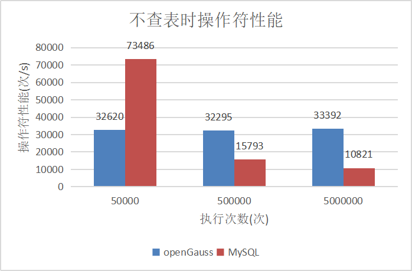

版权所有 © 2022  openGauss社区
 您对“本文档”的复制、使用、修改及分发受知识共享(Creative Commons)署名—相同方式共享4.0国际公共许可协议(以下简称“CC BY-SA 4.0”)的约束。为了方便用户理解，您可以通过访问https://creativecommons.org/licenses/by-sa/4.0/ 了解CC BY-SA 4.0的概要 (但不是替代)。CC BY-SA 4.0的完整协议内容您可以访问如下网址获取：https://creativecommons.org/licenses/by-sa/4.0/legalcode。

修订记录

| 日期       | 修订   版本 | 修改描述             | 作者      |
| ---------- | ----------- | -------------------- | --------- |
| 2022-11-29 | 1.0         | 特性测试报告初稿完成 | zhanghang |
|            |             |                      |           |

 关键词： 

操作符、^、&&、||、like、not like

摘要：

本文档主要对openGauss实现兼容MySQL中的操作符^、&&、||、like、not like进行测试，并给出测试结论。

缩略语清单：

| 缩略语 | 英文全名 | 中文解释 |
| ------ | -------- | -------- |
| N/A    |          |          |

# 1 特性概述

本次特性实现对兼容MySQL中的操作符^、&&、||、like、not like，^表示异或运算，&&表示逻辑与运算，||表示逻辑或营商，like表示简单的模式匹配，not like表示否定简单模式匹配，用户在兼容B库下加载dolphin插件时可以使用以上特性。

# 2 特性测试信息

| 版本名称                       | 测试起始时间 | 测试结束时间 |
| ------------------------------ | ------------ | ------------ |
| openGauss 3.1.0 build d850cf3b | 2022-09-23   | 2022-09-29   |
| openGauss 3.1.0 build 55a4ea7f | 2022-09-30   | 2022-10-09   |
| openGauss 3.1.0 build 448e8551 | 2022-11-28   | 2022-11-29   |
| MySQL 5.7.36                   | 2022-09-23   | 2022-11-29   |

| 环境信息 | 配置信息                                                     | 备注 |
| -------- | ------------------------------------------------------------ | ---- |
| 虚拟机   | CPU：Intel(R) Xeon(R) Gold 6278C CPU @ 2.60GHz<br />内存：32GB<br />硬盘：100GB<br />OS：CentOS Linux release 7.6.1810 (Core) |      |

# 3  测试结论概述

## 3.1 测试整体结论

openGauss-Mysql兼容性操作符开发合作项目共计执行用例69条，主要覆盖了功能测试、性能测试和资料测试。功能测试主要覆盖以下方面：

1.验证^操作符的功能

2.验证sql_mode取不同参数值时||操作符的功能

3.验证b_compatibility_mode取不同参数值时&&操作符的功能

4.验证b_compatibility_mode取不同参数值时like、not like是否区分大小写

5.在表、视图、存储过程、自定义函数中使用^、&&、||、like、not like操作符

6.隐式转换时使用^、&&、||、like、not like操作符

7.和数字操作符的交互

8.和ignore参数的交互

9.和查询语句的交互

10.验证lower_case_table_names参数是否影响like、not like操作符区分大小写

性能测试对比相同环境、同等条件下openGauss中操作符的性能不差于MySQL，资料测试覆盖资料描述是否准确、约束覆盖是否全面以及示例是否正确。

累计发现缺陷单12个，2个问题单是同类问题，合并后已取消，1个问题单属于非问题，已取消，9个问题单已修复且回归通过（其中1个问题单回归不通过一次），整体质量良好。

| 测试活动 | 活动评价                                                     |
| -------- | ------------------------------------------------------------ |
| 功能测试 | 验证^操作符的功能，通过                                      |
| 功能测试 | 验证sql_mode取不同参数值时\|\|操作符的功能，通过             |
| 功能测试 | 验证b_compatibility_mode取不同参数值时&&操作符的功能，通过   |
| 功能测试 | 验证b_compatibility_mode取不同参数值时like、not like是否区分大小写，通过 |
| 功能测试 | 在表、视图、存储过程、自定义函数中使用^、&&、\|\|、like、not like操作符，通过 |
| 功能测试 | 隐式转换时使用^、&&、\|\|、like、not like操作符，通过        |
| 功能测试 | 和数字操作符的交互，通过                                     |
| 功能测试 | 和ignore参数的交互，通过                                     |
| 功能测试 | 和查询语句的交互，通过                                       |
| 功能测试 | 验证lower_case_table_names参数是否影响like、not like操作符区分大小写，通过 |
| 性能测试 | 对比相同环境、同等条件下openGauss中操作符的性能不差于MySQL，通过 |
| 资料测试 | 资料描述是否准确、约束覆盖是否全面以及示例是否正确，通过     |

## 3.2 约束说明

- 兼容MySQL 5.7版本。
- openGauss需要在兼容B库下加载dolphin插件才能使用。
- b_compatibility_mode参数的值为true时，&&操作符实现逻辑与功能。
- sql_mode参数的值不含pipes_as_concat，||操作符实现逻辑或功能。
- 当b_compatibility_mode参数的值为true时，like和not like模式匹配时大小写不敏感，当b_compatibility_mode参数的值为false时，大小写敏感。
- like binary、not like binary采用大小写敏感模式匹配。
- blob类型在MySQL和openGauss中是不同类型，且MySQL中无bytea类型、raw类型，故在openGauss中like和not like模式匹配blob类型、bytea类型、raw类型时，按照openGauss当前处理方式运算。

## 3.3  遗留问题分析

### 3.3.1 遗留问题影响以及规避措施

| 问题单号 | 问题描述 | 问题级别 | 问题影响和规避措施 | 当前状态 |
| -------- | -------- | -------- | ------------------ | -------- |
| N/A      |          |          |                    |          |

### 3.3.2 问题统计

|        | 问题总数 | 严重 | 主要 | 次要 | 不重要 |
| ------ | -------- | ---- | ---- | ---- | ------ |
| 数目   | 12       | 0    | 0    | 12   | 0      |
| 百分比 | 100%     | 0    | 0    | 100% | 0      |

### 3.3.3 问题单汇总

| 序号 | issue号                                                      | 问题级别 | 问题简述                                                     | 问题状态 |
| ---- | ------------------------------------------------------------ | -------- | ------------------------------------------------------------ | -------- |
| 1    | [I5T8F2](https://gitee.com/opengauss/Plugin/issues/I5T8F2?from=project-issue) | 次要     | 整数型相等的值异或，返回结果和预期结果不符                   | 已取消   |
| 2    | [I5T8E7](https://gitee.com/opengauss/Plugin/issues/I5T8E7?from=project-issue) | 次要     | 部分uint类型和部分int类型异或操作，执行结果报错              | 已取消   |
| 3    | [I5T8BD](https://gitee.com/opengauss/Plugin/issues/I5T8BD?from=project-issue) | 次要     | uint类型异或操作，部分返回结果和预期结果不符                 | 已验收   |
| 4    | [I5T6IX](https://gitee.com/opengauss/Plugin/issues/I5T6IX?from=project-issue) | 次要     | 整数类型异或操作，numeric、int16两种数据类型的返回结果和预期结果不符 | 已验收   |
| 5    | [I5TGSB](https://gitee.com/opengauss/Plugin/issues/I5TGSB?from=project-issue) | 次要     | 二进制类型异或操作时，不支持blob形式                         | 已验收   |
| 6    | [I5TGW0](https://gitee.com/opengauss/Plugin/issues/I5TGW0?from=project-issue) | 次要     | 布尔类型异或时，部分返回结果和预期结果不一致                 | 已验收   |
| 7    | [I5URF0](https://gitee.com/opengauss/Plugin/issues/I5URF0?from=project-issue) | 次要     | 部分数值类型字符串逻辑与、逻辑或运算报错                     | 已取消   |
| 8    | [I5URJ4](https://gitee.com/opengauss/Plugin/issues/I5URJ4?from=project-issue) | 次要     | not like binary返回结果错误，和like binary返回结果一致       | 已验收   |
| 9    | [I5URVU](https://gitee.com/opengauss/Plugin/issues/I5URVU?from=project-issue) | 次要     | 部分浮点型逻辑与、逻辑或运算结果与预期不符                   | 已验收   |
| 10   | [I5VR2S](https://gitee.com/opengauss/Plugin/issues/I5VR2S?from=project-issue) | 次要     | char类型like、not like模式匹配，部分结果错误                 | 已验收   |
| 11   | [I5VQRL](https://gitee.com/opengauss/Plugin/issues/I5VQRL?from=project-issue) | 次要     | 部分类型异或，结果与预期不符                                 | 已验收   |
| 12   | [I60ITD](https://gitee.com/opengauss/Plugin/issues/I60ITD?from=project-issue) | 次要     | bit类型like、not like模式匹配，部分结果错误；blob类型like、not like模式匹配，报错 | 已验收   |


# 4 测试执行

## 4.1 功能测试

### 4.1.1 验证^操作符的功能

| 测试步骤            | 测试结果                                                     |
| ------------------- | ------------------------------------------------------------ |
| 1.验证^操作符的功能 | 执行8条用例，发现7个bug，2个问题单由于是同类问题合并后取消，5个已修复且验收通过 |

### 4.1.2 验证sql_mode取不同参数值时||操作符的功能

| 测试步骤                                                     | 测试结果                                                    |
| ------------------------------------------------------------ | ----------------------------------------------------------- |
| 1.sql_mode为sql_mode_strict，验证\|\|操作符<br />2.sql_mode为sql_mode_full_group，验证\|\|操作符<br />3.sql_mode为''，验证\|\|操作符<br />4.sql_mode为default，验证\|\|操作符<br />5.sql_mode为pipes_as_concat，验证\|\|操作符 | 执行7条用例，发现2个bug，1个已修复且验收通过，1个非问题取消 |

### 4.1.3 验证b_compatibility_mode取不同参数值时&&操作符的功能

| 测试步骤：                                                   | 测试结果                                     |
| ------------------------------------------------------------ | -------------------------------------------- |
| 1.b_compatibility_mode为布尔真值时，验证&&操作符<br />2.b_compatibility_mode为布尔假值时，验证&&操作符 | 执行7条用例，发现1个bug，1个已修复且验收通过 |

### 4.1.4 验证b_compatibility_mode取不同参数值时like、not like是否区分大小写

| 测试步骤：                                                   | 测试结果                                      |
| ------------------------------------------------------------ | --------------------------------------------- |
| 1.b_compatibility_mode为布尔真值时，验证like、not like是否区分大小写<br />2.b_compatibility_mode为布尔假值时，验证like、not like是否区分大小写 | 执行13条用例，发现2个bug，2个已修复且验收通过 |

### 4.1.5 在表、视图、存储过程、自定义函数中使用^、&&、||、like、not like操作符

| 测试步骤：                                                   | 测试结果                              |
| ------------------------------------------------------------ | ------------------------------------- |
| 1.在表、视图、存储过程、自定义函数中使用^、&&、\|\|、like、not like操作符 | 执行24条用例，未发现bug，结果符合预期 |

### 4.1.6 隐式转换时使用^、&&、||、like、not like操作符

| 测试步骤：                                        | 测试结果                             |
| ------------------------------------------------- | ------------------------------------ |
| 1.隐式转换时使用^、&&、\|\|、like、not like操作符 | 执行1条用例，未发现bug，结果符合预期 |

### 4.1.7 和数字操作符的交互

| 测试步骤：           | 测试结果                             |
| -------------------- | ------------------------------------ |
| 1.和数字操作符的交互 | 执行1条用例，未发现bug，结果符合预期 |

### 4.1.8 和ignore参数的交互

| 测试步骤：           | 测试结果                             |
| -------------------- | ------------------------------------ |
| 1.和ignore参数的交互 | 执行1条用例，未发现bug，结果符合预期 |

### 4.1.9 和查询语句的交互

| 测试步骤：         | 测试结果                             |
| ------------------ | ------------------------------------ |
| 1.和查询语句的交互 | 执行1条用例，未发现bug，结果符合预期 |

### 4.1.10 验证lower_case_table_names参数是否影响like、not like操作符区分大小写

| 测试步骤：                                                   | 测试结果                             |
| ------------------------------------------------------------ | ------------------------------------ |
| 1.验证lower_case_table_names参数是否影响like、not like操作符区分大小写 | 执行1条用例，未发现bug，结果符合预期 |

## 4.2  性能测试

| 测试步骤：                                                   | 测试结果                                                     |
| ------------------------------------------------------------ | ------------------------------------------------------------ |
| 1.^操作符在MySQL侧和openGauss侧分别执行50000次、500000次、5000000次，计算平均性能<br />2.&&操作符在MySQL侧和openGauss侧分别执行50000次、500000次、5000000次，计算平均性能<br />3.\|\|操作符在MySQL侧和openGauss侧分别执行50000次、500000次、5000000次，计算平均性能<br />4.like操作符在MySQL侧和openGauss侧分别执行50000次、500000次、5000000次，计算平均性能<br />5.not like操作符在MySQL侧和openGauss侧分别执行50000次、500000次、5000000次，计算平均性能 | 执行5条用例，结论如下：<br />1.操作符执行次数较少(50000次)时，^、&&、\|\|、like、not like操作符在MySQL中的性能优于openGauss<br />2.操作符执行次数较多(500000次、5000000次)时，^、&&、\|\|、like、not like操作符在openGauss中的性能优于MySQL<br />3.openGauss中^、&&、\|\|、like、not like操作符不查表时约33000次/s，查表时约18000次/s |

## 4.3  资料测试

| 测试步骤：                                           | 测试结果        |
| ---------------------------------------------------- | --------------- |
| 1.资料描述是否准确、约束覆盖是否全面以及示例是否正确 | 未发现bug，通过 |

## 4.3 测试执行统计数据

| 版本名称                       | 测试用例数 | 用例执行结果              | 发现问题单数 |
| ------------------------------ | ---------- | ------------------------- | ------------ |
| openGauss 3.1.0 build 0b50eccc | 69         | Passed：61<br />Failed：8 | 9            |
| openGauss 3.1.0 build 075791e0 | 69         | Passed：65<br />Failed：4 | 3            |
| openGauss 3.1.0 build 448e8551 | 69         | Passed：69<br />Failed：0 | 0            |

数据说明

1.  测试中累计发现缺陷单12个，2个问题单是同类问题，合并后取消，1个问题单属于非问题，已取消，9个问题单已修复且回归通过（其中1个问题单回归不通过一次）
2.  缺陷密度：9个（缺陷个数）/6.353kloc（代码行数）=1.4个/kloc

## 4.4 后续测试建议

1.使用Jmeter工具测试操作符性能，对比openGauss和MySQL中不同操作符的性能

# 5 附件

## 5.1 验证位串类型异或运算示例

```sql
--step1:位串类型异或运算; expect:运算成功
dbtest=# select b'1010'^b'0101';
 ?column?
----------
 1111
(1 row)

dbtest=# select b'1010'^b'1010';
 ?column?
----------
 0000
(1 row)

dbtest=# select b'1010'^b'0010';
 ?column?
----------
 1000
(1 row)

dbtest=# select b'1010'^b'0011';
 ?column?
----------
 1001
(1 row)

dbtest=# select b'1010'^b'1100';
 ?column?
----------
 0110
(1 row)

dbtest=# select b'000'^b'101';
 ?column?
----------
 101
(1 row)

dbtest=# select b'000'^b'000';
 ?column?
----------
 000
(1 row)

dbtest=# select '1010'::bit(4)^'0101'::bit(4);
 ?column?
----------
 1111
(1 row)

dbtest=# select '1010'::bit(4)^'1010'::bit(4);
 ?column?
----------
 0000
(1 row)

dbtest=# select '1010'::bit(4)^'0010'::bit(4);
 ?column?
----------
 1000
(1 row)

dbtest=# select '1010'::bit(4)^'0011'::bit(4);
 ?column?
----------
 1001
(1 row)

dbtest=# select '1010'::bit(4)^'1100'::bit(4);
 ?column?
----------
 0110
(1 row)

dbtest=# select '000'::bit^'101'::bit;
 ?column?
----------
 1
(1 row)

dbtest=# select '000'::bit^'000'::bit;
 ?column?
----------
 0
(1 row)
```

## 5.2  操作符性能测试数据

### 5.2.1 不查表时性能对比

<table align="center">
     <tr>
      <th align="center" rowspan="3">操作符</th><th align="center" colspan="6">不查表用时(单位：s)</th>
     </tr>
     <tr>
      <th align="center" colspan="2">50,000次</th> <th align="center" colspan="2">500,000次</th><th align="center" colspan="2">5,000,000次</th>
     </tr>
    <tr>
    <th>openGauss</th><th>Msyql5.7</th><th>openGauss</th><th>Msyql5.7</th><th>openGauss</th><th>Msyql5.7</th>
    </tr>
     <tr>
       <td>^</td><td>1.20</td><td>0.67</td><td>12.59</td><td>32.39</td><td>129.96</td><td>429.15</td>
     </tr>
     <tr>
       <td>&&</td> <td>1.40</td><td>0.64</td><td>15.29</td><td>29.78</td><td>155.76</td><td>442.13</td>
     </tr> 
    <tr>
       <td>||</td> <td>1.32</td><td>0.67</td><td>14.10</td><td>26.43</td><td>144.34</td><td>451.70</td>
     </tr>
     <tr>
       <td>like</td> <td>1.96</td><td>0.66</td><td>16.46</td><td>30.52</td><td>145.06</td><td>487.44
     </tr>
     <tr>
       <td>not like</td> <td>1.78</td><td>0.76</td><td>18.98</td><td>39.19</td><td>173.58</td><td>499.81</td>
     </tr>
</table>

### 5.2.2 查表时性能对比

<table align="center">
     <tr>
      <th align="center" rowspan="3">操作符</th><th align="center" colspan="6">查表用时(单位：s)</th>
     </tr>
     <tr>
      <th align="center" colspan="2">50,000次</th> <th align="center" colspan="2">500,000次</th><th align="center" colspan="2">5,000,000次</th>
     </tr>
    <tr>
    <th>openGauss</th><th>Msyql5.7</th><th>openGauss</th><th>Msyql5.7</th><th>openGauss</th><th>Msyql5.7</th>
    </tr>
     <tr>
       <td>^</td><td>2.36</td><td>0.97</td><td>23.20</td><td>35.16</td><td>233.63</td><td>451.57</td>
     </tr>
     <tr>
       <td>&&</td> <td>2.89</td><td>0.98</td><td>29.69</td><td>34.59</td><td>283.86</td><td>479.32</td>
     </tr> 
    <tr>
       <td>||</td> <td>2.82</td><td>1.00</td><td>28.65</td><td>33.04</td><td>295.48</td><td>441.97</td>
     </tr>
     <tr>
       <td>like</td> <td>2.72</td><td>0.94</td><td>25.87</td><td>34.15</td><td>278.28</td><td>512.12</td>
     </tr>
     <tr>
       <td>not like</td> <td>3.27</td><td>1.07</td><td>32.87</td><td>39.31</td><td>296.67</td><td>521.67</td>
     </tr>
</table>

### 5.2.3 操作符性能对比图



