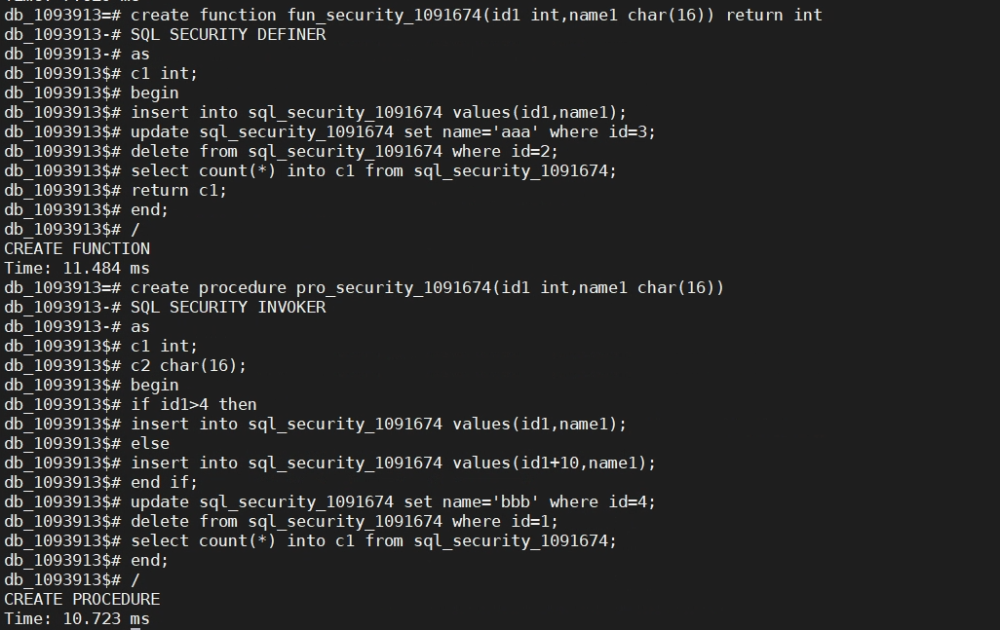

版权所有 © 2022  openGauss社区
您对“本文档”的复制、使用、修改及分发受知识共享(Creative Commons)署名—相同方式共享4.0国际公共许可协议(以下简称“CC BY-SA 4.0”)的约束。为了方便用户理解，您可以通过访问https://creativecommons.org/licenses/by-sa/4.0/ 了解CC BY-SA 4.0的概要 (但不是替代)。CC BY-SA 4.0的完整协议内容您可以访问如下网址获取：https://creativecommons.org/licenses/by-sa/4.0/legalcode。

修订记录

| 日期 | 修订   版本 | 修改描述 | 作者 |
| --- | --- | --- | --- |
| 2022-09-23 | 1.0 | 测试报告初稿完成 | wangrururu |
|  |  |  |  |
|  |  |  |  |
|  |  |  |  |

关键词：

dolphin插件，SQL SECURITY语句，兼容B库

摘要：

本文档主要介绍openGauss在兼容B库且有dolphin插件的情形下，实现兼容mysql在函数和存储过程中支持SQL SECURITY语句。与原有的SECURITY INVOKER、SECURITY DEFINER语法兼容。

# 1     特性概述

openGauss在兼容B库情形下，安装dolphin插件，可以实现实现兼容mysql在函数和存储过程中支持SQL SECURITY语句。

# 2     特性测试信息

本节描述被测对象的版本信息和测试的时间及测试轮次，包括依赖的硬件。

| 版本名称 | 测试起始时间 | 测试结束时间 |
| --- | --- | --- |
| opengauss 3.1.0 build a100917c | 2022-09-19 | 2022-09-19 |
| dolphin 1.0 | 2022-09-19 | 2022-09-19 |

描述特性测试的环境信息

| 环境信息 | 配置信息 | 备注 |
| --- | --- | --- |
| 虚拟机 | CPU：Intel(R) Xeon(R) Gold 6130 CPU @ 2.10GHz 8核 OS：CentOS Linux release 7.6.1810 (Core) |  |

# 3     测试结论概述

## 3.1   测试整体结论
openGauss兼容mysql，在函数和存储过程中支持SQL SECURITY语句，测试用例20条，主要覆盖了功能测试及资料测试。功能测试覆盖：自定义模式以及public模式下，SQL SECURITY INVOKER、SQL SECURITY DEFINER以及没有SQL SECURITY语句时超户、普通用户调用函数和存储过程的情况，校验输出结果。资料测试覆盖校验资料的描述及示例的执行结果。累计发现问题单2个，2个非本需求问题取消。

| **测试活动** | **活动评价** |
| --- | --- |
| 功能测试 | 自定义模式下无SQL SECURITY语句，执行结果符合预期，通过 |
| 功能测试 | 自定义模式下SQL SECURITY INVOKER语句，执行结果符合预期，通过 |
| 功能测试 | 自定义模式下SQL SECURITY DEFINER 语句，执行结果符合预期，通过 |
| 功能测试 | public模式下无SQL SECURITY语句，执行结果符合预期，通过 |
| 功能测试 | public模式下SQL SECURITY INVOKER语句，执行结果符合预期，通过 |
| 资料测试 | public模式下SQL SECURITY DEFINER 语句，执行结果符合预期，通过 |

## 3.2   约束说明
1.openGauss需使用兼容B库且有dolphin插件
## 3.3   遗留问题分析

### 3.3.1  遗留问题影响以及规避措施
| 问题单号 | 问题描述 | 问题级别 | 问题影响和规避措施 | 当前状态 |
| --- | --- | --- | --- | --- |
| N/A |  |  |  |  |

### 3.3.2  问题统计
|  | 问题总数 | 严重 | 主要 | 次要 | 不重要 |
| --- | --- | --- | --- | --- | --- |
| 数目 | 2 |  | 2 |  |  |
| 百分比 | 100% |  | 100% |  |  |

### 3.3.3  问题单汇总
| **序号** | **issue号** | **问题级别** | **问题简述** | **问题状态** |
| --- | --- | --- | --- | --- |
| 1 | [I5RUCT](https://gitee.com/opengauss/Plugin/issues/I5RUCT?from=project-issue) | 主要 | 没有给普通用户函数的调用权限，但其能调用 | 已取消 |
| 2 | [I5RUGZ](https://gitee.com/opengauss/Plugin/issues/I5RUGZ?from=project-issue) | 主要 | 无法剥夺普通用户调用函数的权限 | 已取消 |

# 4     测试执行

## 4.1   测试执行步骤

### 4.1.1 编译库及插件执行测试
| **测试步骤** | **测试结果** |
| --- | --- |
| 1. 编译安装openGauss数据库  2. 编译dolphin插件  3. 创建兼容B库并安装dolphin插件  4. 执行用例 | 编译库及插件成功，共执行20条用例，共发现2个bug，2条非本需求问题已取消 |

#### 4.1.1.1 public模式下，SQL SECURITY语句的执行情况
| **测试步骤** | **测试结果** |
| --- | --- |
|  1. 创建兼容B库并安装dolphin插件  2. 执行用例  | 编译库及插件成功，共执行6条用例，共发现0个bug |

#### 4.1.1.2 自定义模式下，SQL SECURITY语句的执行情况
| **测试步骤** | **测试结果** |
| --- | --- |
|  1. 创建兼容B库并安装dolphin插件  2. 执行用例  | 编译库及插件成功，共执行6条用例，共发现0个bug |

#### 4.1.1.3 其他兼容模式下以及异常场景下，SQL SECURITY语句的执行情况
| **测试步骤** | **测试结果** |
| --- | --- |
| 1. 创建兼容B库并安装dolphin插件  2. 执行用例 | 编译库及插件成功，共执行8条用例，共发现0个bug |

## 4.2   测试执行统计数据
| **版本名称** | **测试用例数** | **用例执行结果** | **发现问题单数** |
| --- | --- | --- | --- |
| opengauss 3.1.0 build a100917c | 20 | Passed：20 Failed：0 | 2 |

数据说明

1. 累计发现问题单2个，2个非本需求产生的问题，取消
## 4.3   后续测试建议
在opengauss上：  
1.在普通用户初始理应没有超户创建的函数的调用权限  
2.在剥夺了普通用户调用函数权限后，实际没有剥夺，希望日后完成修复
# 5     附件
## 5.1 函数和存储过程中包含SQL SECURITY语句的示例

