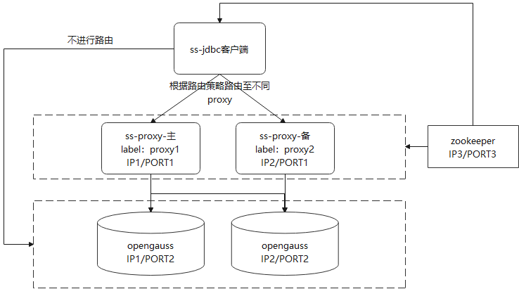

版权所有 © 2022  openGauss社区
 您对“本文档”的复制、使用、修改及分发受知识共享(Creative Commons)署名—相同方式共享4.0国际公共许可协议(以下简称“CC BY-SA 4.0”)的约束。为了方便用户理解，您可以通过访问https://creativecommons.org/licenses/by-sa/4.0/ 了解CC BY-SA 4.0的概要 (但不是替代)。CC BY-SA 4.0的完整协议内容您可以访问如下网址获取：https://creativecommons.org/licenses/by-sa/4.0/legalcode。

修订记录

| 日期      | 修订   版本 | 修改描述             | 作者       |
| :-------- | ----------- | -------------------- | ---------- |
| 2022-7-19 | 1.0         | 特性测试报告初稿完成 | peilinqian |
|           |             |                      |            |

关键词： 

openGauss分布式、sharding-proxy、sharding-jdbc、双路由Traffic Rule

摘要：

本文档主要验证双路由涉及相关基础配置、路由规则是否可以正常配置，且配置双路由策略后，是否按照配置的相应策略路由和负载均衡，并给出最终测试结论。 

缩略语清单：

| 缩略语       | 英文全名             | 中文解释                                                     |
| ------------ | -------------------- | ------------------------------------------------------------ |
| ss-jdbc      | shardingsphere-JDBC  | 定位为轻量级 Java 框架，在 Java 的 JDBC 层提供的额外服务。 它使用客户端直连数据库，以 jar 包形式提供服务，无需额外部署和依赖，可理解为增强版的 JDBC 驱动，完全兼容 JDBC 和各种 ORM 框架。 |
| ss-proxy     | shardingsphere-Proxy | 定位为透明化的数据库代理端，提供封装了数据库二进制协议的服务端版本，用于完成对异构语言的支持。 目前提供 MySQL 和 PostgreSQL（兼容 openGauss 等基于 PostgreSQL 的数据库）版本，它可以使用任何兼容 MySQL/PostgreSQL 协议的访问客户端（如：MySQL Command Client, MySQL Workbench, Navicat 等）操作数据，对 DBA 更加友好。 |
| Proxy Label  | Proxy Label          | proxy实例配置标签属性，用于对proxy实例进行区分，当开启Traffic功能时，转发的目标就是标签对应的proxy实例。 |
| Traffic Rule | Traffic Rule         | 用于判断当前执行的SQL语句是否需要转发，支持多种算法，主要包含3个属性，label（proxy 对应标签）、algorithmName（转发匹配算法）、loadBalancerName（负载均衡策略）。 |
| ZK           | zookeeper            | ZooKeeper 是 Apache 软件基金会的一个软件项目，它为大型分布式计算提供开源的分布式配置服务、同步服务和命名注册。 |

# 1  特性概述

在实际的应用场景中，应用程序和数据库可能部署在不同的网络区域中，应用程序使用 JDBC 接入端连接另外一个网络区域的数据库，由于 JDBC 接入端连接消耗较大，较多的跨网络区域连接必然会导致查询性能下降。此外，对于部分占用内存和 CPU 资源较多的 SQL，在 JDBC 端执行会消耗较多的应用资源，应用的稳定性和性能会受到影响。为了提升该场景下的查询性能，保证应用的稳定性，我们考虑将 JDBC 端的请求转发至和数据库位于同一网络区域的 Proxy 接入端，由Proxy 接入端计算好查询结果，再统一返回给 JDBC 接入端，最后返回给应用程序。

Traffic双路由功能需要使用混合部署架构，同时部署ss-proxy、ss-jdbc并通过注册中心统一管理分片等配置。由于Traffic双路由功能必须配置ss-proxy使用，因此只允许ss-proxy接入端通过YAML配置或者DistSQL 来添加Traffic Rule。此外为了配合Traffic功能，ss-proxy接入端需要配置label标签，用于Traffic转发的配置。

转发策略包括：SQL Hint转发匹配、SQL字符串转发匹配、SQL字符串正则转发匹配、事务转发策略四种；其中事务转发策略可配置FIRST_SQL（基于第一条SQL转发匹配）、JDBC（不进行转发）、PROXY（同一事务内SQL语句统一转发同一Proxy实例）。

# 2  特性测试信息

| 版本名称                                                     | 测试起始时间 | 测试结束时间 |
| ------------------------------------------------------------ | ------------ | ------------ |
| ShardingSphere-5.1.1 ShardingSphere官网发布包           | 2022-6-12    | 2022-6-13    |
| ShardingSphere-5.1.3-SNAPSHOT Commit ID: 7c67365b394d2e3ac562329b550c135c31ea764d | 2022-7-13    | 2022-7-15    |
| ShardingSphere-5.1.3-SNAPSHOT Commit ID: 9dd0d3990c849d50c17c6dc7c92ec2d4ce0ad7e5 | 2022-7-18    | 2022-7-19    |

| 硬件型号   | 硬件配置信息                                                 | 备注                                                         |
| ---------- | ------------------------------------------------------------ | ------------------------------------------------------------ |
| x86+centOS | Intel(R) Xeon(R) Gold 6161 CPU @ 2.20GHz 8核 内存：32GB 硬盘：100G OS：CentOS Linux release 7.6.1810 (Core) | 3台主机组合配置部署 至少2分片opengauss、2ss-proxy、1zookeeper、1ss-jdbc |

| 软件名称             | 软件版本                                                     | 备注                                                         |
| -------------------- | ------------------------------------------------------------ | ------------------------------------------------------------ |
| shardingsphere-Proxy | ShardingSphere-5.1.1 ShardingSphere官网发布包  ShardingSphere-5.1.3-SNAPSHOT Commit ID: 9dd0d3990c849d50c17c6dc7c92ec2d4ce0ad7e5 Commit ID: 7c67365b394d2e3ac562329b550c135c31ea764d | ShardingSphere-5.1.1官网发布二进制包地址： https://archive.apache.org/dist/shardingsphere/5.1.1/apache-shardingsphere-5.1.1-shardingsphere-proxy-bin.tar.gz ShardingSphere-5.1.3官网源码包github地址： https://github.com/apache/shardingsphere |
| ShardingSphere-JDBC  | ShardingSphere-5.1.1 ShardingSphere官网发布包  ShardingSphere-5.1.3-SNAPSHOT Commit ID: 9dd0d3990c849d50c17c6dc7c92ec2d4ce0ad7e5 Commit ID: 7c67365b394d2e3ac562329b550c135c31ea764d |                                                              |
| zookeeper            | 3.8.0                                                        |                                                              |
| openGauss            | openGauss 3.0.0 8198a77b                                |                                                              |

**测试组网图：**

# 3  测试结论概述

## 3.1   测试整体结论

设计用例总数30个，其中，功能用例27个，全部通过，发现缺陷单5个，均已解决，回归通过；可靠性用例3个，通过2个，失败1个，提出1个需求单，待后续优化。

| 测试活动   | 活动评价                                                     |
| ---------- | ------------------------------------------------------------ |
| 功能测试   | Label通过yaml配置文件、DistSQL两种方式可以进行增删改查，功能正常，验收通过。 |
| 功能测试   | Traffic Rule通过yaml配置文件、DistSQL方式进行增删改查，功能正常，验收通过。 |
| 功能测试   | 四种转发策略功能验证； 多种转发策略同时匹配，按照配置的顺序依次匹配验证； 负载均衡算法（RANDOM、ROUND_ROBIN）验证； 不同label对应不同proxy、一个label对应不同proxy、一个proxy对应多个label等场景路由功能正确； SQL字符串匹配算法忽略大小写及空白符； SQL字符串正则转发匹配，通过正则表达式也可实现忽略大小写及空白符； 以上所有场景功能正常，验收通过。 |
| 可靠性测试 | 配置的路由转发label无对应proxy；功能正常，验收通过。 配置不同转发策略，ss-jdbc高并发等场景验证；功能正常，验收通过。 执行路由转发过程中通过DistSQL修改转发策略；目前存在问题，已提需求单跟踪。 |

## 3.2   约束说明

- ss-proxy5.1.1版本及以上具备双路由功能；
- 为了解决事务一致性问题，不支持开启事务后将SQL转发到不同接入端或者Proxy实例执行；
- Traffic 双路由功能必须采用 ss-proxy+ ss-jdbc混合部署架构，使用统一的配置中心zookeeper统一管理；
- 为了配合Traffic功能，ss-proxy接入端需要配置labels标签，用于Traffic转发的配置；
- 如果需要使用SQL_Hint转发策略，则需要打开注释解析开关。将 `sqlCommentParseEnabled` 设置为 true。

## 3.3   遗留问题分析

### 3.3.1 遗留问题影响以及规避措施

| 问题单号 | 问题描述 | 问题级别 | 问题影响和规避措施 | 当前状态 |
| -------- | -------- | -------- | ------------------ | -------- |
| NA       |          |          |                    |          |

### 3.3.2 问题统计

|        | 问题总数 | 严重 | 主要 | 次要 | 不重要 |
| ------ | -------- | ---- | ---- | ---- | ------ |
| 数目   | 5     | 1    | 3    | 1   | 0      |
| 百分比 |          | 20% | 60%  | 20%  | 0%     |

### 3.3.3 问题单汇总

| 序号 | issue号                                                      | 问题级别 | 问题简述                                                     | 问题状态 |
| ---- | ------------------------------------------------------------ | -------- | ------------------------------------------------------------ | -------- |
| 1    | 未提线上单                                                   | 严重     | ss-jdbc连跑tpcc业务，配置事务路由方式为proxy，一个线程跑1个事务场景，发现事务内9条sql语句中，有两条未路由至proxy，导致ss-jdbc执行存在超时问题；问题原因：batch 场景未适配双路由； | 已验收   |
| 2    | 未提线上单                                                   | 次要     | sql_hint_traffic路由策略配置算法使用use_traffic: true/false进行开关设置，但是实际调用SQL语句也有注释格式 /* shardingsphere hint:useTraffic=true */属性来开启SQL Hint转发，有些重复不合理，需要简化sql_hint_traffic转发策略配置。 | 已验收   |
| 3    | [19137](https://github.com/apache/shardingsphere/issues/19137) | 主要     | distsql进行创建路由规则失败后，所有traffic相关distsql语句执行均异常。 | 已验收   |
| 4    | [19114](https://github.com/apache/shardingsphere/issues/19114) | 主要     | ss-jdbc初始化连接去校验其他schema的og连接信息，实际不应该去校验。 | 已验收   |
| 5    | [19215](https://github.com/apache/shardingsphere/issues/19215) | 主要     | label相关的distsql 增删改语法不支持。                        | 已验收   |

### 3.3.4 需求单统计

| 需求单号                                                     | 需求描述                                                     |
| ------------------------------------------------------------ | ------------------------------------------------------------ |
| [19447](https://github.com/apache/shardingsphere/issues/19447) | 在业务请求的同时刷新元数据时，业务可能会发生异常。例如：当一个事务在进行路由转发时，通过 distsql 修改路由转发规则，事务概率性出现失败。需要考虑可靠性后进行优化。 |

# 4  测试执行

## 4.1  测试执行步骤

### 4.1.1 DistSQL语句配置场景测试流程

（1）部署1ZK+2ss-proxy+2Opengauss环境，ss-proxy打开SQL执行日志打印开关（sql-show: true），启动两个ss-proxy

（2）连接ss-proxy客户端，通过DistSQL相关的Label语法配置2个proxy的label属性，并进行查询验证；

（3）连接ss-proxy客户端，通过DistSQL相关的Traffic Rule语法配置路由转发策略，并通过相应的查询SQL进行验证；

（4）tail -f 打开两个ss-proxy日志，本地ss-jdbc应用执行相应的SQL语句，通过SQL日志打印位置，验证是否按照配置的路由规则进行路由至不同的ss-proxy客户端执行。

### 4.1.2 Yaml文件配置场景测试流程

（1）部署1ZK+2ss-proxy+2Opengauss环境，ss-proxy打开SQL执行日志打印开关（sql-show: true）；

（2）不同ss-proxy的server.yaml文件配置Label相关的信息；

（3）主ss-proxy的server.yaml文件配置Traffic Rule相关信息；

（4）启动两个ss-proxy，查询相应的Label和Traffic Rule相关信息是否正确；

（5）tail -f 打开两个ss-proxy日志，本地ss-jdbc应用执行相应的SQL语句，通过SQL日志打印位置，验证是否按照配置的路由规则进行路由至不同的ss-proxy客户端执行。

注：通过yaml方式配置，每次进行修改后，均需重启主ss-proxy才能生效。

## 4.2  测试执行统计数据

| 版本名称                                                     | 测试用例数                          | 用例执行结果                                  | 发现问题单数           |
| ------------------------------------------------------------ | ----------------------------------- | --------------------------------------------- | ---------------------- |
| ShardingSphere-5.1.1 ShardingSphere官网发布包           | 测试用例：5个                       | Passed：4 Failed：1                        | 缺陷：2                |
| ShardingSphere-5.1.3-SNAPSHOT Commit ID: 7c67365b394d2e3ac562329b550c135c31ea764d | 测试用例：30个 回归问题单：2个 | Passed：27 Failed：3 issue Passed：2 | 缺陷：3 需求单：1 |
| ShardingSphere-5.1.3-SNAPSHOT Commit ID: 9dd0d3990c849d50c17c6dc7c92ec2d4ce0ad7e5 | 回归问题单：3个                     | issue Passed：3                               | 0                      |

*数据项说明：*

* 总计设计用例30个，其中5个用例在ShardingSphere-5.1.1版本和7c67365b394d2e3ac562329b550c135c31ea764d均执行1次；累计发现缺陷单5个，5个缺陷已解决且回归通过，遗留一个可靠性需求单。
* 每个版本失败用例及发现缺陷均已在问题修复后，下个版本均回归通过。

## 4.3   后续测试建议

无

# 5     附件

无