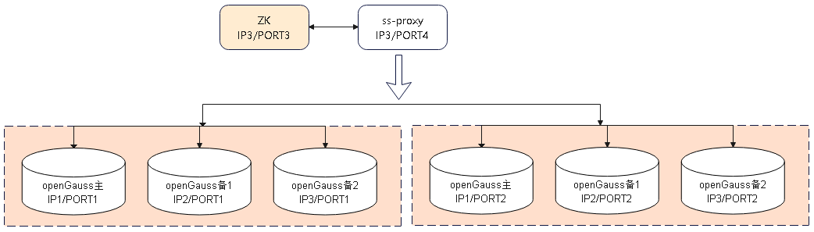

版权所有 © 2022  openGauss社区
 您对“本文档”的复制、使用、修改及分发受知识共享(Creative Commons)署名—相同方式共享4.0国际公共许可协议(以下简称“CC BY-SA 4.0”)的约束。为了方便用户理解，您可以通过访问https://creativecommons.org/licenses/by-sa/4.0/ 了解CC BY-SA 4.0的概要 (但不是替代)。CC BY-SA 4.0的完整协议内容您可以访问如下网址获取：https://creativecommons.org/licenses/by-sa/4.0/legalcode。

修订记录

| 日期       | 修订   版本 | 修改描述             | 作者       |
| ---------- | ----------- | -------------------- | ---------- |
| 2022-10-12 | 1.0         | 特性测试报告初稿完成 | peilinqian |

关键词： 

openGauss 分布式、ShardingSphere-Proxy、ShardingSphere-JDBC、Cursor、游标

摘要：

本文档主要验证 Sharding分布式cursor语法功能支持情况，包括：Sharding 场景下 cursor 使用 、读写分离功能场景下 cursor 使用、结合视图cursor 使用，并给出最终测试结论。

缩略语清单：

| 缩略语   | 英文全名             | 中文解释                                                     |
| -------- | -------------------- | ------------------------------------------------------------ |
| ss-proxy | shardingsphere-Proxy | 定位为透明化的数据库代理端，提供封装了数据库二进制协议的服务端版本，用于完成对异构语言的支持。 目前提供 MySQL 和 PostgreSQL（兼容 openGauss 等基于 PostgreSQL 的数据库）版本，它可以使用任何兼容 MySQL/PostgreSQL 协议的访问客户端（如：MySQL Command Client, MySQL Workbench, Navicat 等）操作数据，对 DBA 更加友好。 |
| ZK       | zookeeper            | ZooKeeper 是 Apache 软件基金会的一个软件项目，它为大型分布式计算提供开源的分布式配置服务、同步服务和命名注册。 |

# 1     特性概述

openGauss 分布式方案中，使用 JDBC 连接 shardingsphere 组件后无法通过游标读取数据，这导致客户端工具 DataStudio 无法正确与其交互，影响可视化工具适配。需要为 shardingsphere + openGauss 添加游标的 cursor/fetch 语法功能支持以扩大分布式式语法适配范围。

# 2     特性测试信息

| 版本名称                                                     | 测试起始时间 | 测试结束时间 |
| ------------------------------------------------------------ | ------------ | ------------ |
| ShardingSphere-5.1.2-SNAPSHOT Commit ID:952c1feacb26bc03ea4ea14d9f82b0d5777732c2 | 2022/6/18    | 2022/6/23    |
| ShardingSphere-5.1.3-SNAPSHOT Commit ID:085264b578f54969b72521459a4ec0cec7ab5390 | 2022/6/24    | 2022/6/24    |
| ShardingSphere-5.2.1-SNAPSHOT Commit ID:4114e7ee4cbe5923c2b403a3e86d1f23355cadf3 | 2022/9/27    | 2022/9/28    |
| ShardingSphere-5.2.1-SNAPSHOT Commit ID:a467bbe1668c2c300d3c91236e9e213c565ab7bf | 2022/10/9    | 2022/10/9    |
| ShardingSphere-5.2.1-SNAPSHOT Commit ID:bcde6f374c4a3a025173fbc9f6d0e66ed686a042 | 2022/10/11   | 2022/10/12   |

| 硬件型号   | 硬件配置信息                                                 | 备注                                                         |
| ---------- | ------------------------------------------------------------ | ------------------------------------------------------------ |
| x86+centOS | Intel(R) Xeon(R) Gold 6161 CPU @ 2.20GHz 8核 内存：32GB 硬盘：100G OS：CentOS Linux release 7.6.1810 (Core) | 3台主机组合配置部署 至少2分片opengauss（一主两备）、1ss-proxy、1zookeeper |

| 软件名称             | 软件版本                                                     | 备注                                                         |
| -------------------- | ------------------------------------------------------------ | ------------------------------------------------------------ |
| shardingsphere-Proxy | **ShardingSphere-5.1.2-SNAPSHOT Commit ID:** 952c1feacb26bc03ea4ea14d9f82b0d5777732c2 **ShardingSphere-5.1.3-SNAPSHOT Commit ID:** 085264b578f54969b72521459a4ec0cec7ab5390 **ShardingSphere-5.2.1-SNAPSHOT Commit ID:** 4114e7ee4cbe5923c2b403a3e86d1f23355cadf3 a467bbe1668c2c300d3c91236e9e213c565ab7bf bcde6f374c4a3a025173fbc9f6d0e66ed686a042 | 官网源码包github地址： https://github.com/apache/shardingsphere |
| zookeeper            | 3.8.0                                                        |                                                              |
| openGauss            | openGauss 3.0.0 8198a77b                                |                                                              |

# 3     测试结论概述

## 3.1   测试整体结论

共计设计23个用例，主要覆盖了功能测试和可靠性测试，发现问题7个，已解决，回归通过，无遗留风险，整体质量良好；

| 测试活动   | 活动评价                                                     |
| ---------- | ------------------------------------------------------------ |
| 功能测试   | cursor语法（创建、迭代、关闭）覆盖多种类型表：单表随机路由、单表指定路由、分库表、分库分表、广播表、视图，功能正常；验收通过； cursor语法异常场景测试，可正常抛错；验收通过； cursor语法执行未正常close cursor场景验证，不会产生异常，ss-proxy及opengauss数据库功能均正常；验收通过； 通过ss-proxy、jdbc连接ss-proxy场景执行cursor语法，功能正常；验收通过； cursor语法参数覆盖，需求已覆盖部分功能正常；验收通过； cursor语法读写分离场景验证，cursor语法（创建、迭代、关闭）全部路由至主库；功能正常，验收通过。 |
| 可靠性测试 | cursor创建、迭代、关闭等语法执行前，注入某个分片库数据库状态异常、分片表异常等故障，验证可正常抛错，恢复故障后，不重启ss-proxy，功能可恢复正常；验收通过。 |

## 3.2   约束说明

（1）目前仅支持事务内定义使用游标；

（2）分片场景下支持游标创建、向前遍历和关闭，不支持重新定位游标及其他游标遍历方式；

（3）游标创建时，支持逻辑表、广播表、单表和视图，创建游标的query语句，只允许包含order by语句，不支持group by、having、limit和join等语句；

（4）游标创建使用时，query语句中包含sum、count、min、max和distinct等聚合函数操作时，需要用户自行保证跨库的正确性；

（5）ss-jdbc目前暂未适配游标语法；

（6）ss-proxy5.1.3 snapshot 版本及以上具备 cursor 功能；

## 3.3   遗留问题分析

### 3.3.1 遗留问题影响以及规避措施

| 问题单号 | 问题描述 | 问题级别 | 问题影响和规避措施 | 当前状态 |
| -------- | -------- | -------- | ------------------ | -------- |
| NA       |          |          |                    |          |

### 3.3.2 问题统计

|        | 问题总数 | 严重   | 主要   | 次要   | 不重要 |
| ------ | -------- | ------ | ------ | ------ | ------ |
| 数目   | 7        | 1      | 3      | 3      | 0      |
| 百分比 | 100%     | 14.29% | 42.86% | 42.86% | 0%     |

### 3.3.3 问题单汇总

| 序号 | issue号                                                      | 问题级别 | 问题简述                                                     | 问题状态 |
| ---- | ------------------------------------------------------------ | -------- | ------------------------------------------------------------ | -------- |
| 1    | [18433](https://github.com/apache/shardingsphere/issues/18433) | 主要     | 'fetch from cursor1'语法不支持。                             | 关闭     |
| 2    | [18456](https://github.com/apache/shardingsphere/issues/18456) | 次要     | insertSQL语句概率性报错“ ERROR: syntax error at or near "valuesorg"” | 关闭     |
| 3    | [18475](https://github.com/apache/shardingsphere/issues/18475) | 主要     | 关闭所有游标close all，执行报错。                            | 关闭     |
| 4    | [18540](https://github.com/apache/shardingsphere/issues/18540) | 次要     | cursor、fetch、move、close相关指令正常执行后，无返回信息     | 关闭     |
| 5    | 未提单                                                       | 主要     | 广播表cursor查询数据重复，汇总了所有分片下的数据，与预期不符；发现问题时下个版本已修复，未提单。 | 关闭     |
| 6    | [21250](https://github.com/apache/shardingsphere/issues/21250) | 严重     | XA 事务场景下,cursor 语法异常，无法执行；                    | 关闭     |
| 7    | [21421](https://github.com/apache/shardingsphere/issues/21421) | 次要     | 分库不分片表场景，fetch all后，再次fetch操作报错error        | 关闭     |

# 4     测试执行

## 4.1   测试组网图

## 4.2   测试执行统计数据

| 版本名称                                                     | 测试用例数     | 用例执行结果         | 发现问题单数 |
| ------------------------------------------------------------ | -------------- | -------------------- | ------------ |
| ShardingSphere-5.1.2-SNAPSHOT Commit ID:952c1feacb26bc03ea4ea14d9f82b0d5777732c2 | 23             | Passed：21 Failed：2 | 4            |
| ShardingSphere-5.1.3-SNAPSHOT Commit ID:085264b578f54969b72521459a4ec0cec7ab5390 | 回归issue：4个 | Passed：4            | 1            |
| ShardingSphere-5.2.1-SNAPSHOT Commit ID:4114e7ee4cbe5923c2b403a3e86d1f23355cadf3 | 回归issue：1个 | Passed：1            | 1            |
| ShardingSphere-5.2.1-SNAPSHOT Commit ID:a467bbe1668c2c300d3c91236e9e213c565ab7bf | 回归issue：1个 | Passed：1            | 1            |
| ShardingSphere-5.2.1-SNAPSHOT Commit ID:bcde6f374c4a3a025173fbc9f6d0e66ed686a042 | 23             | Passed：23           | 0            |

*数据项说明：*

- 首轮版本测试覆盖所有用例，第二轮至第四轮测试回归issue单，最后一轮测试回归issue单并覆盖回归所有用例。
- 最终测试用例执行通过23个，不通过0个；
- 缺陷密度为7(缺陷个数)/6.6k(代码行数)=1.06(个/kloc)。

## 4.3   后续测试建议

目前cursor使用约束较多，后续功能完善后，需要进行全面测试覆盖，重点是query支持的语法。

# 5     附件

无

 

 

 
