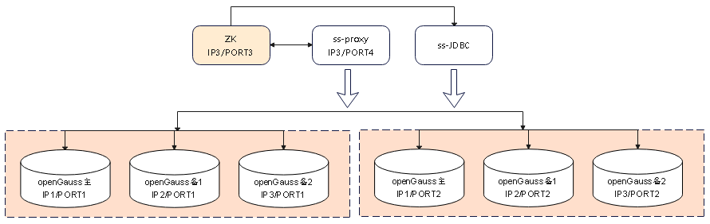

版权所有 © 2022  openGauss社区
 您对“本文档”的复制、使用、修改及分发受知识共享(Creative Commons)署名—相同方式共享4.0国际公共许可协议(以下简称“CC BY-SA 4.0”)的约束。为了方便用户理解，您可以通过访问https://creativecommons.org/licenses/by-sa/4.0/ 了解CC BY-SA 4.0的概要 (但不是替代)。CC BY-SA 4.0的完整协议内容您可以访问如下网址获取：https://creativecommons.org/licenses/by-sa/4.0/legalcode。

修订记录

| 日期       | 修订   版本 | 修改描述             | 作者       |
| ---------- | ----------- | -------------------- | ---------- |
| 2022-10-12 | 1.0         | 特性测试报告初稿完成 | peilinqian |

关键词： 

openGauss 分布式、ShardingSphere-Proxy、ShardingSphere-JDBC、View、视图

摘要：

本文档主要验证openGauss分布式场景下 view特性，并给出最终测试结论。

缩略语清单：

| 缩略语   | 英文全名             | 中文解释                                                     |
| -------- | -------------------- | ------------------------------------------------------------ |
| ss-jdbc  | shardingsphere-JDBC  | 定位为轻量级 Java 框架，在 Java 的 JDBC 层提供的额外服务。 它使用客户端直连数据库，以 jar 包形式提供服务，无需额外部署和依赖，可理解为增强版的 JDBC 驱动，完全兼容 JDBC 和各种 ORM 框架。 |
| ss-proxy | shardingsphere-Proxy | 定位为透明化的数据库代理端，提供封装了数据库二进制协议的服务端版本，用于完成对异构语言的支持。 目前提供 MySQL 和 PostgreSQL（兼容 openGauss 等基于 PostgreSQL 的数据库）版本，它可以使用任何兼容 MySQL/PostgreSQL 协议的访问客户端（如：MySQL Command Client, MySQL Workbench, Navicat 等）操作数据，对 DBA 更加友好。 |
| ZK       | zookeeper            | ZooKeeper 是 Apache 软件基金会的一个软件项目，它为大型分布式计算提供开源的分布式配置服务、同步服务和命名注册。 |

# 1     特性概述

openGauss 分布式方案中，shardingSphere 组件不支持视图语法，需要为 shardingSphere + openGauss 添加完整的语法功能支持以扩大分布式语法适配范围。

# 2     特性测试信息

| 版本名称                                                     | 测试起始时间 | 测试结束时间 |
| ------------------------------------------------------------ | ------------ | ------------ |
| ShardingSphere-5.1.2-SNAPSHOT Commit ID:952c1feacb26bc03ea4ea14d9f82b0d5777732c2 | 2022/6/18    | 2022/6/23    |
| ShardingSphere-5.1.3-SNAPSHOT Commit ID:9cdbba7caebafc59be9842f7dd73aaad7721d12b | 2022/6/24    | 2022/6/24    |
| ShardingSphere-5.1.3-SNAPSHOT Commit ID:635d9db1bc423ad1d55d6f986d71bc2b47acf922 | 2022/9/3     | 2022/9/3     |
| ShardingSphere-5.2.1-SNAPSHOT Commit ID:f44e5d3c09a38139dbb2e1b0548816aa572ccc3c | 2022/9/14    | 2022/9/14    |
| ShardingSphere-5.2.1-SNAPSHOT Commit ID:f1cab653542d80b9a2b7a5cb4d39c3277862ecda | 2022/9/16    | 2022/9/16    |
| ShardingSphere-5.2.1-SNAPSHOT Commit ID:4114e7ee4cbe5923c2b403a3e86d1f23355cadf3 | 2022/9/27    | 2022/9/27    |
| ShardingSphere-5.2.1-SNAPSHOT Commit ID:bcde6f374c4a3a025173fbc9f6d0e66ed686a042 | 2022/10/10   | 2022/10/11   |

| 硬件型号   | 硬件配置信息                                                 | 备注                                                         |
| ---------- | ------------------------------------------------------------ | ------------------------------------------------------------ |
| x86+centOS | Intel(R) Xeon(R) Gold 6161 CPU @ 2.20GHz 8核 内存：32GB 硬盘：100G OS：CentOS Linux release 7.6.1810 (Core) | 3台主机组合配置部署 至少2分片opengauss（一主两备）、1ss-proxy、1zookeeper |

| 软件名称                                      | 软件版本                                                     | 备注                                                         |
| --------------------------------------------- | ------------------------------------------------------------ | ------------------------------------------------------------ |
| shardingsphere-Proxy shardingsphere-JDBC | **ShardingSphere-5.1.2-SNAPSHOT Commit ID:** 952c1feacb26bc03ea4ea14d9f82b0d5777732c2 **ShardingSphere-5.1.3-SNAPSHOT Commit ID:** 9cdbba7caebafc59be9842f7dd73aaad7721d12b 635d9db1bc423ad1d55d6f986d71bc2b47acf922 **ShardingSphere-5.2.1-SNAPSHOT Commit ID:** f44e5d3c09a38139dbb2e1b0548816aa572ccc3c f1cab653542d80b9a2b7a5cb4d39c3277862ecda 4114e7ee4cbe5923c2b403a3e86d1f23355cadf3 bcde6f374c4a3a025173fbc9f6d0e66ed686a042 | ShardingSphere官网源码包github地址： https://github.com/apache/shardingsphere |
| zookeeper                                     | 3.8.0                                                        |                                                              |
| openGauss                                     | openGauss 3.0.0 8198a77b                                |                                                              |

# 3     测试结论概述

## 3.1   测试整体结论

共设计25个用例，主要覆盖了功能测试和可靠性测试，发现问题10个，均已解决，回归通过，无遗留风险，整体质量良好；

| 测试活动   | 活动评价                                                     |
| ---------- | ------------------------------------------------------------ |
| 功能测试   | 视图在多种类型表下进行创建、修改、删除、查询，功能正常，验收通过； 视图不符合约束说明的场景进行异常场景测试，可正常抛错，验收通过； 通过ss-proxy、ss-jdbc、jdbc连接ss-proxy等场景执行视图创建、修改、删除、查询，功能正常，验收通过； 视图query子句语法、聚合函数等覆盖验证，简单查询、完美分片不跨库场景，查询结果正确，验收通过； 视图语法读写分离场景验证，根据读写分离策略，写语句正常路由至主库、读语句正常路由至从库；功能正常，验收通过。 |
| 可靠性测试 | 验证不同分片表异常、不同分片数据库异常等情况下进行视图创建、修改、删除、查询等操作；异常情况下可正常抛错，恢复故障后，再次进行相同操作，可正常执行；验收通过 |

## 3.2   约束说明

（1）除了随机单表外，其他表类型对应视图创建时，需要配置视图分片规则（同表的分片规则一致）；

（2）广播表对应的视图，需要配置广播表规则；

（3）除了随机单表和广播表外，其他表类型需要配置视图与表的绑定关系；

（4）多表关联、分片表group by ..having复杂查询等跨库场景，需要用户自行保证跨库的正确性；

（5）创建视图中的query语句必须简单，不支持聚合、子查询、order by等复杂语句；

（6）ss-proxy5.1.3 snapshot 及以上版本具备 view 功能。

## 3.3   遗留问题分析

### 3.3.1 遗留问题影响以及规避措施

| 问题单号 | 问题描述 | 问题级别 | 问题影响和规避措施 | 当前状态 |
| -------- | -------- | -------- | ------------------ | -------- |
| NA       |          |          |                    |          |

### 3.3.2 问题统计

|        | 问题总数 | 严重 | 主要 | 次要 | 不重要 |
| ------ | -------- | ---- | ---- | ---- | ------ |
| 数目   | 10       | 0    | 7    | 3    | 0      |
| 百分比 | 100%     | 0%   | 70%  | 30%  | 0%     |

### 3.3.3 问题单汇总

| 序号 | issue号                                                      | 问题级别 | 问题简述                                                     | 问题状态 |
| ---- | ------------------------------------------------------------ | -------- | ------------------------------------------------------------ | -------- |
| 1    | [18432](https://github.com/apache/shardingsphere/issues/18432) | 主要     | 如果表关联创建了view，drop table 使用cascade关键字，会导致实际数据源view删除，但是view和sharding元数据未删除。 | 关闭     |
| 2    | [18567](https://github.com/apache/shardingsphere/issues/18567) | 主要     | 广播表对应视图删除存在问题，只有一个数据源的视图删除成功。   | 关闭     |
| 3    | [20061](https://github.com/apache/shardingsphere/issues/20061) | 主要     | 多个分片场景下，ds1数据源的分表存在问题，sharding-proxy进行视图创建未进行报错，实际ds1分片下视图创建失败。 | 关闭     |
| 4    | [20746](https://github.com/apache/shardingsphere/issues/20746) | 次要     | 配置绑定规则时，如果绑定表或者视图名称以数字结尾，会存在问题，报错“Invalid binding table configuration in ShardingRuleConfiguration”。 | 关闭     |
| 5    | [20780](https://github.com/apache/shardingsphere/issues/20780) | 主要     | alter view .. rename to ..，未校验新view名称是否进行分片及绑定规则配置。 | 关闭     |
| 6    | [20975](https://github.com/apache/shardingsphere/issues/20975) | 主要     | alter view rename时，分库分表场景存在问题，新视图未进行对应分表的视图创建。 | 关闭     |
| 7    | [20978](https://github.com/apache/shardingsphere/issues/20978) | 次要     | 进行过alter view rename操作后，删除视图后再进行创建，创建的实际view名称与逻辑view名称不对应。 | 关闭     |
| 8    | [21013](https://github.com/apache/shardingsphere/issues/21013) | 次要     | sharding进行绑定表规则配置后，进行后面sql语句执行时，会报错ERROR:  java.lang.NullPointerException。 | 关闭     |
| 9    | [21162](https://github.com/apache/shardingsphere/issues/21162) | 主要     | insert语句执行异常报错"ERROR: Cannot invoke "org.antlr.v4.runtime.tree.ParseTree.accept (org.antlr.v4.runtime.tree.ParseTreeVisitor)" 。 | 关闭     |
| 10   | [21230](https://github.com/apache/shardingsphere/issues/21230) | 主要     | alter view报错“ERROR:  String index out of range: -1”。      | 关闭     |

# 4     测试执行

## 4.1   测试组网图

## 4.2   测试执行统计数据

| 版本名称                                                     | 测试用例数   | 用例执行结果         | 发现问题单数 |
| ------------------------------------------------------------ | ------------ | -------------------- | ------------ |
| ShardingSphere-5.1.2-SNAPSHOT Commit ID:952c1feacb26bc03ea4ea14d9f82b0d5777732c2 | 5            | Passed：4 Failed：1  | 1            |
| ShardingSphere-5.1.3-SNAPSHOT Commit ID:9cdbba7caebafc59be9842f7dd73aaad7721d12b | 10           | Passed：8 Failed：2  | 2            |
| ShardingSphere-5.1.3-SNAPSHOT Commit ID:635d9db1bc423ad1d55d6f986d71bc2b47acf922 | 10           | Passed：7 Failed：3  | 2            |
| ShardingSphere-5.2.1-SNAPSHOT Commit ID:f44e5d3c09a38139dbb2e1b0548816aa572ccc3c | 回归issue：2 | issue Passed：2      | 2            |
| ShardingSphere-5.2.1-SNAPSHOT Commit ID:f1cab653542d80b9a2b7a5cb4d39c3277862ecda | 回归issue：2 | issue Passed：2      | 2            |
| ShardingSphere-5.2.1-SNAPSHOT Commit ID:4114e7ee4cbe5923c2b403a3e86d1f23355cadf3 | 回归issue：2 | issue Passed：2      | 1            |
| ShardingSphere-5.2.1-SNAPSHOT Commit ID:bcde6f374c4a3a025173fbc9f6d0e66ed686a042 | 25           | Passed：25 Failed：0 | 0            |

*数据项说明：*

- 前三轮版本测试覆盖完所有用例，第四轮至第六轮测试回归issue单，最后一轮测试回归issue单并覆盖回归所有用例。
- 最终测试用例执行通过25个，不通过0个；
- 缺陷密度为10(缺陷个数)/1.48k(代码行数)=6.76(个/kloc)。

## 4.3   后续测试建议

- 目前view语法支持query语句场景有限，待后续Federation支持跨库视图后，可以对query语句的语法进行覆盖测试，包括不同分片的多表关联查询。

# 5     附件

无
