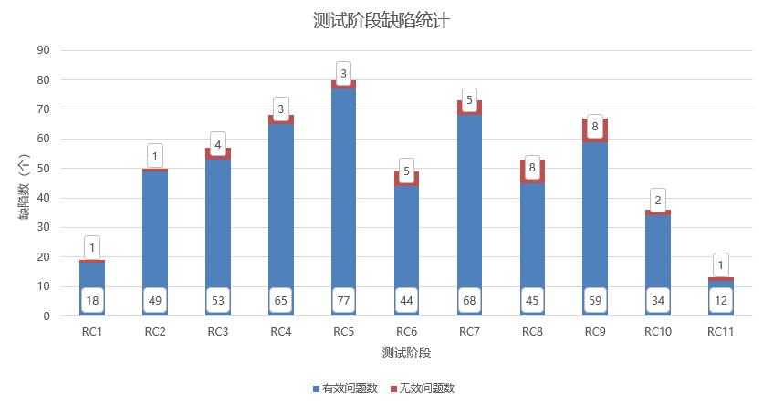

版权所有 © 2022  openGauss社区
 您对“本文档”的复制、使用、修改及分发受知识共享(Creative Commons)署名—相同方式共享4.0国际公共许可协议(以下简称“CC BY-SA 4.0”)的约束。为了方便用户理解，您可以通过访问[*https://creativecommons.org/licenses/by-sa/4.0/*](https://creativecommons.org/licenses/by-sa/4.0/) 了解CC BY-SA 4.0的概要 (但不是替代)。CC BY-SA 4.0的完整协议内容您可以访问如下网址获取：[*https://creativecommons.org/licenses/by-sa/4.0/legalcode*](https://creativecommons.org/licenses/by-sa/4.0/legalcode)。

修订记录

| 日期       | 修订版本 | 修改章节         | 修改描述             | 作者                                            |
| ---------- | -------- | ---------------- | -------------------- | ----------------------------------------------- |
| 2022.12.23 | 1.0      | 初稿撰写         |                      | yansong_lee                                     |
| 2023.1.12  | 1.1      | 版本详细测试结论 | 补充新特性测试结论等 | yansong_lee JusticeArbiter liao-shiting |
|            |          |                  |                      |                                                 |

目 录

1 概述

2 测试版本说明

3 版本概要测试结论

4 版本详细测试结论

> 4.1 特性测试结论

> 4.2 专项测试结论

5 问题单统计

6 附件

7 致谢

**Keywords 关键词**：openGauss 3.1.1

**Abstract 摘要**：主要是描述了openGauss 3.1.1版本的整体测试情况，给出本阶段的测试范围、结果、分析及质量评价，同时对测试活动进行回顾总结。

> 缩略语清单： 

| 缩略语 | 英文全名                             | 中文解释       |
| ------ | ------------------------------------ | -------------- |
| SQL    | Structured Query Language            | 结构化查询语言 |
| CVE    | Common Vulnerabilities and Exposures | 公共漏洞和暴露 |
| DML    | Data Manipulation Language           | 数据操纵语言   |
| DDL    | Data Definition Language             | 数据定义语言   |
| DCL    | Data Control Language                | 数据控制语言   |
| DS     | Data Studio                          | 数据库管理工具 |
| CM     | Cluster Management                   | 集群管理工具   |

 

***
\***

# 概述

openGauss是一款全面友好开放，携手伙伴共同打造的企业级开源关系型数据库。openGauss提供面向多核架构的极致性能、全链路的业务、数据安全、基于AI的调优和高效运维的能力。openGauss具有高性能、高可靠、高安全和易运维等特性，深度融合华为在数据库领域多年的研发经验，结合企业级场景需求，持续构建竞争力特性。

openGauss 3.1.1版本新增内核场景化、工具链和兼容性等特性（具体特性名可以查看"测试版本说明"章节中的需求列表），并对若干关键缺陷进行了修改。本文主要描述了openGauss 3.1.1版本整体测试情况，结合[openGauss 3.1.1版本测试策略](https://gitee.com/opengauss/QA/blob/master/Test_Strategy/openGauss_3.1.1/openGauss%203.1.1%E7%89%88%E6%9C%AC%E6%B5%8B%E8%AF%95%E7%AD%96%E7%95%A5.md)，展开相应的测试活动。重点从特性质量、专项测试和问题单统计等维度展开叙述。综合来看，openGauss 3.1.1版本新特性交付质量较好，版本整体质量较好。

# 测试版本说明

本章节描述测试版本的基本信息，包括测试对象是什么，以及在什么环境下开展的测试，具体包括被测版本和测试硬件环境。

描述被测对象的版本信息和测试的时间及测试轮次。

| 版本名称             | 测试起始时间 | 测试结束时间 |
| -------------------- | ------------ | ------------ |
| openGauss 3.1.1 RC1  | 2022-10-19   | 2022-10-25   |
| openGauss 3.1.1 RC2  | 2022-10-26   | 2022-11-1    |
| openGauss 3.1.1 RC3  | 2022-11-2    | 2022-11-8    |
| openGauss 3.1.1 RC4  | 2022-11-9    | 2022-11-15   |
| openGauss 3.1.1 RC5  | 2022-11-16   | 2022-11-23   |
| openGauss 3.1.1 RC6  | 2022-11-24   | 2022-11-30   |
| openGauss 3.1.1 RC7  | 2022-12-1    | 2022-12-7    |
| openGauss 3.1.1 RC8  | 2022-12-8    | 2022-12-14   |
| openGauss 3.1.1 RC9  | 2022-12-15   | 2022-12-21   |
| openGauss 3.1.1 RC10 | 2022-12-22   | 2022-12-28   |
| openGauss 3.1.1 RC11 | 2022-12-29   | 2022-12-30   |

描述本次测试的测试环境（包括环境软硬件版本信息，环境组网配置信息， 测试辅助工具等）。

| 硬件型号                 | 硬件配置信息                                                 | 备注 |
| ------------------------ | ------------------------------------------------------------ | ---- |
| TaiShan 200 (Model 2280) | CPU：Kunpeng-920 7260 2p 128核 内存：768G 硬盘：NVME 3T * 4 OS：openEuler release 20.03 (LTS) 文件系统：XFS 网卡：4*25GE Hi1822 |      |
| TaiShan 200 (Model 2480) | CPU：Kunpeng-920 7260 4p 256核 内存：1T 硬盘：NVME 3T * 4 OS：openEuler release 20.03 (LTS) 文件系统：XFS 网卡：4*10GE |      |
| RH2288H V3               | CPU：Intel(R) Xeon(R) Gold E5-2698 64核 内存：384GB 硬盘：SSD 2.9T  OS：CentOS Linux release 7.6.1810（Core） 文件系统：EXT4 网卡：4*10GE |      |

虚拟化平台

| 虚拟化平台 | 版本说明                                       |
| ---------- | ---------------------------------------------- |
| KVM虚拟化  | KVM+GuestOS（Centos7.6/OpenEuler20.03（LTS）） |

OS版本说明如下：

| 操作系统  | OS版本           | 版本说明                                                     |
| --------- | ---------------- | ------------------------------------------------------------ |
| OpenEuler | 20.03 (LTS)      | openEuler 20.03 (LTS)，aarch版本ISO SHA256:3e7cb72d746c5385b02b7a4bf18360925145d13f06bbd41c1a137e545b651d40 |
| OpenEuler | 20.03 (LTS)      | openEuler 20.03 (LTS)，x86-64版本ISO SHA256:419592be9cba55a2b800e761d865550f28133875920e7bb9c2d5cdaad90a9cbf |
| Kylin     | V10 SP1          | Kylin V10 SP1，aarch版本ISO SHA256:e6fffdb9dec030920a33ad4c57b68cce8cd7d0496b4bd04a7b85f8cc5494cf41 |
| CentOS    | 7.6.1810（Core） | CentOS Linux release 7.6.1810（Core），x86-64版本ISO SHA256:6d44331cc4f6c506c7bbe9feb8468fad6c51a88ca1393ca6b8b486ea04bec3c1 |

openGauss 3.1.1版本是openGauss社区继续联合多方力量推出的版本，本次发布的需求列表如下：

1.**内核场景化**：涉及15个新特性，发布共享存储新特性，增强分布式能力，推出多节点写入等其他内核新特性

|  no  | feature                                                      | status         | sig           | owner                |
| :--: | ------------------------------------------------------------ | -------------- | ------------- | -------------------- |
|  1   | 【openGauss 3.1.1】支持全局逻辑时钟组件GLT，满足分布式事务管理要求 | 代码编写与自测 | StorageEngine |                      |
|  2   | 【openGauss 3.1.1】对shardingSphere+openLookeng+openGauss统一的安装部署能力 | 方案设计       | StorageEngine | sphereEx+openLookeng |
|  3   | 【openGauss 3.1.1】shardingSphere&openGauss 32节点挑战2100W tpmC | 需求验收       | StorageEngine | sphereEx             |
|  4   | 【openGauss 3.1.1】openGauss-分布式数据库支持事务下多种模式读写分离 | 需求验收       | StorageEngine | sphereEx             |
|  5   | 【openGauss 3.1.1】openGauss分布式方案适配federation以支持跨库查询 | 需求验收       | StorageEngine | sphereEx             |
|  6   | 【openGauss 3.1.1】openGauss分布式方案第二阶段15节点1200万性能提升 | 需求验收       | StorageEngine | sphereEx             |
|  7   | 【openGauss 3.1.1】DMS适配OCK分布式锁                        | 已完成         | StorageEngine |                      |
|  8   | 【openGauss 3.1.1】存储层实现算子卸载，SMP查询性能提升20%    | /              | StorageEngine |                      |
|  9   | 【openGauss 3.1.1】支持对dbe_perf.file_iostat统计的LRU淘汰算法 | 需求验收       | StorageEngine |                      |
|  10  | 【openGauss 3.1.1】支持多节点写入                            | 已完成         | StorageEngine |                      |
|  11  | 【openGauss 3.1.1】支持数据库物理读写块大小的配置功能        | 代码编写与自测 | StorageEngine |                      |
|  12  | 【openGauss 3.1.1】postgresql_fdw执行性能提升，支持聚合和条件下推到远端执行功能 | 需求验收       | SQLEngine     |                      |
|  13  | 【openGauss 3.1.1】提升特定情况下sort的性能                  | 代码检视       | SQLEngine     | Enmotech             |
|  14  | 【openGauss 3.1.1】支持垂直分区                              | 方案设计       | SQLEngine     | Vastdata             |
|  15  | 【openGauss 3.1.1】强制访问控制                              | 设计方案评审   | SQLEngine     | Vastdata             |

2.**工具链**：涉及17个新特性，主要是迁移工具、校验工具以及OM/CM等工具增强

| no   | feature                                                      | status         | sig           | owner    |
| ---- | ------------------------------------------------------------ | -------------- | ------------- | -------- |
| 1    | 【openGauss 3.1.1】支持CM的部署和数据库部署解耦              | 已完成         | CM            |          |
| 2    | 【openGauss 3.1.1】OM支持在XML中对同步备机的设置             | 已完成         | OM            |          |
| 3    | 【openGauss 3.1.1】支持openEuler 22.03 LTS系统               | 方案设计       | OM            |          |
| 4    | 【openGauss 3.1.1】提升数据校验性能，满足数据校验性能达到70MB/s | 已完成         | Tools         |          |
| 5    | 【openGauss 3.1.1】数据校验支持行级、列级和全量比较规则      | 代码检视       | Tools         |          |
| 6    | 【openGauss 3.1.1】debezium全量迁移支持对M\*对象的迁移       | 方案设计       | Tools         |          |
| 7    | 【openGauss 3.1.1】M\*数据迁移完整方案打通                   | 方案设计       | Tools         |          |
| 8    | 【openGauss 3.1.1】增量、反向迁移支持断点续传                | 方案设计       | Tools         |          |
| 9    | 【openGauss 3.1.1】迁移工具可调试性增强、可靠性增强          | 方案设计       | Tools         |          |
| 10   | 【openGauss 3.1.1】支持一站式迁移平台                        | 方案设计       | Tools         |          |
| 11   | 【openGauss 3.1.1】openGauss可视化运维项目                   | 代码编写与自测 | Tools         | 众智     |
| 12   | 【openGauss 3.1.1】openGauss-DataStudio 适配存储过程覆盖率工具开发合作项目 | 已完成         | Tools         | 众智     |
| 13   | 【openGauss 3.1.1】openGauss数据建模项目                     | 代码编写与自测 | Tools         | 众智     |
| 14   | 【openGauss 3.1.1】openGauss工具一体化平台                   | 代码编写与自测 | Tools         | 众智     |
| 15   | 【openGauss 3.1.1】支持CM两节点特性                          | 代码检视       | Tools         | Enmotech |
| 16   | 【openGauss 3.1.1】gstrace工具新增特性，支持数据库运行中追踪 | 代码检视       | Tools         | Enmotech |
| 17   | 【openGauss 3.1.1】openGauss周边工具适配DMS&DSS              | 已完成         | StorageEngine |          |

3.**兼容性**：涉及48个新特性，从数据类型兼容、系统函数兼容、DDL兼容、DML兼容、PL/SQL兼容、SHOW语法兼容和其他语法兼容方面提升openGauss对openGauss对M*的兼容率

| no   | feature                                  | combination                                                  | status   | sig    | owner    |
| ---- | ---------------------------------------- | ------------------------------------------------------------ | -------- | ------ | -------- |
| 1    | 【openGauss 3.1.1】数据类型兼容 **2个**  | 支持用户在M\*兼容性下对bool类型的输出统一转成tinyint         | 已完成   | Plugin |          |
|      |                                          | tinyint支持有符号，同时支持unsigned tinyint                  | 已完成   | Plugin |          |
| 2    | 【openGauss 3.1.1】系统函数兼容 **9个**  | openGauss兼容M\*日期处理函数                                 | 已完成   | Plugin | 众智     |
|      |                                          | 兼容性时间类型相关函数                                       | 已完成   | Plugin | 众智     |
|      |                                          | 兼容性JSON类型相关函数及操作符                               | 需求验收 | Plugin | 众智     |
|      |                                          | any_value聚合函数                                            | 已完成   | Plugin | Enmotech |
|      |                                          | 支持row_count函数                                            | 已完成   | Plugin | Enmotech |
|      |                                          | 支持database()函数                                           | 已完成   | Plugin | Enmotech |
|      |                                          | CAST语法的类型补全                                           | 已完成   | Plugin | Enmotech |
|      |                                          | 支持default函数用于SQL语句                                   | 已完成   | Plugin | Enmotech |
|      |                                          | 支持found_rows特性                                           | 已完成   | Plugin | Enmotech |
| 3    | 【openGauss 3.1.1】DDL兼容 **7个**       | 支持指定FOREIGN DATA WRAPPER为M\*                            | 已完成   | Plugin |          |
|      |                                          | 支持CREATE USER带if not exists选项                           | 已完成   | Plugin |          |
|      |                                          | 支持分区语法值指定 less than maxvalue时候，无需 less than maxvalue()如此指定括号 | 已完成   | Plugin | Enmotech |
|      |                                          | 支持分区表使用函数作为分区条件                               | 已完成   | Plugin | Enmotech |
|      |                                          | drop trigger支持不指定表名的级联删除                         | 已完成   | Plugin | Vastdata |
|      |                                          | 兼容MySQL创建存储过程的语法格式                              | 已完成   | Plugin | Vastdata |
|      |                                          | 支持trigger兼容mysql形式语法                                 | 已完成   | Plugin | Vastdata |
| 4    | 【openGauss 3.1.1】DML兼容 **5个**       | 视图支持插入、删除和更新                                     | 已完成   | Plugin |          |
|      |                                          | insert支持set后面的表达式右值带字段名                        | 已完成   | Plugin |          |
|      |                                          | prepare、execute语法兼容                                     | 已完成   | Plugin |          |
|      |                                          | 实现prepare stmt、rename user、alter function...SQL SECURITY等M\*兼容性 | /        | Plugin | 众智     |
|      |                                          | 二级分区支持reorginze                                        | /        | Plugin | Enmotech |
| 5    | 【openGauss 3.1.1】PL/SQL兼容 **7个**    | 存储过程支持RETURN                                           | 已完成   | Plugin | Vastdata |
|      |                                          | 支持create procedure select语法                              | 已完成   | Plugin | Vastdata |
|      |                                          | 存储过程支持REPEAT                                           | 已完成   | Plugin | Vastdata |
|      |                                          | 存储过程condition处理                                        | 已完成   | Plugin | Vastdata |
|      |                                          | 支持IF_THEN控制语法                                          | 已完成   | Plugin | Vastdata |
|      |                                          | 支持CASE WHEN condition控制语法                              | 已完成   | Plugin | Vastdata |
|      |                                          | 支持WHILE循环带标签                                          | 已完成   | Plugin | Vastdata |
| 6    | 【openGauss 3.1.1】SHOW语法兼容 **4个**  | 支持对M\*列类型的映射                                        | 已完成   | Plugin |          |
|      |                                          | 兼容SHOW PRIVILEGES语法                                      | 已完成   | Plugin | Unicom   |
|      |                                          | 兼容SHOW TABLE STATUS语法                                    | 已完成   | Plugin | Unicom   |
|      |                                          | 支持show warnings，show errors语法                           | 已完成   | Plugin | Enmotech |
| 7    | 【openGauss 3.1.1】其他语法兼容 **16个** | 实现对Load DATA语法的兼容，支持使用load语句导入数据          | 需求验收 | Plugin |          |
|      |                                          | 支持对M\*部分语法的转换                                      | 已完成   | Plugin |          |
|      |                                          | 支持查看系统可支持的字符集和字符序                           | 已完成   | Plugin |          |
|      |                                          | 支持使用双引号表示字符串                                     | 已完成   | Plugin |          |
|      |                                          | 支持explain和desc保持一致，互为同义词                        | 已完成   | Plugin |          |
|      |                                          | 指定多个分区查询数据                                         | 已完成   | Plugin |          |
|      |                                          | 支持autocommit=0模式                                         | 已完成   | Plugin |          |
|      |                                          | 支持!操作符                                                  | 已完成   | Plugin |          |
|      |                                          | 对M*数据库参数适配                                           | 已完成   | Plugin |          |
|      |                                          | 兼容FLUSH BINARY LOGS语法                                    | 已完成   | Plugin | Unicom   |
|      |                                          | 兼容M*协议                                                   | 代码检视 | Plugin | Unicom   |
|      |                                          | 支持DO statement语法                                         | 已完成   | Plugin | Vastdata |
|      |                                          | 支持cursor相关语法                                           | 已完成   | Plugin | Vastdata |
|      |                                          | 支持反引号作为标识符                                         | 已完成   | Plugin | Enmotech |

openGauss 3.1.1版本测试活动分工如下：

| 序号 | 需求                                                         | 开发主体      | 测试主体                             | 验证策略                                                     |
| ---- | ------------------------------------------------------------ | ------------- | ------------------------------------ | ------------------------------------------------------------ |
| 1    | 【openGauss 3.1.1】支持全局逻辑时钟组件GLT，满足分布式事务管理要求 | StorageEngine | QA                                   | 1.验证分布式事务实时一致性 2.验证全局csn能正确单调递增 3.验证opengauss端和ShardingSphere-Proxy端GLT开关功能正确 4.验证GLT组件功能和可靠性 |
| 2    | 【openGauss 3.1.1】对shardingSphere+openLookeng+openGauss统一的安装部署能力 | StorageEngine | QA                                   | 1.根据安装部署指南验证安装部署功能及资料                     |
| 3    | 【openGauss 3.1.1】shardingSphere&openGauss 32节点挑战2100W tpmC | StorageEngine | QA                                   | 1.验证32节点性能能否达到2600W tpmC                           |
| 4    | 【openGauss 3.1.1】openGauss-分布式数据库支持事务下多种模式读写分离 | StorageEngine | QA                                   | 1.不同事务类型（XA、LOCAL）分别在显式、隐式场景下，配置不同读写分离策略，验证读写操作是否正常进行分离路由 |
| 5    | 【openGauss 3.1.1】openGauss分布式方案适配federation以支持跨库查询 | StorageEngine | QA                                   | 1.不同类型表、不同数据类型、不同事务类型场景下，验证不同跨库SQL查询，查询结果正确，功能正常 |
| 6    | 【openGauss 3.1.1】openGauss分布式方案第二阶段15节点1200万性能提升 | StorageEngine | QA                                   | 1.验证15节点的性能是否达到1300万tpmc                         |
| 7    | 【openGauss 3.1.1】DMS适配OCK分布式锁                        | StorageEngine | QA                                   | 1.验证在资源池化场景下，对表空间、数据库、表等非页面及元组对象进行DDL操作加分布式锁，保证以上操作在节点间的协同 2.验证openGauss同时适配DMS分布式锁与OCK分布式锁 |
| 8    | 【openGauss 3.1.1】存储层实现算子卸载，SMP查询性能提升20%    | StorageEngine | QA                                   | 1.验证算子下推是否影响数据一致性  2.实现算子下推后性能是否有提升并达到要求 |
| 9    | 【openGauss 3.1.1】支持对dbe_perf.file_iostat统计的LRU淘汰算法 | StorageEngine | QA                                   | 1.验证针对dbe_perf.file_iostat统计设计的LRU淘汰算法，满足最近最久不用的条目及时淘汰 |
| 10   | 【openGauss 3.1.1】支持多节点写入                            | StorageEngine | QA                                   | 1. 备机执行DML和DDL写入语句，只需要简单SQL转发到主机执行 2. 针对PBE场景，验证是否成功转发到主机执行 3. 备机执行批量写入，验证是否成功转发到主机执行 4. 备机执行事务，验证是否全部转发给主机执行 |
| 11   | 【openGauss 3.1.1】支持数据库物理读写块大小的配置功能        | StorageEngine | QA                                   | 1.可修改的物理块大小的尺寸标准 2.不同物理块大小的适配对象 3.验证物理块的大小对数据库读取速度的影响 |
| 12   | 【openGauss 3.1.1】postgresql_fdw执行性能提升，支持聚合和条件下推到远端执行功能 | SQLEngine     | QA                                   | 1.验证Join下推路径搜索与生成 2.验证Non-spj算子(仅agg、sort、limit、lockrows) 下推路径搜索与生成 3.验证Fdw 计划生成与执行 4.验证Explain适配，增加支持下推的表达式检查 |
| 13   | 【openGauss 3.1.1】提升特定情况下sort的性能                  | SQLEngine     | QA-Enmotech                          | 1. 验证char、varchar、date、timestamp、int、uuid类型在单列查询的场景下排序的性能有提升 2. 验证符合增量排序触发条件时可以使用增量排序算子执行并有性能提升 |
| 14   | 【openGauss 3.1.1】支持垂直分区                              | SQLEngine     | QA-Vastdata                          | /                                                            |
| 15   | 【openGauss 3.1.1】强制访问控制                              | SQLEngine     | QA-Vastdata                          | 1.验证敏感标记的创建 2.验证表和表列强制访问控制策略的正确性，测试增删查改的场景 3.验证存储过程和触发器强制访问控制策略的正确性，测试调用存储过程和触发器的场景 |
| 16   | 【openGauss 3.1.1】支持CM的部署和数据库部署解耦              | CM            | QA                                   | 1.验证支持在OM集群中部署CM 2.验证支持在CM集群中解耦CM 3.关注CM部署和解耦后数据库能否正常使用 |
| 17   | 【openGauss 3.1.1】OM支持在XML中对同步备机的设置             | OM            | QA                                   | 1.测试ANY、FIRST方式在XML文件中设置同步备可以成功安装并对异常场景进行验证，例如错误的主机名等 2.安装成功后测试同步备是否生效，通过查看系统表、gs_ctl等方式验证 3.测试XML文件中指定同步备安装成功后，可以通过gs_guc参数修改同步备 |
| 18   | 【openGauss 3.1.1】支持openEuler 22.03 LTS系统               | OM            | QA                                   | 1. 验证数据库内核、OM、CM、JDBC/ODBC/python驱动、libpq以及迁移工具在openEuler 22.03 LTS可编译、可运行 2. 进行TPCC性能测试，验证TPCC性能满足180W tpmC |
| 19   | 【openGauss 3.1.1】提升数据校验性能，满足数据校验性能达到70MB/s | Tools         | QA                                   | 1.数据准备，在1~10张表下，递增数据总量，通过迁移工具迁移至M\*后通过校验工具查看全量校验性能是否满足70M/S 2.查看结果文件，测试在满足速率的情况下，数据校验工具校验结果准确 |
| 20   | 【openGauss 3.1.1】数据校验支持行级、列级和全量比较规则      | Tools         | QA                                   | 1.表字段类型支持可配置，针对配置以及未配置的表字段覆盖不同数据类型测试 2.未配置、已配置表字段类型同名区分大小写等常见场景覆盖测试 |
| 21   | 【openGauss 3.1.1】debezium全量迁移支持对M\*对象的迁移       | Tools         | QA                                   | 1.验证是否支持使用Debezium对表、索引、约束、存储过程、函数、触发器、schema的全量迁移 2.验证是否支持对M\*对象的迁移 |
| 22   | 【openGauss 3.1.1】M\*数据迁移完整方案打通                   | Tools         | QA                                   | 1.验证全量迁移、增量迁移、反向迁移、数据校验完整方案的功能 2.关注数据迁移完整方案打通流程和数据的一致性 |
| 23   | 【openGauss 3.1.1】增量、反向迁移支持断点续传                | Tools         | QA                                   | 1.验证增量/反向迁移的断点续传功能 2.关注迁移数据的一致性 |
| 24   | 【openGauss 3.1.1】迁移工具可调试性增强、可靠性增强          | Tools         | QA                                   | 1.验证全量迁移、增量迁移、数据校验、反向迁移支持迁移进度展示（总量、剩余量、剩余时间等） 2.验证校验失败的数据展示是否完整,增量、反向迁移支持迁移失败数据、DDL失败语句展示，全量迁移支持迁移失败对象的展 3.验证资料完整性和可操作性 |
| 25   | 【openGauss 3.1.1】支持一站式迁移平台                        | Tools         | QA                                   | 1.验证系统是否支持一站式迁移平台,对接debezium+kafka工具，并且具有全量迁移、增量迁移、数据校验能力 |
| 26   | 【openGauss 3.1.1】openGauss可视化运维项目                   | Tools         | QA                                   | 1.验证系统是否支持可视化一键式安装部署数据库，并提供运维、管理功能 2.验证其他工具通过预留的集成接口是否可以正常运行 |
| 27   | 【openGauss 3.1.1】openGauss-DataStudio 适配存储过程覆盖率工具开发合作项目 | Tools         | QA                                   | 1.从用户体验方面验证工具菜单命名是否合理，排列是否整齐，功能是否生效。 2.验证调试过程中覆盖语句是否合理 3.验证调试结束覆盖率报告是否完整合理，导出后格式是否正 4.检查资料可操作性和完整性 |
| 28   | 【openGauss 3.1.1】openGauss数据建模项目                     | Tools         | QA                                   | 1.验证系统本身的易用性，能否一键部署 2.验证建模过程中关键点可以算子化，并支持编辑与可视化预 3.验证链接数据库、导入、导出、写入数据库等基础算子支 4.验证产品界面与UI原型图一致 |
| 29   | 【openGauss 3.1.1】openGauss工具一体化平台                   | Tools         | QA                                   | 1.从用户体验方面验证页面布局是否合理，操作是否方便 2.验证基于可视化运维平台集成openGauss的工具链的功能 |
| 30   | 【openGauss 3.1.1】支持CM两节点特性                          | Tools         | QA-Enmotech                          | 1. 验证新增参数修改的支持 2. 验证CM集群故障切换功能、数据库集群脑裂故障恢复功能 3. 验证原有CM基本功能不被破坏 |
| 31   | 【openGauss 3.1.1】gstrace工具新增特性，支持数据库运行中追踪 | Tools         | QA-Enmotech                          | 1. 通过解析出来的结果文件验证是否包含应有的模块信息 2. 验证给定非法指令时可以识别并做相应错误处理 |
| 32   | 【openGauss 3.1.1】openGauss周边工具适配DMS&DSS              | StorageEngine | QA                                   | 1.验证在DMS&DSS中opengauss周边工具( gs_probackup、xlogdump、pagehack、gs_install、gs_restore 等)的功能是否正常 |
| 33   | 【openGauss 3.1.1】数据类型兼容                              | Plugin        | QA                                   | 1.验证tinyint数据类型取值范围，精度，对无效值的处理 2.验证类型转换功能是否正常 3.验证类型和函数、操作符之间的交互使用 4.tinyint类型列上创建索引、约束是否正常 |
| 34   | 【openGauss 3.1.1】系统函数兼容                              | Plugin        | QA QA-Enmotech                  | 1.验证时间日期类型函数的取值范围，参数类型，对无效值的处理，返回值超范围的处理 2.验证时间日期类型不同输入格式 3.验证JSON类型函数的取值范围，参数类型，对无效值的处理 4.函数参数个数验证 5.结合其他函数嵌套使用 6.验证any_value()函数在select场景下的功能是否正确 7.验证default()函数能否正确返回对应输入列的默认值 8.验证database()函数能否返回正确结果 9.验证不同场景下row_count()函数返回结果是否正确 10.验证cast()函数对类型转换结果的正确性 |
| 35   | 【openGauss 3.1.1】DDL兼容                                   | Plugin        | QA QA-Enmotech QA-Vastdata | 1.验证加载插件后是否能够对M\*对象进行增删改 2.验证加载插件后查询M\*侧不同类型数据以及表进行查询能否正确显示 3. 验证使用create user if exists语法创建多种不同权限用户后权限是否正确 4. 验证兼容语法文档描述及示例是否正确 5.验证分区表REORGANIZE语法功能，对不支持的分区场景合理报错 6.验证分区表中less than maxvalue语法支持"maxvalue"使用和不使用括号 7.验证在分区表中表达式及函数可用于分区键，在支持列表之外的表达式和函数合理报错 8.验证删除触发器时不指定表名是否能级联删除成功 9.验证兼容MySQL创建存储过程语法是否正确，创建存储过程能否正常使用 10.验证兼容MySQL创建触发器语法是否正确，创建触发器能否正常使用 |
| 36   | 【openGauss 3.1.1】DML兼容                                   | Plugin        | QA QA-Enmotech                  | 1.验证视图的insert、update、delete、truncate操作及与表类型、表约束的交互  2.验证insert语句的set表达式与算术、逻辑运算符及函数的交互 3.验证prepare语句与select insert、存储过程等语句的结合使用以及与单双引号的结合使用4.验证rename user用户名已存在或非法、alter function结合函数、表类型、存储过程、视图、事务等操作 5.验证DML语句兼容M*语法后的资料描述及示例 |
| 37   | 【openGauss 3.1.1】PL/SQL兼容                                | Plugin        | QA-Vastdata                          | 1.验证新增PL/SQL兼容语法的使用和正确性 2.验证新增PL/SQL兼容语法与常量运算、调用函数等的使用 3.验证PL/SQL兼容语法与各种查询的使用 4.验证使用不同LANGUAGE类型 |
| 38   | 【openGauss 3.1.1】SHOW语法兼容                              | Plugin        | QA QA-Enmotech                  | 1.支持对M\*列类型的映射：验证对数字，时间，字符串等数据类型进行合法入参、非法入参、返回值正确性、边界值等验证；函数嵌套使用验证 2. 兼容SHOW PRIVILEGES语法： 验证显示当前数据库所支持的不同权限，显示权限是否正确 3.兼容SHOW TABLE STATUS语法：查看不同表类型的信息，验证返回信息是否正确  4.支持show warnings，show errors语法： 验证设置sql_mode参数与不设置，进行非法sql操作后使用show语句查询，提示是否正确 |
| 39   | 【openGauss 3.1.1】其他语法兼容                              | Plugin        | QA QA-Enmotech QA-Vastdata | 1.兼容load data语法：验证每个参数是否合法，验证返回值是否正确 2.支持对M\*部分语法的转换：验证VARCHAR(M)有无national参数功能正常，可以进行增删改查基本操作 3.支持查看字符集和字符序：验证返回值是否为opengauss支持的字符集和字符序 4.双引号表示字符串：校验ansi_quotes参数设置方法，验证双引号原有功能、对元命令、引用字符串常量功能是否正常 5.支持explain和desc保持一致：验证explain/desc 不同的表，结果显示是否正确  6.指定多个分区查询数据：验证不同分区表/视图，结合聚合函数，数学函数进行验证 7.支持autocommit=0模式：验证不同事物，不同sql语句，在commit/rollback之后是否正确 8.支持!操作符：验证开关设置方式，验证 ! 在不同sql语句中，结合操作符、函数等验证 9.对M\*数据库参数适配：验证参数默认值，修改参数是否生效 10.兼容FLUSH BINARY LOGS语法：验证执行该语句后，pg_xlog归档是否正确 11.兼容M*协议：是否支持M\*5.7不同协议，协议的异常处理是否正确 12.验证反引号在非管理员可创建的opengauss语法中，涉及到名称的情况是否可以正常使用,反引号加入各个语法中可以识别反引号中的名称且不会影响结果的准确性 13.验证在函数或存储过程中利用declare声明游标并进行使用 14.验证兼容Do expr_list语法的使用 |

# 版本概要测试结论

openGauss 3.1.1版本整体测试按照release-manager团队的计划，版本测试规划采取5+4的测试方式，即5轮系统测试+4轮集成验证的策略，实际增加了1轮系统测试+1轮集成验证，共完成了6轮系统测试+5轮集成验证测试：

第一轮~第三轮集中评审了新特性测试设计，同时关注内核场景化、工具链和兼容性三个方面的新特性验收，同时对关键性能数据进行了摸底，旨在发现阻塞性问题，并对继承特性进行了自动化看护验收。此外，在第四轮、第五轮主要投入到了兼容性需求的测试上。第六轮没有需求合入，主要进行特性间的交互测试。第七轮测试开始进行系统集成验证，展开性能复测、长稳、安全和升级等专项测试，意在检查系统集成的完整性和正确性。第八轮测试紧接着又覆盖了一轮7\*24H长稳测试，保证社区版本的稳定性。此外，针对特性的测试报告测试人员也开始撰写。第九轮测试继续进行一轮7\*24H长稳测试，并利用工具进行端口扫描/主机漏洞扫描等安全测试，并对性能劣化问题进行攻关冲刺。第十轮测试主要精力放在编译安装和版本构建上，保证社区安装包的可靠可用。同时对关键性能指标进行再次验收，旨在保证发布时对外的承诺达成。最后一轮测试通过自动化进行了版本发布前的验收测试，并且开始版本测试报告和特性测试报告的撰写合入。

openGauss 3.1.1版本按照测试策略完成了全量功能验证和专项测试（性能、可靠性、兼容性、安全），所有测试任务均按计划完成。

openGauss 3.1.1版本共发现问题565个，有效问题524个。修复问题回归测试结果正常，版本整体质量较好。

# 版本详细测试结论

openGauss 3.1.1版本详细测试内容包括：

1、通过自动化看护，从接入层、SQL层、存储层、管理、安全、可靠可用和工具等7个维度进行openGauss继承特性测试，继承功能无丢失；

2、在内核场景化的竞争力构建上，一是联合ShardingSphere，继续提升分布式场景的性能，扩充分布式场景的功能；二是推出了共享存储架构，实现主备共享一份存储......测试覆盖上述需求，关注功能的实现和规格的达成；

3、在工具链方面，覆盖CM和OM新特性测试，同时迁移工具也在此次发布版本有了更高的规格表现：全量迁移300MB/S、增量迁移3w tps、反向迁移1w tps以及全量校验70MB/S。不过后续仍需对工具的易用性和稳定性提高要求；

4、在M\*兼容性方面，测试新增数据类型、系统函数、DDL、DML、PL/SQL、SHOW语法和其他语法等需求，M\*兼容性进一步提升；

5、针对系统的稳定性，进行长稳测试，包括事务并发测试、benchmarksql+sysbench加压测试和sqlsmith测试等，数据库满足7*24H正常运行，测试较为充分，产品稳定性好；

6、专项测试包括性能专项、安全专项、兼容性测试、可靠性测试和资料测试。

## 特性测试结论

### 继承特性评价

对产品所有继承特性进行评价，用表格形式评价，包括特性列表（与特性清单保持一致），验证质量评估

| Domain   | Feature                | 质量评估                   | 备注                                                         |
| -------- | ---------------------- | -------------------------- | ------------------------------------------------------------ |
| 接入层   | 应用开发接口           | ▮ | 继承已有测试能力，支持JDBC、ODBC、PDBC、GDBC驱动             |
|          | 分布式中间件           | ▮ | 继承已有测试能力，支持应用侧分布式解决方案shardingsphere     |
| SQL层    | 支持SQL语言版本SQL2003 | ▮ | 继承已有测试能力，支持SQL 2003语言版本                       |
|          | 支持SQL基本语法        | ▮ | 继承已有测试能力，支持DDL/DML/DCL/DQL语句                    |
|          | 存储过程               | ▮ | 继承已有测试能力，关注声明语法、基本语句、动态语句、控制语句、事务管理和调试等 |
|          | 系统表和系统视图       | ▮ | 继承已有测试能力                                             |
|          | DBE_PERF内视图         | ▮ | 继承已有测试能力，关注OS、Instance、Memory等多个维度划分组织视图，DBE_PERF内视图主要用来诊断性能问题 |
|          | SQL关键字              | ▮ | 继承已有测试能力，关注保留字和非保留字之分。根据标准，保留字决不能用做其他标识符。非保留字只是在特定的环境里有特殊的含义，而在其他环境里是可以用做标识符的 |
| 存储层   | 索引                   | ▮ | 继承已有测试能力，支持B Tree索引，Hash索引等                 |
|          | 数据分区               | ▮ | 继承已有测试能力，支持对分区的组合、交换、拆分、合并等功能；支持范围、列表、哈希等分区类型；支持二级分区 |
|          | 行列混合存储           | ▮ | 继承已有测试能力，支持行存、列存两种方式，可以在不同的引用场景下选择相应的存储方式 |
|          | 内存表                 | ▮ | 继承已有测试能力，支持MOT                                    |
|          | 物化视图               | ▮ | 继承已有测试能力，支持物化视图，物化视图是一种特殊的物理表，物化视图是相对普通视图而言的 |
|          | 全文索引               | ▮ | 继承已有测试能力，支持单字及词查询，长句子检索；支持中英文混排检索；支持and、or及not的条件组合检索 |
| 管理     | 命令行安装             | ▮ | 继承已有测试能力，支持OM安装，极简安装和编译安装             |
|          | 版本升级               | ▮ | 继承已有测试能力，支持数据库软件版本的升级功能，包括就地升级和灰度升级 |
|          | 数据库对象管理         | ▮ | 继承已有测试能力，支持图形化的方式对模式、表、视图、用户、角色、数据库对象、存储过程、约束、函数、触发器、自增列、大对象等的管理 |
|          | 诊断分析报告           | ▮ | 继承已有测试能力，支持生成WDR等报告                          |
|          | 智能运维               | ▮ | 继承已有测试能力，具备智能化运维能力，如智能参数调优、智能索引推荐、慢SQL诊断分析、存储空间智能预测等 |
| 安全     | 身份鉴别               | ▮ | 继承已有测试能力，支持定义鉴别失败的次数，用户具有唯一标识性 |
|          | 访问控制               | ▮ | 继承已有测试能力，登录密码存储支持高级别密码存储加密         |
|          | 安全接入               | ▮ | 继承已有测试能力，具备基于RFC5802机制的口令加密认证方法。加密认证过程中采用单项Hash不可逆加密算法PBKDF2，可防止彩虹攻击 |
|          | 强制访问控制           | ▮ | 继承已有测试能力，支持强制访问控制：主体粒度达到用户级，客体粒度达到表、视图、触发器等数据库对象级或记录级及列级 |
|          | 安全审计               | ▮ | 继承已有测试能力，支持安全审计，支持检测安全侵害事件，能将审计数据计入审计日志中 |
|          | 三权分立               | ▮ | 继承已有测试能力，支持系统管理员、安全管理员和审计管理员角色，三种角色计入审计日志中 |
|          | 数据存储加密           | ▮ | 继承已有测试能力，支持对用户数据的加密存储或其他有效性的保护措施 |
|          | 全密态数据库           | ▮ | 继承已有测试能力，支持存储，分析密文数据的数据库系统技术，数据在传输、存储以及计算态均以加密形态存在，整个查询分析过程对用户无感知 |
|          | 动态脱敏               | ▮ | 继承已有测试能力，支持数据库管理员在数据列上创建动态数据脱敏策略 |
|          | 防篡改功能             | ▮ | 继承已有测试能力，具备多方共识防篡改、高效防篡改算法、账本数据分布式存储 |
|          | 恶意攻击防范           | ▮ | 继承已有测试能力，支持system防命令注入，可防止缓冲区溢出；输入有效性检查 |
| 可靠可用 | 物理备份恢复           | ▮ | 继承已有测试能力，支持物理全量/增量备份能力，还原能力，恢复能力，基于时间点恢复能力 |
|          | 全量PITR物理恢复       | ▮ | 继承已有测试能力，全量PITR物理恢复                           |
|          | 逻辑导入导出           | ▮ | 继承已有测试能力，逻辑备份/还原支持对指定库、指定表、指定一组对象（某个模式所属对象）进行备份及还原 |
|          | 延迟备份               | ▮ | 继承已有测试能力，支持延迟备份                               |
|          | 逻辑复制               | ▮ | 继承已有测试能力，支持异构数据库间的数据同步                 |
|          | 极致RTO                | ▮ | 继承已有测试能力，支持快速故障倒换能力，实现RTO<10s          |
| 工具     | 客户端工具             | ▮ | 继承已有测试能力，支持gsql工具、DS工具                       |
|          | 服务端工具             | ▮ | 继承已有测试能力，关注gs_cgroupgs_check、gs_checkos、gs_checkperf、gs_collector、gs_dump、gs_dumpall、gs_guc、gs_encrypt、gs_om、gs_plan_simulator、gs_restore、gs_ssh等工具 |
|          | 系统内部使用工具       | ▮ | 继承已有测试能力，关注gaussdb、gs_backup、gs_basebackup、gs_ctl、gs_expansion、gs_initdb、gs_install、gs_postuninstall、gs_preinstall、gs_dropnode、gs_sshexkey、gs_tar、gs_uninstall、gs_upgradectl、gstrace、pg_recvlogical、gs_probackup 等工具 |
|          | 迁移工具               | ▮ | 继承已有测试能力，支持全量、增量迁移以及反向迁移             |
|          | 校验工具               | ▮ | 继承已有测试能力，支持全量、增量数据校验能力                 |
| 兼容     | 数据类型兼容           | ▮ | 继承已有测试能力，关注在对应兼容模式下，支持已兼容的数据类型 |
|          | 函数兼容               | ▮ | 继承已有测试能力，关注在对应兼容模式下，支持已兼容的系统函数 |
|          | DDL兼容                | ▮ | 继承已有测试能力，关注在对应兼容模式下，支持已兼容的DDL语法  |
|          | DML兼容                | ▮ | 继承已有测试能力，关注在对应兼容模式下，支持已兼容的DML语法  |
|          | DCL兼容                | ▮ | 继承已有测试能力，关注在对应兼容模式下，支持已兼容的DCL语法  |
|          | PL/SQL兼容             | ▮ | 继承已有测试能力，关注在对应兼容模式下，支持已兼容的PL/SQL语法 |
|          | 其他语法兼容           | ▮ | 继承已有测试能力，关注在对应兼容模式下，支持已兼容的其他语法 |

●： 表示特性不稳定，风险高

▲： 表示特性基本可用，遗留少量问题

▮： 表示特性质量良好

### 新需求评价

建议以表格的形式汇总新特性测试执行情况及遗留问题单情况的评估，给出特性质量评估结论。

1、内核&场景化

| 序号 | 特性名称                                                     | 测试情况说明                                                 | 约束依赖说明                                                 | 遗留问题单 | 特性质量评估               | 备注 |
| :--: | ------------------------------------------------------------ | ------------------------------------------------------------ | ------------------------------------------------------------ | ---------- | -------------------------- | ---- |
|  1   | 【openGauss 3.1.1】支持全局逻辑时钟组件GLT，满足分布式事务管理要求 | /                                                            | /                                                            | /          | /                          | /    |
|  2   | 【openGauss 3.1.1】对shardingSphere+openLookeng+openGauss统一的安装部署能力 | /                                                            | /                                                            | /          | /                          | /    |
|  3   | 【openGauss 3.1.1】shardingSphere&openGauss 32节点挑战2100W tpmC | 共执行用例4个，执行通过，性能达到预期目标；3个性能测试用例分别在ShardingSphere 5.2.0 + openGauss Master、ShardingSphere 5.2.0 + openGauss 3.0.0 Release版本上执行，长稳测试在ShardingSphere 5.2.0 + openGauss Preview版本上执行。 | 无                                                           | 无         | ▮ |      |
|  4   | 【openGauss 3.1.1】openGauss-分布式数据库支持事务下多种模式读写分离 | 目前该需求功能存在缺陷，共享存储数据库集群无法保证事务内主备数据一致。验收测试不通过。 | 无                                                           | 无         | ●   |      |
|  5   | 【openGauss 3.1.1】openGauss分布式方案适配federation以支持跨库查询 | 共设计28个用例，主要覆盖了功能测试和可靠性测试，整体需求目标达成。 | 1.需要打开federation开关才能使用federation跨库查询功能； 2.目前cursor语法未进行改造，不支持federation； 3.目前federation仅支持select语法，insert、update涉及跨库关联查询不支持； 4.目前打开关闭federation开关、创建修改视图操作会异步刷新Zookeeper元数据，需要等待自动刷新或者通过DistSQL强制进行刷新。 | 无         | ▮ |      |
|  6   | 【openGauss 3.1.1】openGauss分布式方案第二阶段15节点1200万性能提升 | 共执行用例 4个，用例执行通过，性能达到预期目标；3个性能测试用例分别在ShardingSphere 5.2.0 + openGauss 3.1.0 Preview版本、ShardingSphere 5.2.0 + openGauss 3.0.0 Release版本以及ShardingSphere 5.2.0 + openGauss Master上执行，长稳测试在ShardingSphere 5.2.0 + openGauss 3.1.0 Preview版本上执行。 | 无                                                           | 无         | ▮ |      |
|  7   | 【openGauss 3.1.1】DMS适配OCK分布式锁                        | 共计执行用例77条，主要覆盖功能测试，节点故障测试，性能测试。功能测试包含关闭DMS分布式锁状态下本地锁机制正常；开启DMS分布式锁，主机获取X锁，备机获取S锁，X锁与S锁互斥，X锁与X锁产生互斥；对主备节点互换、备升主、主备故障、主备故障后重启等，主机获取X锁，备机获取S锁成功，X锁与S锁互斥功能正常；在关闭与开启DMS下进行TPCC测试正常；关于DMS分布式锁相关资料描述无异常 | 1.DMS分布式锁只有在资源池化参数 ss_enable_dms=on时，该特性才能生效； 2.DMS分布式锁当前不支持死锁检测。 | 无         | ▮ |      |
|  8   | 【openGauss 3.1.1】存储层实现算子卸载，SMP查询性能提升20%    | /                                                            | /                                                            | /          | /                          | /    |
|  9   | 【openGauss 3.1.1】支持对dbe_perf.file_iostat统计的LRU淘汰算法 | 针对视图dbe_perf.file_iostat用于记录对数据文件IO活动的统计设计的LRU淘汰算法共计执行用例1条，主要覆盖功能测试，验证LRU淘汰算法是否成功淘汰最久不用条目。测试过程发现次要问题1个，已验收通过，无遗留风险 | 此需求验证需打印debug级别日志，设置参数log_min_messages='debug1', logging_module='on(INSTR)' | 无         | ▮ |      |
|  10  | 【openGauss 3.1.1】支持多节点写入                            | 共计执行用例67条，主要覆盖功能测试，可靠性测试，稳定性测试和资料测试。功能测试包含guc参数测试，包含简单查询、简单写入及异常写入、批量插入、扩展查询、扩展写入、事务执行、set语句、copy命令和预备语句执行等场景测试；可靠性测试包含磁盘故障和网络故障测试；备机进行1小时TPCC稳定性测试；关于多节点写入相关资料描述无异常。测试过程中发现问题2个，均已回归通过。 | 1.只有在参数 enable_remote_excute=on时，该特性才能生效； 2.应用端使用官方驱动或gsql访问数据库，非标准的驱动可能导致连接异常； 3.本特性使用replication通道连接主备通信，并复用了连接相关的超时配置参数，永不超时可能导致连接阻塞和泄露； 4.本特性不支持两阶段事务。 | 无         | ▮ |      |
|  11  | 【openGauss 3.1.1】支持数据库物理读写块大小的配置功能        | /                                                            | /                                                            | /          | /                          | /    |
|  12  | 【openGauss 3.1.1】postgresql_fdw执行性能提升，支持聚合和条件下推到远端执行功能 | postgres_fdw支持聚合，join可以下推至远端执行共计执行用例43条，主要覆盖功能测试，资料测试。功能测试覆盖对不同类型数据表进行下推验证、对不同join类型进行下推验证，对外表和基表用户权限的校验，对join连接使用where条件的下推校验，对join连接不支持下推的DML类型的反向验证，对含NON-SPJ(agg，sort，limit，lockrows)算子的下推验证，对不支持下推算子类型的反向验证，对表达式的下推验证，对带where/having条件的NON-SPJ算子的下推验证，对参数show_foreign_remote_plan功能的验证以及对prepare中使用join/NON-SPJ算子的下推验证。资料测试主要确保资料描述合理，约束点覆盖全面以及示例正确。累计发现缺陷单1个，回归通过，无遗留风险 | 目前仅支持下推的类型有join，NON-SPJ(agg，sort，limit，lockrows)算子； 针对NON-SPJ算子，目前不支持下推的类型有Windows函数，distinct，含grouping set的agg算子，setup集合以及不支持query_dop=2时的下推； join连接的下推含where条件时，如果where条件中包含不满足下推要求的本地条件（如含易变函数random(),含limit算子），整体下推失败； join连接必须是外表之间的连接，基表和基表或者基表和外表连接均无法下推； 是否下推是通过比较计算两种方式的代价值决定的，针对列存表和分区表，由于它们执行下推后的估算的代价值要远大于本地执行的代价值，因此列存表和分区表不会自动执行下推操作，可通过设置参数enable_hashjoin=off，enable_mergejoin=off，enable_nestloop=off使其实现强制下推； join连接不支持对含update，delete，for update的sql语句进行下推。 | 无         | ▮ |      |
|  13  | 【openGauss 3.1.1】提升特定情况下sort的性能                  | /                                                            | /                                                            | /          | /                          | /    |
|  14  | 【openGauss 3.1.1】支持垂直分区                              | /                                                            | /                                                            | /          | /                          | /    |
|  15  | 【openGauss 3.1.1】强制访问控制                              | /                                                            | /                                                            | /          | /                          | /    |

2、工具链

| 序号 | 特性名称                                                     | 测试情况说明                                                 | 约束依赖说明                                                 | 遗留问题单 | 特性质量评估                                          | 备注 |
| :--: | ------------------------------------------------------------ | ------------------------------------------------------------ | ------------------------------------------------------------ | ---------- | ----------------------------------------------------- | ---- |
|  1   | 【openGauss 3.1.1】支持CM的部署和数据库部署解耦              | 共执行3轮测试，共执行用例75条，测试覆盖基本功能（CM部署、部署解耦，参数配置）和可靠性方面。通过故障注入等手段保证CM部署后功能的稳定性。累计发现issue10个，10个已验收，基本功能可用。 | 1.openGauss集群需要有OM工具 2.openGauss集群的版本号与待安装的CM的版本号相同 3.集群停止之前的主应该为xml配置的初始主 4.部署CM前集群状态需要为正常或停止，并且主机的term必须为非0值且为集群中最大 | 无         | ▮                            |      |
|  2   | 【openGauss 3.1.1】OM支持在XML中对同步备机的设置             | 共执行2轮测试，issue回归1轮测试，共执行19个用例。主要覆盖了功能测试、资料测试。发现问题6个，已验收6个。功能可用，资料准确。重点验证在xml中配置同步备后安装生效。 | 需按资料模板正确配置                                         | 无         | ▮                            |      |
|  3   | 【openGauss 3.1.1】支持openEuler 22.03 LTS系统               | /                                                            | /                                                            | /          | /                                                     | /    |
|  4   | 【openGauss 3.1.1】提升数据校验性能，满足数据校验性能达到70MB/s | 共执行2轮测试，issue回归1轮测试，共执行16个用例。主要覆盖了性能测试、资料测试。发现问题6个，已验收4个，性能基线达标，资料准确。重点验证基线数据达到70M/S。 | 1.datachecker工具仅支持对含主键表的校验，不支持表结构校验 2.JDK版本要求JDK11+ 3.需满足程序运行时所需的CPU、内存资源 | 无         | ▲ |      |
|  5   | 【openGauss 3.1.1】数据校验支持行级、列级和全量比较规则      | /                                                            | /                                                            | /          | /                                                     | /    |
|  6   | 【openGauss 3.1.1】debezium全量迁移支持对M\*对象的迁移       | /                                                            | /                                                            | /          | /                                                     | /    |
|  7   | 【openGauss 3.1.1】M\*数据迁移完整方案打通                   | /                                                            | /                                                            | /          | /                                                     | /    |
|  8   | 【openGauss 3.1.1】增量、反向迁移支持断点续传                | /                                                            | /                                                            | /          | /                                                     | /    |
|  9   | 【openGauss 3.1.1】迁移工具可调试性增强、可靠性增强          | /                                                            | /                                                            | /          | /                                                     | /    |
|  10  | 【openGauss 3.1.1】支持一站式迁移平台                        | /                                                            | /                                                            | /          | /                                                     | /    |
|  11  | 【openGauss 3.1.1】openGauss可视化运维项目                   | /                                                            | /                                                            | /          | /                                                     | /    |
|  12  | 【openGauss 3.1.1】openGauss-DataStudio 适配存储过程覆盖率工具开发合作项目 | 共进行四轮测试，全量覆盖两轮测试，issue回归3轮测试，共执行36个用例。主要覆盖了功能测试、易操作性测试、兼容性测试。发现问题13个，关闭13个，无遗留风险，整体质量良好。 | 1.Java/Jdk需要版本为11及其以上版本 2.建立远程连接的数据库需配置白名单，且连接的用户不能为初始用户 3.数据库需要使用3.0.0及其以上版本 | 无         | ▮                            |      |
|  13  | 【openGauss 3.1.1】openGauss数据建模项目                     | /                                                            | /                                                            | /          | /                                                     | /    |
|  14  | 【openGauss 3.1.1】openGauss工具一体化平台                   | /                                                            | /                                                            | /          | /                                                     | /    |
|  15  | 【openGauss 3.1.1】支持CM两节点特性                          | /                                                            | /                                                            | /          | /                                                     | /    |
|  16  | 【openGauss 3.1.1】gstrace工具新增特性，支持数据库运行中追踪 | /                                                            | /                                                            | /          | /                                                     | /    |
|  17  | 【openGauss 3.1.1】openGauss周边工具适配DMS&DSS              | /                                                            | /                                                            | /          | /                                                     | /    |

3、兼容性

| 序号 | 特性名称                                                     | 测试情况说明                                                 | 约束依赖说明                                                 | 遗留问题单 | 特性质量评估                | 备注 |
| :--: | ------------------------------------------------------------ | ------------------------------------------------------------ | ------------------------------------------------------------ | ---------- | --------------------------- | ---- |
|  1   | 【openGauss 3.1.1】支持用户在M*兼容性下对bool类型的输出统一转成tinyint | 共执行1轮测试，执行用例41个，未发现bug。主要覆盖结合表类型、三类运算符、数据库函数的bool值输出；验证select查询语句及结合where、having子句的bool值输出以及客户端和服务端工具基本功能测试，覆盖资料测试 | 1. 兼容M\*5.7版本 2. openGauss需使用兼容B库且含dolphin插件 3. bool类型输出转为tinyint输出时需使用M\*的JDBC连接包含dolphin插件的兼容B类型数据库 4. M* Connector的版本要求5.1.47 | 无         | ▮  |      |
|  2   | 【openGauss 3.1.1】tinyint支持有符号，同时支持unsigned tinyint | 共执行2轮测试，共执行35个用例，发现问题1个，已验收。主要覆盖了功能测试、资料测试。重点验证tinyint有符号和无符号取值测试；结合操作符、聚集函数、索引测试；tinyint类型结合unsigned、zerofill属性测试；数据类型转换测试 | 1.兼容M\*5.7版本 2.兼容B类型数据库且含dolphin插件         | 无         | ▮  |      |
|  3   | 【openGauss 3.1.1】openGauss兼容M*日期处理函数               | 共执行3轮测试，执行用例513条。共发现问题17个，14个已验收通过，2个已完成，1个修复中。主要覆盖了功能测试、资料测试。功能测试主要覆盖函数不同入参值返回表现、入参边界值、函数嵌套等测试 | 1.兼容M\*5.7版本 2.兼容B类型数据库且含dolphin插件 3.last_day()、timestampdiff()、extract()函数需设置dolphin.b_compatibility_mode = True 4.datediff()、timestampdiff()函数涉及两运算日期区间包含'0000-02-28'时运算结果会比M*侧运算结果多一天或少一天 5.adddate()、date_add()、date_sub()、函数运算结果小于'0000-01-01 00:00:00'时在严格模式下报错，非严格模式下返回null并报warning 6.INTERVAL后不支持算数运算表达式 | 无         | ▮  |      |
|  4   | 【openGauss 3.1.1】兼容性时间类型相关函数                    | 共执行7轮测试，全量覆盖2轮测试，issues回归5轮测试，共计执行用例177条，发现缺陷单19个，其中2个经plugin sig组评审不予修改，添加资料说明即可。主要覆盖了功能测试、性能测试及资料测试。功能测试覆盖不同入参类型、参数取值范围测试、不同时间日期输入格式测试、结合其他函数及运算符、各种类型的表及存储过程等进行测试，与mysql侧执行结果进行比对。性能测试每个函数执行十万条select语句，获取执行时间，执行5次，取平均时间。因环境存在差异，函数执行时间和mysql基本持平或比mysql更优 | 1.兼容mysql5.7版本 2. openGauss需使用兼容B库且含dolphin插件 3.本函数中支持的interval单位与openGauss支持的interval单位保持一致，mysql侧的interval不兼容 4.本函数中异常入参报错同mysql侧insert行为表现一致 5.返回时间表达式涉及到小数位，最多保留6位小数且小数末尾的0不会显示 | 无         | ▮  |      |
|  5   | 【openGauss 3.1.1】兼容性JSON类型相关函数及操作符            | /                                                            | /                                                            | /          | /                           | /    |
|  6   | 【openGauss 3.1.1】any_value聚合函数                         | 共执行2轮测试，共执行用例40条，测试覆盖基本功能（功能测试、约束测试、资料测试）。累计发现issue1个，1个已回归，基本功能可用 | 1.兼容M*5.7版本 2.兼容B类型数据库且含dolphin插件         | 无         | ▮  |      |
|  7   | 【openGauss 3.1.1】支持row_count函数                         | 共执行2轮测试，共执行用例94条，测试覆盖基本功能（功能测试、约束测试、资料测试）。累计发现issue2个，2个已取消，基本功能可用 | 1.兼容M*5.7版本 2.兼容B类型数据库且含dolphin插件         | 无         | ▮  |      |
|  8   | 【openGauss 3.1.1】支持database()函数                        | 执行1轮测试，共执行用例30条，测试覆盖基本功能（功能测试、约束测试、资料测试）。累计发现issue0个，基本功能可用。 | 1.兼容M*5.7版本 2.兼容B类型数据库且含dolphin插件         | 无         | ▮  |      |
|  9   | 【openGauss 3.1.1】CAST语法的类型补全                        | 共执行1轮测试，共执行用例51条，测试覆盖基本功能（功能测试、约束测试、资料测试）。累计发现issue0个，基本功能可用。 | 1.兼容M*5.7版本 2.兼容B类型数据库且含dolphin插件         | 无         | ▮  |      |
|  10  | 【openGauss 3.1.1】支持default函数用于SQL语句                | 共执行2轮测试，共执行用例60条，测试覆盖基本功能（功能测试、约束测试、资料测试）。累计发现issue2个，2个已验收，基本功能可用。 | 1.兼容M*5.7版本 2.兼容B类型数据库且含dolphin插件         | 无         | ▮  |      |
|  11  | 【openGauss 3.1.1】支持found_rows特性                        | /                                                            | /                                                            | /          | /                           | /    |
|  12  | 【openGauss 3.1.1】支持指定FOREIGN DATA WRAPPER为M*          | 共执行2轮测试，执行用例37个，未发现bug。主要覆盖`create/alter server`指定不同的`wrapper_name`及修改option； `create/alter server`提供正确/错误的option或缺少option及指定option动作(add/set/drop)测试； `create/alter server`结合`pg_user_mapping`系统表测试，覆盖资料测试 | 1. 兼容M\*5.7版本 2. openGauss需使用兼容B库且包含dolphin插件 3. 当且仅当`create server`指定`wrapper_name`为M\*时，`create/alter server`语句可兼容M\*语法的option | 无         | ▮  |      |
|  13  | 【openGauss 3.1.1】支持CREATE USER带if not exists选项        | 共执行2轮测试，执行用例15条，发现问题1个，已验收通过。主要覆盖创建不同权限用户、用户是否存在创建用户、配置用户生效日期、失效日期及资料等方面测试 | 1.兼容M* 5.7 2.此功能合入内核仓                           | 无         | ▮  |      |
|  14  | 【openGauss 3.1.1】支持分区语法值指定 less than maxvalue时候，无需 less than maxvalue()如此指定括号 | 共执行2轮测试，共执行用例116条，测试覆盖基本功能（功能测试、约束测试、资料测试）。累计发现issue2个，2个已验收，基本功能可用。 | 1.兼容M*5.7版本 2.兼容B类型数据库且含dolphin插件         | 无         | ▮  |      |
|  15  | 【openGauss 3.1.1】支持分区表使用函数作为分区条件            | 共执行2轮测试，共执行用例68条，测试覆盖基本功能（功能测试、约束测试、资料测试）。累计发现issue8个，4个已验收，4个待解决。 | 1.兼容M*5.7版本 2.兼容B类型数据库且含dolphin插件         | 无         | ●    |      |
|  16  | 【openGauss 3.1.1】drop trigger支持不指定表名的级联删除      | 共执行1轮测试，共执行用例28条，测试覆盖基本功能（级联删除测试、结合创建各类型触发器后级联删除测试、结合原有触发器删除语法测试、不同兼容模式测试、异常测试）。累计发现issue1个，0个已验收，基本功能可用。 | 1.兼容M\*5.7 2.openGauss需要使用兼容B库且含dolphin插件   | 无         | ▲ |      |
|  17  | 【openGauss 3.1.1】兼容MySQL创建存储过程的语法格式           | 共执行1轮测试，共执行用例25条，测试覆盖基本功能（创建存储过程与其他语法测试、使用plpgsql调用测试、不同兼容模式测试、异常测试）。累计发现issue0个，0个已验收，基本功能可用。 | 1.兼容M\*5.7 2.openGauss需要使用兼容B库且含dolphin插件   | 无         | ▮  |      |
|  18  | 【openGauss 3.1.1】视图支持插入、删除和更新                  | 共执行1轮测试，执行用例41条，未发现问题。主要覆盖了功能测试、性能测试、升级测试、安全测试、资料测试。功能测试覆盖支持以及不支持的插入、更新、删除视图的场景。同时对视图上插入数据的三种方式进行性能对比。升级测试覆盖升级前后该功能是否支持。通过修改执行用户对基表和视图的相应权限进行安全测试 | 1.只有直接引用基表用户列的列可自动更新 2.对于插入和更新操作，视图必须至少包含一个可自动更新列；对于删除操作，可以没有 3.不支持包含with，distinct，group by ，having，limit，offset子句的视图进行插入、更新、删除操作 4.不支持包含集合运算的视图进行插入、更新、删除操作 5.不支持包含聚集函数，窗口函数，返回集合函数的视图进行插入、更新、删除操作 6..check option选项只能定义在可自动更新的视图上 7.如果一个可自动更新的视图拥有instead触发器和规则，则使用check option不会检查该视图上的条件 8.如果一个可自动更新的视图是定义在另一个拥有instead触发器的视图上，那么使用check option会检查该自动更新视图上的条件，但不会检查带有触发器的底层视图上的条件 9.此功能合入内核仓 | 无         | ▮  |      |
|  19  | 【openGauss 3.1.1】insert支持set后面的表达式右值带字段名     | 共执行2轮测试，共执行用例30条，发现问题1个，回归通过。主要覆盖功能测试和资料测试。其中，功能测试主要覆盖对包含不同数据类型字段的数据表的验证，语法右侧引用不同类型的字段（包括表字段，序列，可变函数等）的验证，非兼容B库中语法的反向验证，对不同类型数据表的验证以及对字段引用时sql执行先后顺序的验证 | 兼容B类型数据库                                              | 无         | ▮  |      |
|  20  | 【openGauss 3.1.1】prepare、execute语法兼容                  | 共执行2轮测试，共执行32条用例，发现问题1个，已验收。主要覆盖了功能测试和资料测试。功能测试主要验证prepare stmt from 语句带引号测试；prepare绑定参数支持`?`测试；execute支持using执行预备语句测试 | 1.prepare中的绑定参数支持使用`?`，需要先将参数`dolphin.b_compatibility_mode`设置为`on`，且不能同时在一个语句中同时使用`$`和`?`占位符 2.参数`dolphin.b_compatibility_mode`设置为`on`后，`?`将不能作为操作符使用 3.preapre stmt from后的语句带单引号的场景只能是一个query，不支持多个query 4.preapre stmt from的query，如果给的是非SELECT/INSERT等语句，和在不带引号的场景下，报错提示不一样 5.兼容M*5.7版本 6.兼容B类型数据库且含dolphin插件 | 无         | ▮  |      |
|  21  | 【openGauss 3.1.1】实现prepare stmt、rename user、alter function...SQL SECURITY等M\*兼容性 | /                                                            | /                                                            | /          | /                           | /    |
|  22  | 【openGauss 3.1.1】二级分区支持reorginze                     | 共执行2轮测试，共执行用例68条，测试覆盖基本功能（功能测试、约束测试、资料测试）。累计发现issue8个，8个已验收，基本功能可用。 | 1.兼容M*5.7版本 2.兼容B类型数据库且含dolphin插件         | 无         | ▮  |      |
|  23  | 【openGauss 3.1.1】存储过程支持RETURN                        | /                                                            | /                                                            | /          | /                           | /    |
|  24  | 【openGauss 3.1.1】支持create procedure select语法           | 共执行1轮测试，共执行用例18条，测试覆盖基本功能（语法测试、复杂查询测试、不同兼容模式测试、异常测试）。累计发现issue2个，0个已验收，基本功能可用。 | 1.兼容M\*5.7 2.openGauss需要使用兼容B库且含dolphin插件   | 无         | ▲ |      |
|  25  | 【openGauss 3.1.1】存储过程支持REPEAT                        | 共执行1轮测试，共执行用例12条，测试覆盖基本功能（单独使用repeat循环测试、与其他形式循环语法混合使用测试、不同兼容模式测试、异常测试）。累计发现issue0个，0个已验收，基本功能可用。 | 1.兼容M\*5.7 2.openGauss需要使用兼容B库且含dolphin插件   | 无         | ▮  |      |
|  26  | 【openGauss 3.1.1】存储过程condition处理                     | 共执行1轮测试，共执行用例22条，测试覆盖基本功能（结合各结构begin内部声明游标调用测试、结合游标不同调用方法测试、结合游标声明select各类查询语句测试、结合游标声明带部分关键字测试、结合原有游标声明语法进行测试、不同兼容模式测试、异常测试）。累计发现issue0个，0个已验收，基本功能可用。 | 1.兼容M\*5.7 2.openGauss需要使用兼容B库且含dolphin插件   | 无         | ▮  |      |
|  27  | 【openGauss 3.1.1】支持IF_THEN控制语法                       | /                                                            | /                                                            | /          | /                           | /    |
|  28  | 【openGauss 3.1.1】支持CASE WHEN condition控制语法           | /                                                            | /                                                            | /          | /                           | /    |
|  29  | 【openGauss 3.1.1】支持WHILE循环带标签                       | 共执行1轮测试，共执行用例22条，测试覆盖基本功能（while循环带标签/不带标签测试、while循环与其他循环混合使用测试、不同兼容模式测试、异常测试）。累计发现issue1个，0个已验收，基本功能可用 | 1.兼容M\*5.7 2.openGauss需要使用兼容B库且含dolphin插件  | 无         | ▲ |      |
|  30  | 【openGauss 3.1.1】支持对M*列类型的映射                      | 共执行1轮测试，共执行用例2条，主要覆盖功能测试。其中，功能测试主要覆盖对M*侧支持的openGauss数据类型的映射以及对M\*侧不支持的openGauss数据类型的映射。测试过程未发现问题 | 1.目前只考虑数据类型的成功映射，不考虑数据的正确性 2.针对varchar类型，M\*侧映射返回为text类型；nvarchar类型M\*侧映射返回varchar类型 3.目前支持的JDBC版本为5.1.47，下载地址[http://dev/mysql.com/get/Downloads/Connector-J/mysql-connector-java-5.1.47.tar.gz](https://gitee.com/link?target=http%3A%2F%2Fdev%2Fmysql.com%2Fget%2FDownloads%2FConnector-J%2Fmysql-connector-java-5.1.47.tar.gz) 4.执行Java脚本前，要先做以下操作： 4.1 创建兼容B库 4.2 配置postgresql.conf文件，添加参数enable_dolphin_proto=on,为dolphin_server_port指定一个未被占用的端口 4.3 创建用户并赋予全部权限 4.4 在创建的B库下创建schema，模拟M\*侧的数据库，在Java脚本连接中使用 4.5 通过set_native_password为创建用户设置密码，由于M*对密码的加解密方式和og不同，因此对M\*的密码需要单独存储 5.对M\*侧不支持的openGauss数据类型的映射，返回的是openGauss侧代码中对相应数据类型设置的默认值 | 无         | ▮  |      |
|  31  | 【openGauss 3.1.1】兼容SHOW PRIVILEGES语法                   | 共执行2轮测试，共执行7条用例，发现问题1个，已验收。功能测试包括不同用户执行show privileges权限测试；show privileges显示结果测试 | 1.兼容M*5.7版本 2.兼容B类型数据库且含dolphin插件         | 无         | ▮  |      |
|  32  | 【openGauss 3.1.1】兼容SHOW TABLE STATUS语法                 | 共执行2轮测试，执行用例30个，发现2个问题，已验收通过。主要覆盖`show table status`展示所有表的信息、11个结果字段信息是否匹配、like及where子句结合通配符及条件筛选、结合列的comment及视图、用户权限测试，覆盖资料测试 | 1. 兼容M*5.7版本 2. openGauss需使用兼容B库且包含dolphin插件 3. `show table status`语法实际上展示的是`schema`下的表信息 | 无         | ▮  |      |
|  33  | 【openGauss 3.1.1】支持show warnings，show errors语法        | 共执行2轮测试，共执行用例65条，测试覆盖基本功能（功能测试、约束测试、资料测试）。累计发现issue1个，1个已验收，基本功能可用。 | 1.兼容M*5.7版本 2.兼容B类型数据库且含dolphin插件         | 无         | ▮  |      |
|  34  | 【openGauss 3.1.1】实现对Load DATA语法的兼容，支持使用load语句导入数据 | 共执行2轮测试，执行用例88条，共发现问题5个。主要覆盖了功能测试和资料测试，功能测试覆盖对load语句的replace、设置字符集、分隔符等参数有效性进行验证，对行存表、分区表、行存临时表、触发器等场景进行验证，对导入的数据类型、导入数据文件的路径合法性、用户类型及权限、文件格式等进行验证。资料测试覆盖校验资料的描述是否正确，示例的执行结果是否成功。 | 1.兼容M* 5.7版本 2.openGauss需使用兼容B库且有dolphin插件 3.只能用于表，不能用于视图 4.不支持列存表和外表 5.需要插入的表的insert权限, replace选项还需要表的delete权限 6. 声明的数据源文件，服务器必须可以访问该文件 7. 如果数据文件的任意行包含比预期多或者少的字段，dolphin.sql_mode为严格模式时将抛出一个错误，宽松模式时缺少的字段将插入NULL，如果字段有NOT NULL约束则会插入类型基础值 8. `\N`为NULL，如果要输入实际数据值`\N` ，使用`\\N` | 无         | ▮  |      |
|  35  | 【openGauss 3.1.1】支持对M*部分语法的转换                    | 共执行2轮测试，执行用例45条，共发现问题3个。主要覆盖了功能测试和资料测试。功能测试主要覆盖验证NATIONAL VARCHAR(M)与其他数据类型转换；验证create table like语法，不加参数，感知源表为分区表；验证insert into table() values(...)语法等价于table不带括号的语法；在表、视图、存储过程、自定义函数中使用NATIONAL VARCHAR(M)类型；在存储过程、自定义函数中验证create table like语法和insert into table() values(...)语法 | 1.兼容M* 5.7版本 2.openGauss需要在兼容B库下加载dolphin插件才能使用 3.like后不能添加普通建表的额外可选语句 4.create table like语法不支持外表、mot表 5. 默认复制源表的索引，若不希望复制索引，需要手动指定EXCLUDING INDEXES。 默认复制源分区表的分区，若不希望复制分区，需要手动指定EXCLUDING PARTITION 6. 如果源表是本地临时表，则新表也必须是本地临时表，否则会报错 7. ATUO_INCREMENT列需要为主键或唯一约束的第一个字段，若复制包含AUTO_INCREAMENT列的表时指定EXCLUDING INDEX，将会报错 | 无         | ▮  |      |
|  36  | 【openGauss 3.1.1】支持查看系统可支持的字符集和字符序        | 共执行2轮测试，执行用例52条，共发现问题3个。已验收通过。主要覆盖功能测试和资料测试，功能测试验证通过show参数名的方法或查询系统表的方法查询；结合like/where参数查询；不同权限用户执行该语法 | 1.兼容M\*5.7 2.openGauss需要使用兼容B库且含dolphin插件 3.使用show cahracter set语法时，Default Collation结果集为空 4.show collation语法中，Sortlen字段显示为0 5.openGauss中的排序集在不同的操作系统中，返回字段的ID值不一定相同，在相同的操作系统中，返回的ID依赖插入顺序 | 无         | ▮  |      |
|  37  | 【openGauss 3.1.1】支持使用双引号表示字符串                  | 共执行2轮测试，执行用例14条，发现2个问题，已验收。主要覆盖了ansi_quotes开启/ 关闭时，双引号功能测试、资料测试 | 1.仅在dolphin插件支持使用 2.需要通过dolphin.sql_mode参数选择是否关闭双引号引用 3.在ansi_quotes关闭之后，双引号不能再作为引用进行使用 | 无         | ▮  |      |
|  38  | 【openGauss 3.1.1】支持explain和desc保持一致，互为同义词     | 共执行2轮测试，执行用例74条，发现问题1个，已验收。主要覆盖使用explain查看不同表的结构信息，使用desc查看执行计划，测试使用extended选项、format=json/traditional的语法格式 | 仅在兼容B库下explain与desc保持一致，互为同义词               | 无         | ▮  |      |
|  39  | 【openGauss 3.1.1】指定多个分区查询数据                      | 共执行2轮测试，执行用例23条，发现问题1个。主要覆盖了功能测试和资料测试。功能测试主要覆盖验证一个一级分区、二级分区查询数据；验证按多个一级分区、二级分区、一级分区和二级分区混合查询数据；验证opengauss原语法查询单个一级分区或二级分区功能是否正常；在表、视图、存储过程、自定义函数中按多个分区查询数据 | 1.兼容M* 5.7版本 2.openGauss需要在兼容B库下加载dolphin插件才能使用 3. 指定分区仅适用于分区表 | 无         | ▮  |      |
|  40  | 【openGauss 3.1.1】支持autocommit=0模式                      | 共执行2轮测试，执行用例51条，发现问题2个，已验收。覆盖功能测试和资料测试，主要对设置autocommit=0后手动提交和回滚数据、结合事务特性进行测试 | 1.openGauss需要在兼容B库下加载dolphin插件才能设置关闭自动提交 2.autocommit参数只能使用GUC参数设置中的方式三设置为false | 无         | ▮  |      |
|  41  | 【openGauss 3.1.1】支持!操作符                               | 共执行2轮测试，执行用例27个，发现1个问题，已验收通过。主要覆盖参数控制`!`操作符功能输出； `!`操作符入参类型、数据类型及结合表类型、三类运算符、select语句及其子查询测试； `!`操作符结合其他兼容性语法及与NOT运算结果对比测试，覆盖资料测试 | 1. 兼容M*5.7版本 2. openGauss需使用兼容B库且包含dolphin插件 3. 设置`dolphin.b_compatibility_mode=on`后，可在表达式前使用`!`操作符，同时阶乘符号`!!`与多个`!`操作符的使用会报错；设置`dolphin.b_compatibility_mode=off`后，`!`操作符不能使用，同时阶乘符号`!!`可以使用 4. `!+表达式`的类型组合与openGauss原有的`NOT+表达式`的类型组合一致，需要该类型可以转换为boolean类型，具体可参考系统表pg_cast | 无         | ▮  |      |
|  42  | 【openGauss 3.1.1】对M*数据库参数适配                        | 共执行2轮测试，执行用例46条。发现问题2个，1个已回归并验收通过，1个非问题取消。主要覆盖通过show参数名的方法或查询pg_settings系统表的方法查询；参数值修改及修改参数后的提示信息是否正确；不同权限用户执行该语法等方面验证 | 1.兼容M\*5.7 2.openGauss需要使用兼容B库且含dolphin插件 3.除dolphin.sql_mode、dolphin.lower_case_table_names、transaction_isolation三个参数支持修改，其余参数只读，无法修改，且不涉及参数所指具体功能 | 无         | ▮  |      |
|  43  | 【openGauss 3.1.1】兼容FLUSH BINARY LOGS语法                 | 共执行1轮测试，执行用例6条。未发现问题。主要覆盖不同权限用户归档，修改归档路径归档、配置archive_command归档等功能验证 | 1.兼容M\*5.7 2.openGauss需要使用兼容B库且含dolphin插件 3.需设置archive_mode=on | 无         | ▮  |      |
|  44  | 【openGauss 3.1.1】兼容M*协议                                | /                                                            | /                                                            | /          | /                           | /    |
|  45  | 【openGauss 3.1.1】支持DO statement语法                      | 共执行1轮测试，共执行用例22条，测试覆盖基本功能（do调用单个或多个表达式、在存储过程或者函数中使用、权限、异常测试）。累计发现issue2个，2个已验收，基本功能可用。 | 1.兼容M\*5.7 2.openGauss需要使用兼容B库且含dolphin插件   | 无         | ▮  |      |
|  46  | 【openGauss 3.1.1】支持cursor相关语法                        | 共执行1轮测试，共执行用例37条，测试覆盖基本功能（结合各结构begin内部声明condition调用测试、结合异常处理块调用测试、结合变量名和condition命名进行测试、结合condition程序声明可选项进行测试、不同兼容模式测试、异常测试）。累计发现issue3个，0个已验收，基本功能可用。 | 1.兼容M\*5.7 2.openGauss需要使用兼容B库且含dolphin插件   | 无         | ▲ |      |
|  47  | 【openGauss 3.1.1】支持反引号作为标识符                      | 共执行2轮测试，共执行用例144条，测试覆盖基本功能（功能测试、约束测试、资料测试以及备份恢复测试）。累计发现issue6个，5个已验收，1个挂起，基本功能可用。 | 1.兼容M\*5.7 2.openGauss需要使用兼容B库且含dolphin插件   | 无         | ▲ |      |
|  48  | 【openGauss 3.1.1】支持trigger兼容mysql形式语法              | 共执行1轮测试，共执行用例36条，测试覆盖基本功能（trigger_order关联触发器测试、其他参数测试、不同兼容模式测试、异常测试）。累计发现issue1个，0个已验收，基本功能可用 | 1.兼容M\*5.7 2.openGauss需要使用兼容B库且含dolphin插件   | 无         | ▲ |      |

●： 表示特性不稳定，风险高

▲： 表示特性基本可用，遗留少量问题

▮： 表示特性质量良好

## 专项测试结论

### 安全测试

openGauss 3.1.1版本安全测试覆盖：

1、通过工具进行端口扫描/主机漏洞扫描/开源软件漏洞扫描/安全编译/安全配置/密码和信息泄漏/网络安全红线/安全资料/病毒扫描/敏感信息扫描。

2、针对地址消毒，结合相关测试工具，对memcheck版本执行全量测试用例。

openGauss 3.1.1版本所有适用的安全扫描和安全测试均已执行，整体质量良好，风险可控。

### 可靠性测试

故障注入类测试

| Domain         | 测试内容                                                     | 测试结论 |
| -------------- | ------------------------------------------------------------ | -------- |
| 硬件故障       | 注入CPU、内存、网络故障时无可靠性问题。磁盘满异常时，有有效提示，并且消除故障后数据库可恢复正常。 | 测试通过 |
| 操作系统故障   | 修改系统时间（夏令时，闰年）无可靠性问题。端口、文件句柄、信号量故障时，有有效提示，且故障消除后数据库可恢复正常。 | 测试通过 |
| 数据库系统故障 | 双机故障、事务管理、数据库进程故障消除后，数据库可恢复正常，且有有效日志记录。大量执行SQL、TPCC高并发、数据库参数调整后对数据库无影响。 | 测试通过 |
| 人为因素故障   | 人为破坏系统表、业务执行过程中启停数据库，会有对应日志记录，并且消除故障后数据库可恢复正常。 | 测试通过 |
| RTO            | 注入磁盘满故障、数据库进程异常时，有有效提示，且消除故障后RTO模式下数据库运行正常。主备频繁切换，无可靠性问题。 | 测试通过 |
| 工具           | 对于时间跳转、频繁使用、主备切换后工具可正常使用，无可靠性问题。 | 测试通过 |

长时间负载测试

| Domain | 测试内容                                                     | 测试结论                                                     |
| ------ | ------------------------------------------------------------ | ------------------------------------------------------------ |
| 场景1  | TPCC+sysbench连跑insert/update/delete事务，1000仓+800并发，7*24H测试 | 业务正常运行，主备机无core，系统可以长时间正常处理tpcc业务、DML增删改查并发事务、DDL创建表删表事务；cpu、内存和io等系统资源使用均正常；一致性检查通过；7*24H满足 |
| 场景2  | sqlsmith工具随机生成SQL语句，执行7*24H测试                   | 连跑7*24小时，数据库未产生core，无异常宕机、卡死等问题，随机生成的sql语句均正常执行 |

### 性能测试

性能测试对关键性能指标进行摸底和测试。利用benckmarksql等工具辅助完成性能测试。

| **指标大项** | **指标小项**                                     | **指标值** | **说明**                              | 测试结论                                                     |
| ------------ | ------------------------------------------------ | ---------- | ------------------------------------- | ------------------------------------------------------------ |
| TPCC         | 2P（Taishan 200 2280 7260）单节点 1H             | 150万      | 与Release基线数据差异小于5%以内可接受 | 单节点1H在极限场景配置下tpmC为***152.7***W+，验证通过        |
|              | 2P（Taishan 200 2280 7260）单节点 8H             | 150万      | 与Release基线数据差异小于5%以内可接受 | 单节点8H在极限场景配置下tpmC为***145.6***W+。在5%浮动范围内，验证通过 |
|              | 2P（Taishan 200 2280 7260）一主一备 1H           | 120万      | 与Release基线数据差异小于5%以内可接受 | 一主一备1H在极限场景配置下tpmC为***121.4***W+。在5%浮动范围内，验证通过 |
|              | 4P（Taishan 200 2280 7260）单节点 1H             | 230万      | 与Release基线数据差异小于5%以内可接受 | 单节点在极限场景配置下tpmC为***237.1***W+。验证通过          |
|              | 分布式ss-jdbc性能损耗场景                        | 15%        | 与Release基线数据差异小于5%以内可接受 | ss-jdcbc1节点1H，tpmC 133.5W（数据库直连1节点1H，tpmC 150W），性能损耗(150-133.5)/150=***11%*** |
|              | 分布式OLTP，2P（Taishan 200 2280 7260）15节点 1H | 1200万     | 此即为release基线                     | 8pcs+6ss-jdbc+1ss-proxy，tpmC为***1202***W+                  |
|              | 分布式OLTP，2P（Taishan 200 2280 7260）32节点 1H | 2100万     | 此即为release基线                     | 19pcs+13ss-jdbc+1ss-proxy，tpmC为***2316***W+                |
| RTO          | 一主两同步备failover                             | 10s        | 与Release基线数据差异小于5%以内可接受 | **5**s，验证通过                                             |
| 工具链       | 全量迁移                                         | 300MB/s    | 此即为release基线                     | chamelon读写线程数15，M\*向openGauss全量迁移速度为***341.4MB/s*** |
|              | 增量迁移                                         | 3w tps     | 此即为release基线                     | 源端存在10张表，操作1000行数据，线程数30场景下，M\*向openGauss增量迁移速度为***3.24w tps*** |
|              | 反向迁移                                         | 1w tps     | 此即为release基线                     | 源端存在100张表，操作10000行数据，线程数100场景下，openGauss向M\*反向迁移速度为***2.7w tps*** |
|              | 全量校验                                         | 70MB/s     | 此即为release基线                     | 200张表，数据量2.5G场景下，datachecker平均校验速度为***131.74MB/s*** |

### 兼容性测试

#### 升级兼容

针对openGauss 3.1.1版本，规划的升级路径如下表所示。测试整体情况：

1. openGauss 2.0.0/2.0.1/3.0.0升级到openGauss 3.1.1成功，升级失败或者升级未提交，可以成功回滚
2. 故障场景下，环境恢复后升级可以重入并升级成功
3. 升级成功后，特性功能运行正常

| 升级路径                           | 测试结论 |
| ---------------------------------- | -------- |
| openGauss2.0.0升级到openGauss3.1.1 | 测试通过 |
| openGauss2.0.1升级到openGauss3.1.1 | 测试通过 |
| openGauss3.0.0升级到openGauss3.1.1 | 测试通过 |

#### 硬件兼容

| Domain       | 测试活动                                                     | 测试结论 |
| ------------ | ------------------------------------------------------------ | -------- |
| 服务器兼容   | 在X86（Intel(R) Xeon(R) Gold）/鲲鹏（Kunpeng 920）服务器上安装部署openGauss 3.1.1数据库 | 测试通过 |
| 存储设备兼容 | 在本地盘（SAS、SATA和SSD）及云盘上安装部署openGauss 3.1.1数据库 | 测试通过 |

#### 软件兼容

| Domain       | 测试活动                                                     | 测试结论 |
| ------------ | ------------------------------------------------------------ | -------- |
| 支持云化部署 | 在X86+Centos7.6/X86+openEuler 20.03 LTS/ARM+openEuler 20.03 LTS环境下，通过Docker（18.06.1-ce/18.09.0）安装部署openGauss 3.1.1数据库 | 测试通过 |
| 操作系统兼容 | 在X86+Centos7.6/X86+openEuler 20.03 LTS/ARM+openEuler 20.03 LTS/ARM+Kylin V10环境下，安装部署openGauss 3.1.1数据库 | 测试通过 |

### 资料测试

| 序号 | **手册名称**   | **测试结论** |
| ---- | -------------- | ------------ |
| 1    | 《发行说明》   | PASS         |
| 2    | 《产品描述》   | PASS         |
| 3    | 《技术白皮书》 | PASS         |
| 4    | 《特性描述》   | PASS         |
| 5    | 《编译指导书》 | PASS         |
| 6    | 《快速入门》   | PASS         |
| 7    | 《安装指南》   | PASS         |
| 8    | 《管理员指南》 | PASS         |
| 9    | 《开发者指南》 | PASS         |
| 10   | 《工具参考》   | PASS         |

# 问题单统计

openGauss 3.1.1版本共发现问题565个，有效问题524个，无效问题41个。详细分布见下表: 

| 版本名称             | 测试起始时间 | 测试结束时间 | 有效问题数 | 无效问题数 |
| -------------------- | ------------ | ------------ | ---------- | ---------- |
| openGauss 3.1.1 RC1  | 2022-10-19   | 2022-10-25   | 18         | 1          |
| openGauss 3.1.1 RC2  | 2022-10-26   | 2022-11-1    | 49         | 1          |
| openGauss 3.1.1 RC3  | 2022-11-2    | 2022-11-8    | 53         | 4          |
| openGauss 3.1.1 RC4  | 2022-11-9    | 2022-11-15   | 65         | 3          |
| openGauss 3.1.1 RC5  | 2022-11-16   | 2022-11-23   | 77         | 3          |
| openGauss 3.1.1 RC6  | 2022-11-24   | 2022-11-30   | 44         | 5          |
| openGauss 3.1.1 RC7  | 2022-12-1    | 2022-12-7    | 68         | 5          |
| openGauss 3.1.1 RC8  | 2022-12-8    | 2022-12-14   | 45         | 8          |
| openGauss 3.1.1 RC9  | 2022-12-15   | 2022-12-21   | 59         | 8          |
| openGauss 3.1.1 RC10 | 2022-12-22   | 2022-12-28   | 34         | 2          |
| openGauss 3.1.1 RC11 | 2022-12-29   | 2022-12-30   | 12         | 1          |

本次测试共11轮。从RC1持续到RC11。RC1、RC2随着新需求陆续转测，问题发现处于上升趋势，共发现有效问题67个，无效问题2个。RC3阶段由于需求转测数量的下降，发现问题的趋势有所放缓，发现有效问题53个，无效问题4个。但本阶段出现了明文密码问题，说明社区开发者的安全编码意识还需提高。RC4、RC5阶段问题发现又迎来新一轮增速，原因是这两个阶段社区合入了大量的兼容性需求，共发现有效问题142个，无效问题6个。RC6发现问题较前几轮有所减少，原因在于此阶段没有新需求合入，发现有效问题44个，无效问题5个。RC7启动集成验证，展开性能复测、长稳、安全和升级等专项测试，加上仍有新需求合入，因此迎来了又一个问题高峰，发现有效问题65个，无效问题5个。RC8相较于RC7，问题数有所下降，有效问题45个，无效问题8个。RC9阶段迎来了最后一个问题高峰，除了新需求测试还未闭环外，同时关注版本构建、编译安装等维度，发现有效问题59个，无效问题8个。从RC9至RC11，虽然仍有零星的新需求合入，但对版本质量未能造成较大的冲击，问题单走势趋于收敛。共发现有效问题46个，无效问题3个。

# 附件

## 附件1：遗留问题列表

| 序号 | issue号 | 问题简述 | 问题级别 | 问题分析与影响 | 规避措施 | 备注 |
| ---- | ------- | -------- | -------- | -------------- | -------- | ---- |
| 1    | /       | /        | /        | /              | /        | /    |

# 致谢

感谢参与撰写本文、或在过程中给出宝贵指导意见的各位社区开发者（排名不分先后）

+ [@zhangao_za](https://gitee.com/zhangao_za)
+ [@liao-shiting](https://gitee.com/liao-shiting)
+ [@min-sun](https://gitee.com/min-sun)
+ [@JusticeArbiter](https://gitee.com/JusticeArbiter)

