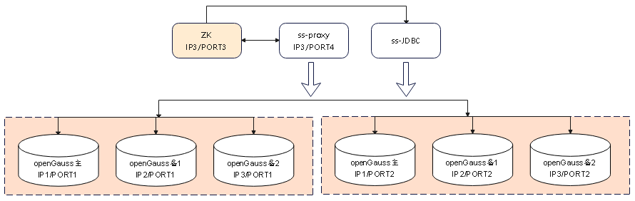

版权所有 © 2022  openGauss社区
 您对“本文档”的复制、使用、修改及分发受知识共享(Creative Commons)署名—相同方式共享4.0国际公共许可协议(以下简称“CC BY-SA 4.0”)的约束。为了方便用户理解，您可以通过访问https://creativecommons.org/licenses/by-sa/4.0/ 了解CC BY-SA 4.0的概要 (但不是替代)。CC BY-SA 4.0的完整协议内容您可以访问如下网址获取：https://creativecommons.org/licenses/by-sa/4.0/legalcode。

修订记录

| 日期       | 修订   版本 | 修改描述                                | 作者       |
| ---------- | ----------- | --------------------------------------- | ---------- |
| 2022-10-12 | 1.0         | 特性测试报告初稿完成                    | peilinqian |
| 2023-1-6   | 1.1         | 3.1章节新增主备数据一致性及性能测试结论 | peilinqian |

关键词： 

openGauss 分布式、ShardingSphere-Proxy、ShardingSphere-JDBC、事务内读写分离

摘要：

本文档主要验证openGauss分布式场景读写分离特性，并给出最终测试结论。

缩略语清单：

| 缩略语   | 英文全名             | 中文解释                                                     |
| -------- | -------------------- | ------------------------------------------------------------ |
| ss-jdbc  | shardingsphere-JDBC  | 定位为轻量级 Java 框架，在 Java 的 JDBC 层提供的额外服务。 它使用客户端直连数据库，以 jar 包形式提供服务，无需额外部署和依赖，可理解为增强版的 JDBC 驱动，完全兼容 JDBC 和各种 ORM 框架。 |
| ss-proxy | shardingsphere-Proxy | 定位为透明化的数据库代理端，提供封装了数据库二进制协议的服务端版本，用于完成对异构语言的支持。 目前提供 MySQL 和 PostgreSQL（兼容 openGauss 等基于 PostgreSQL 的数据库）版本，它可以使用任何兼容 MySQL/PostgreSQL 协议的访问客户端（如：MySQL Command Client, MySQL Workbench, Navicat 等）操作数据，对 DBA 更加友好。 |
| ZK       | zookeeper            | ZooKeeper 是 Apache 软件基金会的一个软件项目，它为大型分布式计算提供开源的分布式配置服务、同步服务和命名注册。 |


# 1     特性概述

在之前openGauss 分布式方案中，在事务下使用读写分离只会路由至主库，这导致在读为主的事务下不能充分利用备机的性能。openGauss新特性DMS和DSS可以保证备机读强一致性，可以在充分发挥读库的性能；本需求改造shardingsphere支持事务下的读写分离路由。

# 2     特性测试信息

| 版本名称                                                     | 测试起始时间 | 测试结束时间 |
| ------------------------------------------------------------ | ------------ | ------------ |
| ShardingSphere-5.1.3-SNAPSHOT Commit ID: <br />7c67365b394d2e3ac562329b550c135c31ea764d | 2022/7/11    | 2022/7/19    |
| ShardingSphere-5.1.3-SNAPSHOT Commit ID: <br />9dd0d3990c849d50c17c6dc7c92ec2d4ce0ad7e5 | 2022/8/3     | 2022/8/3     |
| ShardingSphere-5.2.1-SNAPSHOT Commit ID: <br />4114e7ee4cbe5923c2b403a3e86d1f23355cadf3 | 2022/9/26    | 2022/9/26    |
| ShardingSphere-5.2.1-SNAPSHOT Commit ID: <br />bcde6f374c4a3a025173fbc9f6d0e66ed686a042 | 2022/11/10   | 2022/11/10   |
| ShardingSphere-5.2.2-SNAPSHOT Commit ID: <br />753c0cee8ee6fd3db00536da55b64bc5198a3758 | 2022/12/14   | 2022/1/6     |

| 环境信息   | 配置信息                                                     | 备注                                                         |
| ---------- | ------------------------------------------------------------ | ------------------------------------------------------------ |
| x86+centOS | Intel(R) Xeon(R) Gold 6161 CPU @ 2.20GHz 8核<br />内存：32GB<br/>硬盘：100G<br/>OS：CentOS Linux release 7.6.1810 (Core) | 3台主机组合配置部署<br />至少2分片opengauss（一主两备）、1ss-proxy、1zookeeper |

| 软件名称                                      | 软件版本                                                     | 备注                                                         |
| --------------------------------------------- | ------------------------------------------------------------ | ------------------------------------------------------------ |
| shardingsphere-Proxy<br />shardingsphere-JDBC | ShardingSphere-5.1.3-SNAPSHOT Commit ID: 7c67365b394d2e3ac562329b550c135c31ea764d<br />9dd0d3990c849d50c17c6dc7c92ec2d4ce0ad7e5<br />ShardingSphere-5.2.1-SNAPSHOT Commit ID: 4114e7ee4cbe5923c2b403a3e86d1f23355cadf3<br />bcde6f374c4a3a025173fbc9f6d0e66ed686a042<br />ShardingSphere-5.2.2-SNAPSHOT Commit ID: 753c0cee8ee6fd3db00536da55b64bc5198a3758 | ShardingSphere官网源码包github地址：<br />https://github.com/apache/shardingsphere |
| zookeeper                                     | 3.8.0                                                        |                                                              |
| openGauss                                     | openGauss 3.1.0<br />8198a77b<br />02f5afd2  资源池化版本    |                                                              |

# 3     测试结论概述

## 3.1   测试整体结论

共设计22个用例，主要覆盖了功能测试和可靠性测试，发现问题6个，其中已解决5个，待解决1个，目前读写分离场景下主备事务一致性无法保证；验收不通过。

| 测试活动   | 活动评价                                                     |
| ---------- | ------------------------------------------------------------ |
| 功能测试   | （1）通过yaml方式、DistSQL方式验证10种读写分离策略功能正常。验收通过。<br />（2）通过ss-jdbc、ss-proxy分别验证读写分离策略功能正常。验收通过。<br />（3）shardingsphere+openGaussDMS保证事务内读写分离数据一致性。目前开启XA事务，备机事务无法提交。验收不通过。 |
| 可靠性测试 | 读写分离过程中验证某个读库异常，查询异常，恢复备库，查询成功。验收通过。 |
| 性能测试   | shardingsphere+openGaussDMS场景下，验证读写分离性能提升。因为一致性问题存在问题，导致性能场景前提不正确，验收不通过。 |

## 3.2   约束说明

（1）事务内读写分离数据一致性，需要配合openGauss新特性DMS和DSS，共享存储方式安装部署openGauss。但是目前共享存储也无法保证事务内主备数据一致。

## 3.3   遗留问题分析

### 3.3.1 遗留问题影响以及规避措施

| 问题单号                                                     | 问题描述                                                     | 问题级别 | 问题影响和规避措施 | 当前状态 |
| ------------------------------------------------------------ | ------------------------------------------------------------ | -------- | ------------------ | -------- |
| [21237](https://github.com/apache/shardingsphere/issues/21237) | sharding-proxy XA事务场景下，事务内读写分离验证，commit时报错。原因：XA事务以两阶段方式在opengauss的备库打开事务，备库无法commit。 | 严重     | 无法保证数据一致性 | 打开     |

### 3.3.2 问题统计

|        | 问题总数 | 严重   | 主要   | 次要   | 不重要 |
| ------ | -------- | ------ | ------ | ------ | ------ |
| 数目   | 6        | 1      | 1      | 4      | 0      |
| 百分比 | 100%     | 16.67% | 16.67% | 66.67% | 0%     |

### 3.3.3 问题单汇总

| 序号 | issue号                                                      | 问题级别 | 问题简述                                                     | 问题状态 |
| ---- | ------------------------------------------------------------ | -------- | ------------------------------------------------------------ | -------- |
| 1    | [19061](https://github.com/apache/shardingsphere/issues/19061) | 次要     | 当DataSource的数据库为空时,SQL操作会发生异常。               | 关闭     |
| 2    | [19084](https://github.com/apache/shardingsphere/issues/19084) | 次要     | 当未配置读写分离规则时，进行SHOW READWRITE_SPLITTING RULES报错。 | 关闭     |
| 3    | [19102](https://github.com/apache/shardingsphere/issues/19102) | 次要     | 读写分离规则可以创建多个，但是未对读写分离的数据源进行唯一性校验；存在一套一主多备多个读写分离策略。 | 关闭     |
| 4    | [19825](https://github.com/apache/shardingsphere/issues/19825) | 主要     | 使用xa事务场景，不同逻辑库，DataSource名称相同，使用显式事务时，会导致异常。 | 关闭     |
| 5    | [21237](https://github.com/apache/shardingsphere/issues/21237) | 严重     | sharding-proxy XA事务场景下，事务内读写分离验证，commit时报错。原因：XA事务以两阶段方式在opengauss的备库代开事务，备库无法commit。 | 打开     |
| 6    | [22050](https://github.com/apache/shardingsphere/issues/22050) | 次要     | 多分片情况下，round_robin策略读写分离策略负载均衡不是基于一个逻辑数据库。 | 关闭     |

# 4     测试执行

## 4.1   测试组网图



## 4.2   测试执行统计数据

| 版本名称                                                     | 测试用例数             | 用例执行结果                              | 发现问题单数 |
| ------------------------------------------------------------ | ---------------------- | ----------------------------------------- | ------------ |
| ShardingSphere-5.1.3-SNAPSHOT Commit ID: 7c67365b394d2e3ac562329b550c135c31ea764d | 20                     | Passed：18 Failed：2                      | 3            |
| ShardingSphere-5.1.3-SNAPSHOT Commit ID: 9dd0d3990c849d50c17c6dc7c92ec2d4ce0ad7e5 | 20<br />回归issue：3个 | Passed：20 Failed：1<br />issue Passed：3 | 1            |
| ShardingSphere-5.2.1-SNAPSHOT Commit ID: 4114e7ee4cbe5923c2b403a3e86d1f23355cadf3 | 回归issue：1个         | issue Passed：1                           | 1            |
| ShardingSphere-5.2.1-SNAPSHOT Commit ID: bcde6f374c4a3a025173fbc9f6d0e66ed686a042 | 20                     | Passed：20 Failed：1                      | 1            |
| ShardingSphere-5.2.2-SNAPSHOT Commit ID: 753c0cee8ee6fd3db00536da55b64bc5198a3758 | 2<br /> 回归issue：1个 | Passed：0 Failed：2 issue Passed：1       | 0            |

*数据项说明：*

- 第一轮第二轮第四轮执行全量功能用例20个，第五轮执行新增一致性及性能测试用例2个，由于第三轮执行发现的bug影响，执行失败。
- 最终测试用例执行通过20个，不通过2个；
- 缺陷密度为6(缺陷个数)/1.3k(代码行数)=4.6(个/kloc)。

## 4.3   后续测试建议

需要解决遗留bug后，进行读写分离一致性及性能测试。

# 5     附件

## **5.1   读写分离策略配置示例config-xxx.yaml：**

```
- !READWRITE_SPLITTING
  dataSources:
    ds_0:
      staticStrategy:
        writeDataSourceName: write_0
        readDataSourceNames:
          - read0_0
          - read0_1
      loadBalancerName: roundRobin
  loadBalancers:
    roundRobin:
      type: TRANSACTION_ROUND_ROBIN
```

## **5.2   读写分离策略说明：**

（1）TRANSACTION_RANDOM
无论是否在事务中，读请求采用 random 策略路由到多个 replica。

（2）TRANSACTION_ROUND_ROBIN
无论是否在事务中，读请求采用 round_robin 策略路由到多个 replica。

（3）TRANSACTION_WEIGHT
无论是否在事务中，读请求采用 weight 策略路由到多个 replica。

（4）FIXED_REPLICA_RANDOM
显式开启事务，读请求采用 random 策略路由到一个固定 replica；不开事务，每次读流量使用指定算法路由到不同的 replica。

（5）FIXED_REPLICA_ROUND_ROBIN
显式开启事务，读请求采用 round_robin 策略路由到一个固定 replica；不开事务，每次读流量使用指定算法路由到不同的 replica。

（6）FIXED_REPLICA_WEIGHT
显式开启事务，读请求采用 weight 策略路由到一个固定 replica；不开事务，每次读流量使用指定算法路由到不同的 replica。

（7）FIXED_PRIMARY
读请求全部路由到 primary。

（8）RANDOM
事务内，读请求路由到 primary，事务外，采用 random 策略路由到 replica。

（9）ROUND_ROBIN
事务内，读请求路由到 primary，事务外，采用 round robin 策略路由到 replica。

（10）WEIGHT
事务内，读请求路由到 primary，事务外，采用 weight 策略路由到 replica。


