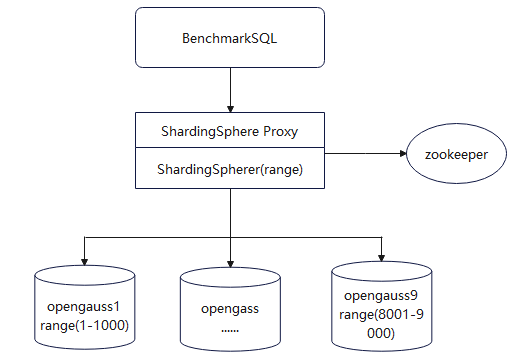
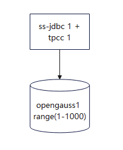
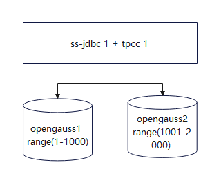
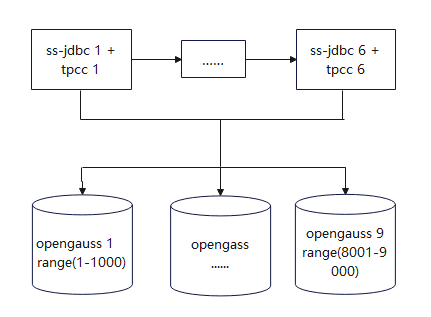

版权所有 © 2021  openGauss社区
 您对“本文档”的复制、使用、修改及分发受知识共享(Creative Commons)署名—相同方式共享4.0国际公共许可协议(以下简称“CC BY-SA 4.0”)的约束。为了方便用户理解，您可以通过访问https://creativecommons.org/licenses/by-sa/4.0/ 了解CC BY-SA 4.0的概要 (但不是替代)。CC BY-SA 4.0的完整协议内容您可以访问如下网址获取：https://creativecommons.org/licenses/by-sa/4.0/legalcode。

修订记录

| 日期       | 修订版本 | 修改描述                   | 作者       |
| ---------- | -------- | -------------------------- | ---------- |
| 2022-12-05 | 1.0      | 初稿撰写                   | lichunlong |
| 2022-12-07 | 1.1      | opengauss3.0.0测试数据更新 | lichunlong |

 关键词： ShardingSphere-JDBC，ShardingSphere-Proxy，

 

摘要：本文验证ShardingSphere&OpenGauss数据库继续深化合作，针对15节点性能优化达到1200WtpmC的测试。

 

缩略语清单：

| 缩略语   | 英文全名                                   | 中文解释                                                     |
| -------- | ------------------------------------------ | ------------------------------------------------------------ |
| TPC      | Transaction Processing Performance Council | 事务处理性能委员会。                                         |
| TPC-C    | Trade Promotion Coordination Committee     | 在线事务处理（OLTP）的基准程序。                               |
| tpmC     | transaction per minute                     | TPC-C的吞吐量，按有效TPC-C配置期间每分钟处理的平均交易次数测试 |
| ss-jdbc  | shardingsphere-JDBC                        | 定位为轻量级 Java 框架，在 Java 的 JDBC 层提供的额外服务。 它使用客户端直连数据库，以 jar 包形式提供服务，无需额外部署和依赖，可理解为增强版的 JDBC 驱动，完全兼容 JDBC 和各种 ORM 框架。 |
| ss-proxy | shardingsphere-Proxy                       | 定位为透明化的数据库代理端，提供封装了数据库二进制协议的服务端版本，用于完成对异构语言的支持。 目前提供 MySQL 和 PostgreSQL（兼容 openGauss 等基于 PostgreSQL 的数据库）版本，它可以使用任何兼容 MySQL/PostgreSQL 协议的访问客户端（如：MySQL Command Client, MySQL Workbench, Navicat 等）操作数据，对 DBA 更加友好。 |

# 1     特性概述

openGauss分布式方案中，第一阶段的性能1000万tpmc目标已达成。本阶段ShardingSphere&OpenGauss继续深化合作，提升15节点性能水平至1200WtpmC。

# 2     特性测试信息

本节描述被测对象的版本信息和测试的时间及测试轮次，包括依赖的硬件。

| 版本名称                                                     | 测试起始时间 | 测试结束时间 |
| ------------------------------------------------------------ | ------------ | ------------ |
| ShardingSphere 5.2.0 Commit ID: 8f9e1858e29c33398f2ea95f6b1b50ef9cf03cfd | 2022.11.30   | 2022.12.07   |
| Opengauss 3.1.0 Preview                                      | 2022.11.30   | 2022.12.05   |
| Opengauss 3.0.0 Release                                      | 2022.12.05   | 2022.12.07   |

描述特性测试的硬件环境信息

| 硬件型号                                       | 硬件配置信息                                                 | 备注                  |
| ---------------------------------------------- | ------------------------------------------------------------ | --------------------- |
| ARM+openEuler 2P TaiShan 200 (Model 2280) | CPU：Kunpeng 920 7260 2p 128核 内存：24*32GB 硬盘：NVME 3T * 4 OS：openEuler release 20.03 (LTS) 文件系统：XFS 网卡：10GE | openGauss数据库节点*9 |
| ARM+openEuler 2P TaiShan 200 (Model 2280) | CPU：Kunpeng 920 7260 2p 128核 内存：24*32GB 硬盘：NVME 3T * 4 OS：openEuler release 20.03 (LTS) 文件系统：XFS 网卡：10GE | ss-jdbc + tpcc节点*6  |

| 软件名称     | 软件版本                                                     | 备注 |
| ------------ | ------------------------------------------------------------ | ---- |
| benchmarksql | 定制版本 https://gitee.com/opengauss_sharding/benchmarksql/tree/item_to_range/ |      |
| aarch64 jdk  | 17.0.1                                                       |      |

# 3     测试结论概述

## 3.1   测试整体结论

共设计4个测试用例，分别覆盖了2节点、3节点和15节点tpcc性能测试，以及2节点24长稳测试。

| 测试活动                       | 活动评价                                                     |
| ------------------------------ | ------------------------------------------------------------ |
| 2 节点测试 1 小时tpcc性能测试  | 1 节点 openGauss + 1 节点 ShardingSphere + BenchmarkSQL,性能测试tpmC预估达到140万，使用benchmarksql工具，在800并发下对1000仓数据进行测试。 ShardingSphere 5.2.0 + Opengauss 3.1.0 Release版本执行3次测试，tpmC取平均值为：136万； ShardingSphere 5.2.0 + Opengauss 3.0.0 Release版本执行3次测试，tpmC取平均值为：141万。 |
| 3 节点测试 1 小时tpcc性能测试  | 2 节点 openGauss + 1 节点 ShardingSphere + BenchmarkSQL,性能测试tpmC预估达到260万，使用benchmarksql工具，在1200并发下对2000仓数据进行测试。 ShardingSphere 5.2.0 + Opengauss 3.1.0 Release版本执行3次测试，tpmC取平均值为：220万； ShardingSphere 5.2.0 + Opengauss 3.0.0 Release版本执行3次测试，tpmC取平均值为：234万。 |
| 15 节点测试 1 小时tpcc性能测试 | 9 节点 openGauss + 6 节点 ShardingSphere + BenchmarkSQL,性能测试tpmC预估达到1300万，使用benchmarksql工具，在1200并发下对9000仓数据进行测试。 ShardingSphere 5.2.0 + Opengauss 3.1.0 Release版本执行3次测试，tpmC取平均值为：1208万； ShardingSphere 5.2.0 + Opengauss 3.0.0 Release版本执行3次测试，tpmC取平均值为：1246万。 |
| 2 节点测试 24 小时tpcc长稳测试 | 1 节点 openGauss + 1 节点 ShardingSphere + BenchmarkSQL,执行24小时tpcc测试。 ShardingSphere 5.2.0 + Opengauss 3.1.0 Release版本功能正常，无异常日志。 |

## 3.2   约束说明

（1）本次性能测试是在实验室网络环境下，搭建测试环境并进行的性能测试，网络条件较稳定，不考虑现网与实验室的网络条件差异；

（2）本报告中，使用benchmarkSQL工具模拟压力场景，代表的仅是已知业务模型，没有特殊业务场景，不能代表在现网复杂场景下的实际处理能力；

（3）本次测试是在固定的网络、物料、软件版本等配套的前提下进行的，如果实际环境与本次测试存在不同，请自行评估性能差异，本次测试环境具体情况，请参考第二章节。

## 3.3   遗留问题分析

### 3.3.1 遗留问题影响以及规避措施

| 问题单号 | 问题描述 | 问题级别 | 问题影响和规避措施 | 当前状态 |
| -------- | -------- | -------- | ------------------ | -------- |
| NA       |          |          |                    |          |

### 3.3.2 问题统计

|        | 问题总数 | 严重 | 主要 | 次要 | 不重要 |
| ------ | -------- | ---- | ---- | ---- | ------ |
| 数目   | 0        | 0    | 0    | 0    | 0      |
| 百分比 | 0        | 0    | 0    | 0    | 0      |

# 4     测试执行

## 4.1   测试结果

### 4.1.1 搭建环境

根据第一阶段性能测试的历史数据，15 节点性能测试组网方案考虑以下配置：

- 搭建9节点 openGauss数据库
- 搭建6节点 ShardingSphere-JDBC

### 4.1.2 数据初始化

按照单机 openGauss 使用 1000 仓数据的规则，在 15 节点的组网中，使用 9 节点 openGauss作为存储节点，因此数据初始化仓数设置 9000 仓，总数据量占用约 1 TB 空间。

使用 ShardingSphere-Proxy 进行数据初始化，可以将数据生成与数据分片的开销分布在不同的机器上。

### 4.1.2 2节点测试 1 小时tpcc性能测试

**2节点测试组网：1 节点 ShardingSphere-JDBC + 1 节点 openGauss**

**测试步骤：**

(1)  配置ss-jdbc config文件、jar包等信息；ss-jdbc节点配置tpcc参数（800并发，benchWarehousesRange 1-1000）；

(2)  运行 1 节点使用 ShardingSphere-JDBC 的 BenchmarkSQL 程序，向 1 节点 openGauss 存储节点发压，预热5分钟；

(3)   运行 1 节点使用 ShardingSphere-JDBC 的 BenchmarkSQL 程序，向 1 节点 openGauss 存储节点发压，执行1小时性能测试。

测试结果：

ShardingSphere 5.2.0 + Opengauss 3.0.0 Release版本执行3次测试，取平均值：tpmC =141万

ShardingSphere 5.2.0 + Opengauss 3.1.0 Preview版本执行3次测试，取平均值：tpmC =136万

### 4.1.3 3节点测试 1 小时tpcc性能测试

**3节点测试组网：1 节点 ShardingSphere-JDBC + 2节点 openGauss**

**测试步骤：**

(1)  配置ss-jdbc config文件、jar包等信息；ss-jdbc节点配置tpcc参数（1200并发，benchWarehousesRange 1-2000）；

(2)  运行 1 节点使用 ShardingSphere-JDBC 的 BenchmarkSQL 程序，向 2 节点 openGauss 存储节点发压，预热5分钟；

(3)   运行 1 节点使用 ShardingSphere-JDBC 的 BenchmarkSQL 程序，向 2 节点 openGauss 存储节点发压，执行1小时性能测试。

测试结果：

ShardingSphere 5.2.0 + Opengauss 3.0.0 Release版本执行3次测试，取平均值：tpmC =234万

ShardingSphere 5.2.0 + Opengauss 3.1.0 Preview版本执行3次测试，取平均值：tpmC = 220万

### 4.1.3 15节点测试 1 小时tpcc性能测试

**15节点测试组网：6节点 ShardingSphere-JDBC + 9节点 openGauss**

**测试步骤：**

(1)  配置ss-jdbc config文件、jar包等信息；ss-jdbc节点配置tpcc参数*6（1200并发，benchWarehousesRange 置空）；

(2)  运行 6 节点使用 ShardingSphere-JDBC 的 BenchmarkSQL 程序，向 9 节点 openGauss 存储节点发压，预热5分钟；

(3)   运行 6 节点使用 ShardingSphere-JDBC 的 BenchmarkSQL 程序，向 9 节点 openGauss 存储节点发压，执行1小时性能测试。

测试结果：

ShardingSphere 5.2.0 + Opengauss 3.0.0 Release版本执行3次测试，取平均值：tpmC =1246万

ShardingSphere 5.2.0 + Opengauss 3.1.0 Preview版本执行3次测试，取平均值：tpmC = 1208万

### 4.1.4  2节点测试 24 小时tpcc长稳测试

测试组网： 1 节点 ShardingSphere-JDBC + 1 节点 openGauss

测试步骤：

(1)  配置ss-jdbc config文件、jar包等信息；ss-jdbc节点配置tpcc参数（10并发，benchWarehousesRange 1-1000）；

(2)  登陆数据库执行sql：alter table bmsql_warehouse MODIFY w_ytd decimal(48, 2);

(3)  运行 1 节点使用 ShardingSphere-JDBC 的 BenchmarkSQL 程序，向 1节点 openGauss 存储节点发压，执行24小时性能测试。

测试结果：

功能正常，无异常日志。

## 4.2 测试执行统计数据

| 版本名称                                       | 测试用例数 | 用例执行结果 | 发现问题单数 |
| ---------------------------------------------- | ---------- | ------------ | ------------ |
| ShardingSphere 5.2.0 + Opengauss 3.1.0 Release | 4          | 通过         | 0            |
| ShardingSphere 5.2.0 + Opengauss 3.0.0 Release | 3          | 通过         | 0            |

数据项说明：

新增代码量： 3.795 kloc。

测试用例数 4个；3个性能测试用例分别在ShardingSphere 5.2.0 + Opengauss 3.1.0 Preview、ShardingSphere 5.2.0 + Opengauss 3.0.0 Release版本上执行，长稳测试在ShardingSphere 5.2.0 + Opengauss 3.1.0 Preview版本上执行。通过用例 4个。

发现问题单数 0个。

## 4.2   后续测试建议

无

# 5     附件

无

 

 

 
