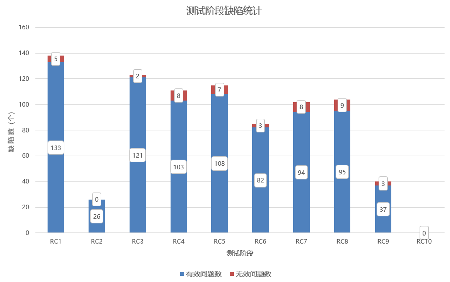

版权所有 © 2023  openGauss社区
 您对“本文档”的复制、使用、修改及分发受知识共享(Creative Commons)署名—相同方式共享4.0国际公共许可协议(以下简称“CC BY-SA 4.0”)的约束。为了方便用户理解，您可以通过访问[*https://creativecommons.org/licenses/by-sa/4.0/*](https://creativecommons.org/licenses/by-sa/4.0/) 了解CC BY-SA 4.0的概要 (但不是替代)。CC BY-SA 4.0的完整协议内容您可以访问如下网址获取：[*https://creativecommons.org/licenses/by-sa/4.0/legalcode*](https://creativecommons.org/licenses/by-sa/4.0/legalcode)。

修订记录

| 日期      | 修订版本 | 修改章节 | 修改描述 | 作者        |
| --------- | -------- | -------- | -------- | ----------- |
| 2023.3.16 | 1.0      | 初稿撰写 |          | yansong_lee |
|           |          |          |          |             |
|           |          |          |          |             |

目 录

1 概述

2 测试版本说明

3 版本概要测试结论

4 版本详细测试结论

> 4.1 特性测试结论

> 4.2 专项测试结论

5 问题单统计

6 附件

7 致谢

**Keywords 关键词**：openGauss 5.0.0 Release

**Abstract 摘要**：主要是描述了openGauss 5.0.0 Release版本的整体测试情况，给出本阶段的测试范围、结果、分析及质量评价，同时对测试活动进行回顾总结。

> 缩略语清单： 

| 缩略语 | 英文全名                             | 中文解释       |
| ------ | ------------------------------------ | -------------- |
| SQL    | Structured Query Language            | 结构化查询语言 |
| CVE    | Common Vulnerabilities and Exposures | 公共漏洞和暴露 |
| DML    | Data Manipulation Language           | 数据操纵语言   |
| DDL    | Data Definition Language             | 数据定义语言   |
| DCL    | Data Control Language                | 数据控制语言   |
| DS     | Data Studio                          | 数据库管理工具 |
| CM     | Cluster Management                   | 集群管理工具   |

 

***
\***

# 概述

openGauss是一款全面友好开放，携手伙伴共同打造的企业级开源关系型数据库。openGauss提供面向多核架构的极致性能、全链路的业务、数据安全、基于AI的调优和高效运维的能力。openGauss具有高性能、高可靠、高安全和易运维等特性，深度融合华为在数据库领域多年的研发经验，结合企业级场景需求，持续构建竞争力特性。

openGauss 5.0.0 Release版本新增内核场景化、工具链和兼容性等特性（具体特性名可以查看"测试版本说明"章节中的需求列表），并对若干关键缺陷进行了修改。本文主要描述了openGauss 5.0.0 Release版本整体测试情况，结合[openGauss 5.0.0 Release版本测试策略](https://gitee.com/opengauss/QA/blob/master/Test_Strategy/openGauss_5.0.0_Release/openGauss%205.0.0%20Release%E7%89%88%E6%9C%AC%E6%B5%8B%E8%AF%95%E7%AD%96%E7%95%A5.md)，展开相应的测试活动。重点从特性质量、专项测试和问题单统计等维度展开叙述。综合来看，openGauss 5.0.0 Release版本整体质量良好。

# 测试版本说明

本章节描述测试版本的基本信息，包括测试对象是什么，以及在什么环境下开展的测试，具体包括被测版本和测试硬件环境。

描述被测对象的版本信息和测试的时间及测试轮次。

| 版本名称                     | 测试起始时间 | 测试结束时间 |
| ---------------------------- | ------------ | ------------ |
| openGauss 5.0.0 Release RC1  | 2023-1-11    | 2023-1-17    |
| openGauss 5.0.0 Release RC2  | 2023-1-18    | 2023-1-28    |
| openGauss 5.0.0 Release RC3  | 2023-1-29    | 2023-2-7     |
| openGauss 5.0.0 Release RC4  | 2023-2-8     | 2023-2-14    |
| openGauss 5.0.0 Release RC5  | 2023-2-15    | 2023-2-21    |
| openGauss 5.0.0 Release RC6  | 2023-2-22    | 2023-2-28    |
| openGauss 5.0.0 Release RC7  | 2023-3-1     | 2023-3-7     |
| openGauss 5.0.0 Release RC8  | 2023-3-8     | 2023-3-14    |
| openGauss 5.0.0 Release RC9  | 2023-3-15    | 2023-3-21    |
| openGauss 5.0.0 Release RC10 | 2023-3-22    | 2023-3-30    |

描述本次测试的测试环境（包括环境软硬件版本信息，环境组网配置信息， 测试辅助工具等）。

| 硬件型号                 | 硬件配置信息                                                 | 备注 |
| ------------------------ | ------------------------------------------------------------ | ---- |
| TaiShan 200 (Model 2280) | CPU：Kunpeng-920 7260 2p 128核 内存：768G 硬盘：NVME 3T * 4 OS：openEuler release 20.03 (LTS) 文件系统：XFS 网卡：4*25GE Hi1822 |      |
| TaiShan 200 (Model 2280) | CPU：Kunpeng-920 7260 2p 128核 内存：768G 硬盘：NVME 3T * 4 OS：openEuler release 22.03 (LTS) 文件系统：XFS 网卡：4*25GE Hi1822 |      |
| TaiShan 200 (Model 2480) | CPU：Kunpeng-920 7260 4p 256核 内存：1T 硬盘：NVME 3T * 4 OS：openEuler release 20.03 (LTS) 文件系统：XFS 网卡：4*10GE |      |
| RH2288H V3               | CPU：Intel(R) Xeon(R) Gold E5-2698 64核 内存：384GB 硬盘：SSD 2.9T  OS：CentOS Linux release 7.6.1810（Core） 文件系统：EXT4 网卡：4*10GE |      |

虚拟化平台

| 虚拟化平台 | 版本说明                                                     |
| ---------- | ------------------------------------------------------------ |
| KVM虚拟化  | KVM+GuestOS（Centos7.6/OpenEuler20.03（LTS）/openEuler22.03（LTS）） |

OS版本说明如下：

| 操作系统  | OS版本           | 版本说明                                                     |
| --------- | ---------------- | ------------------------------------------------------------ |
| OpenEuler | 20.03 (LTS)      | openEuler 20.03 (LTS)，aarch版本ISO SHA256:3e7cb72d746c5385b02b7a4bf18360925145d13f06bbd41c1a137e545b651d40 |
| OpenEuler | 20.03 (LTS)      | openEuler 20.03 (LTS)，x86-64版本ISO SHA256:419592be9cba55a2b800e761d865550f28133875920e7bb9c2d5cdaad90a9cbf |
| OpenEuler | 22.03（LTS）     | openEuler 20.03 (LTS)，aarch版本ISO SHA256:8ee6e6ea6fe3af075846efb28196aac6edd50c99b663b0fc4651fa71195a68e6 |
| OpenEuler | 22.03（LTS）     | openEuler 20.03 (LTS)，x86-64版本ISO SHA256:a07952feb2f9f0239143daf6cc061a396e09bbb3e26d8fbf38eeb21d0251bde0 |
| Kylin     | V10 SP1          | Kylin V10 SP1，aarch版本ISO SHA256:e6fffdb9dec030920a33ad4c57b68cce8cd7d0496b4bd04a7b85f8cc5494cf41 |
| CentOS    | 7.6.1810（Core） | CentOS Linux release 7.6.1810（Core），x86-64版本ISO SHA256:6d44331cc4f6c506c7bbe9feb8468fad6c51a88ca1393ca6b8b486ea04bec3c1 |

openGauss 5.0.0 Release版本是openGauss社区继续联合多方力量推出的版本，本次发布的需求列表如下：

1.**内核场景化**：涉及9个新特性，发布资源池化新特性

|  no  | feature                                                      | status   | sig           | owner |
| :--: | ------------------------------------------------------------ | -------- | ------------- | ----- |
|  1   | 【openGauss 5.0.0 Release】支持XML类型                       | 资料验收 | StorageEngine |       |
|  2   | 【openGauss 5.0.0 Release】dblink支持通过ODBC连接异构数据库  | 已完成   | Connectors    |       |
|  3   | 【openGauss 5.0.0 Release】JDBC的cleanupTimer锁机制优化      | 需求验收 | Connectors    |       |
|  4   | 【openGauss 5.0.0 Release】JDBC高可用优化                    | 资料验收 | Connectors    |       |
|  5   | 【openGauss 5.0.0 Release】JDBC实现集群状态发生变化后，快速实现负载均衡效果 | 需求验收 | Connectors    |       |
|  6   | 【openGauss 5.0.0 Release】【资源池化】openGauss 共享存储支持非512字节整数倍读和写 | 需求验收 | StorageEngine |       |
|  7   | 【openGauss 5.0.0 Release】【资源池化】openGauss 共享存储HA场景加固 | 资料验收 | StorageEngine |       |
|  8   | 【openGauss 5.0.0 Release】【资源池化】openGauss 共享存储DFX增强 | 需求验收 | StorageEngine |       |
|  9   | 【openGauss 5.0.0 Release】【资源池化】openGauss共享存储方案支持升级 | 需求验收 | StorageEngine |       |

2.**工具链**：涉及12个新特性，主要是迁移工具、校验工具以及CM等工具增强

| no   | feature                                                      | status   | sig           | owner |
| ---- | ------------------------------------------------------------ | -------- | ------------- | ----- |
| 1    | 【openGauss 5.0.0 Release】【迁移工具】支持一站式迁移工具portal | 需求验收 | Tools         |       |
| 2    | 【openGauss 5.0.0 Release】【迁移工具】数据校验支持行级、列级和全量比较规则 | 已完成   | Tools         |       |
| 3    | 【openGauss 5.0.0 Release】【迁移工具】M\*数据迁移完整方案打通（增量迁移） | 需求验收 | Tools         |       |
| 4    | 【openGauss 5.0.0 Release】【迁移工具】M\*数据迁移完整方案打通（反向迁移） | 需求验收 | Tools         |       |
| 5    | 【openGauss 5.0.0 Release】【迁移工具】迁移工具可调试性增强、可靠性增强（全量迁移） | 需求验收 | Tools         |       |
| 6    | 【openGauss 5.0.0 Release】【迁移工具】迁移工具可调试性增强、可靠性增强（数据校验） | 需求验收 | Tools         |       |
| 7    | 【openGauss 5.0.0 Release】支持一键式关闭CM集群服务          | 需求验收 | CM            |       |
| 8    | 【openGauss 5.0.0 Release】CM支持事件结束后调用用户自定义脚本 | 需求验收 | CM            |       |
| 9    | 【openGauss 5.0.0 Release】CM支持容器化部署                  | 需求验收 | CM            |       |
| 10   | 【openGauss 5.0.0 Release】支持openEuler 22.03 LTS系统       | 已完成   | StorageEngine |       |
| 11   | 【openGauss 5.0.0 Release】openGauss工具一体化平台           | 需求验收 | Tools         |       |
| 12   | 【openGauss 5.0.0 Release】openGauss数据建模项目             | 需求验收 | Tools         |       |

3.**兼容性**：涉及23个新特性，从数据类型兼容、系统函数兼容、DDL兼容、DML兼容、PL/SQL兼容、SHOW语法兼容和其他语法兼容方面提升openGauss对openGauss对M*的兼容率

| no   | feature                                                      | combination | sig    | ownver   |
| ---- | ------------------------------------------------------------ | ----------- | ------ | -------- |
| 1    | 【openGauss 5.0.0 Release】【M兼容性】支持隐藏索引           | 已完成      | Plugin |          |
| 2    | 【openGauss 5.0.0 Release】【M兼容性】支持union查询关联不同类型的字段 | 需求验收    | Plugin |          |
| 3    | 【openGauss 5.0.0 Release】【M兼容性】支持建表语句中不常见选项语法兼容 | 已完成      | Plugin |          |
| 4    | 【openGauss 5.0.0 Release】【M兼容性】create function语法兼容 | 需求验收    | Plugin |          |
| 5    | 【openGauss 5.0.0 Release】【M兼容性】支持操作符行为和M兼容  | 已完成      | Plugin |          |
| 6    | 【openGauss 5.0.0 Release】【M兼容性】distinct支持order by带表达式 | 已完成      | Plugin |          |
| 7    | 【openGauss 5.0.0 Release】【M兼容性】支持视图、索引等语法带ALGORITHM选项 | 资料验收    | Plugin |          |
| 8    | 【openGauss 5.0.0 Release】M兼容性 full text全文索引         | 需求验收    | Plugin | Enmotech |
| 9    | 【openGauss 5.0.0 Release】M兼容性 'user'@'host' 用户        | 需求验收    | Plugin | Enmotech |
| 10   | 【openGauss 5.0.0 Release】lock table相关特性                | 需求验收    | Plugin | Enmotech |
| 11   | 【openGauss 5.0.0 Release】外键支持关联到普通索引            | 需求验收    | Plugin | Enmotech |
| 12   | 【openGauss 5.0.0 Release】M兼容性 show status语法           | 需求验收    | Plugin | Enmotech |
| 13   | 【openGauss 5.0.0 Release】支持binary数据类型及运算符        | 需求验收    | Plugin | Vastdata |
| 14   | 【openGauss 5.0.0 Release】支持create table select方式建表时指定字段 | 需求验收    | Plugin | Vastdata |
| 15   | 【openGauss 5.0.0 Release】支持字段大小写敏感                | 需求验收    | Plugin | Vastdata |
| 16   | 【openGauss 5.0.0 Release】支持dual表                        | 已完成      | Plugin | Vastdata |
| 17   | 【openGauss 5.0.0 Release】select支持force关键字强制走索引   | 已完成      | Plugin | Vastdata |
| 18   | 【openGauss 5.0.0 Release】支持authid作为列名                | 已完成      | Plugin | Vastdata |
| 19   | 【openGauss 5.0.0 Release】set语法增强                       | 已完成      | Plugin | Vastdata |
| 20   | 【openGauss 5.0.0 Release】支持declare handler               | 需求验收    | Plugin | Vastdata |
| 21   | 【openGauss 5.0.0 Release】create trigger 语法增强           | 需求验收    | Plugin | Vastdata |
| 22   | 【openGauss 5.0.0 Release】select语句支持用户自定义变量设置  | 需求验收    | Plugin | Vastdata |
| 23   | 【openGauss 5.0.0 Release】支持事件触发器                    | 需求验收    | Plugin | Vastdata |

openGauss 5.0.0 Release版本测试活动分工如下：

| 序号 | 需求                                                         | 开发主体      | 测试主体    | 验证策略                                                     |
| ---- | ------------------------------------------------------------ | ------------- | ----------- | ------------------------------------------------------------ |
| 1    | 【openGauss 5.0.0 Release】支持XML类型                       | StorageEngine | QA          | 1.验证xml数据类型取值，对无效值得处理； 2.验证类型转换功能； 3.类型和函数、操作符之间的交互使用； 4.作为表字段类型进行增删改查、导入导出，创建索引、约束等操作。 |
| 2    | 【openGauss 5.0.0 Release】dblink支持通过ODBC连接异构数据库  | Connectors    | QA          | 1.验证dblink连接不指定drivername参数时，通过libpq连接至远程openGauss数据库，并执行增删改查等操作； 2.验证dblink连接指定drivername参数时，通过odbc连接至远程openGauss数据库，并执行增删改查等操作； 3.验证dblink连接异构数据库，配置异构数据库ODBC，通过ODBC连接至远程异构数据库，并执行增删改查等操作； 4.dblink常见函数功能的验证。 |
| 3    | 【openGauss 5.0.0 Release】JDBC的cleanupTimer锁机制优化      | Connectors    | QA          | 1.功能方面主要从以下方面验证：  1.1 执行目前jdbc已有功能用例不受影响；  1.2 新增开启多线程，线程中创建多connection，connection中创建多statement执行sql语句场景，验证功能是否正常； 1.3 新增脚本中设置超时时间小于sql语句实际执行时间，验证能否正常报错，是否陷入死锁。  2.性能方面主要从以下方面验证：    2.1 编写java脚本，验证在不同sql语句执行场景下，优化后jdbc在开启多线程，线程中创建多connection，connection中创建多statement执行sql语句， 即执行并发度很高的场景下，性能对比优化前有提升； 2.2 多次跑tpcc，对比tpmc值，验证优化后是否有提升。  3. 可靠性方面主要从以下方面验证：  3.1 在jdbc连接数据库执行执行的过程中kill -9数据库进程，验证脚本能否正常报错退出，是否会陷入死锁；  3.2 在jdbc连接数据库执行执行的过程中kill -19数据库进程，验证脚本能否正常报错，是否会陷入死锁，重新kill -18拉起数据库进程后脚本能否继续执行。 |
| 4    | 【openGauss 5.0.0 Release】JDBC高可用优化                    | Connectors    | QA          | 对集群进行主备切换，主节点异常后备升主，主节点异常后恢复等操作，验证JDBC连接新主功能正常。 |
| 5    | 【openGauss 5.0.0 Release】JDBC实现集群状态发生变化后，快速实现负载均衡效果 | Connectors    | QA          | 1.验证最小连接负载模式、快速负载均衡开关打开的情况下，负载集群内节点恢复时，是否根据相应快速负载参数配置，对已经建连节点的符合关闭条件的连接进行关闭，并且后续新建连根据集群内最小连接节点进行负载； 2.验证新增4个快速负载均衡参数enableQuickAutoBalance、maxIdleTimeBeforeTerminal、minReservedConPerCluster、minReservedConPerDatanode是否按照规则正确生效。 |
| 6    | 【openGauss 5.0.0 Release】【资源池化】openGauss 共享存储支持非512字节整数倍读和写 | StorageEngine | QA          | 1.验证非512字节整数倍能够正常写入与读取数据库正常运行不进行重启 2.验证非512字节整数倍正常写入后，进行数据库重启，能够正常读取写入数据 |
| 7    | 【openGauss 5.0.0 Release】【资源池化】openGauss 共享存储HA场景加固 | StorageEngine | QA          | 验证多节点集群下HA功能、性能以及压力场景下的HA能力，关注备机的可读能力。 |
| 8    | 【openGauss 5.0.0 Release】【资源池化】openGauss 共享存储DFX增强 | StorageEngine | QA          | 维持一定业务压力，对集群进行failover、switchover、以及重启操作，验证是否出现页面版本不一致问题 |
| 9    | 【openGauss 5.0.0 Release】【资源池化】openGauss共享存储方案支持升级 | StorageEngine | QA          | 1.验证就地升级能否正常升入高版本，升级未提交回退成功，回退后能再入升级； 2.验证灰度升级在进行业务情况下能够不中断业务升级成功，升级未提交回退成功，回退后能再入升级； 3.验证指定节点升级，指定单节点与多节点升级成功，升级未提交回退无异常，回退后能再入升级。 |
| 10   | 【openGauss 5.0.0 Release】【迁移工具】支持一站式迁移工具portal | Tools         | QA          | 1.验证自定义命令安装、启动、卸载等成功； 2.启动全量迁移、全量校验、增量迁移、增量校验、反向迁移后，分别查看数据迁移成功、校验有结果文件； 3.验证通过启动自定义迁移计划成功。  |
| 11   | 【openGauss 5.0.0 Release】【迁移工具】数据校验支持行级、列级和全量比较规则 | Tools         | QA          | 1.验证通过设置表的黑白名单、行号、列字段校验特定数据； 2.构造迁移异常场景，更改openGauss数据，通过自定义规则校验数据生效； 3.验证可靠性场景，注入网络、cpu等故障，自定义行列级规则不受影响； 4.验证资料的一致性。 |
| 12   | 【openGauss 5.0.0 Release】【迁移工具】M\*数据迁移完整方案打通（增量迁移） | Tools         | QA          | 1.主要验证工具功能、性能、安全、资料、易用性。功能重点测试迁移DDL及DML语句是否成功，数据是否一致； 2.性能测试验证insert及混合场景性能是否达到3w tps； 3.安全测试关注密码是否加密； 4.资料测试文档是否描述完整，根据资料能否部署环境成功；  5.关注工具易用性，迁移失败是否有提示，日志记录是否正确。 |
| 13   | 【openGauss 5.0.0 Release】【迁移工具】M\*数据迁移完整方案打通（反向迁移） | Tools         | QA          | 1.验证反向迁移数据类型转换的一致性； 2.验证反向迁移和全量、增量迁移工具的衔接是否正常； 3.验证反向迁移性能支持3w tps。 |
| 14   | 【openGauss 5.0.0 Release】【迁移工具】迁移工具可调试性增强、可靠性增强（全量迁移） | Tools         | QA          | 1.验证全量迁移支持迁移进度展示（总量、剩余量）； 2.验证校验失败的数据展示是否完整,全量迁移支持迁移失败数据、DDL失败语句展示，全量迁移支持迁移失败对象的展； 3.验证资料完整性和可操作性。 |
| 15   | 【openGauss 5.0.0 Release】【迁移工具】迁移工具可调试性增强、可靠性增强（数据校验） | Tools         | QA          | 1.验证通过日志可以查看增量与全量数据校验进度信息、状态信息； 2.日志输出内容与校验实际状态一直，如startTime、endTime等； 3.全量数据校验性能基线测试满足70M/S； 4.资料测试，资料对日志参数介绍准确。 |
| 16   | 【openGauss 5.0.0 Release】支持一键式关闭CM集群服务          | CM            | QA          | 1.验证一键启停CM集群仲裁服务的功能； 2.验证停止CM服务后，数据库的调试和维护操作。 |
| 17   | 【openGauss 5.0.0 Release】CM支持事件结束后调用用户自定义脚本 | CM            | QA          | 1.验证定制化接口（failover后调度自定义脚本）的功能； 2.验证资料完整性和可操作性。 |
| 18   | 【openGauss 5.0.0 Release】CM支持容器化部署                  | CM            | QA          | 1.验证支持容器化安装； 2.验证容器化中的集群管理（建立互信，CM安装拉起等）功能。 |
| 19   | 【openGauss 5.0.0 Release】支持openEuler 22.03 LTS系统       | StorageEngine | QA          | 1.数据库内核/OM/CM/JDBC/ODBC/python驱动、libpq以及迁移工具在openEuler 22.03LTS可编译； 2.OM/CM/JDBC/ODBC/python驱动等工具在openEuler 22.03LTS正常使用； 3.TPCC+gazelle组件性能满足180W tpmC。 |
| 20   | 【openGauss 5.0.0 Release】openGauss工具一体化平台           | Tools         | QA          | 1.验证首页是否正确显示集群信息，跳转其他功能按钮是否正常，一键自检功能是否正常 2.验证设备管理是否可正常添加物理机，AZ管理是否可以正常添加AZ，集群管理是否可以正常对集群进行启停、切主、重建、卸载、删除操作 3.验证一键安装功能是否可以正常使用，集群安装是否可以正常在线安装、离线安装或导入极简版、轻量版、企业版om和cm 4.验证安装包管理是否可以正常查询、新增、修改、删除安装包 5.验证备份恢复是否可以正常查询、恢复、删除集群备份 6.验证插件管理是否可以正常查询、安装、卸载、启用、停用插件 7.验证账号管理是否可以正常查询、添加、删除、启用、停用账号 8.验证角色与权限是否可以正常查询、添加、删除、启用、停用角色，是否可以正常配置角色权限 9.验证访问白名单是否可以正常查询、添加、修改、删除IP 10.验证系统日志是否可以正常查询、下载系统日志，是否可以正常设置日志设置 11.验证操作日志是否可以正常查询日志、查看日志详情 12.检查web页面的布局、UI设计、操作顺序是否符合逻辑 13.验证资料的完整性和可操作性 |
| 21   | 【openGauss 5.0.0 Release】openGauss数据建模项目             | Tools         | QA          | 1.验证数据流算子规则配置和连线是否生效 2.验证数据流可视化图表生成功能是否合理准确 3.验证报表生成和分享功能 4.检查web页面的布局、UI设计、操作顺序是否符合逻辑 5.验证资料的完整性和可操作性 |
| 22   | 【openGauss 5.0.0 Release】【M兼容性】支持隐藏索引           | Plugin        | QA          | 1.CREATE/ALTER TABLE指定PRIMARY KEY/UNIQUE约束并设置可见性，或CREATE/ALTER TABLE直接设置索引可见性 如CREATE TABLE t1(ID INT,INDEX KEY_ID(ID) INVISIBLE)； 2.创建多种类型表如列存表、分区表等设置不同类型索引，设置可见性并观察执行计划是否执行该索引。 |
| 23   | 【openGauss 5.0.0 Release】【M兼容性】支持union查询关联不同类型的字段 | Plugin        | QA          | 1.验证union/union all关联直接select不同的数据类型的场景； 2.验证关联select不同类型的表中数据的场景； 3.验证关联select不同函数的场景； 4.验证关联select语句中结合where/like使用的场景； 5.验证关联select语句中结合操作符、聚合函数使用的场景； 6.验证关联子查询及join关联查询的场景。 |
| 24   | 【openGauss 5.0.0 Release】【M兼容性】支持建表语句中不常见选项语法兼容 | Plugin        | QA          | 1.验证建表及修改表时添加可选项是否成功； 2.验证可选项的参数取值； 3.验证回显结果，是否有warning提示。 |
| 25   | 【openGauss 5.0.0 Release】【M兼容性】create function语法兼容 | Plugin        | QA          | 1.验证单流程控制语句return、loop、while、if、repeat、case时函数功能正确性； 2.验证函数体包含begin-end场景函数功能正确性； 3.验证create function中函数选项支持，如comment、no sql、sql security等； 4.验证函数创建语句查询显示正确性； 5.验证函数return类型与主体返回不一致、函数选项不合理等异常场景。 |
| 26   | 【openGauss 5.0.0 Release】【M兼容性】支持操作符行为和M兼容  | Plugin        | QA          | 1.针对与M*行为不一致的操作符，主要范围涉及数据类型(二进制、数字、浮点、字符串(set enum)、时间日期类型、json)的加减乘除运算； 2.对操作符进行各种运算处理并结合函数运算，验证其执行结果和返回值类型。 |
| 27   | 【openGauss 5.0.0 Release】【M兼容性】distinct支持order by带表达式 | Plugin        | QA          | 1.order by后跟字段在distinct列表中，order by表达式结合数学运算、函数运算、类型转换函数以及指定asc/desc排序； 2.order by后跟字段不在distinct列表中，order by表达式结合数学运算、函数运算、类型转换函数以及指定asc/desc排序。 |
| 28   | 【openGauss 5.0.0 Release】【M兼容性】支持视图、索引等语法带ALGORITHM选项 | Plugin        | QA          | 1.验证基于插件dolphin，兼容B模式下支持view的创建、修改以及index的创建、删除操作带ALGORITHM选项； 2.仅实现语法兼容，不需要做功能兼容。 |
| 29   | 【openGauss 5.0.0 Release】M兼容性 full text全文索引         | Plugin        | QA-Enmotech | 1.验证在DDL语法中创建全文索引的使用； 2.验证在DML查询语法中的使用； 3.验证全文索引在单独创建中的使用。 |
| 30   | 【openGauss 5.0.0 Release】M兼容性 'user'@'host' 用户        | Plugin        | QA-Enmotech | 1.验证create user username@hostip的语法； 2.验证用户名@host方式的认证； 3.验证是否可以辨别来自不同主机相同用户名； 4.验证多个可匹配时的排序规则； 5.支持对象的owner字段支持用户名@host方式指定； 6.不支持username带@特殊字符； 7.验证兼容性开关对此函数的影响； 8.验证username@hostname合理报错。 |
| 31   | 【openGauss 5.0.0 Release】lock table相关特性                | Plugin        | QA-Enmotech | 1.验证lock tables name read 语法； 2.验证lock table name write 语法； 3.验证unlock tables语法； 4.验证flush tables with read lock语法； 5.验证支持外键和触发器。 |
| 32   | 【openGauss 5.0.0 Release】外键支持关联到普通索引            | Plugin        | QA-Enmotech | 1.验证支持对唯一索引创建外键； 2.验证创建非唯一性索引的外键合理报错键； 3.验证对唯一索引创建外键，UPDATE之后对表中内容的影响； 4.验证对唯一索引创建外键，DELETE 之后对表中内容的影响。 |
| 33   | 【openGauss 5.0.0 Release】M兼容性 show status语法           | Plugin        | QA-Enmotech | 1.验证show status基本语法执行； 2.验证对global、session关键字的支持； 3.验证对where、like关键字的支持； 4.验证查询结果的正确性。 |
| 34   | 【openGauss 5.0.0 Release】支持binary数据类型及运算符        | Plugin        | QA-Vastdata | 1. 验证binary在建表和增删查改语句中使用是否正常； 2. 验证binary类型与其他类型进行转换运算； 3. 验证导入导出场景； 4. 验证binary类型转换运算为模糊匹配或完全匹配。 |
| 35   | 【openGauss 5.0.0 Release】支持create table select方式建表时指定字段 | Plugin        | QA-Vastdata | 1. 验证create table select方式建表时指定字段语法是否能正常执行； 2. 验证建表后指定的新表的字段和字段属性是否正确。 |
| 36   | 【openGauss 5.0.0 Release】支持字段大小写敏感                | Plugin        | QA-Vastdata | 1.验证查询返回字段名大小写是否可控； 2.验证大小写控制参数设置是否生效； 3.验证其他场景下使用字段名大小写是否能识别成功。 |
| 37   | 【openGauss 5.0.0 Release】支持dual表                        | Plugin        | QA-Vastdata | 1. 验证查询语句使用dual表的场景； 2. 验证在存储过程、自定义函数、匿名块下使用dual表是否正常。 |
| 38   | 【openGauss 5.0.0 Release】select支持force关键字强制走索引   | Plugin        | QA-Vastdata | 1. 验证使用force index语法指定执行计划是否生效； 2. 验证对force index为不同索引类型； 3.验证force与use index语法一起使用。 |
| 39   | 【openGauss 5.0.0 Release】支持authid作为列名                | Plugin        | QA-Vastdata | 1.验证创建表指定字段名为authid是否能创建成功； 2. 验证其他SQL语句使用authid字段名是否正常。 |
| 40   | 【openGauss 5.0.0 Release】set语法增强                       | Plugin        | QA-Vastdata | 1. 验证使用set语法后变量使用是否正常； 2. 验证set语法与存储过程、自定义函数、匿名块等一起使用。 |
| 41   | 【openGauss 5.0.0 Release】支持declare handler               | Plugin        | QA-Vastdata | 1. 验证handler_action支持EXIT选项、condition_value支持SQLEXCEPTION选项时正常处理异常； 2. 验证在非M兼容模式下是否赋值成功； 3. 验证在存储过程、自定义函数、匿名块下是否赋值成功。 |
| 42   | 【openGauss 5.0.0 Release】create trigger 语法增强           | Plugin        | QA-Vastdata | 1. 验证指定间隔符后，创建触发器末尾不加斜杆测试； 2.验证创建触发器使用M\*格式和原格式的语法使用。 |
| 43   | 【openGauss 5.0.0 Release】select语句支持用户自定义变量设置  | Plugin        | QA-Vastdata | 1. 验证select @var:= expr 语法是否正常； 2. 验证自定义变量为不同数据类型的情况； 3. 验证在不同场景使用select @var:= expr 语法。 |
| 44   | 【openGauss 5.0.0 Release】支持事件触发器                    | Plugin        | QA-Vastdata | 1. 验证事件触发器相关语法是否正常； 2. 验证支持DDL命令是否能触发触发器； 3. 验证在不同场景使用事件触发器。 |

# 版本概要测试结论

openGauss 5.0.0 Release版本整体测试按照release-manager团队的计划，版本测试规划采取6+4的测试方式，即6轮系统测试+4轮集成验证的策略，实际完成了6轮系统测试+4轮集成验证测试：

第一轮~第三轮集中评审了新特性测试设计，同时关注内核场景化、工具链和兼容性三个方面的新特性验收，并对关键性能数据进行了摸底，旨在发现阻塞性问题，而且对继承特性进行了自动化看护。第四轮主要对迁移工具和校验工具进行测试，第五轮投入到内核和兼容性新特性的测试当中。第六轮作为最后一个大颗粒特性的合入时间窗，仍有新需求合入，因此这个阶段还是聚焦新特性的验证。第七轮测试开始进行系统集成验证，展开性能复测、安全和升级等专项测试，意在检查系统集成的完整性和正确性。并启动第一轮7*24H长稳测试。第八轮测试紧接着又覆盖了一轮7\*24H长稳测试，保证社区版本的稳定性。此外，针对特性的测试报告测试人员也开始撰写。第九轮测试继续进行一轮7\*24H长稳测试，并利用工具进行端口扫描/主机漏洞扫描等安全测试，并对性能劣化问题进行攻关冲刺。第十轮测试主要精力放在编译安装和版本构建上，保证社区安装包的可靠可用。同时对关键性能指标进行再次验收，旨在保证发布时对外的承诺达成。并通过自动化进行了版本发布前的验收测试，其次开始版本测试报告和特性测试报告的撰写合入。

openGauss 5.0.0 Release版本按照测试策略完成了全量功能验证和专项测试（性能、可靠性、兼容性、安全和资料等），所有测试任务均按计划完成。本版本计划交付需求44个，实际交付44个，交付率100%，所有发布需求均验证通过。

openGauss 5.0.0 Release版本共发现问题844个，有效问题799个。修复问题回归测试结果正常，版本整体质量良好。遗留6个问题，见附件1遗留问题列表。

# 版本详细测试结论

openGauss 5.0.0 Release版本详细测试内容包括：

1、通过自动化看护，从接入层、SQL层、存储层、管理、安全、可靠可用和工具等7个维度进行openGauss继承特性测试，继承功能无丢失；

2、在内核场景化的竞争力构建上，主要是对共享存储场景进行增强，如HA场景加固、DFX增强和支持升级等......测试覆盖上述需求，关注功能的实现和规格的达成。但后续仍需从共享存储竞争力角度出发，持续进行加固测试和关键指标验证；

3、在工具链方面，覆盖Datakit、CM和OM新特性测试，同时迁移工具也在此次发布版本有了更高的规格表现：全量迁移300MB/S、增量迁移3w tps、反向迁移1w tps以及全量校验70MB/S。不过后续仍需对工具的易用性和稳定性提高要求；

4、在M\*兼容性方面，测试新增数据类型、系统函数、DDL、DML、PL/SQL、SHOW语法和其他语法等需求，M\*兼容性进一步提升；

5、针对系统的稳定性，进行长稳测试，包括事务并发测试、benchmarksql+sysbench加压测试和sqlsmith测试等，数据库满足7*24H正常运行，测试较为充分，产品稳定性好；

6、专项测试包括性能专项、安全专项、兼容性测试、可靠性测试和资料测试。

## 特性测试结论

### 继承特性评价

对产品所有继承特性进行评价，用表格形式评价，包括特性列表（与特性清单保持一致），验证质量评估

| Domain   | Feature                | 质量评估                   | 备注                                                         |
| -------- | ---------------------- | -------------------------- | ------------------------------------------------------------ |
| 接入层   | 应用开发接口           | ▮ | 继承已有测试能力，支持JDBC、ODBC、PDBC、GDBC驱动             |
|          | 分布式中间件           | ▮ | 继承已有测试能力，支持应用侧分布式解决方案shardingsphere     |
| SQL层    | 支持SQL语言版本SQL2003 | ▮ | 继承已有测试能力，支持SQL 2003语言版本                       |
|          | 支持SQL基本语法        | ▮ | 继承已有测试能力，支持DDL/DML/DCL/DQL语句                    |
|          | 存储过程               | ▮ | 继承已有测试能力，关注声明语法、基本语句、动态语句、控制语句、事务管理和调试等 |
|          | 系统表和系统视图       | ▮ | 继承已有测试能力                                             |
|          | DBE_PERF内视图         | ▮ | 继承已有测试能力，关注OS、Instance、Memory等多个维度划分组织视图，DBE_PERF内视图主要用来诊断性能问题 |
|          | SQL关键字              | ▮ | 继承已有测试能力，关注保留字和非保留字之分。根据标准，保留字决不能用做其他标识符。非保留字只是在特定的环境里有特殊的含义，而在其他环境里是可以用做标识符的 |
| 存储层   | 索引                   | ▮ | 继承已有测试能力，支持B Tree索引，Hash索引等                 |
|          | 数据分区               | ▮ | 继承已有测试能力，支持对分区的组合、交换、拆分、合并等功能；支持范围、列表、哈希等分区类型；支持二级分区 |
|          | 行列混合存储           | ▮ | 继承已有测试能力，支持行存、列存两种方式，可以在不同的引用场景下选择相应的存储方式 |
|          | 内存表                 | ▮ | 继承已有测试能力，支持MOT                                    |
|          | 物化视图               | ▮ | 继承已有测试能力，支持物化视图，物化视图是一种特殊的物理表，物化视图是相对普通视图而言的 |
|          | 全文索引               | ▮ | 继承已有测试能力，支持单字及词查询，长句子检索；支持中英文混排检索；支持and、or及not的条件组合检索 |
| 管理     | 命令行安装             | ▮ | 继承已有测试能力，支持OM安装，极简安装和编译安装             |
|          | 版本升级               | ▮ | 继承已有测试能力，支持数据库软件版本的升级功能，包括就地升级和灰度升级 |
|          | 数据库对象管理         | ▮ | 继承已有测试能力，支持图形化的方式对模式、表、视图、用户、角色、数据库对象、存储过程、约束、函数、触发器、自增列、大对象等的管理 |
|          | 诊断分析报告           | ▮ | 继承已有测试能力，支持生成WDR等报告                          |
|          | 智能运维               | ▮ | 继承已有测试能力，具备智能化运维能力，如智能参数调优、智能索引推荐、慢SQL诊断分析、存储空间智能预测等 |
| 安全     | 身份鉴别               | ▮ | 继承已有测试能力，支持定义鉴别失败的次数，用户具有唯一标识性 |
|          | 访问控制               | ▮ | 继承已有测试能力，登录密码存储支持高级别密码存储加密         |
|          | 安全接入               | ▮ | 继承已有测试能力，具备基于RFC5802机制的口令加密认证方法。加密认证过程中采用单项Hash不可逆加密算法PBKDF2，可防止彩虹攻击 |
|          | 强制访问控制           | ▮ | 继承已有测试能力，支持强制访问控制：主体粒度达到用户级，客体粒度达到表、视图、触发器等数据库对象级或记录级及列级 |
|          | 安全审计               | ▮ | 继承已有测试能力，支持安全审计，支持检测安全侵害事件，能将审计数据计入审计日志中 |
|          | 三权分立               | ▮ | 继承已有测试能力，支持系统管理员、安全管理员和审计管理员角色，三种角色计入审计日志中 |
|          | 数据存储加密           | ▮ | 继承已有测试能力，支持对用户数据的加密存储或其他有效性的保护措施 |
|          | 全密态数据库           | ▮ | 继承已有测试能力，支持存储，分析密文数据的数据库系统技术，数据在传输、存储以及计算态均以加密形态存在，整个查询分析过程对用户无感知 |
|          | 动态脱敏               | ▮ | 继承已有测试能力，支持数据库管理员在数据列上创建动态数据脱敏策略 |
|          | 防篡改功能             | ▮ | 继承已有测试能力，具备多方共识防篡改、高效防篡改算法、账本数据分布式存储 |
|          | 恶意攻击防范           | ▮ | 继承已有测试能力，支持system防命令注入，可防止缓冲区溢出；输入有效性检查 |
| 可靠可用 | 物理备份恢复           | ▮ | 继承已有测试能力，支持物理全量/增量备份能力，还原能力，恢复能力，基于时间点恢复能力 |
|          | 全量PITR物理恢复       | ▮ | 继承已有测试能力，全量PITR物理恢复                           |
|          | 逻辑导入导出           | ▮ | 继承已有测试能力，逻辑备份/还原支持对指定库、指定表、指定一组对象（某个模式所属对象）进行备份及还原 |
|          | 延迟备份               | ▮ | 继承已有测试能力，支持延迟备份                               |
|          | 逻辑复制               | ▮ | 继承已有测试能力，支持异构数据库间的数据同步                 |
|          | 极致RTO                | ▮ | 继承已有测试能力，支持快速故障倒换能力，实现RTO<10s          |
| 工具     | 客户端工具             | ▮ | 继承已有测试能力，支持gsql工具、DS工具                       |
|          | 服务端工具             | ▮ | 继承已有测试能力，关注gs_cgroupgs_check、gs_checkos、gs_checkperf、gs_collector、gs_dump、gs_dumpall、gs_guc、gs_encrypt、gs_om、gs_plan_simulator、gs_restore、gs_ssh等工具 |
|          | 系统内部使用工具       | ▮ | 继承已有测试能力，关注gaussdb、gs_backup、gs_basebackup、gs_ctl、gs_expansion、gs_initdb、gs_install、gs_postuninstall、gs_preinstall、gs_dropnode、gs_sshexkey、gs_tar、gs_uninstall、gs_upgradectl、gstrace、pg_recvlogical、gs_probackup 等工具 |
|          | 迁移工具               | ▮ | 继承已有测试能力，支持全量、增量迁移以及反向迁移             |
|          | 校验工具               | ▮ | 继承已有测试能力，支持全量、增量数据校验能力                 |
| 兼容     | 数据类型兼容           | ▮ | 继承已有测试能力，关注在对应兼容模式下，支持已兼容的数据类型 |
|          | 函数兼容               | ▮ | 继承已有测试能力，关注在对应兼容模式下，支持已兼容的系统函数 |
|          | DDL兼容                | ▮ | 继承已有测试能力，关注在对应兼容模式下，支持已兼容的DDL语法  |
|          | DML兼容                | ▮ | 继承已有测试能力，关注在对应兼容模式下，支持已兼容的DML语法  |
|          | DCL兼容                | ▮ | 继承已有测试能力，关注在对应兼容模式下，支持已兼容的DCL语法  |
|          | PL/SQL兼容             | ▮ | 继承已有测试能力，关注在对应兼容模式下，支持已兼容的PL/SQL语法 |
|          | 其他语法兼容           | ▮ | 继承已有测试能力，关注在对应兼容模式下，支持已兼容的其他语法 |

●： 表示特性不稳定，风险高

▲： 表示特性基本可用，遗留少量问题

▮： 表示特性质量良好

### 新需求评价

建议以表格的形式汇总新特性测试执行情况及遗留问题单情况的评估，给出特性质量评估结论。

1、内核&场景化

| 序号 | 特性名称                                                     | 测试情况说明                                                 | 约束依赖说明                                                 | 遗留问题单 | 特性质量评估                | 备注                                                         |
| :--: | ------------------------------------------------------------ | ------------------------------------------------------------ | ------------------------------------------------------------ | ---------- | --------------------------- | ------------------------------------------------------------ |
|  1   | 【openGauss 5.0.0 Release】支持XML类型                       | 共执行1轮测试，执行用例58条，覆盖功能测试、升级和资料测试，主要验证xml类型取值合法性，xml类型和其他数据类型相互转换，作为表字段类型进行增删改查、创建索引、约束等操作，结合函数、存储过程入参、出参测试，测试在自定义类型中使用。 | /                                                            | 无         | ▮  | /                                                            |
|  2   | 【openGauss 5.0.0 Release】dblink支持通过ODBC连接异构数据库  | 共设计测试用例37个功能用例，主要包含dblink通过libpq连接远程openGauss数据库、通过ODBC连接远程openGauss数据库、通过ODBC连接异构数据库，及dblink常用函数功能的验证。共计发现4个问题，均已修复且回归验证通过，整体质量良好。 | 预先安装好ODBC应用程序，并配置好需要的odbc.ini和odbcinst.ini | 无         | ▮  | /                                                            |
|  3   | 【openGauss 5.0.0 Release】JDBC的cleanupTimer锁机制优化      | 执行1轮测试，执行66条功能用例，主要包含执行目前jdbc已有功能用例不受影响； 新增开启多线程，线程中创建多connection，connection中创建多statement执行sql语句场景，验证功能是否正常； 新增脚本中设置超时时间小于sql语句实际执行时间，验证能否正常报错，是否陷入死锁。 执行性能用例13条，主要包含编写java脚本，验证在不同sql语句执行场景下，优化后jdbc在开启多线程，线程中创建多connection，connection中创建多statement执行sql语句，即执行并发度很高的场景下，性能对比优化前有提升；多次跑tpcc，对比tpmc值，验证优化后是否有提升。 执行可靠性用例2条，主要包含在jdbc连接数据库执行执行的过程中kill -9数据库进程，验证脚本能否正常报错退出，是否会陷入死锁；在jdbc连接数据库执行执行的过程中kill -19数据库进程，验证脚本能否正常报错，是否会陷入死锁，重新kill -18拉起数据库进程后脚本能否继续执行。 测试过程未发现问题，整体质量良好。 | 仅是提升高并发场景的SQL执行的并发度，不影响JDBC使用功能；必须设置参数setQueryTimeout>0才能触发锁。 | 无         | ▮  | 1.优化后JDBC性能的优化只体现在select语句，对dml语句（insert，delete，update）会出现性能不提升或性能劣化的情况，与开发讨论后确认是数据库端对并发修改表数据存在排它锁的影响，非本次需求关注点，建议后续关注此方面。 2.性能提升未提供具体提升指标，建议后续关注是否补充。 |
|  4   | 【openGauss 5.0.0 Release】JDBC高可用优化                    | 共设计17个功能用例，主要覆盖了功能、性能、可靠性，17个皆执行通过，执行率100%。共计发现问题2个，均已解决，整体质量良好。 | 1.配置参数必须为：targetServerType=master&heartbeatPeriod 2.链接方式必须为链接主备集群方式 | 无         | ▮  | /                                                            |
|  5   | 【openGauss 5.0.0 Release】JDBC实现集群状态发生变化后，快速实现负载均衡效果 | 共设计36个用例，全部测试通过。主要覆盖功能、可靠性、性能场景；发现问题单4个，全部解决，验收通过。 | JDBC连接参数需要配置：autoBalance=leastconn&enableQuickAutoBalance=true，打开快速负载均衡 | 无         | ▮  | /                                                            |
|  6   | 【openGauss 5.0.0 Release】【资源池化】openGauss 共享存储支持非512字节整数倍读和写 | 非512字节整数倍读与写执行2轮测试，执行用例10条，主要测试非512字节整数倍写入数据成功，并且读取数据无异常，测试后功能符合预期。 | max_prepared_transactions参数数值大于0                       | 无         | ▮  | /                                                            |
|  7   | 【openGauss 5.0.0 Release】【资源池化】openGauss 共享存储HA场景加固 | 共享存储HA场景加固特性测试共执行32个用例，主要覆盖功能测试和可靠性测试，功能测试主要包含一定业务压力下将主机主机踢出集群触发failover，以及在failover过程中kill新主的gaussdb、dss、cm等主要进程；可靠性测试主要覆盖在failover过程中注入网络故障、IO故障、磁盘故障等。共发现12个问题，1个遗留，9个已完成，2个已验收，整体质量一般。 | /                                                            | 无         | ▲ | [I6NQ6U](https://e.gitee.com/opengaussorg/issues/table?issue=I6NQ6U) |
|  8   | 【openGauss 5.0.0 Release】【资源池化】openGauss 共享存储DFX增强 | openGauss共享存储DFX增强特性，共计执行40个用例，主要覆盖了构造不同前提（比如利用dfx脚本和tpcc工具构造业务压力）和reform场景结合测试，累计发现缺陷单16个，7个已验收，8个已完成，1个遗留，整体质量一般。 | /                                                            | 无         | ▲ | [I6CC6J](https://e.gitee.com/opengaussorg/dashboard?issue=I6CC6J) |
|  9   | 【openGauss 5.0.0 Release】【资源池化】openGauss共享存储方案支持升级 | openGauss共享存储方案支持升级共计执行用例38条，只要为覆盖功能测试和资料测试。功能测试主要覆盖就地升级，就地升级能够正常升级或回滚，会滚后能再入升级；灰度升级在业务进行中可以正常的升级或回滚；指定节点升级可以指定单节点与多节点进行升级或回滚，已升级节点不能再次升级。资料测试主要关注关于共享存储模式下关于升级的描述是否合理。本次测试发现问题2个，均已解决，并且回归通过，无遗留风险，整体质量一般。 | 1. 共享存储升级与非共享存储升级方式保持一致； 2. 共享存储升级基线为5.0.0版本； 3. 共享存储的rdma模式不支持升级。 | 无         | ▮  | /                                                            |

2、工具链

| 序号 | 特性名称                                                     | 测试情况说明                                                 | 约束依赖说明                                                 | 遗留问题单 | 特性质量评估               | 备注 |
| :--: | ------------------------------------------------------------ | ------------------------------------------------------------ | ------------------------------------------------------------ | ---------- | -------------------------- | ---- |
|  1   | 【openGauss 5.0.0 Release】【迁移工具】支持一站式迁移工具portal | 共计执行用例32个，支持一站式迁移工具portal覆盖了功能测试与资料测试，累计发现问题21个，均已验收通过 | 1.启动增量校验，需先启动增量迁移 2.增量迁移与增量校验无法同时启动 3.工具搭建依赖kafka、confluent | 无         | ▮ | /    |
|  2   | 【openGauss 5.0.0 Release】【迁移工具】数据校验支持行级、列级和全量比较规则 | 共计执行用例36个，数据校验支持行级、列级和全量比较规则功能测试、可靠性测试、资料测试，累计发现问26个，26个已验收，特性质量良好 | 1.增量校验不支持表、行级规则 2.工具搭建依赖kafka、confluent | 无         | ▮ | /    |
|  3   | 【openGauss 5.0.0 Release】【迁移工具】M\*数据迁移完整方案打通（增量迁移） | 主要覆盖了功能测试、性能测试、安全测试、资料测试。功能测试覆盖开启增量迁移，在M\*侧执行DDL及DML，使用增量迁移工具迁移到openGauss，保证迁移前后数据的一致性、有序性和完整性。性能测试，在高性能机器下，开启增量迁移，通过sysbench工具给M\*压测数据，待数据回放完成，计算迁移效率。安全测试关注迁移日志中密码是否加密。资料测试覆盖校验资料的描述是否完整。共执行用例72条，累计发现缺陷单27个，27个缺陷已解决，回归通过，整体质量良好 | 1.M\* 5.7及以上版本 2.M\*参数设置： log_bin=ON， binlog_format=ROW,，binlog_row_image=FULL,，gtid_mode = ON，若未设置gtid_mode = OFF，则sink端回放退化为串行回放，会降低在线迁移性能 3.增量迁移是直接透传DDL的，对于openGauss侧语法和M\*侧语法不一样的，迁移失败  4.增量迁移二进制类型时openGauss侧dolphin.b_compatibility_mode参数需设置为on，DML可正常迁移  5.启动增量迁移，可同时启动source端和sink端，也可以分开启动  6.为保证事务的顺序性，kafka_2.13-3.2.3/config/server.properties文件num.partitions参数必须设置为1  7.Kafka中以AVRO格式存储数据，AVRO字段名称详见[命名规则](https://gitee.com/link?target=https%3A%2F%2Favro.apache.org%2Fdocs%2F1.11.1%2Fspecification%2F%23names)，不满足命名规范，在线迁移会报错 | 无         | ▮ | /    |
|  4   | 【openGauss 5.0.0 Release】【迁移工具】M\*数据迁移完整方案打通（反向迁移） | 共执行3轮测试，共执行用例101条，测试覆盖基本功能和性能测试。累计发现issue10个，10个已验收。性能基线达到1W tps目标。 | 1.环境依赖：kafka， zookeeper，confluent community，debezium-connector-opengauss 2.openGauss开启逻辑复制功能 3.反向迁移sink端按表分发数据，不支持按事务分发 4.反向迁移connector端配置连接数据库的用户需要有对应数据库下所有schema以及所有表的操作权限 5.性能测试需在Kunpeng-920高性能机器上执行 | 无         | ▮ | /    |
|  5   | 【openGauss 5.0.0 Release】【迁移工具】迁移工具可调试性增强、可靠性增强（全量迁移） | 共执行28条用例，主要覆盖了功能测试和资料测试。功能测试覆盖在M\*数据库分别创建表、视图、触发器、存储过程、自定义函数，使用chameleon工具迁移上述对象到openGauss并开启迁移进度展示将生成迁移进度json文件，在迁移过程中和迁移完成后查看生成的json文件中展示的对象名称、迁移状态、迁移进度。资料测试通过。性能测试覆盖测试开启迁移进度展示时的全量迁移速率，性能达标。累计发现缺陷单7个，已验收7个，无遗留风险，整体质量良好。 | 1.配置文件中dump_json参数设置为Yes                           | 无         | ▮ | /    |
|  6   | 【openGauss 5.0.0 Release】【迁移工具】迁移工具可调试性增强、可靠性增强（数据校验） | 共计执行用例23个，迁移工具可调试性增强、可靠性增强覆盖功能测试、资料测试、性能测试合计发现题单8个，已验收8个，特性质量良好。 | 1.待校验表含主键 2.工具搭建依赖kafka、confluent          | 无         | ▮ | /    |
|  7   | 【openGauss 5.0.0 Release】支持一键式关闭CM集群服务          | 共执行2轮测试，共执行用例53条，测试覆盖基本功能（暂停和恢复CM服务、暂停后CM的功能）和可靠性方面。通过故障注入等手段验证CM服务停止后CM的仲裁进程保活等能力。累计发现问题个，已验收1个，整体质量良好。 | 无                                                           | 无         | ▮ | /    |
|  8   | 【openGauss 5.0.0 Release】CM支持事件结束后调用用户自定义脚本 | 共执行2轮测试，共执行用例45条，测试覆盖基本功能（参数值、配置特定事件、不同场景触发脚本）和可靠性方面。通过故障注入等手段保证容器中CM仲裁和异常拉起能力的稳定性。累计发现问题个，已验收1个，整体质量良好。 | 无                                                           | 无         | ▮ | /    |
|  9   | 【openGauss 5.0.0 Release】CM支持容器化部署                  | 共执行3轮测试，共执行用例77条，测试覆盖基本功能（配置json文件、启动实例，集群功能）和可靠性方面。通过故障注入等手段保证容器中CM仲裁和异常拉起能力。累计发现issue8个，已验收8个，整体质量良好。 | 1.容器内仅提供CM和数据库内核工具，OM工具无法使用             | 无         | ▮ | /    |
|  10  | 【openGauss 5.0.0 Release】支持openEuler 22.03 LTS系统       | 主要包含在x86架构和arm架构的openEuler 22.03LTS系统编译数据库内核、OM、CM、JDBC/ODBC/python驱动、libpq以及迁移工具，以不同方式的安装数据库并执行基本SQL用例，和TPCC性能测试。共发现1个问题，待解决，性能不达标，整体质量良好。 | 1.只支持x86和arm两种架构 2.om编译使用定制三方库         | 无         | ▮ | /    |
|  11  | 【openGauss 5.0.0 Release】openGauss工具一体化平台           | 共执行5论测试，共执行用例301个用例，测试主要覆盖基本功能（添加、删除、修改物理机和AZ，对集群进行启停、切主、重建、卸载、删除操作，一键安装极简版单机，在线安装，离线安装和导入单机、一主一备的极简版和轻量版，在线安装，离线安装和导入单机、一主一备、一主两备的om企业版和一主两备的cm企业版，查询、新增、修改、删除安装包，查询、恢复、删除集群备份，查询、安装、卸载、启用、停用插件，查询、添加、删除、启用、停用账号和角色，配置角色权限，查询、添加、修改、删除白名单IP，查询、下载系统日志，设置系统日志设置，查询、查看操作日志详情），兼容性、易用性，以及资料测试。累计发现问题58个，55个已验收，3个已完成。 | 1.使用root用户，创建新用户og_ops，并授予sudo免密权限 2.平台使用的数据库，当前仅支持openGauss数据库，并且需要提前创建database 3.需要将部署服务器IP配置在平台使用的数据库（openGauss）的白名单列表中 | 无         | ▮ | /    |
|  12  | 【openGauss 5.0.0 Release】openGauss数据建模项目             | 共执行5论测试，共执行用例272个用例，测试主要覆盖基本功能（安装卸载插件、数据流工作区算子管理、数据流算子连线及配置规则及运行结果展示、数据流可视化图表生成、报表生成及分享），兼容性、易用性，以及资料测试。累计发现问题50个，48个已验收，2个已完成。 | 1.需要在一体化平台的基座上传bas-ops插件 2.需要一体化平台拥有已经安装或导入的集群 | 无         | ▮ | /    |

3、兼容性

| 序号 | 特性名称                                                     | 测试情况说明                                                 | 约束依赖说明                                                 | 遗留问题单 | 特性质量评估               | 备注 |
| :--: | ------------------------------------------------------------ | ------------------------------------------------------------ | ------------------------------------------------------------ | ---------- | -------------------------- | ---- |
|  1   | 【openGauss 5.0.0 Release】【M兼容性】支持隐藏索引           | 主要进行功能测试和资料测试。 功能验证参数`dolphin.optimizer_switch`=`'use_invisible_indexes=off'`且索引为`invisible index`时，查询计划不使用该索引；验证CREATE/ALTER TABLE创建/修改索引可见性；验证在不同表类型和字段类型上创建不可见索引。共计执行用例32条，发现缺陷单2个，已解决且验收通过，无遗留风险，整体质量良好 | 1. 兼容M*5.7版本 2. openGauss需使用兼容B库且包含dolphin插件 3. 当且仅当`dolphin.optimizer_switch`=`use_invisible_indexes=off`同时索引为`invisible index`时，查询计划不使用该索引 | 无         | ▮ | /    |
|  2   | 【openGauss 5.0.0 Release】【M兼容性】支持union查询关联不同类型的字段 | 主要覆盖功能测试和资料测试。功能测试覆盖了union连接查询不同的数据类型；union语法连接查询不同的表；union语法和操作符及函数连接使用。共执行39条用例，发现有效问题3个，回归通过，整体质量良好。 | 1.兼容b库且含dolphin插件 2.该需求仅实现支持所有数据类型，其余部分和原有功能保持一致 | 无         | ▮ | /    |
|  3   | 【openGauss 5.0.0 Release】【M兼容性】支持建表语句中不常见选项语法兼容 | 主要进行功能测试、资料测试。在create table/alter table语句中添加可选项，对参数可选项的有效值及无效值测试。因未实现具体功能，所以表的定义中不显示可选项。共计执行用例55条，累计发现缺陷单1个，已解决，回归通过，整体质量良好 | 1.兼容b库且含dolphin插件 2.只是语法兼容，未实现功能 3.回显信息中需打warning 4.alter table语句中的可选项之间需使用逗号分隔 | 无         | ▮ | /    |
|  4   | 【openGauss 5.0.0 Release】【M兼容性】create function语法兼容 | 主要进行功能测试，资料测试。功能测试验证语法支持参数选项有效值及无效值，并验证语法调用正确性。共执行测试用例43条，累计发现缺陷单3个，已解决，回归通过，整体质量良好 | 1.兼容B库且含dolphin插件 2.部分选项为语法兼容未实现具体功能 | 无         | ▮ | /    |
|  5   | 【openGauss 5.0.0 Release】【M兼容性】支持操作符行为和M兼容  | 主要进行功能测试和资料测试。 功能验证参数`dolphin.b_compatibility_mode`=`on`时支持该特性；验证多种数据类型的加减乘除及混合运算；验证混合运算结合数学函数的输出结果；验证参数`dolphin.div_precision_increment`的取值控制除法输出的结果精度。 共计执行用例72条，发现缺陷单1条，已解决且验收通过，无遗留风险，整体质量良好 | 1. 兼容M*5.7版本 2. openGauss需使用兼容B库且包含dolphin插件 3. 当运算结果精度低于M\*时，可以通过调整参数`extra_float_digits`的值，获得更高的计算精度 | 无         | ▮ | /    |
|  6   | 【openGauss 5.0.0 Release】【M兼容性】distinct支持order by带表达式 | 主要进行功能测试和资料测试。 功能验证distinct+order by带排序函数、数学运算和数学函数；验证distinct字段不在order by表达式中；验证distinct+order by结合group by、having、limit等子句查询；验证B库包含dolphin插件且参数`dolphin.sql_mode`中不包含`sql_mode_full_group`选项时支持该特性；验证GUC参数`behavior_compat_option`不包含`allow_orderby_undistinct_column`选项时支持该特性。 共计执行用例27条，未发现缺陷单，无遗留风险，整体质量良好 | 1. 兼容M*5.7版本 2. openGauss需使用兼容B库 3. 兼容B库不包含dolphin插件时，由GUC参数`behavior_compat_option`是否包含`allow_orderby_undistinct_column`选项控制是否支持该特性，默认关闭 兼容B库包含dolphin插件时，由参数`dolphin.sql_mode`参数中是否包含`sql_mode_full_group`选项控制是否支持该特性，默认关闭 4. 当被查询表的行列不唯一对应时，执行器会先进行去重再排序，可能导致查询结果不唯一 | 无         | ▮ | /    |
|  7   | 【openGauss 5.0.0 Release】【M兼容性】支持视图、索引等语法带ALGORITHM选项 | 主要覆盖功能测试和资料测试，功能测试覆盖在不同表类型及对象中验证create/alter view、create/drop index带ALGORITHM选项。共计执行用例60条。发现问题单1个，整体质量良好 | 1.M*使用5.7版本 2.openGauss需使用兼容B库且有dolphin插件 3.仅实现语法兼容，无实际功能 | 无         | ▮ | /    |
|  8   | 【openGauss 5.0.0 Release】M兼容性 full text全文索引         | 共执行1轮测试，执行用例103个，发现6个bug。主要覆盖验证在DDL语法中创建全文索引的使用；验证在DML查询语法中的使用；验证全文索引在单独创建中的使用 | 1.兼容M*5.7版本 2.兼容B类型数据库且含dolphin插件         | 无         | ▮ | /    |
|  9   | 【openGauss 5.0.0 Release】M兼容性 'user'@'host' 用户        | 共执行1轮测试，执行用例77个，未发现bug。主要覆盖验证create user username@hostip的语法；验证用户名@host方式的认证；验证是否可以辨别来自不同主机相同用户名；验证多个可匹配时的排序规则；支持对象的owner字段支持用户名@host方式指定；不支持username带@特殊字符；验证兼容性开关对此函数的影响；验证username@hostname合理报错 | 1.兼容M*5.7版本 2.兼容B类型数据库且含dolphin插件         | 无         | ▮ | /    |
|  10  | 【openGauss 5.0.0 Release】lock table相关特性                | 共执行1轮测试，执行用例158个，未发现bug。主要覆盖验证lock tables name read 语法；验证lock table name write 语法；验证unlock tables语法；验证flush tables with read lock语法；验证支持外键和触发器 | 1.兼容M*5.7版本 2.兼容B类型数据库且含dolphin插件         | 无         | ▮ | /    |
|  11  | 【openGauss 5.0.0 Release】外键支持关联到普通索引            | 共执行1轮测试，执行用例78个，未发现bug。主要覆盖验证支持对唯一索引创建外键 ；验证创建非唯一性索引的外键合理报错键 ；验证对唯一索引创建外键；UPDATE之后对表中内容的影响。 | 1.兼容M*5.7版本 2.兼容B类型数据库且含dolphin插件         | 无         | ▮ | /    |
|  12  | 【openGauss 5.0.0 Release】M兼容性 show status语法           | 共执行2轮测试，执行用例75个，发现2个bug，已通过验收。主要覆盖基本语法测试，对global、session、where、like关键字的支持及功能测试，以及输出结果的正确性验证 | 1.兼容M*5.7版本 2.兼容B类型数据库且含dolphin插件         | 无         | ▮ | /    |
|  13  | 【openGauss 5.0.0 Release】支持binary数据类型及运算符        | 共执行1轮测试，共执行用例37条，测试覆盖基本功能（验证binary在建表和增删查改语句中使用是否正常、 验证binary类型与其他类型进行转换运算、验证导入导出场景、验证binary类型转换运算为模糊匹配或完全匹配）。累计发现问题1个，0个已验收，整体质量良好。 | 1.兼容M*5.7版本 2.兼容B类型数据库且含dolphin插件         | 无         | ▮ | /    |
|  14  | 【openGauss 5.0.0 Release】支持create table select方式建表时指定字段 | 共执行1轮测试，共执行用例33条，测试覆盖基本功能（验证create table select方式建表时指定字段语法是否能正常执行、验证建表后指定的新表的字段和字段属性是否正确）。累计发现问题1个，0个已验收，整体质量良好。 | 1.兼容M*5.7版本 2.兼容B类型数据库且含dolphin插件         | 无         | ▮ | /    |
|  15  | 【openGauss 5.0.0 Release】支持字段大小写敏感                | 共执行1轮测试，共执行用例19条，测试覆盖基本功能（验证查询返回字段名大小写是否可控、验证大小写控制参数设置是否生效、验证其他场景下使用字段名大小写是否能识别成功）。累计发现问题2个，0个已验收，整体质量良好。 | 1.兼容M*5.7版本 2.兼容B类型数据库且含dolphin插件         | 无         | ▮ | /    |
|  16  | 【openGauss 5.0.0 Release】支持dual表                        | 共执行1轮测试，共执行用例14条，测试覆盖基本功能（验证查询语句使用dual表的场景、 验证在存储过程、自定义函数、匿名块下使用dual表是否正常）。未发现问题，整体质量良好。 | 1.兼容M*5.7版本 2.兼容B类型数据库且含dolphin插件         | 无         | ▮ | /    |
|  17  | 【openGauss 5.0.0 Release】select支持force关键字强制走索引   | 共执行1轮测试，共执行用例32条，测试覆盖基本功能（验证使用force index语法指定执行计划是否生效、验证对force index为不同索引类型、验证force与use index语法一起使用）。未发现问题，整体质量良好。 | 1.兼容M*5.7版本 2.兼容B类型数据库且含dolphin插件         | 无         | ▮ | /    |
|  18  | 【openGauss 5.0.0 Release】支持authid作为列名                | 共执行1轮测试，共执行用例8条，测试覆盖基本功能（验证创建表指定字段名为authid是否能创建成功、验证其他SQL语句使用authid字段名是否正常）。未发现问题，整体质量良好。 | 1.兼容M*5.7版本 2.兼容B类型数据库且含dolphin插件         | 无         | ▮ | /    |
|  19  | 【openGauss 5.0.0 Release】set语法增强                       | 共执行1轮测试，共执行用例17条，测试覆盖基本功能（验证使用set语法后变量使用是否正常、验证set语法与存储过程、自定义函数、匿名块等一起使用）。未发现问题，整体质量良好。 | 1.兼容M*5.7版本 2.兼容B类型数据库且含dolphin插件         | 无         | ▮ | /    |
|  20  | 【openGauss 5.0.0 Release】支持declare handler               | 共执行1轮测试，共执行用例17条，测试覆盖基本功能（验证handler_action支持EXIT选项、condition_value支持SQLEXCEPTION选项时正常处理异常、验证在非M兼容模式下是否赋值成功、验证在存储过程、自定义函数、匿名块下是否赋值成功）。未发现问题，整体质量良好。 | 1.兼容M*5.7版本 2.兼容B类型数据库且含dolphin插件         | 无         | ▮ | /    |
|  21  | 【openGauss 5.0.0 Release】create trigger 语法增强           | 共执行1轮测试，共执行用例12条，测试覆盖基本功能（验证指定间隔符后，创建触发器末尾不加斜杆测试、验证创建触发器使用M\*格式和原格式的语法使用）。未发现问题，整体质量良好。 | 1.兼容M*5.7版本 2.兼容B类型数据库且含dolphin插件         | 无         | ▮ | /    |
|  22  | 【openGauss 5.0.0 Release】select语句支持用户自定义变量设置  | 共执行1轮测试，共执行用例53条，测试覆盖基本功能（验证select @var:= expr 语法是否正常、验证自定义变量为不同数据类型的情况、验证在不同场景使用select @var:= expr 语法）。未发现问题，整体质量良好。 | 1.兼容M*5.7版本 2.兼容B类型数据库且含dolphin插件         | 无         | ▮ | /    |
|  23  | 【openGauss 5.0.0 Release】支持事件触发器                    | 共执行1轮测试，共执行用例67条，测试覆盖基本功能（验证事件触发器相关语法是否正常验证支持DDL命令是否能触发触发器、验证在不同场景使用事件触发器）。未发现问题，整体质量良好。 | 1.兼容M*5.7版本 2.兼容B类型数据库且含dolphin插件         | 无         | ▮ | /    |

●： 表示特性不稳定，风险高

▲： 表示特性基本可用，遗留少量问题

▮： 表示特性质量良好

## 专项测试结论

### 安全测试

openGauss 5.0.0 Release版本安全测试覆盖：

1、通过工具进行端口扫描/主机漏洞扫描/开源软件漏洞扫描/安全编译/安全配置/密码和信息泄漏/网络安全红线/安全资料/病毒扫描/敏感信息扫描。

2、针对地址消毒，结合相关测试工具，对memcheck版本执行全量测试用例。

3、从数据库越权风险管理、数据库注入攻击、数据库秘钥管理、数据库辅助工具安全、数据库攻击及审计、数据库内存问题、数据库安全框架设计问题和数据库操作系统提权8大方向进行安全测试。

openGauss 5.0.0 Release版本所有适用的安全扫描和安全测试均已执行，整体质量良好，风险可控。

### 可靠性测试

+ 故障注入类测试

| Domain         | 测试内容                                                     | 测试结论 |
| -------------- | ------------------------------------------------------------ | -------- |
| 硬件故障       | 注入CPU、内存、网络故障时无可靠性问题。磁盘满异常时，有有效提示，并且消除故障后数据库可恢复正常。 | 测试通过 |
| 操作系统故障   | 修改系统时间（夏令时，闰年）无可靠性问题。端口、文件句柄、信号量故障时，有有效提示，且故障消除后数据库可恢复正常。 | 测试通过 |
| 数据库系统故障 | 双机故障、事务管理、数据库进程故障消除后，数据库可恢复正常，且有有效日志记录。大量执行SQL、TPCC高并发、数据库参数调整后对数据库无影响。 | 测试通过 |
| 人为因素故障   | 人为破坏系统表、业务执行过程中启停数据库，会有对应日志记录，并且消除故障后数据库可恢复正常。 | 测试通过 |
| RTO            | 注入磁盘满故障、数据库进程异常时，有有效提示，且消除故障后RTO模式下数据库运行正常。主备频繁切换，无可靠性问题。 | 测试通过 |
| 工具           | 对于时间跳转、频繁使用、主备切换后工具可正常使用，无可靠性问题。 | 测试通过 |

+ 长时间负载测试

| Domain | 测试内容                                                     | 测试结论                                                     |
| ------ | ------------------------------------------------------------ | ------------------------------------------------------------ |
| 场景1  | TPCC+sysbench连跑insert/update/delete事务，1000仓+800并发，7*24H测试 | 业务正常运行，主备机无core，系统可以长时间正常处理tpcc业务、DML增删改查并发事务、DDL创建表删表事务；cpu、内存和io等系统资源使用均正常；一致性检查通过；7*24H满足 |
| 场景2  | sqlsmith工具随机生成SQL语句，执行7*24H测试                   | 连跑7*24小时，数据库未产生core，无异常宕机、卡死等问题，随机生成的sql语句均正常执行 |

### 性能测试

性能测试对关键性能指标进行摸底和测试。

| **指标大项** | **指标小项**                                     | **指标值** | **说明**                              | 测试结论                                                     |
| ------------ | ------------------------------------------------ | ---------- | ------------------------------------- | ------------------------------------------------------------ |
| TPCC         | 2P（Taishan 200 2280 7260）单节点 1H             | 150万      | 与Release基线数据差异小于5%以内可接受 | 单节点1H在极限场景配置下tpmC为***150.5***W+，验证通过        |
|              | 2P（Taishan 200 2280 7260）单节点 8H             | 150万      | 与Release基线数据差异小于5%以内可接受 | 单节点8H在极限场景配置下tpmC为***145.7***W+。在5%浮动范围内，验证通过 |
|              | 2P（Taishan 200 2280 7260）一主一备 1H           | 120万      | 与Release基线数据差异小于5%以内可接受 | 一主一备1H在极限场景配置下tpmC为***120.3***W+。验证通过      |
|              | 4P（Taishan 200 2280 7260）单节点 1H             | 230万      | 与Release基线数据差异小于5%以内可接受 | 单节点在极限场景配置下tpmC为***232.1***W+。验证通过          |
|              | 2P（Taishan 200 2280 5220）单节点 1H             | 100万      | 与Release基线数据差异小于5%以内可接受 | 单节点1H在极限场景配置下tpmC为***96***W+                     |
|              | 分布式ss-jdbc性能损耗场景                        | 15%        | 与Release基线数据差异小于5%以内可接受 | ss-jdcbc1节点1H，tpmC 151W（数据库直连1节点1H，tpmC 150W），性能损耗为***0%*** |
|              | 分布式OLTP，2P（Taishan 200 2280 7260）15节点 1H | 1200万     | 此即为release基线                     | 9pcs+6ss-jdbc+1ss-proxy，tpmC为***1257***W+                  |
|              | 分布式OLTP，2P（Taishan 200 2280 7260）32节点 1H | 2100万     | 此即为release基线                     | 19pcs+12ss-jdbc+1ss-proxy，tpmC为***2110***W+                |
| RTO          | 一主两同步备failover                             | 10s        | 与Release基线数据差异小于5%以内可接受 | **1**s，验证通过                                             |
| 工具链       | 全量迁移                                         | 300MB/s    | 此即为release基线                     | 源端存在10张表，单表数据量3000万，线程数20场景下，M\*向openGauss全量迁移速度为***435MB/s*** |
|              | 增量迁移                                         | 3w tps     | 此即为release基线                     | 源端存在10张表，单表数据量10万，线程数50，混合IUD场景下，M\*向openGauss增量迁移速度为***3.05w tps*** |
|              | 反向迁移                                         | 1w tps     | 此即为release基线                     | 源端存在30张表，单表数据量1000，线程数30，insert场景下，openGauss向M\*反向迁移速度为***2.1w tps*** 源端存在50张表，单表数据量10万，线程数50，混合IUD场景下，openGauss向M\*反向迁移速度为***2.1w tps*** |
|              | 全量校验                                         | 70MB/s     | 此即为release基线                     | 1张表，单表数据量500万场景下，datachecker平均校验速度为***97.77MB/s*** 2张表，单表数据量250万场景下，datachecker平均校验速度为***93.6MB/s*** 10张表，单表数据量50万场景下，datachecker平均校验速度为***95.08MB/s*** 40张表，单表数据量12.5万场景下，datachecker平均校验速度为***125.42MB/s*** 200张表，单表数据量2.5万场景下，datachecker平均校验速度为***104.29MB/s*** 250张表，单表数据量2万场景下，datachecker平均校验速度为***95.48MB/s*** 500张表，单表数据量1万场景下，datachecker平均校验速度为***91.9MB/s*** |

### 兼容性测试

#### 升级兼容

针对openGauss 5.0.0 Release版本，规划的升级路径如下表所示。测试整体情况：

1. openGauss 2.0.0/2.0.1/3.0.0升级到openGauss 5.0.0 Release成功，升级失败或者升级未提交，可以成功回滚
2. 故障场景下，环境恢复后升级可以重入并升级成功
3. 升级成功后，特性功能运行正常

| 升级路径                             | 测试结论 |
| ------------------------------------ | -------- |
| openGauss 2.0.0升级到openGauss 5.0.0 | 测试通过 |
| openGauss 2.0.1升级到openGauss 5.0.0 | 测试通过 |
| openGauss 3.0.0升级到openGauss 5.0.0 | 测试通过 |

#### 硬件兼容

| Domain       | 测试活动                                                     | 测试结论 |
| ------------ | ------------------------------------------------------------ | -------- |
| 服务器兼容   | 在X86（Intel(R) Xeon(R) Gold）/鲲鹏（Kunpeng 920）服务器上安装部署openGauss 5.0.0 Release数据库 | 测试通过 |
| 存储设备兼容 | 在本地盘（SAS、SATA和SSD）及云盘上安装部署openGauss 5.0.0 Release数据库 | 测试通过 |

#### 软件兼容

| Domain       | 测试活动                                                     | 测试结论 |
| ------------ | ------------------------------------------------------------ | -------- |
| 支持云化部署 | 在X86+Centos7.6/X86+openEuler 20.03 LTS/ARM+openEuler 20.03 LTS/X86+openEuler 22.03 LTS/ARM+openEuler 22.03 LTS环境下，通过Docker（18.06.1-ce/18.09.0）安装部署openGauss 5.0.0 Release数据库 | 测试通过 |
| 操作系统兼容 | 在X86+Centos7.6/X86+openEuler 20.03 LTS/ARM+openEuler 20.03 LTS/X86+openEuler 22.03 LTS/ARM+openEuler 22.03 LTS/ARM+Kylin V10环境下，安装部署openGauss 5.0.0 Release数据库 | 测试通过 |

### 资料测试

| 序号 | **手册名称**   | **测试结论** |
| ---- | -------------- | ------------ |
| 1    | 《发行说明》   | PASS         |
| 2    | 《产品描述》   | PASS         |
| 3    | 《技术白皮书》 | PASS         |
| 4    | 《特性描述》   | PASS         |
| 5    | 《编译指导书》 | PASS         |
| 6    | 《快速入门》   | PASS         |
| 7    | 《安装指南》   | PASS         |
| 8    | 《管理员指南》 | PASS         |
| 9    | 《开发者指南》 | PASS         |
| 10   | 《工具参考》   | PASS         |

# 问题单统计

openGauss 5.0.0 Release版本共发现问题844个，有效问题799个，无效问题45个。详细分布见下表: 

| 版本名称                     | 测试起始时间 | 测试结束时间 | 有效问题数 | 无效问题数 |
| ---------------------------- | ------------ | ------------ | ---------- | ---------- |
| openGauss 5.0.0 Release RC1  | 2023-1-11    | 2023-1-17    | 133        | 5          |
| openGauss 5.0.0 Release RC2  | 2023-1-18    | 2023-1-28    | 26         | 0          |
| openGauss 5.0.0 Release RC3  | 2023-1-29    | 2023-2-7     | 121        | 2          |
| openGauss 5.0.0 Release RC4  | 2023-2-8     | 2023-2-14    | 103        | 8          |
| openGauss 5.0.0 Release RC5  | 2023-2-15    | 2023-2-21    | 108        | 7          |
| openGauss 5.0.0 Release RC6  | 2023-2-22    | 2023-2-28    | 82         | 3          |
| openGauss 5.0.0 Release RC7  | 2023-3-1     | 2023-3-7     | 94         | 8          |
| openGauss 5.0.0 Release RC8  | 2023-3-8     | 2023-3-14    | 95         | 9          |
| openGauss 5.0.0 Release RC9  | 2023-3-15    | 2023-3-21    | 37         | 3          |
| openGauss 5.0.0 Release RC10 | 2023-3-22    | 2023-3-30    | 0          | 0          |

本次测试共10轮。从RC1持续到RC10。2023.1.11正式进入openGauss 5.0.0测试阶段，随着Datakit一体化平台转测，在第一轮RC1测试问题数就达到了一个高峰，发现有效问题133个，无效问题5个。RC2测试周期包含七天春节假期，测试活动开展有限，共发现有效问题26个，无效问题0个。RC3阶段转测了迁移工具和校验工具相关需求，同时Datakit工具另外1个需求（数学建模）也展开测试，发现较多问题。另外，共享存储测试和继承功能加固，也导致内核问题增加。共发现有效问题121个，无效问题2个。RC4阶段转测了迁移工具若干特性（增量迁移、反向迁移和一站式操作工具等），再加上共享存储和Datakit工具特性质量还未稳定，导致新增问题数趋势下降不明显。本阶段无效问题变多的原因是CVE漏洞误报，经分析5个CVE漏洞对5.0.0分支无影响。共发现有效问题103个，无效问题8个。RC5阶段转测了共享存储和兼容性等若干特性发现较多问题，除此之外，迁移工具的问题也在不断增加。本阶段无效问题较多的原因在于外部开发者对异构数据库和openGauss之间的兼容性规则理解出现偏差。共发现有效问题108个，无效问题7个。RC6阶段相较于前几个阶段，发现问题趋势呈下降趋势，问题主要还是集中在共享存储、迁移工具和Plugin插件上。共发现有效问题82个，无效问题3个。RC7进入集成验证阶段，启动长稳、性能和可靠性等专项测试，出现较多规格未达成的情况，发现问题数又达到一个高峰。本轮无效问题主要集中在重复问题和超规格问题，共发现有效问题94个，无效问题8个。RC8相较于RC7，发现新问题的数量并没有下降。对出现这种情况的原因进行分析，首先在升级、安全和工具专项测试过程中发现较多问题；其次，对DBV往社区交付的新特性开展测试，也暴露出一些兼容性问题；最后，共享存储相关的问题仍未收敛。本轮无效问题增多的原因也是两方面，一方面在于许多问题超过了数据库规格；另一方面在于周边工具与数据库没有完全适配。本阶段共发现有效问题95个，无效问题9个。进入RC9，随着各测试活动进入尾声，发现问题数明显降低。本阶段问题主要爆发在两方面，一方面是DBV交付新特性验收过程中发现了若干缺陷；另一方面是阻塞问题解决后继续向下执行时又发现了一些问题。共发现有效问题37个，无效问题3个。RC10为最后一个集成验证周期，测试活动主要为问题回归，因此共发现有效问题0个，无效问题0个。

# 附件

## 附件1：遗留问题列表

| 序号 | issue号                                                      | 问题简述                                                     | 问题级别 | 问题分析与影响                                               | 规避措施                                                     | 备注 |
| ---- | ------------------------------------------------------------ | ------------------------------------------------------------ | -------- | ------------------------------------------------------------ | ------------------------------------------------------------ | ---- |
| 1    | [I6IDTZ](https://e.gitee.com/opengaussorg/dashboard?issue=I6IDTZ) | 启用hot_standby_feedback参数，备库down的期间，主库表发生膨胀 | 次要     | 根因：当备机失连后不会同步给主机xmin，主机执行vacuum时只能清理此xmin之前的死亡页面。  影响：备机故障后，vaccum无法回收死亡页面，磁盘占用持续上升，磁盘满后主机服务会变为只读。 | 1.此风险在开发手册中已经重点说明且默认不开启。 2.带CM场景下备机会自动恢复，不带CM场景下手动执行命令也可恢复。 | /    |
| 2    | [I6D740](https://gitee.com/opengaussorg/dashboard?issue_id=I6D740) | 执行计划选择 bitmap scan 更慢                                | 不重要   | 根因：对于bitmap、index、indexonly等计划优劣的边界范围，受到很多因素影响，并非一个绝对值，因此很多时候确实存在一些代价估算不准导致选错计划的情况。 影响：不排除极特殊场景下代价公式的计算出现一些偏差问题或存在一些代价估算不准导致选错计划的情况。 | 1.目前使用的是2.0.0的版本，在3.0.0以及之后的版本之中进行过多次对于索引的代价模型优化，可以使用新版本进行测试。 2.analyze保证统计数据的准确，尝试调整cpu_index_tuple_cost、cpu_tuple_cost、cpu_operator_cost、random_page_cost、enable_bitmapscan、enable_indexscan、enable_indexonlyscan等参数，或者考虑使用hint来进行 | /    |
| 3    | [I6CC6J](https://e.gitee.com/opengaussorg/dashboard?issue=I6CC6J) | 【测试类型：功能测试】【测试版本：5.0.0】 【资源池化】执行sysbench+gstack压力操作，数据库产生core，Cannot access memory at address 0x8 | 不重要   | 根因：当磁盘文件损坏时，如果使用gstack查询数据库堆栈，会出现踩内存导致的空指针异常，进而引发数据库core。自2月1日该问题提单至今，已修复多个磁盘文件损坏问题，且在B009版本执行gstack查询10000+次未复现。 影响：磁盘文件损坏会导致数据库异常，此时数据库不可用，执行gstack操作后，数据库可能产生core | 数据库磁盘文件损坏时，应该运行磁阵快照和数据库备份等修复手段恢复文件数据 | /    |
| 4    | [I6NQ6U](https://e.gitee.com/opengaussorg/issues/table?issue=I6NQ6U) | 【测试类型：功能测试】【测试版本：5.0.0】 【资源池化】开启rto时主机执行业务而备机不执行业务，将主机踢出集群，cm的backend线程无法退出，触发重启Failover | 次要     | 根因：当前在线Failover为了避免回放无法完成，需要将业务线程退出。当前有一些cmagent的连接出现无法退出，在线failover失败。但cmagent线程不影响回放。 影响：出现在线failover失败 | 出现因为cmagent的线程无法退出，进程会重启，在线failover转为重启failover | /    |
| 5    | [I6DRSA](https://e.gitee.com/opengaussorg/projects/477260/bugs/table?issue=I6DRSA) | 【测试类型：功能】【测试版本：5.0.0】【GSC】线程池模式下，打开enable_global_syscache，进行新库创建后，连接库进行创建表操作时，建连报错:gsql: ERROR: aquire wrlock failed | 次要     | 根因：内核在初始化gsc时，保证eqfunc都是硬编码来自进程启动时构建的oidhash表中，但是插件会修改这个逻辑，导致eqfunc从其他hash表查询，导致查询失败，查询失败会读syscache，但是此时syscache不可用，导致死锁报错 影响：建连会报错 | 重试可解决                                                   | /    |
| 6    | [I6EWRZ](https://gitee.com/opengaussorg/dashboard?issue_id=I6EWRZ) | 【测试类型：存储功能】【测试版本：3.0.0】并发创建索引和表触发表空间最大值检测导致死锁 | 次要     | 根因：执行创建索引，新索引记录插入pg_index的索引表，且触发页面分裂，在这个过程中并发较大量DDL，触发relcache重置失效 影响：数据库死锁 | 重启数据库进程                                               | /    |

# 致谢

感谢参与撰写本文、或在过程中给出宝贵指导意见的各位社区开发者（排名不分先后）

+ [@zhangao_za](https://gitee.com/zhangao_za)
+ [@jiexiao1413](https://gitee.com/jiexiao1413)
+ [@liang-bian](https://gitee.com/liang-bian)
+ [@liao-shiting](https://gitee.com/liao-shiting)
+ [@min-sun](https://gitee.com/min-sun)
+ [@JusticeArbiter](https://gitee.com/JusticeArbiter)

