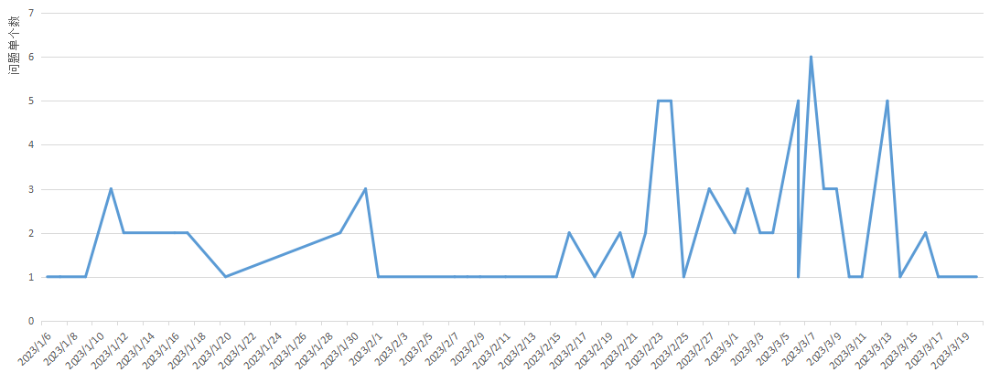
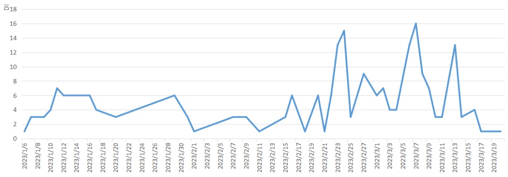
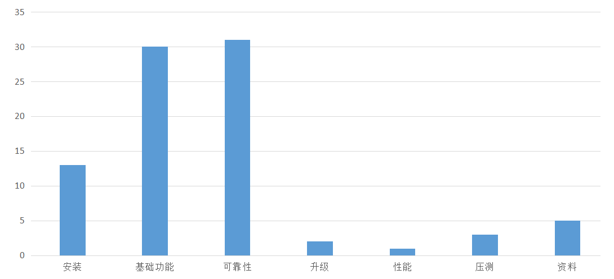

版权所有 © 2023  openGauss社区
您对“本文档”的复制、使用、修改及分发受知识共享(Creative Commons)署名—相同方式共享4.0国际公共许可协议(以下简称“CC BY-SA 4.0”)的约束。为了方便用户理解，您可以通过访问[*https://creativecommons.org/licenses/by-sa/4.0/*](https://creativecommons.org/licenses/by-sa/4.0/) 了解CC BY-SA 4.0的概要 (但不是替代)。CC BY-SA 4.0的完整协议内容您可以访问如下网址获取：[*https://creativecommons.org/licenses/by-sa/4.0/legalcode*](https://creativecommons.org/licenses/by-sa/4.0/legalcode)。

修订记录

 

| 日期      | 修订版本 | 修改章节 | 修改描述 | 作者    |
| --------- | -------- | -------- | -------- | ------- |
| 2023-3-21 | 1.0      | 初稿撰写 |          | jiexiao1413/haomeng/baixiaoli/chengyao25/qumin |

# 1   概述

openGauss 5.0.0版本提供准备机共享一份存储的能力，为客户提供一种主备共享存储的HA部署形态，解决客户传统HA主备部署存储容量较单机翻倍的问题，满足客户降低存储容量及成本的诉求，本文档针对共享存储的部署方式，从新需求、基础功能、故障模式、长稳、性能摸底等方面进行测试，并给出测试结论

# 2   测试版本说明

共进行7个版本测试。

| 版本名称                       | 测试起始时间 | 测试结束时间 |
| ------------------------------ | ------------ | ------------ |
| openGauss 3.1.1 build 7ac947b7 | 2023-1-29    | 2023-2-7     |
| openGauss 5.0.0 build bf0506a1 | 2023-2-8     | 2023-2-14    |
| openGauss 5.0.0 build 52dd7bc7 | 2023-2-15    | 2023-2-21    |
| openGauss 5.0.0 build c3e3237f | 2023-2-22    | 2023-2-28    |
| openGauss 5.0.0 build 5a69c469 | 2023-3-1     | 2023-3-7     |
| openGauss 5.0.0 build bfc16766 | 2023-3-8     | 2023-3-14    |
| openGauss 5.0.0 build dbd18253 | 2023-3-15    | 2023-3-21    |

测试环境信息

| 类型 | cpu  | 内存 | 磁阵      | 操作系统                      | 组网方式 |
| ---- | ---- | ---- | --------- | ----------------------------- | -------- |
| x86  | 64   | 188G | 单卷组1TB | openEuler release 20.03 (LTS) | 1主1备   |
| x86  | 48   | 251G | 单卷组1TB | openEuler release 20.03 (LTS) | 1主2备   |
| arm  | 128  | 768G | 单卷组1TB | openEuler release 20.03 (LTS) | 1主1备   |
| arm  | 128  | 768G | 单卷组1TB | openEuler release 20.03 (LTS) | 1主2备   |

# 3   版本概要测试结论

共完成了5轮系统测试+2轮集成验证测试：其中前三轮测试主要关注继承功能测试，四五轮重点关注新特性的验收，六七轮进行集成测试，同时对关键性能数据进行了摸底，旨在发现阻塞性问题。从功能测试、压力长稳、性能、数据一致性、可靠性、资料等维度进行了验收测试，全量自动化+手工测试用例1W+，累计执行率达到100%。openGauss 5.0.0 版本资源池化特性共发现问题87个，有效问题84个，遗留问题2个（详见遗留问题章节），压力场景下可能存在可靠性、性能问题，该特性质量一般，可以支撑共享存储基础功能的POC测试。

# 4   版本详细测试结论

本章节针对总体测试策略计划的测试内容，给出详细的测试结论。

## 4.1   特性测试结论

### 4.1.1   继承特性评价

SQL继承功能主要为基本功能的使用，覆盖数据库对象及数据库的增删改查，GUC参数的设置，AI特性、兼容特性、关键字、函数及存储过程、系统表与系统视图、数据库安全等，SQL继承覆盖用例1.8w+，均自动化连跑通过

对资源池化特性相关工具进行了继承功能验收，共执行74个用例，累计用例执行率100%，基本功能正常，整体质量良好。

| 序号 | 特性名称      | 特性质量评估               | 备注           |
| ---- | ------------- | -------------------------- | -------------- |
| 1    | dsscmd工具    | 绿灯 | 共测试44个用例 |
| 2    | dssserver工具 | 绿灯 | 共测试30个用例 |

### 4.1.2   新需求评价

#### 4.1.2.1 【资源池化】openGauss共享存储方案支持升级

**【测试情况】**

| 版本名称                       | 测试起始时间 | 测试结束时间 |
| ------------------------------ | ------------ | ------------ |
| openGauss 5.0.0 build 5a69c469 | 2023-3-6     | 2023-3-7     |
| openGauss 5.0.0 build 550ccd91 | 2023-3-13    | 2023-3-15    |
| openGauss 5.0.0 build 78f2bb65 | 2023-3-16    | 2023-3-16    |

| 硬件型号      | 硬件配置信息                                                 | 备注 |
| ------------- | ------------------------------------------------------------ | ---- |
| x86+openEuler | Intel(R) Xeon(R)  CPU E5-2698 v3 @ 2.30GHz 16核 内存：32GB 硬盘：1T OS：openEuler release 20.03 (LTS) |      |

|        |                                           |                                                              |                                                              |            |                            |      |
| ------ | ----------------------------------------- | ------------------------------------------------------------ | ------------------------------------------------------------ | ---------- | -------------------------- | ---- |
| 编号   | 特性名称                                  | 测试情况说明                                                 | 约束依赖说明                                                 | 遗留问题单 | 特性质量评估               | 备注 |
| I6AJNX | 【资源池化】openGauss共享存储方案支持升级 | openGauss共享存储方案支持升级共计执行用例38条，主要为覆盖功能测试和资料测试。功能测试主要覆盖就地升级、灰度升级、指定节点升级，就地升级能正常升级或回滚，回滚后能再入升级；灰度升级在业务进行中可以正常的升级或回滚；指定节点升级可以指定单节点与多节点进行升级或回滚，已升级节点不能再次升级。资料测试主要关注共享存储模式升级约束的描述是否合理。本次测试发现问题2个，均已解决，并且回归通过，无遗留风险，整体质量良好。 | 共享存储升级与非共享存储升级方式保持一致。 共享存储升级基线为5.0.0版本。 共享存储的rdma模式不支持升级。 openGauss共享存储模式集群升级不再备份catalog物理文件，请在升级前使用gs_probackup备份数据，防止故障后数据丢失 | 无         | 绿灯 |      |

**【遗留问题】**

无

#### 4.1.2.2 【资源池化】openGauss 共享存储支持非512字节整数倍读和写

**【测试情况】**

| 版本名称                       | 测试起始时间 | 测试结束时间 |
| ------------------------------ | ------------ | ------------ |
| openGauss 5.0.0 build 5a69c469 | 2023-3-4     | 2023-3-6     |
| openGauss 5.0.0 build 78f2bb65 | 2023-3-16    | 2023-3-16    |

| 硬件型号      | 硬件配置信息                                                 | 备注 |
| ------------- | ------------------------------------------------------------ | ---- |
| ARM+openEuler | CPU：Kunpeng 920 7260 2p 128核 内存：24*32GB 硬盘：NVME 3T * 3 OS：openEuler release 20.03 (LTS) 文件系统：XFS |      |

|        |                                                         |                                                              |                                          |            |                            |      |
| ------ | ------------------------------------------------------- | ------------------------------------------------------------ | ---------------------------------------- | ---------- | -------------------------- | ---- |
| 编号   | 特性名称                                                | 测试情况说明                                                 | 约束依赖说明                             | 遗留问题单 | 特性质量评估               | 备注 |
| I6AJNE | 【资源池化】openGauss 共享存储支持非512字节整数倍读和写 | opnGauss共享存储支持非512字节整数倍写和读，共计执行用例10条，主要进行功能测试，测试重点为非512字节整数倍的写入，写入后的读取。测试过程中发现1个问题，影响2条用例执行失败，现问题已解决。问题回归已通过，无遗留风险，整体质量良好。 | max_prepared_transactions参数数值大于0。 | 无         | 绿灯 |      |

#### 4.1.2.3 【资源池化】openGauss 共享存储DFX增强 && openGauss 共享存储HA场景加固

**【测试情况】**

| 版本名称                       | 测试起始时间 | 测试结束时间 |
| ------------------------------ | ------------ | ------------ |
| openGauss 5.0.0 build c3e3237f | 2023-2-22    | 2023-2-28    |
| openGauss 5.0.0 build 5a69c469 | 2023-3-1     | 2023-3-7     |
| openGauss 5.0.0 build bfc16766 | 2023-3-8     | 2023-3-14    |
| openGauss 5.0.0 build dbd18253 | 2023-3-15    | 2023-3-21    |

描述特性测试的硬件环境信息

| 环境信息      | 配置信息                                                     | 备注 |
| ------------- | ------------------------------------------------------------ | ---- |
| x86+OpenEuler | CPU：Intel(R) Xeon(R) CPU E5-2690 v3 @ 2.60GHz 内存：251GB 硬盘：12T OS：openEuler release 20.03 (LTS-SP1) |      |

|        |                                          |                                                              |              |            |                             |      |
| ------ | ---------------------------------------- | ------------------------------------------------------------ | ------------ | ---------- | --------------------------- | ---- |
| 编号   | 特性名称                                 | 测试情况说明                                                 | 约束依赖说明 | 遗留问题单 | 特性质量评估                | 备注 |
| I6AJNL | 【资源池化】openGauss 共享存储DFX增强    |  openGauss共享存储DFX增强特性，共计执行40个用例，主要覆盖了构造不同前提（比如利用dfx脚本和tpcc工具构造业务压力）和reform场景结合测试，累计发现缺陷单16个。 | 无           | I6CC6J         | 黄灯 |      |
| I6AJNH | 【资源池化】openGauss 共享存储HA场景加固 |openGauss 共享存储HA场景加固特性测试共执行32个用例，主要覆盖功能测试，可靠性测试，功能测试主要包含一定业务压力下将主机主机踢出集群触发failover，以及在failover过程中kill新主的gaussdb、dss、cm等主要进程；可靠性测试主要覆盖在failover过程中注入网络故障、IO故障、磁盘故障等。测试过程中共发现13个问题，2个待办，2个已完成，9个已验收。 | 无           | I6NQ6U        | 黄灯 |      |

**【遗留问题】**

无

## 4.2   兼容性测试结论

### 4.2.1   升级兼容性

本版本是第一个支持升级版本，测试结论见需求I6AJNX验收详情

## 4.3   专项测试结论

### 4.3.1 可靠可用性测试结论

#### 4.3.1.1测试信息

| 版本名称                       | 测试起始时间 | 测试结束时间 |
| ------------------------------ | ------------ | ------------ |
| openGauss 3.1.1 build 7ac947b7 | 2023-1-29    | 2023-2-7     |
| openGauss 5.0.0 build bf0506a1 | 2023-2-8     | 2023-2-14    |
| openGauss 5.0.0 build 52dd7bc7 | 2023-2-15    | 2023-2-21    |
| openGauss 5.0.0 build c3e3237f | 2023-2-22    | 2023-2-28    |
| openGauss 5.0.0 build 5a69c469 | 2023-3-1     | 2023-3-7     |
| openGauss 5.0.0 build bfc16766 | 2023-3-8     | 2023-3-14    |
| openGauss 5.0.0 build dbd18253 | 2023-3-15    | 2023-3-21    |

测试环境信息

| 类型 | cpu  | 内存 | 磁阵      | 操作系统                      | 组网方式 |
| ---- | ---- | ---- | --------- | ----------------------------- | -------- |
| x86  | 64   | 188G | 单卷组1TB | openEuler release 20.03 (LTS) | 1主1备   |
| x86  | 48   | 251G | 单卷组1TB | openEuler release 20.03 (LTS) | 1主2备   |

#### 4.3.1.2 整体测试结论

openGauss 5.0.0 版本提供调用栈和日志记录的故障定位手段，故障引起进程Panic清理故障后可自动/手动恢复进程运行；故障恢复后进程能正常运行、主备状态正常、能正常处理SQL、主备数据一致；本次测试发现多个故障问题，部分已优化，满足可靠可用。

openGauss 5.0.0 版本可靠性测试共计测试8个版本，在x86+openEuler环境下共计执行412个用例，测试用例累计执行率100%，测试发现20个问题，部分已优化闭环，大压力场景下存在可靠性问题。

#### 4.3.1.3 测试场景

覆盖故障模式库中所有场景

| 二级故障     | 三级故障               | 注入方法      |
| ------------ | ---------------------- | ------------- |
| 单实例故障   | cms故障可拉起，主/备   | kill          |
|              | dss故障可拉起，主/备   | kill          |
|              | dss故障不可拉起，主/备 | mv/stop       |
|              | dn故障可拉起，主/备    | kill          |
|              | dn故障不可拉起，主/备  | mv/stop       |
|              | cms/dn/dss僵死，主/备  | kill -19      |
| 多实例故障   | 少数派故障             | mv/kill/stop  |
|              | 多数派故障             | mv/kill/stop  |
|              | 集群重启               | stop && start |
| 配置文件错误 | postgresql.conf        | 手动配置错误  |
|              | cm_resource .json      | 手动配置错误  |
| 网络故障     | 主节点网络故障         | cfe           |
|              | 备节点网络故障         | cfe           |
|              | 多节点网络故障         | cfe           |
| CPU故障      | 主节点cpu故障          | cfe           |
|              | 备节点cpu故障          | cfe           |
| os故障       | os重启                 | reboot        |
|              | os断电                 | 断电          |
| 磁阵故障     | 磁阵文件破损           | echo          |
|              | 磁阵空间满             |               |
| reform       | 多次switchover         | switchover    |
|              | 多次failover           | mv/kill/stop  |
| failover     | 升主过程dn再故障       | mv/kill/stop  |
|              | 升主过程dss再故障      | mv/kill/stop  |
|              | 升主过程网络故障       | cfe           |
| switchover   | 降备过程原主故障       | mv/kill/stop  |
|              | 降备过程新主故障       | mv/kill/stop  |
|              | 升主过程新主dn故障     | mv/kill/stop  |
|              | 升主过程原主dn故障     | mv/kill/stop  |
|              | 升主过程新主dss故障    | mv/kill/stop  |
|              | 升主过程原主dss故障    | mv/kill/stop  |
|              | 升主过程新主网络故障   | cfe           |
|              | 升主过程原主网络故障   | cfe           |

### 4.3.2 性能测试结论

一主一备部署形态，主机读写，备机空载，进行摸底测试，tpcc进行读写达到116w tpmc,暂不进行指标衡量。

### 4.3.3 压力长稳测试结论

**【测试情况】**

| 版本名称                       | 测试起始时间 | 测试结束时间 |
| ------------------------------ | ------------ | ------------ |
| openGauss 5.0.0 build 5a69c469 | 2023-3-9     | 2023-3-11    |
| openGauss 5.0.0 build bfc16766 | 2023-3-12    | 2023-3-17    |
| openGauss 5.0.0 build cc3209cf | 2023-3-20    |              |

| 平台类型 | cpu  | 内存 | 磁阵      | 操作系统                      | 组网方式 |
| -------- | ---- | ---- | --------- | ----------------------------- | -------- |
| x86      | 128  | 1TB  | 单卷组1TB | openEuler release 20.03 (LTS) | 1主1备   |
| x86      | 128  | 756G | 单卷组1TB | openEuler release 20.03 (LTS) | 1主1备   |

| Domain | 场景                  | 参数配置                                                     | 时长  |
| ------ | --------------------- | ------------------------------------------------------------ | ----- |
| tpcc   | 1000w+1000并发+一致性 | dms_control.sh脚本中禁用start&clean delay_arbitrate_max_timeout=0 phony_dead_effective_time=100000000 ss_log_level=255 ss_log_backup_file_count=100 ss_log_max_file_size=1024MB | 7*24H |

**【测试结论】**

一主一备部署形态下，使用tpcc读写 1500w+1000并发/1000w+1000并发进行稳定性测试，运行周期为7*24H，暂未满足7*24H，暂不满足要求。

**【遗留问题】**

暂未运行满足7*24H

### 4.3.4 数据一致性测试结论

覆盖一主一备、一主两备等不同部署形态上正常业务负载和故障场景下的元数据一致性和用户数据一致性，覆盖tpcc、sysbench等benchmark场景。所有被测特性的测试用例累计执行覆盖率达到100%，整体质量良好。

### 4.3.5 资料测试结论

对资源池化特性相关资料的正确性、易用性、完整性、语言描述书面化等进行测试，对于示例和命令进行了有效性测试。发现的问题均已解决，满足版本出口标准。

# 5   问题单统计

问题单趋势分布

DI分布

各项测试缺陷分布

# 6   附件

## 6.1   附件1：遗留问题列表

以下部分详细记录每一个遗留问题，也可视时间情况只详细记录问题级别比较高的遗留问题，低级别的遗留问题采用简单列表进行罗列。所有进行详细记录的遗留问题都统一采用表格的形式来描述，表格形式如下：

| 问题单号       | I6CC6J                                                       |
| -------------- | ------------------------------------------------------------ |
| 问题简述       | **【测试类型：功能测试】【测试版本：5.0.0】 【资源池化】执行sysbench+gstack压力操作，数据库产生core，Cannot access memory at address 0x8** |
| 问题描述       | 一主一备部署，主机执行sysbench读写操作，备机执行sysbench读操作，分别执行gstack查询，节点产生core。 |
| 问题级别       | 次要                                                         |
| 问题分析与对策 | 根因：信息不足，无法复现。疑似文件内容损坏，读取文件失败。 影响：无法从根本上分析影响。推测文件损坏导致“should free"参数不可靠，错误释放空指针，最终结果为数据库core，待复现 |
| 规避措施       | 超期未复现，信息不足，无法分析。                             |
| 备注           | 其他补充内容。                                               |

| 问题单号       | I6NQ6U                                                       |
| -------------- | ------------------------------------------------------------ |
| 问题简述       | **【测试类型：功能测试】【测试版本：5.0.0】 【资源池化】开启rto时主机执行业务而备机不执行业务，将主机踢出集群，cm的backend线程无法退出，触发重启Failover** |
| 问题描述       | 修改参数，开启rto gs_guc set -N all -I all -c "recovery_parse_workers = 4" gs_guc set -N all -I all -c "recovery_redo_workers = 4" gs_guc set -N all -I all -c "hot_standby = off" 主机执行tpcc + sysbench + toast mv 主机gaussdb并kill主机gaussdb进程 查看集群状态和日志 |
| 问题级别       | 次要                                                         |
| 问题分析与对策 | 根因：当前failover为了避免回放无法完成，需要将业务线程退出，当前有一些cm_agent的连接出现无法退出，在线failover失败，但cm_agent线程不影响回放。 影响：出现在线failover失败 |
| 规避措施       | cm_agent线程无法退出，进程重启，在线failover转为重启failover |
| 备注           | 其他补充内容。                                               |

## 6.2   附件2：各种专项测试报告

    此处粘贴各种专项测试报告,如性能测试报告和兼容性等

 