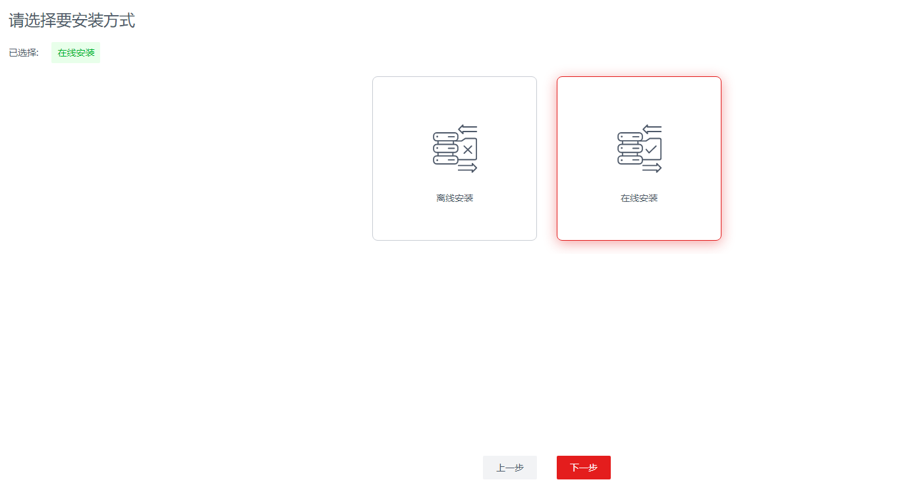
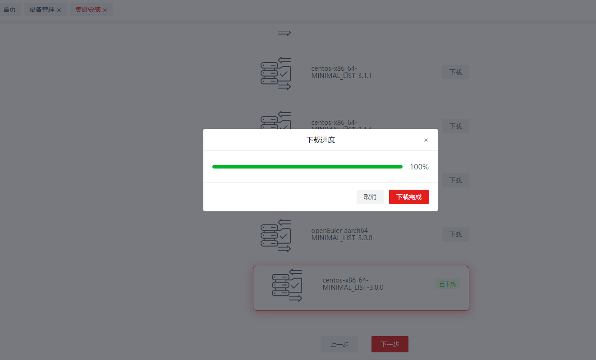
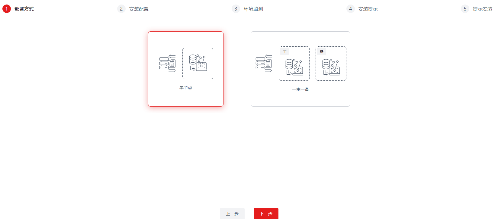
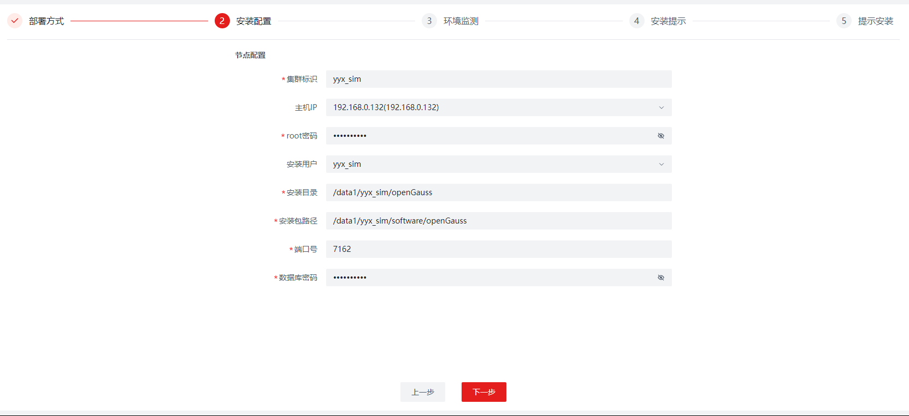
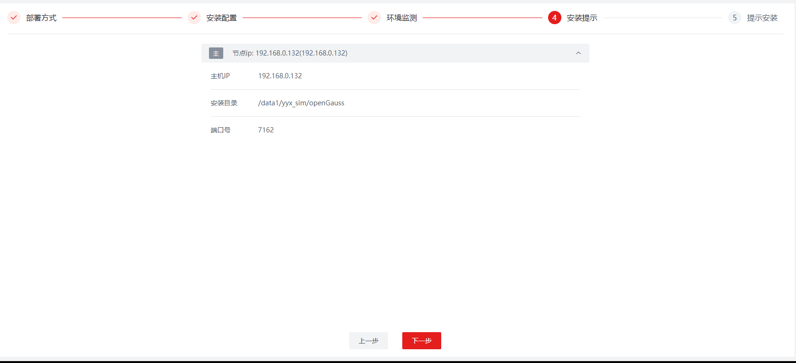
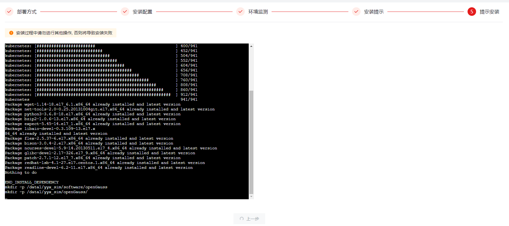
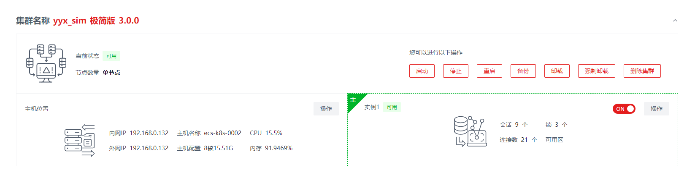

版权所有 © 2023  openGauss社区
 您对“本文档”的复制、使用、修改及分发受知识共享(Creative Commons)署名—相同方式共享4.0国际公共许可协议(以下简称“CC BY-SA 4.0”)的约束。为了方便用户理解，您可以通过访问https://creativecommons.org/licenses/by-sa/4.0/ 了解CC BY-SA 4.0的概要 (但不是替代)。CC BY-SA 4.0的完整协议内容您可以访问如下网址获取：https://creativecommons.org/licenses/by-sa/4.0/legalcode。

修订记录

| 日期      | 修订   版本 | 修改描述           | 作者        |
| :-------- | ----------- | ------------------ | ----------- |
| 2023-3-13 | 1.0         | 特性测试报告初稿完 | yangyixiang |

 关键词： 

openGauss、datakit、一体化

摘要：

本文档主要介绍一体化平台基座openGauss-visualtool及基础运维插件Base-Ops的测试结果。

缩略语清单：

| 缩略语 | 英文全名 | 中文解释 |
| ------ | -------- | -------- |
| 无     |          |          |

# 1     特性概述

一体化平台基座openGauss-visualtool 主要包含以下几个功能特性：

- 安全中心（账号管理、角色权限管理和白名单管理）
- 插件管理模块
- 日志中心，包括操作日志和系统日志（日志级别/切割规则/保留天数的设置和日志下载）
- 国际化（中/英）
- 主题切换（黑/白）
- 基础模块（用户中心、修改个人密码、登录/登出）

基础运维插件Base-Ops主要包含以下几个功能特性：

| 特性名称       | 特性描述                                                     | 备注       |
| -------------- | ------------------------------------------------------------ | ---------- |
| 集群安装       | 支持openGauss企业版、极简版、轻量版安装                      | 支持3.0.0+ |
| 集群导入       | 支持openGauss企业版、极简版、轻量版导入                      | 支持3.0.0+ |
| 一键安装       | 支持openGauss极简版3.0.0一键安装                             | 无         |
| 集群运维       | 支持openGauss企业版、极简版、轻量版的各类运维操作，例如：启动、停止、卸载、备机重建等 | 支持3.0.0+ |
| 物理机资源管理 | 实现对物理机及用户的管理                                     | 无         |
| AZ管理         | 实现对AZ的管理                                               | 无         |
| 备份恢复       | 支持openGauss企业版、极简版、轻量版的数据备份恢复            | 无         |

# 2     特性测试信息

| 版本名称             | 测试起始时间 | 测试结束时间 |
| -------------------- | ------------ | ------------ |
| openGauss-visualtool base-ops 1.0.5 openGauss 5.0.0 Chrome 111.0.5563.64 Firefox 18.5.0.0      | 2023-1-11    | 2023-1-29    |
| openGauss-visualtool base-ops 1.0.5 openGauss 5.0.0 Chrome 111.0.5563.64 Firefox 18.5.0.0       | 2023-1-30    | 2023-2-10    |
| openGauss-visualtool base-ops 1.0.5 openGauss 5.0.0 Chrome 111.0.5563.64 Firefox 18.5.0.0       | 2023-2-11    | 2023-2-23    |
| openGauss-visualtool base-ops 1.0.5 openGauss 5.0.0 Chrome 111.0.5563.64 Firefox 18.5.0.0       | 2023-2-24    | 2023-3-14    |
| openGauss-visualtool base-ops 1.0.6 openGauss 5.0.0 Chrome 111.0.5563.64 Firefox 18.5.0.0       | 2023-3-15    | 2023-3-23    |

| 硬件型号   | 硬件配置信息                                                 | 备注 |
| ---------- | ------------------------------------------------------------ | ---- |
| x86+centOS | Intel(R) Xeon(R) Platinum 8378A CPU @ 3.00GHz 8核 内存：30GB 硬盘：59G OS：CentOS Linux release 7.6.1810 (Core) |      |
| x86+centOS | Intel(R) Xeon(R) Gold 6278C CPU @ 2.60GHz 8核 内存：15GB 硬盘：197G OS：CentOS Linux release 7.6.1810 (Core) |      |
| x86+centOS | Intel(R) Xeon(R) Gold 6161 CPU @ 2.20GHz 8核 内存：15GB 硬盘：197G OS：CentOS Linux release 7.6.1810 (Core) |      |
| x86+centOS | Intel(R) Xeon(R) Gold 6278C CPU @ 2.60GHz 8核 内存：15GB 硬盘：197G OS：CentOS Linux release 7.6.1810 (Core) |      |

# 3     测试结论概述

## 3.1   测试整体结论

一体化平台基座openGauss-visualtool及基础运维插件Base-Ops，共计执行301条用例，主要覆盖了功能测试和资料测试。功能测试覆盖安全中心、插件管理模块、日志中心、国际化、主题切换、基础模块、集群安装 、集群导入、一键安装、集群运维、物理机资源管理、AZ管理、备份恢复。资料测试覆盖校验资料的描述及示例的执行结果是否成功。累计发现缺陷单58个，缺陷均已解决，57个回归通过，1个已完成。

| 测试活动   | 活动评价                                                     |
| ---------- | :----------------------------------------------------------- |
| 功能测试   | 安全中心增删改查账号、角色、白名单，配置账号的角色，配置角色的权限，测试通过 |
| 功能测试   | 插件管理增删查插件，测试通过                                 |
| 功能测试   | 日志中心查询、下载系统日志和操作日志，对系统日志进行设置，测试通过 |
| 功能测试   | 国际化切换中英文，切换黑白主题，测试通过                     |
| 功能测试   | 用户中心修改用户信息，上传用户头像，修改个人密码，测试通过   |
| 功能测试   | 一键安装openGauss极简版，测试通过                            |
| 功能测试   | 集群安装openGauss极简版、轻量版、企业版om和cm，测试通过      |
| 功能测试   | 集群导入openGauss极简版、轻量版、企业版om和cm，测试通过      |
| 功能测试   | 集群运维对集群进行启动、停止、重启、切主、重建、备份操作，测试通过 |
| 功能测试   | 物理机资源增删改查物理机，测试通过                           |
| 功能测试   | AZ管理进行增删改查AZ，测试通过                               |
| 功能测试   | 备份恢复对集群进行恢复备份、删除备份、查询备份操作，测试通过 |
| 兼容性测试 | 测试在Chrome浏览器、Firefox浏览器功能是否均可正常使用，测试通过 |
| 易用性测试 | 检查web页面的布局、UI设计、操作顺序是否符合逻辑，测试通过    |
| 资料测试   | 校验资料的描述及示例的执行结果是否成功，测试通过             |

## 3.2   约束说明

-  使用root用户，创建新用户og_ops，并授予sudo免密权限
-  平台使用的数据库，当前仅支持openGauss数据库，并且需要提前创建database
-  需要将部署服务器IP配置在平台使用的数据库（openGauss）的白名单列表中 

## 3.3   遗留问题分析

### 3.3.1 遗留问题影响以及规避措施

| 问题单号 | 问题描述 |
| -------- | -------- |
| NA       |          |

### 3.3.2 问题统计

|        | 问题总数 | 严重 | 主要 | 次要 | 不重要 |
| ------ | -------- | ---- | ---- | ---- | ------ |
| 数目   | 58 | 6    | 18 | 34 | 0      |
| 百分比 | 100% | 10%  | 31% | 59% | 0%     |

###  3.3.3 问题单汇总

| 序号 | issue号                                                      | 问题级别 | 问题简述                                                     | 问题状态 |
| ---- | ------------------------------------------------------------ | -------- | ------------------------------------------------------------ | -------- |
| 1    | [I6AEU0](https://gitee.com/opengauss/openGauss-workbench/issues/I6AEU0?from=project-issue) | 主要     | 集群安装选择离线安装，选择安装包目录时报错：System interface 400error | 已验收   |
| 2    | [I6AFFA](https://gitee.com/opengauss/openGauss-workbench/issues/I6AFFA?from=project-issue) | 次要     | 添加AZ时，信息填写错误只能关闭添加窗口不能重新填写           | 已验收   |
| 3    | [I6AFKA](https://gitee.com/opengauss/openGauss-workbench/issues/I6AFKA?from=project-issue) | 次要     | 登录后再次打开登录页面重新登录，出现报错：Request failed with status code 403 | 已验收   |
| 4    | [I6AFR7](https://gitee.com/opengauss/openGauss-workbench/issues/I6AFR7?from=project-issue) | 次要     | 集群安装选择非root用户安装后，环境检测仍提示安装用户不能为root并且可用内存检测不正确 | 已验收   |
| 5    | [I6AFZS](https://gitee.com/opengauss/openGauss-workbench/issues/I6AFZS?from=project-issue) | 主要     | 一体化平台无使用资料                                         | 已验收   |
| 6    | [I6AGC4](https://gitee.com/opengauss/openGauss-workbench/issues/I6AGC4?from=project-issue) | 主要     | 管理员用户重置其他用户密码未进行长度及格式校验               | 已验收   |
| 7    | [I6APZV](https://gitee.com/opengauss/openGauss-workbench/issues/I6APZV?from=project-issue) | 次要     | 集群安装选择导入数据库，步骤3环境监测提示操作系统与安装包不匹配，且安装用户和内存情况检测不正确。步骤4导入提示中XLOG目录路径与步骤2节点配置中填写的xlog路径不一致 | 已验收   |
| 8    | [I6AQ2F](https://gitee.com/opengauss/openGauss-workbench/issues/I6AQ2F?from=project-issue) | 主要     | 集群安装选择导入数据库，导入成功后数据库用户gaussdb没有密码，且集群运维无法检测到运行的实例 | 已验收   |
| 9    | [I6AQGM](https://gitee.com/opengauss/openGauss-workbench/issues/I6AQGM?from=project-issue) | 次要     | 新增可用区，AZ名可重复                                       | 已验收   |
| 10   | [I6ATQF](https://gitee.com/opengauss/openGauss-workbench/issues/I6ATQF?from=project-issue) | 严重     | 部署一体化平台失败，查看日志报错：nohup: failed to run command '/etc/jdk11/bin/java': No such file or directory | 已验收   |
| 11   | [I6ATV1](https://gitee.com/opengauss/openGauss-workbench/issues/I6ATV1?from=project-issue) | 次要     | 一体化平台安装部署资料不完整，未告知用户平台所用数据库需配置白名单 | 已验收   |
| 12   | [I6AUFP](https://gitee.com/opengauss/openGauss-workbench/issues/I6AUFP?from=project-issue) | 主要     | 物理机资源用户管理，修改用户可修改root，并且可将修改后的用户删除，删除后物理机不可用 | 已验收   |
| 13   | [I6AUN4](https://gitee.com/opengauss/openGauss-workbench/issues/I6AUN4?from=project-issue) | 次要     | 一体化平台使用资料实例操作描述不完整，未涉及主备切换、生成配置、节点重建操作 | 已验收   |
| 14   | [I6AYHA](https://gitee.com/opengauss/openGauss-workbench/issues/I6AYHA?from=project-issue) | 次要     | 自定义控制台输入命令的行数超过控制台窗口大小，将不能显示当前正在输入的命令 | 已验收   |
| 15   | [I6AYUD](https://gitee.com/opengauss/openGauss-workbench/issues/I6AYUD?from=project-issue) | 严重     | 一体化平台环境搭建资料未告知用户环境搭建成功后的初始用户名及密码，且第一次登录平台后未强制让用户修改密码，违反红线要求 | 已验收   |
| 16   | [I6BS8V](https://gitee.com/opengauss/openGauss-workbench/issues/I6BS8V?from=project-issue) | 严重     | 集群安装企业版，不安装cm，安装失败                           | 已验收   |
| 17   | [I6CATB](https://gitee.com/opengauss/openGauss-workbench/issues/I6CATB?from=project-issue) | 主要     | 一键安装数据库，在安装过程中未禁止用户关闭一键安装Tab页，导致无法获取安装结果 | 已验收   |
| 18   | [I6CB2O](https://gitee.com/opengauss/openGauss-workbench/issues/I6CB2O?from=project-issue) | 次要     | 集群安装选择版本界面【上一步】按钮无意义                     | 已验收   |
| 19   | [I6CI48](https://gitee.com/opengauss/openGauss-workbench/issues/I6CI48?from=project-issue) | 主要     | Base OPS资料可用性不高，建议优化                             | 已验收   |
| 20   | [I6CMP4](https://gitee.com/opengauss/openGauss-workbench/issues/I6CMP4?from=project-issue) | 严重     | 离线安装极简版3.1.1失败，报错：Error: The OpenGauss version number is incorrect | 已验收   |
| 21   | [I6CN9B](https://gitee.com/opengauss/openGauss-workbench/issues/I6CN9B?from=project-issue) | 主要     | 极简版是根据安装路径自动生成数据路径的，实际功能却需要填写安装目录和数据目录，并且如果安装目录和数据目录写成一样的会导致安装报错 | 已验收   |
| 22   | [I6DFEZ](https://gitee.com/opengauss/openGauss-workbench/issues/I6DFEZ?from=project-issue) | 次要     | 一键安装功能未显示安装的数据库的版本号，用户也无法选择想要的安装的版本 | 已验收   |
| 23   | [I6DFQE](https://gitee.com/opengauss/openGauss-workbench/issues/I6DFQE?from=project-issue) | 次要     | 集群安装功能，在线安装选择安装包，不能在不同安装包之间切换选择 | 已验收   |
| 24   | [I6DG2E](https://gitee.com/opengauss/openGauss-workbench/issues/I6DG2E?from=project-issue) | 主要     | 备份恢复功能展示的备份信息未显示用户在备份时输入的备注，且点击恢复按钮没有确定、取消功能，恢复完成后无法关闭恢复过程展示 | 已验收   |
| 25   | [I6DGAP](https://gitee.com/opengauss/openGauss-workbench/issues/I6DGAP?from=project-issue) | 次要     | 备份恢复页面翻页功能没有翻至首页、翻至尾页、输入数字指定跳转页面、下拉框选择每页显示行数 | 已验收   |
| 26   | [I6DH54](https://gitee.com/opengauss/openGauss-workbench/issues/I6DH54?from=project-issue) | 次要     | 集群安装企业版，配置数据库相关目录，界面显示为工作OM目录，数据库社区资料为数据库工具目录，名称不一致 | 已验收   |
| 27   | [I6DPN5](https://gitee.com/opengauss/openGauss-workbench/issues/I6DPN5?from=project-issue) | 次要     | 集群安装导入数据库，导入步骤没有【上一步】按钮               | 已验收   |
| 28   | [I6E6GE](https://gitee.com/opengauss/openGauss-workbench/issues/I6E6GE?from=project-issue) | 严重     | 安装和导入企业版数据库报错AZ信息不正确                       | 已验收   |
| 29   | [I6E8F9](https://gitee.com/opengauss/openGauss-workbench/issues/I6E8F9?from=project-issue) | 次要     | 集群安装极简版、轻量版、企业版，目录、密码、端口未对输入的纯空格进行检测 | 已验收   |
| 30   | [I6E94B](https://gitee.com/opengauss/openGauss-workbench/issues/I6E94B?from=project-issue) | 主要     | 导入企业版无法检测到实例，启动命令执行失败                   | 已验收   |
| 31   | [I6E9WA](https://gitee.com/opengauss/openGauss-workbench/issues/I6E9WA?from=project-issue) | 次要     | 安装包管理无法新增和修改安装包在线地址                       | 已验收   |
| 32   | [I6EDF6](https://gitee.com/opengauss/openGauss-workbench/issues/I6EDF6?from=project-issue) | 次要     | 登陆过期提示描述不准确                                       | 已验收   |
| 33   | [I6EDPS](https://gitee.com/opengauss/openGauss-workbench/issues/I6EDPS?from=project-issue) | 次要     | 备份恢复功能搜索集群标识不起作用，搜索后仍展示所有集群的备份信息 | 已验收   |
| 34   | [I6EEFN](https://gitee.com/opengauss/openGauss-workbench/issues/I6EEFN?from=project-issue) | 次要     | 备份恢复功能删除备份未实际删除物理机上的备份文件，只在平台界面删除了备份信息 | 已验收   |
| 35   | [I6EFR7](https://gitee.com/opengauss/openGauss-workbench/issues/I6EFR7?from=project-issue) | 次要     | 安装包管理搜索功能搜索结果不正确且不支持模糊搜索             | 已验收   |
| 36   | [I6EXCF](https://gitee.com/opengauss/openGauss-workbench/issues/I6EXCF?from=project-issue) | 次要     | 企业版数据库xlog路径是自动生成在dn路径下的，在导入或安装企业版数据库时应根据dn路径自动识别xlog路径，用户无需手动填写xlog路径 | 已验收   |
| 37   | [I6FK6K](https://gitee.com/opengauss/openGauss-workbench/issues/I6FK6K?from=project-issue) | 次要     | 安装企业版CM，步骤【安装提示】仍显示不安装CM且不显示CM数据路径及CM端口号 | 已验收   |
| 38   | [I6FKCS](https://gitee.com/opengauss/openGauss-workbench/issues/I6FKCS?from=project-issue) | 严重     | 离线安装企业版3.1.1报错解压失败                              | 已验收   |
| 39   | [I6FQ2X](https://gitee.com/opengauss/openGauss-workbench/issues/I6FQ2X?from=project-issue) | 次要     | 企业版cm安装成功，集群运维实例检测显示未检测                 | 已验收   |
| 40   | [I6FZTB](https://gitee.com/opengauss/openGauss-workbench/issues/I6FZTB?from=project-issue) | 主要     | 安装企业版CM后，集群运维停止数据库功能使用gs_ctl无法停止数据库，应使用cm_ctl命令停止数据库 | 已验收   |
| 41   | [I6FZUV](https://gitee.com/opengauss/openGauss-workbench/issues/I6FZUV?from=project-issue) | 主要     | 安装企业版CM后，【集群运维】卸载数据库报错                   | 已验收   |
| 42   | [I6G1HL](https://gitee.com/opengauss/openGauss-workbench/issues/I6G1HL?from=project-issue) | 主要     | 集群安装企业版，开启安装CM后，节点配置CM主节点开关可全部开启或全部关闭，安装后数据库状态异常 | 已验收   |
| 43   | [I6G1J2](https://gitee.com/opengauss/openGauss-workbench/issues/I6G1J2?from=project-issue) | 次要     | 集群安装企业版，开启安装CM且开启数据库节点自选主，xml文件dcf_config参数端口配置不正确 | 已验收   |
| 44   | [I6GN1R](https://gitee.com/opengauss/openGauss-workbench/issues/I6GN1R?from=project-issue) | 主要     | 集群安装导入极简版，在步骤【导入提示】卡死                   | 已验收   |
| 45   | [I6GOUN](https://gitee.com/opengauss/openGauss-workbench/issues/I6GOUN?from=project-issue) | 次要     | 离线安装环境监测未检测到安装包与环境不匹配                   | 已验收   |
| 46   | [I6HJTD](https://gitee.com/opengauss/openGauss-workbench/issues/I6HJTD?from=project-issue) | 次要     | 集群运维卸载企业版数据库只有gs_uninstall，没有gs_postuninstall一键清理环境功能 | 已验收   |
| 47   | [I6HJX5](https://gitee.com/opengauss/openGauss-workbench/issues/I6HJX5?from=project-issue) | 次要     | 集群安装配置数据库相关目录时未提供输入安装包所在目录         | 已验收   |
| 48   | [I6K6OY](https://gitee.com/opengauss/openGauss-workbench/issues/I6K6OY?from=project-issue) | 次要     | 集群安装离线安装数据库，不能从Windows上传安装包到平台        | 已验收   |
| 49   | [I6LHUF](https://gitee.com/opengauss/openGauss-workbench/issues/I6LHUF?from=project-issue) | 主要     | 一体化平台功能缺失                                           | 已完成   |
| 50   | [I6NQEF](https://gitee.com/opengauss/openGauss-workbench/issues/I6NQEF?from=project-issue) | 主要     | 设备管理新增物理机会把之前配置的物理机修改掉                 | 已验收   |
| 51   | [I6AG0L](https://gitee.com/opengauss/openGauss-workbench/issues/I6AG0L?from=project-issue) | 次要     | 日志分析中黑匣子日志，点击日志下载按钮后无反应               | 已验收   |
| 52   | [I6D0VQ](https://gitee.com/opengauss/openGauss-workbench/issues/I6D0VQ?from=project-issue) | 次要     | 集群安装中的单节点安装，安装配置部分需要增加端口号检测功能   | 已验收   |
| 53   | [I6CXYQ](https://gitee.com/opengauss/openGauss-workbench/issues/I6CXYQ?from=project-issue) | 次要     | 安全中心的账号管理中，当切换为英文界面，超级管理员没有转换为英文 | 已验收   |
| 54   | [I6AAK4](https://gitee.com/opengauss/openGauss-workbench/issues/I6AAK4?from=project-issue) | 次要     | 工具不具备用户注册功能，只能通过超级用户在用户管理界面添加普通用户 | 已验收   |
| 55   | [I6C950](https://gitee.com/opengauss/openGauss-workbench/issues/I6C950?from=project-issue) | 主要     | 企业版安装不支持单节点安装和一主一备安装                     | 已验收   |
| 56   | [I6ARMN](https://gitee.com/opengauss/openGauss-workbench/issues/I6ARMN?from=project-issue) | 主要     | 数据库离线安装检测本地是否存在安装包时，只检测了bz2结尾的包，并未检测包含OM和CM完整的安装包 | 已验收   |
| 57   | [I6AUBN](https://gitee.com/opengauss/openGauss-workbench/issues/I6AUBN?from=project-issue) | 次要     | 项目首页的readme应该详细的介绍一下当前仓库里各文件夹的含义或是代码结构 | 已验收   |
| 58   | [I6AUC2](https://gitee.com/opengauss/openGauss-workbench/issues/I6AUC2?from=project-issue) | 次要     | 首页的实例列表里，部分实例的数据一直刷新不出来               | 已验收   |

# 4     测试执行

## 4.1 测试执行步骤

###  4.1.1安全中心

| 测试步骤：                                                   | 测试结果                |
| ------------------------------------------------------------ | ----------------------- |
| 1. 安全中心增删改查账号、角色、白名单，配置账号的角色，配置角色的权限 | 执行31条用例，未发现bug |

### 4.1.2 插件管理

| 测试步骤：            | 测试结果                |
| --------------------- | ----------------------- |
| 1. 插件管理增删查插件 | 执行25条用例，未发现bug |

### 4.1.3  日志中心

| 测试步骤：                                                  | 测试结果                                     |
| ----------------------------------------------------------- | -------------------------------------------- |
| 1. 日志中心查询、下载系统日志和操作日志，对系统日志进行设置 | 执行19条用例，发现1个bug，现已修复且验收通过 |

### 4.1.4 国际化切换中英文，切换黑白主题

| 测试步骤：                        | 测试结果                                     |
| --------------------------------- | -------------------------------------------- |
| 1. 国际化切换中英文，切换黑白主题 | 执行24条用例，发现1个bug，现已修复且验收通过 |

### 4.1.5 用户中心

| 测试步骤：                                         | 测试结果               |
| -------------------------------------------------- | ---------------------- |
| 1.用户中心修改用户信息，上传用户头像，修改个人密码 | 执行9条用例，未发现bug |

### 4.1.6一键安装

| 测试步骤：                | 测试结果                                    |
| ------------------------- | ------------------------------------------- |
| 1.一键安装openGauss极简版 | 执行8条用例，发现2个bug，现已修复且验收通过 |

### 4.1.7集群安装

| 测试步骤：                                                   | 测试结果                                      |
| ------------------------------------------------------------ | --------------------------------------------- |
| 1.集群安装openGauss极简版、轻量版、企业版om和cm 2.集群导入openGauss极简版、轻量版、企业版om和cm | 执行60条用例，发现30个bug，现已修复且验收通过 |

### 4.1.8集群运维

| 测试步骤：                                                 | 测试结果                                     |
| ---------------------------------------------------------- | -------------------------------------------- |
| 1.集群运维对集群进行启动、停止、重启、切主、重建、备份操作 | 执行40条用例，发现6个bug，现已修复且验收通过 |

### 4.1.9物理机资源

| 测试步骤：                 | 测试结果                                     |
| -------------------------- | -------------------------------------------- |
| 1.物理机资源增删改查物理机 | 执行13条用例，发现2个bug，现已修复且验收通过 |

### 4.1.10AZ管理

| 测试步骤：             | 测试结果                                     |
| ---------------------- | -------------------------------------------- |
| 1.AZ管理进行增删改查AZ | 执行10条用例，发现3个bug，现已修复且验收通过 |

### 4.1.11备份恢复

| 测试步骤：                                           | 测试结果                                    |
| ---------------------------------------------------- | ------------------------------------------- |
| 1.备份恢复对集群进行恢复备份、删除备份、查询备份操作 | 执行7条用例，发现4个bug，现已修复且验收通过 |

### 4.1.12兼容性测试

| 测试步骤：                                              | 测试结果                |
| ------------------------------------------------------- | ----------------------- |
| 1.测试在Chrome浏览器、Firefox浏览器功能是否均可正常使用 | 执行55条用例，未发现bug |

### 4.1.13易用性测试

| 测试步骤：                                        | 测试结果                       |
| ------------------------------------------------- | ------------------------------ |
| 1.检查web页面的布局、UI设计、操作顺序是否符合逻辑 | 发现2个bug，现已修复且验收通过 |

### 4.1.14资料测试

| 测试步骤：                               | 测试结果                       |
| ---------------------------------------- | ------------------------------ |
| 1.校验资料的描述及示例的执行结果是否成功 | 发现7个bug，现已修复且验收通过 |

## 4.2  测试执行统计数据

| 版本名称             | 测试用例数 | 用例执行结果             | 发现问题单数 |
| -------------------- | ---------- | ------------------------ | ------------ |
| openGauss-visualtool base-ops 1.0.5 openGauss 5.0.0 Chrome 111.0.5563.64 Firefox 18.5.0.0 | 141        | Passed：117 Failed：24 | 18           |
| openGauss-visualtool base-ops 1.0.5 openGauss 5.0.0 Chrome 111.0.5563.64 Firefox 18.5.0.0 | 186        | Passed：153 Failed：33 | 21           |
| openGauss-visualtool base-ops 1.0.5 openGauss 5.0.0 Chrome 111.0.5563.64 Firefox 18.5.0.0 | 243        | Passed：228 Failed：15 | 14           |
| openGauss-visualtool base-ops 1.0.5 openGauss 5.0.0 Chrome 111.0.5563.64 Firefox 18.5.0.0 | 277        | Passed：269 Failed：8 | 5           |
| openGauss-visualtool base-ops 1.0.5 openGauss 5.0.0 Chrome 111.0.5563.64 Firefox 18.5.0.0 | 301        | Passed：301 Failed：0 | 0           |

*数据项说明：*

* 累计发现缺陷单58个，57个缺陷均已解决且回归通过，1个缺陷已完成
* 缺陷密度为58个(缺陷个数)/79.023kloc(代码行数)=0.73(个/kloc)

## 4.3   后续测试建议

建议测试在safar浏览器及IE浏览器上使用时功能是否正常

# 5     附件

##  5.1 集群安装极简版示例

