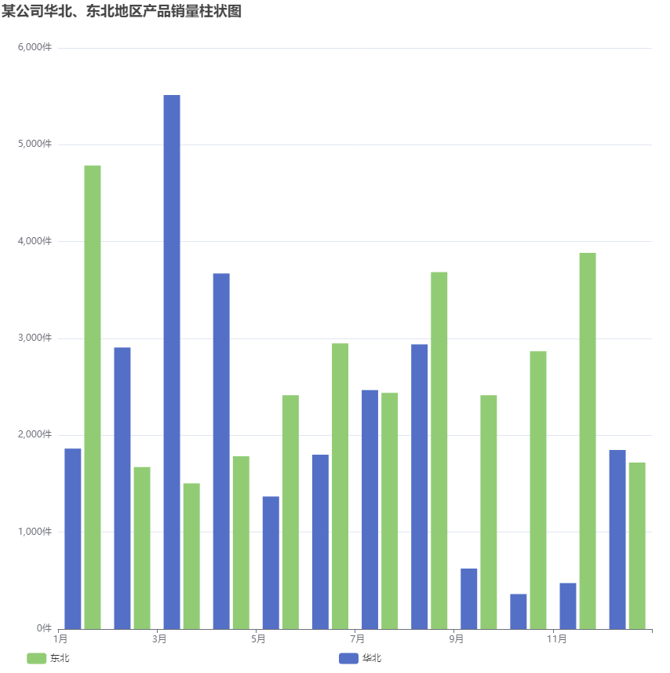
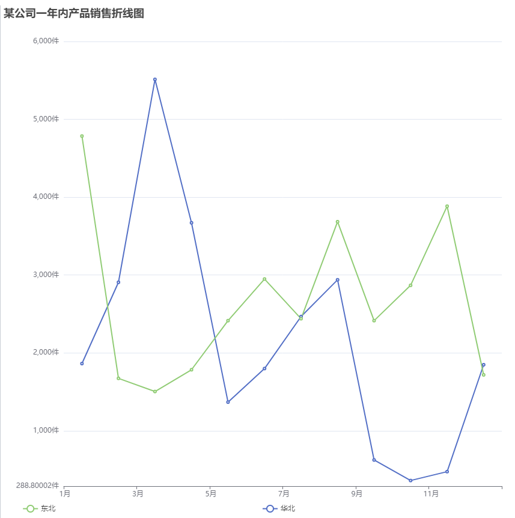
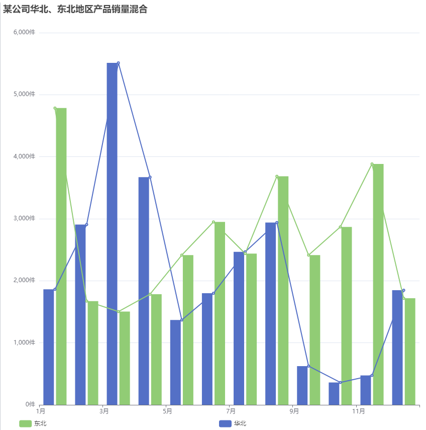
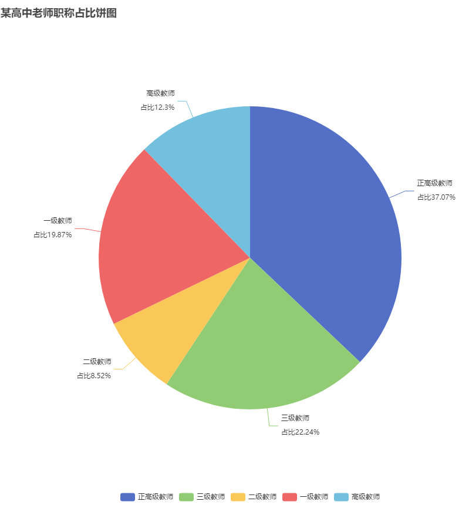
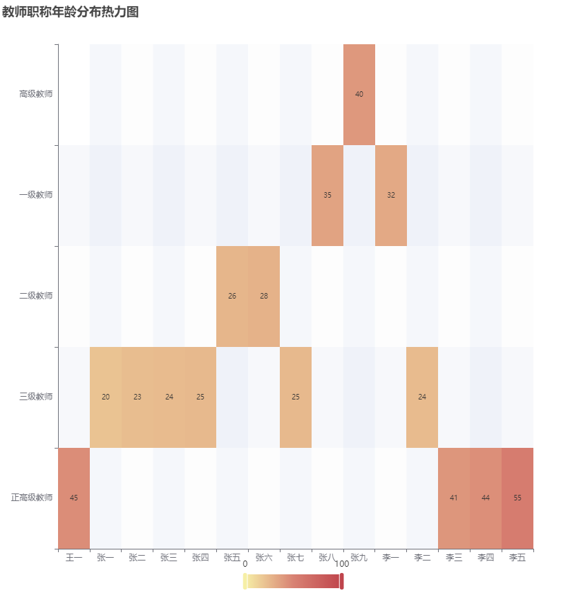
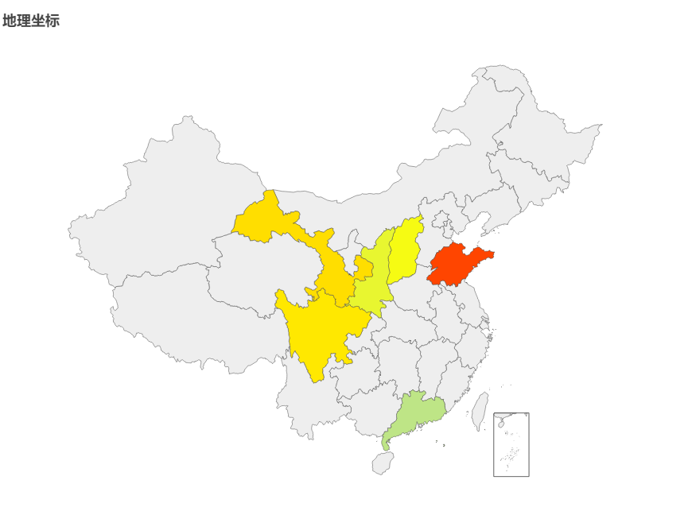
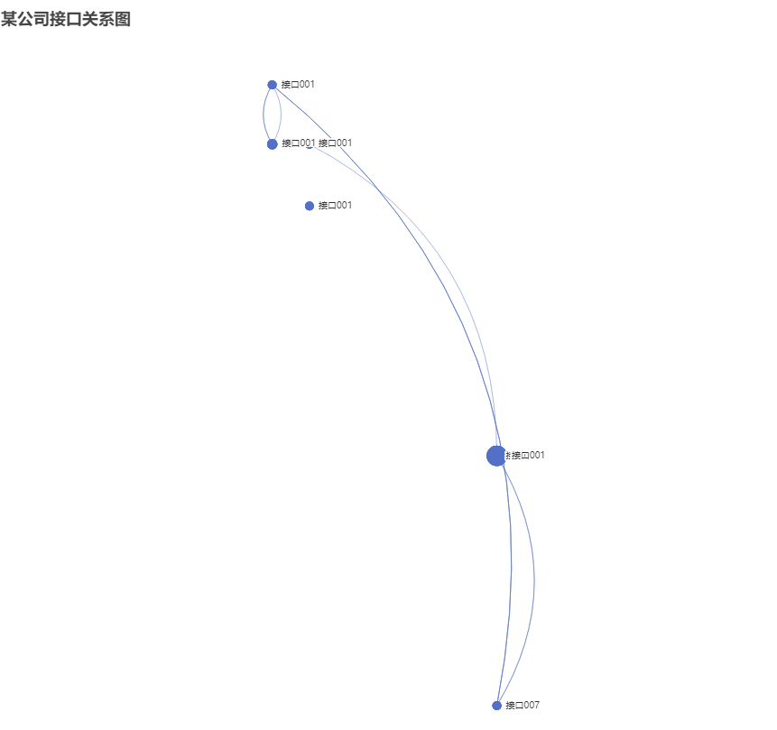

版权所有 © 2023  openGauss社区
 您对“本文档”的复制、使用、修改及分发受知识共享(Creative Commons)署名—相同方式共享4.0国际公共许可协议(以下简称“CC BY-SA 4.0”)的约束。为了方便用户理解，您可以通过访问https://creativecommons.org/licenses/by-sa/4.0/ 了解CC BY-SA 4.0的概要 (但不是替代)。CC BY-SA 4.0的完整协议内容您可以访问如下网址获取：https://creativecommons.org/licenses/by-sa/4.0/legalcode。

修订记录

| 日期       | 修订   版本 | 修改描述     | 作者        |
| :--------- | ----------- | ------------ | ----------- |
| 2023-03-10 | 1.0         | 特性测试报告 | houshaolong |

 关键词： 

DataShowGUI、可视化数据

 摘要：

基于WEB开发openGauss的数据流可视化编辑工具，实现零编程数据建模，通过拖拽、连接的方式完成简单的数据流设计。通过构建不同的数据流实例，并使用一体化平台中管理的数据库实例作为数据源，支持每一步节点的数据调试、生成图表及分享，可以快速方便的对各个业务库进行测试、数据采集、报表生成。

随着openGauss开源数据库的逐渐普及，有许多新用户可能由于语法差异、学习成本等原因放弃尝试。本特性希望让任何没有实际使用过openGauss的用户都可以通过平台快速完成数据操作体验，降低其上手难度，从而提升用户的兴趣度和深入探索的可能性。

缩略语清单：

| 缩略语 | 英文全名 | 中文解释 |
| ------ | -------- | -------- |
| N/A    |          |          |

# 1     特性概述

1. 可视化编辑，提供拖拽、连线的操作方式完成数据流算子的组装、配置，并根据算子组合生成对应的sql及运行结果。
1. 实时图表生成，支持读取单步算子执行结果为用户生成自定义图表，并可以记录快照。
1. 可将一个或多个图表快照通过自由排布的方式构建报表，并可通过外链分享给用户。

# 2     特性测试信息

被测对象的版本信息：

| 版本名称       | 测试起始时间 | 测试结束时间 |
| -------------- | :----------- | ------------ |
| base-ops 1.0.5 | 2023-1-11    | 2023-1-29    |
| base-ops 1.0.5 | 2023-1-30    | 2023-2-10    |
| base-ops 1.0.5 | 2023-2-11    | 2023-2-23    |
| base-ops 1.0.5 | 2023-2-24    | 2023-3-14    |
| base-ops 1.0.6 | 2023-3-15    | 2023-3-23    |

环境信息：

| Windows信息       | 配置信息                                                     | 备注 |
| ----------------- | ------------------------------------------------------------ | ---- |
| Windows 10 专业版 | 处理器：intel(R) Xeon(R) Gold 6278C CPU @2.6GHz 内存：298GB 已安装的内存：16.0GB |      |

# 3     测试结论概述

## 3.1   测试整体结论

openGauss数据建模项目测试报告，共执行用例272个，提交问题单50个，无遗留风险，整体质量良好。

| 测试活动     | 活动评价                                                     |
| ------------ | ------------------------------------------------------------ |
| 安装卸载插件 | 安装和卸载base-ops插件，测试通过                             |
| 功能测试     | 数据流列表展示：使用搜索，分页、修改、删除功能，测试通过     |
| 功能测试     | 数据流工作区算子管理：算子进行搜索，复制、剪贴、粘贴、删除功能，测试通过 |
| 功能测试     | 数据流工作区快捷操作栏：数据流快捷操作区测试，保存、放大、缩小、居中、撤销、恢复、删除、导入、导出按钮可以正常使用，撤销、恢复在优化后可正常使用，测试通过 |
| 功能测试     | 数据流预览及运行结果：，通过多个不同的算子组合用例，对测试数据库进行运行结果查看，经过比对得到的SQL语句和查询结果符合预期，测试通过 |
| 功能测试     | 数据流可视化图表生成：对不同算子组合结果进行可视化配置，对比配置信息及预览生成的图表内容，符合预期，测试通过 |
| 功能测试     | 报表生成及分享：对若干已经生成的快照进行自由布局组合，构建报表后生成分享链接并点击，用户可正常访问并看到一致的报表信息，测试通过 |
| 兼容性测     | 在不同的主流浏览器上访问操作页面，测试通过                   |
| 易操作性测试 | 页面布局合理，按键标识明显，操作较方便，测试通过             |
| 资料测试     | 资料描述准确，示例完整，可正确操作，格式正确，测试通过       |

## 3.2   约束说明

1.本特性所处一体化环境中需存在可用数据库实例。

2. 本特性所处的主机对建立远程连接的数据库需配置白名单，且连接的用户不能为初始用户。

3.目标数据库指定的schema中存在业务表。

## 3.3   遗留问题分析

### 3.3.1  遗留问题影响以及规避措施

| 问题单号 | 问题描述 | 问题级别 | 问题影响和规避措施 | 当前状态 |
| -------- | -------- | -------- | ------------------ | -------- |
| N/A      |          |          |                    |          |

### 3.3.2  问题统计

|        | 问题总数 | 严重 | 主要  | 次要 | 不重要 |
| ------ | -------- | ---- | ----- | ---- | ------ |
| 数目   | 49       | 0    | 8     | 40   | 1      |
| 百分比 | 100%     | 0%   | 22.2% | 75%  | 2.8%   |

### 3.3.3  问题单汇总

| 序号 | issue号                                                      | 问题级别 | 问题简述                                                     | 问题状态 |
| ---- | ------------------------------------------------------------ | :------- | :----------------------------------------------------------- | -------- |
| 1    | [I6AFES](https://e.gitee.com/opengaussorg/issues/table?issue=I6AFES) | 主要     | 执行sh install.sh部署环境时，输入数据库密码时密码明文显示    | 已验收   |
| 2    | [I6AG5A](https://e.gitee.com/opengaussorg/issues/table?issue=I6AG5A) | 主要     | 执行sh install.sh 脚本，java版本没有自动升级到java11         | 已验收   |
| 3    | [I6C9OL](https://e.gitee.com/opengaussorg/issues/table?issue=I6C9OL) | 主要     | 集群标识不同，多次导入同一个已安装的数据库，均能导入成功，运维界面应该提供删除集群信息的功能 | 已验收   |
| 4    | [I6AQH9](https://e.gitee.com/opengaussorg/issues/table?issue=I6AQH9) | 主要     | 数据建模部分，需要点击修改才能进去下一轮操作，逻辑不合理     | 已验收   |
| 5    | [I6B3LX](https://e.gitee.com/opengaussorg/issues/table?issue=I6B3LX) | 主要     | 数据建模资料可用性不高，建议优化                             | 已验收   |
| 6    | [I6EDK1](https://e.gitee.com/opengaussorg/issues/table?issue=I6EDK1) | 主要     | 插入算子输入框字符限制为140不合理，而且插入文本类型时，插入失败，未对文本类型默认添加引号 | 已验收   |
| 7    | [I6EFW6](https://e.gitee.com/opengaussorg/issues/table?issue=I6EFW6) | 主要     | 插入算子插入数据时，数据顺序解析错误，插入数据失败           | 已验收   |
| 8    | [I6G1OG](https://e.gitee.com/opengaussorg/issues/table?issue=I6G1OG) | 主要     | DataKit安装的数据库，新建数据流时默认访问数据库只能选择postgres下的gaussdb模式下的表数据，不能选择其他模式或者数据库的表数据 | 已验收   |
| 9    | [I6AOR0](https://e.gitee.com/opengaussorg/issues/table?issue=I6AOR0) | 次要     | 安装部署，集群安装时选择轻量版，安装模式选择导入，导入om安装的数据库成功 | 已完成   |
| 10   | [I6AQ1B](https://e.gitee.com/opengaussorg/issues/table?issue=I6AQ1B) | 次要     | 数据量详情页面，不同功能，使用同一个图标                     | 已验收   |
| 11   | [I6AUF3](https://e.gitee.com/opengaussorg/issues/table?issue=I6AUF3) | 次要     | 业务开发模块，黑夜模式和白天模式切换后，不生效，需要刷新页面才能生效 | 已验收   |
| 12   | [I6AWBZ](https://e.gitee.com/opengaussorg/issues/table?issue=I6AWBZ) | 次要     | 业务设计-数据流设计-数据流详情页面，插入算子执行结果却显示update成功 | 已验收   |
| 13   | [I6AWVG](https://e.gitee.com/opengaussorg/issues/table?issue=I6AWVG) | 次要     | 一体化平台点击太阳/月亮图标切换页面颜色的时候，鼠标悬浮在图标上应该要有对应提示 | 已验收   |
| 14   | [I6C8YY](https://e.gitee.com/opengaussorg/issues/table?issue=I6C8YY) | 次要     | 问题描述：数据流详情页-点击算子上的可视化按钮，可视化页面关闭弹框位置需要优化 | 已验收   |
| 15   | [I6C9A3](https://e.gitee.com/opengaussorg/issues/table?issue=I6C9A3) | 次要     | 安装包管理页面，新增版本号为3.1.1的安装包信息，安装轻量版成功后，运维界面版本号依旧为3.0.0 | 已验收   |
| 16   | [I6CFYJ](https://e.gitee.com/opengaussorg/issues/table?issue=I6CFYJ) | 次要     | 一体化资料未说明一体化平台卸载之后，平台初始数据库保存的数据未处理，需要说明平台保存的数据要如何处理 | 已验收   |
| 17   | [I6DLYQ](https://e.gitee.com/opengaussorg/issues/table?issue=I6DLYQ) | 次要     | 数据流详情页算子间连线颜色太浅，视觉效果不明显               | 已验收   |
| 18   | [I6DVPR](https://e.gitee.com/opengaussorg/issues/table?issue=I6DVPR) | 次要     | 数据建模可视化图表页面，UI设计不合理需要完善                 | 已验收   |
| 19   | [I6DW7D](https://e.gitee.com/opengaussorg/issues/table?issue=I6DW7D) | 次要     | 数据建模可视化图表，关系图页面未配置信息时，点击预览，页面提示信息有误 | 已验收   |
| 20   | [I6DYXC](https://e.gitee.com/opengaussorg/issues/table?issue=I6DYXC) | 次要     | 数据流设计页面搜索栏placehoder支持搜索哪些信息不明确，数据流列表没有批量删除功能 | 已验收   |
| 21   | [I6E2SE](https://e.gitee.com/opengaussorg/issues/table?issue=I6E2SE) | 次要     | 数据可视化页面，数据配置选择项限制太多                       | 已验收   |
| 22   | [I6EDPA](https://e.gitee.com/opengaussorg/issues/table?issue=I6EDPA) | 次要     | 数据建模可视化图表，热力图页面未配置信息时，点击预览，无提示信息 | 已验收   |
| 23   | [I6EEMP](https://e.gitee.com/opengaussorg/issues/table?issue=I6EEMP) | 次要     | 数据建模工作区，右键算子名称，只有剪贴，没有粘贴             | 已验收   |
| 24   | [I6EF1X](https://e.gitee.com/opengaussorg/issues/table?issue=I6EF1X) | 次要     | 数据流测试数据可视化，选择混合图时，柱状图和折线图颜色一样，不方便区分 | 已验收   |
| 25   | [I6EFYQ](https://e.gitee.com/opengaussorg/issues/table?issue=I6EFYQ) | 次要     | 勾选算子前面复选框之后，算子功能依然回生效                   | 已验收   |
| 26   | [I6FBV5](https://e.gitee.com/opengaussorg/issues/table?issue=I6FBV5) | 次要     | 数据流测试数据可视化，选择饼图时，选择显示百分比选项，未显示百分比 | 已验收   |
| 27   | [I6FU9R](https://e.gitee.com/opengaussorg/issues/table?issue=I6FU9R) | 次要     | 数据流测试数据可视化，选择关系图，填写相关配置后，点击预览，出现乱码报错 | 已验收   |
| 28   | [I6FZNU](https://e.gitee.com/opengaussorg/issues/table?issue=I6FZNU) | 次要     | 数据流测试数据可视化，当切换表名时，保存的前一张表的信息依旧存在，点击预览，页面无错误提示 | 已验收   |
| 29   | [I6GC0S](https://e.gitee.com/opengaussorg/issues/table?issue=I6GC0S) | 次要     | 条件算字筛选条件选择为空或者非空时，sql执行语句不生效        | 已验收   |
| 30   | [I6GEVE](https://e.gitee.com/opengaussorg/issues/table?issue=I6GEVE) | 次要     | 数据流测试数据可视化，选择地理坐标图，填写其他配置，不填写经纬度偏移、缩放比例时，点击预览出现乱码 | 已验收   |
| 31   | [I6GNDA](https://e.gitee.com/opengaussorg/issues/table?issue=I6GNDA) | 次要     | 数据流详情页，排序算子，条件选择为降序、中文拼音降序时，SQL解析错误 | 已验收   |
| 32   | [I6GQEQ](https://e.gitee.com/opengaussorg/issues/table?issue=I6GQEQ) | 次要     | 数据流详情页，聚合算子在别名框不输入内容时，点击运行直接报语法错误，而不是提示配置项不完整 | 已验收   |
| 33   | [I6HB79](https://e.gitee.com/opengaussorg/issues/table?issue=I6HB79) | 次要     | 新建数据流时，没有进行同名校验，标题栏主要类型列无意义       | 已验收   |
| 34   | [I6HDJC](https://e.gitee.com/opengaussorg/issues/table?issue=I6HDJC) | 次要     | 数据流设计详情页，各个图表的配置项，未说明哪些选项必选，哪些非必选 | 已验收   |
| 35   | [I6HJXE](https://e.gitee.com/opengaussorg/issues/table?issue=I6HJXE) | 次要     | 表中如果存在空数据，生成可视化图表时报错                     | 已验收   |
| 36   | [I6J0TH](https://e.gitee.com/opengaussorg/issues/table?issue=I6J0TH) | 次要     | 地理坐标图例不显高亮显示数据中的地理位                       | 已验收   |
| 37   | [I6K622](https://e.gitee.com/opengaussorg/issues/table?issue=I6K622) | 次要     | 保存配置项隐藏时，隐藏按钮和图表名称重叠                     | 已验收   |
| 38   | [I6K6T1](https://e.gitee.com/opengaussorg/issues/table?issue=I6K6T1) | 次要     | 统计维度只统计前面指定的数据时，X轴依旧会展示后面数据        | 已验收   |
| 39   | [I6KAX5](https://e.gitee.com/opengaussorg/issues/table?issue=I6KAX5) | 次要     | 柱状图，折线图，混合图，统计维度是非必选，但未选择统计维度时，点击预览报错 | 已验收   |
| 40   | [I6KPY5](https://e.gitee.com/opengaussorg/issues/table?issue=I6KPY5) | 次要     | 折线图显示数据不完整                                         | 已验收   |
| 41   | [I6KQQ1](https://e.gitee.com/opengaussorg/issues/table?issue=I6KQQ1) | 次要     | 热力图热力范围不生效                                         | 已验收   |
| 42   | [I6IL2Z](https://e.gitee.com/opengaussorg/issues/table?issue=I6IL2Z) | 次要     | 限条算子“跳过前“配置后执行不生效                             | 已验收   |
| 43   | [I6IL1Q](https://e.gitee.com/opengaussorg/issues/table?issue=I6IL1Q) | 次要     | 算子绘制混合图，选择折线 ，显示的是柱状                      | 已验收   |
| 44   | [I6IKXY](https://e.gitee.com/opengaussorg/issues/table?issue=I6IKXY) | 次要     | 柱状图Y轴配置中类型是非必选，但是不选画出的图不正确          | 已验收   |
| 45   | [I6IKTS](https://e.gitee.com/opengaussorg/issues/table?issue=I6IKTS) | 次要     | 插入算子针对int类型插入null值会识别为字符串，插入失败        | 已验收   |
| 46   | [I6I8Z4](https://e.gitee.com/opengaussorg/issues/table?issue=I6I8Z4) | 次要     | 配置算子时，字段配置不会自动展开                             | 已验收   |
| 47   | [I6I8C2](https://e.gitee.com/opengaussorg/issues/table?issue=I6I8C2) | 次要     | 没有删除报表选项                                             | 已验收   |
| 48   | [I6N0HL](https://e.gitee.com/opengaussorg/issues/table?issue=I6N0HL) | 次要     | base-ops插件，升级后插件图标显示异常                         | 已完成   |
| 49   | [I6NQFE](https://gitee.com/opengauss/openGauss-workbench/issues/I6NQFE?from=project-issue) | 次要     | 折线图纵坐标起点范围不合理                                   | 已完成   |
| 50   | [I6DZ70](https://e.gitee.com/opengaussorg/issues/table?issue=I6DZ70) | 不重要   | 数据流设计页面，按键名称和点击按键弹框后名称不一致           | 已验收   |

# 4     测试执行

## 4.1.1安装卸载插件

| 测试步骤：                                                   | 测试结果                           |
| ------------------------------------------------------------ | ---------------------------------- |
| 1.编译插件 2.打开插件管理页面点击安装插件 3.上传本插件安装包点击确定 4.上传更高版本的插件 5.卸载插件<br/ | 执行4条用例，发现bug 2个，验收通过 |

## 4.1.2    数据流列表展示

| 测试步骤：                                              | 测试结果                            |
| ------------------------------------------------------- | ----------------------------------- |
| 1.  添加大于50条的数据流实例 2. 使用搜索、分页功能 | 执行10条用例，发现bug 1个，验收通过 |

## 4.1.3     数据流工作区算子管理

| 测试步骤                                                     | 测试结果                            |
| ------------------------------------------------------------ | ----------------------------------- |
| 1.进入数据流管理列表页 2.点击某条数据流的修改按钮进入数据流详情页 3.搜索算子菜单 4.剪贴算子菜单 5.粘贴算子菜单 6.复制算子菜单 7.删除算子菜单 8.关闭算子菜单 | 执行20条用例，发现bug 2个，验收通过 |

## 4.1.4   数据流工作区快捷操作栏

| 测试步骤                                                     | 测试结果                            |
| ------------------------------------------------------------ | ----------------------------------- |
| 1.进入数据流管理列表页 2.点击某条数据流的修改按钮进入数据流详情页 3.拖入算子/连线并进行操作 4.点击撤销按钮 5.点击恢复按钮 6.点击放大按钮 7.点击缩小按钮 8.点击居中按钮 9.点击保存按钮 8.点击导入按钮 9.点击导出按钮 | 执行28条用例，发现bug 2个，验收通过 |

## 4.1.5  数据流预览及运行结果

| 测试步骤                                                     | 测试结果                            |
| ------------------------------------------------------------ | ----------------------------------- |
| 1.进入数据流管理列表页 2.点击某条数据流的修改按钮进入数据流详情页 3.点击查看代码按钮 4.点击运行按钮 | 执行32条用例，发现bug 2个，验收通过 |

## 4.1.6 数据流可视化图表生成

| 测试步骤                                                     | 测试结果                             |
| ------------------------------------------------------------ | ------------------------------------ |
| 1.点击数据流修改按钮进入详情页 2.点击算子上的可视化按钮 3.新建柱状图并填写配置信息，点击预览 4.新建折线图并填写配置信息，点击预览 5.新建混合图并填写配置信息，点击预览 6.新建热力图并填写配置信息，点击预览 7.新建地理图并填写配置信息，点击预览 8.新建饼图并填写配置信息，点击预览 9.新建关系图并填写配置信息，点击预览 | 执行62条用例，发现bug 23个，验收通过 |

## 4.1.7  数据流算子连线及配置规则

| 测试步骤                                                     | 测试结果                              |
| ------------------------------------------------------------ | ------------------------------------- |
| 1.已经新建好空白数据流。 2.拖入各类算子 3.按照用例对算子进行连接 4.对算子参数进行配置 5.点击运行按钮 | 执行103条用例，发现bug 14个，验收通过 |

## 4.1.8  报表生成及分享

| 测试步骤                                                     | 测试结果                            |
| ------------------------------------------------------------ | ----------------------------------- |
| 1.点击数据流修改按钮进入详情页 2.点击可视化按钮 3.在弹窗中切换到报表页，查看报表 4.点击分享按钮 5.复制分享链接并打开 | 执行10条用例，发现bug 1个，验收通过 |

## 4.1.9  兼容性测试

| 测试步骤                                                     | 测试结果                         |
| ------------------------------------------------------------ | -------------------------------- |
| 1.使用chrome浏览器访问各主要页面，观察显示及功能 2.使用IE11浏览器访问各主要页面，观察显示及功能 3.使用Edge浏览器访问各主要页面，观察显示及功能 4.使用QQ浏览器浏览器访问各主要页面，观察显示及功能 5.使用Safari浏览器访问各主要”页面，观察显示及功能 | 执行1条用例，未发现bug，验收通过 |

## 4.1.10  易用性测试

| 测试步骤                                                 | 测试结果                           |
| -------------------------------------------------------- | ---------------------------------- |
| 1.关注功能是否简单易上手，操作是否便利，页面布局是否合理 | 执行1条用例，发现bug 1个，验收通过 |

## 4.1.11  资料测试

| 测试步骤                                 | 测试结果                           |
| ---------------------------------------- | ---------------------------------- |
| 1.检查资料是否描述准确，示例是否清晰完整 | 执行1条用例，发现bug 2个，验收通过 |

## 4.1.12  后续测试建议

1.关注UI界面优化之后，页面风格需要美观统一

2.从用户体验方面出发，按键及操作流程要简单易上手

## 4.2   测试执行统计数据

| 版本名称       | 测试用例数 | 用例执行结果                  | 发现问题单数 |
| -------------- | ---------- | ----------------------------- | ------------ |
| base-ops 1.0.5 | 163        | Passed： 143  Failed：20 | 16           |
| base-ops 1.0.5 | 228        | Passed：200   Failed：28 | 25           |
| base-ops 1.0.5 | 260        | Passed：252 Failed：8    | 8            |
| base-ops 1.0.5 | 272        | Passed：270 Failed：2    | 2            |
| base-ops 1.0.5 | 272        | Passed：272 Failed：0    | 0            |

*数据项说明：*

* 累计发现缺陷单50个，其中50个缺陷均已解决且回归通过
* 失败用例已在后续问题修复后，回归issue执行通过
* 缺陷密度：50(缺陷个数)/30.977kloc(代码行数)=1.61(个/kloc)

# 5     附件

1.柱状图图例

2.折线图

3.混合图图例

4.饼图

5.热力图

6.地理坐标

7.关系图

