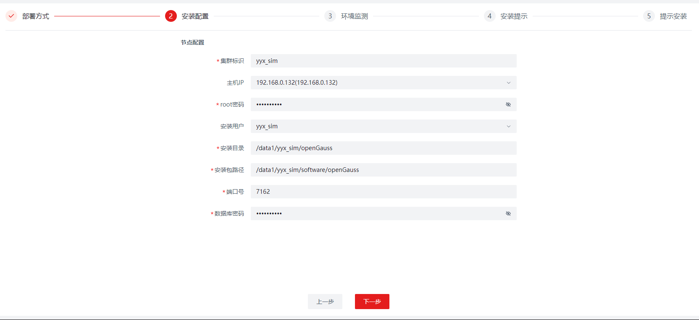
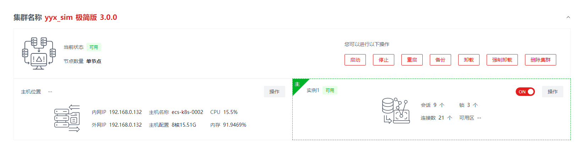

版权所有 © 2023  openGauss社区
 您对“本文档”的复制、使用、修改及分发受知识共享(Creative Commons)署名—相同方式共享4.0国际公共许可协议(以下简称“CC BY-SA 4.0”)的约束。为了方便用户理解，您可以通过访问https://creativecommons.org/licenses/by-sa/4.0/ 了解CC BY-SA 4.0的概要 (但不是替代)。CC BY-SA 4.0的完整协议内容您可以访问如下网址获取：https://creativecommons.org/licenses/by-sa/4.0/legalcode。

修订记录

| 日期      | 修订   版本 | 修改描述               | 作者        |
| :-------- | ----------- | ---------------------- | ----------- |
| 2023-3-13 | 1.0         | 特性测试报告初稿完     | yangyixiang |
| 2023-6-7  | 1.1         | 增加新添加特性测试结论 | yangyixiang |

 关键词： 

openGauss、datakit、一体化、portal、可视化迁移

摘要：

本文档主要介绍一体化平台基座openGauss-visualtool及基础运维插件Base-Ops和M*迁移工具插件的测试结果。

缩略语清单：

| 缩略语 | 英文全名 | 中文解释 |
| ------ | -------- | -------- |
| 无     |          |          |

# 1     特性概述

- 基于openGauss可视化运维平台集成数据建模平台
- 基于openGauss可视化运维平台联调M*数据迁移工具
- 基于openGauss可视化运维平台联调数据校验工具
- 基于openGauss可视化运维平台联调分布式
- 支持插件的安装，卸载，升级，图标自定义，二级菜单
- 日志中心，管理datakit自身与各自插件的日志
- 安全中心，管理用户权限，适用于datakit本身和插件的权限控制
- 用户管理，支持登录、用户权限管理，适用于datakit本身和插件的权限控制
- datakit本身支持国际化，黑白两种主题换肤
- 新增物理机管理能力，可以接入用户的实例机器
- 新增mysql jdbc管理能力，可以管理用户M*的jdbc
- 支持openGauss实例导入功能
- datakit本身支持一键部署。适配openEuler aarch64及x86_x64系统、centos x86系统
- 运维支持备份恢复功能
- 数据建模支持业务报表能力
- 新增数据库日志管理功能和自定义控制台可以登录物理机器进行运维

# 2     特性测试信息

| 版本名称                                                     | 测试起始时间 | 测试结束时间 |
| ------------------------------------------------------------ | ------------ | ------------ |
| openGauss-visualtool base-ops 1.0.5 openGauss 5.0.0 Chrome 111.0.5563.64 Firefox 18.5.0.0 | 2023-1-11    | 2023-1-29    |
| openGauss-visualtool base-ops 1.0.5 openGauss 5.0.0 Chrome 111.0.5563.64 Firefox 18.5.0.0 | 2023-1-30    | 2023-2-10    |
| openGauss-visualtool base-ops 1.0.5 openGauss 5.0.0 Chrome 111.0.5563.64 Firefox 18.5.0.0 | 2023-2-11    | 2023-2-23    |
| openGauss-visualtool base-ops 1.0.5 openGauss 5.0.0 Chrome 111.0.5563.64 Firefox 18.5.0.0 | 2023-2-24    | 2023-3-14    |
| openGauss-visualtool base-ops 1.0.6 openGauss 5.0.0 Chrome 111.0.5563.64 Firefox 18.5.0.0 | 2023-3-15    | 2023-3-23    |
| openGauss-visualtool base-ops 5.0.0 data-migration M* 5.7.41 openGauss 5.1.0 Chrome 111.0.5563.64 Firefox 18.5.0.0 | 2023-4-24    | 2023-5-10    |
| openGauss-visualtool base-ops 5.0.0 data-migration M* 5.7.41 openGauss 5.1.0 Chrome 111.0.5563.64 Firefox 18.5.0.0 | 2023-5-11    | 2023-5-24    |
| openGauss-visualtool base-ops 5.0.0 data-migration M* 5.7.41 openGauss 5.1.0 Chrome 111.0.5563.64 Firefox 18.5.0.0 | 2023-5-25    | 2023-5-31    |
| openGauss-visualtool base-ops 5.0.0 data-migration M* 5.7.41 openGauss 5.1.0 Chrome 111.0.5563.64 Firefox 18.5.0.0 | 2023-6-1     | 2023-6-7     |
| openGauss-visualtool base-ops 5.0.0 data-migration M* 5.7.41 openGauss 5.1.0 Chrome 111.0.5563.64 Firefox 18.5.0.0 | 2023-6-8     | 2023-6-30    |

| 硬件型号      | 硬件配置信息                                                 | 备注 |
| ------------- | ------------------------------------------------------------ | ---- |
| x86+centOS    | Intel(R) Xeon(R) Platinum 8378A CPU @ 3.00GHz 8核 内存：30GB 硬盘：59G OS：CentOS Linux release 7.6.1810 (Core) |      |
| x86+centOS    | Intel(R) Xeon(R) Gold 6278C CPU @ 2.60GHz 8核 内存：15GB 硬盘：197G OS：CentOS Linux release 7.6.1810 (Core) |      |
| x86+centOS    | Intel(R) Xeon(R) Gold 6161 CPU @ 2.20GHz 8核 内存：15GB 硬盘：197G OS：CentOS Linux release 7.6.1810 (Core) |      |
| x86+centOS    | Intel(R) Xeon(R) Gold 6278C CPU @ 2.60GHz 8核 内存：15GB 硬盘：197G OS：CentOS Linux release 7.6.1810 (Core) |      |
| x86+openEuler | Intel(R) Xeon(R) Gold 6266C CPU @ 3.00GHz 8核 内存：15GB 硬盘：98G OS：openEuler release 20.03 (LTS-SP1) |      |
| x86+openEuler | Intel(R) Xeon(R) Gold 6266C CPU @ 3.00GHz 8核 内存：15GB 硬盘：98G OS：openEuler release 20.03 (LTS-SP1) |      |
| x86+openEuler | Intel(R) Xeon(R) Gold 6266C CPU @ 3.00GHz 8核 内存：15GB 硬盘：98G OS：openEuler release 20.03 (LTS-SP1) |      |
| arm+openEuler | Kunpeng-920 8核 内存：62GB 硬盘：492G OS：openEuler release 20.03 (LTS-SP3) |      |

# 3     测试结论概述

## 3.1   测试整体结论

一体化平台基座openGauss-visualtool及基础运维插件Base-Ops、迁移插件 data-migration，共计执行637条用例，主要覆盖了功能测试、可靠性测试、兼容性测试、易用性测试、资料测试。功能测试覆盖首页、资源中心、安装部署、基础运维、数据迁移、插件管理、安全中心、日志中心、平台基础功能，资料测试覆盖校验资料的描述及示例的执行结果是否成功。累计发现缺陷单98个，91个缺陷均已解决且回归通过，7个缺陷未解决。业务建模的测试结论详见单独的测试报告[《openGauss数据建模项目测试报告》](https://gitee.com/opengauss/QA/blob/master/Test_Result/openGauss_5.0.0_release/%E5%B7%A5%E5%85%B7%E9%93%BE/openGauss%E6%95%B0%E6%8D%AE%E5%BB%BA%E6%A8%A1%E9%A1%B9%E7%9B%AE%E6%B5%8B%E8%AF%95%E6%8A%A5%E5%91%8A.md)。

| 测试活动   | 活动评价                                                     |
| ---------- | :----------------------------------------------------------- |
| 功能测试   | 首页：验证集群一键自检功能及集群信息展示。验证业务流、数据流、数据模型、已安装插件、数据流分布、数据源类型分布信息展示。验证跳转Tab页功能。测试通过 |
| 功能测试   | 资源中心：验证实例管理功能添加、修改、删除、查询实例。验证服务器管理功能添加、修改、删除、查询服务器、管理用户、管理标签。验证AZ管理功能添加、修改、删除、查询AZ。验证集群管理功能对集群进行启动、停止、重启、备份、卸载、强制卸载、删除集群操作，对实例进行启动、停止、重启、主备切换、生成配置、节点重建操作，以及集群信息展示、一键自检功能。验证OpenLooKeng管理功能对openLooKeng集群进行查看、启动、停止、删除、销毁操作及下载操作日志。测试通过。 |
| 功能测试   | 安装部署：验证一键安装openGauss极简版功能。验证集群安装的安装和导入极简版、轻量版、企业版openGauss以及部署openLooKeng的功能。测试通过。 |
| 功能测试   | 基础运维：验证集群监控实时显示集群资源信息功能。验证日志分析功能对系统日志、操作日志、审计日志、性能日志、黑匣子日志进行查询、下载。验证WDR报告功能创建、搜索快照，创建、查询、查看、下载、删除WDR报告。验证SQL诊断功能显示当前主机SQL诊断信息。验证安装包管理功能新增、修改、删除、查询在线安装包和离线安装包。验证自定义控制台打开多个主机终端功能。验证备份恢复功能查询、恢复、删除集群备份。测试通过。 |
| 功能测试   | 数据迁移：验证离线迁移任务、在线迁移任务的创建、修改、启动、结束、删除、重置，验证多任务并行执行、参数配置生效、过程打印、结果和性能展示、迁移日志下载，验证迁移套件的在线安装、离线安装、卸载。测试通过。 |
| 功能测试   | 插件管理：验证插件的安装、卸载、升级、查询、启动、停用，验证拒绝安装非法插件。测试通过。 |
| 功能测试   | 安全中心：验证账号管理功能查询、添加、修改、删除、启用、停用账号，重置账号密码。验证角色与权限功能添加、修改、删除、查询、启用、停用角色。验证访问白名单功能添加、修改、删除、查询白名单。测试通过。 |
| 功能测试   | 日志中心：验证系统日志功能查询、下载日志，设置日志输出级别、保留天数、单个日志文件大小、最大占用空间。验证操作日志功能查询日志、查看日志详情。测试通过。 |
| 功能测试   | 平台基础功能：验证登录页面功能、中英文切换、黑白主题切换、个人中心编辑个人信息、修改密码、修改系统设置、平台自身一键部署。测试通过。 |
| 可靠性测试 | 验证使用sysbench压测数据，数据迁移多任务是否可正常执行。迁移中注入故障、kill迁移任务和数据库相关进程，迁移页面是否可以反馈异常。测试通过。 |
| 兼容性测试 | 验证在chrome浏览器、firefox浏览器上的使用，网页元素位置是否混乱、错位，页面的格式，字体，输入框，下拉框，复选框， 按钮是否正常显示。Datakit自身适配openEuler aarch64及x86_x64、centos x86_x64。测试通过。 |
| 易用性测试 | 检查web页面的布局、UI设计是否合理，操作顺序是否符合逻辑。测试通过。 |
| 资料测试   | 校验资料的描述及示例的执行结果是否成功。测试通过。           |

## 3.2   约束说明

-  当前平台运行依赖于openJdk11。

-  平台使用的数据库，当前仅支持openGauss数据库，并且需要提前创建database。

-  需要将部署服务器IP配置在平台使用的数据库（openGauss）的白名单列表中。

-  平台默认的登录账号密码：admin/admin123，请在首次登录后及时修改密码。

-  源数据库M*需要开启复制功能，在配置中增加以下配置参数，并重启：

  > binlog_format= ROW
  >
  > binlog_row_image=FULL
  >
  > enforce_gtid_consistency=ON
  >
  > gtid_mode=ON

- 反向迁移功能需要在openGauss数据库增加如下配置，并重启：

  > 调整pg_hba.conf以允许复制（这里的值取决于实际的网络配置以及用于连接的用户）
  >
  > host replication repuser 0.0.0.0/0 sha256
  >
  > 调整guc参数：
  >
  > - alter system set ssl to on;
  > - alter system set wal_level to logical;
  > - alter system set enable_thread_pool to off;

-  为确认数据的顺利迁移，源端数据库（Mysql）的数据源添加时，请添加具备数据库读写权限的用户。
-  通过Datakit平台安装的源端数据库（openGauss）可以直接迁移，导入的数据库以及在创建任务时添加的自定义openGauss数据源，需要提前将用户权限改为SYSADMIN角色 。
-  迁移任务是在非root用户下执行，任务的执行机器来源于平台资源中心的设备管理，因此需要在设备管理的用户管理中添加非root用户。

## 3.3   遗留问题分析

### 3.3.1 遗留问题影响以及规避措施

| 问题单号                                                     | 问题描述                                                     |
| ------------------------------------------------------------ | ------------------------------------------------------------ |
| [I78CPZ](https://gitee.com/opengauss/openGauss-workbench/issues/I78CPZ?from=project-issue) | 按照要求配置数据库后无法开启反向迁移                         |
| [I77PJT](https://gitee.com/opengauss/openGauss-workbench/issues/I77PJT?from=project-issue) | 点击启动反向后任务进度卡在反向迁移开始，结束迁移任务后，查看后台进程仍存在 |
| [I7DBER](https://gitee.com/opengauss/openGauss-workbench/issues/I7DBER?from=project-issue) | 创建迁移任务，分配执行机器，勾选已安装迁移套件的机器，再卸载迁移套件，任务仍可创建成功，启动后任务状态不正常 |
| [I79YUW](https://gitee.com/opengauss/openGauss-workbench/issues/I79YUW?from=project-issue) | 配置迁移任务参数，全局参数中增加规则数量后点击保存，再次打开全局参数，配置的规则消失 |
| [I6YSJZ](https://gitee.com/opengauss/openGauss-workbench/issues/I6YSJZ?from=project-issue) | 安装迁移套件，已安装的物理机没有删除迁移套件功能，安装失败的物理机没有取消安装并清理安装文件的功能 |
| [I6YRLI](https://gitee.com/opengauss/openGauss-workbench/issues/I6YRLI?from=project-issue) | 数据迁移，配置迁移过程参数未校验格式，导致迁移任务执行异常   |
| [I6YGR3](https://gitee.com/opengauss/openGauss-workbench/issues/I6YGR3?from=project-issue) | 数据迁移离线模式，迁移失败的表没有具体的报错信息             |

### 3.3.2 问题统计

|        | 问题总数 | 严重 | 主要 | 次要 | 不重要 |
| ------ | -------- | ---- | ---- | ---- | ------ |
| 数目   | 98 | 6    | 26 | 65 | 1     |
| 百分比 | 100% | 6%  | 27% | 66% | 1%    |

###  3.3.3 问题单汇总

| 序号 | issue号                                                      | 问题级别 | 问题简述                                                     | 问题状态 |
| ---- | ------------------------------------------------------------ | -------- | ------------------------------------------------------------ | -------- |
| 1    | [I6AEU0](https://gitee.com/opengauss/openGauss-workbench/issues/I6AEU0?from=project-issue) | 主要     | 集群安装选择离线安装，选择安装包目录时报错：System interface 400error | 已验收   |
| 2    | [I6AFFA](https://gitee.com/opengauss/openGauss-workbench/issues/I6AFFA?from=project-issue) | 次要     | 添加AZ时，信息填写错误只能关闭添加窗口不能重新填写           | 已验收   |
| 3    | [I6AFKA](https://gitee.com/opengauss/openGauss-workbench/issues/I6AFKA?from=project-issue) | 次要     | 登录后再次打开登录页面重新登录，出现报错：Request failed with status code 403 | 已验收   |
| 4    | [I6AFR7](https://gitee.com/opengauss/openGauss-workbench/issues/I6AFR7?from=project-issue) | 次要     | 集群安装选择非root用户安装后，环境检测仍提示安装用户不能为root并且可用内存检测不正确 | 已验收   |
| 5    | [I6AFZS](https://gitee.com/opengauss/openGauss-workbench/issues/I6AFZS?from=project-issue) | 主要     | 一体化平台无使用资料                                         | 已验收   |
| 6    | [I6AGC4](https://gitee.com/opengauss/openGauss-workbench/issues/I6AGC4?from=project-issue) | 主要     | 管理员用户重置其他用户密码未进行长度及格式校验               | 已验收   |
| 7    | [I6APZV](https://gitee.com/opengauss/openGauss-workbench/issues/I6APZV?from=project-issue) | 次要     | 集群安装选择导入数据库，步骤3环境监测提示操作系统与安装包不匹配，且安装用户和内存情况检测不正确。步骤4导入提示中XLOG目录路径与步骤2节点配置中填写的xlog路径不一致 | 已验收   |
| 8    | [I6AQ2F](https://gitee.com/opengauss/openGauss-workbench/issues/I6AQ2F?from=project-issue) | 主要     | 集群安装选择导入数据库，导入成功后数据库用户gaussdb没有密码，且集群运维无法检测到运行的实例 | 已验收   |
| 9    | [I6AQGM](https://gitee.com/opengauss/openGauss-workbench/issues/I6AQGM?from=project-issue) | 次要     | 新增可用区，AZ名可重复                                       | 已验收   |
| 10   | [I6ATQF](https://gitee.com/opengauss/openGauss-workbench/issues/I6ATQF?from=project-issue) | 严重     | 部署一体化平台失败，查看日志报错：nohup: failed to run command '/etc/jdk11/bin/java': No such file or directory | 已验收   |
| 11   | [I6ATV1](https://gitee.com/opengauss/openGauss-workbench/issues/I6ATV1?from=project-issue) | 次要     | 一体化平台安装部署资料不完整，未告知用户平台所用数据库需配置白名单 | 已验收   |
| 12   | [I6AUFP](https://gitee.com/opengauss/openGauss-workbench/issues/I6AUFP?from=project-issue) | 主要     | 物理机资源用户管理，修改用户可修改root，并且可将修改后的用户删除，删除后物理机不可用 | 已验收   |
| 13   | [I6AUN4](https://gitee.com/opengauss/openGauss-workbench/issues/I6AUN4?from=project-issue) | 次要     | 一体化平台使用资料实例操作描述不完整，未涉及主备切换、生成配置、节点重建操作 | 已验收   |
| 14   | [I6AYHA](https://gitee.com/opengauss/openGauss-workbench/issues/I6AYHA?from=project-issue) | 次要     | 自定义控制台输入命令的行数超过控制台窗口大小，将不能显示当前正在输入的命令 | 已验收   |
| 15   | [I6AYUD](https://gitee.com/opengauss/openGauss-workbench/issues/I6AYUD?from=project-issue) | 严重     | 一体化平台环境搭建资料未告知用户环境搭建成功后的初始用户名及密码，且第一次登录平台后未强制让用户修改密码，违反红线要求 | 已验收   |
| 16   | [I6BS8V](https://gitee.com/opengauss/openGauss-workbench/issues/I6BS8V?from=project-issue) | 严重     | 集群安装企业版，不安装cm，安装失败                           | 已验收   |
| 17   | [I6CATB](https://gitee.com/opengauss/openGauss-workbench/issues/I6CATB?from=project-issue) | 主要     | 一键安装数据库，在安装过程中未禁止用户关闭一键安装Tab页，导致无法获取安装结果 | 已验收   |
| 18   | [I6CB2O](https://gitee.com/opengauss/openGauss-workbench/issues/I6CB2O?from=project-issue) | 次要     | 集群安装选择版本界面【上一步】按钮无意义                     | 已验收   |
| 19   | [I6CI48](https://gitee.com/opengauss/openGauss-workbench/issues/I6CI48?from=project-issue) | 主要     | Base OPS资料可用性不高，建议优化                             | 已验收   |
| 20   | [I6CMP4](https://gitee.com/opengauss/openGauss-workbench/issues/I6CMP4?from=project-issue) | 严重     | 离线安装极简版3.1.1失败，报错：Error: The OpenGauss version number is incorrect | 已验收   |
| 21   | [I6CN9B](https://gitee.com/opengauss/openGauss-workbench/issues/I6CN9B?from=project-issue) | 主要     | 极简版是根据安装路径自动生成数据路径的，实际功能却需要填写安装目录和数据目录，并且如果安装目录和数据目录写成一样的会导致安装报错 | 已验收   |
| 22   | [I6DFEZ](https://gitee.com/opengauss/openGauss-workbench/issues/I6DFEZ?from=project-issue) | 次要     | 一键安装功能未显示安装的数据库的版本号，用户也无法选择想要的安装的版本 | 已验收   |
| 23   | [I6DFQE](https://gitee.com/opengauss/openGauss-workbench/issues/I6DFQE?from=project-issue) | 次要     | 集群安装功能，在线安装选择安装包，不能在不同安装包之间切换选择 | 已验收   |
| 24   | [I6DG2E](https://gitee.com/opengauss/openGauss-workbench/issues/I6DG2E?from=project-issue) | 主要     | 备份恢复功能展示的备份信息未显示用户在备份时输入的备注，且点击恢复按钮没有确定、取消功能，恢复完成后无法关闭恢复过程展示 | 已验收   |
| 25   | [I6DGAP](https://gitee.com/opengauss/openGauss-workbench/issues/I6DGAP?from=project-issue) | 次要     | 备份恢复页面翻页功能没有翻至首页、翻至尾页、输入数字指定跳转页面、下拉框选择每页显示行数 | 已验收   |
| 26   | [I6DH54](https://gitee.com/opengauss/openGauss-workbench/issues/I6DH54?from=project-issue) | 次要     | 集群安装企业版，配置数据库相关目录，界面显示为工作OM目录，数据库社区资料为数据库工具目录，名称不一致 | 已验收   |
| 27   | [I6DPN5](https://gitee.com/opengauss/openGauss-workbench/issues/I6DPN5?from=project-issue) | 次要     | 集群安装导入数据库，导入步骤没有【上一步】按钮               | 已验收   |
| 28   | [I6E6GE](https://gitee.com/opengauss/openGauss-workbench/issues/I6E6GE?from=project-issue) | 严重     | 安装和导入企业版数据库报错AZ信息不正确                       | 已验收   |
| 29   | [I6E8F9](https://gitee.com/opengauss/openGauss-workbench/issues/I6E8F9?from=project-issue) | 次要     | 集群安装极简版、轻量版、企业版，目录、密码、端口未对输入的纯空格进行检测 | 已验收   |
| 30   | [I6E94B](https://gitee.com/opengauss/openGauss-workbench/issues/I6E94B?from=project-issue) | 主要     | 导入企业版无法检测到实例，启动命令执行失败                   | 已验收   |
| 31   | [I6E9WA](https://gitee.com/opengauss/openGauss-workbench/issues/I6E9WA?from=project-issue) | 次要     | 安装包管理无法新增和修改安装包在线地址                       | 已验收   |
| 32   | [I6EDF6](https://gitee.com/opengauss/openGauss-workbench/issues/I6EDF6?from=project-issue) | 次要     | 登陆过期提示描述不准确                                       | 已验收   |
| 33   | [I6EDPS](https://gitee.com/opengauss/openGauss-workbench/issues/I6EDPS?from=project-issue) | 次要     | 备份恢复功能搜索集群标识不起作用，搜索后仍展示所有集群的备份信息 | 已验收   |
| 34   | [I6EEFN](https://gitee.com/opengauss/openGauss-workbench/issues/I6EEFN?from=project-issue) | 次要     | 备份恢复功能删除备份未实际删除物理机上的备份文件，只在平台界面删除了备份信息 | 已验收   |
| 35   | [I6EFR7](https://gitee.com/opengauss/openGauss-workbench/issues/I6EFR7?from=project-issue) | 次要     | 安装包管理搜索功能搜索结果不正确且不支持模糊搜索             | 已验收   |
| 36   | [I6EXCF](https://gitee.com/opengauss/openGauss-workbench/issues/I6EXCF?from=project-issue) | 次要     | 企业版数据库xlog路径是自动生成在dn路径下的，在导入或安装企业版数据库时应根据dn路径自动识别xlog路径，用户无需手动填写xlog路径 | 已验收   |
| 37   | [I6FK6K](https://gitee.com/opengauss/openGauss-workbench/issues/I6FK6K?from=project-issue) | 次要     | 安装企业版CM，步骤【安装提示】仍显示不安装CM且不显示CM数据路径及CM端口号 | 已验收   |
| 38   | [I6FKCS](https://gitee.com/opengauss/openGauss-workbench/issues/I6FKCS?from=project-issue) | 严重     | 离线安装企业版3.1.1报错解压失败                              | 已验收   |
| 39   | [I6FQ2X](https://gitee.com/opengauss/openGauss-workbench/issues/I6FQ2X?from=project-issue) | 次要     | 企业版cm安装成功，集群运维实例检测显示未检测                 | 已验收   |
| 40   | [I6FZTB](https://gitee.com/opengauss/openGauss-workbench/issues/I6FZTB?from=project-issue) | 主要     | 安装企业版CM后，集群运维停止数据库功能使用gs_ctl无法停止数据库，应使用cm_ctl命令停止数据库 | 已验收   |
| 41   | [I6FZUV](https://gitee.com/opengauss/openGauss-workbench/issues/I6FZUV?from=project-issue) | 主要     | 安装企业版CM后，【集群运维】卸载数据库报错                   | 已验收   |
| 42   | [I6G1HL](https://gitee.com/opengauss/openGauss-workbench/issues/I6G1HL?from=project-issue) | 主要     | 集群安装企业版，开启安装CM后，节点配置CM主节点开关可全部开启或全部关闭，安装后数据库状态异常 | 已验收   |
| 43   | [I6G1J2](https://gitee.com/opengauss/openGauss-workbench/issues/I6G1J2?from=project-issue) | 次要     | 集群安装企业版，开启安装CM且开启数据库节点自选主，xml文件dcf_config参数端口配置不正确 | 已验收   |
| 44   | [I6GN1R](https://gitee.com/opengauss/openGauss-workbench/issues/I6GN1R?from=project-issue) | 主要     | 集群安装导入极简版，在步骤【导入提示】卡死                   | 已验收   |
| 45   | [I6GOUN](https://gitee.com/opengauss/openGauss-workbench/issues/I6GOUN?from=project-issue) | 次要     | 离线安装环境监测未检测到安装包与环境不匹配                   | 已验收   |
| 46   | [I6HJTD](https://gitee.com/opengauss/openGauss-workbench/issues/I6HJTD?from=project-issue) | 次要     | 集群运维卸载企业版数据库只有gs_uninstall，没有gs_postuninstall一键清理环境功能 | 已验收   |
| 47   | [I6HJX5](https://gitee.com/opengauss/openGauss-workbench/issues/I6HJX5?from=project-issue) | 次要     | 集群安装配置数据库相关目录时未提供输入安装包所在目录         | 已验收   |
| 48   | [I6K6OY](https://gitee.com/opengauss/openGauss-workbench/issues/I6K6OY?from=project-issue) | 次要     | 集群安装离线安装数据库，不能从Windows上传安装包到平台        | 已验收   |
| 49   | [I6LHUF](https://gitee.com/opengauss/openGauss-workbench/issues/I6LHUF?from=project-issue) | 主要     | 一体化平台功能缺失                                           | 已验收   |
| 50   | [I6NQEF](https://gitee.com/opengauss/openGauss-workbench/issues/I6NQEF?from=project-issue) | 主要     | 设备管理新增物理机会把之前配置的物理机修改掉                 | 已验收   |
| 51   | [I6AG0L](https://gitee.com/opengauss/openGauss-workbench/issues/I6AG0L?from=project-issue) | 次要     | 日志分析中黑匣子日志，点击日志下载按钮后无反应               | 已验收   |
| 52   | [I6D0VQ](https://gitee.com/opengauss/openGauss-workbench/issues/I6D0VQ?from=project-issue) | 次要     | 集群安装中的单节点安装，安装配置部分需要增加端口号检测功能   | 已验收   |
| 53   | [I6CXYQ](https://gitee.com/opengauss/openGauss-workbench/issues/I6CXYQ?from=project-issue) | 次要     | 安全中心的账号管理中，当切换为英文界面，超级管理员没有转换为英文 | 已验收   |
| 54   | [I6AAK4](https://gitee.com/opengauss/openGauss-workbench/issues/I6AAK4?from=project-issue) | 次要     | 工具不具备用户注册功能，只能通过超级用户在用户管理界面添加普通用户 | 已验收   |
| 55   | [I6C950](https://gitee.com/opengauss/openGauss-workbench/issues/I6C950?from=project-issue) | 主要     | 企业版安装不支持单节点安装和一主一备安装                     | 已验收   |
| 56   | [I6ARMN](https://gitee.com/opengauss/openGauss-workbench/issues/I6ARMN?from=project-issue) | 主要     | 数据库离线安装检测本地是否存在安装包时，只检测了bz2结尾的包，并未检测包含OM和CM完整的安装包 | 已验收   |
| 57   | [I6AUBN](https://gitee.com/opengauss/openGauss-workbench/issues/I6AUBN?from=project-issue) | 次要     | 项目首页的readme应该详细的介绍一下当前仓库里各文件夹的含义或是代码结构 | 已验收   |
| 58   | [I6AUC2](https://gitee.com/opengauss/openGauss-workbench/issues/I6AUC2?from=project-issue) | 次要     | 首页的实例列表里，部分实例的数据一直刷新不出来               | 已验收   |
| 59   | [I6SEPG](https://gitee.com/opengauss/openGauss-workbench/issues/I6SEPG?from=project-issue) | 次要     | 设备管理新增物理机，IP地址未对空格进行校验                   | 已验收   |
| 60   | [I6SJ2U](https://gitee.com/opengauss/openGauss-workbench/issues/I6SJ2U?from=project-issue) | 主要     | 首页一键自检功能报错404，首页右侧统计功能不可用              | 已验收   |
| 61   | [I6SJDN](https://gitee.com/opengauss/openGauss-workbench/issues/I6SJDN?from=project-issue) | 次要     | 数据迁移资料可用性不高                                       | 已验收   |
| 62   | [I6SRDZ](https://gitee.com/opengauss/openGauss-workbench/issues/I6SRDZ?from=project-issue) | 主要     | 数据迁移在线迁移失败                                         | 已验收   |
| 63   | [I6SSR6](https://gitee.com/opengauss/openGauss-workbench/issues/I6SSR6?from=project-issue) | 次要     | 数据迁移参数配置，修改参数全局配置，子任务参数配置未发生变化 | 已验收   |
| 64   | [I6SY56](https://gitee.com/opengauss/openGauss-workbench/issues/I6SY56?from=project-issue) | 次要     | 添加物理机不记住root密码，数据迁移创建迁移任务，步骤3分配执行机资源的物理机列表显示信息不正确 | 已验收   |
| 65   | [I6TNJQ](https://gitee.com/opengauss/openGauss-workbench/issues/I6TNJQ?from=project-issue) | 次要     | 创建迁移任务分配执行机资源，“是否安装portal”应修改为用户易理解的描述 | 已验收   |
| 66   | [I6YERK](https://gitee.com/opengauss/openGauss-workbench/issues/I6YERK?from=project-issue) | 次要     | 数据迁移在线模式，增量迁移统计信息不正确                     | 已验收   |
| 67   | [I6YEV0](https://gitee.com/opengauss/openGauss-workbench/issues/I6YEV0?from=project-issue) | 主要     | 数据迁移在线模式，增量迁移结束后，点击启动反向没反应         | 已验收   |
| 68   | [I6YGAF](https://gitee.com/opengauss/openGauss-workbench/issues/I6YGAF?from=project-issue) | 次要     | 创建新账号并授予所有功能的权限，新账号登陆后只有首页和插件管理 | 已验收   |
| 69   | [I6YGR3](https://gitee.com/opengauss/openGauss-workbench/issues/I6YGR3?from=project-issue) | 次要     | 数据迁移离线模式，迁移失败的表没有具体的报错信息             | 已完成   |
| 70   | [I6YH4C](https://gitee.com/opengauss/openGauss-workbench/issues/I6YH4C?from=project-issue) | 次要     | 数据迁移，不勾选迁移任务点击批量删除，报错提示不友好，再勾选迁移任务点击批量删除，无法删除迁移任务 | 已验收   |
| 71   | [I6YHF0](https://gitee.com/opengauss/openGauss-workbench/issues/I6YHF0?from=project-issue) | 次要     | 数据迁移，创建两个迁移任务，目的库相同，同时开启迁移任务，迁移失败 | 已验收   |
| 72   | [I6YMJG](https://gitee.com/opengauss/openGauss-workbench/issues/I6YMJG?from=project-issue) | 次要     | java版本非jdk11，安装portal失败，无详细报错提示，日志无内容  | 已验收   |
| 73   | [I6YMZI](https://gitee.com/opengauss/openGauss-workbench/issues/I6YMZI?from=project-issue) | 主要     | 数据迁移，创建包含两个子任务的迁移任务，迁移失败             | 已验收   |
| 74   | [I6YO02](https://gitee.com/opengauss/openGauss-workbench/issues/I6YO02?from=project-issue) | 次要     | 创建多个子任务的迁移任务，修改某个子任务的参数配置，查询子任务后再重置，导致子任务仅剩一个 | 已验收   |
| 75   | [I6YQMC](https://gitee.com/opengauss/openGauss-workbench/issues/I6YQMC?from=project-issue) | 次要     | 创建迁移任务，参数填写顺序易用性不好，需要调整               | 已验收   |
| 76   | [I6YRLI](https://gitee.com/opengauss/openGauss-workbench/issues/I6YRLI?from=project-issue) | 次要     | 数据迁移，配置迁移过程参数未校验格式，导致迁移任务执行异常   | 已完成   |
| 77   | [I6YS4P](https://gitee.com/opengauss/openGauss-workbench/issues/I6YS4P?from=project-issue) | 次要     | 数据迁移，迁移状态和进度不能自动刷新，点击查看详情后才会刷新 | 已验收   |
| 78   | [I6YSJZ](https://gitee.com/opengauss/openGauss-workbench/issues/I6YSJZ?from=project-issue) | 次要     | 安装迁移套件，已安装的物理机没有删除迁移套件功能，安装失败的物理机没有取消安装并清理安装文件的功能 | 已完成   |
| 79   | [I6YZET](https://gitee.com/opengauss/openGauss-workbench/issues/I6YZET?from=project-issue) | 主要     | 数据迁移，迁移过程配置部分参数未生效，部分portal全局配置参数缺失 | 已验收   |
| 80   | [I6YZST](https://gitee.com/opengauss/openGauss-workbench/issues/I6YZST?from=project-issue) | 主要     | 数据迁移，在线模式迁移失败，提示查看日志，实际没有日志       | 已验收   |
| 81   | [I6Z3FV](https://gitee.com/opengauss/openGauss-workbench/issues/I6Z3FV?from=project-issue) | 次要     | 数据迁移，配置迁移参数，无法增加规则数量                     | 已验收   |
| 82   | [I72B27](https://gitee.com/opengauss/openGauss-workbench/issues/I72B27?from=project-issue) | 次要     | 数据迁移，修改子任务参数后点击保存，再次查看子任务参数，修改的参数值并未改变 | 已验收   |
| 83   | [I72C9W](https://gitee.com/opengauss/openGauss-workbench/issues/I72C9W?from=project-issue) | 次要     | 文件上传路径与安装时yml文件中配置路径不一致                  | 已验收   |
| 84   | [I7316K](https://gitee.com/opengauss/openGauss-workbench/issues/I7316K?from=project-issue) | 次要     | 数据迁移，存在相同名称的数据库，某一库被选择后，其他相同名称的库就不能再被选择 | 已验收   |
| 85   | [I73KNO](https://gitee.com/opengauss/openGauss-workbench/issues/I73KNO?from=project-issue) | 次要     | wdr报告功能，快照管理中生成快照，生成wdr报告时选择快照下拉框中无快照 | 已验收   |
| 86   | [I73L4F](https://gitee.com/opengauss/openGauss-workbench/issues/I73L4F?from=project-issue) | 次要     | 数据迁移，子任务详情页无法自动刷新                           | 已验收   |
| 87   | [I73QCW](https://gitee.com/opengauss/openGauss-workbench/issues/I73QCW?from=project-issue) | 次要     | 服务器管理标签设置只能给物理机添加标签，无法移除标签，使用不便 | 已验收   |
| 88   | [I77AFM](https://gitee.com/opengauss/openGauss-workbench/issues/I77AFM?from=project-issue) | 次要     | 迁移套件安装，填写的安装路径不存在时，无法自动创建           | 已验收   |
| 89   | [I77CA3](https://gitee.com/opengauss/openGauss-workbench/issues/I77CA3?from=project-issue) | 主要     | mysql创建100张表，离线迁移任务在数据校验步骤卡住             | 已验收   |
| 90   | [I77NYN](https://gitee.com/opengauss/openGauss-workbench/issues/I77NYN?from=project-issue) | 次要     | 数据迁移，开启在线迁移任务，全量迁移完成后启动反向按钮突然出现 | 已验收   |
| 91   | [I77PJT](https://gitee.com/opengauss/openGauss-workbench/issues/I77PJT?from=project-issue) | 主要     | 点击启动反向后任务进度卡在反向迁移开始，结束迁移任务后，查看后台进程仍存在 | 已完成   |
| 92   | [I78CPZ](https://gitee.com/opengauss/openGauss-workbench/issues/I78CPZ?from=project-issue) | 主要     | 按照要求配置数据库后无法开启反向迁移                         | 已完成   |
| 93   | [I78HDW](https://gitee.com/opengauss/openGauss-workbench/issues/I78HDW?from=project-issue) | 主要     | 使用sysbench预置10张表，每张表10万行数据，增量迁移使用sysbench压测数据报错 | 已验收   |
| 94   | [I79YUW](https://gitee.com/opengauss/openGauss-workbench/issues/I79YUW?from=project-issue) | 次要     | 配置迁移任务参数，全局参数中增加规则数量后点击保存，再次打开全局参数，配置的规则消失 | 已完成   |
| 95   | [I7DBER](https://gitee.com/opengauss/openGauss-workbench/issues/I7DBER?from=project-issue) | 次要     | 创建迁移任务，分配执行机器，勾选已安装迁移套件的机器，再卸载迁移套件，任务仍可创建成功，启动后任务状态不正常 | 已完成   |
| 96   | [I6TK28](https://gitee.com/opengauss/openGauss-workbench/issues/I6TK28?from=project-issue) | 次要     | Datakit在Firefox 浏览器上，不显示插件图标                    | 已验收   |
| 97   | [I6N0HL](https://gitee.com/opengauss/openGauss-workbench/issues/I6N0HL?from=project-issue) | 次要     | base-ops插件，升级后插件图标显示异常                         | 已验收   |
| 98   | [I7A4Z9](https://gitee.com/opengauss/openGauss-workbench/issues/I7A4Z9?from=project-issue) | 不重要   | 安装插件失败，但是操作日志显示成功，点击详情后返回参数显示error，操作状态显示成功 | 已验收   |

# 4     测试执行

## 4.1 测试执行步骤

###  4.1.1首页和基础功能

| 测试步骤：                                                   | 测试结果                                       |
| ------------------------------------------------------------ | ---------------------------------------------- |
| 1. 验证集群一键自检功能及集群信息展示。验证业务流、数据流、数据模型、已安装插件、数据流分布、数据源类型分布信息展示。验证跳转Tab页功能。 2. 验证登录页面功能、中英文切换、黑白主题切换、个人中心编辑个人信息、修改密码、修改系统设置  3. 平台自身一键部署功能| 执行30条用例，发现5个bug，现已修复且验收通过。 |

### 4.1.2 资源中心

| 测试步骤：                                                   | 测试结果                                       |
| ------------------------------------------------------------ | ---------------------------------------------- |
| 1. 验证实例管理功能添加、修改、删除、查询实例。验证服务器管理功能添加、修改、删除、查询服务器、管理用户、管理标签。验证AZ管理功能添加、修改、删除、查询AZ。验证集群管理功能对集群进行启动、停止、重启、备份、卸载、强制卸载、删除集群操作，对实例进行启动、停止、重启、主备切换、生成配置、节点重建操作，以及集群信息展示、一键自检功能。验证OpenLooKeng管理功能对openLooKeng集群进行查看、启动、停止、删除、销毁操作及下载操作日志。 | 执行13条用例，发现8个bug，现已修复且验收通过。 |

### 4.1.3  安装部署

| 测试步骤：                                                   | 测试结果                                        |
| ------------------------------------------------------------ | ----------------------------------------------- |
| 1. 验证一键安装openGauss极简版功能。验证集群安装的安装和导入极简版、轻量版、企业版openGauss以及部署openLooKeng的功能，覆盖centOS_x86、openEuler_x86、openEuler_arm环境。 | 执行60条用例，发现27个bug，现已修复且验收通过。 |

### 4.1.4 基础运维

| 测试步骤：                                                   | 测试结果                                       |
| ------------------------------------------------------------ | ---------------------------------------------- |
| 1. 验证集群监控实时显示集群资源信息功能。验证日志分析功能对系统日志、操作日志、审计日志、性能日志、黑匣子日志进行查询、下载。验证WDR报告功能创建、搜索快照，创建、查询、查看、下载、删除WDR报告。验证SQL诊断功能显示当前主机SQL诊断信息。验证安装包管理功能新增、修改、删除、查询在线安装包和离线安装包。验证自定义控制台打开多个主机终端功能。验证备份恢复功能查询、恢复、删除集群备份。 | 执行16条用例，发现7个bug，现已修复且验收通过。 |

### 4.1.5 数据迁移

| 测试步骤：                                                   | 测试结果                                                     |
| ------------------------------------------------------------ | ------------------------------------------------------------ |
| 1.验证离线迁移任务、在线迁移任务的创建、修改、启动、结束、删除、重置，验证多任务并行执行、参数配置生效、过程打印、结果和性能展示、迁移日志下载，验证迁移套件的在线安装、离线安装、卸载。 | 执行101条用例，发现28个bug，21个缺陷现已修复且验收通过，7个缺陷未解决。 |

### 4.1.6 插件管理

| 测试步骤：                                                   | 测试结果                                       |
| ------------------------------------------------------------ | ---------------------------------------------- |
| 1.验证插件的安装、卸载、升级、查询、启动、停用，验证拒绝安装非法插件。 | 执行14条用例，发现2个bug，现已修复且验收通过。 |

### 4.1.7 安全中心

| 测试步骤：                                                   | 测试结果                                       |
| ------------------------------------------------------------ | ---------------------------------------------- |
| 1.验证账号管理功能查询、添加、修改、删除、启用、停用账号，重置账号密码。验证角色与权限功能添加、修改、删除、查询、启用、停用角色。验证访问白名单功能添加、修改、删除、查询白名单。 | 执行30条用例，发现4个bug，现已修复且验收通过。 |

### 4.1.8 日志中心

| 测试步骤：                                                   | 测试结果                                       |
| ------------------------------------------------------------ | ---------------------------------------------- |
| 1.验证系统日志功能查询、下载日志，设置日志输出级别、保留天数、单个日志文件大小、最大占用空间。验证操作日志功能查询日志、查看日志详情。 | 执行19条用例，发现1个bug，现已修复且验收通过。 |

### 4.1.9 可靠性测试

| 测试步骤：                                                   | 测试结果                                      |
| ------------------------------------------------------------ | --------------------------------------------- |
| 1.验证使用sysbench压测数据，数据迁移多任务是否可正常执行。迁移中注入故障、kill迁移任务和数据库相关进程，迁移页面是否可以反馈异常。 | 执行4条用例，发现2个bug，现已修复且验收通过。 |

### 4.1.10 兼容性测试

| 测试步骤：                                                   | 测试结果                                       |
| ------------------------------------------------------------ | ---------------------------------------------- |
| 1.验证在chrome浏览器、firefox浏览器上的使用，网页元素位置是否混乱、错位，页面的格式，字体，输入框，下拉框，复选框， 按钮是否正常显示。 2.Datakit自身适配openEuler aarch64及x86_x64、centos x86_x64。 | 执行38条用例，发现1个bug，现已修复且验收通过。 |

### 4.1.11 易用性测试

| 测试步骤：                                                   | 测试结果                         |
| ------------------------------------------------------------ | -------------------------------- |
| 1.检查web页面的布局、UI设计是否合理，操作顺序是否符合逻辑，功能是否便于使用。 | 发现7个bug，现已修复且验收通过。 |

### 4.1.12 资料测试

| 测试步骤：                                 | 测试结果                         |
| ------------------------------------------ | -------------------------------- |
| 1.校验资料的描述及示例的执行结果是否成功。 | 发现6个bug，现已修复且验收通过。 |

## 4.2  测试执行统计数据

| 版本名称             | 测试用例数 | 用例执行结果             | 发现问题单数 |
| -------------------- | ---------- | ------------------------ | ------------ |
| openGauss-visualtool base-ops 1.0.5 openGauss 5.0.0 Chrome 111.0.5563.64 Firefox 18.5.0.0 | 141        | Passed：117 Failed：24 | 18           |
| openGauss-visualtool base-ops 1.0.5 openGauss 5.0.0 Chrome 111.0.5563.64 Firefox 18.5.0.0 | 186        | Passed：153 Failed：33 | 21           |
| openGauss-visualtool base-ops 1.0.5 openGauss 5.0.0 Chrome 111.0.5563.64 Firefox 18.5.0.0 | 243        | Passed：228 Failed：15 | 14           |
| openGauss-visualtool base-ops 1.0.5 openGauss 5.0.0 Chrome 111.0.5563.64 Firefox 18.5.0.0 | 277        | Passed：269 Failed：8 | 5           |
| openGauss-visualtool base-ops 1.0.5 openGauss 5.0.0 Chrome 111.0.5563.64 Firefox 18.5.0.0 | 301        | Passed：301 Failed：0 | 0           |
| openGauss-visualtool base-ops 5.0.0 data-migration M* 5.7.41 openGauss 5.1.0 Chrome 111.0.5563.64 Firefox 18.5.0.0 | 94 | Passed：51 Failed：43 | 19 |
| openGauss-visualtool base-ops 5.0.0 data-migration M* 5.7.41 openGauss 5.1.0 Chrome 111.0.5563.64 Firefox 18.5.0.0 | 99 | Passed：48 Failed：46 | 11 |
| openGauss-visualtool base-ops 5.0.0 data-migration M* 5.7.41 openGauss 5.1.0 Chrome 111.0.5563.64 Firefox 18.5.0.0 | 118 | Passed：115 Failed：3 | 2 |
| openGauss-visualtool base-ops 5.0.0 data-migration M* 5.7.41 openGauss 5.1.0 Chrome 111.0.5563.64 Firefox 18.5.0.0 | 242 | Passed：241 Failed：1 | 1 |
| openGauss-visualtool base-ops 5.0.0 data-migration M* 5.7.41 openGauss 5.1.0 Chrome 111.0.5563.64 Firefox 18.5.0.0 | 325 | Passed：325 Failed：0 | 0 |

*数据项说明：*

* 累计发现缺陷单98个，6个为资料单，91个缺陷均已解决且回归通过，7个缺陷未解决。
* 缺陷密度为92个(缺陷个数)/79.023kloc(代码行数)=1.16(个/kloc)

## 4.3   后续测试建议

建议测试在safar浏览器及IE浏览器上使用时功能是否正常

# 5     附件

##  5.1 集群安装极简版示例

