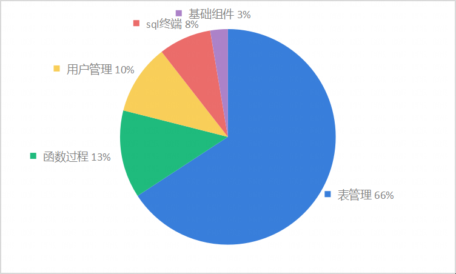

版权所有 © 2022 openGauss社区
您对“本文档”的复制、使用、修改及分发受知识共享(Creative Commons)署名—相同方式共享4.0国际公共许可协议(以下简称“CC BY-SA
4.0”)的约束。为了方便用户理解，您可以通过访问https://creativecommons.org/licenses/by-sa/4.0/ 了解CC BY-SA 4.0的概要 (
但不是替代)。CC BY-SA 4.0的完整协议内容您可以访问如下网址获取：https://creativecommons.org/licenses/by-sa/4.0/legalcode。
修订记录

| 日期         | 修订   版本 | 修改描述 | 作者           |
|------------|---------|--|--------------|
| 2023.09.26 | V1.0    | 新建 | Feiling Peng |
| 2023.10.07 | V2.0    | 刷新遗留问题、功能建议，增加点灯 | Feiling Peng |

关键词：

摘要：

缩略语清单：

| 缩略语 | 英文全名 | 中文解释 |
| ------ | -------- | -------- |
|        |          |          |

# 1     特性概述

版本包括的特性有：数据库连接、表结构与数据查询、序列创建与显示、同义词创建与显示、视图创建与显示、函数创建与执行、过程创建与执行、sql脚本执行、数据库管理、表管理、用户角色管理。

支持创建和管理数据库对象、执行 SQL 语句或 SQL 脚本、编辑和执行 PL/SQL
语句、数据库管理功能、连接删除、断开所有连接、连接区分来源、查询/删除保存的连接记录，通过支持存储调试功能精确定位到函数以及存储过程异常点，快速定位问题点并修改，降低排错难度提高工作效率。

930版本新增的功能：

- 窗口拖动
- sql终端：切换数据库、导入导出、重命名终端、SQL助手、查询执行历史
- 函数/过程：创建及调测package包中的函数/过程、导出DDL、查看包源码
- 表管理：筛选、排序、导出当前/所有查询数据、导入表数据、分区表属性查看、分析表
- 用户管理：创建用户创建角色刷新

# 2     特性测试信息

本节描述被测对象的版本信息和测试的时间及测试轮次，包括依赖的硬件。

| 版本名称 | 测试起始时间              | 测试结束时间      |
|------|---------------------|-------------|
| 第一轮测试 | 2023.08.20|  2023.09.19 |
| 第二轮测试 | 2023.09.20| 2023.09.26  |

| 环境信息      | 配置信息                                                 | 备注 |
| ------------- | ------------------------------------------------------------ | ---- |
| 虚拟机 | Intel Xeon Processor (Cascadelake) CPU @ 2.00GHz 8核<br/>内存：16GB<br/>硬盘：150G<br/>OS：CentOS Linux 7.6 <br> |
|软件|ElasticSearch: 8.3.3<br>Filebeat: 8.3.3<br>Java：11<br>python: 3.79<br>|      |

# 3     测试结论概述

## 3.1   测试整体结论

进行了2轮测试，覆盖了连接管理、函数过程、表管理、数据库管理、用户管理、视图、序列、同义词特性，共设计了688个测试用例，整个测试过程覆盖了功能测试、接口测试、性能测试。
本次测试总共发现58个问题，目前遗留了4个问题，整体质量良好，可供DBA日常使用。

| 测试活动 | 活动评价                                                                                              |
|------|---------------------------------------------------------------------------------------------------|
| 功能测试 | 窗口拖动，sql终端切换数据库、导入导出、重命名终端、SQL助手、查询执行历史，函数/过程支持package，表数据筛选、导入、查询导出、分区表属性查询、分析表，以及原基本功能，测试达到预期结果 |

## 3.2   约束说明

**函数/过程**
（1）在“**SQL** **终端**”或“**创建函数**/**过程**”向导创建的函数/过程须以“/”结尾，表示函数/过程的结尾。

**调试**
（1）安装openGauss3.1.0及以上
​（2）安装 pldebugger 插件3.0及以上
（3）仅支持plpgsql语言的调试

**项目运行**
（1）本项目依赖主平台的web-socket，若需要使用本项目所有功能，只能通过编译成 jar 包的形式作为插件运行在主平台上，若需单独运行将影响
SQL 终端语句执行、调试函数/过程等功能的使用。
（2）部署安装时需设置心跳时间小于平台token过期时间，
调整心跳方法：在`plugins/data-studio/web-ui/src/config/index.ts`修改配置心跳时间（单位：毫秒）

```javascript
// websocket心跳时间
export const wsHeartbeatTime = 1000 * 30;
// http心跳时间
export const httpHeartbeatTime = 1000 * 30;
```

## 3.3   遗留问题分析

### 3.3.1 遗留问题影响以及规避措施

| 问题单号 | 问题描述                   | 问题级别    | 问题影响和规避措施                                                                                         | 当前状态 |
|------|------------------------|-----------|---------------------------------------------------------------------------------------------------|------|
|      | sql终端上万行sql执行缓慢问题      | 一般  | 目前执行2w数据约10分钟，执行5w数据时长30min~60min，期间执行SQL的浏览器窗口不可用，其他窗口可使用。暂无针对大数据量一次性在 SQL 终端执行问题方案，可考虑通过导入文件执行。 | 新建   |
|      | 表数据筛选_若不加引号时间格式不支持到时分秒 | 一般         | 目前不加引号的情况下可输入年月日进行查询，不支持到时分秒。如果细化到时分秒需要加引号如'2023-01-01 01:00:00'                                  | 新建   |    
|      | 表数据保存_字段存入\013和'_报空错   | 一般         | 转义符特殊符号适配问题，其他字符可正常使用。                                                                            | 修复中  |
|709228848| 调试_取消生成覆盖率_又执行了一次函数显示了结果|重要| 多执行了一次、但不会生成覆盖率，目前不影响功能使用。                                                                        | 一般   |

### 3.3.2 问题统计

|        | 问题总数 | 关键  | 重要  | 一般  | 提示  |
| ------ |------|-----|-----|-----|-----|
| 数目   | 58   | 0   | 36  | 21  | 1   |
| 百分比 | 100% | 0%  | 62% | 36% | 2%  |

# 4     测试执行

## 4.1   测试执行统计数据

*本节内容根据测试用例及实际执行情况进行特性整体测试的统计，可根据第二章的测试轮次分开进行统计说明。*

| 版本名称 | 测试用例数 | 用例执行结果       | 发现问题单数 |
|------|-------|--------------|--------|
| 第一轮测试  | 688   | 执行129，通过率74% | 37     |
| 第二轮测试  | 688   | 执行305，通过率98% | 21     |

第二轮的21个问题中，一部分是第一轮已修复的问题在第二轮代码覆盖导致、一部分是回归新发现的问题。

进行问题回归后，测试用例数688，通过率99%。

*数据项说明：*

*测试用例数－－到本测试活动结束时，所有可用测试用例数；*

*发现问题单数－－本测试活动总共发现的问题单数。

## 4.2 测试执行步骤

### 4.2.1 基础组件

| 测试步骤                             | 测试结果                      |
|----------------------------------|---------------------------|
| 1、窗口拖拽 （930版本）                   | 执行4条用例，发现1个bug，现已修复且验证通过  |
| 2、主界面显示、窗口列表显示与定位、标签栏显示与定位、中英文切换 | 执行12条用例，发现1个bug，现已修复且验证通过 |

### 4.2.2 SQL终端

| 测试步骤                             | 测试结果                      |
|----------------------------------|---------------------------|
| 1、 切换数据库、导入导出、重命名终端、SQL助手、查询执行历史（930版本）  | 执行21条用例，发现4个bug，遗留1个问题    |
| 2、 sql执行、格式化、调测                  | 执行32条用例，发现1个bug，现已修复且验证通过 |

### 4.2.3 表管理

| 测试步骤                                  | 测试结果                    |
|---------------------------------------|-------------------------|
| 1、筛选、排序、导出当前/所有查询数据、导入表数据、分区表属性查看、分析表（930版本） | 执行36条用例，发现24个bug，遗留1个问题 |
| 2、表创建、编辑、显示、表数据、表约束、表索引               | 执行条用例，发现5个bug，遗留1个问题    |

### 4.2.4 函数过程

| 测试步骤                              | 测试结果                                      |
|-----------------------------------|-------------------------------------------|
| 1、创建及调测package包中的函数/过程、导出DDL、查看包源码（930版本） | 执行12条用例，发现5个bug，现已修复且验证通过                 |
| 2、创建/编辑/调试pgsql函数和过程、创建/编辑SQL函数   | 执行54条用例，发现5个bug，遗留1个问题，其他问题已修复且验证通过 |

### 4.2.5 连接管理

| 测试步骤                     | 测试结果                      |
|--------------------------|---------------------------|
| 1、新建、编辑、删除连接，查看连接属性，刷新连接 | 执行30条用例，发现0个bug，现已修复且验证通过 |

### 4.2.6 数据库管理

| 测试步骤                              | 测试结果                     |
|-----------------------------------|--------------------------|
| 1、新建、编辑、删除数据库和模式，查看数据库属性，刷新数据库和模式 | 执30条用例，发现1个bug，现已修复且验证通过 |

### 4.2.7 同义词/视图/序列

| 测试步骤                   | 测试结果                  |
|------------------------|-----------------------|
| 1、创建、查看、删除同义词/视图/序列，导出同义词/视图 | 执行25条用例，发现4个bug，现已修复且验证通过 |

### 4.2.8 用户管理

| 测试步骤         | 测试结果                      |
|--------------|---------------------------|
| 1、创建、删除用户/角色 | 执行34条用例，发现7个bug，现已修复且验证通过 |

### 4.3 930版本新增功能的测试执行数据

| 功能            | 测试用例数 | 用例最终执行结果     | 发现问题单数 |点灯|
|---------------|-------|--------------|--------|---|
| 窗口拖拽          | 4     | 执行4，通过率100%  | 2      |绿灯|
| 表数据           | 36    | 执行36，通过率97%  | 24     |绿灯|
| 函数过程支持package | 38    | 执行38，通过率97%  | 6      |绿灯|
| 用户管理           | 34    | 执行34，通过率100% | 5      |绿灯|

*数据项说明：*

*测试用例数－－到本测试活动结束时，所有可用测试用例数；*

*用例最终执行结果－－在问题修复后，最终用例执行情况。*

*发现问题单数－－本测试活动总共发现的问题单数。

## 4.3 问题分析

**
本版本（930版本），新功能的问题主要集中在表数据导入、用户管理，旧功能问题主要集中在函数过程（由新功能变动引起）、视图/序列/表/同义词的中文适配问题**

以下为930版本问题的分布图：

<div>
<div style="float:left;">
按特性：


</div>

</div>
<br>

出现的主要问题如下：

| 序号  | 模块                            | 问题                                                         | 原因及处理 |
|-----|-------------------------------|------------------------------------------------------------|-------|
| 1   |   数据库管理                       | 创建数据库时打开数据库连接时但未连接成功 | 因新需求对数据库列表的层级有所增加，导致原有较多业务逻辑有变化；逐一重新修改逻辑；                  |
| 2   |  基础组件    | 窗口搜索包含中文搜索不成功                 | 之前版本不含特殊字符，现版本需要对窗口重命名导致可以使用特殊字符，传参时对重命名后字符编码导致未解码；重新解码即可； |
| 3   |  表管理     | 表数据筛选条件为空时勾选                  | 条件较多时遗漏条件为空的情况；增加条件空时的过滤参数                                 |
| 4   |  表管理     | 导出百万数据量的表导致系统内崩溃              | 一次性读取一百万的数据进行导出，导致系统占用内存过大。按照每次一千条的查询方式进行导出数据              |
| 5   |  函数过程    | 多次启用/禁用多个断点，导致调试崩溃            | 前端传参数为一个断点，没有一次性将所有断点传到后端。前端一次操作将所有断点全部传到后端，后端统一处理         |
| 6   |  sql终端   | sql终端/表数据_date类型显示与gauss显示不一致 | 数据库类型转换出现格式问题，强转转换类型                                       |
| 7   |  表管理     | 表数据的日期时间格式显示错误                | 数据库类型传输出现格式问题，强转转换类型                                       |
| 8   |  表管理     | 表_表名包含中文_列、约束、索引不显示信息         | 添加名称校验导致，去掉校验方法                                            |
| 9   |  表管理     | 分析表_表名为纯数字时报错                 |缺少名称校验导致，添加校验方法|

## 4.2 压测

暂无

## 4.3 接口测试

| 接口数 | 用例数 | 通过率  |
|-----|-----|------|
| 92  | 147 | 100% |

| 类或模块名称 | 接口名称                       | 接口请求方法 | 接口地址 | 是否覆盖 | 是否通过   | 备注      |
|------------|----------------------------|--------|------------|------|--------|---------|
|表管理| 表列                         | POST   | /dataStudio/web/v1/tableColumns/edit | 是    | 是      |
|表管理| 添加主键                       | POST   | /dataStudio/web/v1/constraint/pk | 是    | 是      |
|表管理| 关闭窗口                       | GET    | /dataStudio/web/v1/tableDatas/close/{winId} | 是    | 是      |
|表管理| 修改表数据                      | POST   | /dataStudio/web/v1/tableDatas/edit | 是    | 是      |
|表管理| 表空间                        | GET    | /dataStudio/web/v1/metaData/tablespace/{uuid} | 是    | 是      |
|表管理| 创建表DDL预览                   | POST   | /dataStudio/web/v1/table/ddl | 是    | 是      |
|表管理| 创建表                        | POST   | /dataStudio/web/v1/table | 是    | 是      | 未校验表名为空 |
|表管理| 截断表                        | POST   | /dataStudio/web/v1/table/truncate | 是    | 是      |
|表管理| 清理表                        | POST   | /dataStudio/web/v1/table/vacuum | 是    | 是      |
|表管理| 重建索引                       | POST   | /dataStudio/web/v1/table/reindex | 是    | 是      |
|表管理| 表重命名                       | POST   | /dataStudio/web/v1/table/rename | 是    | 是      |
|表管理| 设置描述                       | POST   | /dataStudio/web/v1/table/comment | 是    | 是      |
|表管理| 设置模式                       | POST   | /dataStudio/web/v1/table/reschema | 是    | 是      |
|表管理| 删除表                        | DELETE | /dataStudio/web/v1/table/drop | 是    | 是      |
|表管理| 设置表空间                      | POST   | /dataStudio/web/v1/table/retablespace | 是    | 是      |
|表管理| 表相关序列                      | POST   | /dataStudio/web/v1/table/sequence | 是    | 是      |
|表管理| 表一般                        | POST   | /dataStudio/web/v1/table/attribute | 是    | 是      |
|表管理| 查询所有用户                     | POST   | /dataStudio/web/v1/schema/query/users | 是    | 是      |
|表管理| 查询函数覆盖率                    | POST   | /dataStudio/web/v1/coverageRate/query | 是    | 是      |
|表管理| 删除函数覆盖率记录                  | POST   | /dataStudio/web/v1/coverageRate/delete | 是    | 是      |
|表管理| 导出函数覆盖率记录                  | POST   | /dataStudio/web/v1/coverageRate/export | 是    | 是      |
|表管理| 导出表DDL和数据                  | POST   | /dataStudio/web/v1/export/table/ddl | 是    | 是      |
|表管理| 表数据查询                      | POST   | /dataStudio/web/v1/tableDatas | 是    | 是      |
|表管理| 分区属性                       | GET    | /dataStudio/web/v1/table/attribute/partition | 是    | 是      |
|表管理| 分析表                        | POST   | /dataStudio/web/v1/table/analyze | 是    | 是      |
|表管理| 编辑约束                       | POST   | /plugins/webds-plugin/dataStudio/web/v1/constraint | 是    | 是      |
|表管理| 类型列表                       | GET    | /dataStudio/web/v1/metaData/typeList/{uuid} | 是    | 是      |
|表管理| 编辑索引                       | POST   | /plugins/webds-plugin/dataStudio/web/v1/index | 是    | 是      |
|表管理| 索引列表                       | GET    | /plugins/webds-plugin/dataStudio/web/v1/tableIndexs | 是    | 是      |
|表管理| 约束列表                       | GET    | /plugins/webds-plugin/dataStudio/web/v1/tableConstraints | 是    | 是      |
| 连接管理 | Database Connectionll List | GET    | /dataStudio/web/v1/connections | 是    | 是      |
| 连接管理 | Add connections            | POST   | /dataStudio/web/v1/connections | 是    | 是      |
| 连接管理 | Update Connections         | PUT    | /dataStudio/web/v1/connections/update | 是    | 是      |
| 连接管理 | Delete Connectionll        | DELETE | /dataStudio/web/v1/connections/{id} | 是    | 是      |
| 连接管理 | Attribute                  | GET    | /dataStudio/web/v1/connections/{id}/attribute | 是    | 是      |
| 连接管理 | Update Connections         | PUT    | /dataStudio/web/v1/connections | 是    | 是      |
| 连接管理 | Delete Connectionll        | DELETE | /dataStudio/web/v1/connections/close/{uuid} | 是    | 是      |
| 元数据查询 | CREATE SEQUENCE            | POST   | /dataStudio/web/v1/sequences | 是    | 是      |
| 元数据查询 | CREATE SEQUENCE DDL        | POST   | /dataStudio/web/v1/sequences/action | 是    | 是      |
| 元数据查询 | CREATE SYNONYM             | POST   | /dataStudio/web/v1/synonyms | 是    | 是      |
| 元数据查询 | CREATE SYNONYM DDL         | POST   | /dataStudio/web/v1/synonyms/action | 是    | 是      |
| 元数据查询 | CREATE VIEW                | POST   | /dataStudio/web/v1/views | 是    | 是      |
| 元数据查询 | CREATE VIEW DDL            | POST   | /dataStudio/web/v1/views/action | 是    | 是      |
| 元数据查询 | Column List                | GET    | /dataStudio/web/v1/metaData/columnList | 是    | 是      |
| 元数据查询 | DROP FunctionSP            | DELETE | /dataStudio/web/v1/functionSP | 是    | 是      |
| 元数据查询 | DROP SEQUENCE              | DELETE | /dataStudio/web/v1/sequences | 是    | 是      |
| 元数据查询 | DROP SYNONYM               | DELETE | /dataStudio/web/v1/synonyms | 是    | 是      |
| 元数据查询 | DROP VIEW                  | DELETE | /dataStudio/web/v1/views | 是    | 是      |
| 元数据查询 | Database List              | GET    | /dataStudio/web/v1/metaData/databaseList/{uuid} | 是    | 是      |
| 元数据查询 | schemaObjectList           | GET    | /dataStudio/web/v1/metaData/schemaObjectList | 是    | 是      |
| 元数据查询 | Object List                | GET    | /dataStudio/web/v1/metaData/objectList | 是    | 是      |
| 元数据查询 | RETURN SEQUENCE DDL        | POST   | /dataStudio/web/v1/sequenceDdls | 是    | 是      |
| 元数据查询 | RETURN VIEW DDL            | POST   | /dataStudio/web/v1/viewDdls | 是    | 是      |
| 元数据查询 | SELECT VIEW                | GET    | /dataStudio/web/v1/viewDatas | 是    | 是      |
| 元数据查询 | Schema List                | GET    | /dataStudio/web/v1/metaData/schemaList | 是    | 是      |
| 元数据查询 | Table Column List          | GET    | /dataStudio/web/v1/tableColumns | 是    | 是      |
| 元数据查询 | Table Constraint List      | GET    | /dataStudio/web/v1/tableConstraints | 是    | 是      |
| 元数据查询 | Table DDL SQL              | GET    | /dataStudio/web/v1/tableDdls | 是    | 是      |
| 元数据查询 | Table Index List           | GET    | /dataStudio/web/v1/tableIndexs | 是    | 是      |
| 元数据查询 | connectionDatabase         | POST   | /dataStudio/web/v1/database/connection | 是    |
| 元数据查询 | createDatabase             | POST   | /dataStudio/web/v1/database/create | 是    | 是      |
| 元数据查询 | deleteDatabase             | DELETE | /dataStudio/web/v1/database/delete | 是    | 是      |
| 元数据查询 | renameDatabase             | POST   | /dataStudio/web/v1/database/rename | 是    | 是      |
| 元数据查询 | GET SYNONYM                | GET    | /dataStudio/web/v1/synonyms | 是    | 是      |
| 元数据查询 | 查看连接属性                     | GET    |/dataStudio/web/v1/connections/attribute| 是    | 是    |页面上功能正常 |
| 元数据查询 | 打开数据库连接                    | POST   |/dataStudio/web/v1/database/connection| 是    |是 |页面上功能正常 |
| 功能控制 | heartbeat                  | GET    | /dataStudio/web/v1/functionality/heartbeat | 是    | 是      |
| SQL执行历史 | 查询SQL执行历史                  | POST   | /dataStudio/web/v1/sqlHistory/query| 是    | 是      |
| SQL执行历史 | 更新SQL执行历史                  | POST   | /dataStudio/web/v1/sqlHistory/update| 是    | 是      |
| SQL执行历史 | 删除SQL执行历史                  | POST   |/dataStudio/web/v1/sqlHistory/delete| 是    | 是      |
| SQL执行历史 | 创建SQL执行历史                  | POST   | /startRun| 是    | 是      |
|导入导出数据| 导出表DDL和数据                  | POST   | /dataStudio/web/v1/export/table/ddl| 是    | 是      |
|导入导出数据| 导出表数据                      | POST   | /dataStudio/web/v1/export/table/data| 是    | 是      |
|导入导出数据| 导出函数/过程DDL                 | POST   | /dataStudio/web/v1/export/function/ddl| 是    | 是      |
|导入导出数据| 导出视图DDL                    | POST   | /dataStudio/web/v1/export/view/ddl| 是    | 是      |
|导入导出数据| 导出序列DDL                    | POST   | /dataStudio/web/v1/export/sequence/ddl| 是    | 是      |
|导入导出数据| 导出模式DDL和数据                 | POST   | /dataStudio/web/v1/export/schema/ddl| 是    | 是      |
|导入导出数据| 筛选条件导出表数据                  | POST   | /dataStudio/web/v1/table/exportData| 是    | 是      |
|导入导出数据| 导入表数据                      | POST   | /dataStudio/web/v1/import/table/data| 是    | 是      |
|模式管理| 创建模式                       | POST   | /dataStudio/web/v1/schema/create | 是    | 是      |
|模式管理| 查询单个模式                     | POST   | /dataStudio/web/v1/schema/query | 是    | 是      |
|模式管理| 修改模式                       | POST   | /dataStudio/web/v1/schema/update | 是    | 是      |
|模式管理| 删除模式                       | POST   | /dataStudio/web/v1/schema/delete | 是    | 是      |
|用户管理| 用户角色列表                     | GET    | /dataStudio/web/v1/metaData/user| 是    | 是      |
|用户管理| 资源池                        | GET    | /dataStudio/web/v1/metaData/resource/{uuid}| 是    | 是      |
|用户管理| 创建用户预览                     | POST   | /dataStudio/web/v1/user/creat/preview| 是    | 是      |
|用户管理| 创建用户                       | POST   | /dataStudio/web/v1/user/creat/| 是    | 是      |
|用户管理| 删除用户                       | DELETE | /dataStudio/web/v1/user/drop| 是    | 是      |
|视图管理| 编辑视图                       | POST   | /dataStudio/web/v1/view/edit| 是    | 是      |
|视图管理| 查看视图一般属性                   | POST   | /dataStudio/web/v1/view/attribute| 是    | 是      |
|视图管理| 查看视图列属性                    | POST   | /dataStudio/web/v1/view/column| 是    | 是      |
|视图管理| 查询视图                       | POST   | /dataStudio/web/v1/view/query| 是    | 是      |

## 4.4   后续测试建议

后续还需要进行UI自动化、性能自动化、接口测试、稳定性测试、兼容性测试、渗透测试。

# 5   功能建议
| 建议             | 状态  | 处理                |
|----------------|-----|-------------------|
| 创建表增加勾选表名区分大小写 | 已反馈 | 增加勾选框             |
| sql终端超过可重新连接   | 已反馈 | 规划数据库自动重连、配置数据库自动断连时间功能 |

# 6     附件

无

