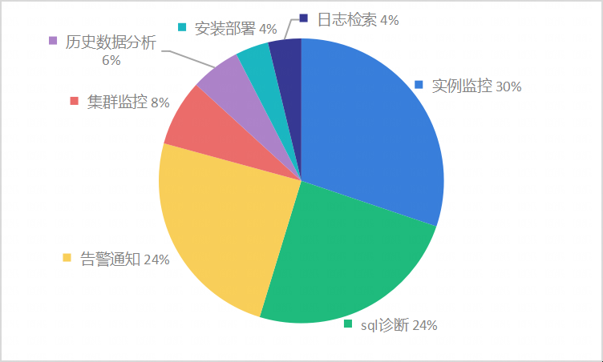

版权所有 © 2022 openGauss社区
您对“本文档”的复制、使用、修改及分发受知识共享(Creative Commons)署名—相同方式共享4.0国际公共许可协议(以下简称“CC BY-SA
4.0”)的约束。为了方便用户理解，您可以通过访问https://creativecommons.org/licenses/by-sa/4.0/ 了解CC BY-SA 4.0的概要 (
但不是替代)。CC BY-SA 4.0的完整协议内容您可以访问如下网址获取：https://creativecommons.org/licenses/by-sa/4.0/legalcode。
修订记录

| 日期         | 修订   版本 | 修改描述        | 作者           |
|------------|---------|-------------|--------------|
| 2023.09.27 | V1.0    | 新建          | Feiling Peng |
| 2023.10.8  | V2.0    | 刷新遗留问题、调整格式 | Feiling Peng |

关键词：

摘要：

缩略语清单：

| 缩略语 | 英文全名 | 中文解释 |
| ------ | -------- | -------- |
|        |          |          |

# 1     特性概述

版本包括的特性有：SQL诊断、慢SQL监控、日志检索、实例监控、告警通知、历史数据诊断分析。

1.通过监控硬件、OS和数据库指标以及TOP SQL相关信息 ，为用户观测数据库提供首要入口。

2.支持监控慢SQL和创建诊断任务 ，通过对应用、数据库、OS、硬件的全栈跟踪，实现基于专家模型的故障诊断。

3.支持数据库、OS日志在Web端的统一检索。

 

930版本新增的功能有：

- 实例监控：增加实例信息提示、图表显示修改、增加等待事件、活跃会话数量增加指标及跳转wdr分析、TOP操作系统进程增加FULL
  COMMAND列、CPU使用率增加项、TOP数据库线程关联会话ID和sqlID、TOPSQL增加IO 、增加ASP

- 告警：告警记录增加导出清单/报告、告警确认（置为已读后不再发通知）、日志关联
  ，支持新增/编辑/删除规则，支持日志类型的规则，告警规则启动/停止（包含日志定时任务），告警通知支持企业微信/钉钉/第三方通知

- 集群运维：增加集群列表、主备延迟列表、集群详情

930版本修改的功能有：SQL诊断代码重构

# 2     特性测试信息

本节描述被测对象的版本信息和测试的时间及测试轮次，包括依赖的硬件。

| 版本名称 | 测试起始时间     | 测试结束时间     |
|------|------------|------------|
| 第一轮测试 | 2023.08.25 | 2023.09.19 |
| 第二轮测试 | 2023.09.20 | 2023.09.27 |
|           |            |            |

| 环境信息      | 配置信息                                                 | 备注 |
| ------------- | ------------------------------------------------------------ | ---- |
| 虚拟机 | Intel Xeon Processor (Cascadelake) CPU @ 2.00GHz 8核 内存：16GB 硬盘：150G OS：CentOS Linux 7.6   ||
|软件|ElasticSearch: 8.3.3 Filebeat: 8.3.3 Java：11 python: 3.79 |      |
|  |  |   |

# 3     测试结论概述

## 3.1   测试整体结论

进行了2轮测试，覆盖了SQL诊断、实例监控、历史数据诊断、告警通知、集群监控特性，共设计了730个测试用例，整个测试过程覆盖了功能测试。
总共发现54个问题，目前遗留了3个问题，整体质量一般。

| 测试活动 | 活动评价                                                                                |
|------|-------------------------------------------------------------------------------------|
| 功能测试 | 测试实例监控（首页-资源使用率图表、首页-活跃会话数量、首页-实时TOPSQL、首页-阻塞会话、首页-长事务、资源监控-CPU、资源监控-内存、资源监控-磁盘IO、资源监控-网络、实例指标-TPS、实例指标-QPS、实例指标-连接数、实例指标-慢SQL数、TOPSQL-DB_TIME、TOPSQL-CPU_TIME、TOPSQL-EXEC_TIME）、历史数据诊断（磁盘利用率、CPU占用率、数据库进程CPU占用率、其他进程CPU占用率、活跃会话数量、线程池使用率、线程池使用率、SQL执行时长、慢SQL数量、等待事件数量）、告警监控（告警记录、告警配置、告警模板、通知模板、通知方式），测试达到预期结果 |

## 3.2   约束说明

**日志检索**
（1）FileBeat版本由8.3.3进行二次开发新增openGauss Module
（2）需要在openGauss实例所在服务器安装FileBeat，以及FileBeat配置文件要求
（3）ES版本与FileBeat版本保持一致
（4）用户需要自行搭建ElasticSearch环境；ElasticSearch服务器性能要求、ElasticSearch配置文件要求
（5）Java 11及以上版本
（6）需要根据约定规则设计ES索引名称与插入具体字段值
（7）ElasticSearch需要集中存储多实例的日志，对存储容量要求较高，实际根据数据库实例数量、实例日志数量、ElasticSeach部署方式决定；

**实例监控**
（1）使用平台插件安装部署exporter和Prometheus

**SQL诊断-性能分析**
（1）仅支持Linux版本在4.1或以上版本
（2）BCC版本需与内核版本匹配
（3）Python3或以上版本
（4）java 11或以上版本
（5）agent工具使用Java语言编写，但eBPF需与Linux内核交互，故只支持Linux平台
（6）需与Linux内核交互对性能有较高的要求，因此对于openGauss数据库的硬件系统有较高的要求。

**SQL诊断与慢SQL**
（1）需要在openGauss实例所在服务器安装bcc，以及安装诊断数据采集服务
（2）Java 11或以上版本
（3）个人开发者最低配置2核4G，推荐配置4核8G。预留50%以上的磁盘剩余空间用于数据存储。

**自动部署**
（1）需要先在服务器上安装yum命令

## 3.3   遗留问题分析

### 3.3.1 遗留问题影响以及规避措施

| 问题单号 | 问题描述                      | 问题级别 | 问题影响和规避措施           | 当前状态   |
| -------- |---------------------------|------|---------------------|--------|
|709225359| 日志检索_选择实例_数据加载不出来         | 重要   | 反馈环境插件问题            | 新建     |
|709226018| 历史数据诊断_诊断数据详情问题           | 重要   | 个别诊断点显示为空，不影响其他诊断项。 | 新建     |
|709290744| sql诊断_根据时间搜索_报时间格式错误|重要| 不可通过时间筛选任务          | 已解决未合入              |

### 3.3.2 问题统计

| | 问题总数 | 关键 | 重要  | 一般  | 提示 |
| ------ |------|-----|-----|-----|-----|
| 数目 | 54   | 0 | 27  | 19  | 8 |
| 百分比 | 100% | 0% | 49% | 36% | 15% |

# 4     测试执行

## 4.1   测试执行统计数据

*本节内容根据测试用例及实际执行情况进行特性整体测试的统计，根据第二章的测试轮次分开进行统计说明。*

| 版本名称 | 测试用例数 | 用例执行结果       | 发现问题单数 |
|------|-------|--------------|--------|
| 第一轮测试  | 730   | 执行196，通过率81% | 45     |
| 第二轮测试  | 730   | 执行241，通过率95% | 15     |

进行问题回归后，测试用例数共730条，通过率95%。

*数据项说明：*

*测试用例数－－到本测试活动结束时，所有可用测试用例数；*

*发现问题单数－－本测试活动总共发现的问题单数。*

## 4.2 测试执行步骤

### 4.2.1 实例监控

| 测试步骤                                                                                                                         | 测试结果                       |
|------------------------------------------------------------------------------------------------------------------------------|----------------------------|
| 1、增加实例信息提示、图表显示修改、增加等待事件、活跃会话数量增加指标及跳转wdr分析、TOP操作系统进程增加FULL COMMAND列、CPU使用率增加项、TOP数据库线程关联会话ID和sqlID、TOPSQL增加IO 、增加ASP（930版本） | 执行18条用例，发现12个bug，现已修复且验证通过 |
| 2、资源监控、实例指标、WDR报告、系统配置显示                                                                                                     | 执行88条用例，发现3个bug，现已修复且验证通过  |

### 4.2.2 告警通知

| 测试步骤                                                                                                         | 测试结果                                  |
|--------------------------------------------------------------------------------------------------------------|---------------------------------------|
| 1、告警记录增加导出清单/报告、告警确认（置为已读后不再发通知）、日志关联 ，支持新增/编辑/删除规则，支持日志类型的规则，告警规则启动/停止（包含日志定时任务），告警通知支持企业微信/钉钉/第三方通知（930版本） | 执行77条用例，发现10个bug，现已修复且验证通过 |
| 2、告警规则、告警模板、告警配置、告警记录、通知方式基本功能回归                                                                             | 执行81条用例，发现3个bug，现已修复且验证通过             |

### 4.2.3 集群运维

| 测试步骤                 | 测试结果                      |
|----------------------|---------------------------|
| 1、集群列表、主备延迟列表、集群详情显示 | 执行10条用例，发现3个bug，现已修复且验证通过 |

### 4.2.4 SQL诊断

| 测试步骤                  | 测试结果                                |
|-----------------------|-------------------------------------|
| 1、慢SQL、sql诊断、topsql诊断 | 执行91条用例，发现17个bug，现遗留1个问题，其他已修复且验证通过 |

### 4.2.5 安装部署

| 测试步骤                                     | 测试结果                      |
|------------------------------------------|---------------------------|
| 1、promethus,exporter,filebeat,agent安装和卸载 | 执行15条用例，发现2个bug，现已修复且验证通过 |

### 4.2.6 历史数据诊断

| 测试步骤           | 测试结果                   |
|----------------|------------------------|
| 1、历史数据诊断基本功能回归 | 执行6条用例，发现1个bug，现遗留1个问题 |

### 4.3 测试执行数据

**930版本新增功能的测试执行数据**

| 功能      | 测试用例数 | 用例最终执行结果     | 发现问题单数 |点灯| 备注                          |
|---------|-------|--------------|--------|---|-----------------------------|
| 实例监控   | 106   | 执行106，通过率92% | 15     |绿||
| 告警通知| 158   | 执行158，通过率96% | 15     |黄| 插件重新安装，原有告警模板、告警配置数据均需重新新增。 |
| 集群运维   | 10    | 执行10，通过率100% | 3      |绿|                             |
| SQL诊断  | 91    | 执行91，通过率100% | 17     |绿|                             |
| 安装部署  | 15    | 执行15，通过率100% | 2      |黄| 插件容易冲突出现问题。                 |
| 历史数据诊断  | 6     | 执行6，通过率83%   | 1      |绿|                             |

*数据项说明：*

*测试用例数－－到本测试活动结束时，所有可用测试用例数；*

*用例最终执行结果－－在问题修复后，最终用例执行情况。*

*发现问题单数－－本测试活动总共发现的问题单数。

## 4.4 问题分析

**本版本（930版本）的问题主要集中在告警通知、实例监控、sql诊断。

以下为截至目前为止，930版本问题的分布图：

 

**实例监控**出现的主要问题如下：

| 序号  | 特性   | 问题             |                    处理              |
|-----|------|----------------|--------------------------------------|
| 1   | 实例监控 | 会话详情_客户端IP地址异常 |写错sql，为对inet类型的字段进行解析|
| 2   |SQL诊断| sql诊断异常_存在一些sql诊断出现错误或不符合预期结果| 未进行诊断前的SQL语句校验，添加SQL校验步骤，以及调整诊断项状态与任务状态的关系                                                                                                                                                 |
| 3   | SQL诊断 | sql诊断_参数诊断相关问题  | 历史版本需求问题，删除无推荐值的参数                                                                                                                                                                         |
| 4   | SQL诊断 | sql诊断_根据名称或sql查询_查询数据错误  | 前后端字段名字不统一，后端修改字段名称                                                                                                                                                                        |
| 5   | SQL诊断 | sql诊断_实例未安装agent时诊断任务状态一直在等待数据接收中_影响后续使用 | 原需求未考虑，修改需求，增加agent是否安装判断                                                                                                                                                                  |
| 6   | 告警通知 |告警记录_关联视图数据显示异常| 由于告警记录对应的告警规则对应的promQL有问题，通过修改promQL修复bug                                                                                                                                                  |
| 7   | 告警通知 | 告警_规则停用后还进行了告警 | 原因是在修改告警模板后，将停用的规则也写入了prometheus配置文件中，已不再将停用的规则写入prometheus配置文件                                                                                                                            |
| 8   | 告警通知 | 告警_重复通知_重复周期问题（通知延迟1分钟） | 经过测试，延迟主要是由prometheus配置文件中的evaluation_interval参数引起的，evaluation_interval=1m，也就是会延迟1分钟。目前将evaluation_interval改为15s，也就是延迟15s（evaluation_interval=15s是指每15秒计算一次规则，所以evaluation_interval不能设置太低） |
| 9   | 告警通知 | 实现与需求不一致  | 未仔细核对需求点；增加开发相应功能代码；                                                                                                                                                                       |
| 10  | 历史数据诊断 | 历史数据诊断功能_报request error  | if判断条件错误，修改判断条件                                                                                                                                                                            |

## 4.5 性能测试

暂无

## 4.6 接口测试

暂无

## 4.7   后续测试建议

后续商用还需要进行UI自动化、接口测试、稳定性测试、兼容性测试、渗透测试、接口性能自动化、根据实际场景进行历史数据诊断测试。

# 5   功能建议
|建议| 状态  | 处理               |
|---|-----|------------------|
|告警规则变更之后告警模板未变更| 已反馈 | 增加确认弹窗，供用户选择更新方式 |

# 6     附件

无
