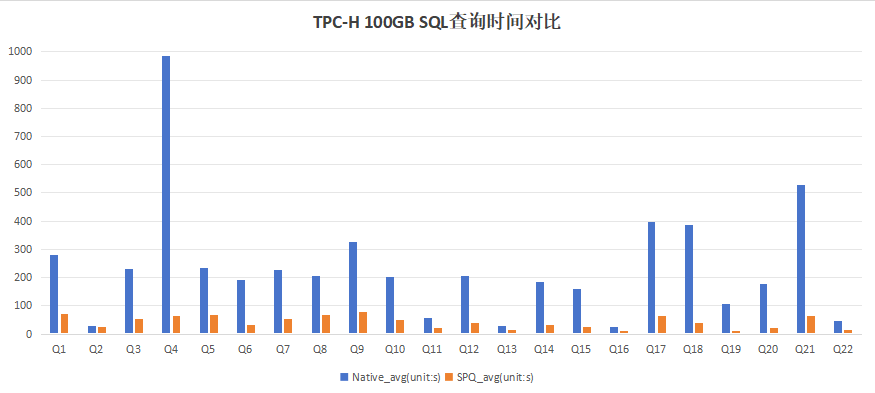
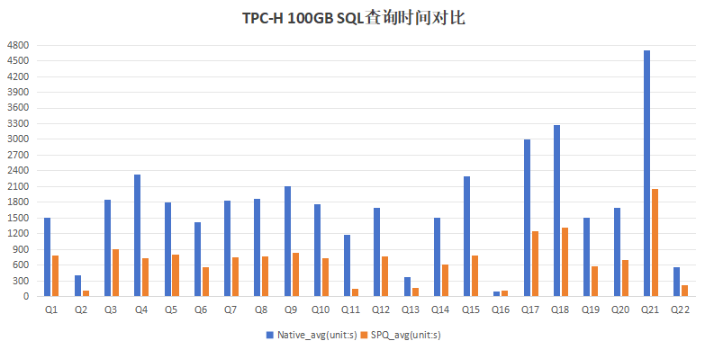
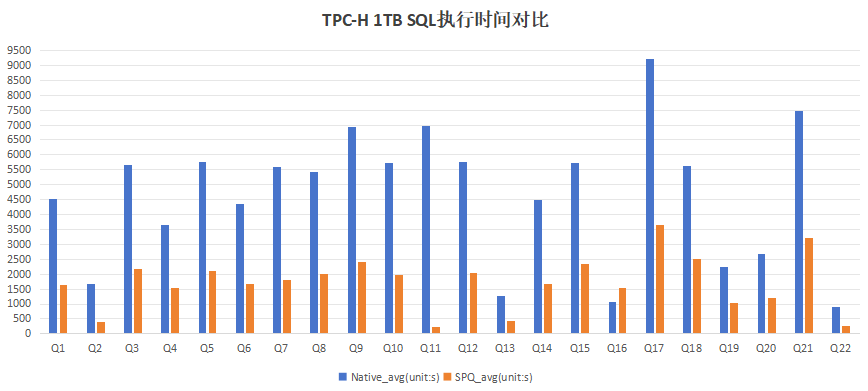
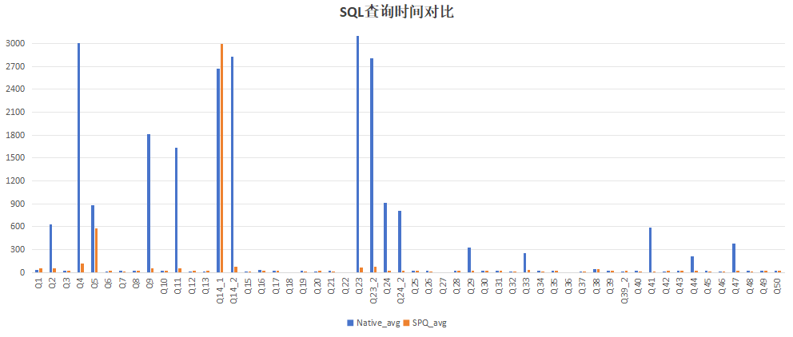
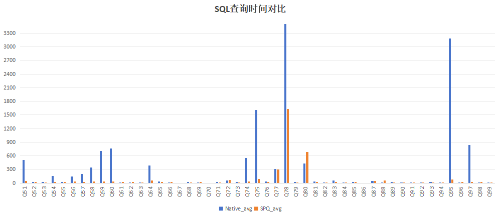

版权所有 © 2023  openGauss社区
 您对“本文档”的复制、使用、修改及分发受知识共享(Creative Commons)署名—相同方式共享4.0国际公共许可协议(以下简称“CC BY-SA 4.0”)的约束。为了方便用户理解，您可以通过访问https://creativecommons.org/licenses/by-sa/4.0/ 了解CC BY-SA 4.0的概要 (但不是替代)。CC BY-SA 4.0的完整协议内容您可以访问如下网址获取：https://creativecommons.org/licenses/by-sa/4.0/legalcode。

修订记录

| 日期     | 修订   版本 | 修改描述     | 作者    |
| -------- | ----------- | ------------ | ------- |
| 2023-12-11 | 1.0         | 测试报告初版 | songjing |

关键词：多机并行，SPQPlugin

摘要：本文档主要验证开启SPQ插件功能后查询是否支持多机并行，数据库功能、稳定性表现是否正常，TPC-H 1T行存数据，一写多读集群任一节点查询性能是否提升2倍（三台读节点对比一台读节点查询性能），并给出测试结论。


缩略语清单：

| 缩略语 | 英文全名     | 中文解释                 |
| ------ | ------------ | ------------------------ |
| SPQ    | SharedEverything Parallel Query    | 共享存储并行查询 |
| QC     | Query Coordinator | 协调角色节点   |
| QE     | Query Execution   | 查询执行角色节点  |

# 1 特性概述

目前的集群存在同时一个读节点查询的能力，集群的查询性能非常受限，SPQ基于sharedEverything分布式框架，所有节点都共享集群内的资源，通过执行计划的split和执行、汇聚等实现所有读节点并行查询，充分发挥集群的OLAP性能，使资源池化同时具备较强的TP和AP能力。

# 2 特性测试信息

| 版本名称                       | 测试起始时间 | 测试结束时间 |
| ------------------------------ | ------------ | ------------ |
| openGauss 5.1.1 build 96aca89e | 2023-10-26    | 2023-11-2    |
| openGauss 5.1.1 build 812682c6 | 2023-11-3     | 2023-11-9    |
| openGauss 5.1.1 build 5099d94c | 2023-11-10    | 2023-11-22  |
| openGauss 5.1.1 build 6460c491 | 2023-11-23    | 2023-11-28   |
| openGauss 5.1.1 build 01b191f0 | 2023-12-7     | 2023-12-8    |
| openGauss 5.1.1 build 79509ee2 | 2023-12-13 | 2023-12-20 |

| 环境信息                              | 配置信息                                                     | 备注     |
| ------------------------------------- | ------------------------------------------------------------ | -------- |
| 服务端<br />Taishan 200（Model 2280） | CPU：Kunpeng 920<br />内存：1TB<br />数据盘：4\*2.9TB NVME SSD<br />磁阵：单卷组6*1TB<br />文件系统：EXT4<br />网卡：2\*25GE<br />OS：openEuler release 20.03 (LTS) | 一主两备 |

   

# 3 测试结论概述

## 3.1 测试整体结论

SPQ多机并行执行特性共计执行78个用例，主要覆盖了功能测试、一致性测试，稳定性、性能测试；发现问题21个，已全部修复并回归通过，整体质量良好 。

| 测试活动   | 活动评价                                                     |
| ---------- | ------------------------------------------------------------ |
| 功能测试   | （1）SPQPlugin插件使能测试，测试插件正常使能/关闭场景下的数据库查询功能是否正常<br />（2）白名单测试，简单查询、扩展查询和create index语句，适合多机执行的查询语句能否正常多机执行，执行结果与原生的一致，其他语句预期报错提示或返回原生处理结果<br />（3）全量覆盖测试，开启SPQ多机并行，现有功能的用例能正常执行通过 |
| 稳定性测试 | （1）单session下连续执行TPC-H和TPC-DS语句查询12小时，多session下连续执行TPC-H和TPC-DS语句查询，预期无资源泄漏运行稳定结果无误<br />（2）测试中对查询语句设置不同query_dop，enable_spq状态切换，原生与多机穿插执行 |
| 一致性测试 | 开启SPQ多机并行执行，1000仓tpcc数据验证数据一致性，主备数据一致 |
| 性能测试   | （1）100GB数据，预热/不预热全部数据，对比SPQ开启与关闭状态下TPC-H、TPC-DS性能数据（2）1TB数据，对比spq特性开启与关闭状态下TPC-H查询性能数据<br />测试结果为开启spq多机并行，查询性能提升2倍以上，满足要求。 |

## 3.2   约束说明

（1）本特性仅支持在资源池化部署下使用。

（2）暂时仅支持shared_preload_libraries方式加载插件。

（3）加载SPQ的节点所配置的节点名称pgxc_node_name互不相同。

（4）开启spq插件功能后，QE节点pg_hba.conf中配置QC节点trust方式的白名单，否则非初始用户查询时报错。

（5）分区表、系统表、系统视图、伪列、自定义函数、存储过程的查询暂不支持，走原生流程。

（6）事务中查询走原生处理流程。

## 3.3   遗留问题分析

### 3.3.1 遗留问题影响以及规避措施

| 问题单号 | 问题描述 | 问题级别 | 问题影响和规避措施 | 当前状态 |
| -------- | -------- | -------- | ------------------ | -------- |
| N/A      |          |          |                    |          |

### 3.3.2 问题统计

|        | 问题总数 | 严重 | 主要 | 次要 | 不重要 |
| ------ | -------- | ---- | ---- | ---- | ------ |
| 数目   | 21       | 0    | 8    | 13   | 0      |
| 百分比 | 100%     | 0%   | 38%  | 62%  | 0%     |

### 3.3.3 问题单汇总

| 序号 | issue号                                                      | 问题级别 | 问题简述                                                     | 问题状态 |
| ---- | ------------------------------------------------------------ | -------- | ------------------------------------------------------------ | -------- |
| 1    | [I8B8KZ](https://gitee.com/opengauss/openGauss-server/issues/I8B8KZ?from=project-issue) | 次要     | 【测试类型：SQL功能】【测试版本：5.1.1】【资源池化】配置文件或gs_guc修改pooler_port不生效，数据库port配置为65535后查询pooler_port=65536，comm_control_port参数范围不对 | 已验收   |
| 2    | [I8C2T4](https://gitee.com/opengauss/openGauss-server/issues/I8C2T4?from=project-issue) | 次要     | 【测试类型：SQL功能】【测试版本：5.1.1】【资源池化】会话中使用set设置spqplugin.cluster_map后，查询表数据报错 | 已验收   |
| 3    | [I8C35T](https://gitee.com/opengauss/openGauss-server/issues/I8C35T?from=project-issue) | 主要     | 【测试类型：SQL功能】【测试版本：5.1.1】【资源池化】开启spq多机执行，表字段使用自定义类型时，查询表数据报错 | 已验收   |
| 4    | [I8CD7T](https://gitee.com/opengauss/Plugin/issues/I8CD7T?from=project-issue) | 次要     | 【测试类型：插件功能】【测试版本：5.1.1】【资源池化】spqplugin.cluster_map中配置comm_sctp_port的值与comm_control_port的一样，执行TPCH Q1语句卡住，生成大量日志文件 | 已验收   |
| 5    | [I8D6HI](https://gitee.com/opengauss/openGauss-server/issues/I8D6HI?from=project-issue) | 主要     | 【测试类型：SQL功能】【测试版本：5.1.1】【资源池化】开启spq多机执行explain plan, 子查询在where条件中，数据库core | 已验收   |
| 6    | [I8DDEH](https://gitee.com/opengauss/openGauss-server/issues/I8DDEH?from=project-issue) | 次要     | 【测试类型：SQL功能】【测试版本：5.1.1】【资源池化】开启spq多机，包含窗口函数的查询，执行计划显示over(?) | 已验收   |
| 7    | [I8EESS](https://gitee.com/opengauss/openGauss-server/issues/I8EESS?from=project-issue) | 主要     | 【测试类型：SQL功能】【测试版本：5.1.1】【资源池化】开启spq，查询目标列包含函数group_concat，数据库coredump | 已验收   |
| 8    | [I8F2XA](https://gitee.com/opengauss/openGauss-server/issues/I8F2XA?from=project-issue) | 主要     | 【测试类型：SQL功能】【测试版本：5.1.1】【资源池化】开启spq,备机设置spqplugin.spq_enable_adaptive_scan=on 执行TPCH Q9语句,ctrl+c后继续执行,数据库coredump | 已验收   |
| 9    | [I8FPPW](https://gitee.com/opengauss/Plugin/issues/I8FPPW?from=project-issue) | 次要     | 【测试类型：SQL功能】【测试版本：5.1.1】【资源池化】开启spq,兼容B库下查询不走多机并行执行流程 | 已验收   |
| 10   | [I8GG7C](https://gitee.com/opengauss/Plugin/issues/I8GG7C?from=project-issue) | 次要     | 【测试类型：SQL功能】【测试版本：5.1.1】【资源池化】开启spq,通过jdbc连接数据库执行分区表连表+union查询语句，查询报错 | 已验收   |
| 11   | [I8GWOI](https://gitee.com/opengauss/openGauss-server/issues/I8GWOI?from=project-issue) | 主要     | 【测试类型：SQL功能】【测试版本：5.1.1】【资源池化】开启spq,spqplugin.spq_enable_adaptive_scan=on,query_dop=8,TPCDS Q14 第二条语句执行时查询节点coredump | 已验收   |
| 12   | [I8H9S5](https://gitee.com/opengauss/openGauss-server/issues/I8H9S5?from=project-issue) | 次要     | 【测试类型：SQL功能】【测试版本：5.1.1】【资源池化】开启spq,按顺序执行TPCDS语句到Q45语句时报错ERROR: spq try build dual channel forward direction failed | 已验收   |
| 13   | [I8IELX](https://gitee.com/opengauss/openGauss-server/issues/I8IELX?from=project-issue) | 次要     | 【测试类型：SQL功能】【测试版本：5.1.1】【资源池化】开启spq,修改表字段类型后，插入数据，查询报错ERROR:  attribute 1 has wrong type | 已验收   |
| 14   | [I8IESV](https://gitee.com/opengauss/openGauss-server/issues/I8IESV?from=project-issue) | 次要     | 【测试类型：SQL功能】【测试版本：5.1.1】【资源池化】开启spq,执行select权限相关用例，主节点down | 已验收   |
| 15   | [I8INTD](https://gitee.com/opengauss/openGauss-server/issues/I8INTD?from=project-issue) | 主要     | 【测试类型：SQL功能】【测试版本：5.1.1】【资源池化】开启spq,通过jdbc连接主机执行least()函数结合union all/union 的查询，节点coredump | 已验收   |
| 16   | [I8JBFK](https://gitee.com/opengauss/openGauss-server/issues/I8JBFK?from=project-issue) | 次要     | 【测试类型：SQL功能】【测试版本：5.1.1】【资源池化】开启spq,查询包含窗口函数，数据重复 | 已验收   |
| 17   | [I8JBL3](https://gitee.com/opengauss/openGauss-server/issues/I8JBL3?from=project-issue) | 次要     | 【测试类型：SQL功能】【测试版本：5.1.1】【资源池化】开启spq,浮点类型字段插入数据超长截取，查询精度与原生不一致 | 已验收   |
| 18   | [I8K303](https://gitee.com/opengauss/openGauss-server/issues/I8K303?from=project-issue) | 次要     | 【测试类型：SQL功能】【测试版本：5.1.1】【资源池化】开启spq,创建索引with(spq_build=on)锁超时 | 已验收   |
| 19   | [I8K4CS](https://gitee.com/opengauss/openGauss-server/issues/I8K4CS?from=project-issue) | 主要     | 【测试类型：SQL功能】【测试版本：5.1.1】【资源池化】开启spq,主节点运行tpcc读写，主备数据不一致 | 已验收   |
| 20   | [I8MQKM](https://gitee.com/opengauss/openGauss-server/issues/I8MQKM?from=project-issue) | 主要     | 【测试类型：SQL功能】【测试版本：5.1.1】【资源池化】开启spq,分析两表union查询计划，节点coredump | 已验收   |
| 21   | [I8MR2L](https://gitee.com/opengauss/openGauss-server/issues/I8MR2L?from=project-issue) | 次要     | 【测试类型：SQL功能】【测试版本：5.1.1】【资源池化】开启spq,查询where条件中包含子查询，查询为空，与原生结果不一致 | 已验收   |


# 4 测试执行

## 4.1 测试执行步骤

### 4.1.1 SPQPlugin插件使能测试

| 测试步骤                                                     | 测试结果                      |
| ------------------------------------------------------------ | ----------------------------- |
| 1. 特性新增和新开放参数结合系统视图pg_settings进行验证<br/>2. 正常开启SPQ插件功能测试与开启异常场景验证 | 发现6个问题，已修复且回归通过 |

### 4.1.2 开启SPQ多机并行，白名单语句验证

| 测试步骤                                                     | 测试结果                       |
| ------------------------------------------------------------ | ------------------------------ |
| 1. 开启SPQ多机并行<br/>2. 简单查询语句支持多机并行验证<br/>3. 扩展查询语句支持多机并行验证<br/>4. DML语句暂不支持多机并行验证<br/>5. create index with(spq_build=on)语句测试 | 发现14个问题，已修复且回归通过 |

### 4.1.3 查询稳定性测试

| 测试步骤                                                     | 测试结果         |
| ------------------------------------------------------------ | ---------------- |
| 1. 开启SPQ多机并行<br />2. 单session下连续执行TPC-H和TPC-DS语句查询12小时，多session下连续执行TPC-H和TPC-DS语句查询，预期无资源泄漏运行稳定结果无误<br />3. 测试中对查询语句设置不同query_dop，enable_spq状态切换，原生与多机穿插执行 | 运行稳定结果无误 |

### 4.1.4 主备数据实时一致性测试

| 测试步骤                                                     | 测试结果                      |
| ------------------------------------------------------------ | ----------------------------- |
| 1.开启SPQ多机并行<br />2.TPCC 1000仓800并发，主机读写业务4小时，主备运行一致性检查脚本 | 发现1个问题，已修复且回归通过 |

### 4.1.5 TPC-H、TPC-DS性能

| 测试步骤                                                     | 测试结果                                               |
| ------------------------------------------------------------ | ------------------------------------------------------ |
| 1.100GB数据，预热全部数据，对比SPQ开启与关闭状态下TPC-H、TPC-DS性能数据<br />2.100GB数据，不预热数据，对比SPQ开启与关闭状态下TPC-H性能数据<br />3.1TB数据，对比SPQ开启与关闭状态下TPC-H性能数据 | 开启spq多机并行，查询性能提升2倍以上，满足性能提升要求 |

## 4.2 测试执行统计数据

| 版本名称                       | 测试用例数 | 用例执行结果         | 发现问题单数 |
| ------------------------------ | ---------- | -------------------- | ------------ |
| openGauss 5.1.1 build 96aca89e | 39         | Passed：32 Failed：7 | 6            |
| openGauss 5.1.1 build 812682c6 | 26         | Passed：23 Failed：3 | 2            |
| openGauss 5.1.1 build 5099d94c | 11         | Passed：8 Failed：3  | 11           |
| openGauss 5.1.1 build 6460c491 | 15         | Passed：15 Failed：0 | 0            |
| openGauss 5.1.1 build 01b191f0 | 6          | Passed：4 Failed：2  | 2            |
| openGauss 5.1.1 build 79509ee2 | 1          | Passed：1 Failed：0  | 0            |

**数据项说明：**

- 测试用例数：到本测试活动结束时，所有可用测试用例数；
- 发现问题单数：本测试活动功能用例总共发现的问题单数；
- 用例执行结果：第一、二、三轮测试全量执行，第四、五轮回归问题单，第六轮1TB数据性能测试；
- 缺陷密度：21(缺陷个数)/38.858kloc(代码行数)=0.54(个/kloc)

## 4.3 后续测试建议

无

# 5 附件

## 5.1 开启spq特性

```shell
gs_guc set -N all -I all -c"shared_preload_libraries='security_plugin,spqplugin'"
gs_guc set -N hostname1 -D $PGDATA -c"pgxc_node_name='dn_6001'"
gs_guc set -N hostname1 -D $PGDATA -c"pgxc_node_name='dn_6002'"
gs_guc set -N hostname1 -D $PGDATA -c"pgxc_node_name='dn_6003'"
gs_ssh -c"echo \"spqplugin.cluster_map='dn_6001|listen_addresses|port,dn_6002|...,dn_6003|...'\" >> $PGDATA/postgresql.conf"

-- pg_hba.conf
gs_guc reload -N all -I all -h"host all spquser ip1/32 trust"
gs_guc reload -N all -I all -h"host all spquser ip2/32 trust"
gs_guc reload -N all -I all -h"host all spquser ip3/32 trust"
```

## 5.2 TPC-H查询性能数据

1. 100GB，预热全部数据，shared_buffers=300GB，query_dop=32，查询性能整体提升约5.6倍



|    SQL     |      Native_avg（单位：秒）       | SPQ_avg（单位：秒） |   加速比    |
| :--------: | :-------------------------------: | :-----------------: | :---------: |
|     Q1     |            279.0774347            |     72.17685467     | 3.866577949 |
|     Q2     |             27.061977             |     24.65534133     | 1.097611128 |
|     Q3     |            230.4122117            |      53.420029      | 4.313217645 |
|     Q4     |            984.828609             |     62.97012267     | 15.63961713 |
|     Q5     |            233.8421843            |      68.207513      | 3.428393355 |
|     Q6     |            193.165242             |      33.930965      | 5.692889725 |
|     Q7     |            225.7362743            |     54.58723933     | 4.135330474 |
|     Q8     |            204.719281             |      67.180496      | 3.047302315 |
|     Q9     |            327.465293             |      77.620693      | 4.218788577 |
|    Q10     |            203.9898783            |     49.30722033     | 4.137119816 |
|    Q11     |            57.83448933            |      22.351158      | 2.587538835 |
|    Q12     |            204.2552117            |     38.91643633     | 5.248558987 |
|    Q13     |             29.44596              |     14.59541333     | 2.017480377 |
|    Q14     |             185.90775             |     32.44429733     | 5.730059372 |
|    Q15     |            159.730039             |     24.00355667     | 6.654432142 |
|    Q16     |            25.87562833            |     12.54444267     | 2.062716457 |
|    Q17     |            396.5885563            |      65.504847      | 6.054339098 |
|    Q18     |            387.5075203            |     39.68006133     | 9.76579943  |
|    Q19     |            105.087637             |     12.17512567     |  8.631339   |
|    Q20     |            178.6061693            |     22.90206833     | 7.798691661 |
|    Q21     |            527.3540237            |      65.314791      | 8.074036762 |
|    Q22     |            46.11103833            |     13.01263333     | 3.543559336 |
| 总时间(秒) | 5214.602409 | 927.5013053 | 5.622204927 |

2. 100GB，不预热数据，shared_buffers=10GB，query_dop=32，查询性能整体提升约2.5倍




|     SQL      | Native_avg（单位：秒） | SPQ_avg（单位：秒） |   加速比    |
| :----------: | :--------------------: | :-----------------: | :---------: |
| Q1    |      1499.934135       |     783.3977983     | 1.914651967 |
| Q2    |       409.532823       |     110.8769827     | 3.693578353 |
| Q3    | 1852.880467  | 906.5201407 | 2.043948484 |
| Q4    | 2333.133889  | 732.0395527 | 3.187169164 |
| Q5    | 1789.425058  | 792.8995417 | 2.25681182 |
| Q6    | 1427.21879  | 565.9093077 | 2.521992077 |
| Q7    | 1825.645603  | 745.3014567 | 2.449539829 |
| Q8    | 1857.865057  | 764.8925333 | 2.428922987 |
| Q9    | 2098.038665  | 841.816862 | 2.49227446 |
| Q10   | 1770.024597  | 731.5791077 | 2.419457553 |
| Q11   | 1180.324758  | 141.6488657 | 8.332751216 |
| Q12   | 1698.139806  | 770.6017487 | 2.203654234 |
| Q13   | 367.769024  | 167.70448 | 2.192958852 |
| Q14   | 1497.28702  | 604.9628303 | 2.475006636 |
| Q15   | 2297.496248  | 782.2918553 | 2.93687865 |
| Q16   |      91.69400933       |     113.762406      | 0.806013274 |
| Q17   | 3002.870541  | 1238.418289 | 2.424762754 |
| Q18   | 3269.55624  | 1315.005426 | 2.486344296 |
| Q19   | 1512.490979  | 580.9455013 | 2.603498909 |
| Q20   | 1701.552153  | 694.2891653 | 2.4507831 |
| Q21   | 4693.161617  | 2056.901838 | 2.281665333 |
| Q22   | 554.7438813  | 217.6524293 | 2.548760347 |
| 总时间（秒） |      38730.78536       |     15659.41812     | 2.473322129 |

3. 1TB，不预热数据，shared_buffers=200GB，query_dop=32，查询性能整体提升2.7倍



|    SQL     | Native_avg（单位：秒） | SPQ_avg（单位：秒） |   加速比    |
| :--------: | :--------------------: | :-----------------: | :---------: |
|     Q1     |      4507.673995       |     1651.065314     | 2.730160919 |
|     Q2     |       1664.36925       |     411.951955      | 4.040202333 |
|     Q3     |      5666.535195       |     2177.47041      | 2.602347738 |
|     Q4     |      3634.172397       |     1529.050387     | 2.376751236 |
|     Q5     |      5775.570224       |     2108.10231      | 2.739701104 |
|     Q6     |      4369.524536       |     1659.250539     | 2.633432645 |
|     Q7     |      5609.962231       |     1794.439174     | 3.126303925 |
|     Q8     |      5415.169726       |     2015.735909     | 2.686448013 |
|     Q9     |      6931.354691       |     2405.299486     | 2.881701315 |
|    Q10     |      5728.908083       |     1966.583648     | 2.913127082 |
|    Q11     |      6954.476099       |     244.6521345     | 28.42597762 |
|    Q12     |      5774.684876       |     2049.005868     | 2.818286159 |
|    Q13     |      1264.325578       |     423.0214305     | 2.988797934 |
|    Q14     |       4475.5128        |     1670.705338     | 2.678816365 |
|    Q15     |      5718.227064       |     2351.401942     | 2.431837348 |
|    Q16     |      1079.876411       |     1531.371412     | 0.705169499 |
|    Q17     |      9205.420469       |     3661.236594     | 2.514292708 |
|    Q18     |      5625.541727       |     2517.808688     | 2.234300705 |
|    Q19     |       2253.50267       |     1049.808067     | 2.146585401 |
|    Q20     |      2669.211399       |     1199.764444     | 2.224779549 |
|    Q21     |      7473.866106       |     3222.121151     | 2.319548445 |
|    Q22     |       893.698604       |     269.191583      | 3.31993517  |
| 总时间(秒) |      102691.5841       |     37909.03778     | 2.708894505 |


## 5.3 TPC-DS查询性能数据

1. 100GB，预热全部数据，shared_buffers=300GB，query_dop=32，查询性能整体提升约4.5倍





|     SQL      | Native_avg（单位：秒） | SPQ_avg（单位：秒） |   加速比    |
| :----------: | :--------------------: | :-----------------: | :---------: |
|      Q1      |      35.31990467       |     52.88657867     | 0.667842495 |
|      Q2      |       632.994465       |     57.49046367     | 11.01042546 |
|      Q3      |      9.887277667       |      26.648644      | 0.371023669 |
|      Q4      |      3010.833136       |     112.0578057     | 26.86857125 |
|      Q5      |      875.5728813       |     572.8534947     | 1.528441197 |
|      Q6      |      11.59015933       |     20.30958833     | 0.570674262 |
|      Q7      |      8.211438333       |      12.547063      | 0.654451032 |
|      Q8      |        9.690303        |     17.83408633     | 0.543358534 |
|      Q9      |      1809.863233       |     50.15316067     | 36.08672332 |
|     Q10      |      19.76626067       |      18.262397      | 1.082347551 |
|     Q11      |      1632.077397       |     51.56871933     | 31.64859275 |
|     Q12      |        2.682601        |      9.015648       | 0.297549438 |
|     Q13      |      13.17964533       |     16.56385033     | 0.795687299 |
|    Q14_1     |      2670.879002       |     2997.836244     | 0.89093559  |
|    Q14_2     |      2826.374349       |     73.3660075      | 38.52430362 |
|     Q15      |      13.10587067       |     10.87951633     | 1.204637253 |
|     Q16      |       30.522169        |      19.604379      | 1.556905679 |
|     Q17      |      8.935362667       |      22.384079      | 0.399183843 |
|     Q18      |           0            |          0          |      0      |
|     Q19      |      10.12725567       |     15.60268233     | 0.649071451 |
|     Q20      |      4.116448667       |     9.557221667     | 0.43071604  |
|     Q21      |      18.02802933       |      13.482264      | 1.33716632  |
|     Q22      |           0            |          0          |      0      |
|     Q23      |       3293.34717       |     63.97816567     | 51.47611119 |
|    Q23_2     |      2808.007798       |     69.82450167     | 40.21522146 |
|     Q24      |      915.3425867       |      23.355394      | 39.19191373 |
|    Q24_2     |       810.868267       |     23.53213467     | 34.45791376 |
|     Q25      |        7.555779        |     25.33064433     | 0.298286096 |
|     Q26      |      7.182137667       |     11.31332133     | 0.634839006 |
|     Q27      |           0            |          0          |      0      |
|     Q28      |      24.67887267       |      20.562598      | 1.200182616 |
|     Q29      |      326.0180217       |      21.884114      | 14.89747411 |
|     Q30      |       21.724131        |     19.35470933     | 1.122420938 |
|     Q31      |       26.159787        |      23.147766      | 1.130121455 |
|     Q32      |        3.016904        |     14.03036367     | 0.215026786 |
|     Q33      |      249.3517347       |     31.35702467     | 7.952021511 |
|     Q34      |      9.685872333       |     11.87189833     | 0.815865505 |
|     Q35      |       22.389266        |      20.450461      | 1.094804953 |
|     Q36      |           0            |          0          |      0      |
|     Q37      |        4.921532        |     12.83605667     | 0.383414636 |
|     Q38      |      40.51433733       |      42.697379      | 0.948871764 |
|     Q39      |      23.22315833       |      24.431153      | 0.950555151 |
|    Q39_2     |      15.54650133       |     25.00524567     | 0.621729598 |
|     Q40      |      8.103829667       |     12.37410633     | 0.654902217 |
|     Q41      |       589.19371        |       5.37521       | 109.6131519 |
|     Q42      |       12.191013        |      8.603651       | 1.416958103 |
|     Q43      |      8.317625667       |      8.394879       | 0.990797564 |
|     Q44      |      214.4843723       |     22.73784567     | 9.432924098 |
|     Q45      |      16.35077367       |     13.56519467     | 1.205347514 |
|     Q46      |      11.18787133       |       16.0489       | 0.697111412 |
|     Q47      |       373.687889       |      23.562373      | 15.85951844 |
|     Q48      |      17.08426233       |      12.870045      | 1.327443869 |
|     Q49      |      24.26711333       |     21.80990133     | 1.112664976 |
|     Q50      |      25.61910033       |     17.35214567     | 1.476422618 |
|     Q51      |       508.568743       |     47.52293633     | 10.70154292 |
|     Q52      |      7.806717333       |     27.52683067     | 0.283603929 |
|     Q53      |      7.883857667       |      11.629659      | 0.677909616 |
|     Q54      |      157.5082037       |     27.93547233     | 5.638286756 |
|     Q55      |      7.612007333       |     7.120120333     | 1.069084085 |
|     Q56      |      142.2471383       |      35.533904      | 4.003138477 |
|     Q57      |      199.7263467       |     22.83395433     | 8.74690138  |
|     Q58      |      341.0395177       |     30.42834267     | 11.20795573 |
|     Q59      |      710.0322117       |      32.834349      | 21.62467761 |
|     Q60      |       766.158001       |      35.434062      | 21.62207655 |
|     Q61      |        1.942857        |      26.151786      | 0.074291561 |
|     Q62      |      4.434912667       |      9.658309       | 0.459181071 |
|     Q63      |      15.97534933       |     11.90468167     | 1.341938389 |
|     Q64      |      388.8306467       |     53.04390933     | 7.330354258 |
|     Q65      |      34.70645067       |      28.450941      | 1.219870045 |
|     Q66      |      14.22676967       |      18.862581      | 0.754232396 |
|     Q67      |           0            |          0          |      0      |
|     Q68      |        8.276817        |     16.07832667     | 0.514780995 |
|     Q69      |       13.084443        |     19.66181867     | 0.665474706 |
|     Q70      |           0            |          0          |      0      |
|     Q71      |      10.14209467       |     14.88125433     | 0.681534932 |
|     Q72      |       59.243453        |     64.81864367     | 0.913987854 |
|     Q73      |        7.230901        |     11.51197467     | 0.628119954 |
|     Q74      |      548.6251247       |     38.04878133     | 14.41899334 |
|     Q75      |      1611.714554       |      93.346294      | 17.26597259 |
|     Q76      |       34.120703        |     21.74003467     | 1.569487056 |
|     Q77      |      305.7509523       |     303.0448933     | 1.008929565 |
|     Q78      |      4851.211144       |     1627.332305     | 2.981082062 |
|     Q79      |       20.402805        |      15.765651      | 1.294130195 |
|     Q80      |       430.861246       |     688.325653      | 0.625955526 |
|     Q81      |      29.86273167       |     19.32246167     | 1.545493125 |
|     Q82      |      15.75531567       |      15.003485      | 1.050110402 |
|     Q83      |      53.97038433       |      25.555607      | 2.111880353 |
|     Q84      |        3.818879        |      11.490474      | 0.332351738 |
|     Q85      |       23.738046        |     21.21098767     | 1.119139117 |
|     Q86      |           0            |          0          |      0      |
|     Q87      |      45.31349833       |      43.428197      | 1.043411918 |
|     Q88      |      16.66581467       |     58.91120167     | 0.282897211 |
|     Q89      |      18.32572533       |     16.01097367     | 1.144572823 |
|     Q90      |        4.387754        |     15.10920567     | 0.290402692 |
|     Q91      |        4.606577        |     14.79922367     | 0.31127153  |
|     Q92      |      1.453042333       |     11.42395633     | 0.127192567 |
|     Q93      |       26.677117        |      13.403784      | 1.990267599 |
|     Q94      |      12.28448567       |      16.407233      | 0.748723789 |
|     Q95      |      3178.430646       |     73.63508233     | 43.16462405 |
|     Q96      |      14.30623367       |      7.252388       | 1.972623868 |
|     Q97      |      842.4566603       |     19.29581433     | 43.66007289 |
|     Q98      |      13.17808067       |      10.332293      | 1.275426536 |
|     Q99      |      17.29318333       |     11.34017633     | 1.524948363 |
| 总时间（秒） |      407.2465286       |     89.31167802     | 4.559835149 |

