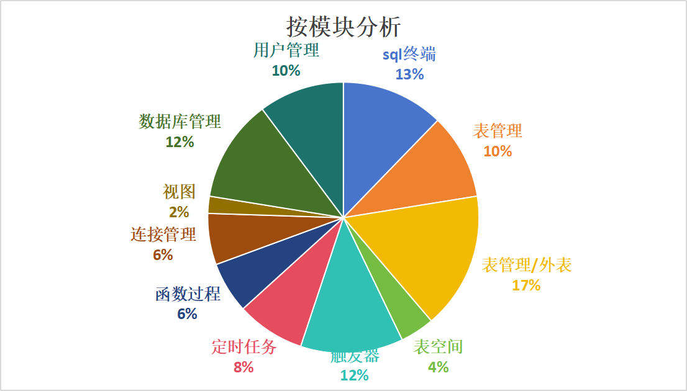

版权所有 © 2022 openGauss社区
您对“本文档”的复制、使用、修改及分发受知识共享(Creative Commons)署名—相同方式共享4.0国际公共许可协议(以下简称“CC BY-SA
4.0”)的约束。为了方便用户理解，您可以通过访问https://creativecommons.org/licenses/by-sa/4.0/ 了解CC BY-SA 4.0的概要 (
但不是替代)。CC BY-SA 4.0的完整协议内容您可以访问如下网址获取：https://creativecommons.org/licenses/by-sa/4.0/legalcode。
修订记录

| 日期         | 修订   版本 | 修改描述   | 作者           |
|------------|---------|--------|--------------|
| 2023.12.27 | V1.0    | 新建     | Feiling Peng |
| 2024.01.11 | V2.0    | 更新遗留问题 | Feiling Peng |

关键词：

摘要：

缩略语清单：

| 缩略语 | 英文全名 | 中文解释 |
| ------ | -------- | -------- |
|        |          |          |

# 1     特性概述

版本包括的特性有：数据库连接、表结构与数据查询、序列创建与显示、同义词创建与显示、视图创建与显示、函数创建与执行、过程创建与执行、sql脚本执行、数据库管理、表管理、用户角色管理、触发器管理、定时任务管理、表空间管理、外表管理。

支持创建和管理数据库对象、执行 SQL 语句或 SQL 脚本、编辑和执行 PL/SQL
语句、数据库管理功能、连接删除、断开所有连接、连接区分来源、查询/删除保存的连接记录、定时任务的管理，通过支持存储调试功能精确定位到函数以及存储过程异常点，快速定位问题点并修改，降低排错难度提高工作效率。

1230版本新增/优化功能：

 （1）数据库管理：设置自动断连时间、超时自动重连

 （2）连接管理：增加是否保存口令、加密算法由AES128CBC(16位)改成AES256CBC(32位)

 （3）用户管理：编辑用户/角色、修改密码

 （4）表管理：创建/编辑/删除外表、创建/删除外部服务器（编辑外表只支持编辑数据，不支持编辑外表信息）

 （5）触发器：创建/删除触发器、重命名触发器

 （6）表空间：创建/编辑/删除表空间

 （7）复制数据库对象：表空间复制DDL、视图复制DDL和数据、序列复制DDL、函数过程复制DDL、外表复制DDL和数据、表复制DDL和数据、用户/角色复制DDL

 （8）sql终端-使用终端：支持导出选中SQL语句

 （9）视图：查看视图数据支持分页

 （10）定时任务管理

 （11）IntarkDB替换SQLite


# 2     特性测试信息

本节描述被测对象的版本信息和测试的时间及测试轮次，包括依赖的硬件。

| 版本名称 | 测试起始时间              | 测试结束时间      |
|------|---------------------|-------------|
| 第一轮测试 | 2023.11.16|  2023.12.08 |
| 第二轮测试 | 2023.12.19| 2023.12.26  |

第一轮：

| 环境信息      | 配置信息                                                                                                     | 备注 |
| ------------- |----------------------------------------------------------------------------------------------------------| ---- |
| 虚拟机 | Intel Xeon Processor (Cascadelake) CPU @ 2.00GHz 8核<br/>内存：16GB<br/>硬盘：120G<br/>OS：CentOS Linux 7.6 <br> |
|软件| Java：openjdk 11.0.17 2022-10-18<br>python: 2.7.18<br>                                                    |      |
|数据库| openGauss 轻量版3.0.0<br>openGauss 企业版3.0.0<br>IntarkDB 1.0                                                 |

第二轮：

| 环境信息      | 配置信息                                                 | 备注 |
| ------------- | ------------------------------------------------------------ | ---- |
| 虚拟机 | Intel Xeon Processor (Cascadelake) CPU @ 2.00GHz 8核<br/>内存：16GB<br/>硬盘：150G<br/>OS：CentOS Linux 7.6 <br> |
|软件|Java：openjdk 11.0.17 2022-10-18<br>python: 2.7.5<br>|      |
|数据库|openGauss 轻量版3.0.0<br>openGauss 企业版3.0.0<br>IntarkDB 1.0 |

# 3     测试结论概述

## 3.1   测试整体结论

进行了2轮测试，覆盖了连接管理、函数过程、表管理、数据库管理、用户管理、视图、序列、同义词特性，本版本新增了213个测试用例，整个测试过程覆盖了功能测试、接口测试、性能测试。
本次测试总共发现52个问题（其中46个为开发bug，6个为功能建议），目前遗留了1个问题，整体质量良好，可供DBA日常使用。

| 测试活动 | 活动评价                                                                                                                                                                                         |
|----|----------------------------------------------------------------------------------------------------------------------------------------------------------------------------------------------|
|功能测试| 测试数据库管理设置自动断连时间、超时自动重连，连接增加是否保存口令、加密算法改成AES256CBC(32位)、编辑用户/角色、修改密码、外表管理、创建/删除外部服务器、创建/删除触发器、重命名触发器、创建/编辑/删除表空间、复制数据库对象、sql终端支持导出选中SQL语句、查看视图数据支持分页、IntarkDB替换SQLite，以及原基本功能、插件启用停用，测试达到预期结果 |
|接口测试| 测试目前已有的个接口，执行了199个用例，覆盖了128个接口，测试达到预期结果                                                                                                                                                      |
|性能测试| 测试了22个接口，及执行期间的资源消耗情况。测试与预期结果存在一些差距，日常并发量不高的情况下不影响使用。                                                                                                                                        |

## 3.2   约束说明

**函数/过程**
（1）在“**SQL** **终端**”或“**创建函数**/**过程**”向导创建的函数/过程须以“/”结尾，表示函数/过程的结尾。

**调试**
（1）安装openGauss3.1.0及以上
​（2）安装 pldebugger 插件3.0及以上
（3）仅支持plpgsql语言的调试

**项目运行**
（1）本项目依赖主平台的web-socket，若需要使用本项目所有功能，只能通过编译成 jar 包的形式作为插件运行在主平台上，若需单独运行将影响
SQL 终端语句执行、调试函数/过程等功能的使用。
（2）部署安装时需设置心跳时间小于平台token过期时间，
调整心跳方法：在`plugins/data-studio/web-ui/src/config/index.ts`修改配置心跳时间（单位：毫秒）

```javascript
// websocket心跳时间
export const wsHeartbeatTime = 1000 * 30;
// http心跳时间
export const httpHeartbeatTime = 1000 * 30;
```
（3）外表管理功能需要当前操作数据库为企业版，外部服务器创建需要当前操作用户具有管理权限。

（4）替换sqlite后无配置可便捷切换回sqlite

## 3.3   遗留问题分析

### 3.3.1 遗留问题影响以及规避措施

| 问题单号 | 问题描述                   | 问题级别    | 问题影响和规避措施                                                                                                                                                            | 当前状态 |
|------|------------------------|-----------|----------------------------------------------------------------------------------------------------------------------------------------------------------------------|------|
|710035813|	模式导出DDL和数据_会报错|一般| 数据量达百万级数时，导出数据量过大，代码处理是将数据全部查询出来并拼接成insert into语句字符串，导致java堆内存溢出。<br>规避：有百万级数据量时，分表单独导出数据，暂不要整个模式数据全部导出<br>下个版本修改方案：分批次查询数据，每次查询一千条，查询完之后组装成insert into 语句并立即记录到文件中。 |	新建|


### 3.3.2 问题统计

|        | 问题总数 | 关键  | 重要  | 一般  | 提示  |
| ------ |------|-----|-----|-----|-----|
| 数目   | 52   | 0   | 18  | 32  | 2   |
| 百分比 | 100% | 0%  | 35% | 61% | 4%  |

# 4     测试执行

## 4.1   测试执行统计数据

*本节内容根据测试用例及实际执行情况进行特性整体测试的统计，可根据第二章的测试轮次分开进行统计说明。*

| 版本名称 | 测试用例数 | 用例执行结果       | 发现问题单数 |
|------|-------|--------------|--------|
| 第一轮测试  | 926   | 执行218，通过率80% |  45    |
| 第二轮测试  | 926   | 执行452，通过率98% |  7    |

进行问题回归后，测试用例数926，通过率99%。

*数据项说明：*

*测试用例数－－到本测试活动结束时，所有可用测试用例数；*

*发现问题单数－－本测试活动总共发现的问题单数。

## 4.2 测试执行步骤

### 4.2.1 数据库管理
| 测试步骤                                   | 测试结果                               |
|----------------------------------------|------------------------------------|
| 1、设置自动断连时间、超时自动重连（包括数据库重启后可连接）（1230版本） | 执行14条用例，发现3个bug，现已修复且验证通过          |
| 2、创建/编辑/删除模式，模式导出DDL和数据，数据库对象显示        | 执行24条用例，发现3个bug，遗留1个bug，其他已修复且验证通过 |

### 4.2.2 连接管理
| 测试步骤                             | 测试结果                      |
|----------------------------------|---------------------------|
| 1、增加是否保存口令、加密算法由AES128CBC(16位)改成AES256CBC(32位)（1230版本）  | 执行2条用例，发现1个bug，现已修复且验证通过  |
| 2、创建/编辑/删除/查看连接| 执行28条用例，发现2个bug，现已修复且验证通过 |

### 4.2.3 用户管理
| 测试步骤                             | 测试结果                      |
|----------------------------------|---------------------------|
| 1、编辑用户/角色、修改密码（1230版本）  | 执行23条用例，发现4个bug，现已修复且验证通过  |
| 2、复制DDL（1230版本）  | 执行3条用例，发现1个bug，现已修复且验证通过  |
| 3、创建/删除用户 | 执行27条用例，发现0个bug |

### 4.2.4 表管理
| 测试步骤                             | 测试结果                      |
|----------------------------------|---------------------------|
| 1、创建/编辑/删除外表、创建/删除外部服务器（编辑外表只支持编辑数据，不支持编辑外表信息）（1230版本）  | 执行25条用例，发现8个bug，现已修复且验证通过  |
| 2、复制DDL和数据（1230版本）  | 执行20条用例，发现2个bug，现已修复且验证通过  |
| 2、普通表/分区表的创建/编辑/删除（包括列、约束、索引、数据）| 执行61条用例，发现5个bug，现已修复且验证通过 |

### 4.2.5 触发器
| 测试步骤                             | 测试结果                      |
|----------------------------------|---------------------------|
| 1、创建/删除触发器、重命名触发器（1230版本）  | 执行43条用例，发现8个bug，现已修复且验证通过 |
| 2、复制DDL（1230版本）  | 执行3条用例，发现2个bug，现已修复且验证通过  |

### 4.2.6 表空间
| 测试步骤                             | 测试结果                      |
|----------------------------------|---------------------------|
| 1、创建/编辑/删除表空间、复制DDL（1230版本）  | 执行20条用例，发现2个bug，现已修复且验证通过  |
| 2、创建/编辑/删除表空间（1230版本）  | 执行3条用例，发现2个bug，现已修复且验证通过  |

### 4.2.7 sql终端
| 测试步骤                             | 测试结果                      |
|----------------------------------|---------------------------|
| 1、导出选中SQL语句（1230版本）  | 执行2条用例，发现1个bug，现已修复且验证通过  |
| 2、执行sql，查看/预览/删除sql执行历史记录，重命名sql终端，sql终端导入| 执行47条用例，发现5个bug，现已修复且验证通过 |

### 4.2.8 视图
| 测试步骤                             | 测试结果                      |
|----------------------------------|---------------------------|
| 1、查看视图数据分页切换、单页显示条数（1230版本）  | 执行1条用例，发现0个bug  |
| 2、复制DDL和数据（1230版本）  | 执行11条用例，发现0个bug  |
| 3、创建/编辑/删除视图| 执行12条用例，发现1个bug，现已修复且验证通过 |

### 4.2.9 定时任务
| 测试步骤                             | 测试结果                      |
|----------------------------------|---------------------------|
| 1、创建/查看/编辑/删除/禁用/启用定时任务（1230版本）  | 执行26条用例，发现2个bug，现已修复且验证通过  |

### 4.2.10 IntarkDB替换SQLite
| 测试步骤                             | 测试结果                      |
|----------------------------------|---------------------------|
| 1、检查数据库文件（1230版本）  | 执行1条用例，发现0个bug。  |

### 4.2.11 序列/函数过程/同义词
| 测试步骤                             | 测试结果                      |
|----------------------------------|---------------------------|
| 1、序列复制DDL、新建/编辑/删除序列 | 执行8条用例，发现0个bug。  |
| 2、函数过程复制DDL、新建/编辑/删除函数过程、函数过程调试，标签页操作 | 执行71条用例，发现3个bug，现已修复且验证通过 |
| 3、同义词程复制DDL、新建/编辑/删除同义词 | 执行7条用例，发现0个bug。 |
| 4、窗口拖动、标签页操作 | 执行17条用例，发现0个bug。 |

### 4.3 1230版本新增功能的测试执行数据

| 功能            | 测试用例数 | 用例最终执行结果     | 发现问题单数 |点灯|备注|
|---------------|-------|--------------|--------|---|---|
| 设置自动断连时间、超时自动重连          | 14     | 执行14，通过率99%  | 2      |绿灯||
| 增加是否保存口令、加密算法由AES128CBC(16位)改成AES256CBC(32位)           | 2    | 执行2，通过率100%  | 24     |绿灯|
| 编辑用户/角色、修改密码 | 23    | 执行23，通过率100%  | 6      |绿灯|
| 创建/编辑/删除外表、创建/删除外部服务器（编辑外表只支持编辑数据，不支持编辑外表信息）| 25    | 执行25，通过率100% | 5      |绿灯|
| 创建/删除触发器、重命名触发器         | 43    | 执行8，通过率100% | 5      |绿灯|
| 创建/编辑/删除表空间         | 20    | 执行34，通过率100% | 5      |绿灯|
| 复制数据库对象         | 45    | 执行45，通过率100% | 5      |绿灯|
| sql终端-使用终端：支持导出选中SQL语句         | 2    | 执行2，通过率100% | 5      |绿灯|
| 查看视图数据支持分页         | 1    | 执行1，通过率100% | 5      |绿灯|
| 定时任务管理         | 26    | 执行26，通过率100% | 5      |绿灯||
| IntarkDB替换SQLite      | 1    | 执行1，通过率100% | 5      |绿灯|

*数据项说明：*

*测试用例数－－到本测试活动结束时，所有可用测试用例数；*

*用例最终执行结果－－在问题修复后，最终用例执行情况。*

*发现问题单数－－本测试活动总共发现的问题单数。

## 4.3 问题分析

**本版本（1230版本），新功能的问题主要集中在外表、触发器。多种类型触发器的设计与实现问题（前端页面控制未符合内核功能，后端语法实现查看truncate和update类型有误），外表非必填字段的空值处理问题、当前表与远端表不一致时的查询问题。**
**原有功能的问题主要集中在表管理，例如纯数字或含有中文的兼容处理。**

以下为1230版本问题的分布图（统计不包括功能建议）：




## 4.2 性能测试
本次性能测试共执行3个性能测试脚本，测试表创建/查询、触发器创建/查询、视图创建/查询、用户创建查询、sql执行历史记录查询相关接口的性能。并发用户数设置100，每秒增加20个用户，执行120秒。
执行性能测试脚本期间同时执行资源占用采集脚本，以测试该期间的资源占用情况。

接口性能预期RPS在10以上，目前单次执行测试脚本，总的RPS在29以上，单接口大多在7以上。预期最大响应时间不超过3s，目前大部分符合要求。其中表管理、触发器与触发器函数接口还需继续优化。

资源占用预期内存、CPU均不超过70%，目前均值未超过，最大值均超过，还需优化。

**（1）表管理**

|Method|Name|# Requests|# Fails|Average (ms)|Min (ms)|Max (ms)|Average size (bytes)|RPS|Failures/s|50%ile (ms)|60%ile (ms)|70%ile (ms)|80%ile (ms)|90%ile (ms)|95%ile (ms)|99%ile (ms)|100%ile (ms)|
|---|---|---|---|---|---|---|---|---|---|---|---|---|---|---|---|---|---|
|POST|/dataStudio/web/v1/export/schema/ddl|296|0|12491|27|82857|242|2.5|0.0|8300|9600|12000|20000|32000|42000|73000|83000|
|POST|/dataStudio/web/v1/foreignTable/query/server|333|0|1333|35|3339|51|2.8|0.0|1300|1500|1800|2200|2500|2800|3300|3300|
|GET|/dataStudio/web/v1/metaData/schemaList|338|0|1544|38|3960|21905|2.8|0.0|1500|1900|2100|2400|2700|2900|3200|4000|
|GET|/dataStudio/web/v1/metaData/schemaObjectList|797|0|2607|31|6211|259558|6.7|0.0|2800|3200|3700|4000|4600|4900|5600|6200|
|POST|/dataStudio/web/v1/schema/create|339|0|1491|34|3879|120|2.8|0.0|1500|1800|2000|2300|2700|2900|3600|3900|
|POST|/dataStudio/web/v1/table|525|0|2445|29|9127|48|4.4|0.0|2300|2600|2900|3500|4300|6300|8000|9100|
|POST|/dataStudio/web/v1/trigger/create|55|0|2875|479|5905|99|0.5|0.0|2900|3000|3100|3800|4600|4800|5900|5900|
|POST|/dataStudio/web/v1/trigger/createFunction|122|0|1756|59|3742|55|1.0|0.0|1700|2100|2300|2700|3100|3400|3600|3700|
|POST|/dataStudio/web/v1/trigger/query|19|0|1752|629|3041|295|0.2|0.0|1800|2000|2200|2200|2800|3000|3000|3000|
|POST|/dataStudio/web/v1/trigger/queryFunction|86|0|1879|82|4060|1728|0.7|0.0|2000|2200|2400|2400|3200|3400|4100|4100|
|GET|/plugins/webds-plugin/dataStudio/web/v1/metaData/schemaObjectList?connectionName=press_table_20231228135653689aab98ddbcf559ec4bf1b0fa24fc8e81c45b52&schema=pfl&uuid=0f205e39-d3ed-4526-a244-8cd0f2ac8d4e&webUser=1|292|0|70|3|931|84|2.4|0.0|19|24|34|67|210|370|870|930|
|POST|/plugins/webds-plugin/dataStudio/web/v1/table|295|0|52|2|988|84|2.5|0.0|14|20|24|34|88|190|860|990|
| |Aggregated|3497|0|2612|2|82857|61379|29.3|0.0|1700|2200|2600|3300|4500|7200|31000|83000|


**（2）sql终端**

|Method|Name|# Requests|# Fails|Average (ms)|Min (ms)|Max (ms)|Average size (bytes)|RPS|Failures/s|50%ile (ms)|60%ile (ms)|70%ile (ms)|80%ile (ms)|90%ile (ms)|95%ile (ms)|99%ile (ms)|100%ile (ms)|
|---|---|---|---|---|---|---|---|---|---|---|---|---|---|---|---|---|---|
|POST|/plugins/webds-plugin/dataStudio/web/v1/sqlHistory/insert|30055|0|33|3|443|84|250.2|0.025|29|35|43|63|86|150|440|
|POST|/plugins/webds-plugin/dataStudio/web/v1/sqlHistory/query|30055|0|191|16|1666|8669|250.2|0.0|140|180|220|290|420|540|820|1700|
|POST|/plugins/webds-plugin/dataStudio/web/v1/sqlHistory/query?webUser=1|30354|0|162|8|1777|2|252.7|0.0|110|150|190|260|380|510|780|1800|
| |Aggregated|90464|0|129|3|1777|2908|753.1|0.0|63|95|140|210|330|450|730|1800|

**（3）视图**

|Method|Name|# Requests|# Fails|Average (ms)|Min (ms)|Max (ms)|Average size (bytes)|RPS|Failures/s|50%ile (ms)|60%ile (ms)|70%ile (ms)|80%ile (ms)|90%ile (ms)|95%ile (ms)|99%ile (ms)|100%ile (ms)|
|---|---|---|---|---|---|---|---|---|---|---|---|---|---|---|---|---|---|
|GET|/dataStudio/web/v1/metaData/resource|1588|0|799|113|1789|24|13.3|0.0|790|890|990|1100|1200|1300|1400|1800|
|GET|/dataStudio/web/v1/metaData/schemaObjectList|859|0|1540|537|2868|314207|7.2|0.0|1500|1600|1700|1900|2200|2300|2600|2900|
|GET|/dataStudio/web/v1/metaData/user|1576|0|871|141|1871|2780|13.2|0.0|850|980|1100|1200|1300|1400|1600|1900|
|POST|/dataStudio/web/v1/table|871|0|1000|335|2044|4|7.3|0.0|950|1100|1200|1300|1500|1600|1800|2000|
|POST|/dataStudio/web/v1/tableDatas|859|0|22|3|320|34|7.2|0.0|12|15|18|24|33|68|250|320|
|POST|/dataStudio/web/v1/user/create/|782|0|989|348|1913|0|6.6|0.0|1000|1100|1200|1200|1400|1500|1600|1900|
|POST|/dataStudio/web/v1/user/create/preview|791|0|17|2|349|331|6.6|0.0|7|10|14|21|37|71|170|350|
|DELETE|/dataStudio/web/v1/user/drop|777|0|889|258|1770|0|6.5|0.0|880|970|1000|1100|1300|1400|1600|1800|
|GET|/dataStudio/web/v1/viewDatas|843|0|883|243|2257|115|7.1|0.0|850|940|1000|1100|1300|1500|2000|2300|
|POST|/dataStudio/web/v1/viewDdls|826|0|881|206|2285|117|6.9|0.0|880|980|1100|1200|1300|1400|1600|2300|
|DELETE|/dataStudio/web/v1/views|806|0|1559|422|2792|34|6.8|0.0|1500|1700|1800|2000|2200|2300|2500|2800|
|POST|/dataStudio/web/v1/views|851|0|981|275|3304|26|7.1|0.0|900|1000|1200|1300|1500|1700|2600|3300|
| |Aggregated|11429|0|866|2|3304|24049|95.8|0.0|870|1000|1100|1300|1500|1800|2300|3300|

*数据项说明：*
* Fails：请求失败数*
* Average (ms)：平均请求响应时间
* Min (ms)：最小请求响应时间
* Max (ms)：最大请求响应时间
* Average size (bytes)：平均请求包大小
* RPS：每秒中处理请求的数量
* Failures/s：请求失败率
* 50%ile (ms)：50%的请求响应时间小于该值
* 60%ile (ms)：60%的请求响应时间小于该值
* 70%ile (ms)：70%的请求响应时间小于该值
* 80%ile (ms)：80%的请求响应时间小于该值
* 90%ile (ms)：90%的请求响应时间小于该值
* 95%ile (ms)：95%的请求响应时间小于该值
* 99%ile (ms)：99%的请求响应时间小于该值
* 100%ile (ms)：100%的请求响应时间小于该值
* Aggregated：本次执行结果汇总数据

**（4）资源占用**

|进程/线程|关键字|	说明|	是否监控|结果|
|---|---|---|---|---|
|gaussdb|	gaussdb|		opengauss数据库进程|	是|（1）执行期间根据请求建立较多线程，执行完成后线程会关闭<br>（2）单个线程内存占用从2.8%逐步增长到7%，平均占用4%，<br> (3)单个线程CPU占用最大达到89.7%，大部分在20%以下，平均在4%|
|datakit| server|		/ops/server+	datakit主平台进程|	是|（1）执行期间根据请求建立较多线程，执行完成后线程会关闭<br>（2）单个线程内存平均占用从18%逐步增长到40%，平均占用%<br>(3)单个线程CPU占用最大达到99%，大部分在40%以下，平均在16%|

## 4.3 接口测试

目前接口为内部接口，不对外开放。

| 接口数 | 用例数 | 通过率  |
|-----|-----|------|
| 128  | 199 | 100% |

| 类或模块名称 | 接口名称                       | 接口请求方法 | 接口地址 | 是否覆盖 | 是否通过   | 备注      |
|------------|----------------------------|--------|------------|------|--------|---------|
|表管理|表列|POST|/dataStudio/web/v1/tableColumns/edit| 是    | 是      |
|表管理|添加主键|POST|/dataStudio/web/v1/constraint/pk| 是    | 是      |
|表管理|关闭窗口|GET|/dataStudio/web/v1/tableDatas/close/{winId}| 是    | 是      |
|表管理|修改表数据|POST|/dataStudio/web/v1/tableDatas/edit| 是    | 是      |
|表管理|表空间|GET|/dataStudio/web/v1/metaData/tablespace/{uuid}| 是    | 是      |
|表管理|创建表DDL预览|POST|/dataStudio/web/v1/table/ddl| 是    | 是      |
|表管理|创建表|POST|/dataStudio/web/v1/table| 是    | 是      |
|表管理|截断表|POST|/dataStudio/web/v1/table/truncate| 是    | 是      |
|表管理|清理表|POST|/dataStudio/web/v1/table/vacuum| 是    | 是      |
|表管理|重建索引|POST|/dataStudio/web/v1/table/reindex| 是    | 是      |
|表管理|表重命名|POST|/dataStudio/web/v1/table/rename| 是    | 是      |
|表管理|设置描述|POST|/dataStudio/web/v1/table/comment| 是    | 是      |
|表管理|设置模式|POST|/dataStudio/web/v1/table/reschema| 是    | 是      |
|表管理|删除表|DELETE|/dataStudio/web/v1/table/drop| 是    | 是      |
|表管理|设置表空间|POST|/dataStudio/web/v1/table/retablespace| 是    | 是      |
|表管理|表相关序列|POST|/dataStudio/web/v1/table/sequence| 是    | 是      |
|表管理|表一般|POST|/dataStudio/web/v1/table/attribute| 是    | 是      |
|表管理|查询所有用户|POST|/dataStudio/web/v1/schema/query/users| 是    | 是      |
|表管理|查询函数覆盖率|POST|/dataStudio/web/v1/coverageRate/query| 是    | 是      |
|表管理|删除函数覆盖率记录|POST|/dataStudio/web/v1/coverageRate/delete| 是    | 是      |
|表管理|导出函数覆盖率记录|POST|/dataStudio/web/v1/coverageRate/export| 是    | 是      |
|表管理|表数据查询|POST|/dataStudio/web/v1/tableDatas| 是    | 是      |
|表管理|分区属性|GET|/dataStudio/web/v1/table/attribute/partition| 是    | 是      |
|表管理|分析表|POST|/dataStudio/web/v1/table/analyze| 是    | 是      |
|表管理|删除包|DELETE|/dataStudio/web/v1/drop/package| 是    | 是      |
|表管理|编辑约束|POST|/plugins/webds-plugin/dataStudio/web/v1/constraint| 是    | 是      |
|表管理|类型列表|GET|/dataStudio/web/v1/metaData/typeList/{uuid}| 是    | 是      |
|表管理|编辑索引|POST|/plugins/webds-plugin/dataStudio/web/v1/index| 是    | 是      |
|表管理|索引列表|GET|/plugins/webds-plugin/dataStudio/web/v1/tableIndexs| 是    | 是      |
|表管理|约束列表|GET|/plugins/webds-plugin/dataStudio/web/v1/tableConstraints| 是    | 是      |
|Connection management|Add connections|POST|/dataStudio/web/v1/connections| 是    | 是      |
|Connection management|获取连接断连时间|GET|/dataStudio/web/v1/connection/getTime| 是    | 是      |
|Connection management|Database Connectionll List|GET|/dataStudio/web/v1/connections| 是    | 是      |
|Connection management|Delete Connectionll|DELETE|/dataStudio/web/v1/connections/close| 是    | 是      |
|Connection management|Attribute|GET|/dataStudio/web/v1/connections/attribute| 是    | 是      |
|Connection management|Update Connections|PUT|/dataStudio/web/v1/connections/update| 是    | 是      |
|Connection management|Update Connections|PUT|/dataStudio/web/v1/connections| 是    | 是      |
|Connection management|断开重连|POST|/dataStudio/web/v1/reconnection| 是    | 是      |
|Metadata query|CREATE SEQUENCE|POST|/dataStudio/web/v1/sequences| 是    | 是      |
|Metadata query|CREATE SEQUENCE DDL|POST|/dataStudio/web/v1/sequences/action| 是    | 是      |
|Metadata query|CREATE SYNONYM|GET|/dataStudio/web/v1/synonyms| 是    | 是      |
|Metadata query|CREATE SYNONYM|POST|/dataStudio/web/v1/synonyms| 是    | 是      |
|Metadata query|CREATE SYNONYM DDL|POST|/dataStudio/web/v1/synonyms/action| 是    | 是      |
|Metadata query|CREATE VIEW|POST|/dataStudio/web/v1/views| 是    | 是      |
|Metadata query|CREATE VIEW DDL|POST|/dataStudio/web/v1/views/action| 是    | 是      |
|Metadata query|Column List|GET|/dataStudio/web/v1/metaData/columnList| 是    | 是      |
|Metadata query|DROP FunctionSP|DELETE|/dataStudio/web/v1/functionSP| 是    | 是      |
|Metadata query|DROP SEQUENCE|DELETE|/dataStudio/web/v1/sequences| 是    | 是      |
|Metadata query|DROP SYNONYM|DELETE|/dataStudio/web/v1/synonyms| 是    | 是      |
|Metadata query|DROP VIEW|DELETE|/dataStudio/web/v1/views| 是    | 是      |
|Metadata query|Database List|GET|/dataStudio/web/v1/metaData/databaseList| 是    | 是      |
|Metadata query|schemaObjectList|GET|/dataStudio/web/v1/metaData/schemaObjectList| 是    | 是      |
|Metadata query|Object List|GET|/dataStudio/web/v1/metaData/objectList| 是    | 是      |
|Metadata query|RETURN SEQUENCE DDL|POST|/dataStudio/web/v1/sequenceDdls| 是    | 是      |
|Metadata query|RETURN VIEW DDL|POST|/dataStudio/web/v1/viewDdls| 是    | 是      |
|Metadata query|SELECT VIEW|GET|/dataStudio/web/v1/viewDatas| 是    | 是      |
|Metadata query|Schema List|GET|/dataStudio/web/v1/metaData/schemaList| 是    | 是      |
|Metadata query|Table Column List|GET|/dataStudio/web/v1/tableColumns| 是    | 是      |
|Metadata query|Table Constraint List|GET|/dataStudio/web/v1/tableConstraints| 是    | 是      |
|Metadata query|Table DDL SQL|GET|/dataStudio/web/v1/tableDdls| 是    | 是      |
|Metadata query|Table Index List|GET|/dataStudio/web/v1/tableIndexs| 是    | 是      |
|Metadata query|connectionDatabase|POST|/dataStudio/web/v1/database/connection| 是    | 是      |
|Metadata query|createDatabase|POST|/dataStudio/web/v1/database/create| 是    | 是      |
|Metadata query|databaseAttribute|GET|/dataStudio/web/v1/database/attribute| 是    | 是      |
|Metadata query|deleteDatabase|DELETE|/dataStudio/web/v1/database/delete| 是    | 是      |
|Metadata query|renameDatabase|POST|/dataStudio/web/v1/database/rename| 是    | 是      |
|functionality controller|heartbeat|GET|/dataStudio/web/v1/functionality/heartbeat| 是    | 是      |
|SQL执行历史|查询SQL执行历史|POST|/dataStudio/web/v1/sqlHistory/query| 是    | 是      |
|SQL执行历史|更新SQL执行历史|POST|/dataStudio/web/v1/sqlHistory/update| 是    | 是      |
|SQL执行历史|删除SQL执行历史|POST|/dataStudio/web/v1/sqlHistory/delete| 是    | 是      |
|SQL执行历史|创建SQL执行历史|POST|/startRun| 是    | 是      |
|导入导出数据|导出表DDL和数据|POST|/dataStudio/web/v1/export/table/ddl| 是    | 是      |
|导入导出数据|导出表数据|POST|/dataStudio/web/v1/export/table/data| 是    | 是      |
|导入导出数据|导出函数/过程DDL|POST|/dataStudio/web/v1/export/function/ddl| 是    | 是      |
|导入导出数据|导出视图DDL|POST|/dataStudio/web/v1/export/view/ddl| 是    | 是      |
|导入导出数据|导出序列DDL|POST|/dataStudio/web/v1/export/sequence/ddl| 是    | 是      |
|导入导出数据|导出模式DDL和数据|POST|/dataStudio/web/v1/export/schema/ddl| 是    | 是      |
|导入导出数据|筛选条件导出表数据|POST|/dataStudio/web/v1/table/exportData| 是    | 是      |
|导入导出数据|导入表数据|POST|/dataStudio/web/v1/import/table/data| 是    | 是      |
|模式管理|创建模式|POST|/dataStudio/web/v1/schema/create| 是    | 是      |
|模式管理|查询单个模式|POST|/dataStudio/web/v1/schema/query| 是    | 是      |
|模式管理|修改模式|POST|/dataStudio/web/v1/schema/update| 是    | 是      |
|模式管理|删除模式|POST|/dataStudio/web/v1/schema/delete| 是    | 是      |
|列表|用户角色列表|GET|/dataStudio/web/v1/metaData/user| 是    | 是      |
|列表|资源池|GET|/dataStudio/web/v1/metaData/resource| 是    | 是      |
|用户管理|创建用户预览|POST|/dataStudio/web/v1/user/creat/preview| 是    | 是      |
|用户管理|创建用户|POST|/dataStudio/web/v1/user/creat/| 是    | 是      |
|用户管理|删除用户|DELETE|/dataStudio/web/v1/user/drop| 是    | 是      |
|用户管理|创建用户ddl|GET|/dataStudio/web/v1/user/ddl| 是    | 是      |
|用户管理|用户属性|GET|/dataStudio/web/v1/user/attribute| 是    | 是      |
|用户管理|修改用户密码|POST|/dataStudio/web/v1/user/password/update| 是    | 是      |
|用户管理|修改用户属性|POST|/dataStudio/web/v1/user/attribute/update| 是    | 是      |
|用户管理|修改用户属性ddl|POST|/dataStudio/web/v1/user/attribute/update/ddl| 是    | 是      |
|视图管理|编辑视图|POST|/dataStudio/web/v1/view/edit| 是    | 是      |
|视图管理|查看视图一般属性|POST|/dataStudio/web/v1/view/attribute| 是    | 是      |
|视图管理|查看视图列属性|POST|/dataStudio/web/v1/view/column| 是    | 是      |
|视图管理|查询视图|POST|/dataStudio/web/v1/view/query| 是    | 是      |
|表空间|创建表空间|POST|/dataStudio/web/v1/tablespace/create| 是    | 是      |
|表空间|编辑表空间|POST|/dataStudio/web/v1/tablespace/update| 是    | 是      |
|表空间|删除表空间|DELETE|/dataStudio/web/v1/tablespace/drop| 是    | 是      |
|表空间|查询表空间|GET|/dataStudio/web/v1/tablespace/attribute| 是    | 是      |
|表空间|表空间列表|GET|/dataStudio/web/v1/metaData/tablespace/list| 是    | 是      |
|触发器|查询触发器函数|POST|/dataStudio/web/v1/trigger/queryFunction| 是    | 是      |
|触发器|创建触发器函数|POST|/dataStudio/web/v1/trigger/createFunction| 是    | 是      |
|触发器|DDL预览|POST|/dataStudio/web/v1/trigger/ddlPreview| 是    | 是      |
|触发器|创建触发器|POST|/dataStudio/web/v1/trigger/create| 是    | 是      |
|触发器|启用触发器|POST|/dataStudio/web/v1/trigger/enable| 是    | 是      |
|触发器|禁用触发器|POST|/dataStudio/web/v1/trigger/disable| 是    | 是      |
|触发器|删除触发器|POST|/dataStudio/web/v1/trigger/delete| 是    | 是      |
|触发器|重命名触发器|POST|/dataStudio/web/v1/trigger/rename| 是    | 是      |
|触发器|触发器DDL|POST|/dataStudio/web/v1/trigger/showDdl| 是    | 是      |
|触发器|查询触发器|POST|/dataStudio/web/v1/trigger/query| 是    | 是      |
|外部表|查询所有服务|POST|/dataStudio/web/v1/foreignTable/query/server| 是    | 是      |
|外部表|创建外部表|POST|/dataStudio/web/v1/foreignTable/create| 是    | 是      |
|外部表|创建外部服务|POST|/dataStudio/web/v1/foreignTable/createServer| 是    | 是      |
|外部表|删除外部表|POST|/dataStudio/web/v1/foreignTable/delete| 是    | 是      |
|外部表|删除外部服务|POST|/dataStudio/web/v1/foreignServer/delete| 是    | 是      |
|外部表|显示外表DDL|POST|/dataStudio/web/v1/foreignTable/ddl| 是    | 是      |
|外部表|显示外表属性|POST|/dataStudio/web/v1/foreignTable/attribute| 是    | 是      |
|外部表|测试连接|POST|/dataStudio/web/v1/foreignTable/test| 是    | 是      |
|外部表|编辑表数据|POST|/dataStudio/web/v1/foreignTable/edit| 是    | 是      |
|定时任务|创建定时任务|POST|/dataStudio/web/v1/job/create| 是    | 是      |
|定时任务|查询定时任务列表|POST|/dataStudio/web/v1/job/queryList| 是    | 是      |
|定时任务|查询单个定时任务|POST|/dataStudio/web/v1/job/query| 是    | 是      |
|定时任务|编辑定时任务|POST|/dataStudio/web/v1/job/edit| 是    | 是      |
|定时任务|删除定时任务|POST|/dataStudio/web/v1/job/delete| 是    | 是      |
|定时任务|启用定时任务|POST|/dataStudio/web/v1/job/enable| 是    | 是      |
|定时任务|禁用定时任务|POST|/dataStudio/web/v1/job/disable| 是    | 是      |

## 4.4   后续测试建议

后续还需要进行UI自动化、性能自动化、接口测试、稳定性测试、兼容性测试、渗透测试。

# 5     附件

无
