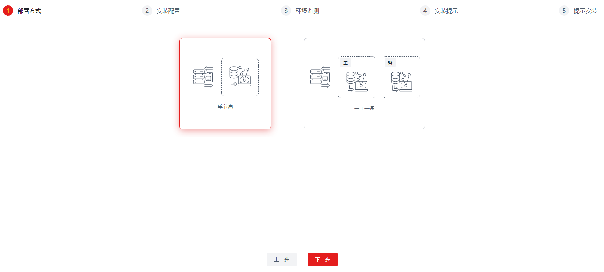

版权所有 © 2023  openGauss社区
 您对“本文档”的复制、使用、修改及分发受知识共享(Creative Commons)署名—相同方式共享4.0国际公共许可协议(以下简称“CC BY-SA 4.0”)的约束。为了方便用户理解，您可以通过访问https://creativecommons.org/licenses/by-sa/4.0/ 了解CC BY-SA 4.0的概要 (但不是替代)。CC BY-SA 4.0的完整协议内容您可以访问如下网址获取：https://creativecommons.org/licenses/by-sa/4.0/legalcode。

修订记录

| 日期       | 修订   版本 | 修改描述             | 作者        |
| :--------- | ----------- | -------------------- | ----------- |
| 2023-12-22 | 1.0         | 特性测试报告初稿完成 | yangyixiang |

 关键词： 

openGauss、datakit、base-ops、可视化运维

摘要：

本文档主要介绍datakit基础运维插件Base-Ops的测试结果。

缩略语清单：

| 缩略语 | 英文全名 | 中文解释 |
| ------ | -------- | -------- |
| 无     |          |          |

# 1     特性概述

- 工具本身的安装部署达到一键化
- 可视化安装openGauss（单机和主备），三种方式：CM、OM、gs_ctl；为了降低数据库安装门槛，做到一键化部署、卸载、组件化安装、多版本升级
- 数据库参数配置以guc参数为准
- 运维对接CM，支持集群展示和管理
- 触发WDR的收集，提供快照的设置，并且可以基于两个快照生成报告（html格式）
- 系统提供执行SQL

# 2     特性测试信息

| 版本名称                                                     | 测试起始时间 | 测试结束时间 |
| ------------------------------------------------------------ | ------------ | ------------ |
| openGauss-datakit-5.1.1 base-ops 5.1.1 openGauss 5.1.1 openGauss 5.1.0 openGauss 5.0.0 openGauss 3.0.0 Chrome 111.0.5563.64 Firefox 18.5.0.0 | 2023-11-30   | 2023-12-20   |
| openGauss-datakit-5.1.1 base-ops 5.1.1 openGauss 5.1.1 openGauss 5.1.0 openGauss 5.0.0 openGauss 3.0.0 Chrome 111.0.5563.64 Firefox 18.5.0.0 | 2023-12-21   | 2023-12-21   |

| 硬件型号          | 硬件配置信息                                                 | 备注 |
| ----------------- | ------------------------------------------------------------ | ---- |
| x86+centOS        | Intel(R) Xeon(R) Platinum 8378A CPU @ 3.00GHz 8核 内存：30GB 硬盘：59G OS：CentOS Linux release 7.6.1810 (Core) |      |
| x86+centOS        | Intel(R) Xeon(R) Gold 6278C CPU @ 2.60GHz 8核 内存：15GB 硬盘：197G OS：CentOS Linux release 7.6.1810 (Core) |      |
| x86+openEuler     | Intel(R) Xeon(R) Gold 6266C CPU @ 3.00GHz 8核 内存：15GB 硬盘：98G OS：openEuler release 20.03 (LTS-SP1) |      |
| x86+openEuler     | Intel(R) Xeon(R) Gold 6266C CPU @ 3.00GHz 8核 内存：15GB 硬盘：98G OS：openEuler release 20.03 (LTS-SP1) |      |
| x86+openEuler     | Intel(R) Xeon(R) Gold 6266C CPU @ 3.00GHz 8核 内存：15GB 硬盘：98G OS：openEuler release 20.03 (LTS-SP1) |      |
| aarch64+openEuler | Kunpeng-920 8核 内存：62GB 硬盘：492G OS：openEuler release 20.03 (LTS-SP3) |      |

# 3     测试结论概述

## 3.1   测试整体结论

可视化运维共计执行233条用例，主要覆盖了功能测试、兼容性测试、易用性测试、资料测试。功能测试覆盖集群管理、一键安装、集群安装、批量升级、集群监控、日志分析、WDR报告、SQL诊断、安装包管理、自定义控制台、备份恢复。兼容性测试验证在chrome浏览器、firefox浏览器上的使用，网页元素位置是否混乱、错位，页面的格式，字体，输入框，下拉框，复选框， 按钮是否正常显示。易用性测试覆盖检查web页面的布局、UI设计是否合理，操作顺序是否符合逻辑。资料测试覆盖资料的一致性、准确性。累计发现缺陷单12个，11个缺陷均已解决且回归通过，1个缺陷未解决。整体质量良好。

| 测试活动   | 活动评价                                                     |
| ---------- | :----------------------------------------------------------- |
| 功能测试   | 集群管理功能验证对集群进行启动、停止、重启、备份、一键自检等操作，对实例进行启动、停止、重启、主备切换、设置guc参数等操作，查看集群信息是否正确展示。测试通过。 |
| 功能测试   | 一键安装功能验证不同系统能否成功一键安装极简版数据库。集群安装功能验证不同系统安装或导入极简版、轻量版、企业版数据库。测试通过。 |
| 功能测试   | 批量升级功能验证不同系统架构下的集群单个升级或多个升级为更高的数据库版本。测试通过。 |
| 功能测试   | 集群监控功能验证能否正确显示集群的状态，包括CPU使用率、内存占用率、网络状态、锁、会话、连接数、占用内存最多的会话。日志分析功能验证能否查看或下载集群的系统日志、操作日志、审计日志、性能日志、黑匣子日志。测试通过。 |
| 功能测试   | WDR报告功能验证搜索、创建、删除快照，验证是否可以根据快照生成不同类型WDR报告并搜索、查看、删除。SQL诊断功能验证设置参数log_min_duration_statement后，在数据库中执行sql，查看SQL诊断是否可以显示集群的慢SQL。测试通过。 |
| 功能测试   | 安装包管理功能验证能否正常搜索、新增、修改、删除不同系统架构、不同版本的安装包。自定义控制台功能验证能否打开多个终端并正常执行命令。备份恢复功能验证能否正常搜索、回复、删除集群备份。测试通过。 |
| 兼容性测试 | 验证在chrome浏览器、firefox浏览器上的使用，网页元素位置是否混乱、错位，页面的格式，字体，输入框，下拉框，复选框， 按钮是否正常显示。测试通过。 |
| 易用性测试 | 检查web页面的布局、UI设计是否合理，操作顺序是否符合逻辑。测试通过。 |
| 资料测试   | 校验资料的资料的一致性、准确性。测试通过。                   |

## 3.2   约束说明

-  当前平台运行依赖于openJdk11。

-  平台使用的数据库，当前仅支持openGauss数据库，并且需要提前创建database。

-  需要将部署服务器IP配置在平台使用的数据库（openGauss）的白名单列表中。

-  平台默认的登录账号密码：admin/admin123，请在首次登录后及时修改密码。

-  注意，如果是openEuler操作系统，需要手动先设置umask值为022，设置命令： umask 022

### 3.3.1 遗留问题影响以及规避措施

| 问题单号                                                     | 问题描述                                                     | 问题级别 | 问题影响和规避措施               | 当前状态 |
| :----------------------------------------------------------- | :----------------------------------------------------------- | :------- | :------------------------------- | :------- |
| [I8LM3U](https://gitee.com/opengauss/openGauss-workbench/issues/I8LM3U?from=project-issue) | 【测试类型：工具功能】【测试版本：5.1.1】【DataKit】集群一键自检功能异常 | 次要     | 一键自检功能异常，待下个版本解决 | 次要     |

### 3.3.2 问题统计

|        | 问题总数 | 严重 | 主要 | 次要 | 不重要 |
| ------ | -------- | ---- | ---- | ---- | ------ |
| 数目   | 12       | 0    | 0    | 12   | 0      |
| 百分比 | 100%     | 0%   | 0%   | 100% | 0%     |

###  3.3.3 问题单汇总

| 序号 | issue号                                                      | 问题级别 | 问题简述                                                     | 问题状态 |
| ---- | ------------------------------------------------------------ | -------- | ------------------------------------------------------------ | -------- |
| 1    | [I8LHTW](https://gitee.com/opengauss/openGauss-workbench/issues/I8LHTW?from=project-issue) | 次要     | 【测试类型：工具功能】【测试版本：5.1.1】【DataKit】集群安装数据库，安装依赖报错导致装库失败 | 已验收   |
| 2    | [I8LHZV](https://gitee.com/opengauss/openGauss-workbench/issues/I8LHZV?from=project-issue) | 次要     | 【测试类型：工具功能】【测试版本：5.1.1】【DataKit】环境分离的数据库在恢复备份时没有source环境变量 | 已验收   |
| 3    | [I8LI3O](https://gitee.com/opengauss/openGauss-workbench/issues/I8LI3O?from=project-issue) | 次要     | 【测试类型：工具功能】【测试版本：5.1.1】【DataKit】集群升级解压安装包错误导致升级失败 | 已验收   |
| 4    | [I8LIBW](https://gitee.com/opengauss/openGauss-workbench/issues/I8LIBW?from=project-issue) | 次要     | 【测试类型：工具功能】【测试版本：5.1.1】【DataKit】生成WDR报告未限制快照的时间先后顺序，导致生成的报告为空白文件 | 已验收   |
| 5    | [I8LK90](https://gitee.com/opengauss/openGauss-workbench/issues/I8LK90?from=project-issue) | 次要     | 【测试类型：工具功能】【测试版本：5.1.1】【DataKit】sql诊断功能无法显示慢sql | 已验收   |
| 6    | [I8LM3U](https://gitee.com/opengauss/openGauss-workbench/issues/I8LM3U?from=project-issue) | 次要     | 【测试类型：工具功能】【测试版本：5.1.1】【DataKit】集群一键自检功能异常 | 修复中   |
| 7    | [I8LMSW](https://gitee.com/opengauss/openGauss-workbench/issues/I8LMSW?from=project-issue) | 次要     | 【测试类型：工具功能】【测试版本：5.1.1】【DataKit】集群管理guc参数设置，每页显示参数数量功能失效 | 已验收   |
| 8    | [I8M4AM](https://gitee.com/opengauss/openGauss-workbench/issues/I8M4AM?from=project-issue) | 次要     | 【测试类型：工具功能】【测试版本：5.1.1】【DataKit】安装轻量版一主一备指定端口未生效，安装命令缺少指定端口导致安装失败 | 已验收   |
| 9    | [I8MFC3](https://gitee.com/opengauss/openGauss-workbench/issues/I8MFC3?from=project-issue) | 次要     | 【测试类型：工具功能】【测试版本：5.1.1】【DataKit】集群管理极简版1主1备，停止或启动单个实例会导致所有实例停止或启动 | 已验收   |
| 10   | [I8MMT6](https://gitee.com/opengauss/openGauss-workbench/issues/I8MMT6?from=project-issue) | 次要     | 【测试类型：工具功能】【测试版本：5.1.1】【DataKit】轻量版一主一备导入失败，报错找不到文件 | 已验收   |
| 11   | [I8MMYU](https://gitee.com/opengauss/openGauss-workbench/issues/I8MMYU?from=project-issue) | 次要     | 【测试类型：工具功能】【测试版本：5.1.1】【DataKit】自定义控制台使用vi命令无法查看文件内容 | 已验收   |
| 12   | [I8MU3K](https://gitee.com/opengauss/openGauss-workbench/issues/I8MU3K?from=project-issue) | 次要     | 【测试类型：工具功能】【测试版本：5.1.1】【DataKit】集群管理设置guc参数，不勾选应用到所有实例，实际仍应用到了所有实例 | 已验收   |

# 4     测试执行

## 4.1 测试执行步骤

###  4.1.1 插件安装与卸载

| 测试步骤：                                        | 测试结果                 |
| ------------------------------------------------- | ------------------------ |
| 1. 验证base-ops插件能否正常安装、卸载、启用、停用 | 执行1条用例，未发现bug。 |

###  4.1.2 集群管理

| 测试步骤：                                                   | 测试结果                                       |
| ------------------------------------------------------------ | ---------------------------------------------- |
| 1. 验证单节点集群的启动、停止、重启、备份、卸载、强制卸载、删除集群、一键自检操作是否正常，实例的启动、停止、重启、生成配置操作是否正常 2. 验证多节点集群的启动、停止、重启、备份、卸载、强制卸载、删除集群、一键自检操作是否正常，实例的启动、停止、重启、生成配置、主备切换、节点重建操作是否正常 | 执行10条用例，发现4个bug，现已修复且验收通过。 |

### 4.1.3 一键安装与集群安装

| 测试步骤：                                                   | 测试结果                                        |
| ------------------------------------------------------------ | ----------------------------------------------- |
| 1. 验证一键安装openGauss极简版功能，覆盖centOS_x86、openEuler_x86、openEuler_arm环境。 2. 验证集群安装的安装和导入极简版、轻量版、企业版openGauss，覆盖centOS_x86、openEuler_x86、openEuler_arm环境。 3. 验证在安装中注入故障后，安装页面是否合理报错并可以手动恢复后重试 | 执行153条用例，发现3个bug，现已修复且验收通过。 |

### 4.1.4 批量升级

| 测试步骤：                                                   | 测试结果                                      |
| ------------------------------------------------------------ | --------------------------------------------- |
| 1. 验证升级单个集群后提交升级、升级回滚，升级多个集群后提交升级、升级回滚 2. 验证批量升级的搜索、刷新集群功能是否正常 3. 验证升级集群环境检查、执行升级步骤注入故障时是否合理报错，报错后取消升级或重试 | 执行9条用例，发现1个bug，现已修复且验收通过。 |

### 4.1.5 基础运维

| 测试步骤：                                                   | 测试结果                                         |
| ------------------------------------------------------------ | ------------------------------------------------ |
| 1. 集群监控功能验证能否正确显示集群的状态，包括CPU使用率、内存占用率、网络状态、锁、会话、连接数、占用内存最多的会话。 2. 日志分析功能验证能否查看或下载集群的系统日志、操作日志、审计日志、性能日志、黑匣子日志。 3. WDR报告功能验证搜索、创建、删除快照，验证是否可以根据快照生成不同类型WDR报告并搜索、查看、删除。 4. 安装包管理功能验证能否正常搜索、新增、修改、删除不同系统架构、不同版本的安装包。 5. 自定义控制台功能验证能否打开多个终端并正常执行命令。 6. 备份恢复功能验证能否正常搜索、回复、删除集群备份。 | 执行17条用例，发现4个bug，，现已修复且验收通过。 |

### 4.1.6 兼容性测试

| 测试步骤：                                                   | 测试结果                  |
| ------------------------------------------------------------ | ------------------------- |
| 1.验证在chrome浏览器、firefox、edge浏览器上功能是否正常使用，网页元素位置是否混乱、错位，页面的格式，字体，输入框，下拉框，复选框， 按钮是否正常显示。 2.Datakit自身适配openEuler aarch64及x86_x64、centos x86_x64。 | 执行42条用例，未发现bug。 |

### 4.1.7 易用性测试

| 测试步骤：                                                   | 测试结果    |
| ------------------------------------------------------------ | ----------- |
| 1.检查web页面的布局、UI设计是否合理，操作顺序是否符合逻辑，功能是否便于使用。 | 未发现bug。 |

### 4.1.8 资料测试

| 测试步骤：                         | 测试结果    |
| ---------------------------------- | ----------- |
| 1.校验资料的资料的一致性、准确性。 | 未发现bug。 |

## 4.2  测试执行统计数据

| 版本名称                                                     | 测试用例数 | 用例执行结果              | 发现问题单数 |
| ------------------------------------------------------------ | ---------- | ------------------------- | ------------ |
| openGauss-datakit-5.1.1 base-ops 5.1.1 openGauss 5.1.1 openGauss 5.1.0 openGauss 5.0.0 openGauss 3.0.0 Chrome 111.0.5563.64 Firefox 18.5.0.0 | 233        | Passed：219 Failed：14 | 12           |
| openGauss-datakit-5.1.1 base-ops 5.1.1 openGauss 5.1.1 openGauss 5.1.0 openGauss 5.0.0 openGauss 3.0.0 Chrome 111.0.5563.64 Firefox 18.5.0.0 | 13         | Passed：13 Failed：0  | 0            |

*数据项说明：*

* 累计发现缺陷单12个，11个缺陷均已解决且回归通过，1个缺陷未解决。
* 缺陷密度为12个(缺陷个数)/51.324kloc(代码行数)=0.23(个/kloc)

## 4.3   后续测试建议

建议测试在safari浏览器使用时功能是否正常

# 5     附件

##  5.1 集群安装极简版示例

