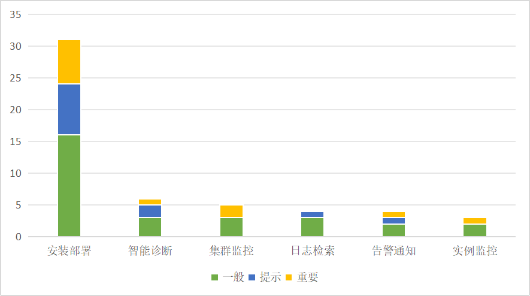

版权所有 © 2022 openGauss社区
您对“本文档”的复制、使用、修改及分发受知识共享(Creative Commons)署名—相同方式共享4.0国际公共许可协议(以下简称“CC BY-SA
4.0”)的约束。为了方便用户理解，您可以通过访问https://creativecommons.org/licenses/by-sa/4.0/ 了解CC BY-SA 4.0的概要 (
但不是替代)。CC BY-SA 4.0的完整协议内容您可以访问如下网址获取：https://creativecommons.org/licenses/by-sa/4.0/legalcode。
修订记录

| 日期         | 修订   版本 | 修改描述                                | 作者           |
|------------|---------|-------------------------------------|--------------|
| 2024.03.21 | V1.0    | 新建                                  | Feiling Peng |
| 2024.03.29 | V2.0    | 修改遗留bug、增加缺陷率统计、增加问题分布图、增加后续提交的PR链接 | Feiling Peng |
| 2024.04.07 | V2.0    | 遗留问题修改问题影响的描述说明，测试执行步骤中更新bug数量统计    | Feiling Peng |
关键词：

摘要：

缩略语清单：

| 缩略语 | 英文全名 | 中文解释 |
| ------ | -------- | -------- |
|        |          |          |

# 1     特性概述

版本包括的特性有：SQL诊断、慢SQL监控、日志检索、实例监控、告警通知、历史数据诊断分析。

1.通过监控硬件、OS和数据库指标以及TOP SQL相关信息 ，为用户观测数据库提供首要入口。

2.支持监控慢SQL和创建诊断任务 ，通过对应用、数据库、OS、硬件的全栈跟踪，实现基于专家模型的故障诊断。

3.支持数据库、OS日志在Web端的统一检索。

<br>

330版本新增/修改的功能有：

（1）安装部署流程优化

（2）实例监控：关闭单个指标采集

（3）智能诊断：阈值配置、Agent性能优化

（4）日志检索：增加CM日志路径自动填充

（5）告警监控：页面优化

# 2     特性测试信息

本节描述被测对象的版本信息和测试的时间及测试轮次，包括依赖的硬件。

| 版本名称  | 测试起始时间     | 测试结束时间     |
|-------|------------|------------|
| 第一轮测试 | 2024.03.14 | 2024.03.20 |

**第一轮**

| 环境信息      | 配置信息                                                 | 备注 |
| ------------- | ------------------------------------------------------------ | ---- |
| 虚拟机 | Intel Xeon Processor (Cascadelake) CPU @ 2.00GHz 8核<br/><br/>内存：16GB<br/>硬盘：150G<br/>OS：CentOS Linux 7.6 <br> ||
|软件|ElasticSearch: 8.3.3<br>Filebeat: 8.3.3<br>Java：11<br>python: 3.79<br>|      |
|  |  |   |

# 3     测试结论概述

## 3.1   测试整体结论

进行了一轮测试，覆盖了SQL诊断、实例监控、历史数据诊断、告警通知、集群监控特性，此版本新增/修改了132条测试用例，整个测试过程覆盖了功能测试。
总共发现53个问题，目前遗留了10个问题，整体质量良好。

| 测试活动 | 活动评价                                                                                  |
|------|---------------------------------------------------------------------------------------|
| 功能测试 | 测试增加新监控指标、存储时长配置、采集间隔配置、页面优化、安装部署优化、智能诊断、日志检索支持lucene语法搜索和CM日志采集、集群监控，测试达到预期结果 <br/> |
| 接口测试 | 测试 实例监控、智能诊断、集群监控、告警监控目前已有接口，测试达到预期结果                                              |  

## 3.2   约束说明

**日志检索**

（1）FileBeat版本由8.3.3进行二次开发新增openGauss Module

（2）需要在openGauss实例所在服务器安装FileBeat，以及FileBeat配置文件要求

（3）ES版本与FileBeat版本保持一致

（4）用户需要自行搭建ElasticSearch环境；ElasticSearch服务器性能要求、ElasticSearch配置文件要求

（5）Java 11及以上版本

（6）需要根据约定规则设计ES索引名称与插入具体字段值

（7）ElasticSearch需要集中存储多实例的日志，对存储容量要求较高，实际根据数据库实例数量、实例日志数量、ElasticSeach部署方式决定；

**实例监控**

（1）使用平台插件安装部署exporter和Prometheus

（2）集群数据库使用内存监控时需要设置对应参数：max_process_memory=12G, shared_buffers=64M,
cstore_buffers=16M,enable_memory_limit=on

**SQL诊断-性能分析**

（1）仅支持Linux版本在4.1或以上版本

（2）BCC版本需与内核版本匹配

（3）Python3或以上版本

（4）java 11或以上版本

（5）agent工具使用Java语言编写，但eBPF需与Linux内核交互，故只支持Linux平台

（6）需与Linux内核交互对性能有较高的要求，因此对于openGauss数据库的硬件系统有较高的要求。

**SQL诊断与慢SQL**

（1）需要在openGauss实例所在服务器安装bcc，以及安装诊断数据采集服务

（2）Java 11或以上版本

（3）个人开发者最低配置2核4G，推荐配置4核8G。预留50%以上的磁盘剩余空间用于数据存储。

（4）服务器需配置：`echo vm.max_map_count = 262144 >> /etc/sysctl.conf &&sysctl -p`

（5）SQL诊断使用explain需配置参数：`track_stmt_parameter=on`

（6）慢sql使用时，数据库需配置：

```
track_stmt_stat_level='L1,L1'
enable_stmt_track=on
track_stmt_parameter=on
log_min_duration_statement=10s
```

如果track_stmt_stat_level参数通过guc参数修改不生效，则执行`ALTER DATABASE postgres SET track_stmt_stat_level TO 'L1,L1'`

**自动部署**
（1）需要先在服务器上安装yum命令

（2）安装后如若无数据显示，可做如下操作：卸载Agent、重装Agent、停用插件、启动插件

## 3.3   遗留问题分析

### 3.3.1 遗留问题影响以及规避措施

| 问题单号 | 问题描述                                                                   | 问题级别 | 问题影响和规避措施                                                                 | 当前状态 |
|------|------------------------------------------------------------------------|------|---------------------------------------------------------------------------|------|
|      | 通过端口号获取到进程后未获取进程信息判断是否是当前需要操作的进程                                       | 一般   | 非人为操作不会出现此问题，正常情况下不影响。                                                    | 遗留   |
|#I9C9B2| 【测试类型：工具功能】【测试版本：6.0.0-RC1】【DataKit】智能运维-日志检索服务端部署_安装目录不存在时停止/卸载未kill进程 | 一般   | 非人为操作不会出现此问题，正常情况下不影响。                                                    | 进行中  |
|#I9C9J1|【测试类型：工具功能】【测试版本：6.0.0-RC1】【DataKit】智能运维-实例监控exporter_重复安装停留在安装agent的步骤| 一般   | 重复安装不会执行，原有安装还可使用，不影响功能。                                                  |遗留   |
|#I9C9OH|【测试类型：工具功能】【测试版本：6.0.0-RC1】【DataKit】智能运维-SQL诊断_中英文切换问题| 提示   | 英文下显示的中文，不影响功能。                                                           |遗留   |
|#I9C9TV|【测试类型：工具功能】【测试版本：6.0.0-RC1】【DataKit】智能运维-实例监控exporter_停止时编辑报错| 一般   | 停止后再编辑会报错，正常时编辑可使用。<br>规避：先启动再编辑                                          | 遗留   |
|#I9C9ZU|【测试类型：工具功能】【测试版本：6.0.0-RC1】【DataKit】智能运维-集群监控_手动进行主备切换后切换记录未显示| 一般   | 切换记录读取时未读取手动切换的内容。                                                        |遗留|
|#I9CABX|【测试类型：工具功能】【测试版本：6.0.0-RC1】【DataKit】智能运维部署提示信息被遮挡| 提示   | 状态提示信息左侧被遮挡了一个字，不影响功能使用。                                                  | 遗留   |
|#I9CBQM|【测试类型：工具功能】【测试版本：6.0.0-RC1】【DataKit】智能运维-实例监控-资源监控_内存使用率样式问题| 提示   | iv 框高度不够，表格显示超出了div ，不影响功能。                                               |遗留|
|#I9CC7A|【测试类型：工具功能】【测试版本：6.0.0-RC1】【DataKit】智能运维-日志检索安装filebeat_创建目录权限问题| 一般   | SQL诊断安装中间件时使用root用户，若其他插件安装中间件在同一层目录下，会存在权限问题导出无法创建目录。<br>规避：不要安装在同一层目录下。 |遗留|
|      | [SQLite] 实例监控/告警监控初始化耗时较长  | 一般   | 不影响功能，只是初始化过程需要等待约5分钟。                                                    | 遗留                                                    |


### 3.3.2 问题统计

| | 问题总数 | 关键  | 重要  | 一般  | 提示  |
| ------ |------|-----|-----|-----|-----|
| 数目 | 53   | 0   | 12  | 29  | 12  |
| 百分比 | 100% | 0%  | 23% | 54% | 23% |

# 4     测试执行

## 4.1   测试执行统计数据

*本节内容根据测试用例及实际执行情况进行特性整体测试的统计，根据第二章的测试轮次分开进行统计说明。*

| 版本名称 | 测试用例数 | 用例执行结果                   | 发现问题单数 |
|------|-------|--------------------------|--------|
| 第一轮测试  | 901   | 执行238，通过率85%，问题修复后通过率96% | 53     |

*数据项说明：*

*测试用例数－－到本测试活动结束时，所有可用测试用例数；*

*发现问题单数－－本测试活动总共发现的问题单数。*

## 4.2 测试执行步骤

### 4.2.1 新增功能

| 测试步骤                                     | 测试结果                                 |
|------------------------------------------|--------------------------------------|
|1、安装部署流程优化| 执行106条用例，发现21个bug，遗留6个bug，其他已修复且验证通过 |
|2、实例监控：关闭单个指标采集| 执行4条用例，发现0个bug。                      |
|3、智能诊断：阈值配置、Agent性能优化| 执行7条用例，发现2个bug，遗留1个bug，其他已修复且验证通过。   |
|4、日志检索：增加CM日志路径自动填充| 执行10条用例，发现1个bug，已修复且验证通过。            |
|5、告警监控：页面优化| 执行10条用例，发现0个bug。                     |

### 4.2.2 回归

| 测试步骤                                               | 测试结果                                 |
|----------------------------------------------------|--------------------------------------|
| 1、 测试实例监控数据采集与显示、告警配置/记录/通知、集群监控数据显示、SQL诊断、历史数据诊断、日志检索 | 执行109条用例，发现29个bug，遗留3个bug，其他已修复且验证通过 |

### 4.3 测试执行数据

**330版本测试执行数据**

| 功能   | 测试用例数 | 用例最终执行结果     | 发现问题单数 |点灯| 备注                                        |
|------|-------|--------------|--------|---|-------------------------------------------|
| 实例监控 | 49    | 执行49，通过率100% | 3      |绿||
| 告警通知 | 16    | 执行16，通过率100% | 4      |绿|                                           |
| 集群监控 | 17    | 执行17，通过率99%  | 5      |绿| 切换记录未统计手动切换                               |
| 智能诊断 | 44    | 执行44，通过率100% | 6      |绿|                                           |
| 安装部署 | 106   | 执行106，通过率99% | 21     |绿| 日志检索服务端部署_安装目录不存在时停止/卸载未kill进程，需自行在服务器清理。 |
| 日志检索 | 5     | 执行5，通过率100%  | 4      |绿| 日志检索插件资源消耗大，不宜与数据库/平台安装在一起                |

*注：此为问题修复后的统计，包括旧功能回归用例*

**缺陷密度=问题数/代码行数=53/19.022KLOC=2.78**

## 4.4 问题分析

**本版本（330版本）的问题主要集中在安装部署、SQL诊断、告警。主要是开发设计与实现方面的问题。 例如安装卸载时针对异常情况的检测未完善，重新安装时对旧数据的处理未完善，诊断的判断处理错误，告警规则解析及初始化脚本问题。

以下为330版本问题的分布图：




## 4.5 接口测试

| 接口数 | 用例数 | 接口通过率 |
|-----|-----|-------|
| 125 | 229 | 100%  |

## 4.6   后续测试建议

后续商用还需要进行UI自动化、接口测试、稳定性测试、兼容性测试、渗透测试、接口性能自动化、根据实际场景进行历史数据诊断测试，测试多服务器兼容性。

# 5     附件

# 5.1 中间件安装部署情况

| 中间件        | 安装权限    | 自动拉启     | 重复安装    | 关联的功能           |
|------------|---------|----------|---------|-----------------|
| agent      | root    | 不支持 | 不允许重复安装   | SQL诊断           |
| filebeat   | 数据库安装用户 | 支持        | 不允许重复安装 | 日志检索            |
| elastic    | 普通用户即可  |支持| 不允许重复安装 | 日志检索            |
| exporter   | 普通用户即可  | 支持|覆盖安装| 实例监控、SQL诊断      |
| prometheus | 普通用户即可  | 支持| 不允许重复安装 | 实例监控、集群监控、告警监控、SQL诊断 |


## 5.1.1 elastic

- 由于诊断agent用的是root用户，安装时需注意目录不要和诊断agent在同一个实例目录下，避免权限问题。
- 如果elastic重新安装时更换了端口，目前不会更新原来filebeat的配置信息，故filebeat需要重新安装。
- 当安装目录不存在时，停止/卸载不会kill进程。

## 5.1.2 filebeat

- 由于诊断agent用的是root用户，安装时需注意目录不要和诊断agent在同一个实例目录下，避免权限问题。

## 5.1.3 prometheus

- 如果prometheus重新安装时更换了端口，目前会更新原来exporter的配置信息，无需重新安装exporter。
- 由于诊断agent用的是root用户，安装时需注意目录不要和诊断agent在同一个实例目录下，避免权限问题。

## 5.1.4 exporter
- 允许重复安装，在原先物理机上再次安装，则会覆盖安装
- 若物理机A下装了实例a的代理，再在物理机B上安装实例a的代理，不会覆盖安装，依然保持原来的。
- 由于诊断agent用的是root用户，安装时需注意目录不要和诊断agent在同一个实例目录下，避免权限问题。

# 5.2 PR清单
实例监控330——修改prometheus和agent的启动脚本，编写操作手册
https://gitee.com/opengauss/openGauss-workbench/pulls/657

智能诊断插件330代码BUG修复
https://gitee.com/opengauss/openGauss-workbench/pulls/642

实例监控330bug修复
https://gitee.com/opengauss/openGauss-workbench/pulls/647

告警监控330bug修复
https://gitee.com/opengauss/openGauss-workbench/pulls/646

日志检索插件330代码BUG修复
https://gitee.com/opengauss/openGauss-workbench/pulls/644

智能运维330告警监控bug修复
https://gitee.com/opengauss/openGauss-workbench/pulls/639

智能运维330实例监控插件bug修复
https://gitee.com/opengauss/openGauss-workbench/pulls/638

实例监控问题修复 
https://gitee.com/opengauss/openGauss-workbench/pulls/632

智能运维模块330告警监控特性代码签入
https://gitee.com/opengauss/openGauss-workbench/pulls/626

实例监控330特性代码合入
https://gitee.com/opengauss/openGauss-workbench/pulls/630

日志检索插件330代码BUG修复 
https://gitee.com/opengauss/openGauss-workbench/pulls/628

智能运维智能诊断插件330特性代码合入
https://gitee.com/opengauss/openGauss-workbench/pulls/602

智能运维日志检索插件330特性代码合入
https://gitee.com/opengauss/openGauss-workbench/pulls/601

智能运维实例监控330特性代码合入 
https://gitee.com/opengauss/openGauss-workbench/pulls/615

【国创】更新Intarkdb依赖，修复集群监控bug
https://gitee.com/opengauss/openGauss-workbench/pulls/588