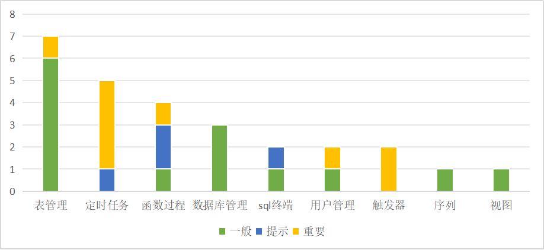

版权所有 © 2022 openGauss社区
您对“本文档”的复制、使用、修改及分发受知识共享(Creative Commons)署名—相同方式共享4.0国际公共许可协议(以下简称“CC BY-SA
4.0”)的约束。为了方便用户理解，您可以通过访问https://creativecommons.org/licenses/by-sa/4.0/ 了解CC BY-SA 4.0的概要 (
但不是替代)。CC BY-SA 4.0的完整协议内容您可以访问如下网址获取：https://creativecommons.org/licenses/by-sa/4.0/legalcode。
修订记录

| 日期         | 修订   版本 | 修改描述                                         | 作者           |
|------------|---------|----------------------------------------------|--------------|
| 2024.03.20 | V1.0    | 新建                                           | Feiling Peng |
| 2024.03.29 | V2.0    | 修改遗留bug、增加缺陷率统计、增加问题分布图、增加后续提交的PR链接、修改接口测试统计 | Feiling Peng |

关键词：

摘要：

缩略语清单：

| 缩略语 | 英文全名 | 中文解释 |
| ------ | -------- | -------- |
|        |          |          |

# 1     特性概述

版本包括的特性有：数据库连接、表结构与数据查询、序列创建与显示、同义词创建与显示、视图创建与显示、函数创建与执行、过程创建与执行、sql脚本执行、数据库管理、表管理、用户角色管理、触发器管理、定时任务管理、表空间管理、外表管理。

支持创建和管理数据库对象、执行 SQL 语句或 SQL 脚本、编辑和执行 PL/SQL
语句、数据库管理功能、连接删除、断开所有连接、连接区分来源、查询/删除保存的连接记录、定时任务的管理，通过支持存储调试功能精确定位到函数以及存储过程异常点，快速定位问题点并修改，降低排错难度提高工作效率。

330版本新增/优化功能：

（1）函数/过程:覆盖率统计信息适配内核

（2）导航菜单_模式下的子节点单独刷新

（3）标签_搜索窗口调整、最小宽度调整

（4）SQL终端：结果栏数据列宽支持拖动

（5）普通表、触发器、用户/角色、表空间的DDL预览改为SQL预览

（6）同义词、视图、序列的创建弹窗调整为创建页面

（7）数据导出：支持批量导出模式/普通表/函数过程/序列/视图DDL、批量导出模式/普通表/序列DDL和数据

# 2     特性测试信息

本节描述被测对象的版本信息和测试的时间及测试轮次，包括依赖的硬件。

| 版本名称 | 测试起始时间     | 测试结束时间     |
|------|------------|------------|
| 第一轮测试 | 2024.03.05 | 2024.03.13 |

第一轮：

| 环境信息      | 配置信息                                                 | 备注 |
| ------------- | ------------------------------------------------------------ | ---- |
| 虚拟机 | Intel Xeon Processor (Cascadelake) CPU @ 2.00GHz 8核<br/>内存：16GB<br/>硬盘：150G<br/>OS：CentOS Linux 7.6 <br> |
|软件|Java：openjdk 11.0.17 2022-10-18<br>python: 2.7.5<br>|      |
|数据库|openGauss 轻量版3.0.0<br>openGauss 企业版3.0.0<br>IntarkDB 1.0 |

# 3     测试结论概述

## 3.1   测试整体结论

进行了一轮测试，覆盖了连接管理、函数过程、表管理、数据库管理、用户管理、视图、序列、同义词特性，本版本新增及修改了109条测试用例，整个测试过程覆盖了功能测试、接口测试、性能测试。
本次测试总共发现27个问题，目前遗留了3个问题，整体质量良好，可供DBA日常使用。

| 测试活动 | 活动评价                                                                                     |
|----|------------------------------------------------------------------------------------------|
|功能测试| 测试函数调试覆盖率统计、导航菜单刷新、标签窗口显示、SQL终端结果显示、SQL预览、同义词、视图、序列、批量导出DDL/数据以及原基本功能、插件启用停用，测试达到预期结果    |
|接口测试| 测试目前已有的个接口，执行了199个用例，覆盖了128个接口，测试达到预期结果                                                  |
## 3.2   约束说明

**函数/过程**

（1）在“**SQL** **终端**”或“**创建函数**/**过程**”向导创建的函数/过程须以“/”结尾，表示函数/过程的结尾。

（2）需在openGauss5.1.0 b011及之后的版本下使用函数覆盖率功能，参数enable_proc_coverage需设置为off。

**调试**

（1）安装openGauss3.1.0及以上

（2）安装 pldebugger 插件3.0及以上

（3）仅支持plpgsql语言的调试

（4）函数调试覆盖率产生记录需要设置enable_proc_coverage参数为on：·ALTER DATABASE postgres set enable_proc_coverage to '
on';·

**项目运行**

（1）本项目依赖主平台的web-socket，若需要使用本项目所有功能，只能通过编译成 jar 包的形式作为插件运行在主平台上，若需单独运行将影响
SQL 终端语句执行、调试函数/过程等功能的使用。

（2）部署安装时需设置心跳时间小于平台token过期时间，
调整心跳方法：在`plugins/data-studio/web-ui/src/config/index.ts`修改配置心跳时间（单位：毫秒）

```javascript
// websocket心跳时间
export const wsHeartbeatTime = 1000 * 30;
// http心跳时间
export const httpHeartbeatTime = 1000 * 30;
```

（3）外表管理功能需要当前操作数据库为企业版，外部服务器创建需要当前操作用户具有管理权限。

## 3.3   遗留问题分析

### 3.3.1 遗留问题影响以及规避措施

| 问题单号 | 问题描述                                                            | 问题级别 | 问题影响和规避措施                            | 当前状态 |
|------|-----------------------------------------------------------------|------|--------------------------------------|----|
|#I9CA2G | 【测试类型：工具功能】【测试版本：6.0.0-RC1】【DataKit】业务开发-表名为纯数字_重建索引报语法错误       | 一般   | 名称非纯数字的表可正常使用。<br>规避：建表时纯数字需加引号      | 遗留 |
|#I9CBTF| 【测试类型：工具功能】【测试版本：6.0.0-RC1】【DataKit】业务开发-创建用户_设置管理员组_保存后管理员组不显示 | 一般   | 不影响其他功能，实际数据已保存。                     | 遗留 |
|#I9CCB0| 【测试类型：工具功能】【测试版本：6.0.0-RC1】【DataKit】业务开发-触发器带when条件_查看条件显示异常    | 一般   | 显示问题，不影响功能。<br>规避：可通过DDL预览查看when条件内容 | 遗留   |

### 3.3.2 问题统计

|        | 问题总数 | 关键  | 重要  | 一般  | 提示  |
| ------ |------|-----|-----|-----|-----|
| 数目   | 27   | 0   | 10  | 13  | 4   |
| 百分比 | 100% | 0%  | 37% | 48% | 15% |

# 4     测试执行

## 4.1   测试执行统计数据

*本节内容根据测试用例及实际执行情况进行特性整体测试的统计，可根据第二章的测试轮次分开进行统计说明。*

| 版本名称 | 测试用例数 | 用例执行结果                    | 发现问题单数 |
|------|-------|---------------------------|--------|
| 第一轮测试  | 1032  | 执行339，通过率96%，问题修复后通过率为99% | 26     |

*数据项说明：*

*测试用例数－－到本测试活动结束时，所有可用测试用例数；*

*发现问题单数－－本测试活动总共发现的问题单数。

## 4.2 测试执行步骤

### 4.2.1 330新增/优化功能

| 测试步骤                                           | 测试结果                      |
|------------------------------------------------|---------------------------|
| 1、覆盖率功能所需参数检测提示、函数过程调试生成覆盖率，查看/导出覆盖率           | 执行3条用例，发现0个bug。           |
| 2、模式下的子节点进行单独刷新                                | 执行9条用例，发现0个bug。           |
| 3、窗口列表查看与搜索，标签显示限制最小宽度与最大宽度                    | 执行5条用例，发现0个bug。           |
| 4、SQL终端结果栏数据列宽拖动                               | 执行2条用例，发现1个bug，现已修复并验证通过  |
| 5、普通表、触发器、用户/角色、表空间创建时显示SQL预览                  | 执行12条用例，发现1个bug，现已修复并验证通过 |
| 6、同义词、视图、序列的创建弹窗调整为创建页面                        | 执行16条用例，发现2个bug，现已修复并验证通过 |
| 7、批量导出模式/普通表/函数过程/序列/视图DDL、批量导出模式/普通表/序列DDL和数据 | 执行62条用例，发现2个bug，现已修复并验证通过 |

### 4.2.2 基本功能回归

| 测试步骤                                                                                                                 | 测试结果                         |
|----------------------------------------------------------------------------------------------------------------------|------------------------------|
| 1、数据库连接，函数/过程创建/编辑/调试，SQL终端执行/停止/导出/重命名/格式化，表创建/编辑/删除，表空间创建/编辑/删除，触发器创建/删除/重命名，定时任务创建/编辑/删除/启用/禁用，视图/序列/同义词的创建/编辑/删除 | 执行230条用例，发现21个bug，遗留5个bug待处理 |

### 4.3 330版本新增功能的测试执行数据

| 功能 | 测试用例数  | 用例最终执行结果     | 发现问题单数 | 点灯  | 备注       |
|----------------------------|---------|--------------|--------|-----|----------|
| 1、覆盖率功能所需参数检测提示、函数过程调试生成覆盖率，查看/导出覆盖率| 3 | 执行3，通过率100%  | 0      | 绿灯  |
| 2、模式下的子节点进行单独刷新                                | 9 | 执行9，通过率100%  | 0      | 绿灯  |
| 3、窗口列表查看与搜索，标签显示限制最小宽度与最大宽度             | 5 | 执行5，通过率100%  | 0      | 绿灯  |
| 4、SQL终端结果栏数据列宽拖动                               | 2 | 执行2，通过率100%  | 1      | 绿灯  |  |
| 5、普通表、触发器、用户/角色、表空间创建时显示SQL预览             | 12 | 执行12，通过率100% | 1      | 绿灯  |  |
| 6、同义词、视图、序列的创建弹窗调整为创建页面                        | 16| 执行16，通过率100% |2| 绿灯  |
| 7、批量导出模式/普通表/函数过程/序列/视图DDL、批量导出模式/普通表/序列DDL和数据 |62| 执行62，通过率100% |2| 绿灯  |

**缺陷密度=总问题数/新增代码行数=27/9.364KLOC=2.88**

## 4.4 问题分析

本版本（330版本），新功能的问题主要集中在DDL/数据导出、表管理、定时任务。在开发设计与实现上的问题，例如定时任务对不同数据库的处理未考虑到权限问题，表管理对特殊名称的兼容性处理、数据导出时的格式处理、对包中函数的处理。

以下为330版本问题的分布图：



## 4.5 接口测试

目前接口为内部接口，不对外开放。

| 接口数 | 用例数 | 接口通过率 |
|-----|--|-------|
| 128  | 197 | 100%  |


## 4.6   后续测试建议

后续还需要进行UI自动化、性能自动化、接口测试、稳定性测试、兼容性测试、渗透测试。

# 5     附件
# 5.1 PR清单

修复业务开发插件330特性bug
https://gitee.com/opengauss/openGauss-workbench/pulls/658

【国创】修复实例监控插件和业务开发插件bug
https://gitee.com/opengauss/openGauss-workbench/pulls/653

【业务开发】修复bug
https://gitee.com/opengauss/openGauss-workbench/pulls/648

业务开发插件修复缺陷
https://gitee.com/opengauss/openGauss-workbench/pulls/643

业务开发插件修复缺陷
https://gitee.com/opengauss/openGauss-workbench/pulls/631

业务开发插件修复缺陷
https://gitee.com/opengauss/openGauss-workbench/pulls/623

【业务开发】提交330版本完整代码
https://gitee.com/opengauss/openGauss-workbench/pulls/604


