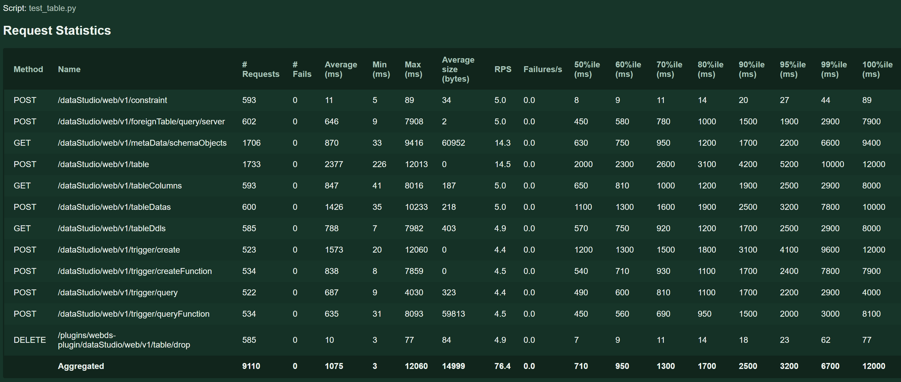
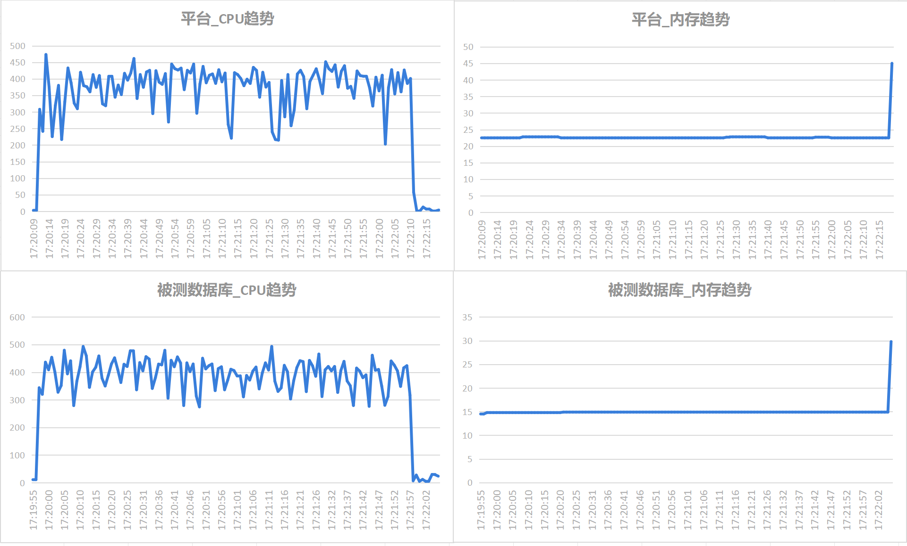

版权所有 © 2024  openGauss社区
 您对“本文档”的复制、使用、修改及分发受知识共享(Creative Commons)署名—相同方式共享4.0国际公共许可协议(以下简称“CC BY-SA 4.0”)的约束。为了方便用户理解，您可以通过访问[*https://creativecommons.org/licenses/by-sa/4.0/*](https://creativecommons.org/licenses/by-sa/4.0/) 了解CC BY-SA 4.0的概要 (但不是替代)。CC BY-SA 4.0的完整协议内容您可以访问如下网址获取：[*https://creativecommons.org/licenses/by-sa/4.0/legalcode*](https://creativecommons.org/licenses/by-sa/4.0/legalcode)。

修订记录

| 日期         | 修订版本 | 修改描述                 | 作者           |
|------------|------|----------------------|--------------|
| 2024.08.08 | V1.0 | 新建                   | Feiling Peng |
| 2024.09.19 | V1.1 | 更新遗留问题列表、增加按特性的缺陷率统计 | Feiling Peng |

[TOC]

**Keywords 关键词**：*XX*

**Abstract 摘要**：*给出本阶段的测试范围、结果、分析及质量评价，同时对测试活动进行回顾总结。*

**缩略语清单： **

| 缩略语 | 英文全名 | 中文解释 |
| ------ | -------- | -------- |
|        |          |          |

***


# 1 概述

*描述本报告是哪一个特性测试活动的总结，指明被测对象及其版本。*
本次测试对业务开发插件在2024年630需求进行测试验证，其归属于DataKit 6.0.0版本。
业务开发此版本新增或变动的功能如下：

|特性| 功能                                          |
|---|---------------------------------------------|
|DataKit 业务开发- 实例连接状态功能优化| 新增连接状态icon，区分连接和未连接状态                       |
|DataKit 业务开发- 新建连接功能优化| 数据库连接：新增测试连接功能                              |
|DataKit 业务开发- 对象窗口功能优化| 悬停时标签命名层级显示优化                               |
|DataKit 业务开发- 消息窗口功能优化| 历史执行记录新增错误信息、执行时长。日志消息打印增加错误信息、默认显示定位到最新消息。 |
|DataKit 业务开发- 执行窗口功能优化| SQL窗口详情显示优化、窗口右键增加新建窗口（复制连接）                |

# 2 测试版本说明


## 2.1 测试版本信息

###   2.1.1 被测版本

| 版本名称          | 软件包名称          | 测试起始时间   | 测试结束时间   | 测试人员 |
|---------------|----------------|----------|----------| -------- |
| 6.0.0 | webds-plugin-6.0.0-repackage | 2024.6.3 | 2024.8.7 |   Feiling Peng    |

###  2.1.2 配套测试的版本

| 版本名称 | 配套版本       | 版本说明 |
| -------- | -------------- | -------- |
| XXX      | XX测试工具版本 |          |
| XXX      | XX测试工具版本 |          |

## 2.2 测试环境描述

###  2.2.1 环境硬件信息

| 环境信息  | 硬件型号            | 硬件配置信息                                                                                                                              | 备注 |
|-------|-----------------|-------------------------------------------------------------------------------------------------------------------------------------| ---- |
| 测试环境一 | Huawei 2288H V5 | CPU：Intel Xeon Processor (Cascadelake) CPU @ 2.00GHz 8核<br />内存：16GB<br />硬盘：150G<br />OS：CentOS Linux 7.6<br />文件系统：xfs<br />网卡：Huawei Technologies Co., Ltd. iBMA Virtual Network Adapter |      |
| 测试环境二 | Huawei TaiShan 200 (Model 2280)  | CPU：Kunpeng-920 8核<br />内存：16GB<br />硬盘：509G<br />OS：openEuler release 20.03 (LTS-SP4)<br />文件系统：ext4<br />网卡：Huawei Technologies Co., Ltd. iBMA Virtual Network Adapter  |      |

### 2.2.2 虚拟化平台

| 虚拟化平台 | 版本说明  |
| -------- |-------|
| virt-manger         | 2.1.0 |

### 2.2.3 OS版本

| 操作系统 | OS版本 | 版本说明 |
| -------- | ------ | -------- |
| XX       | XX     | XX       |

# 3 版本概要测试结论、关键风险和规避措施

## 3.1 测试结论总结

业务开发6.0.0版本测试阶段完成了功能测试（17个新增、167个原有用例）、接口测试（197个用例）；完成了性能测试；完成了硬件/升级兼容性测试；需求100%实现，所有新特性的测试用例的累计执行覆盖率达到100%。
上述测试发现25个问题，无遗留问题待处理。

## 3.2 约束说明

**函数/过程**

（1）在“**SQL** **终端**”或“**创建函数**/**过程**”向导创建的函数/过程须以“/”结尾，表示函数/过程的结尾。

**调试**

（1）安装openGauss3.1.0及以上

（2）安装 pldebugger 插件3.0及以上

（3）仅支持plpgsql语言的调试

（4）函数调试覆盖率功能需在openGauss5.1.0 b011及之后的版本下使用，产生记录需要设置数据库enable_proc_coverage参数为on：·ALTER DATABASE postgres set enable_proc_coverage to '
on';·

**项目运行**

（1）本项目依赖主平台的web-socket，若需要使用本项目所有功能，只能通过编译成 jar 包的形式作为插件运行在主平台上，若需单独运行将影响
SQL 终端语句执行、调试函数/过程等功能的使用。

（2）部署安装时需设置心跳时间小于平台token过期时间，
调整心跳方法：在`plugins/data-studio/web-ui/src/config/index.ts`修改配置心跳时间（单位：毫秒）

```javascript
// websocket心跳时间
export const wsHeartbeatTime = 1000 * 30;
// http心跳时间
export const httpHeartbeatTime = 1000 * 30;
```

（3）外表管理功能需要当前操作数据库为企业版，外部服务器创建需要当前操作用户具有管理权限。

## 3.3 关键风险和规避措施

| 风险类型                                                    | 风险描述                        | 风险影响     | 规避措施和计划     | 责任人 | 当前进展 |
| ----------------------------------------------------------- |-----------------------------|----------|-------------|-----|------|
| 性能风险 | 并发数为100的情况下表管理功能部分接口存在性能问题  | 不影响业务使用。 | 使用时需等待返回。   | 刘鹏飞 | 新建  |
| 安全风险 | 暂未进行安全测试活动，只验证了连接时密码使用密文传输。 | 未知       | 计划930进行安全测试 | 彭斐灵 | 新建   |

*风险类型有：安全风险/兼容性风险/<br/>功能风险/性能风险/稳定性风险<br/>维护风险等*

# 4 版本详细测试结论

## 4.1 特性测试结论

###   4.1.1 新需求质量评价

| 特性    | 特性价值评估                         | 应用说明及关键约束假设依赖 | 关键遗留事项如缺陷等 | 测试整体覆盖情况 | 特性质量评估               | 主要风险               |
|-------|--------------------------------| -------------------------- | -------------------- | ---------------- | -------------------------- | ---------------------- |
|DataKit 业务开发- 实例连接状态功能优化| 提高易用性，便于用户直观判断连接状态             |当用户长时间未操作，连接超时后，状态不会自动更新，需用户操作发起请求后才会更新状态|无|100%|<font color=green>▮</font>|
|DataKit 业务开发- 新建连接功能优化| 提高易用性，便于用户连接前先进行测试连接，以检查连接信息   |无|无|100%|<font color=green>▮</font>||
|DataKit 业务开发- 对象窗口功能优化| 提高易用性，便于用户直观查看标签名称及其连接信息       |无|无|100%|<font color=green>▮</font>||
|DataKit 业务开发- 消息窗口功能优化| 提高易用性，便于查看SQL执行信息、历史执行SQL的错误信息 |无|无|100%|<font color=green>▮</font>||
|DataKit 业务开发- 执行窗口功能优化| 提高易用性，便于用户复制SQL终端窗口            |无|无|100%|<font color=green>▮</font>||

*特性质量评估说明*：

<font color=red><font color=red>●</font></font>： *表示特性不稳定，风险高*

<font color=yellow><font color=yellow>▲</font></font>： *表示特性基本可用，遗留少量问题*

<font color=green>▮</font>： *表示特性质量良好*

## 4.2 产品质量属性目标(DFX)测试结论

###  4.2.1 性能测试结论

本项性能测试 设置并发用户数为100，每1秒启动20个用户，执行接口测试脚本120秒，停止后等待时间为180秒。

在120s内会同时建立多个用户任务，每个用户依次串行执行脚本中的接口，各用户任务之间操作的数据非相同数据。120s后停止建立任务，若有任务中请求未完成，会进行等待，等待180s后强制停止。

**预期标准**：

|指标| 	标准                                                                                                      |
|---|----------------------------------------------------------------------------------------------------------|
|并发数| 	100                                                                                                     |
|错误率| 	由于网络超时等外部原因造成的错误比例不应超过5%，由于服务本身导致的错误率不应超过1%                                                             |
|RPS| 	>=10                                                                                                    |
|响应时间| 	最大响应时间	非数据库连接接口<=3s，数据库连接接口<=6s<br>最小响应时间	非数据库连接接口<=500ms，数据库连接接口<=1.5s<br>平均响应时间	单接口<=1.5s，数据库连接接口<=3s |
|CPU 使用率| 		不超过70%                                                                                |
|内存使用率| 		不超过70%                                                                                                 |

*说明：使用率按最大值按100%算，即top命令结果/逻辑CPU数*

<br>

**测试执行结果（以下图表中的TOP查看占用结果均未除以逻辑CPU数）**：

| 测试步骤                          | 测试结果                                                                                                      |
|-------------------------------|-----------------------------------------------------------------------------------------------------------|
| 执行用户管理相关接口性能测试脚本、分析CPU、内存占用   | 1、平均接口响应时长及最小接口响应时长符合标准，最大响应时长超过3s，但99%的样本小于3s，属于可接受范围。<br> 2、脚本执行期间，平台CPU和内存均增长，符合预期。被测数据库CPU增长较大，未超过预期。 |
| 执行表管理相关接口性能测试脚本、分析CPU、内存占用    | 1、 大部分接口响应时长符合标准。创建表接口超过预期，平均响应时长达到2.377s ，20%左右的样本超过3s。<br>脚本执行期间，平台CPU和内存均增长，符合预期。被测数据库CPU增长较大，未超过预期。                                              |
| 执行视图相关接口性能测试脚本、分析CPU、内存占用   | 1、接口响应时长符合标准<br> 脚本执行期间，平台CPU和内存均增长，符合预期。被测数据库CPU增长较大，未超过预期。                                                                                          |

**用户管理**：


| 进程                                                 | %CPU                                               |%MEM|RES(KB)|
|----------------------------------------------------|----------------------------------------------------|---|---|
| 32528_/etc/jdk11/bin/java（平台）                      | 平均值：102.814<br>最小值：1.0<br>最大值：151.5<br> |平均值：22.739<br>最小值：22.5<br>最大值：22.8<br>|平均值：3670016.0<br>最小值：3670016.0<br>最大值：3670016.0<br>|
| 4482_/opt/openGauss/install/app/bin/gaussdb（被测数据库） | 平均值：409.928<br>最小值：5.9<br>最大值：528.7<br>            |平均值：14.196<br>最小值：13.3<br>最大值：14.3<br>|平均值：2303640.812<br>最小值：2202009.6<br>最大值：2306867.2<br>|


**表管理**：



|进程| %CPU                                   | %MEM                                   | RES(KB)                                                      |
|---|----------------------------------------|----------------------------------------|--------------------------------------------------------------|
|24828_/etc/jdk11/bin/java（平台）     | 平均值：40.585<br>最小值：1.0<br>最大值：249.0<br> | 平均值：20.698<br>最小值：20.3<br>最大值：20.9<br> | 平均值：3355443.2<br>最小值：3355443.2<br>最大值：3355443.2<br>          |
|4482_/opt/openGauss/install/app/bin/gaussdb（被测数据库）| 平均值：75.404<br>最小值：3.9<br>最大值：320.8<br> | 平均值：16.755<br>最小值：14.8<br>最大值：17.1<br> | 平均值：2699679.9015384622<br>最小值：2411724.8<br>最大值：2831155.2<br> |


**视图**：


| 进程                                                 | %CPU                                    | %MEM                                   |RES(KB)|
|----------------------------------------------------|-----------------------------------------|----------------------------------------|---|
| 32528_/etc/jdk11/bin/java(平台）                      | 平均值：351.248<br>最小值：1.0<br>最大值：473.5<br> | 平均值：22.566<br>最小值：22.5<br>最大值：22.8<br> |平均值：3670016.0<br>最小值：3670016.0<br>最大值：3670016.0<br>|
| 4482_/opt/openGauss/install/app/bin/gaussdb（被测数据库） | 平均值：364.877<br>最小值：4.9<br>最大值：493.1<br> | 平均值：14.879<br>最小值：14.5<br>最大值：14.9<br> |平均值：2410911.950387597<br>最小值：2306867.2<br>最大值：2411724.8<br>|



###  4.2.2 可靠性测试结论

| 测试步骤 | 测试结果 |
| -------- | -------- |
|          |          |

###  4.2.3 安全&隐私保护测试结论

| 测试步骤 | 测试结果 |
| -------- | -------- |
|          |          |

### 4.2.4 可服务性测试结论

| 测试步骤 | 测试结果 |
| -------- | -------- |
|          |          |

### 4.2.5 生命周期管理测试结论

| 测试步骤 | 测试结果 |
| -------- | -------- |
|          |          |

### 4.2.6 韧性测试结论

| 测试步骤 | 测试结果 |
| -------- | -------- |
|          |          |

###  4.2.7 兼容性测试结论

| 测试步骤   | 测试结果                                                                             |
|--------|----------------------------------------------------------------------------------|
| 硬件兼容   | 支持在鲲鹏服务器上部署、Huawei 2288H V5上部署                                                   |
| 操作系统兼容 | 支持在x86+CentOS，x86+openEuler 20.03 LTS上部署，支持在arm+CentOS，arm+openEuler 20.03 LTS上部署 |
| 数据库兼容  | 覆盖率功能仅在openGauss 6.0.0版本可用， 其他功能在openGauss 3.0.0、openGauss 5.0.1可用。|

###  4.2.8 升级测试结论

| 测试步骤                                                                                                                                         | 升级路径 | 测试结果                                 |
|----------------------------------------------------------------------------------------------------------------------------------------------| -------- |--------------------------------------|
| 将openGauss-datakit-6.0.0-RC1.jar升级为openGauss-datakit-6.0.0.jar，webds-plugin-6.0.0-RC1-repackage.jar升级为webds-plugin-6.0.0-repackage.jar后，重启服务 |          | 服务启动成功，插件加载成功，工具存储的旧数据在新版本可使用，原功能可用。 |

### 4.2.9 接口测试结论

目前接口为内部接口，不对外开放。

| 接口数 | 用例数 | 接口通过率 |
|-----|-----|-------|
| 128  | 197 | 100%  |

## 4.3 资料测试结论

测试资料为用户操作手册，目前用户操作手册在社区代码仓对应插件目录的readme.md文档。当前插件地址为 openGauss-workbench/ plugins / data-studio。

| 序号 | 测试章节                   | 测试结论                                          |
| ---- |------------------------| ------------------------------------------------- |
|      | 5.1.3 数据库导航栏           |   通过   | 
|      | 5.1.4 数据库对象编辑栏         |   通过   |
|      | 5.2.1 新建连接             |   通过   | 
|      | 5.2.2 编辑连接             |   通过   | 
|      | 5.7.1 打开多个 "SQL 终端" 页签 |   通过   | 
|      | 5.7.2 使用 SQL 查询        |   通过   | 
|      | 5.7.6 SQL 查询执行历史       |   通过   |


# 5 测试对象质量评估

##  5.1 覆盖率分析

| 序号  |需求/特性|实现情况|覆盖测试情况|需求覆盖率|代码覆盖情况| 场景覆盖         |
|---|---|---|---|---|---|--------------|
| 1   |DataKit 业务开发- 消息窗口功能优化|均已实现|均已测试|100%|无| 无，此为界面优化     |
| 2   |DataKit 业务开发- 对象窗口功能优化|均已实现|均已测试|100%|无| 无，此为界面优化     |
| 3   |DataKit 业务开发- 执行窗口功能优化|均已实现|均已测试|100%|无| 无，此为界面优化     |
| 4   |DataKit 业务开发- 实例连接状态功能优化|均已实现|均已测试|100%|无| 无，此为界面优化     |
| 5   |DataKit 业务开发- 新建连接功能优化|均已实现|均已测试|100%|无| 无，仅增加了测试连接功能 |


##  5.2 缺陷统计和分析

###   5.2.1 缺陷统计

|        | 问题总数 | 严重  | 主要  | 次要  | 不重要 |
| ------ |------|-----|-----|-----|-----|
| 数目   | 25   | 0   | 9   | 7   | 9   |
| 百分比 | 100% | 0%  | 36% | 28% | 36% |

###   5.2.2 缺陷列表

| 问题单号 | 问题描述 | 问题级别 | 当前状态      |
| -------- | -------- | -------- |-----------|
| |表设置主键引号报错|严重| 关闭 |
| |SQL执行多行insert时消息显示影响行数问题|提示| 关闭     |
| |websocket超时长需设置为15分钟|一般| 关闭     |
| |本地连接_第一次连接数据库时会报错|严重| 关闭     |
| |新建/编辑连接按钮颜色问题|提示| 关闭        |
| |SQL执行消息显示_执行成功_日志显示内容缺失及报错|一般| 关闭     |
| |表管理_黑夜模式下样式显示问题|提示| 关闭        |
| |导出表数据_设置引号之后导出数据空白|严重| 关闭     |
| |表设置唯一键_单选列设置唯一键后点击确定_保存失败|严重| 关闭        |
| |columnList接口返回值顺序问题|提示| 关闭        |
| |接口测试用例执行过程中普通表创建失败|严重| 关闭        |
| |接口测试用例执行时出现锁|严重| 关闭        |
| |IntarkDB本地连接_多个连接问题|严重| 关闭        |
| |新建连接字段名需要左对齐|提示| 关闭        |
| |SQL执行历史_显示问题|提示| 关闭        |
| |创建表时设置默认值、索引、约束_报语法错误|严重| 关闭     |
| |创建外部服务器_名称为ip地址时报错提示语法错误|严重| 关闭        |
| |表名为纯数字_重建索引报语法错误|一般| 关闭        |
| |部分状态为失败的SQL没有错误信息记录|一般| 关闭      |
| |标签栏响应问题|一般| 关闭        |
| |无连接时终端选择数据库的下拉框未隐藏|提示| 关闭        |
| |[性能]表管理功能相关接口性能问题|一般| 关闭        |
| |循环调用表删除接口约400次后服务会连不上|提示| 关闭        |
| |页面分隔竖线去掉左边框线|提示| 关闭        |
| |查询模式_模式显示不全的问题|一般| 关闭        |


### 5.2.3 缺陷率统计

| 特性                         |问题数|代码量| 缺陷率  |
|----------------------------|----|---|------|
|DataKit 业务开发- 消息窗口功能优化<br>DataKit 业务开发- 对象窗口功能优化<br>DataKit 业务开发- 执行窗口功能优化<br>DataKit 业务开发- 实例连接状态功能优化<br>DataKit 业务开发- 新建连接功能优化|4190|1.43|


# 6 测试过程评估

##  6.1 测试策略回顾

| 编号  | 特性 | 验证策略                                                                                                                                                                                                                  | 是否按照测试策略执行 |
|-----| ---- |-----------------------------------------------------------------------------------------------------------------------------------------------------------------------------------------------------------------------| -------------------- |
| 1   |DataKit 业务开发- 消息窗口功能优化| 测试SQL执行成功（插入/非插入）、执行错误的情况。执行成功时显示：开始执行时间、执行结束时间、执行时长、操作影响的记录行数<br>执行失败时显示：执行状态、错误代码、报错提示<br>每条SQL执行的消息之间间隔一行                                                                                                          |YES|
| 2   |DataKit 业务开发- 对象窗口功能优化| 无数据库连接时不可新建终端按钮及连接选择下拉框隐藏。有数据库连接时显示按钮及下拉框，下拉框列表显示已经建立的连接。<br>测试所有可新建终端的入口：新建终端按钮点击新建、左侧数据库名节点右键创建终端、终端Tab右键点击”新建终端“                                                                                                   |YES|
| 3   |DataKit 业务开发- 执行窗口功能优化| 测试插件各类窗口悬停显示，悬停标签分层级显示。<br>（1）数据库对象的显示格式为：<br>”数据库对象类型“（例如普通表/外表/视图）：xxx<br>模式：xxx<br>数据库：xxx<br>连接：xxx<br>（2）终端窗口显示格式为：<br>终端：xxx<br>数据库：xxx<br>连接：xxx<br>（3）其他类型的窗口显示格式为：<br>"功能页面名称"（例如表空间/定时任务）：xxx<br>连接：xxx<br> |YES|
| 4   |DataKit 业务开发- 实例连接状态功能优化| 测试连接成功及连接失败的情况。连接成功：提示成功及耗时<br>连接失败：提示对应的失败内容<br>(1)用户密码错误<br>(2)端口号错误<br>(3)ip错误<br>(4)数据库错误<br>                                                                                                                     |YES|
| 5   |DataKit 业务开发- 新建连接功能优化| 测试左侧数据库导航列表中一级节点的状态图标显示。存在至少一个数据库连接时显示绿色连接图标。断开所有库的连接显示红色未连接图标。连接超时状态不更新。                                                                                                                                             |YES|

##  6.2 测试设计评估

| 编号 | 测试点修改说明                                               | 修改原因    | 是否影响测试质量 |
| ---- | ------------------------------------------------------------ | ----------- | ---------------- |
|      | *测试设计评审通过后，在实际测试执行过程中，发现的新增或删减的测试点列举* | *增/删原因* | *是/否*          |
|      |                                                              |             |                  |
|      |                                                              |             |                  |

##  6.3 测试执行评估

###  6.3.1 测试执行统计数据

| 版本名称 | 工作量投入(人天) | 测试用例数 | 用例执行数 | 发现缺陷数 | 缺陷密度                                |
| -------- |-----------|-------|-------|-------|-------------------------------------|
| openGauss 6.0.0  | 19        | 184   | 184   | 25    | 总问题25/62kloc=0.4,遗留问题数0/62kloc=0 |
|          |           |       |       |       |                                     |

*数据项说明：*

- *版本名称--每个转测版本名称，例如openGauss 6.0.0 B016*
- *工作量投入--与本活动相关的所有工作量投入，包括测试计划、方案、用例、脚本、执行等所有与本测试相关的活动所花的投入，单位“人天”；不包括以前已经统计的投入，不包括开局、用户支援等非测试相关投入；*
- *测试用例数--到本测试活动结束时，本测试活动中所有可用测试用例数；*
- *执行用例数--在本测试活动中执行测试用例数，含手工和自动化用例，多次重复执行同一用例计算为1个；*
- *发现缺陷数--本测试活动总共发现的缺陷数（不含无效问题单数）。*
- *缺陷密度--缺陷个数/代码行数*

###  6.3.2 测试用例执行结果统计数据

当前版本新增/修改特性用例统计：

| 总测试用例数 | 实际测试的用例数 | Passed | Failed | Blocked | Unavailable | 执行率  | 执行通过率 |
|--------|----------|--------|--------|---------|-------------|------|-------|
| 17     | 17       | 17     | 0      | 0       | 0           | 100% | 100%  |

回归用例统计：

| 总测试用例数 | 实际测试的用例数 | Passed | Failed | Blocked | Unavailable | 执行率 | 执行通过率 |
|--------|----------|--------|--------|---------|-------------|-----|-------|
| 994    | 167      | 167    | 0      | 0       | 0           | 16% | 100%  |

*其中：*

*Passed 用例执行成功*

*Failed 用例全部或部分执行结果未通过或者测试执行过程中遇到其他与本用例无关的失效事件*

*Blocked由于产品本身的问题导致用例不可执行*

*Unavailable由于软件本身以外，如环境、工具、物料、时间、人力资源等因素导致用例未执行*

| 异常用例情况       | 影响分析                     | 规避措施                               | 后续计划 |
| ------------------ | ---------------------------- | -------------------------------------- | -------- |
| 如：Failed用例10个 | 描述异常用例对版本测试的影响 | 若是最后一轮测试，要给出相应的规避措施 | xxx      |

# 7 附件

##  7.1 附件1：遗留问题列表

| 序号  | 问题单号 | 问题描述              | 分类   | 问题级别 | 问题分析与影响                                 | 规避措施         |
|-----|------|-------------------|------|------|-----------------------------------------|--------------|

##  7.2 附件2：特性相关PR

1、【业务开发】630功能优化特性代码
https://gitee.com/opengauss/openGauss-workbench/pulls/671

2、【业务开发】修复业务开发缺陷
https://gitee.com/opengauss/openGauss-workbench/pulls/695

3、【业务开发】修复业务开发缺陷
https://gitee.com/opengauss/openGauss-workbench/pulls/700

4、业务开发-630版本操作手册更新
https://gitee.com/opengauss/openGauss-workbench/pulls/739

5、【业务开发】修复业务开发插件bug
https://gitee.com/opengauss/openGauss-workbench/pulls/753

6、【IntarkDB】IntarkDB适配优化。更换创建主数据源的方式，使用druid。
https://gitee.com/opengauss/openGauss-workbench/pulls/696

7、修复业务开发插件创建表时约束索引报错问题
https://gitee.com/opengauss/openGauss-workbench/pulls/750

8、修复630版本业务开发插件bug
https://gitee.com/opengauss/openGauss-workbench/pulls/744

9、业务开发插件覆盖率增加入参
https://gitee.com/opengauss/openGauss-workbench/pulls/723

10、修复业务开发插件与实例监控插件缺陷
https://gitee.com/opengauss/openGauss-workbench/pulls/712

11、【业务开发】【智能运维】修复集群监控切换主备节点报错问题和编辑表设置唯一键问题
https://gitee.com/opengauss/openGauss-workbench/pulls/850