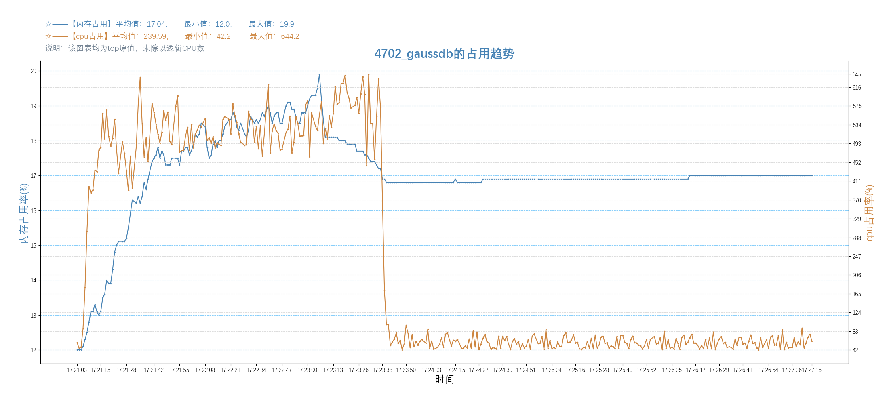

版权所有 © 2024  openGauss社区
 您对“本文档”的复制、使用、修改及分发受知识共享(Creative Commons)署名—相同方式共享4.0国际公共许可协议(以下简称“CC BY-SA 4.0”)的约束。为了方便用户理解，您可以通过访问[*https://creativecommons.org/licenses/by-sa/4.0/*](https://creativecommons.org/licenses/by-sa/4.0/) 了解CC BY-SA 4.0的概要 (但不是替代)。CC BY-SA 4.0的完整协议内容您可以访问如下网址获取：[*https://creativecommons.org/licenses/by-sa/4.0/legalcode*](https://creativecommons.org/licenses/by-sa/4.0/legalcode)。

修订记录

| 日期         | 修订版本 | 修改描述 | 作者           |
|------------|------|------|--------------|
| 2024.09.10 | V1.0 | 新建   | Feiling Peng |

[TOC]

**Keywords 关键词**：*XX*

**Abstract 摘要**：*给出本阶段的测试范围、结果、分析及质量评价，同时对测试活动进行回顾总结。*

**缩略语清单： **

| 缩略语 | 英文全名 | 中文解释 |
| ------ | -------- | -------- |
|        |          |          |

***


# 1 概述

*描述本报告是哪一个特性测试活动的总结，指明被测对象及其版本。*
本次测试对智能运维插件在2024年630需求及930需求进行测试验证，其归属于DataKit 6.0.0版本。
智能运维此版本新增或变动的功能如下：

| 特性                         | 功能                                          |
|----------------------------|---------------------------------------------|
| 【国创】提供Agent的安装部署接口能力| 实例监控Agent的安装部署提供接口（为内部接口）| 
| 【国创】实例监控插件性能与稳定性优化|  优化实例监控读取数据、资源占用等| 
| 【国创】智能诊断插件SQL诊断功能支持Schema|支持SQL诊断时可选择模式 |
| 【国创】智能诊断插件SQL诊断功能支持非ROOT用户| 支持SQL诊断安装中间件时可选择非ROOT用户安装 |
| 【国创】支持慢SQL统计功能|  支持慢SQL按SQL统计执行次数等数据 |
| 【国创】告警监控插件提供插件告警接口|  告警支持Agent状态告警，并提供内部接口 |
| 【国创】支持告警屏蔽|   支持按实例进行告警屏蔽 |


# 2 测试版本说明


## 2.1 测试版本信息

###   2.1.1 被测版本

| 版本名称          | 软件包名称          | 测试起始时间   | 测试结束时间    | 测试人员 |
|---------------|----------------|----------|-----------| -------- |
| 6.0.0 | webds-plugin-6.0.0-repackage | 2024.6.7 | 2024.9.10 |   Feiling Peng    |

###  2.1.2 配套测试的版本

| 版本名称 | 配套版本       | 版本说明 |
| -------- | -------------- | -------- |
| XXX      | XX测试工具版本 |          |
| XXX      | XX测试工具版本 |          |

## 2.2 测试环境描述

###  2.2.1 环境硬件信息

| 环境信息  | 硬件型号            | 硬件配置信息                                                                                                                              | 备注 |
|-------|-----------------|-------------------------------------------------------------------------------------------------------------------------------------| ---- |
| 测试环境一 | Huawei 2288H V5 | CPU：Intel Xeon Processor (Cascadelake) CPU @ 2.00GHz 8核<br />内存：16GB<br />硬盘：150G<br />OS：CentOS Linux 7.6<br />文件系统：xfs<br />网卡：Huawei Technologies Co., Ltd. iBMA Virtual Network Adapter |      |
| 测试环境二 | Huawei TaiShan 200 (Model 2280)  | CPU：Kunpeng-920 8核<br />内存：16GB<br />硬盘：509G<br />OS：openEuler release 20.03 (LTS-SP4)<br />文件系统：ext4<br />网卡：Huawei Technologies Co., Ltd. iBMA Virtual Network Adapter  |      |

### 2.2.2 虚拟化平台

| 虚拟化平台 | 版本说明  |
| -------- |-------|
| virt-manger         | 2.1.0 |

### 2.2.3 OS版本

| 操作系统 | OS版本 | 版本说明 |
| -------- | ------ | -------- |
| XX       | XX     | XX       |

# 3 版本概要测试结论、关键风险和规避措施

## 3.1 测试结论总结

DataKit-智能运维6.0.0版本测试阶段完成了功能测试（65个新增/修改用例、122个原有用例）、接口测试（197个用例）；完成了性能测试；完成了硬件/升级兼容性测试；需求100%实现，所有新特性的测试用例的累计执行覆盖率达到100%。
上述测试发现119个问题，尚遗留6个问题待处理。

## 3.2 约束说明

**日志检索**

（1）FileBeat版本由8.3.3进行二次开发新增openGauss Module

（2）需要在openGauss实例所在服务器安装FileBeat，以及FileBeat配置文件要求

（3）ES版本与FileBeat版本保持一致

（4）用户需要自行搭建ElasticSearch环境；ElasticSearch服务器性能要求、ElasticSearch配置文件要求

（5）Java 11及以上版本

（6）需要根据约定规则设计ES索引名称与插入具体字段值

（7）ElasticSearch需要集中存储多实例的日志，对存储容量要求较高，实际根据数据库实例数量、实例日志数量、ElasticSeach部署方式决定；

**实例监控**

（1）使用平台插件安装部署exporter和Prometheus

（2）集群数据库使用内存监控时需要设置对应参数：max_process_memory=12G, shared_buffers=64M,
cstore_buffers=16M,enable_memory_limit=on

**SQL诊断-性能分析**

（1）仅支持Linux版本在4.1或以上版本

（2）BCC版本需与内核版本匹配

（3）Python3或以上版本

（4）java 11或以上版本

（5）agent工具使用Java语言编写，但eBPF需与Linux内核交互，故只支持Linux平台

（6）需与Linux内核交互对性能有较高的要求，因此对于openGauss数据库的硬件系统有较高的要求。

**SQL诊断与慢SQL**

（1）需要在openGauss实例所在服务器安装bcc，以及安装诊断数据采集服务

（2）Java 11或以上版本

（3）个人开发者最低配置2核4G，推荐配置4核8G。预留50%以上的磁盘剩余空间用于数据存储。

（4）服务器需配置：`echo vm.max_map_count = 262144 >> /etc/sysctl.conf &&sysctl -p`

（5）SQL诊断使用explain需配置参数：`track_stmt_parameter=on`

（6）慢sql使用时，数据库需配置：

```
track_stmt_stat_level='L1,L1'
enable_stmt_track=on
track_stmt_parameter=on
log_min_duration_statement=10s

或
set track_stmt_stat_level='L1,L1';
set enable_stmt_track='on';
set track_stmt_parameter='on';
set log_min_duration_statement='10s';
```

如果track_stmt_stat_level参数通过guc参数修改不生效，则执行`ALTER DATABASE postgres SET track_stmt_stat_level TO 'L1,L1'`

**安装部署**
（1）需要先在服务器上安装yum命令

（2）安装后如若无数据显示，可做如下操作：卸载Agent、重装Agent、停用插件、启动插件

（3）安装多个prometheus时，需要进行时间同步，保证时间一致性。

（4）SQL诊断的Agent部署使用非ROOT用户部署时，需注意设置该用户有ROOT权限、且用户sudo无需密码。

**告警监控**
（1）插件告警目前仅支持实例监控代理中间件告警

（2）告警屏蔽目前仅支持实例告警屏蔽、不支持插件告警的屏蔽

## 3.3 关键风险和规避措施

| 风险类型                                                | 风险描述                         | 风险影响               | 规避措施和计划      | 责任人 | 当前进展 |
| ------------------------------------------------------- |------------------------------|--------------------|--------------|-----|------|
| 安全风险 | 暂未进行安全测试活动。                  | 未知                 | 计划下个版本进行安全测试 | 彭斐灵 | 新建   |
| 功能风险 | 当执行的SQL时间较短，会出现部分诊断项还未监控到而异常 | 诊断项数据会少，任务的诊断结果为“诊断项存在异常” | 计划下个版本优化     | 罗梦  | 新建   |

*风险类型有：安全风险/兼容性风险/<br/>功能风险/性能风险/稳定性风险<br/>维护风险等*

# 4 版本详细测试结论

## 4.1 特性测试结论

###   4.1.1 新需求质量评价

| 特性                         | 特性价值评估                         | 应用说明及关键约束假设依赖 | 关键遗留事项如缺陷等 | 测试整体覆盖情况 | 特性质量评估               | 主要风险                    |
|----------------------------|--------------------------------| -------------------------- | -------------------- | ---------------- | -------------------------- |-------------------------|
|【国创】提供Agent的安装部署接口能力|方便开发者进行二次开发，批量安装Agent|均为内部接口，需在源代码中添加代码进行调用。| 无| 无| 无| 开发自验。暂无相应测试机制，未经过测试人员验证 |
|【国创】实例监控插件性能与稳定性优化|提高性能与稳定性，减少监控数据掉点|无|无|100%|<font color=green>▮</font>||
|【国创】智能诊断插件SQL诊断功能支持Schema|功能增强，满足用户使用不同模式的需求|无|无|100%|<font color=green>▮</font>||
|【国创】智能诊断插件SQL诊断功能支持非ROOT用户|功能增强，满足用户不可使用ROOT账号时的需求|无|无|100%|<font color=green>▮</font>||
|【国创】支持慢SQL统计功能|功能增强，便于用户分析数据|无|无|100%|<font color=green>▮</font>||
|【国创】告警监控插件提供插件告警接口|功能增强，满足用户对实例监控agent的告警|无|无|100%|<font color=green>▮</font>||
|【国创】支持告警屏蔽|功能增强，满足用户在已知问题并正在处理情况下，无需进行告警的场景|无|无|100%|<font color=green>▮</font>||

*特性质量评估说明*：

<font color=red><font color=red>●</font></font>： *表示特性不稳定，风险高*

<font color=yellow><font color=yellow>▲</font></font>： *表示特性基本可用，遗留少量问题*

<font color=green>▮</font>： *表示特性质量良好*

## 4.2 产品质量属性目标(DFX)测试结论

###  4.2.1 性能测试结论

本项性能测试 设置并发用户数为100，每1秒启动20个用户，执行接口测试脚本120秒，停止后等待时间为180秒。

在120s内会同时建立多个用户任务，每个用户依次串行执行脚本中的接口，各用户任务之间操作的数据非相同数据。120s后停止建立任务，若有任务中请求未完成，会进行等待，等待180s后强制停止。

**预期标准**：

|指标| 	标准                                                                                                      |
|---|----------------------------------------------------------------------------------------------------------|
|并发数| 	100                                                                                                     |
|错误率| 	由于网络超时等外部原因造成的错误比例不应超过5%，由于服务本身导致的错误率不应超过1%                                                             |
|RPS| 	>=10                                                                                                    |
|响应时间| 	最大响应时间	非数据库连接接口<=3s，数据库连接接口<=6s<br>最小响应时间	非数据库连接接口<=500ms，数据库连接接口<=1.5s<br>平均响应时间	单接口<=1.5s，数据库连接接口<=3s |
|CPU 使用率| 		不超过70%                                                                                |
|内存使用率| 		不超过70%                                                                                                 |

*说明：使用率按最大值按100%算，即top命令结果/逻辑CPU数*

<br>

**测试执行结果（以下图表中的TOP查看占用结果均未除以逻辑CPU数）**：

| 测试步骤                                        | 测试结果                                                                                                                                                                                                                                                                                              |
|---------------------------------------------|---------------------------------------------------------------------------------------------------------------------------------------------------------------------------------------------------------------------------------------------------------------------------------------------------|
| 执行告警屏蔽相关接口性能测试脚本、分析CPU、内存占用。基础数据量为25条告警屏蔽规则。 | 1、大部分接口响应时长符合标准，其中告警屏蔽列表查询接口（/api/v1/alertShielding）的最大响应时长超过3s，达到了6.8s，需要优化。<br> 2、脚本执行期间（第2s到第5分钟2秒），平台CPU和内存占用均增长，CPU在428%~650.5%（除以核数后为53.5%~81.31%）之间波动，内存在3335.75M~3415.18M之间波动，CPU占用和内存占用均小于70%，符合预期。<br>平台数据库CPU在54%~282.4%（除以核数后为6.75%~35.3%）之间波动，内存在1126.4M~1331.2M之间波动，CPU及内存占用均未超过预期。 |
| 执行实例监控相关接口性能测试脚本、分析CPU、内存占用。 | 1、大部分接口响应时长符合标准，其中asp的接口、实例监控首页TOP进程接口的平均响应时长超过预期值，达3s以上。需要优化。<br> 2、脚本执行期间（第2s到第5分钟2秒），平台、平台数据库、被测数据库的CPU和内存占用均增长，最大值未超过预期值。脚本执行结束后会降低。<br>被测数据库的CPU在390%~644.2%（除以核数后为48.75%~80.525%）之间波动，内存在1945.6M~3174.4M之间波动。<br>一级prometheus的最大CPU占用为250.5%(除以核数后为31.31%)，内存最大占用为143.85M；<br>二级prometheus的最大CPU占用为50%(除以核数后为6.25%)，内存最大占用为867.13M；<br>二级prometheus的最大CPU占用为27.5%(除以核数后为3.44%)，内存最大占用为58.24M；<br>实例监控代理的最大CPU占用为93.1%(除以核数后为11.64%)，内存最大占用为504.95M。<br> |

**告警屏蔽**：


|进程| %CPU                                     | %MEM                                  | RES(KB)                                                |备注|
|---|------------------------------------------|---------------------------------------|--------------------------------------------------------|---|
|25920_/etc/jdk11/bin/java -Xms2048m -Xmx4096m -jar /ops/server/openGauss-visualtool/openGauss-datakit-6.0.0.jar --spring.profiles.active=cus| 平均值：508.31<br>最小值：232.4<br>最大值：650.5<br> | 平均值：21.06<br>最小值：21.0<br>最大值：21.5<br> | 平均值：3,425,574.95<br>最小值：3415815.48<br>最大值：3497144.42<br> |DataKit平台进程|
|19431_gaussdb| 平均值：58.94<br>最小值：5.0<br>最大值：282.4<br>    | 平均值：7.84<br>最小值：7.1<br>最大值：8.3<br>    | 平均值：1281884.16<br>最小值：1153433.6<br>最大值：1363148.8<br>   |DataKit平台存储的数据库|


**实例监控**


|进程|%CPU|%MEM|RES(KB)| 备注                   |
|---|---|---|---|----------------------|
|584_/etc/jdk11/bin/java -Xms2048m -Xmx4096m -jar /ops/server/openGauss-visualtool/openGauss-datakit-6.0.0.jar --spring.profiles.active=cus|平均值：109.7<br>最小值：2.9<br>最大值：611.9<br>|平均值：22.2<br>最小值：20.8<br>最大值：22.6<br>|平均值：3632733.3<br>最小值：3355443.2<br>最大值：3670016.0<br>| DataKit平台进程          |
|19431_gaussdb|平均值：34.47<br>最小值：5.3<br>最大值：86.3<br>|平均值：7.32<br>最小值：6.9<br>最大值：7.9<br>|平均值：1202075.88<br>最小值：1153433.6<br>最大值：1258291.2<br>| DataKit平台存储的数据库      |
|4702_/opt/openGauss/install/app/bin/gaussdb -D /opt/openGauss/install/data/dn -M pending|平均值：239.05<br>最小值：42.2<br>最大值：644.2<br>|平均值：17.03<br>最小值：12.0<br>最大值：19.9<br>|平均值：2755424.71<br>最小值：1992294.4<br>最大值：3250585.6<br>| 被测数据库                |
|2418_./prometheus --config.file=prometheus.yml --web.enable-lifecycle --web.listen-address=:9090 --storage.tsdb.retention.time=7d|平均值：50.67<br>最小值：1.0<br>最大值：250.5<br>|平均值：0.65<br>最小值：0.6<br>最大值：0.9<br>|平均值：106201.33<br>最小值：92092.0<br>最大值：147308.0<br>| 实例监控服务端-一级prometheus |
|31082_./prometheus --config.file=prometheus.yml --web.enable-lifecycle --web.listen-address=:9090 --storage.tsdb.retention.time=15d|平均值：10.31<br>最小值：0.9<br>最大值：50.0<br>|平均值：5.16<br>最小值：5.1<br>最大值：5.5<br>|平均值：836294.54<br>最小值：824592.0<br>最大值：887936.0<br>| 实例监控服务端-二级prometheus |
|11676_./prometheus --config.file=prometheus.yml --web.enable-lifecycle --web.listen-address=:9091 --storage.tsdb.retention.time=16d|平均值：5.95<br>最小值：0.9<br>最大值：27.5<br>|平均值：0.31<br>最小值：0.3<br>最大值：0.4<br>|平均值：55053.39<br>最小值：49888.0<br>最大值：59644.0<br>| 实例监控服务端-二级prometheus |
|9408_java -jar instance-exporter.jar --server.port=9598|平均值：14.51<br>最小值：1.0<br>最大值：93.1<br>|平均值：3.04<br>最小值：2.7<br>最大值：3.2<br>|平均值：495920.51<br>最小值：431640.0<br>最大值：517072.0<br>| 实例监控客户端代理            |




###  4.2.2 可靠性测试结论

| 测试步骤 | 测试结果 |
| -------- | -------- |
|          |          |

###  4.2.3 安全&隐私保护测试结论

| 测试步骤 | 测试结果 |
| -------- | -------- |
|          |          |

### 4.2.4 可服务性测试结论

| 测试步骤 | 测试结果 |
| -------- | -------- |
|          |          |

### 4.2.5 生命周期管理测试结论

| 测试步骤 | 测试结果 |
| -------- | -------- |
|          |          |

### 4.2.6 韧性测试结论

| 测试步骤 | 测试结果 |
| -------- | -------- |
|          |          |

###  4.2.7 兼容性测试结论

| 测试步骤   | 测试结果                                                                              |
|--------|-----------------------------------------------------------------------------------|
| 硬件兼容   | 支持在鲲鹏服务器上部署、Huawei 2288H V5上部署                                                    |
| 操作系统兼容 | 支持在x86+CentOS，x86+openEuler 20.03 LTS上部署，支持在arm+CentOS，arm+openEuler 20.03 LTS上部署 |
| 数据库兼容  | openGauss 3.0.0、openGauss 5.0.1、openGauss 6.0.0可用。                                |

###  4.2.8 升级测试结论

| 测试步骤                                                                                                                                         | 升级路径 | 测试结果                                 |
|----------------------------------------------------------------------------------------------------------------------------------------------| -------- |--------------------------------------|
| 将openGauss-datakit-6.0.0-RC1.jar升级为openGauss-datakit-6.0.0.jar，webds-plugin-6.0.0-RC1-repackage.jar升级为webds-plugin-6.0.0-repackage.jar后，重启服务 |          | 服务启动成功，插件加载成功，工具存储的旧数据在新版本可使用，原功能可用。 |

## 4.3 资料测试结论

测试资料为用户操作手册，目前用户操作手册在社区代码仓对应插件目录的readme.md文档。

实例监控插件地址为 openGauss-workbench/ plugins / observability-instance。

日志检索插件地址为 openGauss-workbench/ plugins / observability-log-search。

SQL诊断插件地址为 openGauss-workbench/ plugins / observability-sql-diagnosis。

告警监控插件地址为 openGauss-workbench/ plugins / alert-monitor。


| 序号 | 测试章节       | 测试结论                  |
| ---- |------------|-----------------------|
| ---- | 实例监控用户操作手册 | 930操作手册还没写 |
| ---- | SQL诊断用户操作手册 | 930操作手册还没写 |
| ---- | 告警监控用户操作手册 | 930操作手册还没写 |


# 5 测试对象质量评估

##  5.1 覆盖率分析

| 序号  | 需求/特性                        | 实现情况          | 覆盖测试情况                                        |需求覆盖率|代码覆盖情况| 场景覆盖         |
|---|------------------------------|---------------|-----------------------------------------------|---|---|--------------|
| 1|【国创】提供Agent的安装部署接口能力| 均已实现实例监控Agent的安装部署接口 | 未覆盖，内部接口，暂无相应测试机制，需使用者在自行开发时参考特性设计进行调用。       |无|无|无|
| 2|【国创】实例监控插件性能与稳定性优化| 均已实现          | 已覆盖                                           |100%|无|无|
|3|【国创】智能诊断插件SQL诊断功能支持Schema| 均已实现          | 已覆盖                                           |100%|无|无|
|4|【国创】智能诊断插件SQL诊断功能支持非ROOT用户| 均已实现          | 已覆盖                                           |100%|无|无|
|5|【国创】支持慢SQL统计功能| 均已实现          | 已覆盖                                           |100%|无|无|
|6|【国创】告警监控插件提供插件告警接口| 均已实现          | 已覆盖界面功能。对于内部接口，暂无相应测试机制，需使用者在自行开发时参考特性设计进行调用。 |100%|无|无|
|7|【国创】支持告警屏蔽| 均已实现          | 已覆盖                                           |100%|无|无|


##  5.2 缺陷统计和分析

###   5.2.1 缺陷统计

|        | 问题总数 | 严重   | 主要  | 次要    | 不重要   |
| ------ |------|------|-----|-------|-------|
| 数目   | 119  | 1    | 38  | 40    | 40    |
| 百分比 | 100% | 0.8% | 32% | 33.6% | 33.6% |

###   5.2.2 缺陷列表

| 问题单号 | 问题描述 | 问题级别  | 当前状态  |
|------| -------- |-------|-------|
|      | 告警记录页面样式与原型设计不符                                      |提示| PR待检视 |
|      |告警通知方式保存多邮箱报错                                        |严重| PR待检视 |
|      |告警屏蔽接口性能优化                                           |一般| 分析    |
|      |告警屏蔽按时间段_编辑时回显问题                                     |一般| PR待检视 |
|      |SQL诊断任务状态异常                                          |一般| PR待检视 |
|      |插件告警_告警记录多了未配置的模板                                    |严重| 社区转测中 |
|      |停止后立马启动                                              |一般| 分析    |
|      |告警屏蔽_按时间段/定时生效规则关闭_告警记录无数据                           |严重| 测试    |
|      |告警记录导出报告_颜色不对                                        |提示| 社区转测中 |
|      |告警规则_编辑并查看插件告警规则_更新所有模板_失败                           |一般| 社区转测中 |
|      |告警配置插件模板_查看配置时未默认选中当前绑定的模板                           |严重| 社区转测中 |
|      |告警模板类型接口传入错误值也保存成功                                   |提示| 社区转测中 |
|      |告警记录导出报错                                             |严重| 社区转测中 |
|      |新建插件告警规则失败                                           |严重| 社区转测中 |
|      |非root用户安装agent_启动_提示要root密码                          |严重| 社区转测中 |
|      |活动会话数关联视图为空                                          |严重| PR待检视 |
|      |安装多个二级prometheus_数据出现异常                              |严重| 测试    |
|      |集群实例悬浮显示问题                                           |提示| 社区转测中 |
|      |告警配置_批量配置报错                                          |严重| 关闭    |
|      |告警屏蔽_时间组件显示问题                                        |提示| 社区转测中 |
|      |告警记录未结束                                              |严重| 社区转测中 |
|      |实例监控_指标没有数据                                          |严重| PR待检视 |
|      |sql诊断模式下拉框点击_未刷新数据                                   |一般| PR待检视 |
|      |sql诊断_任务名称悬浮显示被遮挡                                    |提示| PR待检视 |
|      |历史数据诊断-诊断项数据异常                                       |一般| 合入社区  |
|      |日志检索和sql诊断的安装部署_中文显示编码问题                             |提示| 待提交社区 |
|      |33服务器一级prom自动拉起异常，页面点击启动按钮报错：Prometheus is unhealthy |提示| 测试    |
|      |诊断agent安装_使用非root用户_有root权限_安装成功                     |严重| 社区转测中 |
|      |升级_二级prometheus和exporter启动异常                                |严重| 分析    |
|      |编辑告警模板中的告警规则_接口返回400                                 |严重| 关闭    |
|      |黑夜模式下告警规则编辑显示问题                                      |提示| 社区转测中 |
|      |在liunx服务器手动启动exporter，无法自动分配到prom                    |提示| 已合入社区 |
|      |实例监控Export占用比较大，导致SSH执行命令超时                          |致命| 测试    |
|      |实例监控提示信息问题                                           |提示| 关闭    |
|      |实例监控-服务端安装异常                                         |提示| 测试    |
|      |实例监控-首页内存使用率数据与内存占用表格问题                              |一般| 社区转测中 |
|      |黑夜模式下诊断建议显示问题                                        |提示| 合入社区  |
|      |日志检索黑夜模式下样式问题                                        |提示| 关闭    |
|      |elastic在线安装_未下载文件                                    |一般| 待提交社区 |
|      |安装exporter时点击返回_prometheus出现未知状态                     |提示| 测试    |
|      |wdr_未选择实例时点击重置_有发送请求                                 |提示| 关闭    |
|      |二级prometheus启动检测失败                                   |一般| 测试    |
|      |二级prometheus出现实例无配置_页面不显示数据                          |严重| 测试    |
|      |sql诊断_partition_seq_scan分析问题                         |一般| 社区转测中 |
|      |单集群状态为未知时_主备延迟列表中节点名称未知                              |一般| 已修复   |
|      |实例监控exporter出现启动了但未运行的情况                             |一般| 测试    |
|      |未安装代理提示中点击去安装_自动带出内容不对                               |提示| 测试    |
|      |解决elastic卸载的问题                                       |提示| 关闭    |
|      |集群监控_主备切换后集群详情中的图表报错                                 |严重| 合入社区  |
|      |SQL诊断查看所有诊断项时的显示问题                                   |提示| 社区转测中 |
|      |当exporter刚开始采集、没有数据时_报错修改                            |严重| 测试    |
|      |prometheus慢，多指标出现问题                                  |严重| 社区转测中 |
|      |重复安装时提示的数据库端口号错误                                     |提示| 社区转测中 |
|      |接口平台中安装部署相关的接口method错误                               |提示| 关闭    |
|      |集群监控_当有主机宕机时_显示异常                                    |严重| 合入社区  |
|      |集群监控_主备切换记录_跨测试环境未显示                                 |一般| 关闭    |
|      |集群监控_报错                                              |严重| 测试    |
|      |exporter未安装_实例信息显示位置问题                               |提示| 社区转测中 |
|      |磁盘使用率_当存在多个tmpfs时使用率计算问题                             |一般| 社区转测中 |
|      |【掉点相关】实例数据采集刷新问题                                     |严重| PR待检视 |
|      |慢SQL趋势图/实例监控慢SQL_数据显示不出来                             |严重| 社区转测中 |
|      |监控37_数据库磁盘使用率问题                                      |严重| 社区转测中 |
|      |【掉点问题】33实例监控cpu使用率显示数据问题                             |严重| 修复中   |
|      |elastic出现异常、占用高                                      |一般| 分析    |
|      |sql诊断语法解析问题                                          |一般| 社区转测中 |
|      |采集配置_当主机无法连接时_无法保存                                   |一般| 测试    |
|      |当主机无法连接时，报错有误                                        |提示| 社区转测中 |
|      |exporter_当有exporter所在主机挂掉时，其他正常的exporter的状态错误        |一般| 社区转测中 |
|      |sql诊断接口规范问题                                          |一般| 社区转测中 |
|      |慢sql的接口返回格式不符合规范                                     |一般| 社区转测中 |
|      |SQL诊断_sql语句中包含单引号_报错                                 |严重| 社区转测中 |
|      |SQL诊断一直在排队中                                          |严重| 待提交社区 |
|      |agent启动异常                                            |一般| 测试    |
|      |Export中当group name在不同类重复时，会出现指标数据异常                  |提示| 测试    |
|      |慢SQL统计_平均顺序扫描行数取字段错误                                 |严重| 社区转测中 |
|      |【确认讨论】exporter占用CPU和内存过高                             |严重| 测试    |
|      |实例监控-部分页面不显示数据                                       |严重| 合入社区  |
|      |【复现不了】实例监控内存使用率接口、topsql接口报错                         |严重| 社区转测中 |
|      |安装多个二级prometheus_目录存在时未停止安装                          |一般| 测试    |
|      |[SQLite] 实例监控/告警监控初始化耗时较长                            |一般| 分析    |
|      |[arm+intarkdb]【性能】告警模板删除接口响应慢                        |一般| 分析    |
|      |exporter实例处点删除_无法删除                                  |一般| 社区转测中 |
|      |告警规则_选择活跃会话数的规则后页面显示问题                               |一般| 社区转测中 |
|      |[arm]安装时带出的安装目录需处理中文显示                               |一般| 关闭    |
|      |实例监控_下拉列表点击时未重新加载数据                                  |提示| 社区转测中 |
|      |elastic离线安装长时间在检查服务端安装包                              |一般| 社区转测中 |
|      |日志检索下载完成后未检测                                         |一般| 合入社区  |
|      |exporter安装提示connection refused                       |一般| 社区转测中 |
|      |SQL诊断：代理与平台网络不通时，未删除文件                               |一般| 合入社区  |
|      |安装部署升级兼容性问题                                          |一般| 测试    |
|      |智能诊断插件详细说明书 问题                                       |提示| 合入社区  |
|      |修改告警模板，规则配置丢失；规则列表字段没有对应更新。                          |严重| 社区转测中 |
|      |告警记录_磁盘读写IO延迟关联视图为空                                  |严重| 社区转测中 |
|      |告警SQL脚本执行会有报错                                        |提示| 关闭    |
|      |组件监控经常显示未知或异常                                        |严重| 测试    |
|      |安装elastic_安装到arm服务器51上安装失败                           |一般| 合入社区  |
|      |安装elastic_当服务器缺少配置时_给出的提示不对                          |提示| 合入社区  |
|      |实例监控/告警日志体量太大                                        |一般| 测试    |
|      |卸载_当中间件所在服务器连不上时_无法卸载                                |一般| 转需求   |
|      |实例监控_网络流量流入流出图表和磁盘使用率数据错误                            |严重| 关闭    |
|      |告警记录_查看主机磁盘使用率关联视图_图表数据为空                            |严重| 社区转测中 |
|      |填写0.x这样的小数时，显示没有开头的0                                 |提示| 社区转测中 |
|      |存在内置告警规则为是，且重复周期或次数未设置的规则                            |一般| 测试    |
|      |告警记录慢SQL运行时间未显示                                      |一般| 测试    |
|      |【性能】告警性能问题                                           |一般| 修复中   |
|      |安装filebeat_创建目录失败                                    |一般| 关闭    |
|      |资源监控_内存使用率样式问题                                       |提示| 关闭    |
|      |elastic状态提示信息被遮挡                                     |提示| 关闭    |
|      |sql诊断创建任务_中英文切换问题                                    |提示| 关闭    |
|      |【国创】Datakit实例监控TOPSQL功能模块中，等待事件统计出现数据越界的报错           |提示| 合入社区  |
|      |日志检索安装功能建议                                           |提示| 关闭    |
|      |日志检索_分布图显示不正确                                        |提示| 合入社区  |
|      |黑夜模式下开关显示问题                                          |提示| 关闭    |
|      |实例信息黑夜模式下样式问题                                        |提示| 关闭    |
|      |安装部署页面_选中行优化                                         |提示| 关闭    |
|      |[实例监控]图表选择区间后，点击智能诊断，弹出”请先安装智能诊断“                    |提示| 关闭    |
|      |实例监控清空时间条件时，界面报错                                     |提示| 关闭    |
| |解决告警规则引用删除问题|严重| 测试    |


# 6 测试过程评估

##  6.1 测试策略回顾

| 编号  | 特性                                                                                                        | 验证策略 | 是否按照测试策略执行 |
|-----|-----------------------------------------------------------------------------------------------------------|------|-----------|
| 1   | 【国创】提供Agent的安装部署接口能力       | 未覆盖，内部接口，暂无相应测试机制，需使用者在自行开发时参考特性设计进行调用。                                                                   | 无    |
| 2   |【国创】实例监控插件性能与稳定性优化       | 测试实例监控接口性能、资源占用。测试长期监控时是否有掉点。测试安装多个prometheus时，prometheus启动/停止后，采集时间段内的数据情况。测试代理或prometheus异常情况下及恢复后的数据采集 | 是    |
| 3   |【国创】智能诊断插件SQL诊断功能支持Schema | 测试Schema为public时的SQL诊断任务执行，测试 Schema为其他模式时的SQL诊断任务执行                                                      | 是    |
| 4   |【国创】智能诊断插件SQL诊断功能支持非ROOT用户 | 测试使用ROOT用户安装/启动/停止/卸载，并执行SQL诊断任务。测试 使用非ROOT用户安装/启动/停止/卸载，并执行SQL诊断任务                                       | 是    |
| 5   |【国创】支持慢SQL统计功能           | 测试慢SQL统计列表、趋势图的查询/排序/统计数据结果正确性，测试慢SQL明细列表查询/排序/统计数据结果正确性                                                  |    是  |
| 6   |【国创】告警监控插件提供插件告警接口       | 测试插件告警规则的新建/编辑/查看/删除，测试插件告警模板的新建/编辑/查看/删除，测试插件告警配置，测试插件告警记录的查询/导出，测试插件告警通知                                | 是    |
| 7   |【国创】支持告警屏蔽               | 测试告警屏蔽规则的 新建/编辑/查看/删除，测试告警屏蔽生效/失效。测试告警屏蔽生效时、若告警状态恢复，告警记录可正常结束。                                            | 是                                                                                                         |

##  6.2 测试设计评估

| 编号 | 测试点修改说明                                               | 修改原因    | 是否影响测试质量 |
| ---- | ------------------------------------------------------------ | ----------- | ---------------- |
|      | *测试设计评审通过后，在实际测试执行过程中，发现的新增或删减的测试点列举* | *增/删原因* | *是/否*          |
|      |                                                              |             |                  |
|      |                                                              |             |                  |

##  6.3 测试执行评估

###  6.3.1 测试执行统计数据

| 版本名称 | 工作量投入(人天) | 测试用例数 | 用例执行数 | 发现缺陷数 | 缺陷密度              |
| -------- |-----------|-------|-------|-------|-------------------|
| openGauss 6.0.0  | 19        | 184   | 184   | 121   | 遗留问题数6/7kloc=0.86 |
|          |           |       |       |       |                   |

*数据项说明：*

- *版本名称--每个转测版本名称，例如openGauss 6.0.0 B016*
- *工作量投入--与本活动相关的所有工作量投入，包括测试计划、方案、用例、脚本、执行等所有与本测试相关的活动所花的投入，单位“人天”；不包括以前已经统计的投入，不包括开局、用户支援等非测试相关投入；*
- *测试用例数--到本测试活动结束时，本测试活动中所有可用测试用例数；*
- *执行用例数--在本测试活动中执行测试用例数，含手工和自动化用例，多次重复执行同一用例计算为1个；*
- *发现缺陷数--本测试活动总共发现的缺陷数（不含无效问题单数）。*
- *缺陷密度--缺陷个数/代码行数*

###  6.3.2 测试用例执行结果统计数据

当前版本新增/修改特性用例统计：

| 总测试用例数 | 实际测试的用例数 | Passed | Failed | Blocked | Unavailable | 执行率  | 执行通过率 |
|--------|----------|--------|--------|---------|-------------|------|-------|
| 65     | 65       | 64     | 1      | 0       | 0           | 100% | 99%   |

回归用例统计：

| 总测试用例数 | 实际测试的用例数 | Passed | Failed | Blocked | Unavailable | 执行率 | 执行通过率 |
|--------|----------|--------|--------|---------|-------------|-----|-------|
| 835    | 122      | 117    | 5      | 0       | 0           | 15% | 96%   |


接口测试用例统计：

| 总测试用例数 | 实际测试的用例数 | Passed | Failed | Blocked | Unavailable | 执行率  | 执行通过率 |
|--------|----------|--------|--------|---------|-------------|------|-------|
| 273    | 273      | 259    | 14     | 0       | 0           | 100% | 95%   |

*其中：*

*Passed 用例执行成功*

*Failed 用例全部或部分执行结果未通过或者测试执行过程中遇到其他与本用例无关的失效事件*

*Blocked由于产品本身的问题导致用例不可执行*

*Unavailable由于软件本身以外，如环境、工具、物料、时间、人力资源等因素导致用例未执行*

| 异常用例情况       | 影响分析                     | 规避措施                               | 后续计划 |
| ------------------ | ---------------------------- | -------------------------------------- | -------- |
| 如：Failed用例10个 | 描述异常用例对版本测试的影响 | 若是最后一轮测试，要给出相应的规避措施 | xxx      |

# 7 附件

##  7.1 附件1：遗留问题列表

| 序号  | 问题单号 | 问题简述                              | 分类     | 问题级别                                  | 问题分析与影响                               | 规避措施                               |
|-----| ---- |-----------------------------------| -------- |---------------------------------------|---------------------------------------|------------------------------------|
| 1   |     | prometheus停止后立马启动                 |旧功能问题| 一般                                    | 出现概率10%，近期未复现。                        | 停止以后等1秒后再点击启动                      |
| 2   |     | 升级_二级prometheus和exporter启动异常      |兼容性问题| 一般                                    | 二级prom版本比较旧                           | 重新安装二级prom或者手动将配置写入prom，然后重新启动prom |
| 3   |     | elastic出现异常、占用高                   |性能问题| 一般                                    | 日志数据量较大时CPU占用较高达到38%                  | 安装elastic的服务器需有足够资源                |
| 4   |     | [SQLite] 实例监控/告警监控初始化耗时较长         |旧功能问题| 一般                                    | 启动插件时，需要加载脚本，脚本过大导致初始化慢，不影响功能         | 等待插件初始化完成                          |
| 5   |     | 【性能】告警性能问题                        |性能问题| 一般                                    | 接口并发性能问题，不影响功能                        | 并发高的时候需等待响应。                              |
|6| |【掉点相关】实例数据采集刷新问题|功能问题| 一般 | 由于网络等原因，采集数据超过代码中设定的时间，导致数据未采集到，出现掉点。 | 暂无法通过配置文件设置采集超时时间，需要修改原代码根据实际情况增加超时时间 |


##  7.2 附件2：特性相关PR
1、实例监控630特性和bug修复
https://gitee.com/opengauss/openGauss-workbench/pulls/686

2、【智能运维】告警监控630bug修复
https://gitee.com/opengauss/openGauss-workbench/pulls/710

3、【智能运维】实例监控630bug修复
https://gitee.com/opengauss/openGauss-workbench/pulls/709

4、【智能运维】插件告警功能特性代码合入
https://gitee.com/opengauss/openGauss-workbench/pulls/732

5、告警监控930bug修复
https://gitee.com/opengauss/openGauss-workbench/pulls/752

6、告警监控bug修复
https://gitee.com/opengauss/openGauss-workbench/pulls/781

7、实例监控bug修复
https://gitee.com/opengauss/openGauss-workbench/pulls/782

8、【智能运维】告警监控930bug修复
https://gitee.com/opengauss/openGauss-workbench/pulls/822

9、修复告警监控页面初次打开时，未弹出【设置告警接口】页面的问题
https://gitee.com/opengauss/openGauss-workbench/pulls/841

10、【智能运维】告警监控930bug修复
https://gitee.com/opengauss/openGauss-workbench/pulls/834

11、修复安装二级prom时报“node not found”问题和修改页面样式
https://gitee.com/opengauss/openGauss-workbench/pulls/838

12、【智能运维】修复智能诊断插件BUG
https://gitee.com/opengauss/openGauss-workbench/pulls/688

13、【智能运维】修复实例监控插件BUG
https://gitee.com/opengauss/openGauss-workbench/pulls/690

14、【智能运维】修复日志检索插件BUG
https://gitee.com/opengauss/openGauss-workbench/pulls/679

15、【智能运维】智能诊断插件支持慢SQL统计、支持Schema特性代码合入
https://gitee.com/opengauss/openGauss-workbench/pulls/676

16、【智能运维】实例监控插件支持慢SQL统计、支持Schema、支持慢SQL数从数据库获取特性代码合入
https://gitee.com/opengauss/openGauss-workbench/pulls/675

17、【智能运维】实例监控插件磁盘目录监控、xlog堆积监控特性代码合入
https://gitee.com/opengauss/openGauss-workbench/pulls/689

18、修复集群监控页面提示未获取到主节点信息的问题
https://gitee.com/opengauss/openGauss-workbench/pulls/819

19、【智能运维】修复智能诊断插件缺陷
https://gitee.com/opengauss/openGauss-workbench/pulls/715

20、【智能运维】修复实例监控插件缺陷
https://gitee.com/opengauss/openGauss-workbench/pulls/706

21、【IntarkDB】IntarkDB适配优化。更换创建主数据源的方式，使用druid。
https://gitee.com/opengauss/openGauss-workbench/pulls/696/files

22、【智能运维】实例监控插件修复集群监控bug
https://gitee.com/opengauss/openGauss-workbench/pulls/681

23、【智能运维】修复日志检索插件缺陷
https://gitee.com/opengauss/openGauss-workbench/pulls/708

24、【国创】修复实例监控插件和业务开发插件bug
https://gitee.com/opengauss/openGauss-workbench/pulls/653/fileshttps://gitee.com/opengauss/openGauss-workbench/pulls/653/files

25、【智能运维】修复智能诊断插件缺陷
https://gitee.com/opengauss/openGauss-workbench/pulls/727

26、【智能运维】智能诊断插件930特性代码合入
https://gitee.com/opengauss/openGauss-workbench/pulls/734

27、【智能运维】告警监控630特性开发
https://gitee.com/opengauss/openGauss-workbench/pulls/716

28、告警监控插件BUG修复
https://gitee.com/opengauss/openGauss-workbench/pulls/786

29、告警监控插件630BUG修复
https://gitee.com/opengauss/openGauss-workbench/pulls/842

30、智能诊断插件BUG修复
https://gitee.com/opengauss/openGauss-workbench/pulls/770
