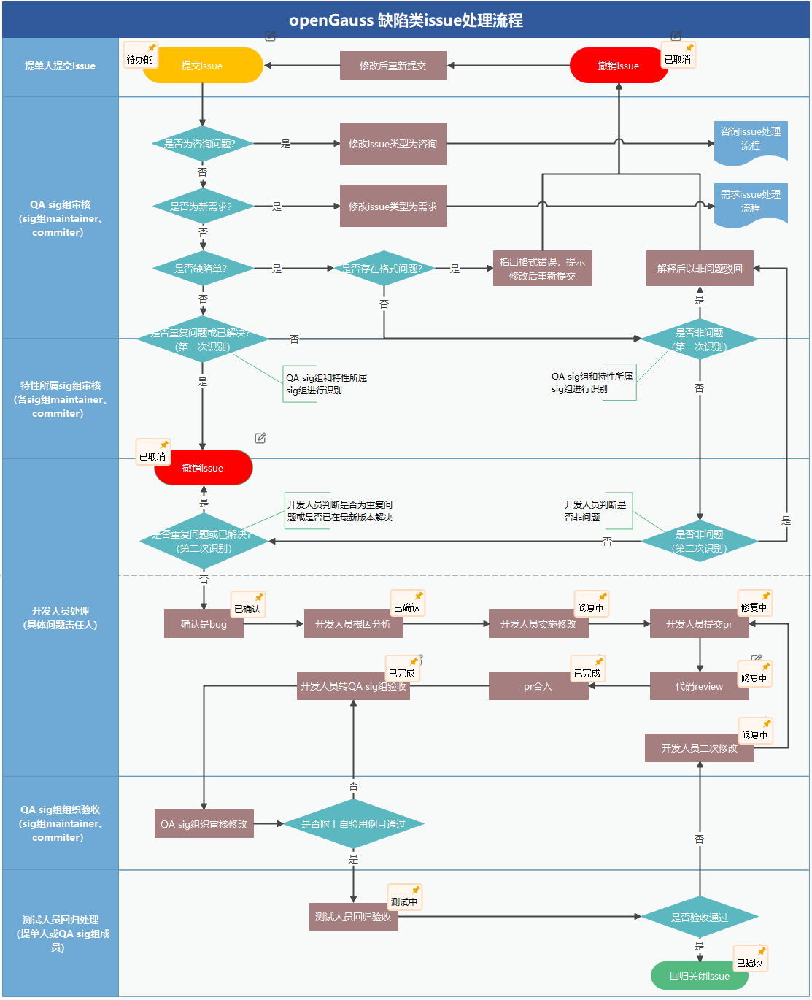
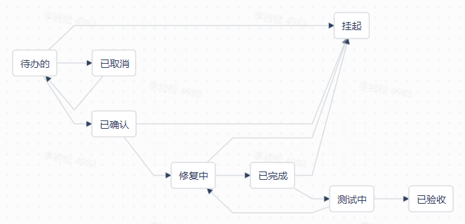

版权所有 © 2022  openGauss社区
 您对“本文档”的复制、使用、修改及分发受知识共享(Creative Commons)署名—相同方式共享4.0国际公共许可协议(以下简称“CC BY-SA 4.0”)的约束。为了方便用户理解，您可以通过访问[*https://creativecommons.org/licenses/by-sa/4.0/*](https://creativecommons.org/licenses/by-sa/4.0/) 了解CC BY-SA 4.0的概要 (但不是替代)。CC BY-SA 4.0的完整协议内容您可以访问如下网址获取：[*https://creativecommons.org/licenses/by-sa/4.0/legalcode*](https://creativecommons.org/licenses/by-sa/4.0/legalcode)。

修订记录

| 日期      | 修订版本 | 修改章节               | 修改描述         | 作者        |
| --------- | -------- | ---------------------- | ---------------- | ----------- |
| 2022.4.21 | 1.0      | 初稿撰写               |                  | yansong_lee |
| 2022.11.2 | 1.1      | 内容-缺陷issue撤销原则 | 补充异常场景处理 | yansong_lee |
| 2023.9.11 | 1.2      | 内容-缺陷issue撤销原则 | 补充状态更改责任人 | jiexiao1413 |

## 一、目的

为规范openGauss社区上缺陷类issue提单要求，确保缺陷类issue所填信息准确有效，各责任人处理及时，且对缺陷的修改不引入新问题，不断夯实社区版本质量，特制定本规范。

## 二、范围

+ 本规范适用于openGauss开源社区所有开发者
+ 本规范统一由openGauss QA sig组进行维护、更新

## 三、内容

### 1、缺陷issue处理流程

为提升缺陷issue处理效率，标准流程主要分为以下7步：

- 提交issue
- QA sig组审核
- 特性所属sig组审核
- 开发人员根因分析
- 开发人员实施修改
- 代码review&合入
- QA sig组组织验收
- 测试人员回归验证

上述的7步为最简洁的流程，实际操作过程可能会有所变动，详情见[openGauss缺陷issue处理流程](https://gitee.com/opengauss/QA/issues/I51H9R?from=project-issue)。

### 2、提单要求

+ 在openGauss的版本周期内（Release版本3年，Preview版本0.5年），所有问题都必须提缺陷issue处理
+ 提交缺陷issue要按照填写信息，描述清楚环境信息、数据库版本、问题现象和复现步骤等，否则QA sig组审核不通过，会退回给提单人

### 3、缺陷issue状态

- 待办的
- 已确认
- 修复中
- 已完成
- 测试中
- 已验收
- 挂起
- 已取消

### 4、缺陷issue正常关闭原则

+ 通过测试人员回归验证，证明问题已经得到了解决，并且没有产生新问题的情况下可以关闭（issue状态设置为已验收）

### 5、缺陷issue撤销原则

+ 问题现象、问题根因相同的重复问题单可撤销

+ 与提单人确认为非问题的issue可撤销；若联系不到提单人，需要通过[社区邮件](https://opengauss.org/zh/community/onlineCommunication/)向community、问题所属sig组和QA sig组公示7天，允许以非问题撤销

+ 对于联系不到提单人，且按照issue中描述的操作步骤无法复现问题（至少复现20次）的场景，通过[社区邮件](https://opengauss.org/zh/community/onlineCommunication/)向community、问题所属sig组和QA sig组公示7天，允许撤销此问题。之后提单人如有异议，可以重新打开此issue，并在issue中补充可复现的测试步骤、可供定位的堆栈日志等详细信息
+ 无论是何种情况，对于需要转非问题的issue，应只会到相应的模块leader并征得同意，由QA sig组maintainer确认后修改状态，不得自行更改状态

### 6、缺陷issue降级原则

+ 降级问题提交到对应特性sig 组[CCB](https://gitee.com/opengauss/QA/issues/I54UZA?from=project-issue)评审裁决，在可以联系到环境和提单人的前提下，满足1个月不复现或者3000次不复现的要求，对于不复现的问题单需要提供影响分析

### 7、缺陷issue挂起原则

+ 对于经过努力仍然长期不可复现的问题，在[CCB](https://gitee.com/opengauss/QA/issues/I54UZA?from=project-issue)评审以后，可以挂起。参考“缺陷issue降级原则”进行处理，直到降为“非问题”
+ 社区当前版本无法解决、且不是阻塞性问题，经过[CCB](https://gitee.com/opengauss/QA/issues/I54UZA?from=project-issue)裁决可以挂起，在下个版本激活解决
+ 社区当前版本无法解决，解决成本较高，但对质量影响不大的问题，经过[CCB](https://gitee.com/opengauss/QA/issues/I54UZA?from=project-issue)裁决可以挂起，在下个版本激活解决

### 8、缺陷issue转需求原则

+ 经过对应特性sig组[CCB](https://gitee.com/opengauss/QA/issues/I54UZA?from=project-issue)裁决，可将issue类型设置为“需求”

## 五、缺陷类issue优先级定义

| 优先级               | 定义                                                         |
| -------------------- | ------------------------------------------------------------ |
| 严重 Serious         | 安装/升级/编译失败；数据库core；关键指标低于基线30%以上；数据丢失或数据不一致等问题 |
| 主要 Main            | 特性要求的规格未实现；关键指标低于基线10%以上；根据资料指导造成错误操作（如按照安装指导造成安装失败） |
| 一般 Secondary       | 特性要求的规格实现有问题，但未造成整个特性功能失效；关键指标低于基线；易用性差；资料缺失少量内容 |
| 不重要 Optional      | openGauss官网文字排版风格问题；资料可读性差、用词不当、错别字及不易于理解的问题；操作维护功能存在冗余信息、无效命令；其他不属于严重/主要/一般问题 |
| 无优先级 No priority | 未指定优先级，请按上述定义指定优先级                         |

## 六、流程各环节处理SLA

| 流程环节          | 处理时间要求                                  | 责任人                  |
| ----------------- | --------------------------------------------- | ----------------------- |
| 提交issue         | 最长不超过1个自然日                           | 提单人                  |
| QA sig组审核      | 最长不超过1个自然日                           | QA sig组maintainer      |
| 特性所属sig组审核 | 最长不超过1个自然日                           | 特性所属sig组maintainer |
| 开发人员根因分析  | 不超过3个自然日，否则需要作为TOP纳入sig组决策 | 开发人员                |
| 开发人员实施修改  | 不超过7个自然日，否则需要作为TOP纳入sig组决策 | 开发人员                |
| 代码review&合入   | 不超过5个自然日                               | 特性所属sig组maintainer |
| QA sig组组织验收  | 不超过1个自然日                               | QA sig组maintainer      |
| 测试人员回归验证  | 不超过2个自然日                               | 测试人员                |

注：每个缺陷类issue从创建到关闭，必须在20天内完成。

## 附件

### openGauss [CCB](https://gitee.com/opengauss/QA/issues/I54UZA?from=project-issue)流程

