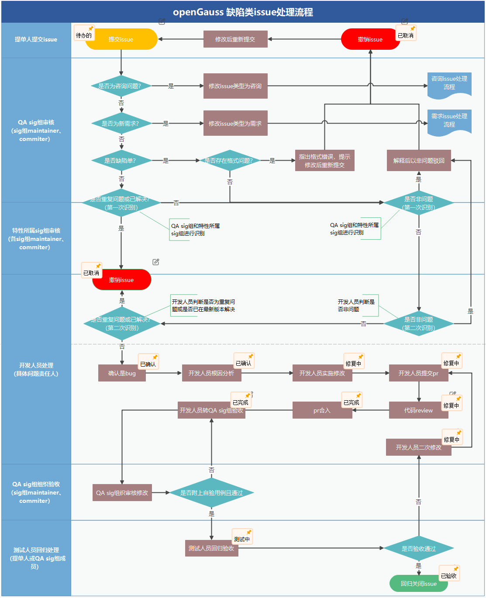
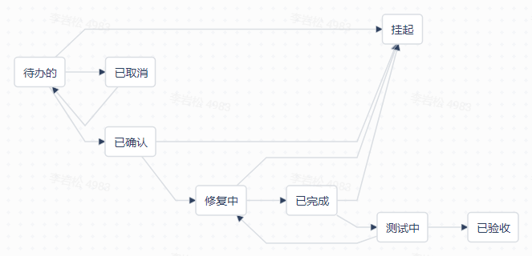

版权所有 © 2022  openGauss社区
 您对“本文档”的复制、使用、修改及分发受知识共享(Creative Commons)署名—相同方式共享4.0国际公共许可协议(以下简称“CC BY-SA 4.0”)的约束。为了方便用户理解，您可以通过访问[*https://creativecommons.org/licenses/by-sa/4.0/*](https://creativecommons.org/licenses/by-sa/4.0/) 了解CC BY-SA 4.0的概要 (但不是替代)。CC BY-SA 4.0的完整协议内容您可以访问如下网址获取：[*https://creativecommons.org/licenses/by-sa/4.0/legalcode*](https://creativecommons.org/licenses/by-sa/4.0/legalcode)。

修订记录

| 日期      | 修订版本 | 修改章节               | 修改描述         | 作者        |
| --------- | -------- | ---------------------- | ---------------- | ----------- |
| 2022.4.21 | 1.0      | 初稿撰写               |                  | yansong_lee |
| 2022.11.2 | 1.1      | 内容-缺陷issue撤销原则 | 补充异常场景处理 | yansong_lee |
| 2023.9.11 | 1.2      | 内容-缺陷issue撤销原则 | 补充状态更改责任人 | jiexiao1413 |
| 2024.4.20 | 1.3 | 内容-提单要求，缺陷Issue正常关闭原则 | 优化提单要求及验收要求 | wan005 |
| 2025.10.16 | 2.0 | 内容和缺陷类issue优先级定义 | 补充和优化 | sungang14 |

## 一、目的

为规范openGauss社区上缺陷类issue提单要求，确保缺陷类issue所填信息准确有效，各责任人处理及时，且对缺陷的修改不引入新问题，不断夯实社区版本质量，特制定本规范。

## 二、范围

+ 本规范适用于openGauss开源社区所有开发者
+ 本规范统一由openGauss QA sig组进行维护、更新

## 三、内容

### 1、缺陷issue处理流程

为提升缺陷issue处理效率，标准流程主要分为以下7步：

- 提交issue
- QA sig组审核
- 特性所属sig组审核
- 开发人员根因分析
- 开发人员实施修改
- 代码review&合入
- QA sig组组织验收
- 测试人员回归验证

上述的7步为最简洁的流程，实际操作过程可能会有所变动，详情见[openGauss缺陷issue处理流程](https://gitee.com/opengauss/QA/issues/I51H9R?from=project-issue)。

### 2、提单要求

+ 在openGauss的版本周期内（LTS版本3年，RCx版本0.5年），所有问题都必须提缺陷issue处理

+ 提交缺陷issue按照要求填写完整

  必填项【标题描述】、【测试类型】、【测试版本】、【操作系统和硬件信息】、【测试环境】、【操作步骤】、【实际输出】、【日志信息】、【提单组织】、【Issue优先级】、【看板】

  选填项【问题描述】、【被测功能】、【预置条件】、【预期输出】、【测试代码】、【团队】

  否则QA sig组审核不通过，会退回给提单人

+ 问题定位时限要求：1天内提单；要求各领域、环节发现的所有版本缺陷，均需要创建issue跟踪。

+ 非必现问题测试人员应及时知会开发人员定位，如无法立即确认，提供明确的信息收集列表给测试人员进行收集。要求测试人员发现问题，不要只想重试继续往下走，容易遗漏偶现问题

+ 问题确认过程中涉及开发定位人员变更，由首问开发人员负责协调

### 3、外部低质量issue筛选

+ 针对社区用户咨询类issue缺陷，转咨询单跟踪

+ 针对社区用户提单描述不清、缺少定位信息的issue缺陷，测试人员优先联系提单人补充修改并评论留言，待问题单信息完善后填写项目和责任人

### 4、缺陷issue状态

- 待办的
- 已确认
- 修复中
- 已完成
- 测试中
- 已验收
- 挂起
- 已取消

### 5、缺陷issue正常关闭原则

+ 要求开发人员问题单自验证要用转测包验证，转测时要附上自验证截图（包括版本、关键步骤等），否则测试驳回转测
+ 通过测试人员回归验证，在评论中回复验证结论、验证版本及操作步骤，证明问题已经得到了解决，并且没有产生新问题的情况下可以关闭（issue状态设置为已验收）
+ issue必须通过回归测试方可到‘已验收’状态；开发人员白盒提单允许对应开发关单，写清楚问题和场景后关闭，其他场景问题正常走测试回归

### 6、缺陷issue回归不通过原则

+ 如下场景判断为issue回归不通过：未解决issue中明确描述的所有问题；解决了issue中描述问题但是合入代码引入新问题；开发在未解决issue版本中走到测试；issue中或测试明确告知需要配套修改文档资料但开发人员未完成修改
+ 回归测试不通过情况下，测试人员应事先和开发人员进行沟通，避免应操作配置等问题影响。严禁在流程中反复提交和变更结论。测试和开发对于回归测试结论不能达成一致意见时，上升版本TSE和PM进行决策
+ 开发组针对回归不通过问题组织质量回溯或AAR，持续改进
+ 以下场景判断为回归通过，对存在的问题另提新的issue跟踪：issue中描述一类问题，没有详细枚举，回归测试版本中绝大部分已解决，小部分存在问题

### 7、缺陷issue取消原则

+ 问题现象、问题根因相同的重复问题单可撤销

+ 与提单人确认为非问题的issue可撤销；若联系不到提单人，需要通过[社区邮件](https://opengauss.org/zh/community/onlineCommunication/)向community、问题所属sig组和QA sig组公示7天，允许以非问题撤销

+ 对于联系不到提单人，且按照issue中描述的操作步骤无法复现问题（至少复现20次）的场景，通过[社区邮件](https://opengauss.org/zh/community/onlineCommunication/)向community、问题所属sig组和QA sig组公示7天，允许撤销此问题。之后提单人如有异议，可以重新打开此issue，并在issue中补充可复现的测试步骤、可供定位的堆栈日志等详细信息
+ 无论是何种情况，对于需要转非问题的issue，应知会到相应的模块leader并征得同意，由QA sig组maintainer确认后修改状态，不得自行更改状态

### 8、缺陷issue降级原则

+ 降级问题提交到对应特性sig 组[CCB](https://gitee.com/opengauss/QA/issues/I54UZA?from=project-issue)评审裁决，在可以联系到环境和提单人的前提下，满足1个月不复现或者3000次不复现的要求，并须提供复现报告和影响分析。单次CCB评审issue降低一个级别，直至降低为非问题进行‘已取消’状态变更
+ 针对长期不可复现问题复现了，根据问题的具体情况重新定级

### 9、缺陷issue遗留原则

+ issue只可在版本发布前进行攻关后确实无法解决，经过CCB裁决后遗留到下个版本，分析清楚问题影响和给出有效规避措施
+ 对于经过努力仍然长期不可复现的问题，参考“缺陷issue降级原则”进行处理，直到降为“非问题”
+ 社区当前版本无法解决、且不是阻塞性问题，经过[CCB](https://gitee.com/opengauss/QA/issues/I54UZA?from=project-issue)裁决后遗留下个版本
+ 社区当前版本无法解决，解决成本较高，但对质量影响不大的问题，经过[CCB](https://gitee.com/opengauss/QA/issues/I54UZA?from=project-issue)裁决后遗留下个版本

### 10、缺陷issue转需求原则

+ 经过对应特性sig组[CCB](https://gitee.com/opengauss/QA/issues/I54UZA?from=project-issue)裁决，可将issue类型设置为“需求”

### 11、缺陷issue开发处理原则

+ 对测试提交的issue，开发人员存在异议或认为需要补充修改的，双方人员沟通修改，涉及issue取消操作，参考7、缺陷issue取消原则第三条
+ issue处理时，注意文档的同步更新；主要和严重问题尽量有PL或SE进行集体讨论，保证问题彻底解决
+ 合问题单前进行充分自验证，有完整自验证截图。pr满足门禁要求
+ 问题定位超过3个工作日的严重问题，需及时启动攻关，以保障问题得到及时定位和解决

## 四、缺陷类issue优先级定义

| 优先级               | 定义                                                         |
| -------------------- | ------------------------------------------------------------ |
| 严重 Serious         | 安装/升级/编译失败；数据库core；关键指标低于基线30%以上；数据丢失或数据不一致等问题；功能和资料不满足公司网络安全红线（A类和B类）的问题 |
| 主要 Main            | 特性要求的规格未实现；关键指标低于基线20%及以上；根据资料指导造成错误操作（如按照安装指导造成安装失败） |
| 一般 Secondary       | 特性要求的规格实现有问题，但未造成整个特性功能失效；关键指标低于基线10%；易用性差；资料缺失少量内容 |
| 不重要 Optional      | openGauss官网文字排版风格问题；资料可读性差、用词不当、错别字及不易于理解的问题；操作维护功能存在冗余信息、无效命令；其他不属于严重/主要/一般问题 |
| 无优先级 No priority | 不推荐，未指定优先级，请按上述定义指定优先级                 |

## 五、流程各环节处理SLA

| 流程环节           | 处理时间要求                                  | 责任人                  |
| ------------------ | --------------------------------------------- | ----------------------- |
| 提交issue          | 最长不超过1个自然日                           | 提单人                  |
| QA sig组审核       | 最长不超过1个自然日                           | QA sig组maintainer      |
| 特性所属sig组审核  | 最长不超过1个自然日                           | 特性所属sig组maintainer |
| 开发人员根因分析   | 不超过3个自然日，否则需要作为TOP纳入sig组决策 | 开发人员                |
| 开发人员实施修改   | 不超过7个自然日，否则需要作为TOP纳入sig组决策 | 开发人员                |
| 代码review&合入    | 不超过5个自然日                               | 特性所属sig组maintainer |
| 版本组织开发自验证 | 不超过1个自然日                               | 版本和开发人员          |
| 版本组织转测       | 不超过1个自然日                               | 版本                    |
| 测试人员回归验证   | 不超过2个自然日                               | 测试人员                |

注：每个缺陷类issue从创建到关闭，必须在20天内完成。

## 附件

### openGauss [CCB](https://gitee.com/opengauss/QA/issues/I54UZA?from=project-issue)流程

